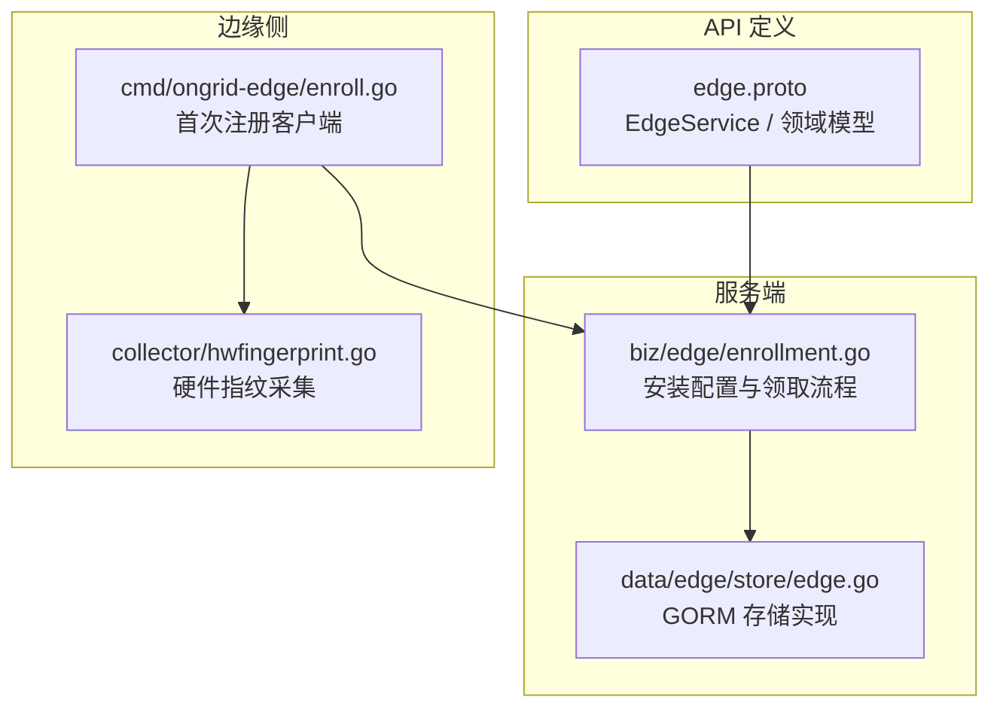
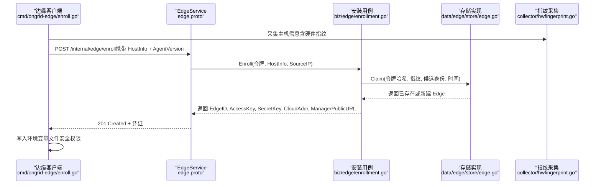
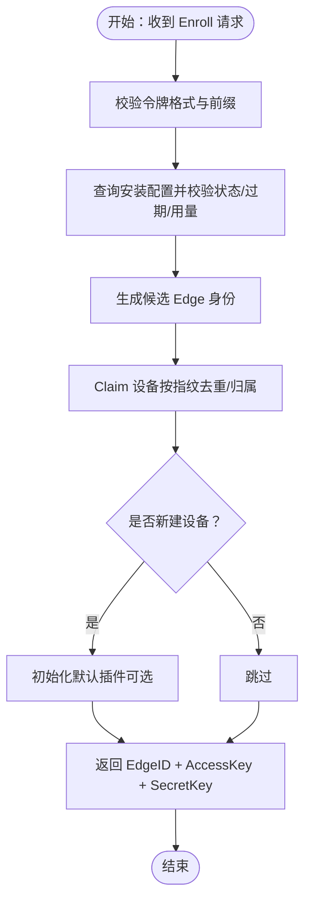
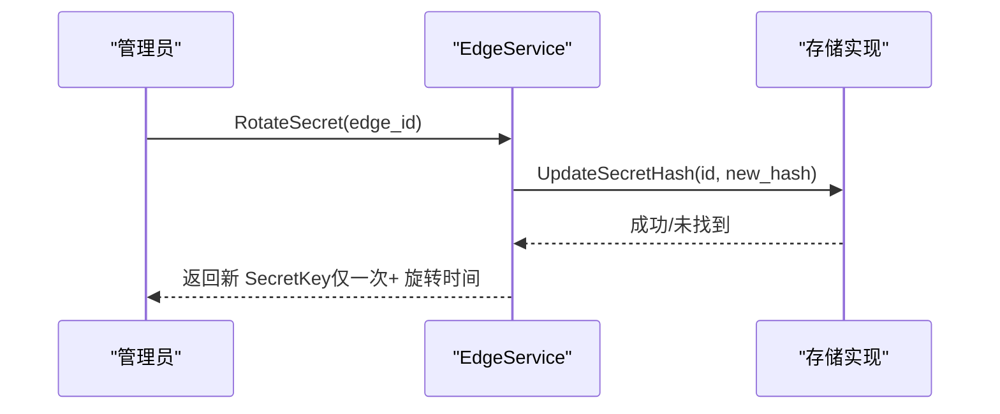
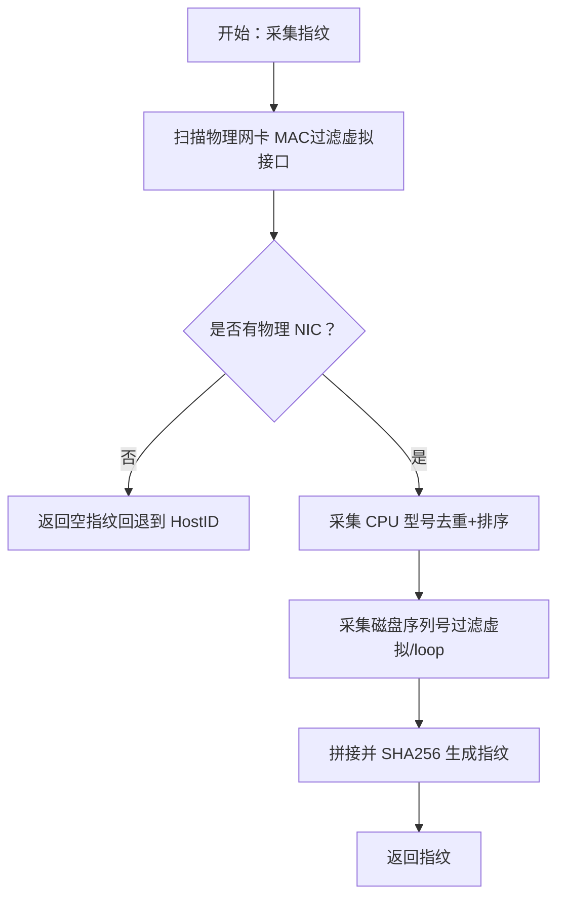
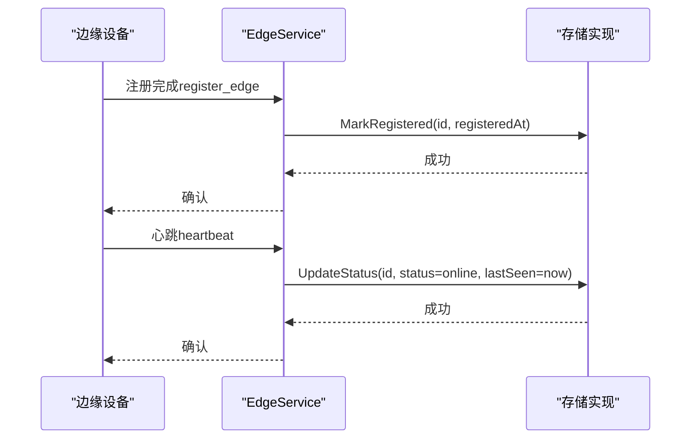
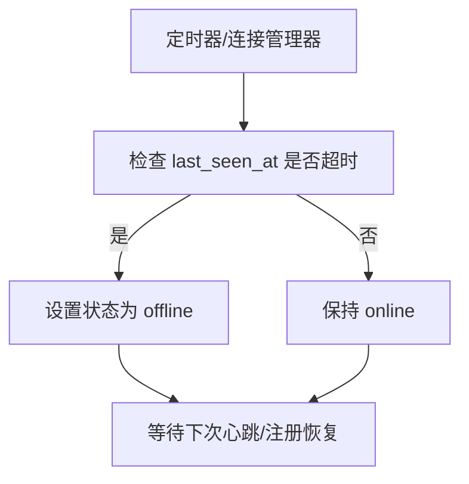
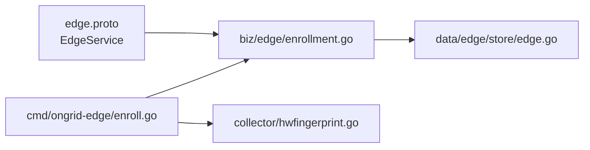

# 边缘代理管理

<cite>
**本文引用的文件**
- [edge.proto](file://api/manager/edge/v1/edge.proto)
- [enrollment.go](file://internal/manager/biz/edge/enrollment.go)
- [hwfingerprint.go](file://internal/edgeagent/collector/hwfingerprint.go)
- [enroll.go](file://cmd/ongrid-edge/enroll.go)
- [edge_store.go](file://internal/manager/data/edge/store/edge.go)
</cite>

## 目录
1. [简介](#简介)
2. [项目结构](#项目结构)
3. [核心组件](#核心组件)
4. [架构总览](#架构总览)
5. [详细组件分析](#详细组件分析)
6. [依赖关系分析](#依赖关系分析)
7. [性能考虑](#性能考虑)
8. [故障排查指南](#故障排查指南)
9. [结论](#结论)
10. [附录：配置与管理操作示例](#附录配置与管理操作示例)

## 简介
本技术文档面向“边缘代理管理系统”，聚焦边缘设备从注册、认证到心跳保活、离线处理与状态同步的完整生命周期。重点覆盖：
- 设备注册流程（注册接口与批量安装）
- 心跳机制与离线判定
- 设备身份认证（AccessKeyID/SecretKey 生成、验证与轮换）
- 设备指纹识别（硬件指纹与主机标识兼容）
- 设备状态同步（在线状态、最后活动时间戳、设备信息维护）
- 批量管理与升级任务
- 故障排查与性能优化建议

## 项目结构
系统围绕以下关键层次组织：
- API 定义层：使用 Protobuf 定义 EdgeService 及领域模型，包括设备、安装配置、升级任务等。
- 业务用例层：实现安装配置（Enrollment）与设备生命周期编排。
- 数据访问层：基于 GORM 的存储实现，负责设备的增删改查、状态更新与关联。
- 边缘侧客户端：命令行工具完成首次注册（Enroll），收集主机信息并获取凭证。
- 指纹采集：在边缘侧采集硬件指纹，用于设备唯一性识别。

图示来源
- [edge.proto:10-61](file://api/manager/edge/v1/edge.proto#L10-L61)
- [enrollment.go:18-45](file://internal/manager/biz/edge/enrollment.go#L18-L45)
- [edge_store.go:15-25](file://internal/manager/data/edge/store/edge.go#L15-L25)
- [enroll.go:25-38](file://cmd/ongrid-edge/enroll.go#L25-L38)
- [hwfingerprint.go:15-41](file://internal/edgeagent/collector/hwfingerprint.go#L15-L41)

章节来源
- [edge.proto:10-61](file://api/manager/edge/v1/edge.proto#L10-L61)

## 核心组件
- 边缘服务 API（EdgeService）：提供创建设备、列表、详情、删除、密钥轮换、批量安装配置、设备领取、批量升级等能力。
- 安装配置（Enrollment）：支持批量安装令牌、有效期、最大使用次数、分配模式（仅批量或集群）。
- 存储（Edge Store）：基于 GORM 的设备持久化，包含状态更新、名称回填、版本记录、软删除等。
- 边缘注册客户端（Enroll）：收集主机信息，调用服务端领取 AccessKey/SecretKey，写入本地环境文件。
- 硬件指纹（HardwareFingerprint）：通过物理网卡 MAC、CPU 型号、磁盘序列号生成稳定指纹，兼容传统 HostID。

章节来源
- [edge.proto:10-61](file://api/manager/edge/v1/edge.proto#L10-L61)
- [enrollment.go:18-45](file://internal/manager/biz/edge/enrollment.go#L18-L45)
- [edge_store.go:15-25](file://internal/manager/data/edge/store/edge.go#L15-L25)
- [enroll.go:25-38](file://cmd/ongrid-edge/enroll.go#L25-L38)
- [hwfingerprint.go:15-41](file://internal/edgeagent/collector/hwfingerprint.go#L15-L41)

## 架构总览
下图展示从边缘侧首次注册到服务端颁发凭证、再到后续心跳与状态同步的整体流程。

图示来源
- [enroll.go:73-140](file://cmd/ongrid-edge/enroll.go#L73-L140)
- [edge.proto:219-230](file://api/manager/edge/v1/edge.proto#L219-L230)
- [enrollment.go:197-260](file://internal/manager/biz/edge/enrollment.go#L197-L260)
- [edge_store.go:15-25](file://internal/manager/data/edge/store/edge.go#L15-L25)
- [hwfingerprint.go:15-41](file://internal/edgeagent/collector/hwfingerprint.go#L15-L41)

## 详细组件分析

### 设备注册与批量安装（HandleRegister / Enroll）
- 首次注册入口：边缘侧通过命令行工具发起注册请求，携带 HostInfo（包含硬件指纹）与 AgentVersion。
- 令牌校验：服务端校验安装令牌前缀与长度，计算令牌哈希后查询安装配置，检查状态、过期时间与使用次数。
- 设备身份生成：根据主机名与创建者生成候选身份；若不存在则创建新 Edge，否则复用已有设备。
- 指纹策略：优先使用硬件指纹，若无可用信号则回退到传统主机标识符，确保不同虚拟化环境下可区分。
- 结果返回：仅一次明文返回 AccessKey/SecretKey，并附带 CloudAddr 与 ManagerPublicURL，客户端写入本地环境文件。

图示来源
- [enrollment.go:197-260](file://internal/manager/biz/edge/enrollment.go#L197-L260)
- [enroll.go:73-140](file://cmd/ongrid-edge/enroll.go#L73-L140)
- [edge.proto:219-230](file://api/manager/edge/v1/edge.proto#L219-L230)

章节来源
- [enrollment.go:197-260](file://internal/manager/biz/edge/enrollment.go#L197-L260)
- [enroll.go:73-140](file://cmd/ongrid-edge/enroll.go#L73-L140)
- [edge.proto:219-230](file://api/manager/edge/v1/edge.proto#L219-L230)

### 设备身份认证（AccessKeyID/SecretKey 生成、验证与轮换）
- 生成：首次注册时由服务端生成 AccessKey/SecretKey，SecretKey 仅响应体明文返回一次，服务端仅保存 Argon2id 哈希。
- 验证：后续握手/心跳以 AccessKey 作为公开标识，结合 SecretKey 进行签名或鉴权（具体握手细节由上层协议保证）。
- 轮换：提供 RotateSecret 接口为现有 Edge 重新签发 SecretKey，旧 Secret 立即失效，AccessKey 保持不变。

图示来源
- [edge.proto:27-28](file://api/manager/edge/v1/edge.proto#L27-L28)
- [edge_store.go:123-133](file://internal/manager/data/edge/store/edge.go#L123-L133)

章节来源
- [edge.proto:27-28](file://api/manager/edge/v1/edge.proto#L27-L28)
- [edge_store.go:123-133](file://internal/manager/data/edge/store/edge.go#L123-L133)

### 设备指纹识别算法（HardwareFingerprint 与传统 HostID 兼容）
- 硬件指纹：基于物理网卡 MAC（过滤虚拟接口）、CPU 型号、磁盘序列号，排序并拼接后 SHA256 生成稳定指纹。
- 兼容性：当无法获取物理 NIC 时返回空指纹，调用方回退到传统 HostID，确保云/容器环境仍可注册。
- 稳定性：所有组件排序以保证重启后指纹一致。

图示来源
- [hwfingerprint.go:15-41](file://internal/edgeagent/collector/hwfingerprint.go#L15-L41)
- [hwfingerprint.go:43-102](file://internal/edgeagent/collector/hwfingerprint.go#L43-L102)
- [hwfingerprint.go:104-156](file://internal/edgeagent/collector/hwfingerprint.go#L104-L156)

章节来源
- [hwfingerprint.go:15-41](file://internal/edgeagent/collector/hwfingerprint.go#L15-L41)
- [hwfingerprint.go:43-102](file://internal/edgeagent/collector/hwfingerprint.go#L43-L102)
- [hwfingerprint.go:104-156](file://internal/edgeagent/collector/hwfingerprint.go#L104-L156)

### 设备状态同步（在线状态、最后活动时间戳、设备信息维护）
- 注册完成标记：注册完成后将设备状态置为在线，并记录 last_seen_at 与 last_registered_at，作为会话生成标记。
- 心跳更新：心跳请求使用通用状态更新接口，仅刷新 last_seen_at，不覆盖注册完成时间。
- 名称回填：首次隧道握手时可回填空白名称为主机名，便于管理员识别。
- 设备关联：注册后将 Edge 与 Device 关联，以便后续读取主机事实。

图示来源
- [edge_store.go:135-166](file://internal/manager/data/edge/store/edge.go#L135-L166)
- [edge_store.go:168-181](file://internal/manager/data/edge/store/edge.go#L168-L181)
- [edge_store.go:183-195](file://internal/manager/data/edge/store/edge.go#L183-L195)

章节来源
- [edge_store.go:135-166](file://internal/manager/data/edge/store/edge.go#L135-L166)
- [edge_store.go:168-181](file://internal/manager/data/edge/store/edge.go#L168-L181)
- [edge_store.go:183-195](file://internal/manager/data/edge/store/edge.go#L183-L195)

### 离线处理（HandleOffline）
- 判定依据：服务端通过 last_seen_at 判断设备是否离线（例如超过阈值未上报心跳）。
- 状态切换：将设备状态更新为离线，便于前端展示与告警。
- 清理与恢复：设备再次上线时通过心跳或注册流程恢复在线状态。

说明：离线判定逻辑通常由服务端定时任务或连接管理器触发，此处给出概念流程。

[此图为概念流程，不对应具体源码文件]

## 依赖关系分析
- API 层依赖业务用例：EdgeService 暴露的 RPC 最终落到安装配置与设备管理用例。
- 业务用例依赖存储：安装配置与设备状态变更通过 GORM 存储实现持久化。
- 边缘客户端依赖指纹采集：首次注册需要稳定的主机指纹，避免克隆模板导致设备合并。
- 外部集成：安装配置可绑定集群节点，完成设备拓扑归属（由集群分配器接口约束）。

图示来源
- [edge.proto:10-61](file://api/manager/edge/v1/edge.proto#L10-L61)
- [enrollment.go:18-45](file://internal/manager/biz/edge/enrollment.go#L18-L45)
- [edge_store.go:15-25](file://internal/manager/data/edge/store/edge.go#L15-L25)
- [enroll.go:25-38](file://cmd/ongrid-edge/enroll.go#L25-L38)
- [hwfingerprint.go:15-41](file://internal/edgeagent/collector/hwfingerprint.go#L15-L41)

章节来源
- [edge.proto:10-61](file://api/manager/edge/v1/edge.proto#L10-L61)
- [enrollment.go:18-45](file://internal/manager/biz/edge/enrollment.go#L18-L45)
- [edge_store.go:15-25](file://internal/manager/data/edge/store/edge.go#L15-L25)
- [enroll.go:25-38](file://cmd/ongrid-edge/enroll.go#L25-L38)
- [hwfingerprint.go:15-41](file://internal/edgeagent/collector/hwfingerprint.go#L15-L41)

## 性能考虑
- 批量安装令牌限制：通过 max_uses 控制令牌使用次数，避免滥用与资源浪费。
- 指纹计算开销：硬件指纹涉及系统信息采集，建议在边缘侧缓存结果并在短时间内复用。
- 数据库写放大：心跳仅更新 last_seen_at，注册完成才写入更多字段，减少热点行频繁更新。
- 分页与过滤：列表接口支持分页与状态过滤，降低大数据量下的传输与渲染压力。
- 网络超时与重试：边缘客户端设置合理超时与重试策略，提高弱网环境下的注册成功率。

## 故障排查指南
- 注册失败（HTTP 非 201）：检查 --manager-url 合法性、TLS 配置、令牌是否存在且有效、HostInfo 是否完整。
- 令牌无效或过期：确认安装配置状态为 active、未过期且未耗尽，必要时重新创建。
- 指纹冲突或重复：确认物理 NIC 可识别；若不可用，检查 HostID 回退路径是否正确。
- 心跳不生效：确认 AccessKey/SecretKey 正确、CloudAddr 可达、last_seen_at 是否被更新。
- 密钥轮换问题：RotateSecret 后旧 Secret 立即失效，需确保边缘侧及时更新 SecretKey。
- 名称未回填：首次握手后检查名称是否自动填充为主机名；如为空，手动更新。

章节来源
- [enroll.go:143-188](file://cmd/ongrid-edge/enroll.go#L143-L188)
- [enrollment.go:197-260](file://internal/manager/biz/edge/enrollment.go#L197-L260)
- [edge_store.go:135-181](file://internal/manager/data/edge/store/edge.go#L135-L181)

## 结论
本系统通过清晰的 API 定义、稳健的安装配置机制、稳定的硬件指纹识别与完善的存储实现，实现了边缘代理的全生命周期管理。借助批量安装与升级任务，可高效运维大规模边缘设备。建议在生产环境中严格管理令牌与密钥轮换，并结合监控与日志完善离线检测与告警。

## 附录：配置与管理操作示例
以下为常见管理操作的步骤说明（不涉及具体代码内容）：
- 创建安装配置（批量安装）
  - 调用 CreateEnrollmentProfile，设置 name、assignment_mode、expires_in_hours、max_uses。
  - 返回 enrollment_token（仅一次），将其注入目标主机环境变量。
- 执行首次注册（Enroll）
  - 在目标主机运行 enroll 命令，指定 --manager-url、--output、--cloud-addr-fallback（可选）。
  - 设置 ONGRID_ENROLLMENT_TOKEN 环境变量，执行后会生成包含 AccessKey/SecretKey 的环境文件。
- 查看设备列表与详情
  - 调用 ListEdges/GetEdge，可按 status_filter、name 过滤与分页。
- 轮换密钥
  - 调用 RotateSecret，传入 edge_id，获取新的 SecretKey 并更新边缘侧配置。
- 批量升级
  - 调用 CreateUpgradeJob，指定 target_version、edge_ids 或 cluster_node_id，设置 batch_size。
  - 通过 ListUpgradeJobs/GetUpgradeJob 跟踪进度，必要时 RetryUpgradeJob 重试失败项。

章节来源
- [edge.proto:30-61](file://api/manager/edge/v1/edge.proto#L30-L61)
- [edge.proto:174-230](file://api/manager/edge/v1/edge.proto#L174-L230)
- [edge.proto:232-316](file://api/manager/edge/v1/edge.proto#L232-L316)
- [enroll.go:40-140](file://cmd/ongrid-edge/enroll.go#L40-L140)