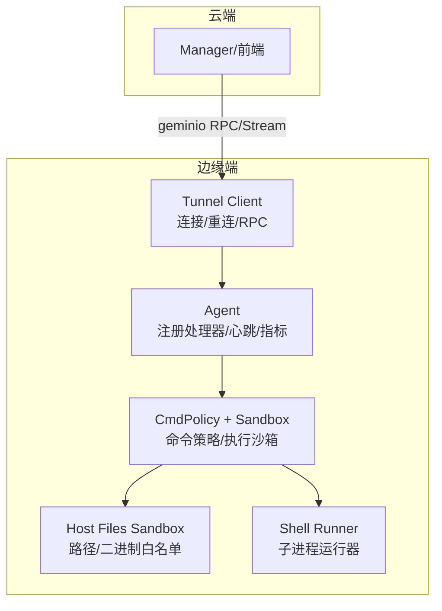
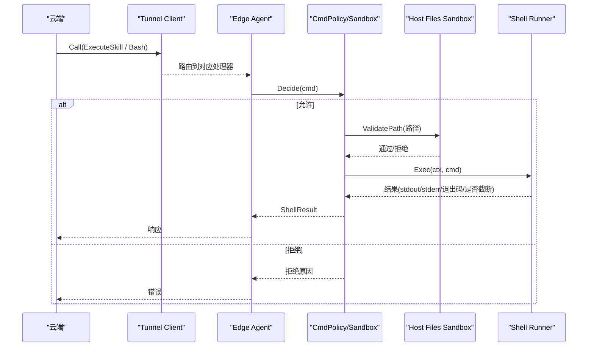
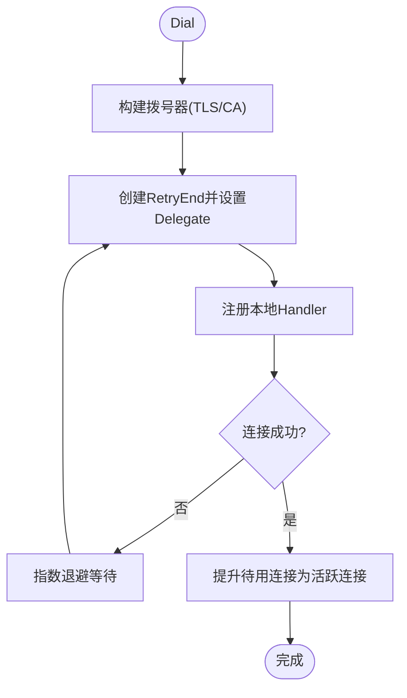
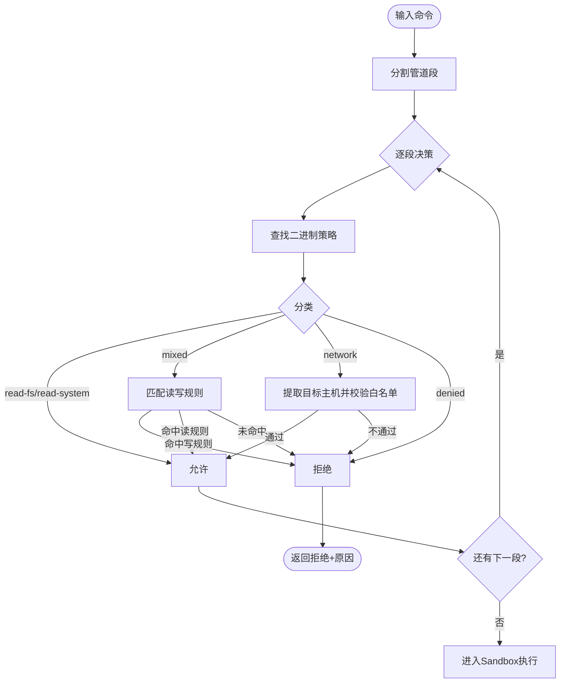
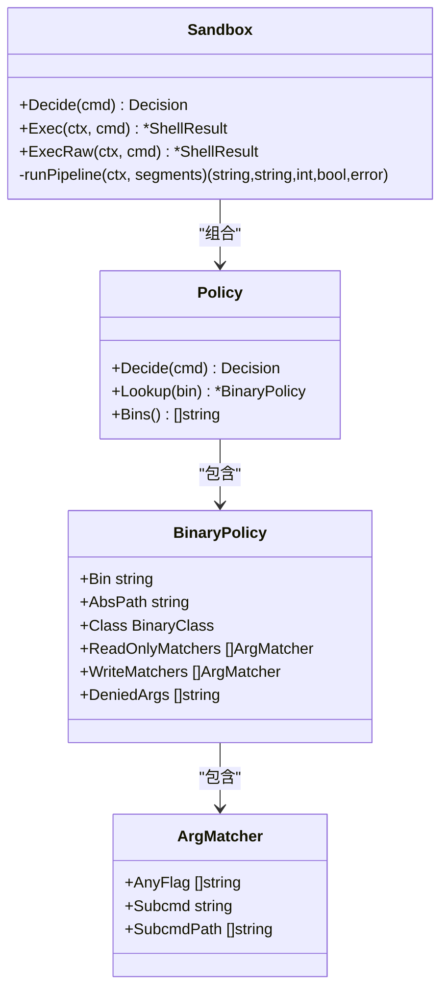
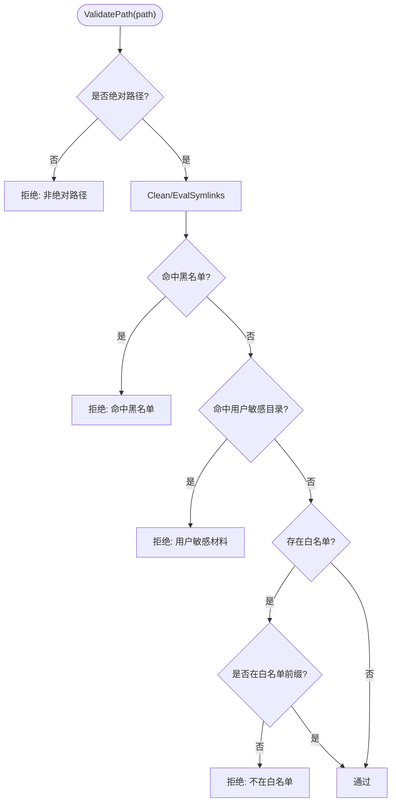
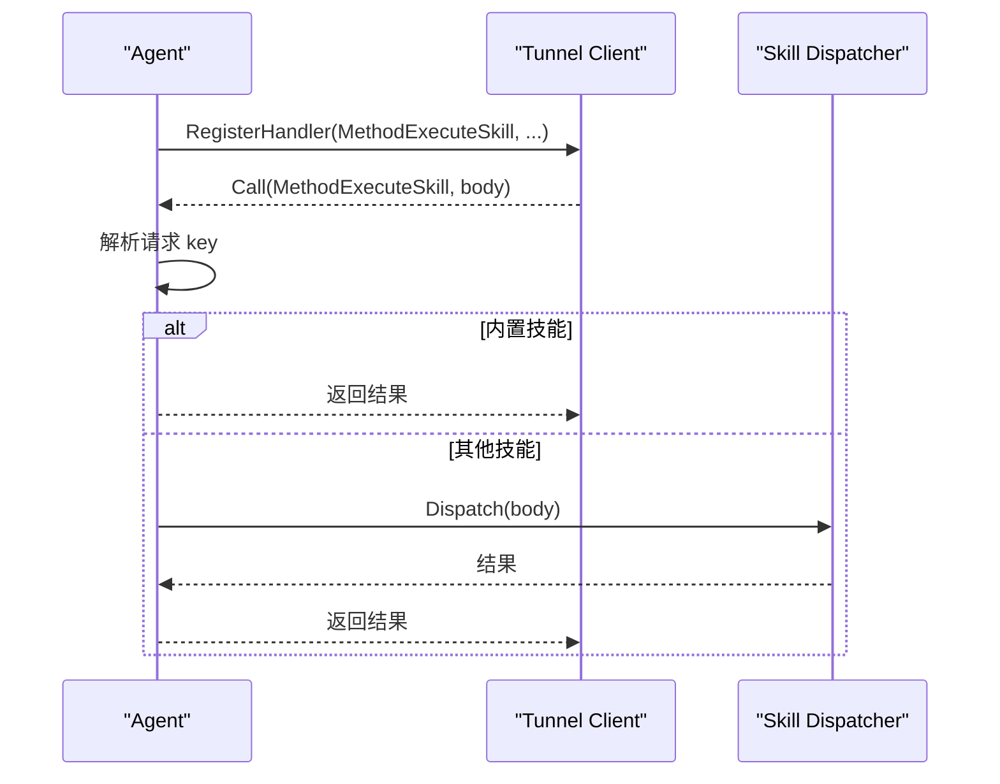
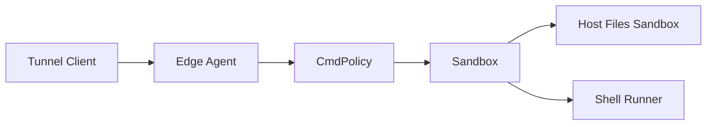

# 远程执行与安全

<cite>
**本文引用的文件**
- [internal/pkg/tunnel/client.go](file://internal/pkg/tunnel/client.go)
- [internal/pkg/tunnel/types.go](file://internal/pkg/tunnel/types.go)
- [internal/edgeagent/biz/agent.go](file://internal/edgeagent/biz/agent.go)
- [internal/edgeagent/cmdpolicy/policy.go](file://internal/edgeagent/cmdpolicy/policy.go)
- [internal/edgeagent/cmdpolicy/sandbox.go](file://internal/edgeagent/cmdpolicy/sandbox.go)
- [internal/edgeagent/cmdpolicy/types.go](file://internal/edgeagent/cmdpolicy/types.go)
- [internal/edgeagent/host_files/sandbox.go](file://internal/edgeagent/host_files/sandbox.go)
- [internal/pkg/runner/shell.go](file://internal/pkg/runner/shell.go)
- [deploy/edge/bash-policy.example.yaml](file://deploy/edge/bash-policy.example.yaml)
</cite>

## 目录
1. [简介](#简介)
2. [项目结构](#项目结构)
3. [核心组件](#核心组件)
4. [架构总览](#架构总览)
5. [详细组件分析](#详细组件分析)
6. [依赖关系分析](#依赖关系分析)
7. [性能考虑](#性能考虑)
8. [故障排查指南](#故障排查指南)
9. [结论](#结论)
10. [附录：API与配置示例](#附录api与配置示例)

## 简介
本技术文档聚焦于远程执行与安全机制，覆盖以下关键主题：
- 远程命令执行的架构设计：隧道建立、命令分发、执行环境隔离
- 沙箱安全机制：文件系统访问控制、进程隔离、资源限制
- 命令策略引擎：白名单机制、参数验证、执行审计
- 文件操作安全保障：路径遍历防护、权限检查、内容过滤
- 远程执行 API 与安全配置示例：如何安全地管理远程设备
- 安全漏洞防护、性能优化与故障排查

## 项目结构
围绕“远程执行与安全”的相关代码主要分布在如下模块：
- 隧道层：负责边缘端与云端的安全连接、重连、RPC 调用与流式通道
- 边缘代理：注册云端下发的 RPC 处理器，驱动技能（skill）调度
- 命令策略与沙箱：对 LLM/工具发起的命令进行白名单校验、参数匹配、网络目标白名单、输出与超时限制
- 文件系统沙箱：对 find/du/stat/ls 等只读命令的路径进行严格校验与受限执行
- 通用子进程运行器：为技能提供统一的隔离执行后端（无内核级隔离，但具备环境变量隔离、输出限制、超时）

图表来源
- [internal/pkg/tunnel/client.go:24-165](file://internal/pkg/tunnel/client.go#L24-L165)
- [internal/edgeagent/biz/agent.go:186-271](file://internal/edgeagent/biz/agent.go#L186-L271)
- [internal/edgeagent/cmdpolicy/sandbox.go:140-188](file://internal/edgeagent/cmdpolicy/sandbox.go#L140-L188)
- [internal/edgeagent/host_files/sandbox.go:135-193](file://internal/edgeagent/host_files/sandbox.go#L135-L193)
- [internal/pkg/runner/shell.go:25-102](file://internal/pkg/runner/shell.go#L25-L102)

章节来源
- [internal/pkg/tunnel/client.go:24-165](file://internal/pkg/tunnel/client.go#L24-L165)
- [internal/edgeagent/biz/agent.go:186-271](file://internal/edgeagent/biz/agent.go#L186-L271)

## 核心组件
- 隧道客户端：封装底层 geminio 重试端点，提供指数退避重连、TLS CA 校验、方法注册与调用、流式通道接受、断线回收与重连回调。
- 边缘代理：在启动前注册云端到边缘的 RPC 处理器；维护心跳与指标上报循环；通过统一 skill 调度入口处理远程技能执行请求。
- 命令策略与沙箱：基于白名单的二进制分类（read-fs/read-system/mixed/network/denied），按参数匹配区分读写语义；结合路径校验和网络目标白名单；执行时管道化子进程、限制输出与超时。
- 文件系统沙箱：对 find/du/stat/ls 等只读命令进行路径白/黑名单校验，解析符号链接，拒绝敏感目录与虚拟文件系统。
- 子进程运行器：为技能提供统一执行后端，替换环境变量、限制工作目录、限制输出大小、超时控制。

章节来源
- [internal/pkg/tunnel/types.go:8-119](file://internal/pkg/tunnel/types.go#L8-L119)
- [internal/edgeagent/cmdpolicy/types.go:41-182](file://internal/edgeagent/cmdpolicy/types.go#L41-L182)
- [internal/edgeagent/host_files/sandbox.go:34-109](file://internal/edgeagent/host_files/sandbox.go#L34-L109)
- [internal/pkg/runner/shell.go:14-102](file://internal/pkg/runner/shell.go#L14-L102)

## 架构总览
远程执行从云端发起，经隧道到达边缘代理，再由策略与沙箱校验后执行具体命令或技能。

图表来源
- [internal/pkg/tunnel/client.go:241-270](file://internal/pkg/tunnel/client.go#L241-L270)
- [internal/edgeagent/biz/agent.go:355-429](file://internal/edgeagent/biz/agent.go#L355-L429)
- [internal/edgeagent/cmdpolicy/sandbox.go:76-132](file://internal/edgeagent/cmdpolicy/sandbox.go#L76-L132)
- [internal/edgeagent/host_files/sandbox.go:135-193](file://internal/edgeagent/host_files/sandbox.go#L135-L193)
- [internal/pkg/runner/shell.go:25-102](file://internal/pkg/runner/shell.go#L25-L102)

## 详细组件分析

### 隧道建立与命令分发
- 连接建立：支持 TLS CA 校验，最小 TLS 版本限制；首次拨号失败采用指数退避（1s 起，上限 60s）。
- 重连与恢复：使用 RetryEnd 自动重连；重连成功后重新注册本地处理器并触发 OnReconnect 回调以重新 register_edge。
- 方法注册：支持在 Dial 前后注册 handler；已连接的实例可动态注册并立即生效。
- 调用与错误：Call 将 JSON 编码的请求发送到云端；若出现远端错误或路由失效，会尝试回收陈旧连接并重试。
- 流式通道：AcceptStream 用于 WebSSH 等双向流转发场景，Meta 携带目标描述。

图表来源
- [internal/pkg/tunnel/client.go:81-165](file://internal/pkg/tunnel/client.go#L81-L165)
- [internal/pkg/tunnel/client.go:167-206](file://internal/pkg/tunnel/client.go#L167-L206)
- [internal/pkg/tunnel/client.go:208-239](file://internal/pkg/tunnel/client.go#L208-L239)
- [internal/pkg/tunnel/client.go:241-270](file://internal/pkg/tunnel/client.go#L241-L270)
- [internal/pkg/tunnel/client.go:290-346](file://internal/pkg/tunnel/client.go#L290-L346)

章节来源
- [internal/pkg/tunnel/client.go:24-165](file://internal/pkg/tunnel/client.go#L24-L165)
- [internal/pkg/tunnel/client.go:208-270](file://internal/pkg/tunnel/client.go#L208-L270)
- [internal/pkg/tunnel/types.go:33-119](file://internal/pkg/tunnel/types.go#L33-L119)

### 命令策略引擎（白名单、参数验证、审计）
- 二进制分类：read-fs、read-system、mixed、network、denied。默认策略内置大量常用诊断命令，shell/脚本/破坏性命令默认拒绝。
- 参数匹配：通过 AnyFlag/Subcmd/SubcmdPath 精确区分读写语义（如 iptables -L vs -A）。
- 全局拒绝参数：针对特定二进制的全局 DeniedArgs（如 awk system()、find -delete、sed -i）。
- 网络目标白名单：对 network 类命令提取目标主机（curl/wget/dig/ping/nc/traceroute），仅当目标在白名单中才放行。
- 路径校验：复用 host_files 的 PathValidator，对所有以 “/” 开头的 argv 参数进行路径合法性检查。
- 输出与超时：每段管道输出限制（stdout/stderr cap），整体调用超时，避免长时占用与内存膨胀。

图表来源
- [internal/edgeagent/cmdpolicy/policy.go:707-800](file://internal/edgeagent/cmdpolicy/policy.go#L707-L800)
- [internal/edgeagent/cmdpolicy/sandbox.go:76-132](file://internal/edgeagent/cmdpolicy/sandbox.go#L76-L132)
- [internal/edgeagent/cmdpolicy/types.go:41-182](file://internal/edgeagent/cmdpolicy/types.go#L41-L182)

章节来源
- [internal/edgeagent/cmdpolicy/policy.go:33-492](file://internal/edgeagent/cmdpolicy/policy.go#L33-L492)
- [internal/edgeagent/cmdpolicy/sandbox.go:76-132](file://internal/edgeagent/cmdpolicy/sandbox.go#L76-L132)
- [internal/edgeagent/cmdpolicy/types.go:41-182](file://internal/edgeagent/cmdpolicy/types.go#L41-L182)
- [deploy/edge/bash-policy.example.yaml:19-178](file://deploy/edge/bash-policy.example.yaml#L19-L178)

### 执行环境隔离（进程隔离与资源限制）
- 管道化执行：将多段命令通过 stdout→stdin 管道串联，最后一段的输出作为最终 stdout，各段 stderr 合并。
- 进程组隔离：设置 Setpgid，便于超时或取消时整组终止。
- 环境变量清洗：仅保留 PATH/LANG/LC_ALL，防止继承父进程敏感环境变量。
- 输出限制：capWriter/capBuffer 限制 stdout/stderr 字节数，超过阈值标记 Truncated。
- 超时控制：context.WithTimeout 限制整个执行时间，超时返回非零退出码并提示。
- 管理员逃逸模式：ExecRaw 绕过策略直接通过 /bin/sh -c 执行，需显式授权（Unrestricted），仍受输出与超时限制。

图表来源
- [internal/edgeagent/cmdpolicy/sandbox.go:52-74](file://internal/edgeagent/cmdpolicy/sandbox.go#L52-L74)
- [internal/edgeagent/cmdpolicy/policy.go:505-544](file://internal/edgeagent/cmdpolicy/policy.go#L505-L544)
- [internal/edgeagent/cmdpolicy/types.go:79-130](file://internal/edgeagent/cmdpolicy/types.go#L79-L130)

章节来源
- [internal/edgeagent/cmdpolicy/sandbox.go:140-188](file://internal/edgeagent/cmdpolicy/sandbox.go#L140-L188)
- [internal/edgeagent/cmdpolicy/sandbox.go:260-342](file://internal/edgeagent/cmdpolicy/sandbox.go#L260-L342)
- [internal/pkg/runner/shell.go:25-102](file://internal/pkg/runner/shell.go#L25-L102)

### 文件系统访问控制（路径遍历防护、权限检查、内容过滤）
- 路径清理与符号链接解析：先 Clean，再尽可能 EvalSymlinks，确保真实路径不被绕过。
- 黑名单优先：拒绝虚拟文件系统（/proc /sys /dev /run）及敏感目录（/etc/shadow、/root/.ssh 等）。
- 可选白名单：当 AllowedReadPaths 非空时，路径必须落在白名单前缀下。
- 用户私钥保护：对 /home/<user>/.ssh 与 .gnupg 进行通配拒绝。
- 二进制白名单：仅允许 find/du/df/stat/ls 等有限命令，缺失则报错。

图表来源
- [internal/edgeagent/host_files/sandbox.go:135-193](file://internal/edgeagent/host_files/sandbox.go#L135-L193)
- [internal/edgeagent/host_files/sandbox.go:195-264](file://internal/edgeagent/host_files/sandbox.go#L195-L264)

章节来源
- [internal/edgeagent/host_files/sandbox.go:34-109](file://internal/edgeagent/host_files/sandbox.go#L34-L109)
- [internal/edgeagent/host_files/sandbox.go:135-193](file://internal/edgeagent/host_files/sandbox.go#L135-L193)
- [internal/edgeagent/host_files/sandbox.go:266-305](file://internal/edgeagent/host_files/sandbox.go#L266-L305)

### 边缘代理与技能调度
- 处理器注册：在 Dial 之前注册所有 cloud->edge 处理器，包括探针、负载查询、抓包、升级、以及统一的 ExecuteSkill 调度。
- 重连回调：每次隧道重建后重新 register_edge，保证 edge_id 绑定正确。
- 心跳与指标：周期性发送心跳与指标，失败时尝试重新注册，连续失败达到阈值视为隧道卡死。
- 技能调度：通过 MethodExecuteSkill 统一分发到内置技能（如抓包），其余由 skill 框架处理。

图表来源
- [internal/edgeagent/biz/agent.go:355-429](file://internal/edgeagent/biz/agent.go#L355-L429)
- [internal/edgeagent/biz/agent.go:186-271](file://internal/edgeagent/biz/agent.go#L186-L271)

章节来源
- [internal/edgeagent/biz/agent.go:186-271](file://internal/edgeagent/biz/agent.go#L186-L271)
- [internal/edgeagent/biz/agent.go:355-429](file://internal/edgeagent/biz/agent.go#L355-L429)

## 依赖关系分析
- 隧道层依赖：geminio 客户端/委托、重试端点、TLS 配置、日志。
- 边缘代理依赖：tunnel.Client、collector（指标采集）、packetcapture、skill 框架。
- 策略与沙箱依赖：os/exec、syscall、net（网络目标解析）、host_files.PathValidator。
- 运行器依赖：os/exec、bytes.Buffer、context。

图表来源
- [internal/pkg/tunnel/client.go:24-165](file://internal/pkg/tunnel/client.go#L24-L165)
- [internal/edgeagent/biz/agent.go:186-271](file://internal/edgeagent/biz/agent.go#L186-L271)
- [internal/edgeagent/cmdpolicy/sandbox.go:140-188](file://internal/edgeagent/cmdpolicy/sandbox.go#L140-L188)
- [internal/edgeagent/host_files/sandbox.go:135-193](file://internal/edgeagent/host_files/sandbox.go#L135-L193)
- [internal/pkg/runner/shell.go:25-102](file://internal/pkg/runner/shell.go#L25-L102)

章节来源
- [internal/pkg/tunnel/client.go:24-165](file://internal/pkg/tunnel/client.go#L24-L165)
- [internal/edgeagent/biz/agent.go:186-271](file://internal/edgeagent/biz/agent.go#L186-L271)

## 性能考虑
- 隧道重连：指数退避与最大退避上限避免风暴；连接生命周期由 RetryEnd 管理，减少重复建链开销。
- 管道执行：并行启动子进程并通过管道连接，减少中间文件 IO；仅捕获必要输出。
- 输出限制：capWriter/capBuffer 防止大输出导致 OOM；Truncated 标志提示上层按需调整。
- 超时控制：上下文超时避免长时间占用资源；管道中段异常（如 SIGPIPE）被视作正常中断。
- 策略预解析：二进制绝对路径在策略构造时解析，减少运行时查找成本。

[本节为通用指导，无需特定文件引用]

## 故障排查指南
- 隧道无法连接：检查 ServerAddr/CloudAddr、AccessKey/SecretKey、TLSCAFile；关注 Dial 失败日志与退避间隔。
- 重连频繁：确认网络稳定性；观察 RecycleBrokenRoute 是否因路由失效而关闭连接。
- 命令被拒绝：查看 Policy.Decide 返回 Reason；确认二进制是否在白名单、参数是否命中写规则、网络目标是否在 allowlist。
- 路径访问被拒：检查 ValidatePath 拒绝原因（非绝对路径、命中黑名单、不在白名单、用户敏感目录）。
- 执行超时：检查 Timeout 配置；必要时拆分命令或优化上游逻辑。
- 输出过大：根据 Truncated 标志调整 StdoutCap/StderrCap 或改用分页/采样命令。

章节来源
- [internal/pkg/tunnel/client.go:81-165](file://internal/pkg/tunnel/client.go#L81-L165)
- [internal/pkg/tunnel/client.go:322-361](file://internal/pkg/tunnel/client.go#L322-L361)
- [internal/edgeagent/cmdpolicy/policy.go:707-800](file://internal/edgeagent/cmdpolicy/policy.go#L707-L800)
- [internal/edgeagent/host_files/sandbox.go:135-193](file://internal/edgeagent/host_files/sandbox.go#L135-L193)
- [internal/edgeagent/cmdpolicy/sandbox.go:140-188](file://internal/edgeagent/cmdpolicy/sandbox.go#L140-L188)

## 结论
该远程执行与安全体系通过“隧道 + 策略 + 沙箱 + 运行器”的分层设计，实现了：
- 安全的远程通信与自动恢复能力
- 严格的命令白名单与参数语义判别
- 细粒度的文件系统访问控制与敏感数据保护
- 可控的执行环境与资源限制
- 可扩展的技能调度与审计能力

在生产环境中建议：
- 启用最小化的网络目标白名单与路径白名单
- 定期审查 bash-policy.yaml 扩展项
- 监控隧道健康与命令拒绝日志
- 对高风险操作启用管理员逃逸模式的审批流程

[本节为总结，无需特定文件引用]

## 附录：API与配置示例

### 远程执行 API（概念说明）
- 云端到边缘的 RPC：通过 tunnel.Client.Call 调用 MethodExecuteSkill 等方法，传入技能键与参数体。
- 流式通道：通过 AcceptStream 打开双向流，用于 WebSSH 等场景。
- 处理器注册：在边缘侧通过 RegisterHandler 注册云到边的处理方法。

章节来源
- [internal/pkg/tunnel/types.go:68-119](file://internal/pkg/tunnel/types.go#L68-L119)
- [internal/edgeagent/biz/agent.go:355-429](file://internal/edgeagent/biz/agent.go#L355-L429)

### 安全配置示例（bash-policy.yaml）
- 二进制白名单与分类：定义 read-fs/read-system/mixed/network/denied 类别，并为 mixed/network 指定读写匹配规则。
- 网络目标白名单：通过 network_host_allowlist 配置 CIDR 或域名后缀。
- 资源限制：stdout_cap_bytes、stderr_cap_bytes、timeout_seconds、max_argv_length。
- 路径白名单：path_allowlist 限定命令可访问的绝对路径前缀。

章节来源
- [deploy/edge/bash-policy.example.yaml:19-178](file://deploy/edge/bash-policy.example.yaml#L19-L178)