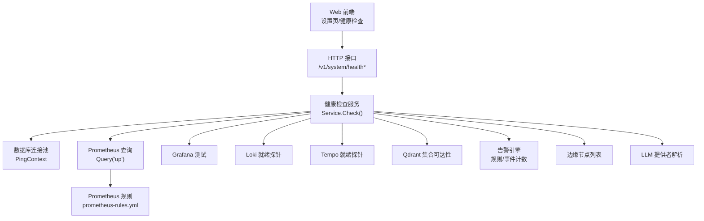
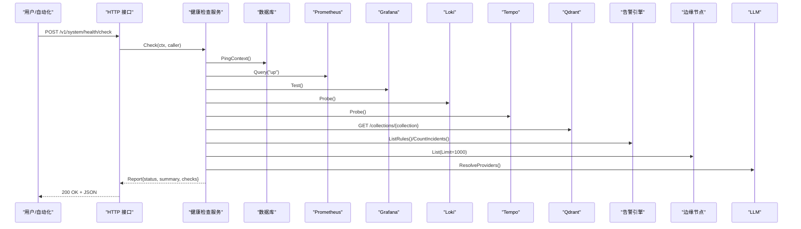
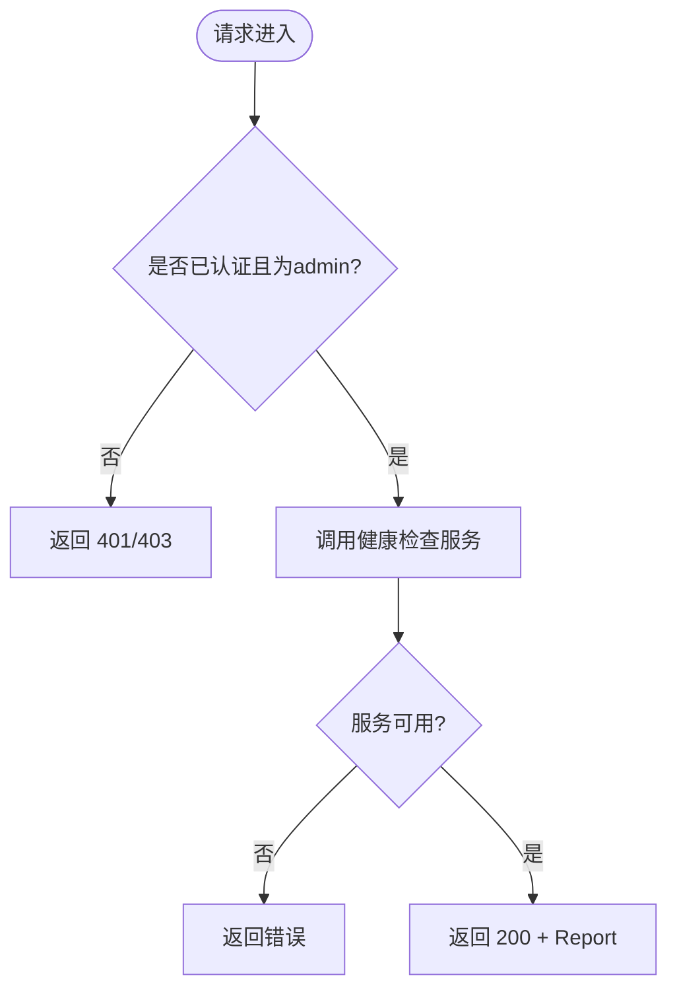
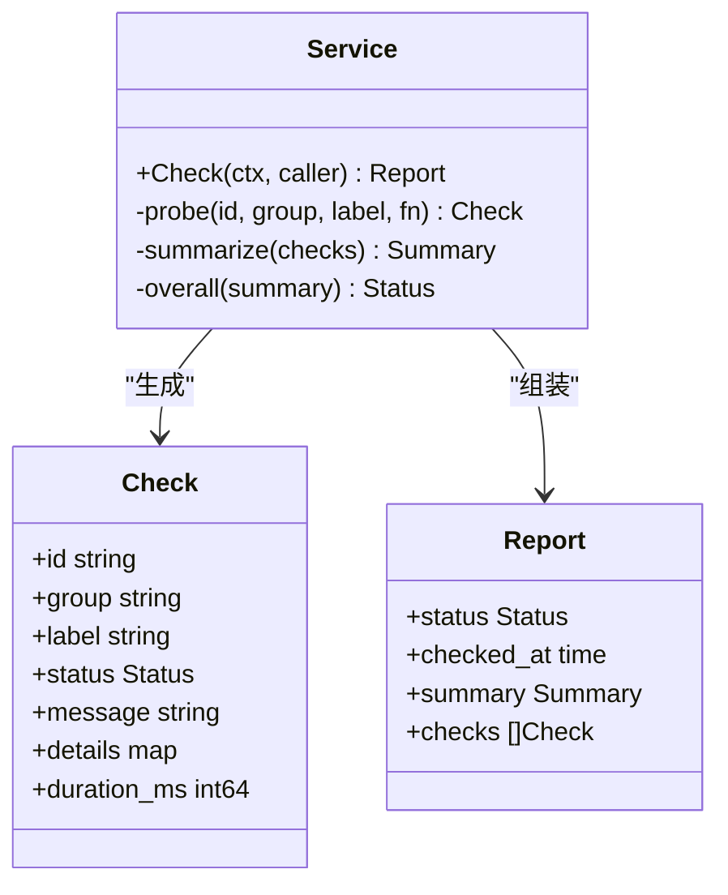
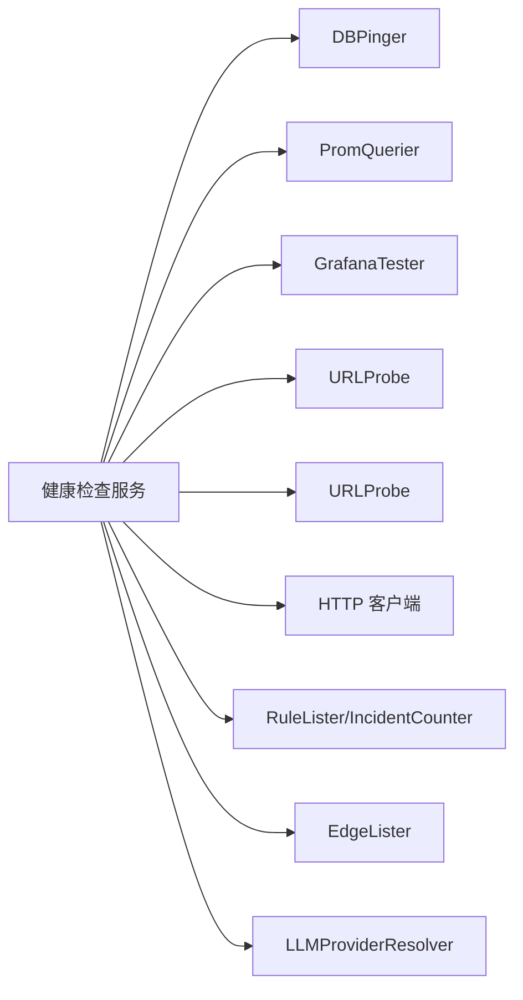

# 健康检查

<cite>
**本文引用的文件**
- [internal/manager/server/systemhealth/http.go](file://internal/manager/server/systemhealth/http.go)
- [internal/manager/server/systemhealth/http_test.go](file://internal/manager/server/systemhealth/http_test.go)
- [internal/manager/service/systemhealth/service.go](file://internal/manager/service/systemhealth/service.go)
- [web/src/api/systemHealth.ts](file://web/src/api/systemHealth.ts)
- [web/src/pages/settings/Health.tsx](file://web/src/pages/settings/Health.tsx)
- [deploy/install/prometheus.yml](file://deploy/install/prometheus.yml)
- [deploy/install/prometheus-rules.yml](file://deploy/install/prometheus-rules.yml)
- [internal/edgeagent/collector/doc.go](file://internal/edgeagent/collector/doc.go)
- [internal/manager/biz/alert/usecase.go](file://internal/manager/biz/alert/usecase.go)
- [internal/manager/model/alert/model.go](file://internal/manager/model/alert/model.go)
- [internal/manager/data/alert/store/seed.go](file://internal/manager/data/alert/store/seed.go)
- [skills/restart-service/SKILL.md](file://skills/restart-service/SKILL.md)
- [internal/manager/biz/aiops/tools/restart_service_basetool.go](file://internal/manager/biz/aiops/tools/restart_service_basetool.go)
</cite>

## 目录
1. [简介](#简介)
2. [项目结构](#项目结构)
3. [核心组件](#核心组件)
4. [架构总览](#架构总览)
5. [详细组件分析](#详细组件分析)
6. [依赖关系分析](#依赖关系分析)
7. [性能考量](#性能考量)
8. [故障排查指南](#故障排查指南)
9. [结论](#结论)
10. [附录](#附录)

## 简介
本文件面向“健康检查系统”，系统性说明平台侧的主动探测、被动监控与健康状态评估机制，覆盖健康检查端点、指标暴露、告警规则配置与通知策略、以及故障恢复（自动重启、服务降级、灾难恢复）等主题。文档同时提供最佳实践与常见问题解决方案，帮助运维与开发者快速定位并解决问题。

## 项目结构
健康检查能力由“HTTP 接口层 + 健康检查服务 + 前端展示”三部分构成，并与 Prometheus/Loki/Tempo/Grafana/Qdrant/LLM/Edge 等外部依赖集成；同时通过 Prometheus 规则实现被动监控与告警。

图表来源
- [internal/manager/server/systemhealth/http.go:30-33](file://internal/manager/server/systemhealth/http.go#L30-L33)
- [internal/manager/service/systemhealth/service.go:132-154](file://internal/manager/service/systemhealth/service.go#L132-L154)
- [deploy/install/prometheus.yml:16-25](file://deploy/install/prometheus.yml#L16-L25)
- [deploy/install/prometheus-rules.yml:7-79](file://deploy/install/prometheus-rules.yml#L7-L79)

章节来源
- [internal/manager/server/systemhealth/http.go:30-33](file://internal/manager/server/systemhealth/http.go#L30-L33)
- [internal/manager/service/systemhealth/service.go:132-154](file://internal/manager/service/systemhealth/service.go#L132-L154)
- [deploy/install/prometheus.yml:16-25](file://deploy/install/prometheus.yml#L16-L25)
- [deploy/install/prometheus-rules.yml:7-79](file://deploy/install/prometheus-rules.yml#L7-L79)

## 核心组件
- HTTP 接口层：注册 GET/POST /v1/system/health 与 /v1/system/health/check，仅管理员可调用，返回统一健康报告。
- 健康检查服务：聚合多项子检查（数据库、Prometheus、Grafana、Loki、Tempo、Qdrant、Frontier、告警引擎、边缘节点、LLM、Embedding），输出整体状态与明细。
- 前端展示：设置页触发健康检查并分组渲染结果，支持手动刷新与最小间隔控制。
- 被动监控：Prometheus 采集 manager 自暴露指标，加载内置规则进行告警。
- 告警通知：基于规则与渠道配置发送通知，支持抑制窗口与最少触发次数。
- 故障恢复：通过技能与工具链对允许的服务执行重启，受审阅流程保护。

章节来源
- [internal/manager/server/systemhealth/http.go:30-63](file://internal/manager/server/systemhealth/http.go#L30-L63)
- [internal/manager/service/systemhealth/service.go:19-117](file://internal/manager/service/systemhealth/service.go#L19-L117)
- [web/src/pages/settings/Health.tsx:125-152](file://web/src/pages/settings/Health.tsx#L125-L152)
- [deploy/install/prometheus.yml:16-25](file://deploy/install/prometheus.yml#L16-L25)
- [deploy/install/prometheus-rules.yml:7-79](file://deploy/install/prometheus-rules.yml#L7-L79)
- [internal/manager/biz/alert/usecase.go:1408-1443](file://internal/manager/biz/alert/usecase.go#L1408-L1443)
- [skills/restart-service/SKILL.md:1-82](file://skills/restart-service/SKILL.md#L1-L82)

## 架构总览
健康检查采用“主动探测 + 被动监控”的双轨模式：
- 主动探测：HTTP 接口触发 Service.Check，逐项探测依赖可用性，汇总为 Report。
- 被动监控：Prometheus 定期抓取 manager 指标，按规则产生告警并通知。

图表来源
- [internal/manager/server/systemhealth/http.go:30-49](file://internal/manager/server/systemhealth/http.go#L30-L49)
- [internal/manager/service/systemhealth/service.go:132-154](file://internal/manager/service/systemhealth/service.go#L132-L154)
- [internal/manager/service/systemhealth/service.go:166-386](file://internal/manager/service/systemhealth/service.go#L166-L386)

## 详细组件分析

### 健康检查 HTTP 接口
- 路由：GET/POST /v1/system/health 与 /v1/system/health/check
- 鉴权：仅 admin 角色可访问；未认证返回未授权，非管理员返回禁止
- 响应：成功时返回健康报告 JSON；错误时返回标准错误体

图表来源
- [internal/manager/server/systemhealth/http.go:30-63](file://internal/manager/server/systemhealth/http.go#L30-L63)
- [internal/manager/server/systemhealth/http_test.go:41-87](file://internal/manager/server/systemhealth/http_test.go#L41-L87)

章节来源
- [internal/manager/server/systemhealth/http.go:30-63](file://internal/manager/server/systemhealth/http.go#L30-L63)
- [internal/manager/server/systemhealth/http_test.go:41-87](file://internal/manager/server/systemhealth/http_test.go#L41-L87)

### 健康检查服务（主动探测）
- 检查项：Manager API、数据库、Prometheus、Grafana、Loki、Tempo、Qdrant、Frontier、告警引擎、边缘节点、LLM、Embedding
- 超时控制：每项检查使用配置的探针超时，超时将标记失败
- 状态聚合：按 Failed > Degraded > Unknown > OK 的优先级计算整体状态
- 详情字段：每个检查包含 id、group、label、status、message、details、duration_ms

图表来源
- [internal/manager/service/systemhealth/service.go:19-117](file://internal/manager/service/systemhealth/service.go#L19-L117)
- [internal/manager/service/systemhealth/service.go:388-442](file://internal/manager/service/systemhealth/service.go#L388-L442)

章节来源
- [internal/manager/service/systemhealth/service.go:132-154](file://internal/manager/service/systemhealth/service.go#L132-L154)
- [internal/manager/service/systemhealth/service.go:166-386](file://internal/manager/service/systemhealth/service.go#L166-L386)
- [internal/manager/service/systemhealth/service.go:388-442](file://internal/manager/service/systemhealth/service.go#L388-L442)

### 前端健康检查页面
- 调用：POST /system/health/check（前端封装函数）
- 展示：按组分组显示检查结果，支持手动刷新与最小刷新间隔
- 类型定义：HealthStatus、HealthCheck、HealthSummary、HealthReport

章节来源
- [web/src/api/systemHealth.ts:1-31](file://web/src/api/systemHealth.ts#L1-L31)
- [web/src/pages/settings/Health.tsx:125-152](file://web/src/pages/settings/Health.tsx#L125-L152)

### 被动监控与指标暴露
- 采集目标：Prometheus 抓取 prometheus 自身与 ongrid-manager（端口 9100）
- 规则文件：挂载 prometheus-rules.yml，包含 manager 存活、LLM 错误率、DB 池饱和、告警评估器停滞、API 5xx 比率等规则
- 指标来源：边端主机/进程指标通过隧道推送到远端（remote_write），云侧 Prometheus 负责采集与评估

章节来源
- [deploy/install/prometheus.yml:1-36](file://deploy/install/prometheus.yml#L1-L36)
- [deploy/install/prometheus-rules.yml:1-79](file://deploy/install/prometheus-rules.yml#L1-L79)
- [internal/edgeagent/collector/doc.go:1-21](file://internal/edgeagent/collector/doc.go#L1-L21)

### 告警规则与通知策略
- 规则维度：支持阈值、持续时间、严重级别、作用域与组合条件
- 通知抑制：支持通知窗口秒数与最少触发次数，避免告警风暴
- 渠道匹配：按严重级别与范围过滤通知渠道，支持默认渠道与环境变量注入
- 投递记录：对持久化渠道记录投递 ID，未配置目的地则跳过以避免噪音

章节来源
- [deploy/install/prometheus-rules.yml:7-79](file://deploy/install/prometheus-rules.yml#L7-L79)
- [internal/manager/biz/alert/usecase.go:1408-1443](file://internal/manager/biz/alert/usecase.go#L1408-L1443)
- [internal/manager/model/alert/model.go:345-366](file://internal/manager/model/alert/model.go#L345-L366)
- [internal/manager/data/alert/store/seed.go:13-37](file://internal/manager/data/alert/store/seed.go#L13-L37)

### 故障恢复机制
- 自动重启：通过“重启服务”技能与 BaseTool，在允许白名单内对 systemd 服务执行重启
- 审阅流程：写操作需经过 reviewer 二审，确保变更安全可控
- 降级与隔离：健康检查中若某依赖不可用，对应检查项标记为 degraded/failed，不影响其他检查
- 灾难恢复：结合日志/指标/追踪（Loki/Tempo）与告警通道，快速定位并恢复

章节来源
- [skills/restart-service/SKILL.md:1-82](file://skills/restart-service/SKILL.md#L1-L82)
- [internal/manager/biz/aiops/tools/restart_service_basetool.go:113-143](file://internal/manager/biz/aiops/tools/restart_service_basetool.go#L113-L143)
- [internal/manager/service/systemhealth/service.go:178-236](file://internal/manager/service/systemhealth/service.go#L178-L236)

## 依赖关系分析
健康检查服务对外部依赖采用接口抽象，便于替换与测试；各检查项独立执行，互不影响。

图表来源
- [internal/manager/service/systemhealth/service.go:52-95](file://internal/manager/service/systemhealth/service.go#L52-L95)

章节来源
- [internal/manager/service/systemhealth/service.go:52-95](file://internal/manager/service/systemhealth/service.go#L52-L95)

## 性能考量
- 探针超时：每项检查均受探针超时限制，避免阻塞整体健康检查
- 采样限制：边缘节点列表检查限制最大样本数量，降低数据库压力
- 指标采集间隔：Prometheus 全局与 job 级采集间隔合理设置，避免过载
- 前端刷新：设置页最小刷新间隔防止频繁请求

章节来源
- [internal/manager/service/systemhealth/service.go:97-130](file://internal/manager/service/systemhealth/service.go#L97-L130)
- [internal/manager/service/systemhealth/service.go:315-354](file://internal/manager/service/systemhealth/service.go#L315-L354)
- [deploy/install/prometheus.yml:6-8](file://deploy/install/prometheus.yml#L6-L8)
- [web/src/pages/settings/Health.tsx:125-152](file://web/src/pages/settings/Health.tsx#L125-L152)

## 故障排查指南
- 接口鉴权失败
  - 现象：返回 401/403
  - 处理：确认请求上下文包含 admin 角色
  - 参考：[http.go:52-63](file://internal/manager/server/systemhealth/http.go#L52-L63)
- 数据库不可达
  - 现象：database 检查 failed
  - 处理：检查连接池配置与网络连通性
  - 参考：[service.go:166-176](file://internal/manager/service/systemhealth/service.go#L166-L176)
- Prometheus 不可用
  - 现象：prometheus 检查 failed
  - 处理：确认服务运行与查询可达
  - 参考：[service.go:178-188](file://internal/manager/service/systemhealth/service.go#L178-L188)
- Grafana 未配置或失败
  - 现象：grafana 检查 degraded/failed
  - 处理：检查 root_url、token/api_key 配置
  - 参考：[service.go:190-212](file://internal/manager/service/systemhealth/service.go#L190-L212)
- Loki/Tempo 不可达
  - 现象：loki/tempo 检查 failed
  - 处理：检查启用开关与地址可达性
  - 参考：[service.go:214-236](file://internal/manager/service/systemhealth/service.go#L214-L236)
- Qdrant 集合不可达
  - 现象：qdrant 检查 failed
  - 处理：检查 URL 与集合名，确认 HTTP 响应码
  - 参考：[service.go:238-263](file://internal/manager/service/systemhealth/service.go#L238-L263)
- 告警引擎异常
  - 现象：alert_engine 检查 failed/degraded
  - 处理：检查规则是否存在、评估器是否运行、是否有打开的事件
  - 参考：[service.go:275-313](file://internal/manager/service/systemhealth/service.go#L275-L313)
- 边缘节点全部离线
  - 现象：edges 检查 failed
  - 处理：检查边缘在线状态与通信链路
  - 参考：[service.go:315-354](file://internal/manager/service/systemhealth/service.go#L315-L354)
- 指标与告警
  - 现象：Prometheus 规则触发告警
  - 处理：查看规则注解中的描述与建议
  - 参考：[prometheus-rules.yml:12-79](file://deploy/install/prometheus-rules.yml#L12-L79)

章节来源
- [internal/manager/server/systemhealth/http.go:52-63](file://internal/manager/server/systemhealth/http.go#L52-L63)
- [internal/manager/service/systemhealth/service.go:166-354](file://internal/manager/service/systemhealth/service.go#L166-L354)
- [deploy/install/prometheus-rules.yml:12-79](file://deploy/install/prometheus-rules.yml#L12-L79)

## 结论
健康检查系统通过统一的 HTTP 接口暴露平台健康状态，结合主动探测与被动监控，形成完整的可观测性与自愈能力。借助清晰的检查项划分、严格的鉴权与超时控制、合理的指标采集与告警抑制策略，以及安全的故障恢复流程，能够有效支撑平台的稳定运行与快速排障。

## 附录

### 健康检查端点规范
- 路径
  - GET /v1/system/health
  - POST /v1/system/health/check
- 鉴权
  - 需要 admin 角色；未认证返回 401，非管理员返回 403
- 成功响应
  - 状态码：200
  - 内容：健康报告 JSON（包含 status、checked_at、summary、checks）
- 失败响应
  - 状态码：401/403/500（依据错误类型）
  - 内容：标准错误体

章节来源
- [internal/manager/server/systemhealth/http.go:30-49](file://internal/manager/server/systemhealth/http.go#L30-L49)
- [internal/manager/server/systemhealth/http_test.go:41-87](file://internal/manager/server/systemhealth/http_test.go#L41-L87)

### 健康报告数据结构
- 顶层字段
  - status：整体健康状态（ok/degraded/failed/unknown）
  - checked_at：检查时间（UTC）
  - summary：各状态计数（ok/degraded/failed/unknown）
  - checks：检查项数组
- 检查项字段
  - id：检查唯一标识
  - group：分组（core/observability/data/automation/edge/ai）
  - label：人类可读名称
  - status：单项状态
  - message：简要信息
  - details：扩展信息（键值对）
  - duration_ms：耗时（毫秒）

章节来源
- [internal/manager/service/systemhealth/service.go:19-50](file://internal/manager/service/systemhealth/service.go#L19-L50)
- [web/src/api/systemHealth.ts:3-27](file://web/src/api/systemHealth.ts#L3-L27)

### 监控指标与规则
- 采集目标
  - prometheus 自身：/prometheus/metrics
  - ongrid-manager：端口 9100
- 内置规则示例
  - manager 存活、LLM 错误率、DB 池饱和、告警评估器停滞、API 5xx 比率
- 边端指标
  - 主机/进程指标经隧道推送至远端，供云侧 Prometheus 采集

章节来源
- [deploy/install/prometheus.yml:16-25](file://deploy/install/prometheus.yml#L16-L25)
- [deploy/install/prometheus-rules.yml:12-79](file://deploy/install/prometheus-rules.yml#L12-L79)
- [internal/edgeagent/collector/doc.go:1-21](file://internal/edgeagent/collector/doc.go#L1-L21)

### 告警通知与抑制
- 通知渠道
  - Webhook、Slack、飞书、钉钉等，支持环境变量注入与 UI 管理
- 抑制策略
  - 通知窗口秒数与最少触发次数，避免重复通知
- 渠道匹配
  - 按严重级别与作用域过滤，支持默认渠道

章节来源
- [internal/manager/model/alert/model.go:345-366](file://internal/manager/model/alert/model.go#L345-L366)
- [internal/manager/data/alert/store/seed.go:13-37](file://internal/manager/data/alert/store/seed.go#L13-L37)
- [internal/manager/biz/alert/usecase.go:1408-1443](file://internal/manager/biz/alert/usecase.go#L1408-L1443)

### 故障恢复最佳实践
- 重启前准备
  - 收集现场证据（线程转储/core dump）后再重启，便于事后分析
- 白名单与审阅
  - 仅允许白名单内的服务重启，且必须经过审阅流程
- 降级优先
  - 优先尝试降级或隔离问题组件，再考虑重启
- 恢复验证
  - 重启后通过健康检查与指标观察确认恢复

章节来源
- [skills/restart-service/SKILL.md:1-82](file://skills/restart-service/SKILL.md#L1-L82)
- [internal/manager/biz/aiops/tools/restart_service_basetool.go:113-143](file://internal/manager/biz/aiops/tools/restart_service_basetool.go#L113-L143)