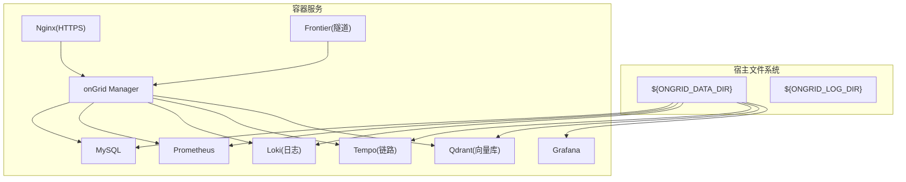
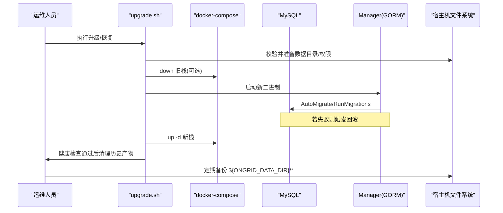
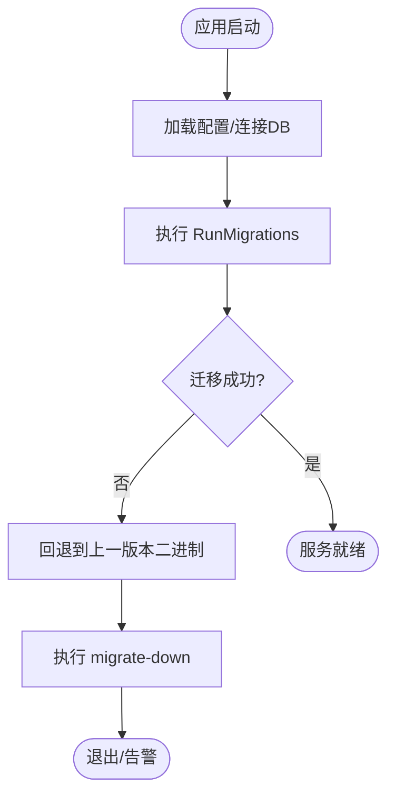
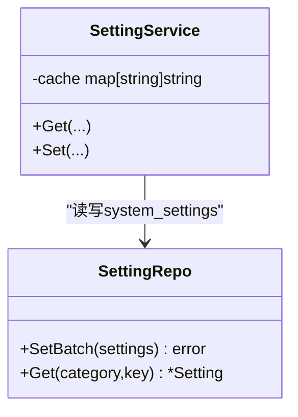
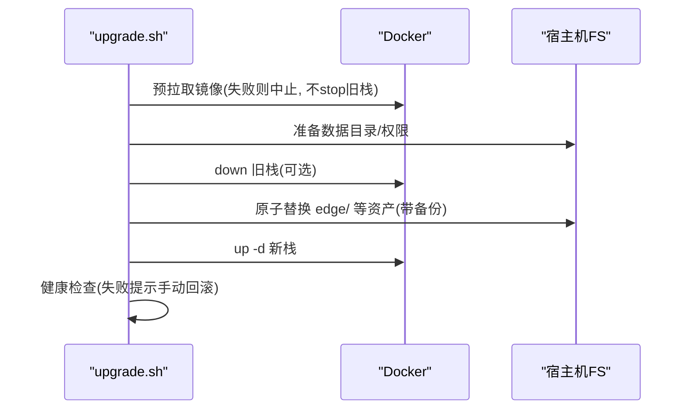
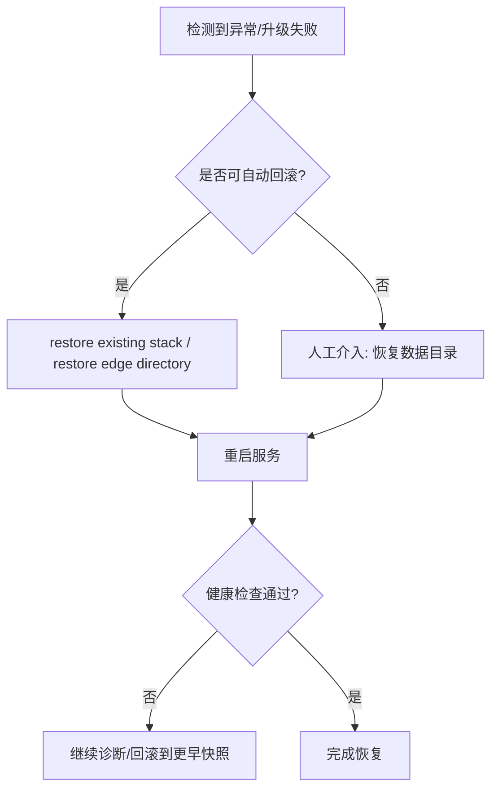
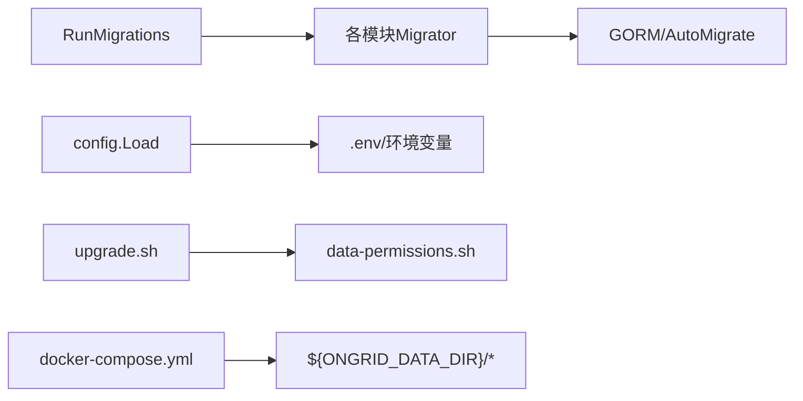

# 备份恢复

<cite>
**本文引用的文件**
- [db/README.md](file://db/README.md)
- [internal/pkg/dbx/migrate.go](file://internal/pkg/dbx/migrate.go)
- [internal/pkg/dbx/soft_delete.go](file://internal/pkg/dbx/soft_delete.go)
- [internal/manager/data/logs/store/migrate.go](file://internal/manager/data/logs/store/migrate.go)
- [internal/manager/data/setting/store/repo.go](file://internal/manager/data/setting/store/repo.go)
- [internal/manager/data/setting/store/migrate.go](file://internal/manager/data/setting/store/migrate.go)
- [internal/manager/biz/setting/service.go](file://internal/manager/biz/setting/service.go)
- [internal/manager/biz/logs/service.go](file://internal/manager/biz/logs/service.go)
- [internal/pkg/config/config.go](file://internal/pkg/config/config.go)
- [deploy/install/docker-compose.yml](file://deploy/install/docker-compose.yml)
- [deploy/install/upgrade.sh](file://deploy/install/upgrade.sh)
- [deploy/install/install.sh](file://deploy/install/install.sh)
- [deploy/install/data-permissions.sh](file://deploy/install/data-permissions.sh)
- [scripts/test-upgrade-data-permissions.sh](file://scripts/test-upgrade-data-permissions.sh)
- [internal/edgeagent/plugins/databasemetrics/secrets.go](file://internal/edgeagent/plugins/databasemetrics/secrets.go)
- [internal/pkg/tunnel/messages.go](file://internal/pkg/tunnel/messages.go)
- [internal/manager/model/k8s/model.go](file://internal/manager/model/k8s/model.go)
- [web/src/pages/Kubernetes.tsx](file://web/src/pages/Kubernetes.tsx)
</cite>

## 目录
1. [简介](#简介)
2. [项目结构](#项目结构)
3. [核心组件](#核心组件)
4. [架构总览](#架构总览)
5. [详细组件分析](#详细组件分析)
6. [依赖关系分析](#依赖关系分析)
7. [性能考虑](#性能考虑)
8. [故障排查指南](#故障排查指南)
9. [结论](#结论)
10. [附录](#附录)

## 简介
本指南面向生产运维与平台工程团队，系统化说明 ongrid 的备份与恢复策略。内容覆盖：
- 数据库备份策略：全量、增量与实时（基于迁移与快照）
- 数据迁移机制：版本管理、迁移脚本执行与回滚
- 配置文件与用户数据备份：系统配置、业务配置、密钥与可观测性数据
- 容器化环境备份：数据卷、镜像管理与状态持久化
- 灾难恢复流程：故障检测、数据恢复与服务重建
- 备份验证与恢复演练方法

## 项目结构
ongrid 采用“服务+数据+部署”的分层组织：
- 数据层：MySQL（生产）、SQLite（本地/测试），通过 GORM 与 golang-migrate 管理 schema 演进
- 应用层：Manager/Edge 等 Go 服务，提供设置、日志、遥测、K8s 快照等能力
- 部署层：docker-compose 编排 MySQL/Prometheus/Loki/Tempo/Grafana/Qdrant 等，所有有状态数据以 host bind mount 形式落地到 ${ONGRID_DATA_DIR}
- 安装与升级：install.sh/upgrade.sh 负责资源准备、权限修复、原子替换、健康检查与自动回滚

图表来源
- [deploy/install/docker-compose.yml:21-528](file://deploy/install/docker-compose.yml#L21-L528)

章节来源
- [deploy/install/docker-compose.yml:21-528](file://deploy/install/docker-compose.yml#L21-L528)

## 核心组件
- 数据库迁移与软删除：统一迁移入口、向后兼容的数据表字段填充、软删除标记回填
- 系统设置与配置：集中式 key/value 配置存储，支持批量事务写入与缓存
- 日志后端版本化：多代配置与选择切换，保证读写不中断
- 安装与升级：预检、原子替换、权限修复、健康检查与自动回滚
- 容器化数据持久化：所有有状态服务通过 host bind mount 落盘，便于外部备份与迁移
- 边缘侧密钥与临时文件：安全地预留、回滚临时文件，避免脏写

章节来源
- [internal/pkg/dbx/migrate.go:12-47](file://internal/pkg/dbx/migrate.go#L12-L47)
- [internal/pkg/dbx/soft_delete.go:48-102](file://internal/pkg/dbx/soft_delete.go#L48-L102)
- [internal/manager/data/logs/store/migrate.go:10-30](file://internal/manager/data/logs/store/migrate.go#L10-L30)
- [internal/manager/data/setting/store/repo.go:66-96](file://internal/manager/data/setting/store/repo.go#L66-L96)
- [internal/manager/biz/logs/service.go:320-340](file://internal/manager/biz/logs/service.go#L320-L340)
- [deploy/install/upgrade.sh:492-760](file://deploy/install/upgrade.sh#L492-L760)
- [deploy/install/install.sh:536-639](file://deploy/install/install.sh#L536-L639)
- [internal/edgeagent/plugins/databasemetrics/secrets.go:639-678](file://internal/edgeagent/plugins/databasemetrics/secrets.go#L639-L678)

## 架构总览
下图展示备份与恢复在 ongrid 中的关键路径：数据落盘位置、迁移执行点、升级回滚点以及外部备份工具接入点。

图表来源
- [deploy/install/upgrade.sh:492-760](file://deploy/install/upgrade.sh#L492-L760)
- [internal/pkg/dbx/migrate.go:20-47](file://internal/pkg/dbx/migrate.go#L20-L47)
- [deploy/install/docker-compose.yml:21-528](file://deploy/install/docker-compose.yml#L21-L528)

## 详细组件分析

### 数据库备份策略（全量/增量/实时）
- 全量备份
  - 直接备份 MySQL 数据目录：宿主机挂载路径为 ${ONGRID_DATA_DIR}/mysql
  - 建议停机或开启只读后使用 xtrabackup/mysqldump；也可对整盘快照
- 增量备份
  - 启用 MySQL binlog，结合时间点恢复实现增量回放
  - 配合定时任务将 binlog 归档至对象存储
- 实时备份
  - 利用 golang-migrate 的 .up/.down 脚本作为“逻辑快照”基线
  - 每次变更先提交迁移脚本，再发布新版本二进制，确保可回溯
  - 对于非结构化大对象（Prometheus TSDB/Loki/Tempo），按服务独立备份其数据目录

章节来源
- [deploy/install/docker-compose.yml:21-528](file://deploy/install/docker-compose.yml#L21-L528)
- [db/README.md:1-15](file://db/README.md#L1-L15)
- [internal/pkg/dbx/migrate.go:20-47](file://internal/pkg/dbx/migrate.go#L20-L47)

### 数据迁移机制（版本管理/执行/回滚）
- 版本管理
  - 生产 MySQL 使用 db/migrations 下的命名规范脚本，配合 golang-migrate
  - 本地/首次安装使用 GORM AutoMigrate 初始化空库
- 执行流程
  - 应用启动时调用 RunMigrations，顺序执行各模块的 Migrator
  - 针对新增列/索引的兼容性，提供 BackfillDeleteMarkerWithValue 等回填工具
- 回滚策略
  - 两步回滚：先回退到不读取新列的二进制版本，再执行 migrate-down
  - 对特定表进行索引/列级回退，保证一致性

图表来源
- [internal/pkg/dbx/migrate.go:20-47](file://internal/pkg/dbx/migrate.go#L20-L47)
- [db/README.md:1-15](file://db/README.md#L1-L15)
- [internal/pkg/dbx/soft_delete.go:48-102](file://internal/pkg/dbx/soft_delete.go#L48-L102)
- [internal/manager/data/logs/store/migrate.go:10-30](file://internal/manager/data/logs/store/migrate.go#L10-L30)

章节来源
- [db/README.md:1-15](file://db/README.md#L1-L15)
- [internal/pkg/dbx/migrate.go:20-47](file://internal/pkg/dbx/migrate.go#L20-L47)
- [internal/pkg/dbx/soft_delete.go:48-102](file://internal/pkg/dbx/soft_delete.go#L48-L102)
- [internal/manager/data/logs/store/migrate.go:10-30](file://internal/manager/data/logs/store/migrate.go#L10-L30)

### 配置文件与用户数据备份
- 系统配置
  - 环境变量与 .env：由 install.sh/upgrade.sh 生成与更新，包含数据库、JWT、LLM、通知等
  - 运行时配置：Manager 从环境变量加载，部分配置（如 Grafana 集成）首启后落库 system_settings
- 用户数据与业务配置
  - system_settings：键值型配置，支持批量事务 upsert，适合导出/导入
  - 日志后端配置：支持多代配置与选择切换，保留 Generation 用于并发安全
- 密钥与敏感信息
  - 密钥保存在 .env 中，不落库明文；HLD-017 要求 at-rest 加密
  - 边缘侧插件在写入敏感文件前会预留临时路径并在失败时回滚

图表来源
- [internal/manager/data/setting/store/repo.go:66-96](file://internal/manager/data/setting/store/repo.go#L66-L96)
- [internal/manager/biz/setting/service.go:39-72](file://internal/manager/biz/setting/service.go#L39-L72)

章节来源
- [internal/pkg/config/config.go:18-63](file://internal/pkg/config/config.go#L18-L63)
- [internal/manager/data/setting/store/repo.go:66-96](file://internal/manager/data/setting/store/repo.go#L66-L96)
- [internal/manager/biz/setting/service.go:39-72](file://internal/manager/biz/setting/service.go#L39-L72)
- [internal/manager/biz/logs/service.go:320-340](file://internal/manager/biz/logs/service.go#L320-L340)
- [internal/edgeagent/plugins/databasemetrics/secrets.go:639-678](file://internal/edgeagent/plugins/databasemetrics/secrets.go#L639-L678)

### 容器化环境备份方案
- 数据卷备份
  - 所有有状态服务均通过 host bind mount 持久化到 ${ONGRID_DATA_DIR} 下子目录：mysql、prometheus、loki、tempo、grafana、qdrant 等
  - 日志输出到 ${ONGRID_LOG_DIR}，便于外部采集与归档
- 镜像管理
  - 升级前预拉取所需镜像，失败不中断旧栈；升级成功后仅保留当前版本镜像
- 状态持久化
  - Edge 资产目录在升级前备份，失败自动还原
  - 权限修复失败时尝试恢复原有 stack，保障最小可用

图表来源
- [deploy/install/upgrade.sh:209-238](file://deploy/install/upgrade.sh#L209-L238)
- [deploy/install/upgrade.sh:492-760](file://deploy/install/upgrade.sh#L492-L760)
- [deploy/install/install.sh:536-639](file://deploy/install/install.sh#L536-L639)

章节来源
- [deploy/install/docker-compose.yml:21-528](file://deploy/install/docker-compose.yml#L21-L528)
- [deploy/install/upgrade.sh:209-238](file://deploy/install/upgrade.sh#L209-L238)
- [deploy/install/upgrade.sh:492-760](file://deploy/install/upgrade.sh#L492-L760)
- [deploy/install/install.sh:536-639](file://deploy/install/install.sh#L536-L639)

### 灾难恢复流程
- 故障检测
  - 升级脚本内置健康检查（HTTP /healthz），超时即判定失败
  - 权限修复失败时尝试恢复现有 stack
- 数据恢复
  - 优先从 ${ONGRID_DATA_DIR} 对应服务目录恢复（例如 mysql/prometheus/loki/tempo/grafana/qdrant）
  - 对 MySQL 可使用 binlog 回放实现近实时恢复
- 服务重建
  - 恢复数据后，重新执行 docker compose up -d
  - 若 Edge 资产损坏，使用 upgrade.sh 生成的备份目录自动还原

图表来源
- [deploy/install/upgrade.sh:492-760](file://deploy/install/upgrade.sh#L492-L760)
- [deploy/install/data-permissions.sh:174-209](file://deploy/install/data-permissions.sh#L174-L209)

章节来源
- [deploy/install/upgrade.sh:492-760](file://deploy/install/upgrade.sh#L492-L760)
- [deploy/install/data-permissions.sh:174-209](file://deploy/install/data-permissions.sh#L174-L209)

### 备份验证方法与恢复测试流程
- 备份有效性验证
  - 定期在新环境中用备份数据拉起服务，校验关键指标（登录、查询、可视化）
  - 对 MySQL 执行 mysqldump 校验与 binlog 回放演练
  - 对 TSDB（Prometheus/Loki/Tempo）校验 WAL/块完整性
- 恢复演练
  - 模拟升级失败：故意制造权限错误/镜像不可达，验证自动回滚与提示
  - 模拟 Edge 资产损坏：验证 ongrid_restore_edge_directory 是否能正确还原
  - 模拟数据目录缺失：验证 ongrid_prepare_data_directories_or_restore 是否能恢复现有 stack

章节来源
- [scripts/test-upgrade-data-permissions.sh:196-250](file://scripts/test-upgrade-data-permissions.sh#L196-L250)
- [deploy/install/data-permissions.sh:174-209](file://deploy/install/data-permissions.sh#L174-L209)

## 依赖关系分析
- 迁移与数据层
  - RunMigrations 串联各模块的 Migrator，确保顺序执行与错误定位
  - Soft delete 与 Backfill 工具保障历史数据兼容
- 配置与运行期
  - config.Load 统一从环境变量装配，compose 注入默认值
  - system_settings 提供运行时可编辑的配置项
- 部署与恢复
  - upgrade.sh 强依赖 data-permissions.sh 提供的权限修复与回滚函数
  - docker-compose 将所有有状态服务绑定到宿主机目录，形成统一的备份边界

图表来源
- [internal/pkg/dbx/migrate.go:20-47](file://internal/pkg/dbx/migrate.go#L20-L47)
- [internal/pkg/config/config.go:414-549](file://internal/pkg/config/config.go#L414-L549)
- [deploy/install/upgrade.sh:492-760](file://deploy/install/upgrade.sh#L492-L760)
- [deploy/install/docker-compose.yml:21-528](file://deploy/install/docker-compose.yml#L21-L528)

章节来源
- [internal/pkg/dbx/migrate.go:20-47](file://internal/pkg/dbx/migrate.go#L20-L47)
- [internal/pkg/config/config.go:414-549](file://internal/pkg/config/config.go#L414-L549)
- [deploy/install/upgrade.sh:492-760](file://deploy/install/upgrade.sh#L492-L760)
- [deploy/install/docker-compose.yml:21-528](file://deploy/install/docker-compose.yml#L21-L528)

## 性能考虑
- 数据库迁移
  - 大表加列/建索引建议在低峰期执行，必要时分批次
  - 使用 BackfillDeleteMarkerWithValue 等工具减少锁竞争
- 备份窗口
  - MySQL 全量备份尽量在只读窗口或冷备快照下进行
  - TSDB 备份需评估磁盘 IO 峰值，必要时限速或离线拷贝
- 升级过程
  - 预拉取镜像与预构建 Edge 资产，降低停机时间
  - 健康检查超时合理设置，避免误判

[本节为通用指导，无需具体文件引用]

## 故障排查指南
- 升级失败
  - 查看 upgrade.sh 输出的健康检查日志与回滚提示
  - 确认 .env 中必要密钥已补齐（如 JWT、GRAFANA_ADMIN_PASSWORD 等）
- 权限问题
  - 使用 --repair-permissions 修复数据目录所有权
  - 若修复失败，尝试 ongrid_restore_existing_stack 恢复原栈
- Edge 资产异常
  - 使用 ongrid_restore_edge_directory 从备份目录还原
- 数据不一致
  - 核对迁移脚本执行记录，必要时执行 migrate-down 回退
  - 对 TSDB 校验 WAL/块完整性，必要时从最近快照恢复

章节来源
- [deploy/install/upgrade.sh:492-760](file://deploy/install/upgrade.sh#L492-L760)
- [deploy/install/data-permissions.sh:174-209](file://deploy/install/data-permissions.sh#L174-L209)
- [scripts/test-upgrade-data-permissions.sh:196-250](file://scripts/test-upgrade-data-permissions.sh#L196-L250)

## 结论
ongrid 通过“host bind mount + 迁移脚本 + 原子升级 + 健康检查 + 自动回滚”的组合，提供了稳健的备份与恢复能力。建议：
- 将 ${ONGRID_DATA_DIR} 纳入企业级备份体系，按服务粒度制定 RPO/RTO
- 定期演练恢复流程，覆盖 MySQL、TSDB、配置与 Edge 资产
- 严格管理迁移脚本与版本发布节奏，确保可回滚

[本节为总结，无需具体文件引用]

## 附录

### 关键路径速查
- 数据落盘位置：${ONGRID_DATA_DIR}/{mysql,prometheus,loki,tempo,grafana,qdrant,...}
- 日志落盘位置：${ONGRID_LOG_DIR}
- 迁移入口：RunMigrations（各模块 Migrator）
- 升级与回滚：upgrade.sh（含权限修复与 Edge 资产回滚）
- 配置来源：.env 与 system_settings

章节来源
- [deploy/install/docker-compose.yml:21-528](file://deploy/install/docker-compose.yml#L21-L528)
- [internal/pkg/dbx/migrate.go:20-47](file://internal/pkg/dbx/migrate.go#L20-L47)
- [deploy/install/upgrade.sh:492-760](file://deploy/install/upgrade.sh#L492-L760)