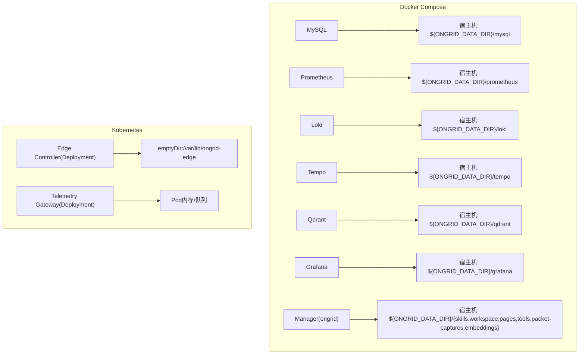
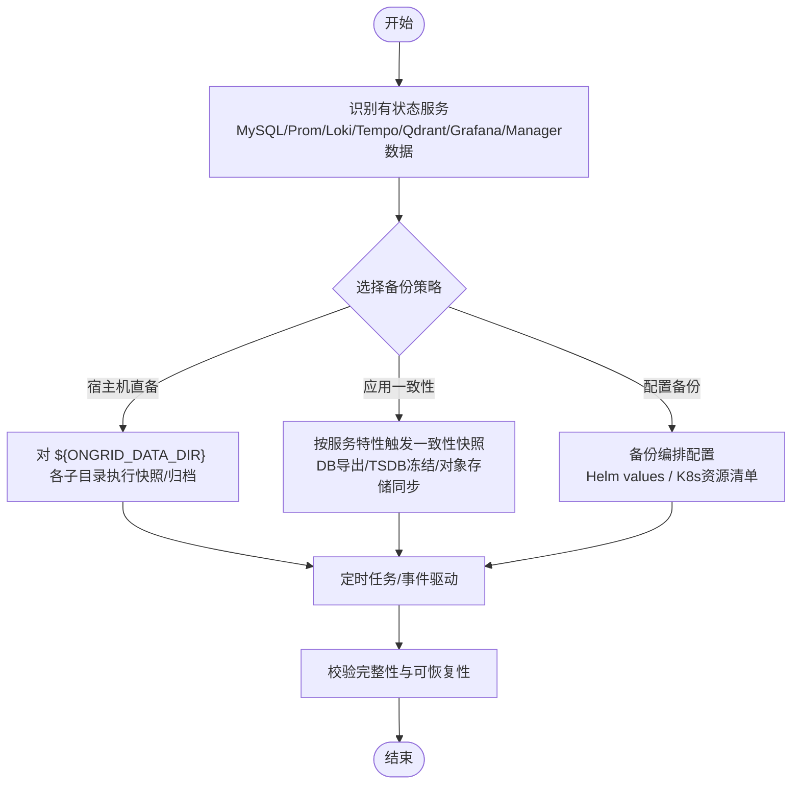
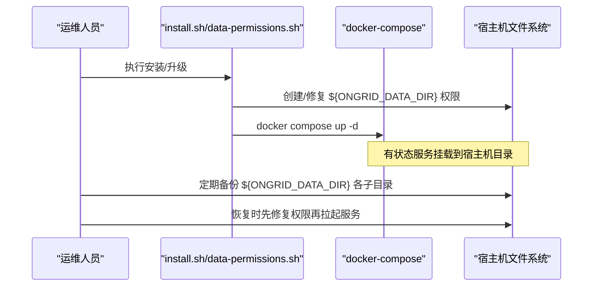
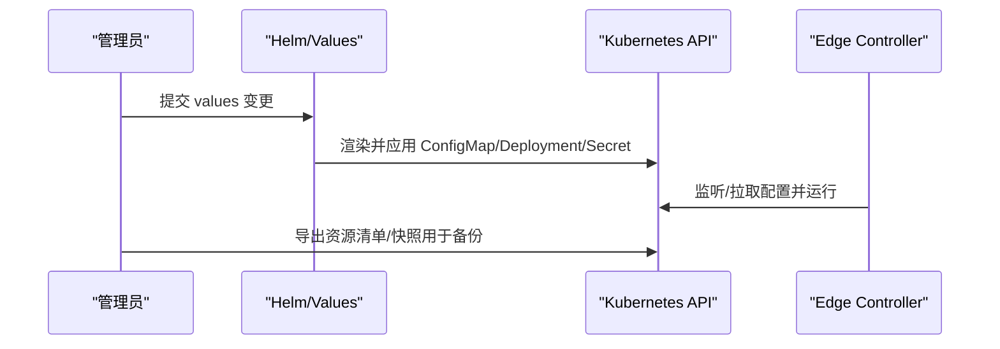
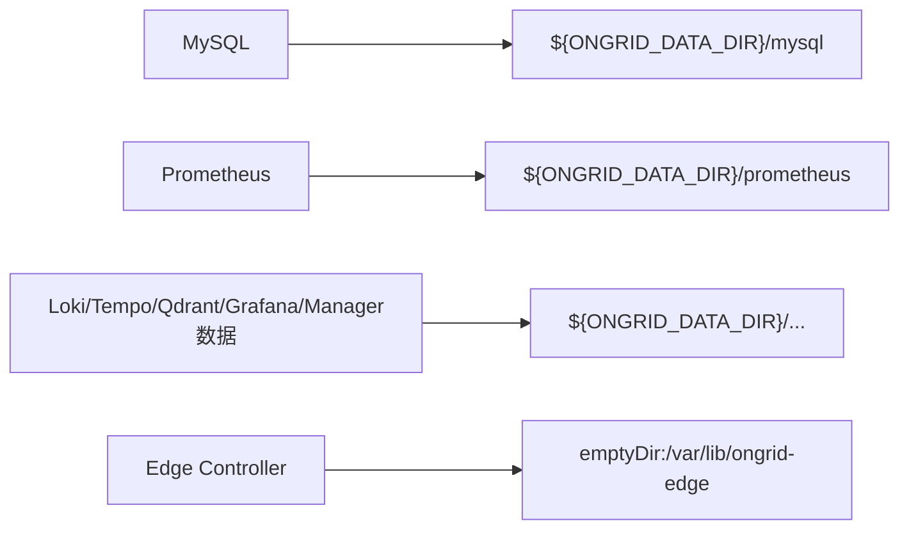
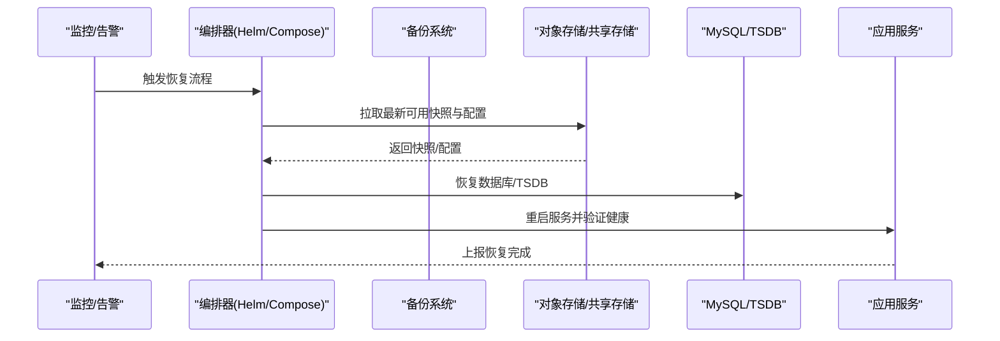

# 容器化备份

<cite>
**本文引用的文件**
- [README.md](file://README.md)
- [docker-compose.yml](file://deploy/install/docker-compose.yml)
- [install.sh](file://deploy/install/install.sh)
- [data-permissions.sh](file://deploy/install/data-permissions.sh)
- [upgrade.sh](file://deploy/install/upgrade.sh)
- [values.yaml](file://deploy/kubernetes/ongrid-edge/values.yaml)
- [deployment.yaml](file://deploy/kubernetes/ongrid-edge/templates/deployment.yaml)
- [configmap.yaml](file://deploy/kubernetes/ongrid-edge/templates/configmap.yaml)
- [messages.go](file://internal/pkg/tunnel/messages.go)
- [query_k8s_snapshot.go](file://internal/manager/biz/aiops/tools/query_k8s_snapshot.go)
</cite>

## 目录
1. [简介](#简介)
2. [项目结构](#项目结构)
3. [核心组件](#核心组件)
4. [架构总览](#架构总览)
5. [详细组件分析](#详细组件分析)
6. [依赖关系分析](#依赖关系分析)
7. [性能与容量规划](#性能与容量规划)
8. [故障排查指南](#故障排查指南)
9. [结论](#结论)
10. [附录：灾难恢复流程与脚本建议](#附录灾难恢复流程与脚本建议)

## 简介
本指南面向在容器化环境中运行 Ongrid 的运维团队，提供覆盖 Docker Compose 与 Kubernetes 两种部署形态的完整备份策略。内容涵盖数据卷备份、镜像管理、状态持久化、编排配置备份（Deployment/Service/ConfigMap/Secret）、无状态与有状态服务的差异化策略、云原生集成（CSI、对象存储、跨集群复制）以及灾难恢复流程与自动化脚本建议。文档严格基于仓库中现有实现进行说明，并在需要处给出可操作的实践建议。

## 项目结构
Ongrid 提供两套主要部署方式：
- Docker Compose 生产包：通过 install.sh 安装，所有有状态服务的数据均通过 bind mount 到宿主机的 ${ONGRID_DATA_DIR} 下，便于直接备份。
- Kubernetes Helm Chart：通过 ongrid-edge Chart 部署控制器与遥测网关等组件；当前控制器使用 emptyDir 作为临时状态，适合无状态或短生命周期缓存。

图表来源
- [docker-compose.yml:21-528](file://deploy/install/docker-compose.yml#L21-L528)
- [deployment.yaml:18-193](file://deploy/kubernetes/ongrid-edge/templates/deployment.yaml#L18-L193)

章节来源
- [docker-compose.yml:21-528](file://deploy/install/docker-compose.yml#L21-L528)
- [deployment.yaml:18-193](file://deploy/kubernetes/ongrid-edge/templates/deployment.yaml#L18-L193)

## 核心组件
- 有状态服务（需重点备份）
  - MySQL：数据库元数据、用户、告警规则、工作流定义等。
  - Prometheus：时序指标数据（默认保留 90 天/20GB）。
  - Loki：日志数据。
  - Tempo：链路追踪数据。
  - Qdrant：向量知识库/RAG 集合。
  - Grafana：仪表盘、数据源、告警等配置。
  - Manager 业务数据：技能、工作区、页面、PCAP 工件、嵌入模型缓存等。
- 无状态/轻状态服务（以镜像和配置为主）
  - Edge Controller：仅用 emptyDir 做短期状态，适合通过重新拉起恢复。
  - Telemetry Gateway：内存队列与批处理，重启后从上游重放或重建。

章节来源
- [docker-compose.yml:21-528](file://deploy/install/docker-compose.yml#L21-L528)
- [deployment.yaml:18-193](file://deploy/kubernetes/ongrid-edge/templates/deployment.yaml#L18-L193)

## 架构总览
下图展示了备份视角下的关键数据流向与落盘位置，便于制定备份策略。

[此图为概念流程图，不直接映射具体源码文件]

## 详细组件分析

### Docker Compose 环境备份策略
- 数据卷定位
  - 所有有状态服务通过 bind mount 将数据写入宿主机的 ${ONGRID_DATA_DIR} 下对应子目录。
  - 日志输出至 ${ONGRID_LOG_DIR}，建议一并纳入备份或集中采集。
- 备份要点
  - MySQL：建议使用逻辑导出或支持事务一致性的快照工具；避免热备导致不一致。
  - Prometheus/Loki/Tempo：优先使用其内置生命周期接口或存储后端提供的快照能力；若不可用，则采用停机快照或冷备。
  - Qdrant/Grafana：按各自文档进行快照或导出。
  - Manager 业务数据：skills/workspace/pages/tools/packet-captures/embeddings 等目录为重要业务资产，应纳入备份。
- 权限与恢复
  - install.sh 会创建并 chown 各目录到对应 UID；恢复时需确保权限正确，否则服务无法启动。
  - data-permissions.sh 提供修复与回滚机制，可在升级失败时自动尝试恢复原有栈。

图表来源
- [install.sh:549-585](file://deploy/install/install.sh#L549-L585)
- [data-permissions.sh:174-230](file://deploy/install/data-permissions.sh#L174-L230)
- [docker-compose.yml:21-528](file://deploy/install/docker-compose.yml#L21-L528)

章节来源
- [docker-compose.yml:21-528](file://deploy/install/docker-compose.yml#L21-L528)
- [install.sh:549-585](file://deploy/install/install.sh#L549-L585)
- [data-permissions.sh:174-230](file://deploy/install/data-permissions.sh#L174-L230)

### Kubernetes 环境备份策略
- 编排配置备份
  - Helm Values：保存 values.yaml 及自定义覆盖值，用于重建相同规格的资源。
  - K8s 资源清单：建议通过 kubectl get/describe 或专用工具导出 Deployment/Service/ConfigMap/Secret 等资源清单，纳入版本库。
  - ConfigMap/Secret：Chart 中的 configmap.yaml、secret.yaml 等模板由 values 渲染生成，应以最终渲染结果为准进行备份。
- 控制器与网关
  - Edge Controller 使用 emptyDir 作为临时状态，无需持久化；可通过重新部署恢复。
  - Telemetry Gateway 为无状态转发层，重启后依赖上游重放或重新采集。
- 集群状态快照
  - 项目内提供了 Kubernetes 资源快照查询能力（节点、工作负载、Pod、事件等），可用于审计与恢复参考。

图表来源
- [values.yaml:1-188](file://deploy/kubernetes/ongrid-edge/values.yaml#L1-L188)
- [configmap.yaml:1-47](file://deploy/kubernetes/ongrid-edge/templates/configmap.yaml#L1-L47)
- [deployment.yaml:18-193](file://deploy/kubernetes/ongrid-edge/templates/deployment.yaml#L18-L193)
- [query_k8s_snapshot.go:156-219](file://internal/manager/biz/aiops/tools/query_k8s_snapshot.go#L156-L219)

章节来源
- [values.yaml:1-188](file://deploy/kubernetes/ongrid-edge/values.yaml#L1-L188)
- [configmap.yaml:1-47](file://deploy/kubernetes/ongrid-edge/templates/configmap.yaml#L1-L47)
- [deployment.yaml:18-193](file://deploy/kubernetes/ongrid-edge/templates/deployment.yaml#L18-L193)
- [query_k8s_snapshot.go:156-219](file://internal/manager/biz/aiops/tools/query_k8s_snapshot.go#L156-L219)

### 无状态与有状态服务的差异化策略
- 无状态服务（如 Edge Controller、Telemetry Gateway）
  - 重点备份镜像标签与编排配置（Deployment/Service/ConfigMap/Secret）。
  - 通过滚动更新或重建 Pod 即可恢复。
- 有状态服务（MySQL/Prometheus/Loki/Tempo/Qdrant/Grafana/Manager业务数据）
  - 必须结合存储层一致性策略进行备份（导出/快照/冻结）。
  - 恢复时需保证目录权限与路径一致，必要时先修复权限再拉起服务。

章节来源
- [docker-compose.yml:21-528](file://deploy/install/docker-compose.yml#L21-L528)
- [data-permissions.sh:174-230](file://deploy/install/data-permissions.sh#L174-L230)

### 云原生集成与跨集群复制
- CSI 驱动与对象存储
  - 对于支持 CSI 的存储后端，可使用 VolumeSnapshot 对数据卷进行快照；恢复时通过 Snapshot 创建新卷并挂载。
  - 对于对象存储（如 S3/OSS/COS），可将历史快照归档至对象存储，实现长期保留与跨区域复制。
- 跨集群复制
  - 通过对象存储作为共享介质，配合 CronJob/Operator 实现多集群间的数据复制与增量同步。
  - 结合 GitOps 流程，将编排配置与快照元数据纳入版本控制，实现可追溯的恢复。

[本节为通用实践建议，未直接引用具体源码文件]

## 依赖关系分析
- 数据持久化依赖
  - Docker Compose 将所有有状态数据绑定到宿主机目录，形成“进程-目录”强耦合；备份与恢复围绕目录展开。
  - Kubernetes 侧控制器使用 emptyDir，属于 Pod 生命周期内的临时状态，不依赖外部存储。
- 配置与密钥
  - ConfigMap/Secret 通过 Helm values 渲染生成，是编排配置的核心；应纳入版本管理与备份。
- 运行时快照
  - 项目内提供 Kubernetes 资源快照查询能力，可作为恢复时的参考依据。

图表来源
- [docker-compose.yml:21-528](file://deploy/install/docker-compose.yml#L21-L528)
- [deployment.yaml:18-193](file://deploy/kubernetes/ongrid-edge/templates/deployment.yaml#L18-L193)

章节来源
- [docker-compose.yml:21-528](file://deploy/install/docker-compose.yml#L21-L528)
- [deployment.yaml:18-193](file://deploy/kubernetes/ongrid-edge/templates/deployment.yaml#L18-L193)

## 性能与容量规划
- 存储选型
  - 将 ${ONGRID_DATA_DIR} 指向高性能 SSD/NVMe，尤其是 Prometheus/Tempo 等高吞吐写场景。
  - 对日志与追踪数据设置合理的保留策略（如 Prometheus 默认 90 天/20GB），避免无限增长。
- 备份窗口
  - 数据库建议在低峰期进行逻辑导出或一致性快照。
  - TSDB/日志类存储优先使用其内置生命周期接口以减少锁竞争。
- 网络与并发
  - 跨集群复制时考虑带宽限制与重试退避，避免影响生产流量。

[本节为通用指导，未直接引用具体源码文件]

## 故障排查指南
- 权限问题
  - 若升级或迁移后服务无法启动，检查 ${ONGRID_DATA_DIR} 各子目录的 owner/group 是否符合预期（如 mysql uid 999、prometheus uid 65534、loki/tempo uid 10001、grafana uid 472 等）。
  - 使用 data-permissions.sh 提供的修复函数进行自动修复；若失败，可尝试恢复原有栈。
- 升级回滚
  - upgrade.sh 在准备阶段失败时会尝试恢复已有栈；edge 目录切换也具备回滚逻辑。
- 健康检查
  - 关注各服务的 healthcheck 与日志输出，确认备份期间服务是否处于稳定状态。

章节来源
- [install.sh:549-585](file://deploy/install/install.sh#L549-L585)
- [data-permissions.sh:174-230](file://deploy/install/data-permissions.sh#L174-L230)
- [upgrade.sh:459-477](file://deploy/install/upgrade.sh#L459-L477)

## 结论
- Docker Compose 环境下，所有有状态数据均位于宿主机目录，便于直接备份与恢复；关键在于一致性快照与权限修复。
- Kubernetes 环境下，控制器为无状态设计，重点在于编排配置与镜像的版本化管理；如需持久化，应引入 PVC/CSI 快照。
- 建议将编排配置（Helm values/K8s 资源清单）与数据快照统一纳入版本库与对象存储，实现可追溯、可复现的灾难恢复。

[本节为总结性内容，未直接引用具体源码文件]

## 附录：灾难恢复流程与脚本建议
以下流程基于仓库现有能力与通用实践整理，供自动化脚本参考：

[此图为概念流程图，不直接映射具体源码文件]

- 关键步骤
  - 故障检测：基于监控与探针判断服务可用性。
  - 配置恢复：从版本库拉取最新的 Helm values 与 K8s 资源清单。
  - 数据恢复：按服务顺序恢复 MySQL/TSDB/日志/向量库等。
  - 服务重建：重新部署控制器与网关，验证健康。
  - 验证与回滚：执行冒烟测试，必要时回滚到上一快照。

- 自动化脚本建议
  - 备份脚本：定时对 ${ONGRID_DATA_DIR} 各子目录执行快照/归档，并上传至对象存储；记录快照元数据（时间戳、大小、校验和）。
  - 恢复脚本：根据选择的快照点，按顺序恢复数据与配置，调用 data-permissions.sh 修复权限，最后拉起服务。
  - 健康检查：对关键服务执行健康检查，失败则自动回滚或告警。

[本节为操作建议，未直接引用具体源码文件]