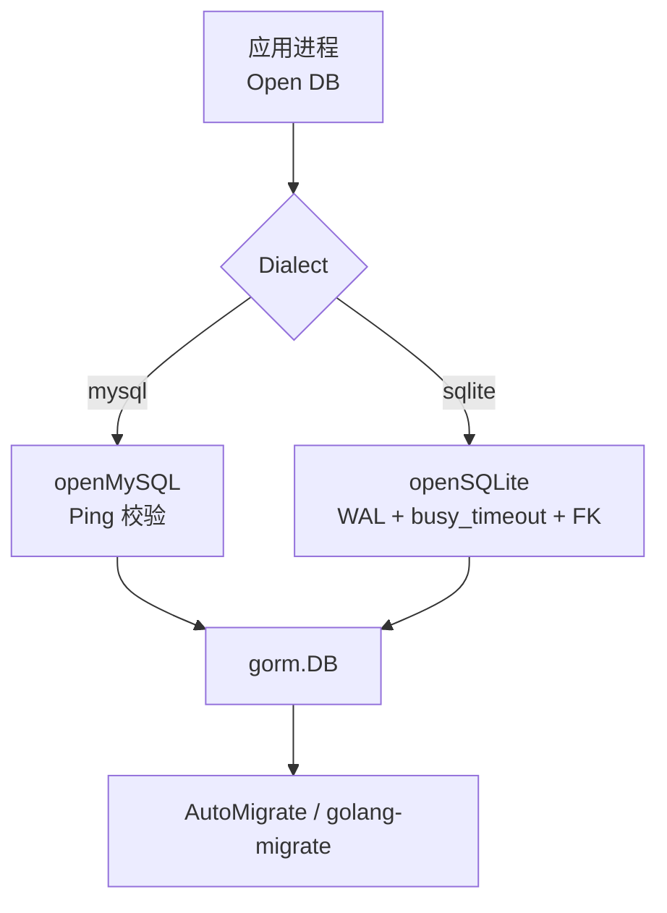
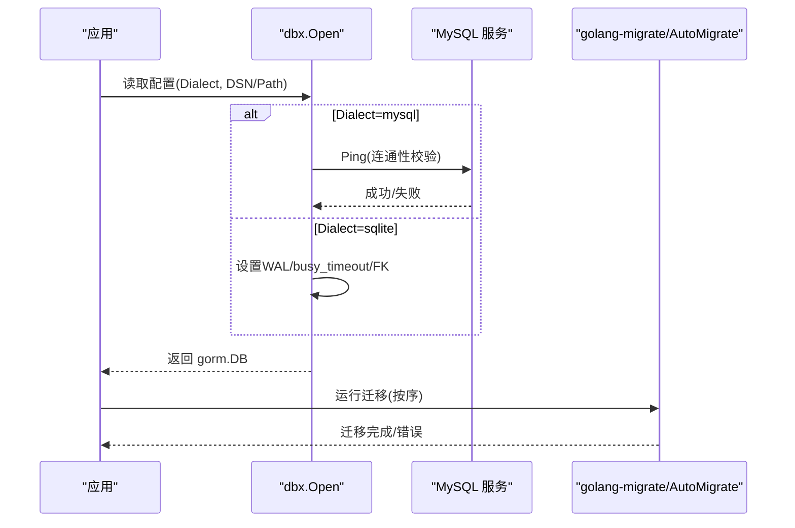
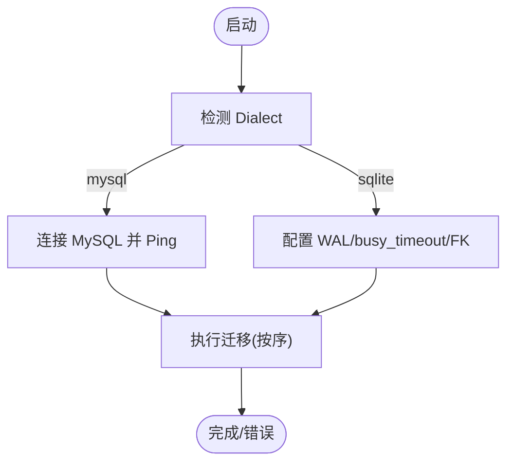
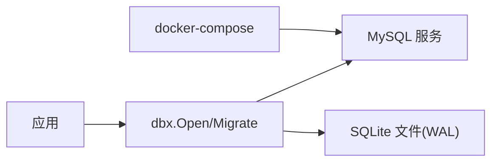

# 数据库备份

<cite>
**本文引用的文件**
- [db/README.md](file://db/README.md)
- [internal/pkg/dbx/dbx.go](file://internal/pkg/dbx/dbx.go)
- [internal/pkg/dbx/migrate.go](file://internal/pkg/dbx/migrate.go)
- [internal/pkg/dbx/soft_delete.go](file://internal/pkg/dbx/soft_delete.go)
- [deploy/docker-compose.yml](file://deploy/docker-compose.yml)
- [internal/manager/biz/knowledge/builtin_vault/diagnostics/db-slow-queries-locks.md](file://internal/manager/biz/knowledge/builtin_vault/diagnostics/db-slow-queries-locks.md)
- [internal/manager/biz/knowledge/builtin_vault/diagnostics/db-replication-lag.md](file://internal/manager/biz/knowledge/builtin_vault/diagnostics/db-replication-lag.md)
- [internal/manager/data/report/store/migrate.go](file://internal/manager/data/report/store/migrate.go)
- [internal/manager/biz/metric/retention.go](file://internal/manager/biz/metric/retention.go)
- [internal/manager/data/metric/store/writer.go](file://internal/manager/data/metric/store/writer.go)
</cite>

## 目录
1. [简介](#简介)
2. [项目结构](#项目结构)
3. [核心组件](#核心组件)
4. [架构总览](#架构总览)
5. [详细组件分析](#详细组件分析)
6. [依赖关系分析](#依赖关系分析)
7. [性能与一致性考量](#性能与一致性考量)
8. [故障排查指南](#故障排查指南)
9. [结论](#结论)
10. [附录](#附录)

## 简介
本指南围绕 ongrid 项目的数据库备份策略，结合代码库中实际实现的迁移机制、事务与锁行为、以及数据保留清理流程，给出面向 MySQL 与 SQLite 的全量、增量与实时备份方案建议；同时提供版本化迁移的执行顺序与回滚策略说明，并给出自动化备份、存储与清理策略、验证与恢复测试流程。内容严格基于仓库现有实现与配置进行归纳与扩展建议，不引入未实现的功能。

## 项目结构
- 数据库后端：默认 MySQL（通过 GORM 驱动），SQLite 作为本地单用户模式可选后端。
- 迁移管理：生产环境使用 golang-migrate 风格的 SQL 迁移脚本（up/down）；本地/单机初始化仍使用 GORM AutoMigrate。
- 连接与参数：SQLite 开启 WAL、busy_timeout、外键约束；MySQL 启动时 Ping 校验连通性。
- 部署：docker-compose 定义 MySQL 服务与健康检查，应用等待健康后启动。

图表来源
- [internal/pkg/dbx/dbx.go:34-49](file://internal/pkg/dbx/dbx.go#L34-L49)
- [internal/pkg/dbx/dbx.go:51-77](file://internal/pkg/dbx/dbx.go#L51-L77)
- [internal/pkg/dbx/dbx.go:79-112](file://internal/pkg/dbx/dbx.go#L79-L112)
- [internal/pkg/dbx/migrate.go:12-46](file://internal/pkg/dbx/migrate.go#L12-L46)

章节来源
- [internal/pkg/dbx/dbx.go:1-151](file://internal/pkg/dbx/dbx.go#L1-L151)
- [internal/pkg/dbx/migrate.go:1-47](file://internal/pkg/dbx/migrate.go#L1-L47)
- [deploy/docker-compose.yml:13-38](file://deploy/docker-compose.yml#L13-L38)
- [db/README.md:1-15](file://db/README.md#L1-L15)

## 核心组件
- 数据库打开与后端选择：统一入口 Open，根据配置选择 MySQL 或 SQLite。
- SQLite 特性：WAL 提升并发读能力，busy_timeout 降低忙冲突失败概率，强制外键约束保障一致性。
- MySQL 特性：启动时 Ping 快速失败，避免延迟发现配置错误。
- 迁移执行：RunMigrations 按序执行各模块的 AutoMigrate 注册函数，记录耗时便于定位慢迁移。
- 软删除与索引修复：提供工具函数处理历史表结构变更与 delete_marker 回填。

章节来源
- [internal/pkg/dbx/dbx.go:34-49](file://internal/pkg/dbx/dbx.go#L34-L49)
- [internal/pkg/dbx/dbx.go:51-77](file://internal/pkg/dbx/dbx.go#L51-L77)
- [internal/pkg/dbx/dbx.go:79-128](file://internal/pkg/dbx/dbx.go#L79-L128)
- [internal/pkg/dbx/migrate.go:12-46](file://internal/pkg/dbx/migrate.go#L12-L46)
- [internal/pkg/dbx/soft_delete.go:9-102](file://internal/pkg/dbx/soft_delete.go#L9-L102)

## 架构总览
下图展示从应用启动到数据库连接、迁移执行的总体流程，以及与 docker-compose 中 MySQL 服务的依赖关系。

图表来源
- [internal/pkg/dbx/dbx.go:34-49](file://internal/pkg/dbx/dbx.go#L34-L49)
- [internal/pkg/dbx/dbx.go:51-77](file://internal/pkg/dbx/dbx.go#L51-L77)
- [internal/pkg/dbx/dbx.go:79-112](file://internal/pkg/dbx/dbx.go#L79-L112)
- [internal/pkg/dbx/migrate.go:20-46](file://internal/pkg/dbx/migrate.go#L20-L46)
- [deploy/docker-compose.yml:50-65](file://deploy/docker-compose.yml#L50-L65)

## 详细组件分析

### 全量备份策略
- MySQL 全量备份
  - 推荐在副本上执行热备（如 xtrabackup），或在低峰期对主库执行一致快照/逻辑导出。
  - 若需在线一致快照，可结合事务隔离级别与锁策略，确保备份期间无长事务阻塞。
  - 备份产物应包含 binlog 位置信息以便后续增量恢复。
- SQLite 全量备份
  - 由于启用 WAL，可在读多写少场景下直接拷贝 .db 与 -wal/-shm 文件，或使用 sqlite3 的备份 API 保证一致性。
  - 注意 busy_timeout 已配置为 5s，长时间写入可能触发忙等待，建议在低峰期执行。

章节来源
- [internal/pkg/dbx/dbx.go:79-128](file://internal/pkg/dbx/dbx.go#L79-L128)
- [deploy/docker-compose.yml:13-38](file://deploy/docker-compose.yml#L13-L38)

### 增量备份策略
- MySQL 增量备份
  - 基于 binlog 的增量复制（如 GTID 模式），配合定期全量基线，可实现时间点恢复（PITR）。
  - 建议将 binlog 持久化至独立卷，并定期归档到对象存储。
- SQLite 增量备份
  - 利用 WAL 模式，可将 -wal 文件视为增量日志；但更稳妥的方式是周期性全量备份 + 保留最近若干 WAL 文件。
  - 注意：WAL 模式下读取无需独占锁，但写入仍为单写者。

章节来源
- [internal/pkg/dbx/dbx.go:79-128](file://internal/pkg/dbx/dbx.go#L79-L128)

### 实时备份策略
- MySQL 实时备份
  - 通过主从复制（异步/半同步）或逻辑复制（如 pt-online-schema-change 等工具）保持近实时同步。
  - 关注复制延迟与断点续传，必要时在主库侧限制长事务与大事务。
- SQLite 实时备份
  - 不建议在高并发写入场景做“实时”拷贝；可通过 WAL 与短事务降低冲突，结合定时任务滚动备份。

章节来源
- [internal/manager/biz/knowledge/builtin_vault/diagnostics/db-replication-lag.md:1-84](file://internal/manager/biz/knowledge/builtin_vault/diagnostics/db-replication-lag.md#L1-L84)

### 迁移机制与版本管理
- 生产环境使用 golang-migrate 风格命名（YYYYMMDDHHMMSS_*.up.sql/.down.sql），先扩后缩原则，先升级应用再回滚。
- 本地/单机使用 GORM AutoMigrate 初始化空库；Manager 启动时会按序调用各模块的 Migrate 注册函数。
- 迁移执行顺序由 RunMigrations 保证，首个错误即中止并返回带序号的错误信息，便于定位。
- 回滚策略：先回退应用版本（不再读取新增字段），再执行 migrate-down。

图表来源
- [internal/pkg/dbx/dbx.go:34-49](file://internal/pkg/dbx/dbx.go#L34-L49)
- [internal/pkg/dbx/migrate.go:20-46](file://internal/pkg/dbx/migrate.go#L20-L46)
- [db/README.md:1-15](file://db/README.md#L1-L15)

章节来源
- [db/README.md:1-15](file://db/README.md#L1-L15)
- [internal/pkg/dbx/migrate.go:12-46](file://internal/pkg/dbx/migrate.go#L12-L46)
- [internal/manager/data/report/store/migrate.go:12-43](file://internal/manager/data/report/store/migrate.go#L12-L43)

### 数据一致性保证（事务与锁）
- SQLite
  - 开启 WAL 允许并发读与单写；busy_timeout 降低忙冲突失败；外键约束强制引用完整性。
  - 长事务或大事务可能导致 WAL 膨胀与写竞争，建议拆分事务、缩短持有时间。
- MySQL
  - 启动时 Ping 快速失败；生产建议配合只读副本与读写分离，注意读后写一致性。
  - 锁争用与慢查询会阻塞业务，需结合诊断文档定位阻塞源与优化。

章节来源
- [internal/pkg/dbx/dbx.go:79-128](file://internal/pkg/dbx/dbx.go#L79-L128)
- [internal/manager/biz/knowledge/builtin_vault/diagnostics/db-slow-queries-locks.md:50-85](file://internal/manager/biz/knowledge/builtin_vault/diagnostics/db-slow-queries-locks.md#L50-L85)
- [internal/manager/biz/knowledge/builtin_vault/diagnostics/db-replication-lag.md:60-77](file://internal/manager/biz/knowledge/builtin_vault/diagnostics/db-replication-lag.md#L60-L77)

### 自动化备份流程（定时任务、存储与清理）
- 定时任务
  - 可使用系统 cron 或容器编排任务调度器，按周期触发备份脚本。
  - 对于 MySQL，建议结合 binlog 归档与全量基线；对于 SQLite，建议全量 + WAL 保留。
- 存储策略
  - 备份文件应加密传输与落盘，异地多副本（对象存储+本地缓存）。
  - 元数据（如 binlog 位置、时间戳、校验和）与备份文件一同归档。
- 清理策略
  - 参考项目内数据保留清理思路（按层级 TTL 与批删），对备份集也制定保留周期与空间阈值清理。
  - 示例：指标数据按 raw/5m/1h 分层清理，可按类似思想设计备份保留策略。

章节来源
- [internal/manager/biz/metric/retention.go:47-103](file://internal/manager/biz/metric/retention.go#L47-L103)
- [internal/manager/data/metric/store/writer.go:161-182](file://internal/manager/data/metric/store/writer.go#L161-L182)

### 备份验证与恢复测试
- 备份验证
  - 校验和校验（如 sha256sum）、解压/导入演练、最小数据集恢复测试。
  - 对 MySQL 可验证 binlog 连续性；对 SQLite 可验证 WAL 完整性。
- 恢复测试
  - 定期在隔离环境执行恢复演练，验证 RTO/RPO 是否达标。
  - 针对迁移脚本，先在测试库执行 up/down，确认幂等性与兼容性。

[本节为通用实践说明，不直接分析具体文件]

## 依赖关系分析
- 应用依赖 dbx 提供的数据库打开与迁移执行能力。
- 迁移脚本与 AutoMigrate 共同维护 schema 演进；生产以 SQL 迁移为主，本地以 AutoMigrate 为主。
- docker-compose 中 MySQL 服务健康检查确保应用启动前数据库可用。

图表来源
- [internal/pkg/dbx/dbx.go:34-49](file://internal/pkg/dbx/dbx.go#L34-L49)
- [internal/pkg/dbx/dbx.go:51-77](file://internal/pkg/dbx/dbx.go#L51-L77)
- [internal/pkg/dbx/dbx.go:79-112](file://internal/pkg/dbx/dbx.go#L79-L112)
- [deploy/docker-compose.yml:50-65](file://deploy/docker-compose.yml#L50-L65)

章节来源
- [internal/pkg/dbx/dbx.go:1-151](file://internal/pkg/dbx/dbx.go#L1-L151)
- [deploy/docker-compose.yml:13-38](file://deploy/docker-compose.yml#L13-L38)

## 性能与一致性考量
- SQLite
  - WAL 提升读并发，但写仍为单写者；busy_timeout 降低忙冲突失败率；外键约束保障一致性。
  - 大事务与频繁写入会导致 WAL 增长与写竞争，建议分批提交与合并写入。
- MySQL
  - 启动时 Ping 快速失败；生产建议读写分离与只读副本，注意读后写一致性。
  - 慢查询与锁争用会影响备份窗口与恢复速度，需结合诊断文档优化。

章节来源
- [internal/pkg/dbx/dbx.go:79-128](file://internal/pkg/dbx/dbx.go#L79-L128)
- [internal/manager/biz/knowledge/builtin_vault/diagnostics/db-slow-queries-locks.md:50-85](file://internal/manager/biz/knowledge/builtin_vault/diagnostics/db-slow-queries-locks.md#L50-L85)
- [internal/manager/biz/knowledge/builtin_vault/diagnostics/db-replication-lag.md:1-84](file://internal/manager/biz/knowledge/builtin_vault/diagnostics/db-replication-lag.md#L1-L84)

## 故障排查指南
- 慢查询与锁争用
  - 定位阻塞会话与长事务，必要时终止或优化；DDL 操作建议使用在线变更工具并设置锁超时。
- 复制延迟
  - 监控主从延迟，识别瓶颈（CPU/IO/网络/单线程 apply），必要时并行复制或扩容副本。
- 读后写不一致
  - 对需要一致性的读路由到主库，或采用“读己之所写”策略。

章节来源
- [internal/manager/biz/knowledge/builtin_vault/diagnostics/db-slow-queries-locks.md:50-85](file://internal/manager/biz/knowledge/builtin_vault/diagnostics/db-slow-queries-locks.md#L50-L85)
- [internal/manager/biz/knowledge/builtin_vault/diagnostics/db-replication-lag.md:60-77](file://internal/manager/biz/knowledge/builtin_vault/diagnostics/db-replication-lag.md#L60-L77)

## 结论
- 本项目默认 MySQL，SQLite 仅用于本地调试；生产迁移以 SQL 脚本为主，本地以 AutoMigrate 为主。
- 备份策略应结合数据库特性：MySQL 推荐全量+binlog 增量；SQLite 推荐全量+WAL 保留。
- 迁移需遵循“先扩后缩、先应用后回滚”的原则，确保兼容性与可回滚性。
- 建议建立自动化备份、存储与清理流程，并定期进行恢复演练与验证。

[本节为总结性内容，不直接分析具体文件]

## 附录
- 相关配置与环境变量
  - MySQL DSN 与连接参数在 docker-compose 中定义，应用启动前等待 MySQL 健康检查。
  - SQLite 路径与内存模式通过配置控制，WAL 与 busy_timeout 在打开时自动设置。
- 迁移命令参考
  - 生产环境使用 golang-migrate 执行 up/down；本地/单机使用 AutoMigrate 初始化。

章节来源
- [deploy/docker-compose.yml:50-65](file://deploy/docker-compose.yml#L50-L65)
- [db/README.md:1-15](file://db/README.md#L1-L15)
- [internal/pkg/dbx/dbx.go:79-128](file://internal/pkg/dbx/dbx.go#L79-L128)