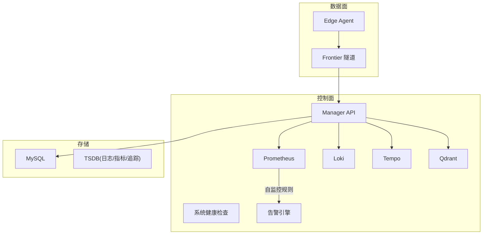
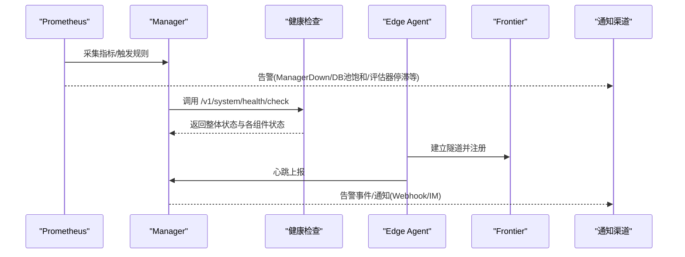
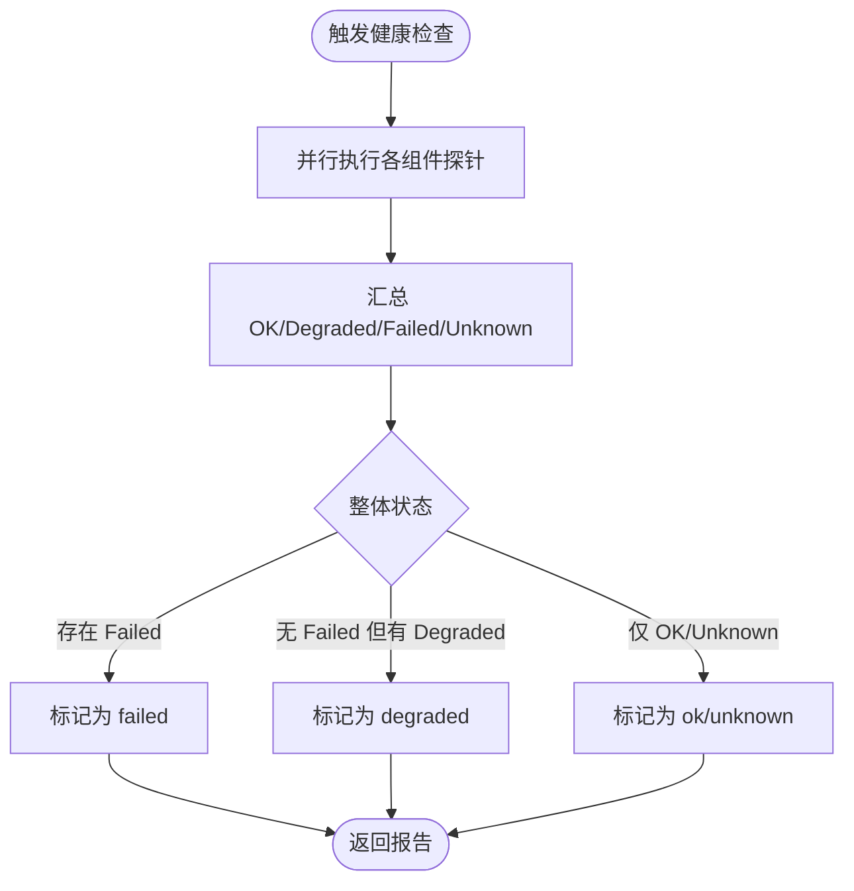
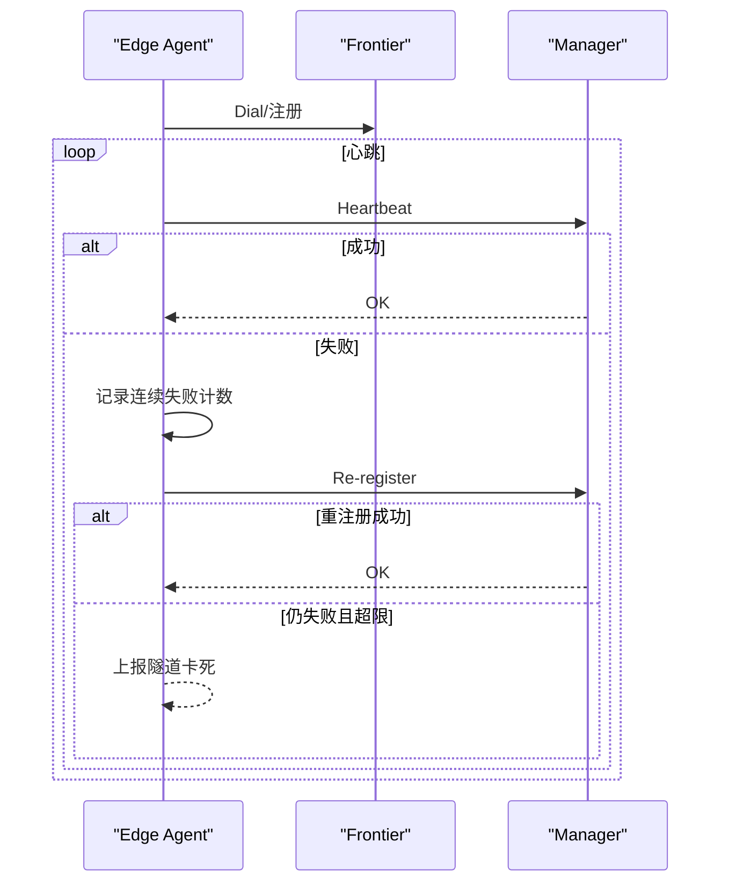
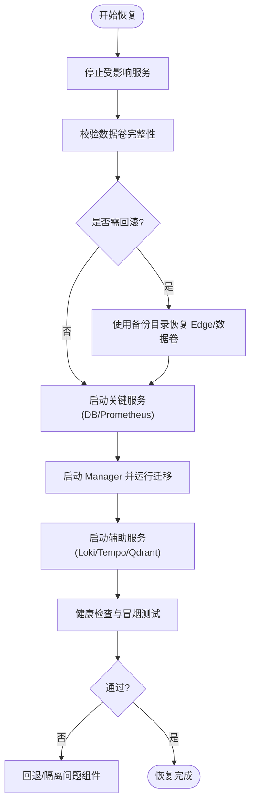
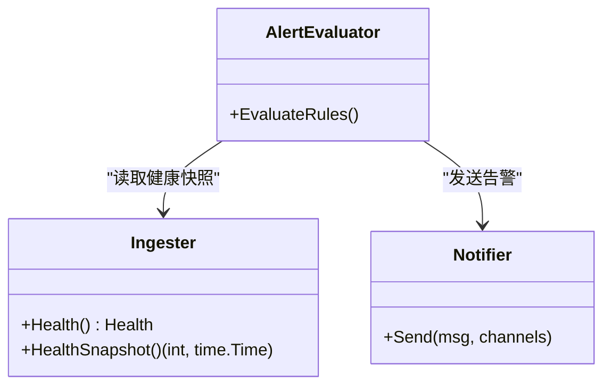
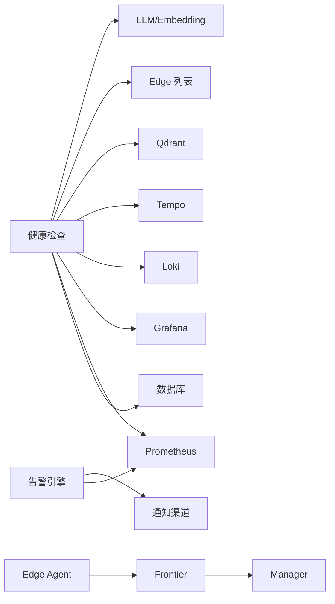

# 灾难恢复

<cite>
**本文引用的文件**
- [service.go](file://internal/manager/service/systemhealth/service.go)
- [http.go](file://internal/manager/server/systemhealth/http.go)
- [systemHealth.ts](file://web/src/api/systemHealth.ts)
- [prometheus-rules.yml](file://deploy/install/prometheus-rules.yml)
- [docker-compose.yml](file://deploy/install/docker-compose.yml)
- [data-permissions.sh](file://deploy/install/data-permissions.sh)
- [agent.go](file://internal/edgeagent/biz/agent.go)
- [enroll.go](file://cmd/ongrid-edge/enroll.go)
- [handlers.go](file://internal/manager/service/frontierbound/handlers.go)
- [service.go](file://internal/manager/service/alert/service.go)
- [model.go](file://internal/manager/model/alert/model.go)
- [ingester.go](file://internal/manager/biz/promwrite/ingester.go)
- [db-replication-lag.md](file://internal/manager/biz/knowledge/builtin_vault/diagnostics/db-replication-lag.md)
- [migrate.go](file://internal/manager/data/logs/store/migrate.go)
- [soft_delete.go](file://internal/pkg/dbx/soft_delete.go)
- [roadmap.zh-CN.md](file://ROADMAP.zh-CN.md)
</cite>

## 目录
1. [简介](#简介)
2. [项目结构](#项目结构)
3. [核心组件](#核心组件)
4. [架构总览](#架构总览)
5. [详细组件分析](#详细组件分析)
6. [依赖关系分析](#依赖关系分析)
7. [性能与容量考量](#性能与容量考量)
8. [故障排查指南](#故障排查指南)
9. [结论](#结论)
10. [附录：恢复演练SOP](#附录恢复演练sop)

## 简介
本指南面向运维与平台团队，提供 Ongrid 的灾难恢复计划。内容覆盖：
- 故障检测：健康检查、监控告警、自动故障转移
- 数据恢复：RTO/RPO 定义与实现策略
- 多站点容灾：主从复制、双向同步、脑裂处理
- 业务连续性：服务降级、缓存策略、队列积压处理
- 恢复演练：模拟故障、执行恢复、验证业务的标准化流程

Ongrid 通过内置的系统健康检查、Prometheus 自监控规则、Edge Agent 重连与注册机制、以及可编排的工作流与通知渠道，为灾难恢复提供了“可观测—可诊断—可自动化”的基础能力。

## 项目结构
与灾难恢复相关的关键位置：
- 系统健康检查：Manager 侧聚合数据库、Prometheus、Grafana、Loki、Tempo、Qdrant、Frontier、告警引擎、Edge 在线状态等探针
- 监控告警：Prometheus 自监控规则（Manager Down、DB Pool 饱和、LLM 错误率、评估器停滞、HTTP 5xx）
- 边缘节点：Edge Agent 持续拨号、心跳、断线重注册；安装脚本支持回滚与权限修复
- 数据层：MySQL、Prometheus TSDB、Loki、Tempo、Qdrant 均持久化到宿主机目录，便于备份与迁移
- 工作流与通知：告警事件驱动工作流，通知渠道支持 Webhook/Slack/飞书/钉钉/企微/Telegram

图表来源
- [service.go:132-154](file://internal/manager/service/systemhealth/service.go#L132-L154)
- [prometheus-rules.yml:12-79](file://deploy/install/prometheus-rules.yml#L12-L79)
- [docker-compose.yml:21-528](file://deploy/install/docker-compose.yml#L21-L528)

章节来源
- [service.go:132-154](file://internal/manager/service/systemhealth/service.go#L132-L154)
- [prometheus-rules.yml:12-79](file://deploy/install/prometheus-rules.yml#L12-L79)
- [docker-compose.yml:21-528](file://deploy/install/docker-compose.yml#L21-L528)

## 核心组件
- 系统健康检查服务：统一探测各依赖组件可用性并输出整体状态
- Prometheus 自监控规则：对 Manager、DB、LLM、告警评估器等关键路径进行阈值告警
- Edge Agent 生命周期：拨号、注册、心跳、断线重注册与自愈
- 数据持久化与回滚：容器数据卷映射到宿主机，安装脚本具备权限修复与栈恢复能力
- 告警与通知：规则、事件、通道配置与测试，支撑自动化处置

章节来源
- [service.go:19-117](file://internal/manager/service/systemhealth/service.go#L19-L117)
- [prometheus-rules.yml:12-79](file://deploy/install/prometheus-rules.yml#L12-L79)
- [agent.go:186-218](file://internal/edgeagent/biz/agent.go#L186-L218)
- [data-permissions.sh:174-230](file://deploy/install/data-permissions.sh#L174-L230)
- [service.go:397-556](file://internal/manager/service/alert/service.go#L397-L556)

## 架构总览
灾难恢复的关键链路如下：
- 故障发现：Prometheus 自监控规则 + 系统健康检查探针
- 故障定位：告警事件 + 拓扑关联 + 日志/指标/追踪
- 自动恢复：Edge 重连与重注册、工作流触发、通知渠道联动
- 数据恢复：基于宿主机持久化的数据卷进行备份/回滚/重建

图表来源
- [prometheus-rules.yml:12-79](file://deploy/install/prometheus-rules.yml#L12-L79)
- [http.go:30-49](file://internal/manager/server/systemhealth/http.go#L30-L49)
- [agent.go:186-218](file://internal/edgeagent/biz/agent.go#L186-L218)
- [service.go:132-154](file://internal/manager/service/systemhealth/service.go#L132-L154)

## 详细组件分析

### 健康检查与监控告警
- 健康检查范围：Manager API、数据库、Prometheus、Grafana、Loki、Tempo、Qdrant、Frontier、告警引擎、Edge 在线状态、LLM/Embedding 提供者
- 健康检查接口：管理员可调用的 POST/GET /v1/system/health 与 /v1/system/health/check
- 前端集成：系统健康检查 API 封装在 web/src/api/systemHealth.ts
- Prometheus 自监控规则：Manager 不可达、Worker 会话泄漏、LLM 错误率高、DB 连接池饱和、告警评估器停滞、API 5xx 比例高

图表来源
- [service.go:132-154](file://internal/manager/service/systemhealth/service.go#L132-L154)
- [service.go:414-443](file://internal/manager/service/systemhealth/service.go#L414-L443)
- [http.go:30-49](file://internal/manager/server/systemhealth/http.go#L30-L49)
- [systemHealth.ts:29-31](file://web/src/api/systemHealth.ts#L29-L31)
- [prometheus-rules.yml:12-79](file://deploy/install/prometheus-rules.yml#L12-L79)

章节来源
- [service.go:132-154](file://internal/manager/service/systemhealth/service.go#L132-L154)
- [http.go:30-49](file://internal/manager/server/systemhealth/http.go#L30-L49)
- [systemHealth.ts:29-31](file://web/src/api/systemHealth.ts#L29-L31)
- [prometheus-rules.yml:12-79](file://deploy/install/prometheus-rules.yml#L12-L79)

### 自动故障转移与自愈
- Edge Agent 断线后自动重连：Tunnel 层重建后重新 register_edge，确保绑定到新的 Manager 端点
- 心跳失败自愈：连续心跳失败时尝试重新注册，超过阈值则判定隧道卡死
- 安装脚本回滚：当数据目录准备失败或权限修复失败时，尝试恢复现有 Docker Compose 栈

图表来源
- [agent.go:186-218](file://internal/edgeagent/biz/agent.go#L186-L218)
- [agent.go:560-606](file://internal/edgeagent/biz/agent.go#L560-L606)
- [data-permissions.sh:174-230](file://deploy/install/data-permissions.sh#L174-L230)

章节来源
- [agent.go:186-218](file://internal/edgeagent/biz/agent.go#L186-L218)
- [agent.go:560-606](file://internal/edgeagent/biz/agent.go#L560-L606)
- [data-permissions.sh:174-230](file://deploy/install/data-permissions.sh#L174-L230)

### 数据恢复流程与 RTO/RPO
- 数据持久化：MySQL、Prometheus、Loki、Tempo、Qdrant 的数据目录均 bind-mount 到宿主机，便于备份与恢复
- RTO（恢复时间目标）：以“最小停机时间”为目标，优先恢复关键服务（Manager、DB、Prometheus），再恢复辅助服务（Loki/Tempo/Qdrant/Grafana）
- RPO（恢复点目标）：以“最大允许数据丢失”为目标，结合数据库与对象存储的快照/增量备份策略
- 回滚与修复：安装脚本支持权限修复与栈恢复；数据库迁移工具支持删除标记回填与索引修复

图表来源
- [docker-compose.yml:21-528](file://deploy/install/docker-compose.yml#L21-L528)
- [data-permissions.sh:174-230](file://deploy/install/data-permissions.sh#L174-L230)
- [migrate.go:10-30](file://internal/manager/data/logs/store/migrate.go#L10-L30)
- [soft_delete.go:48-102](file://internal/pkg/dbx/soft_delete.go#L48-L102)

章节来源
- [docker-compose.yml:21-528](file://deploy/install/docker-compose.yml#L21-L528)
- [data-permissions.sh:174-230](file://deploy/install/data-permissions.sh#L174-L230)
- [migrate.go:10-30](file://internal/manager/data/logs/store/migrate.go#L10-L30)
- [soft_delete.go:48-102](file://internal/pkg/dbx/soft_delete.go#L48-L102)

### 多站点容灾方案
- 主从复制：参考知识库中的数据库复制延迟诊断文档，识别异步复制滞后与断裂场景，制定读路由与一致性策略
- 双向同步：跨站写冲突需引入冲突解决策略（如最后写入胜出、字段级合并），并在变更窗口内限制写操作
- 脑裂处理：通过仲裁节点/多数派选举、网络分区检测、只读降级与写冻结，避免双主写入导致数据不一致
- 规划与演进：路线图包含 Active-Standby Manager、多区域只读副本、深层 healthz、Tunnel 会话漂移等能力

章节来源
- [db-replication-lag.md:1-45](file://internal/manager/biz/knowledge/builtin_vault/diagnostics/db-replication-lag.md#L1-L45)
- [roadmap.zh-CN.md:327-366](file://ROADMAP.zh-CN.md#L327-L366)

### 业务连续性保障
- 服务降级：当 LLM/Embedding/外部依赖不可用时，健康检查会标记为 degraded，UI 与自动化流程可据此降级
- 缓存策略：向量库(Qdrant)、页面托管(pages)、技能包(skills)、工作区(workspace)等均有独立持久化目录，重启不丢数据
- 队列积压：Prometheus 远写 ingester 暴露健康快照，告警评估器停滞会被自监控规则捕获，配合通知渠道及时告警

图表来源
- [ingester.go:71-85](file://internal/manager/biz/promwrite/ingester.go#L71-L85)
- [service.go:397-556](file://internal/manager/service/alert/service.go#L397-L556)

章节来源
- [ingester.go:71-85](file://internal/manager/biz/promwrite/ingester.go#L71-L85)
- [service.go:397-556](file://internal/manager/service/alert/service.go#L397-L556)

## 依赖关系分析
- 健康检查依赖：数据库、Prometheus、Grafana、Loki、Tempo、Qdrant、Frontier、Edge、LLM/Embedding
- 告警依赖：Prometheus 查询、通知渠道（Webhook/Slack/飞书/钉钉/企微/Telegram）、Incident 管理
- 边缘依赖：Frontier 隧道、Manager 认证、Edge 注册与心跳
- 数据依赖：MySQL、Prometheus TSDB、Loki、Tempo、Qdrant 的持久化目录

图表来源
- [service.go:84-117](file://internal/manager/service/systemhealth/service.go#L84-L117)
- [model.go:186-214](file://internal/manager/model/alert/model.go#L186-L214)
- [handlers.go:55-67](file://internal/manager/service/frontierbound/handlers.go#L55-L67)

章节来源
- [service.go:84-117](file://internal/manager/service/systemhealth/service.go#L84-L117)
- [model.go:186-214](file://internal/manager/model/alert/model.go#L186-L214)
- [handlers.go:55-67](file://internal/manager/service/frontierbound/handlers.go#L55-L67)

## 性能与容量考量
- 指标保留：Prometheus 默认 90 天/20GB，需根据磁盘与成本调整
- 日志与追踪：Loki/Tempo 数据落盘，建议独立高速存储并按租户/环境隔离
- 数据库连接池：当 ongrid_db_pool_in_use/open_connections > 0.9 时触发告警，需调优并发与慢查询
- 健康检查超时：探针默认超时可控，避免长尾依赖拖垮整体健康检查

章节来源
- [docker-compose.yml:344-381](file://deploy/install/docker-compose.yml#L344-L381)
- [prometheus-rules.yml:46-55](file://deploy/install/prometheus-rules.yml#L46-L55)
- [service.go:119-130](file://internal/manager/service/systemhealth/service.go#L119-L130)

## 故障排查指南
- 快速入口：调用 /v1/system/health/check 获取整体与分项健康状态
- 常见告警：
  - Manager 不可达：检查进程、端口、防火墙、DB 可达性
  - DB 连接池饱和：查看慢查询、连接数上限、事务持有时间
  - LLM 错误率高：核对模型配置、密钥、上游限流
  - 评估器停滞：检查 goroutine 与资源占用
  - HTTP 5xx 比例高：按路由定位热点与异常
- 边缘离线：查看 Edge 日志、Tunnel 端口连通性、Frontier 路由与证书
- 数据权限：使用安装脚本修复权限并尝试恢复现有栈

章节来源
- [http.go:30-49](file://internal/manager/server/systemhealth/http.go#L30-L49)
- [prometheus-rules.yml:12-79](file://deploy/install/prometheus-rules.yml#L12-L79)
- [data-permissions.sh:174-230](file://deploy/install/data-permissions.sh#L174-L230)

## 结论
Ongrid 通过“健康检查+自监控+边缘自愈+持久化数据卷+通知与工作流”的组合，构建了可观测、可诊断、可自动化的灾难恢复基础。建议在生产环境中：
- 明确 RTO/RPO 并落地备份与恢复流程
- 完善多站点容灾策略与脑裂防护
- 将告警与通知纳入自动化处置闭环
- 定期开展恢复演练，验证端到端恢复能力

## 附录：恢复演练SOP
- 演练目标：验证在典型故障场景下，能在 RTO/RPO 内恢复业务功能
- 场景示例：
  - 数据库宕机：切换只读、回滚数据卷、重启数据库、验证读写
  - Manager 崩溃：重启服务、检查健康检查、恢复工作流与通知
  - Edge 大规模离线：检查 Frontier 与 Tunnel、重注册、验证遥测
  - 指标/日志/追踪不可用：恢复 Prometheus/Loki/Tempo、验证查询
- 步骤概览：
  1) 模拟故障（停服务/断网/注入错误）
  2) 触发告警与通知（确认渠道可用）
  3) 执行恢复（回滚/重建/重配）
  4) 验证业务（健康检查、冒烟用例、用户旅程）
  5) 复盘改进（更新预案、优化阈值与流程）

章节来源
- [prometheus-rules.yml:12-79](file://deploy/install/prometheus-rules.yml#L12-L79)
- [service.go:132-154](file://internal/manager/service/systemhealth/service.go#L132-L154)
- [docker-compose.yml:21-528](file://deploy/install/docker-compose.yml#L21-L528)