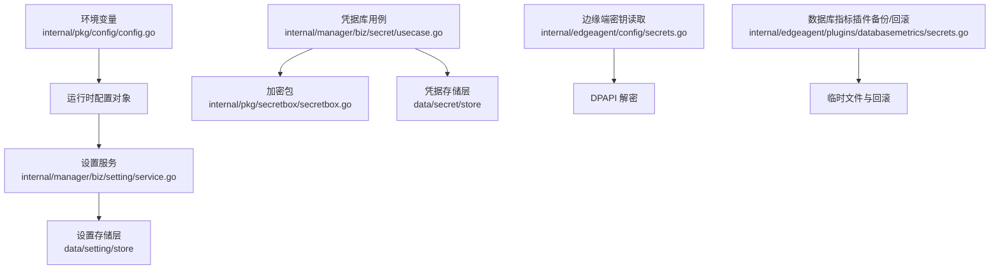
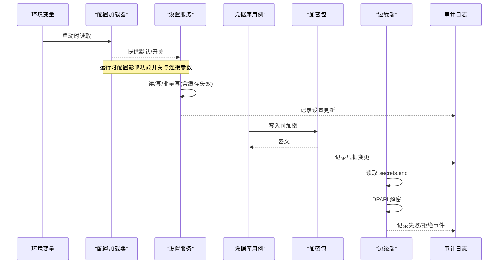
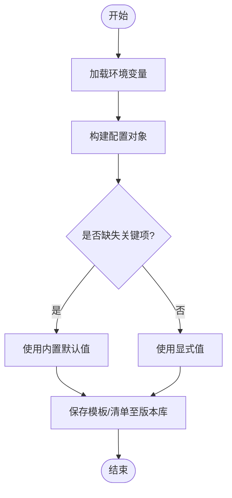
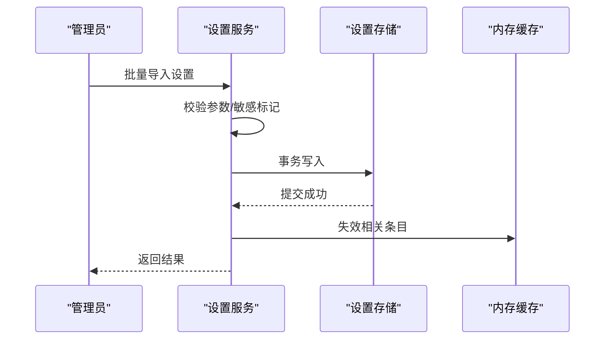
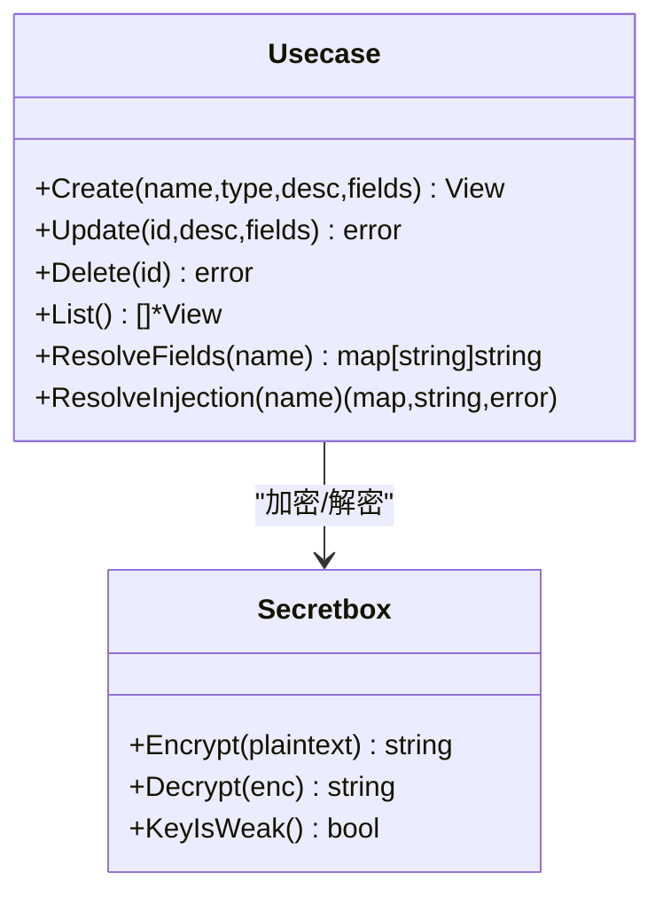
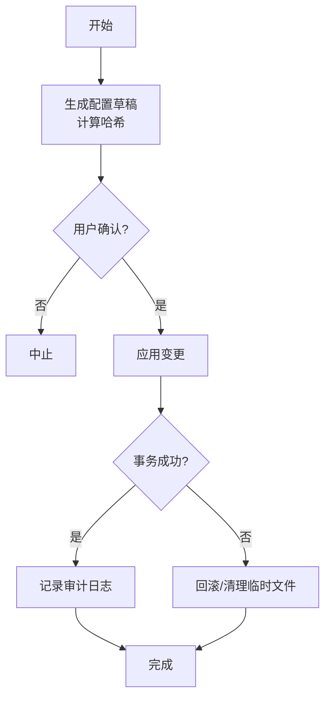
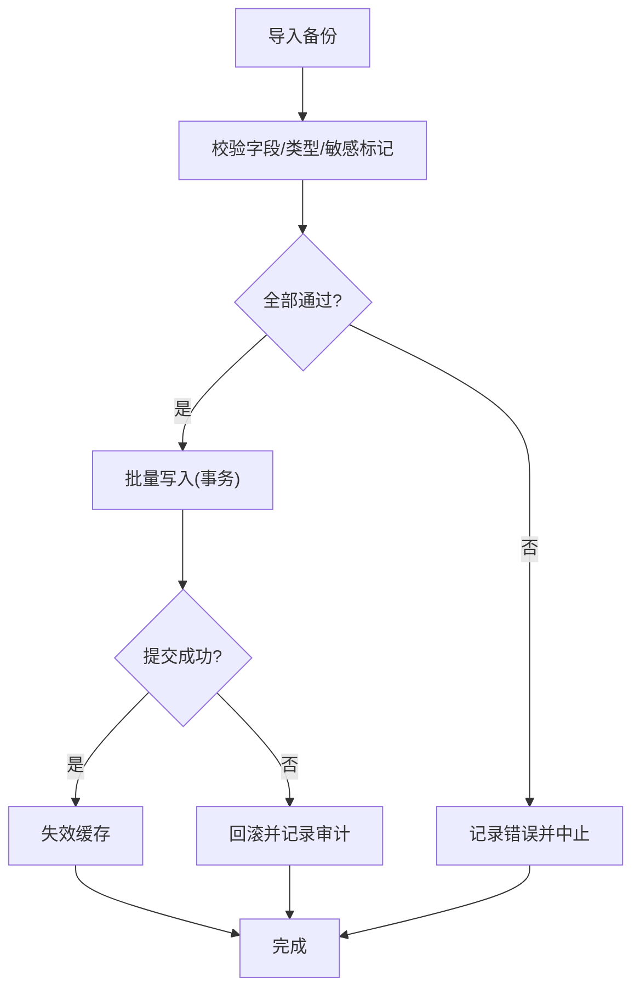
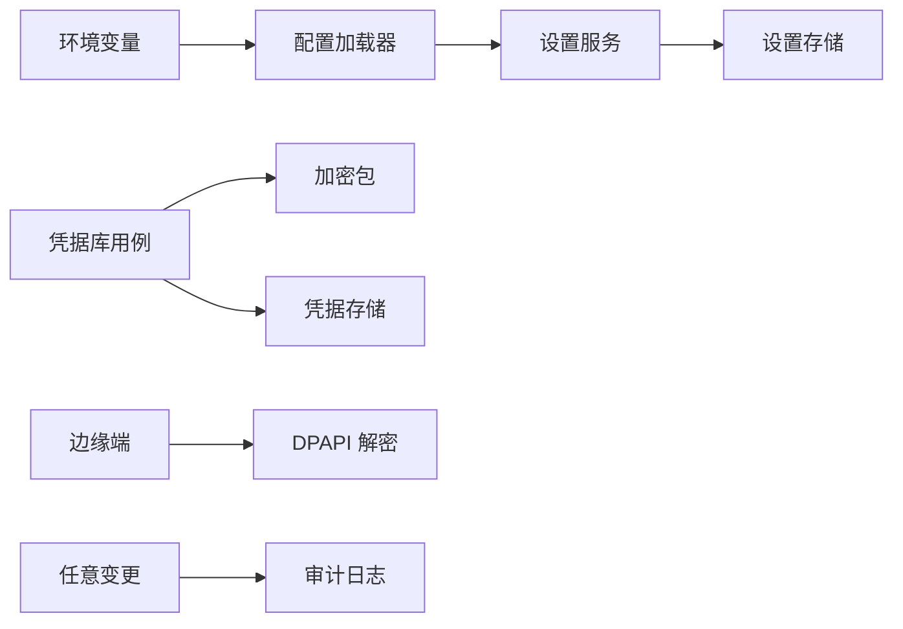

# 配置备份

<cite>
**本文引用的文件**
- [internal/pkg/config/config.go](file://internal/pkg/config/config.go)
- [internal/manager/biz/setting/service.go](file://internal/manager/biz/setting/service.go)
- [internal/manager/biz/secret/usecase.go](file://internal/manager/biz/secret/usecase.go)
- [internal/pkg/secretbox/secretbox.go](file://internal/pkg/secretbox/secretbox.go)
- [internal/edgeagent/config/secrets.go](file://internal/edgeagent/config/secrets.go)
- [internal/edgeagent/plugins/databasemetrics/secrets.go](file://internal/edgeagent/plugins/databasemetrics/secrets.go)
- [internal/manager/model/audit/log.go](file://internal/manager/model/audit/log.go)
- [internal/manager/biz/aiops/tools/config_tools.go](file://internal/manager/biz/aiops/tools/config_tools.go)
- [deploy/install/edge/ongrid-edge.env.example](file://deploy/install/edge/ongrid-edge.env.example)
- [tests/e2e/secrets.example.env](file://tests/e2e/secrets.example.env)
</cite>

## 目录
1. [简介](#简介)
2. [项目结构](#项目结构)
3. [核心组件](#核心组件)
4. [架构总览](#架构总览)
5. [详细组件分析](#详细组件分析)
6. [依赖关系分析](#依赖关系分析)
7. [性能考虑](#性能考虑)
8. [故障排查指南](#故障排查指南)
9. [结论](#结论)
10. [附录](#附录)

## 简介
本指南面向运维与平台工程团队，系统化说明本项目的系统配置备份策略与实践。内容覆盖：
- 环境变量、应用配置与运行时配置的备份方案
- 敏感信息保护（密钥加密存储、访问控制、审计日志）
- 配置版本管理（变更追踪、回滚机制、冲突解决）
- 多环境配置管理（开发、测试、生产差异处理）
- 配置恢复流程（批量导入、校验、错误处理）

## 项目结构
本项目将“配置”分为三类：
- 运行时环境变量：由进程启动时加载，驱动服务行为（如数据库、LLM、通知渠道等）
- 持久化应用配置：以键值对形式存储在数据库中，支持热更新与缓存
- 凭据库（Secrets Vault）：用于集中管理外部凭据，落库前进行对称加密，仅内部注入路径可解密

**图表来源**
- [internal/pkg/config/config.go:414-549](file://internal/pkg/config/config.go#L414-L549)
- [internal/manager/biz/setting/service.go:49-165](file://internal/manager/biz/setting/service.go#L49-L165)
- [internal/manager/biz/secret/usecase.go:48-175](file://internal/manager/biz/secret/usecase.go#L48-L175)
- [internal/pkg/secretbox/secretbox.go:31-109](file://internal/pkg/secretbox/secretbox.go#L31-L109)
- [internal/edgeagent/config/secrets.go:12-38](file://internal/edgeagent/config/secrets.go#L12-L38)
- [internal/edgeagent/plugins/databasemetrics/secrets.go:639-678](file://internal/edgeagent/plugins/databasemetrics/secrets.go#L639-L678)

**章节来源**
- [internal/pkg/config/config.go:414-549](file://internal/pkg/config/config.go#L414-L549)
- [internal/manager/biz/setting/service.go:49-165](file://internal/manager/biz/setting/service.go#L49-L165)
- [internal/manager/biz/secret/usecase.go:48-175](file://internal/manager/biz/secret/usecase.go#L48-L175)
- [internal/pkg/secretbox/secretbox.go:31-109](file://internal/pkg/secretbox/secretbox.go#L31-L109)
- [internal/edgeagent/config/secrets.go:12-38](file://internal/edgeagent/config/secrets.go#L12-L38)
- [internal/edgeagent/plugins/databasemetrics/secrets.go:639-678](file://internal/edgeagent/plugins/databasemetrics/secrets.go#L639-L678)

## 核心组件
- 运行时配置加载器：从环境变量构建统一配置对象，提供默认值与开关
- 设置服务：提供键值配置的读写、批量写入、缓存失效与敏感字段掩码
- 凭据库用例：负责凭据的创建、更新、删除、列表与注入解析；对外只暴露字段名，不暴露值
- 加密包：基于 AES-256-GCM 的落盘加密，密钥来自环境变量，支持弱密钥检测
- 边缘端密钥读取：从本地加密文件读取并解密 broker token，失败时回退到环境变量
- 数据库指标插件备份/回滚：在写秘密文件前预留备份路径，失败时原子回滚
- 审计日志模型：记录成功/失败/拒绝等操作状态，支撑变更追踪与合规审计

**章节来源**
- [internal/pkg/config/config.go:414-549](file://internal/pkg/config/config.go#L414-L549)
- [internal/manager/biz/setting/service.go:49-165](file://internal/manager/biz/setting/service.go#L49-L165)
- [internal/manager/biz/secret/usecase.go:48-175](file://internal/manager/biz/secret/usecase.go#L48-L175)
- [internal/pkg/secretbox/secretbox.go:31-109](file://internal/pkg/secretbox/secretbox.go#L31-L109)
- [internal/edgeagent/config/secrets.go:12-38](file://internal/edgeagent/config/secrets.go#L12-L38)
- [internal/edgeagent/plugins/databasemetrics/secrets.go:639-678](file://internal/edgeagent/plugins/databasemetrics/secrets.go#L639-L678)
- [internal/manager/model/audit/log.go:49-76](file://internal/manager/model/audit/log.go#L49-L76)

## 架构总览
下图展示了配置与凭据在系统中的流转：环境变量驱动运行时配置；设置服务提供热更新的键值配置；凭据库提供加密存储与注入；边缘端通过 DPAPI 解密本地密钥文件；所有变更均受审计日志约束。

**图表来源**
- [internal/pkg/config/config.go:414-549](file://internal/pkg/config/config.go#L414-L549)
- [internal/manager/biz/setting/service.go:108-165](file://internal/manager/biz/setting/service.go#L108-L165)
- [internal/manager/biz/secret/usecase.go:48-175](file://internal/manager/biz/secret/usecase.go#L48-L175)
- [internal/pkg/secretbox/secretbox.go:53-109](file://internal/pkg/secretbox/secretbox.go#L53-L109)
- [internal/edgeagent/config/secrets.go:12-38](file://internal/edgeagent/config/secrets.go#L12-L38)
- [internal/manager/model/audit/log.go:49-76](file://internal/manager/model/audit/log.go#L49-L76)

## 详细组件分析

### 环境变量与运行时配置备份
- 配置来源：所有运行时参数通过环境变量注入，包含 HTTP/Metrics/Tunnel 地址、数据库、JWT、LLM、通知、Prometheus、Grafana、边缘端等
- 备份策略：
  - 将 .env 或容器编排中的环境变量清单纳入版本控制（模板），实际值通过安全通道注入（CI/CD 或密钥管理服务）
  - 使用示例文件作为基线：例如边缘端环境模板与 e2e 测试模板
- 恢复策略：
  - 按环境重建 .env 或注入变量，重启服务即可生效
  - 对于需要热更新的设置，优先通过设置服务更新，避免频繁重启

**图表来源**
- [internal/pkg/config/config.go:414-549](file://internal/pkg/config/config.go#L414-L549)
- [deploy/install/edge/ongrid-edge.env.example:1-37](file://deploy/install/edge/ongrid-edge.env.example#L1-L37)
- [tests/e2e/secrets.example.env:1-68](file://tests/e2e/secrets.example.env#L1-L68)

**章节来源**
- [internal/pkg/config/config.go:414-549](file://internal/pkg/config/config.go#L414-L549)
- [deploy/install/edge/ongrid-edge.env.example:1-37](file://deploy/install/edge/ongrid-edge.env.example#L1-L37)
- [tests/e2e/secrets.example.env:1-68](file://tests/e2e/secrets.example.env#L1-L68)

### 应用配置（设置服务）备份与恢复
- 能力概览：
  - 单条/批量写入设置，自动失效对应缓存
  - 列表返回时对敏感值进行掩码处理
  - 启动时可“不存在则写入”，避免覆盖人工编辑
- 备份策略：
  - 定期导出设置快照（按分类导出为 JSON/CSV），纳入版本库或对象存储
  - 对敏感键值单独归档，并与非敏感配置分离
- 恢复策略：
  - 批量导入时先校验必填字段与类型，再执行事务写入
  - 导入后调用缓存失效接口，确保新值立即生效

**图表来源**
- [internal/manager/biz/setting/service.go:108-165](file://internal/manager/biz/setting/service.go#L108-L165)
- [internal/manager/biz/setting/service.go:205-242](file://internal/manager/biz/setting/service.go#L205-L242)

**章节来源**
- [internal/manager/biz/setting/service.go:108-165](file://internal/manager/biz/setting/service.go#L108-L165)
- [internal/manager/biz/setting/service.go:205-242](file://internal/manager/biz/setting/service.go#L205-L242)

### 凭据库与敏感信息保护
- 加密存储：凭据字段在落库前进行 AES-256-GCM 加密，密钥来源于环境变量；若未设置，会启用弱密钥模式并告警
- 访问控制：列表与查看仅返回字段名，不返回值；仅内部注入路径可解密
- 注入规则：按凭据类型的注入规则生成环境变量映射，供技能/外部 MCP 使用
- 边缘端密钥：从本地加密文件读取并解密 broker token，失败时回退到环境变量

**图表来源**
- [internal/manager/biz/secret/usecase.go:48-175](file://internal/manager/biz/secret/usecase.go#L48-L175)
- [internal/pkg/secretbox/secretbox.go:31-109](file://internal/pkg/secretbox/secretbox.go#L31-L109)

**章节来源**
- [internal/manager/biz/secret/usecase.go:48-175](file://internal/manager/biz/secret/usecase.go#L48-L175)
- [internal/pkg/secretbox/secretbox.go:31-109](file://internal/pkg/secretbox/secretbox.go#L31-L109)
- [internal/edgeagent/config/secrets.go:12-38](file://internal/edgeagent/config/secrets.go#L12-L38)

### 配置版本管理与回滚
- 草稿与确认：通过工具链生成配置草稿，附带哈希校验，确认后执行变更，防止篡改
- 变更追踪：所有变更写入审计日志，包含成功/失败/拒绝状态，便于回溯
- 回滚机制：
  - 文件级：写秘密文件前先预留备份路径，失败时原子回滚
  - 配置级：对批量设置采用事务写入，失败整体回滚

**图表来源**
- [internal/manager/biz/aiops/tools/config_tools.go:212-291](file://internal/manager/biz/aiops/tools/config_tools.go#L212-L291)
- [internal/manager/biz/aiops/tools/config_tools.go:359-420](file://internal/manager/biz/aiops/tools/config_tools.go#L359-L420)
- [internal/edgeagent/plugins/databasemetrics/secrets.go:639-678](file://internal/edgeagent/plugins/databasemetrics/secrets.go#L639-L678)
- [internal/manager/model/audit/log.go:49-76](file://internal/manager/model/audit/log.go#L49-L76)

**章节来源**
- [internal/manager/biz/aiops/tools/config_tools.go:212-291](file://internal/manager/biz/aiops/tools/config_tools.go#L212-L291)
- [internal/manager/biz/aiops/tools/config_tools.go:359-420](file://internal/manager/biz/aiops/tools/config_tools.go#L359-L420)
- [internal/edgeagent/plugins/databasemetrics/secrets.go:639-678](file://internal/edgeagent/plugins/databasemetrics/secrets.go#L639-L678)
- [internal/manager/model/audit/log.go:49-76](file://internal/manager/model/audit/log.go#L49-L76)

### 多环境配置管理
- 环境差异：
  - 开发/测试：可使用默认值或本地模板，部分集成走假服务
  - 生产：严格的环境变量注入与凭据管理，禁用不安全默认
- 实践建议：
  - 使用模板文件（如边缘端 env 示例）作为基线
  - 通过 CI/CD 注入真实密钥，避免入库
  - 对敏感配置与运行开关按环境分层管理

**章节来源**
- [deploy/install/edge/ongrid-edge.env.example:1-37](file://deploy/install/edge/ongrid-edge.env.example#L1-L37)
- [tests/e2e/secrets.example.env:1-68](file://tests/e2e/secrets.example.env#L1-L68)
- [internal/pkg/config/config.go:414-549](file://internal/pkg/config/config.go#L414-L549)

### 配置恢复流程（批量导入、验证、错误处理）
- 批量导入：
  - 先校验必填字段、类型与敏感标记
  - 使用批量写入接口，保证原子性
  - 成功后失效缓存，确保一致性
- 错误处理：
  - 任一写入失败则整体回滚
  - 记录审计日志，便于定位问题
- 恢复步骤：
  - 从备份中恢复设置快照
  - 重新导入并验证关键开关与连接参数
  - 必要时重启服务以加载新的环境变量

**图表来源**
- [internal/manager/biz/setting/service.go:133-165](file://internal/manager/biz/setting/service.go#L133-L165)
- [internal/manager/model/audit/log.go:49-76](file://internal/manager/model/audit/log.go#L49-L76)

**章节来源**
- [internal/manager/biz/setting/service.go:133-165](file://internal/manager/biz/setting/service.go#L133-L165)
- [internal/manager/model/audit/log.go:49-76](file://internal/manager/model/audit/log.go#L49-L76)

## 依赖关系分析
- 配置加载器依赖环境变量，输出统一的配置对象
- 设置服务依赖存储层，维护内存缓存并提供敏感值掩码
- 凭据库用例依赖加密包，实现落盘加密与内部解密
- 边缘端依赖 DPAPI 解密本地密钥文件
- 审计日志贯穿各变更路径，提供可追溯性

**图表来源**
- [internal/pkg/config/config.go:414-549](file://internal/pkg/config/config.go#L414-L549)
- [internal/manager/biz/setting/service.go:49-165](file://internal/manager/biz/setting/service.go#L49-L165)
- [internal/manager/biz/secret/usecase.go:48-175](file://internal/manager/biz/secret/usecase.go#L48-L175)
- [internal/pkg/secretbox/secretbox.go:31-109](file://internal/pkg/secretbox/secretbox.go#L31-L109)
- [internal/edgeagent/config/secrets.go:12-38](file://internal/edgeagent/config/secrets.go#L12-L38)
- [internal/manager/model/audit/log.go:49-76](file://internal/manager/model/audit/log.go#L49-L76)

**章节来源**
- [internal/pkg/config/config.go:414-549](file://internal/pkg/config/config.go#L414-L549)
- [internal/manager/biz/setting/service.go:49-165](file://internal/manager/biz/setting/service.go#L49-L165)
- [internal/manager/biz/secret/usecase.go:48-175](file://internal/manager/biz/secret/usecase.go#L48-L175)
- [internal/pkg/secretbox/secretbox.go:31-109](file://internal/pkg/secretbox/secretbox.go#L31-L109)
- [internal/edgeagent/config/secrets.go:12-38](file://internal/edgeagent/config/secrets.go#L12-L38)
- [internal/manager/model/audit/log.go:49-76](file://internal/manager/model/audit/log.go#L49-L76)

## 性能考虑
- 设置服务使用内存缓存减少热点读取的数据库往返
- 批量写入降低多次网络往返与锁竞争
- 敏感值列表响应进行掩码，避免额外解密开销
- 边缘端 DPAPI 解密仅在启动或必要路径触发

[本节为通用指导，无需特定文件引用]

## 故障排查指南
- 无法解密凭据：检查环境变量密钥是否一致；若使用弱密钥模式，需设置强密钥
- 设置未生效：确认缓存已失效；必要时调用失效接口或重启服务
- 边缘端无法连接：检查本地加密文件是否存在且可解密；失败时回退到环境变量
- 变更不可追溯：核对审计日志，确认操作状态与时间范围

**章节来源**
- [internal/pkg/secretbox/secretbox.go:31-109](file://internal/pkg/secretbox/secretbox.go#L31-L109)
- [internal/manager/biz/setting/service.go:205-242](file://internal/manager/biz/setting/service.go#L205-L242)
- [internal/edgeagent/config/secrets.go:12-38](file://internal/edgeagent/config/secrets.go#L12-L38)
- [internal/manager/model/audit/log.go:49-76](file://internal/manager/model/audit/log.go#L49-L76)

## 结论
通过环境变量、设置服务与凭据库的分层设计，配合加密、访问控制与审计日志，本项目提供了稳健的配置备份与恢复能力。结合草稿确认、事务写入与文件级回滚，可在多环境中安全地管理配置变更，满足生产级可靠性与合规要求。

[本节为总结，无需特定文件引用]

## 附录
- 环境变量模板与示例：
  - 边缘端环境模板：[deploy/install/edge/ongrid-edge.env.example:1-37](file://deploy/install/edge/ongrid-edge.env.example#L1-L37)
  - e2e 测试密钥模板：[tests/e2e/secrets.example.env:1-68](file://tests/e2e/secrets.example.env#L1-L68)
- 关键实现参考：
  - 运行时配置加载：[internal/pkg/config/config.go:414-549](file://internal/pkg/config/config.go#L414-L549)
  - 设置服务：[internal/manager/biz/setting/service.go:49-165](file://internal/manager/biz/setting/service.go#L49-L165)
  - 凭据库用例：[internal/manager/biz/secret/usecase.go:48-175](file://internal/manager/biz/secret/usecase.go#L48-L175)
  - 加密包：[internal/pkg/secretbox/secretbox.go:31-109](file://internal/pkg/secretbox/secretbox.go#L31-L109)
  - 边缘端密钥读取：[internal/edgeagent/config/secrets.go:12-38](file://internal/edgeagent/config/secrets.go#L12-L38)
  - 插件备份/回滚：[internal/edgeagent/plugins/databasemetrics/secrets.go:639-678](file://internal/edgeagent/plugins/databasemetrics/secrets.go#L639-L678)
  - 审计日志模型：[internal/manager/model/audit/log.go:49-76](file://internal/manager/model/audit/log.go#L49-L76)
  - 配置草稿与确认：[internal/manager/biz/aiops/tools/config_tools.go:212-291](file://internal/manager/biz/aiops/tools/config_tools.go#L212-L291)