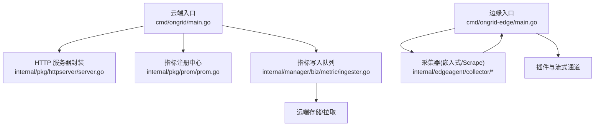
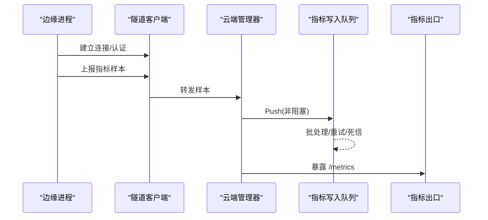
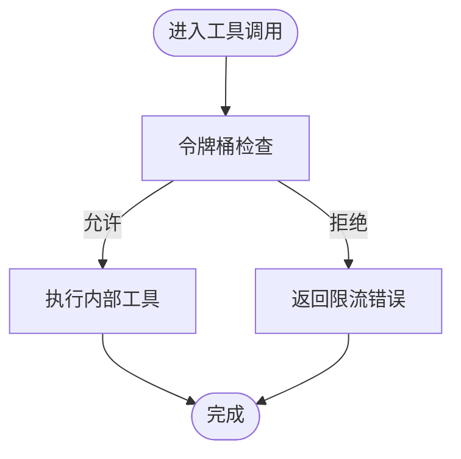
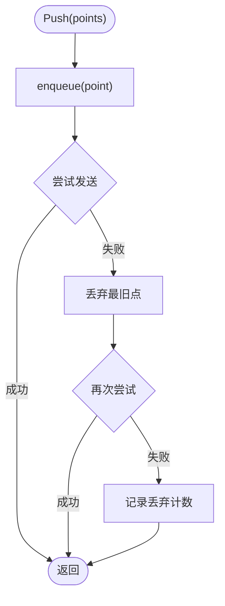
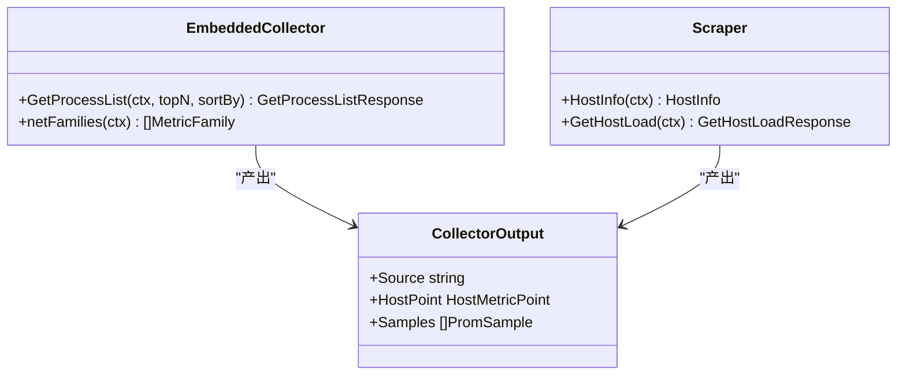
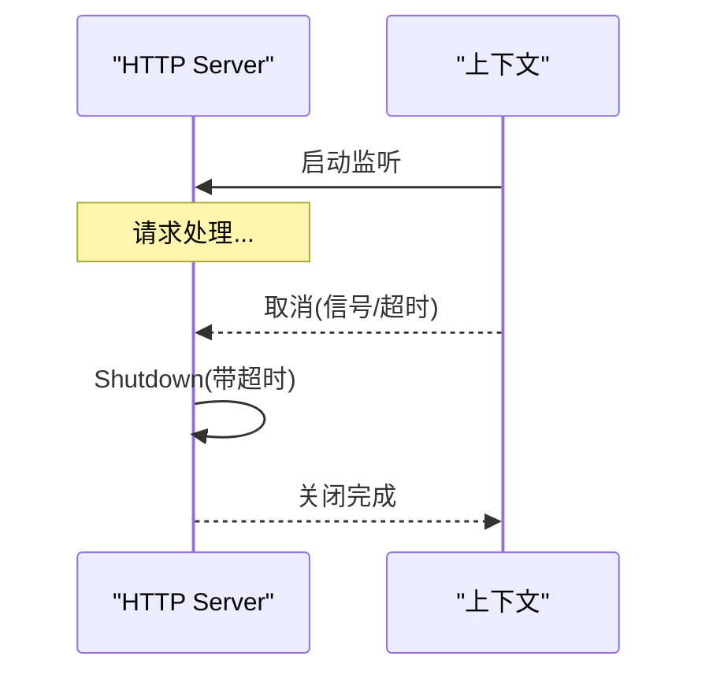
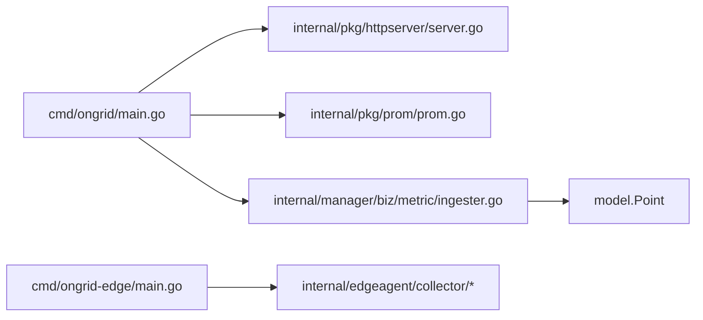

# Go 应用调优

<cite>
**本文引用的文件**   
- [cmd/ongrid/main.go](file://cmd/ongrid/main.go)
- [cmd/ongrid-edge/main.go](file://cmd/ongrid-edge/main.go)
- [internal/pkg/httpserver/server.go](file://internal/pkg/httpserver/server.go)
- [internal/pkg/prom/prom.go](file://internal/pkg/prom/prom.go)
- [internal/pkg/prom/manager_metrics.go](file://internal/pkg/prom/manager_metrics.go)
- [internal/edgeagent/collector/embedded.go](file://internal/edgeagent/collector/embedded.go)
- [internal/edgeagent/collector/scrape.go](file://internal/edgeagent/collector/scrape.go)
- [internal/edgeagent/collector/types.go](file://internal/edgeagent/collector/types.go)
- [internal/manager/biz/aiops/tools/decorators/ratelimit.go](file://internal/manager/biz/aiops/tools/decorators/ratelimit.go)
- [internal/manager/biz/metric/ingester.go](file://internal/manager/biz/metric/ingester.go)
- [internal/manager/biz/knowledge/builtin_vault/diagnostics/cpu-throttling.md](file://internal/manager/biz/knowledge/builtin_vault/diagnostics/cpu-throttling.md)
- [internal/manager/biz/knowledge/builtin_vault/diagnostics/memory-fragmentation-compaction.md](file://internal/manager/biz/knowledge/builtin_vault/diagnostics/memory-fragmentation-compaction.md)
- [internal/manager/biz/knowledge/builtin_vault/diagnostics/ephemeral-port-exhaustion.md](file://internal/manager/biz/knowledge/builtin_vault/diagnostics/ephemeral-port-exhaustion.md)
</cite>

## 目录
1. [简介](#简介)
2. [项目结构](#项目结构)
3. [核心组件](#核心组件)
4. [架构总览](#架构总览)
5. [详细组件分析](#详细组件分析)
6. [依赖关系分析](#依赖关系分析)
7. [性能考量](#性能考量)
8. [故障排查指南](#故障排查指南)
9. [结论](#结论)
10. [附录](#附录)

## 简介
本指南面向在 ongrid 云管与边缘侧服务中实现高性能 Go 应用的工程师，聚焦以下目标：
- goroutine 并发控制、池化与死锁预防
- 内存分配优化、对象复用、泄漏检测与 GC 参数调优
- CPU 热点定位、亲和性与并行计算优化
- 网络 I/O 优化：连接复用、缓冲与异步处理
- 性能分析方法与实战案例（Prometheus、OTel、pprof）

## 项目结构
本项目包含云端管理器（cmd/ongrid）与边缘代理（cmd/ongrid-edge），通过隧道协议通信。关键路径包括：
- HTTP 服务器封装与优雅关停
- Prometheus 指标注册与采集
- 边缘侧指标采集器（嵌入式 gopsutil 与 scrape 模式）
- 云端指标写入队列与批处理
- AIOPS 工具层的速率限制与批量并发控制

**图表来源**
- [cmd/ongrid/main.go:208-300](file://cmd/ongrid/main.go#L208-L300)
- [cmd/ongrid-edge/main.go:136-290](file://cmd/ongrid-edge/main.go#L136-L290)
- [internal/pkg/httpserver/server.go:13-59](file://internal/pkg/httpserver/server.go#L13-L59)
- [internal/pkg/prom/prom.go:16-29](file://internal/pkg/prom/prom.go#L16-L29)
- [internal/manager/biz/metric/ingester.go:163-206](file://internal/manager/biz/metric/ingester.go#L163-L206)
- [internal/edgeagent/collector/embedded.go:132-174](file://internal/edgeagent/collector/embedded.go#L132-L174)

**章节来源**
- [cmd/ongrid/main.go:208-300](file://cmd/ongrid/main.go#L208-L300)
- [cmd/ongrid-edge/main.go:136-290](file://cmd/ongrid-edge/main.go#L136-L290)

## 核心组件
- HTTP 服务器封装：提供带超时的读取头超时与优雅关停，避免请求堆积导致资源耗尽。
- 指标系统：统一注册进程与运行时指标，暴露 /metrics，便于外部监控。
- 指标写入队列：Push 非阻塞、背压丢弃最旧点、重试与死信，保障高吞吐下的稳定性。
- 边缘采集器：支持嵌入式与 scrape 两种模式，按目标周期抓取并推送指标。
- 速率限制：基于令牌桶的 per-(tool, user) 限流，防止下游过载。
- 批量并发：测试覆盖并发上限、顺序保持与无竞争，体现并发控制实践。

**章节来源**
- [internal/pkg/httpserver/server.go:13-59](file://internal/pkg/httpserver/server.go#L13-L59)
- [internal/pkg/prom/prom.go:16-29](file://internal/pkg/prom/prom.go#L16-L29)
- [internal/manager/biz/metric/ingester.go:163-206](file://internal/manager/biz/metric/ingester.go#L163-L206)
- [internal/edgeagent/collector/scrape.go:228-266](file://internal/edgeagent/collector/scrape.go#L228-L266)
- [internal/manager/biz/aiops/tools/decorators/ratelimit.go:49-96](file://internal/manager/biz/aiops/tools/decorators/ratelimit.go#L49-L96)

## 架构总览
云端与边缘通过隧道建立长连接，边缘周期性或按需上报主机与网络指标；云端将指标入队、批量化写入，并通过 Prometheus 暴露运行时与业务指标。AIOPS 工具层对调用进行速率限制与并发控制，确保下游稳定。

**图表来源**
- [cmd/ongrid-edge/main.go:136-290](file://cmd/ongrid-edge/main.go#L136-L290)
- [cmd/ongrid/main.go:208-300](file://cmd/ongrid/main.go#L208-L300)
- [internal/manager/biz/metric/ingester.go:163-206](file://internal/manager/biz/metric/ingester.go#L163-L206)
- [internal/pkg/prom/prom.go:16-29](file://internal/pkg/prom/prom.go#L16-L29)

## 详细组件分析

### 并发控制与 goroutine 管理
- 错误组生命周期：使用 errgroup 统一管理 goroutine 生命周期，确保退出时所有子任务被取消。
- 速率限制：per-(tool, user) 令牌桶，非阻塞拒绝，避免下游过载。
- 批量并发：测试验证并发上限、顺序保持与无竞争，体现安全并发模式。

**图表来源**
- [internal/manager/biz/aiops/tools/decorators/ratelimit.go:80-96](file://internal/manager/biz/aiops/tools/decorators/ratelimit.go#L80-L96)

**章节来源**
- [cmd/ongrid-edge/main.go:146-157](file://cmd/ongrid-edge/main.go#L146-L157)
- [internal/manager/biz/aiops/tools/decorators/ratelimit.go:49-96](file://internal/manager/biz/aiops/tools/decorators/ratelimit.go#L49-L96)

### 指标写入队列与背压
- Push 非阻塞：入队失败不返回错误，避免上游阻塞。
- 背压策略：缓冲区满时丢弃最旧点并计数，保护整体吞吐。
- 批处理与重试：flush 批量写入，失败重试并落死信，保证最终一致性。

**图表来源**
- [internal/manager/biz/metric/ingester.go:163-206](file://internal/manager/biz/metric/ingester.go#L163-L206)

**章节来源**
- [internal/manager/biz/metric/ingester.go:163-206](file://internal/manager/biz/metric/ingester.go#L163-L206)

### 边缘采集器与数据源
- 嵌入式采集：通过 gopsutil 获取主机负载、进程列表等，作为快速路径。
- Scrape 模式：按配置周期抓取目标指标，组合为丰富样本集。
- 输出类型：HostPoint 与 Samples 双路径兼容不同消费端。

**图表来源**
- [internal/edgeagent/collector/embedded.go:132-174](file://internal/edgeagent/collector/embedded.go#L132-L174)
- [internal/edgeagent/collector/scrape.go:228-266](file://internal/edgeagent/collector/scrape.go#L228-L266)
- [internal/edgeagent/collector/types.go:21-36](file://internal/edgeagent/collector/types.go#L21-L36)

**章节来源**
- [internal/edgeagent/collector/embedded.go:132-174](file://internal/edgeagent/collector/embedded.go#L132-L174)
- [internal/edgeagent/collector/scrape.go:228-266](file://internal/edgeagent/collector/scrape.go#L228-L266)
- [internal/edgeagent/collector/types.go:21-36](file://internal/edgeagent/collector/types.go#L21-L36)

### HTTP 服务器与优雅关停
- 设置读取头超时，避免慢请求占用资源。
- 监听上下文取消后触发 Shutdown，限定关闭时限，确保进程可回收。

**图表来源**
- [internal/pkg/httpserver/server.go:13-59](file://internal/pkg/httpserver/server.go#L13-L59)

**章节来源**
- [internal/pkg/httpserver/server.go:13-59](file://internal/pkg/httpserver/server.go#L13-L59)

### 指标系统与运行时观测
- 统一注册进程与运行时指标，暴露 /metrics，便于外部监控。
- 管理器指标注册幂等，避免重复注册导致的异常。

**章节来源**
- [internal/pkg/prom/prom.go:16-29](file://internal/pkg/prom/prom.go#L16-L29)
- [internal/pkg/prom/manager_metrics.go:303-336](file://internal/pkg/prom/manager_metrics.go#L303-L336)

## 依赖关系分析
- 云端入口依赖 HTTP 服务器封装、指标注册、指标写入队列与 AIOPS 工具层。
- 边缘入口依赖采集器、插件与隧道客户端。
- 指标写入队列依赖模型转换与度量指标。

**图表来源**
- [cmd/ongrid/main.go:208-300](file://cmd/ongrid/main.go#L208-L300)
- [cmd/ongrid-edge/main.go:136-290](file://cmd/ongrid-edge/main.go#L136-L290)
- [internal/pkg/prom/prom.go:16-29](file://internal/pkg/prom/prom.go#L16-L29)
- [internal/manager/biz/metric/ingester.go:163-206](file://internal/manager/biz/metric/ingester.go#L163-L206)

**章节来源**
- [cmd/ongrid/main.go:208-300](file://cmd/ongrid/main.go#L208-L300)
- [cmd/ongrid-edge/main.go:136-290](file://cmd/ongrid-edge/main.go#L136-L290)

## 性能考量

### goroutine 优化策略
- 使用 errgroup 管理 goroutine 生命周期，确保取消传播与资源释放。
- 工具层采用令牌桶限流，避免下游过载与级联雪崩。
- 批量并发需保证顺序与上限，测试覆盖并发上限与无竞争场景。

**章节来源**
- [cmd/ongrid-edge/main.go:146-157](file://cmd/ongrid-edge/main.go#L146-L157)
- [internal/manager/biz/aiops/tools/decorators/ratelimit.go:49-96](file://internal/manager/biz/aiops/tools/decorators/ratelimit.go#L49-L96)

### 内存分配优化
- 指标写入队列采用非阻塞入队与丢弃最旧点策略，减少内存峰值。
- 批量处理时对 payload 做防御性拷贝，避免共享切片带来的竞争与额外分配。
- 建议结合 pprof heap 与 block 分析定位热点分配与阻塞点。

**章节来源**
- [internal/manager/biz/metric/ingester.go:163-206](file://internal/manager/biz/metric/ingester.go#L163-L206)

### GC 参数调优
- 观察 GC 暂停时间与分配率，结合 pprof 调整 GC 阈值。
- 在高吞吐场景下，优先降低分配频率与对象大小，再考虑 GC 参数微调。

[本节为通用指导，无需具体文件引用]

### CPU 性能优化
- 热点函数定位：使用 pprof cpu 采样，结合火焰图识别瓶颈。
- CPU 亲和性：在 Kubernetes 中合理设置 requests/limits，匹配 cgroup 配额，避免过度并行导致节流。
- 并行计算：根据配额调整并发度，避免突发并行造成节流。

**章节来源**
- [internal/manager/biz/knowledge/builtin_vault/diagnostics/cpu-throttling.md:50-82](file://internal/manager/biz/knowledge/builtin_vault/diagnostics/cpu-throttling.md#L50-L82)

### 网络 I/O 优化
- 连接复用：使用连接池与 keep-alive，减少 TIME_WAIT 与端口耗尽风险。
- 缓冲区大小：根据带宽与延迟调整读写缓冲，避免频繁小写放大。
- 异步处理：指标写入队列异步化，避免同步阻塞链路。

**章节来源**
- [internal/manager/biz/knowledge/builtin_vault/diagnostics/ephemeral-port-exhaustion.md:45-79](file://internal/manager/biz/knowledge/builtin_vault/diagnostics/ephemeral-port-exhaustion.md#L45-L79)

## 故障排查指南
- CPU 节流：对比配额与实际使用，必要时提升 limit 或降低并行度。
- 内存碎片：评估高序块需求，启用主动压缩或启动时预留大页。
- 临时端口耗尽：启用连接复用与 tcp_tw_reuse，避免每请求新建连接。

**章节来源**
- [internal/manager/biz/knowledge/builtin_vault/diagnostics/cpu-throttling.md:50-82](file://internal/manager/biz/knowledge/builtin_vault/diagnostics/cpu-throttling.md#L50-L82)
- [internal/manager/biz/knowledge/builtin_vault/diagnostics/memory-fragmentation-compaction.md:52-79](file://internal/manager/biz/knowledge/builtin_vault/diagnostics/memory-fragmentation-compaction.md#L52-L79)
- [internal/manager/biz/knowledge/builtin_vault/diagnostics/ephemeral-port-exhaustion.md:45-79](file://internal/manager/biz/knowledge/builtin_vault/diagnostics/ephemeral-port-exhaustion.md#L45-L79)

## 结论
通过对 goroutine 并发控制、指标写入队列、HTTP 服务器封装与边缘采集器的系统化设计，onGrid 实现了高吞吐、低延迟与强韧性的性能基线。配合 Prometheus 与 OTel 的可观测性体系，以及 pprof 的性能分析方法，可在生产环境中持续定位与优化热点，确保系统在扩展与压力场景下的稳定表现。

## 附录
- 常用命令
  - 生成 CPU 火焰图：go tool pprof -http=:8080 http://localhost:6060/debug/pprof/profile?seconds=30
  - 查看 GC 统计：go tool pprof -http=:8080 http://localhost:6060/debug/pprof/gc
  - 导出指标：curl http://localhost:9100/metrics
- 参考路径
  - 云端入口：cmd/ongrid/main.go
  - 边缘入口：cmd/ongrid-edge/main.go
  - HTTP 服务器：internal/pkg/httpserver/server.go
  - 指标系统：internal/pkg/prom/prom.go
  - 指标写入：internal/manager/biz/metric/ingester.go
  - 边缘采集：internal/edgeagent/collector/*
  - 速率限制：internal/manager/biz/aiops/tools/decorators/ratelimit.go