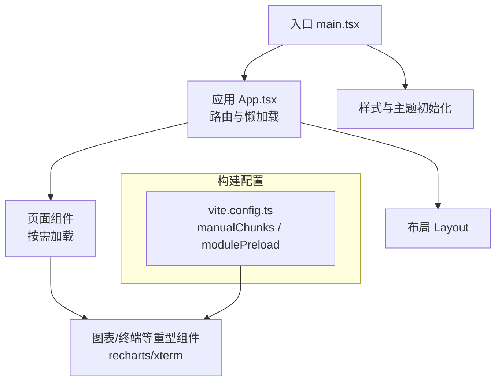
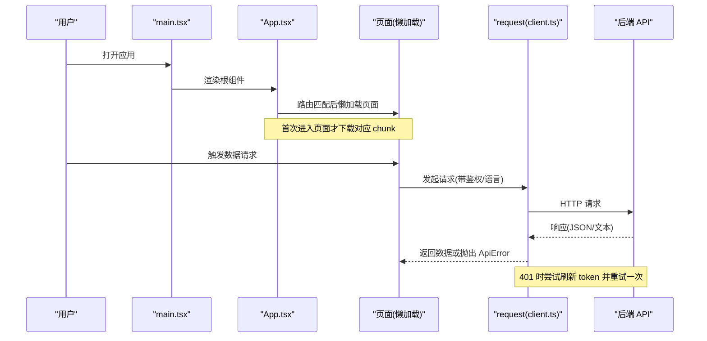
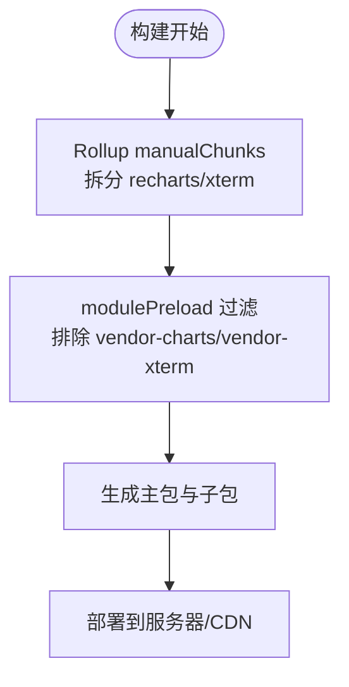
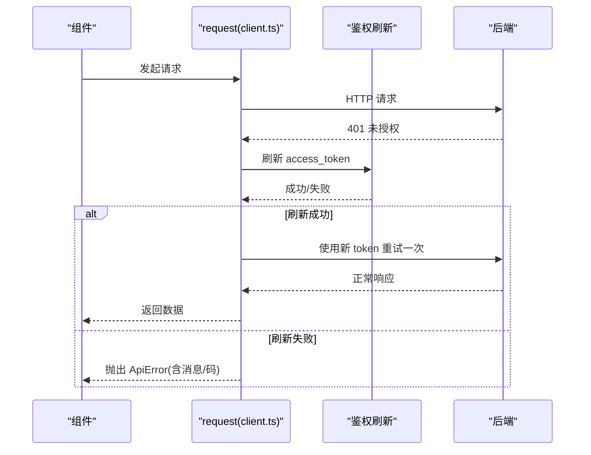
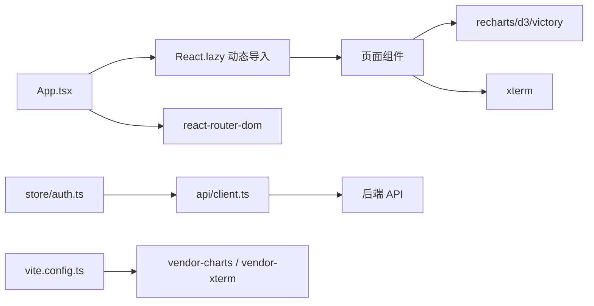

# 前端性能优化

<cite>
**本文引用的文件**
- [web/package.json](file://web/package.json)
- [web/vite.config.ts](file://web/vite.config.ts)
- [web/src/main.tsx](file://web/src/main.tsx)
- [web/src/App.tsx](file://web/src/App.tsx)
- [web/src/api/client.ts](file://web/src/api/client.ts)
- [web/src/lib/usePoll.ts](file://web/src/lib/usePoll.ts)
- [web/src/components/CommandPalette.tsx](file://web/src/components/CommandPalette.tsx)
- [web/src/components/PromQLPanel.tsx](file://web/src/components/PromQLPanel.tsx)
- [web/src/store/auth.ts](file://web/src/store/auth.ts)
</cite>

## 目录
1. [简介](#简介)
2. [项目结构](#项目结构)
3. [核心组件](#核心组件)
4. [架构总览](#架构总览)
5. [详细组件分析](#详细组件分析)
6. [依赖关系分析](#依赖关系分析)
7. [性能考量](#性能考量)
8. [故障排查指南](#故障排查指南)
9. [结论](#结论)
10. [附录](#附录)

## 简介
本指南面向本项目的前端性能优化，围绕资源加载、缓存机制、渲染性能、网络请求与监控调试五大主题，结合仓库中的实际实现给出可落地的策略与最佳实践。重点覆盖：
- 资源加载优化：代码分割、懒加载、静态资源压缩与预加载控制
- 缓存机制：浏览器缓存、Service Worker（建议）、API 响应缓存（建议）
- 渲染性能：虚拟滚动、防抖节流、React 组件优化
- 网络请求：请求合并、重试与鉴权刷新、错误处理
- 监控与调试：Lighthouse、性能基准测试与日常排障

## 项目结构
本项目为基于 Vite + React 的 SPA，路由级页面普遍采用动态导入以实现按需加载；构建阶段通过 Rollup manualChunks 将重型第三方库拆分为独立 chunk，并通过 modulePreload 过滤避免对非首屏页面的预加载污染。

图示来源
- [web/src/main.tsx:1-26](file://web/src/main.tsx#L1-L26)
- [web/src/App.tsx:1-70](file://web/src/App.tsx#L1-L70)
- [web/vite.config.ts:13-53](file://web/vite.config.ts#L13-L53)

章节来源
- [web/src/main.tsx:1-26](file://web/src/main.tsx#L1-L26)
- [web/src/App.tsx:1-70](file://web/src/App.tsx#L1-L70)
- [web/vite.config.ts:13-53](file://web/vite.config.ts#L13-L53)

## 核心组件
- 路由与懒加载：App 中所有页面均使用 React.lazy + 动态 import，显著降低首包体积并减少无关资源的初始下载。
- 构建期分包：vite.config.ts 将 recharts/d3/victory 归入 vendor-charts，xterm 归入 vendor-xterm，避免它们进入主包。
- 预加载裁剪：modulePreload.resolveDependencies 过滤掉 vendor-charts 与 vendor-xterm，防止登录页提前加载这些大依赖。
- 网络层：统一的 request 封装提供鉴权头、错误解析、401 自动刷新令牌并重试一次。
- 轮询工具：usePoll 在标签页不可见时暂停轮询，恢复时立即执行一次以补齐数据，避免后台持续请求。
- 状态持久化：auth store 使用 zustand/persist 将会话信息持久化到 localStorage，提升二次访问体验。

章节来源
- [web/src/App.tsx:1-70](file://web/src/App.tsx#L1-L70)
- [web/vite.config.ts:13-53](file://web/vite.config.ts#L13-L53)
- [web/src/api/client.ts:27-115](file://web/src/api/client.ts#L27-L115)
- [web/src/lib/usePoll.ts:1-46](file://web/src/lib/usePoll.ts#L1-L46)
- [web/src/store/auth.ts:1-50](file://web/src/store/auth.ts#L1-L50)

## 架构总览
下图展示从入口到页面、再到网络请求的关键路径，体现懒加载与构建分包如何协同工作。

图示来源
- [web/src/main.tsx:19-25](file://web/src/main.tsx#L19-L25)
- [web/src/App.tsx:86-120](file://web/src/App.tsx#L86-L120)
- [web/src/api/client.ts:27-115](file://web/src/api/client.ts#L27-L115)

## 详细组件分析

### 资源加载优化：代码分割、懒加载与预加载控制
- 路由级懒加载：所有页面通过 React.lazy 包裹动态 import，仅在路由命中时加载对应模块，减少首屏体积。
- 构建期手动分包：将重依赖按功能拆分，避免主包膨胀；同时保留 react/react-router/zustand 等在默认 bundle 中以保证初始化顺序稳定。
- 预加载裁剪：通过 modulePreload.resolveDependencies 排除 vendor-charts 与 vendor-xterm，避免登录页预加载这些大依赖。
- 目标与产物：构建目标 es2020，关闭 sourcemap，输出至 dist，便于生产环境部署与 CDN 缓存。

图示来源
- [web/vite.config.ts:13-53](file://web/vite.config.ts#L13-L53)

章节来源
- [web/src/App.tsx:1-70](file://web/src/App.tsx#L1-L70)
- [web/vite.config.ts:13-53](file://web/vite.config.ts#L13-L53)

### 缓存机制：浏览器缓存、Service Worker、API 响应缓存
- 浏览器缓存：利用 Vite 构建输出的文件名哈希（由打包器默认行为保证），配合服务端 Cache-Control/ETag 可实现长期缓存与强一致性更新。
- Service Worker 缓存（建议）：可在构建产物基础上引入 SW 进行离线缓存与增量更新，适合高频访问且变更不频繁的资源。
- API 响应缓存（建议）：当前未内置全局缓存，建议在业务层对幂等 GET 请求增加内存缓存（如 Map）或基于 key 的短期缓存，以减少重复请求。

说明：本节为通用建议，仓库中未直接实现 SW 与全局 API 缓存。

### 渲染性能优化：虚拟滚动、防抖节流与 React 组件优化
- 列表与大数据渲染：对于长列表场景建议使用虚拟滚动（仅渲染可视区域），以降低 DOM 节点数量与重排开销。
- 事件频率控制：对输入、滚动、窗口 resize 等高频事件使用防抖/节流，避免过度计算与重绘。
- React 优化：
  - 使用 useMemo/useCallback 缓存计算结果与回调，减少不必要的重渲染。
  - 将重型图表/终端组件延迟挂载，并在不可见时销毁或暂停渲染。
  - 合理拆分组件，避免大块子树无意义更新。

示例参考：
- 命令面板中使用 useMemo 对搜索结果进行排序与扁平化，避免每次渲染重新计算。
- PromQL 面板中对矩阵数据进行行转换与单位格式化时使用 useMemo，并按范围计算步长，减少重复计算。

章节来源
- [web/src/components/CommandPalette.tsx:66-100](file://web/src/components/CommandPalette.tsx#L66-L100)
- [web/src/components/PromQLPanel.tsx:277-280](file://web/src/components/PromQLPanel.tsx#L277-L280)
- [web/src/components/PromQLPanel.tsx:371-452](file://web/src/components/PromQLPanel.tsx#L371-L452)

### 网络请求优化：请求合并、重试机制与错误处理
- 统一请求封装：集中处理 Accept-Language、Authorization、JSON 序列化、错误解析与 401 刷新流程。
- 401 自动刷新：当收到 401 时，调用刷新接口获取新 token，成功后用新 token 重试原请求一次；若刷新失败则登出。
- 并发刷新保护：refreshInFlight 确保同一时间只有一个刷新请求，避免风暴式刷新。
- 错误处理：将后端错误体中的 message/code 提取为结构化错误，便于 UI 展示与埋点。

图示来源
- [web/src/api/client.ts:27-115](file://web/src/api/client.ts#L27-L115)
- [web/src/api/client.ts:117-162](file://web/src/api/client.ts#L117-L162)

章节来源
- [web/src/api/client.ts:27-162](file://web/src/api/client.ts#L27-L162)

### 轮询与可见性优化
- usePoll 在标签页不可见时跳过轮询，避免后台浪费带宽与 CPU；恢复可见时立即执行一次，确保数据及时更新。
- 支持 enabled 开关与 interval 动态调整，便于根据用户交互或依赖加载状态控制轮询。

章节来源
- [web/src/lib/usePoll.ts:1-46](file://web/src/lib/usePoll.ts#L1-L46)

## 依赖关系分析
- 运行时依赖：react、react-router-dom、zustand、recharts、xterm 等。
- 构建依赖：vite、@vitejs/plugin-react、tailwindcss、postcss、autoprefixer、typescript。
- 关键耦合点：
  - App.tsx 与路由懒加载：决定哪些模块被拆分与何时加载。
  - vite.config.ts 与 Rollup manualChunks：决定第三方库的分包策略。
  - api/client.ts 与 auth store：鉴权与刷新逻辑强相关。

图示来源
- [web/src/App.tsx:1-70](file://web/src/App.tsx#L1-L70)
- [web/vite.config.ts:31-51](file://web/vite.config.ts#L31-L51)
- [web/src/api/client.ts:27-115](file://web/src/api/client.ts#L27-L115)
- [web/src/store/auth.ts:1-50](file://web/src/store/auth.ts#L1-L50)

章节来源
- [web/package.json:17-53](file://web/package.json#L17-L53)
- [web/vite.config.ts:31-51](file://web/vite.config.ts#L31-L51)
- [web/src/App.tsx:1-70](file://web/src/App.tsx#L1-L70)
- [web/src/api/client.ts:27-115](file://web/src/api/client.ts#L27-L115)
- [web/src/store/auth.ts:1-50](file://web/src/store/auth.ts#L1-L50)

## 性能考量
- 首屏体积与加载时间
  - 路由级懒加载已大幅降低首包体积；继续评估是否可将更多低频页面懒加载。
  - 保持 vendor-charts 与 vendor-xterm 作为独立 chunk，并确保不被预加载污染。
- 渲染性能
  - 对长列表/大数据表格引入虚拟滚动。
  - 对高频事件加防抖/节流；对复杂计算使用 useMemo/useCallback。
  - 图表与终端组件按需挂载，必要时在不可见时暂停渲染。
- 网络请求
  - 复用 request 封装的错误处理与 401 刷新逻辑；对幂等 GET 请求增加短期内存缓存。
  - 对批量数据拉取考虑请求合并（例如聚合多个小请求为一个批量接口）。
- 缓存策略
  - 静态资源启用强缓存与版本化文件名；API 响应按场景选择内存缓存或 SW 缓存。
  - 对热路径（如仪表盘）可考虑短 TTL 的本地缓存，减少抖动。
- 构建与部署
  - 保持 target es2020，关闭开发 sourcemap，生产开启 gzip/br 压缩（由服务器或 CDN 提供）。
  - 使用 CDN 分发静态资源，配合 HTTP 缓存头与版本号。

[本节为通用指导，不直接分析具体文件]

## 故障排查指南
- 登录页加载过慢
  - 检查是否误将 vendor-charts/vendor-xterm 纳入预加载；确认 modulePreload 过滤规则生效。
  - 使用浏览器开发者工具的“网络”面板查看首屏请求与 chunk 大小。
- 图表显示异常或崩溃
  - 检查 PromQL 面板的数据转换逻辑与时间轴 domain 设置，避免数据单位不一致导致的缩放问题。
  - 对大量 series 的场景，考虑隐藏图例或降采样以提升渲染性能。
- 401 频繁出现或刷新风暴
  - 确认 refreshInFlight 并发保护有效；检查刷新接口是否正确返回新 token。
  - 观察是否在短时间内发起大量请求导致多次刷新。
- 后台轮询占用资源
  - 确认 usePoll 的 visibilitychange 监听是否生效；在标签页不可见时应停止轮询。

章节来源
- [web/vite.config.ts:17-30](file://web/vite.config.ts#L17-L30)
- [web/src/components/PromQLPanel.tsx:290-305](file://web/src/components/PromQLPanel.tsx#L290-L305)
- [web/src/api/client.ts:97-115](file://web/src/api/client.ts#L97-L115)
- [web/src/lib/usePoll.ts:26-44](file://web/src/lib/usePoll.ts#L26-L44)

## 结论
本项目已通过路由级懒加载与构建期分包有效控制首屏体积与加载时间；网络层具备完善的鉴权与错误处理机制；轮询工具在可见性变化时能智能暂停与恢复。后续可进一步引入虚拟滚动、请求合并与更细粒度的缓存策略，并结合 Lighthouse 与性能基准测试持续优化用户体验。

[本节为总结性内容，不直接分析具体文件]

## 附录
- 常用优化清单
  - 路由懒加载：确保所有非首屏页面使用 React.lazy。
  - 分包策略：将重型依赖拆分到独立 chunk，避免预加载污染。
  - 事件优化：对高频事件加防抖/节流；对复杂计算使用 useMemo/useCallback。
  - 网络优化：统一请求封装、401 刷新、错误结构化；对幂等 GET 增加短期缓存。
  - 缓存策略：静态资源强缓存+版本化；API 响应按场景选择内存/SW 缓存。
  - 监控调试：定期运行 Lighthouse，记录关键指标（FCP/LCP/CLS/TBT）；建立性能回归基线。

[本节为补充信息，不直接分析具体文件]