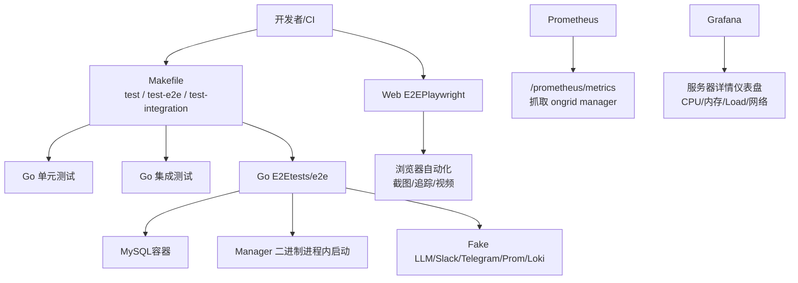
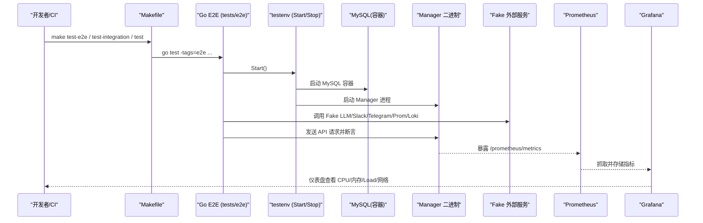
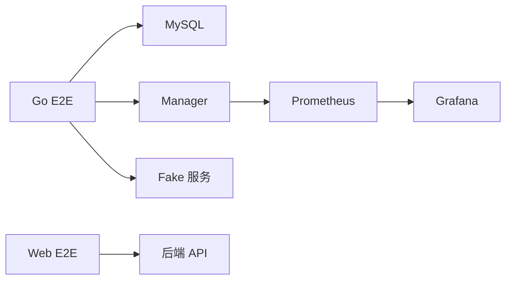

# 性能测试

<cite>
**本文引用的文件**
- [Makefile](file://Makefile)
- [tests/e2e/README.md](file://tests/e2e/README.md)
- [tests/e2e/testenv/secrets.go](file://tests/e2e/testenv/secrets.go)
- [deploy/prometheus/prometheus.yml](file://deploy/prometheus/prometheus.yml)
- [deploy/grafana/provisioning/dashboards/json/server-detail.json](file://deploy/grafana/provisioning/dashboards/json/server-detail.json)
- [cmd/ongrid/main.go](file://cmd/ongrid/main.go)
- [internal/manager/biz/alert/evaluators_phaseA.go](file://internal/manager/biz/alert/evaluators_phaseA.go)
- [internal/manager/biz/alert/evaluators_phaseB.go](file://internal/manager/biz/alert/evaluators_phaseB.go)
- [internal/manager/service/systemhealth/service.go](file://internal/manager/service/systemhealth/service.go)
- [web/playwright.config.ts](file://web/playwright.config.ts)
- [web/e2e/README.md](file://web/e2e/README.md)
</cite>

## 目录
1. [简介](#简介)
2. [项目结构](#项目结构)
3. [核心组件](#核心组件)
4. [架构总览](#架构总览)
5. [详细组件分析](#详细组件分析)
6. [依赖关系分析](#依赖关系分析)
7. [性能考量](#性能考量)
8. [故障排查指南](#故障排查指南)
9. [结论](#结论)
10. [附录](#附录)

## 简介
本指南面向 Ongrid 项目的性能测试实践，覆盖单元测试基准、集成测试基准与端到端（E2E）性能测试；说明负载测试工具使用（JMeter、k6、自定义脚本）；给出性能测试环境搭建（数据准备、监控指标采集、结果分析）；定义性能回归检测（自动化流水线、阈值设定、告警机制）；并提供最佳实践与常见问题解决方案。内容基于仓库现有测试基础设施、可观测性配置与构建脚本进行系统化整理。

## 项目结构
仓库提供了完善的测试入口与 E2E 框架：
- 构建与测试入口集中在 Makefile，提供单元测试、集成测试、E2E 测试等目标。
- E2E 测试位于 tests/e2e，默认使用 fakes（无需外部凭据），支持 live 模式接入真实外部服务。
- Web 前端 E2E 使用 Playwright，输出报告、截图、视频与追踪。
- 可观测性方面，Prometheus 抓取 ongrid manager 的 /prometheus/metrics；Grafana 预置服务器详情仪表盘用于 CPU/内存/负载/网络等指标可视化。

图表来源
- [Makefile:103-117](file://Makefile#L103-L117)
- [tests/e2e/README.md:1-55](file://tests/e2e/README.md#L1-L55)
- [deploy/prometheus/prometheus.yml:1-28](file://deploy/prometheus/prometheus.yml#L1-L28)
- [deploy/grafana/provisioning/dashboards/json/server-detail.json:1-457](file://deploy/grafana/provisioning/dashboards/json/server-detail.json#L1-L457)

章节来源
- [Makefile:103-117](file://Makefile#L103-L117)
- [tests/e2e/README.md:1-55](file://tests/e2e/README.md#L1-L55)
- [web/playwright.config.ts:1-50](file://web/playwright.config.ts#L1-L50)
- [web/e2e/README.md:1-17](file://web/e2e/README.md#L1-L17)
- [deploy/prometheus/prometheus.yml:1-28](file://deploy/prometheus/prometheus.yml#L1-L28)
- [deploy/grafana/provisioning/dashboards/json/server-detail.json:1-457](file://deploy/grafana/provisioning/dashboards/json/server-detail.json#L1-L457)

## 核心组件
- 测试入口与分层
  - 单元测试：go test ./...
  - 集成测试：go test -tags=integration ./...
  - E2E：go test -tags=e2e ./tests/e2e/...（默认 fakes；live 模式需 secrets）
- E2E 测试环境
  - MySQL 容器、Manager 二进制、Fake 外部服务（LLM/Slack/Telegram/Prom/Loki）
  - 通过 testenv.Start/Stop 管理生命周期
- Web E2E（Playwright）
  - 浏览器自动化、认证状态复用、失败时截图/追踪/视频
  - 报告输出到 output/playwright/results 与 report
- 可观测性与监控
  - Prometheus 抓取 ongrid manager 的 /prometheus/metrics
  - Grafana 预置仪表盘展示 CPU/内存/Load/网络等关键指标

章节来源
- [Makefile:103-117](file://Makefile#L103-L117)
- [tests/e2e/README.md:1-55](file://tests/e2e/README.md#L1-L55)
- [web/playwright.config.ts:1-50](file://web/playwright.config.ts#L1-L50)
- [web/e2e/README.md:1-17](file://web/e2e/README.md#L1-L17)
- [deploy/prometheus/prometheus.yml:1-28](file://deploy/prometheus/prometheus.yml#L1-L28)
- [deploy/grafana/provisioning/dashboards/json/server-detail.json:1-457](file://deploy/grafana/provisioning/dashboards/json/server-detail.json#L1-L457)

## 架构总览
下图展示了从测试执行到指标采集与可视化的整体流程，包括 Go E2E 与 Web E2E 两条路径，以及 Prometheus/Grafana 的可观测性链路。

图表来源
- [Makefile:103-117](file://Makefile#L103-L117)
- [tests/e2e/README.md:31-55](file://tests/e2e/README.md#L31-L55)
- [deploy/prometheus/prometheus.yml:10-19](file://deploy/prometheus/prometheus.yml#L10-L19)
- [deploy/grafana/provisioning/dashboards/json/server-detail.json:109-406](file://deploy/grafana/provisioning/dashboards/json/server-detail.json#L109-L406)

## 详细组件分析

### 单元测试基准
- 目标
  - 快速验证核心逻辑正确性，为性能基线提供稳定参考。
- 方法
  - 使用 go test 运行全量单元测试；必要时启用 race 检测。
  - 对热点函数编写基准测试（如 CPU/内存占用、并发安全）。
- 建议
  - 基准用例应隔离外部依赖，避免网络抖动影响稳定性。
  - 记录 p95/p99 延迟与吞吐，作为回归基线。

章节来源
- [Makefile:103-108](file://Makefile#L103-L108)

### 集成测试基准
- 目标
  - 在接近生产环境的条件下验证模块间交互的性能与稳定性。
- 方法
  - 使用 -tags=integration 运行集成测试，覆盖数据库、消息队列、缓存等依赖。
  - 结合 Prometheus 指标观察各子系统耗时与错误率。
- 建议
  - 控制并发度与数据规模，模拟典型负载场景。
  - 将关键路径的评估耗时纳入指标收集（例如规则评估耗时）。

章节来源
- [Makefile:110-112](file://Makefile#L110-L112)
- [internal/manager/biz/alert/evaluators_phaseA.go:18-31](file://internal/manager/biz/alert/evaluators_phaseA.go#L18-L31)

### 端到端性能测试（Go E2E）
- 目标
  - 验证完整业务流程在真实或半真实环境下的性能表现。
- 方法
  - 使用 make test-e2e 运行默认 fakes 模式；make test-e2e-live 切换至真实外部服务。
  - 通过 testenv 管理 MySQL、Manager、Fake 服务的生命周期。
- 建议
  - 以 catalog 驱动用例设计，确保每个行为有独立断言。
  - 在 CI 中定期运行 live 模式，捕获外部依赖回归。

章节来源
- [tests/e2e/README.md:7-16](file://tests/e2e/README.md#L7-L16)
- [tests/e2e/README.md:31-55](file://tests/e2e/README.md#L31-L55)
- [tests/e2e/README.md:118-123](file://tests/e2e/README.md#L118-L123)

### 端到端性能测试（Web E2E）
- 目标
  - 验证前端页面交互、导航与资源视图的性能与稳定性。
- 方法
  - 使用 Playwright 执行浏览器自动化测试，支持认证状态复用。
  - 失败时自动截图、保留追踪与视频，便于定位问题。
- 建议
  - 设置合理的超时与重试策略，避免偶发网络抖动导致误报。
  - 将 UI 响应时间、首屏渲染时间纳入性能基线。

章节来源
- [web/playwright.config.ts:13-34](file://web/playwright.config.ts#L13-L34)
- [web/e2e/README.md:1-17](file://web/e2e/README.md#L1-L17)

### 负载测试工具使用
- JMeter
  - 适用于 HTTP API 压测，可录制脚本、设置并发与思考时间。
  - 建议结合 Prometheus/Grafana 观察服务端指标变化。
- k6
  - 代码化脚本，适合持续集成中的轻量压测。
  - 可输出 JSON 报告并与 CI 集成，实现自动化回归。
- 自定义压力测试脚本
  - 基于 Go 或 Python 编写，灵活控制场景与断言。
  - 建议统一输出结构化日志与指标，便于后续分析。

[本节为通用指导，不直接分析具体文件]

### 性能测试环境搭建
- 测试数据准备
  - 使用 testcontainers-go 启动 MySQL 容器，保证每次测试环境隔离。
  - 通过 testenv 注入必要配置与凭据，避免硬编码。
- 监控指标采集
  - Prometheus 抓取 ongrid manager 的 /prometheus/metrics。
  - Grafana 预置“服务器详情”仪表盘，展示 CPU/内存/Load/网络等关键指标。
- 测试结果分析
  - 结合 Prometheus 指标与 Grafana 面板，分析延迟、吞吐、错误率。
  - 对异常波动进行根因定位，关注慢查询、高 CPU、内存泄漏等。

章节来源
- [tests/e2e/README.md:18-55](file://tests/e2e/README.md#L18-L55)
- [deploy/prometheus/prometheus.yml:10-19](file://deploy/prometheus/prometheus.yml#L10-L19)
- [deploy/grafana/provisioning/dashboards/json/server-detail.json:109-406](file://deploy/grafana/provisioning/dashboards/json/server-detail.json#L109-L406)

### 性能回归检测
- 自动化性能测试流水线
  - 在 CI 中集成 make test、make test-integration、make test-e2e。
  - 定期运行 live 模式，捕获外部依赖变更带来的回归。
- 性能阈值设定
  - 基于历史数据设定 p95/p99 延迟、吞吐、错误率阈值。
  - 对关键路径（如规则评估、API 处理）建立独立阈值。
- 告警机制
  - 利用 Prometheus 规则与 Grafana 告警，对超阈指标触发通知。
  - 结合系统健康检查（Grafana/Loki 就绪探针）保障可观测性可用性。

章节来源
- [internal/manager/service/systemhealth/service.go:190-224](file://internal/manager/service/systemhealth/service.go#L190-L224)
- [internal/manager/biz/alert/evaluators_phaseB.go:259-355](file://internal/manager/biz/alert/evaluators_phaseB.go#L259-L355)

## 依赖关系分析
- 测试层依赖
  - Go E2E 依赖 MySQL、Manager、Fake 服务；Web E2E 依赖浏览器与后端 API。
- 可观测性依赖
  - Prometheus 抓取 Manager 指标；Grafana 消费 Prometheus 数据。
- 构建与发布
  - Makefile 统一管理构建、测试、打包与发布流程，确保一致性。

图表来源
- [tests/e2e/README.md:31-55](file://tests/e2e/README.md#L31-L55)
- [deploy/prometheus/prometheus.yml:10-19](file://deploy/prometheus/prometheus.yml#L10-L19)
- [deploy/grafana/provisioning/dashboards/json/server-detail.json:109-406](file://deploy/grafana/provisioning/dashboards/json/server-detail.json#L109-L406)

章节来源
- [Makefile:103-117](file://Makefile#L103-L117)
- [tests/e2e/README.md:31-55](file://tests/e2e/README.md#L31-L55)
- [deploy/prometheus/prometheus.yml:10-19](file://deploy/prometheus/prometheus.yml#L10-L19)
- [deploy/grafana/provisioning/dashboards/json/server-detail.json:109-406](file://deploy/grafana/provisioning/dashboards/json/server-detail.json#L109-L406)

## 性能考量
- 基准选择
  - 优先对热点路径（如规则评估、API 处理）建立基准，关注 p95/p99。
- 并发与资源
  - 合理设置并发度，避免资源争用导致假阳性退化。
- 数据规模
  - 逐步扩大数据规模，观察线性/非线性增长趋势。
- 外部依赖
  - 使用 fakes 隔离外部依赖，减少不确定性；live 模式用于最终验证。
- 指标采集
  - 确保 Prometheus 抓取间隔与评估间隔匹配业务需求。
- 可视化
  - 利用 Grafana 仪表盘快速定位瓶颈，结合告警及时响应。

[本节为通用指导，不直接分析具体文件]

## 故障排查指南
- E2E 测试失败
  - 检查 MySQL 容器启动是否成功，确认 Docker 内存分配充足。
  - 查看 Playwright 截图、追踪与视频，定位 UI 或 API 问题。
- 指标缺失
  - 确认 Prometheus 已配置抓取 ongrid manager 的 /prometheus/metrics。
  - 检查 Grafana 数据源与仪表盘变量是否正确。
- 告警误报
  - 调整阈值与评估间隔，避免瞬时波动触发告警。
  - 结合系统健康检查，排除下游依赖不可用导致的误报。

章节来源
- [tests/e2e/README.md:18-55](file://tests/e2e/README.md#L18-L55)
- [web/playwright.config.ts:13-34](file://web/playwright.config.ts#L13-L34)
- [deploy/prometheus/prometheus.yml:10-19](file://deploy/prometheus/prometheus.yml#L10-L19)
- [deploy/grafana/provisioning/dashboards/json/server-detail.json:109-406](file://deploy/grafana/provisioning/dashboards/json/server-detail.json#L109-L406)

## 结论
通过对单元测试、集成测试与 E2E 测试的分层设计，结合 Prometheus/Grafana 的可观测性能力，Ongrid 项目具备完善的性能测试基础。建议在 CI 中常态化运行性能测试，设定明确阈值与告警，持续优化关键路径性能，确保系统在扩展与演进过程中保持稳定与高效。

[本节为总结性内容，不直接分析具体文件]

## 附录
- 常用命令
  - 单元测试：make test
  - 集成测试：make test-integration
  - E2E（fakes）：make test-e2e
  - E2E（live）：make test-e2e-live
- 环境变量
  - E2E_BASE_URL：指定 Web E2E 目标地址
  - E2E_BROWSER_CHANNEL：指定浏览器通道
  - TESTCONTAINERS_RYUK_DISABLED：禁用 Ryuk 以提升本地性能

章节来源
- [Makefile:103-117](file://Makefile#L103-L117)
- [web/playwright.config.ts:27-34](file://web/playwright.config.ts#L27-L34)
- [tests/e2e/README.md:18-29](file://tests/e2e/README.md#L18-L29)