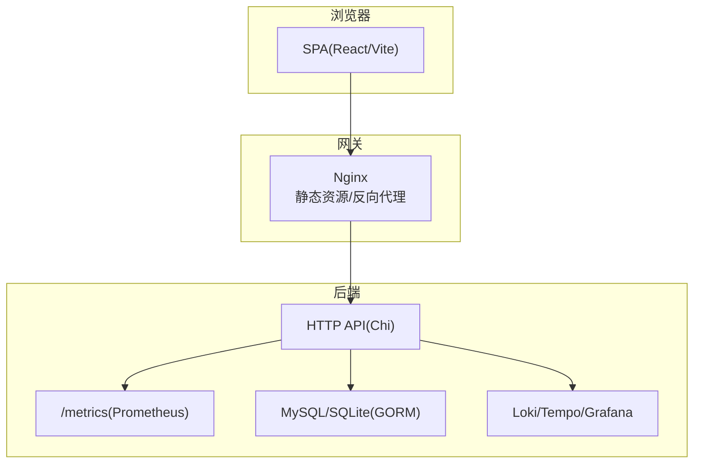
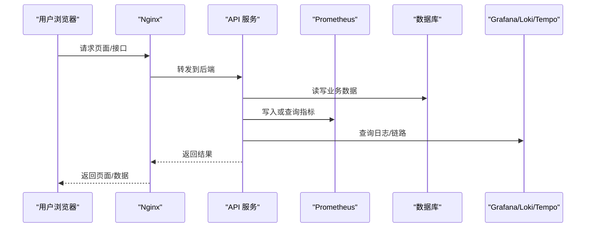
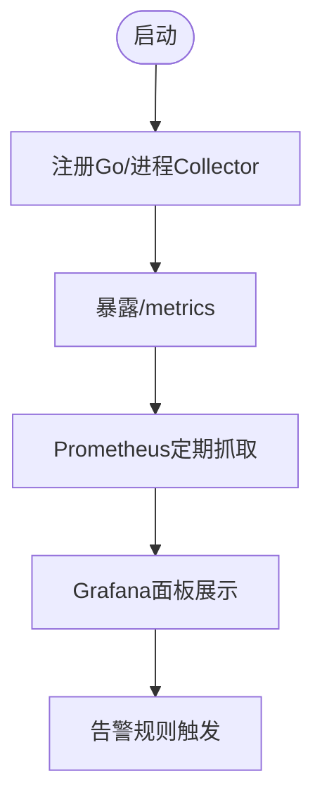
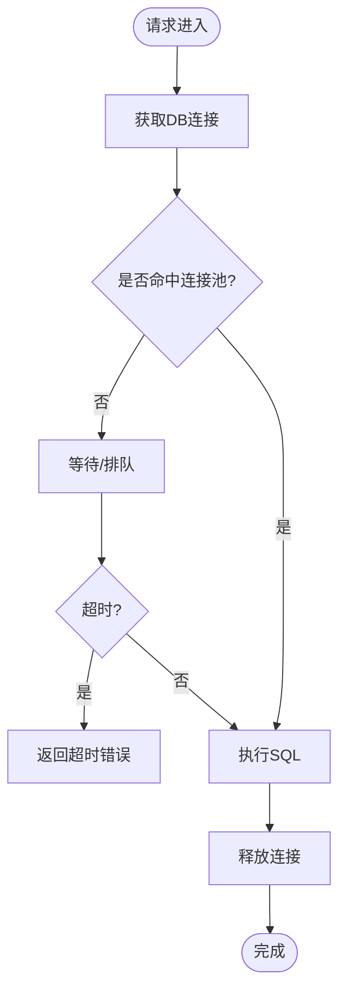
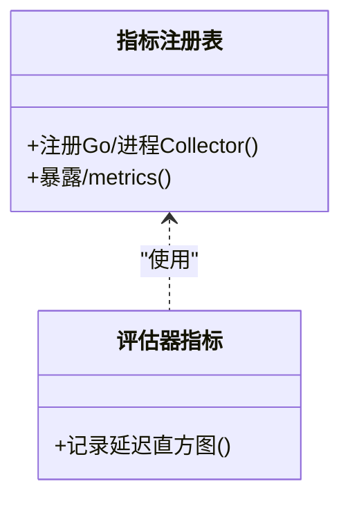
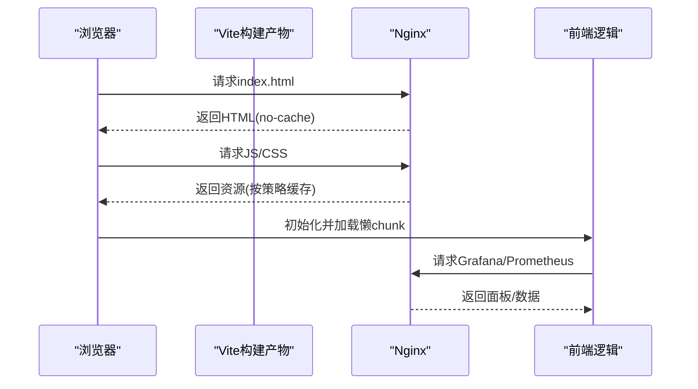
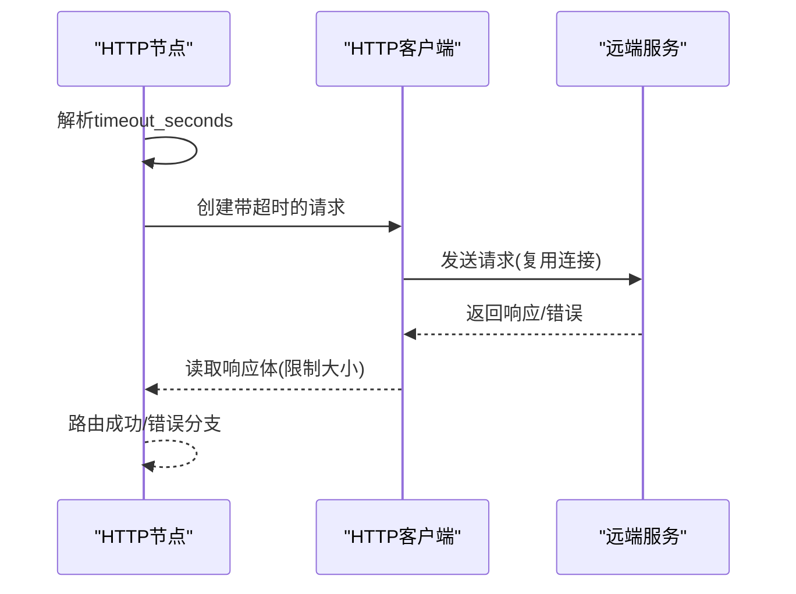
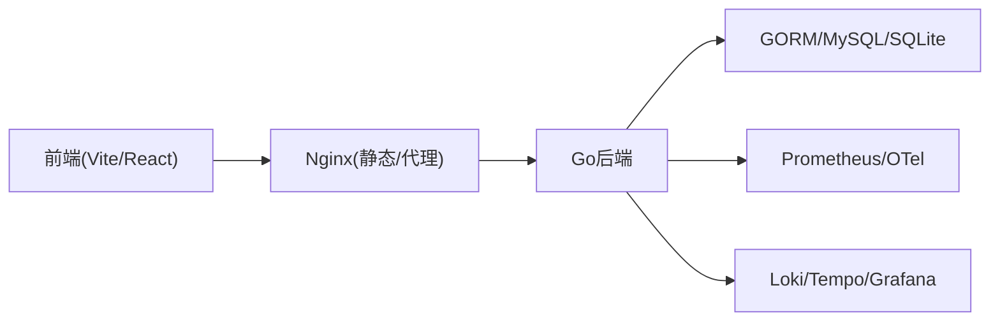

# 性能调优

<cite>
**本文引用的文件**
- [README.md](file://README.md)
- [go.mod](file://go.mod)
- [config.go](file://internal/pkg/config/config.go)
- [dbx.go](file://internal/pkg/dbx/dbx.go)
- [prom.go](file://internal/pkg/prom/prom.go)
- [manager_metrics.go](file://internal/pkg/prom/manager_metrics.go)
- [prom_handler.go](file://internal/manager/server/metric/prom_handler.go)
- [http_node.go](file://internal/manager/biz/flow/http_node.go)
- [nginx.conf（安装版）](file://deploy/install/nginx.conf)
- [nginx.conf（独立版）](file://deploy/nginx/nginx.conf)
- [client.ts](file://web/src/api/client.ts)
- [drilldown.ts](file://web/src/lib/drilldown.ts)
- [vite.config.ts](file://web/vite.config.ts)
- [grafana.ts](file://web/src/api/grafana.ts)
- [prometheus.ts](file://web/src/api/prometheus.ts)
- [db-connection-pool-exhaustion.md](file://internal/manager/biz/knowledge/builtin_vault/diagnostics/db-connection-pool-exhaustion.md)
- [db-slow-queries-locks.md](file://internal/manager/biz/knowledge/builtin_vault/diagnostics/db-slow-queries-locks.md)
- [memory-leak-hunt.md](file://internal/manager/biz/knowledge/builtin_vault/diagnostics/memory-leak-hunt.md)
</cite>

## 目录
1. [简介](#简介)
2. [项目结构](#项目结构)
3. [核心组件](#核心组件)
4. [架构总览](#架构总览)
5. [详细组件分析](#详细组件分析)
6. [依赖分析](#依赖分析)
7. [性能考虑](#性能考虑)
8. [故障排查指南](#故障排查指南)
9. [结论](#结论)
10. [附录](#附录)

## 简介
本指南面向 OnGrid 系统的性能调优，覆盖系统监控（CPU、内存、磁盘 I/O、网络）、数据库优化（查询、索引、连接池）、Go 应用调优（goroutine、内存分配、GC）、前端性能（资源加载、缓存、渲染）、网络调优（连接复用、超时、负载均衡），以及基准测试与瓶颈定位方法。文档结合仓库中的配置、HTTP 处理、指标采集、Nginx 静态资源策略与前端构建配置，给出可操作的实践建议。

## 项目结构
OnGrid 采用多模块 Go 后端 + TypeScript/React 前端：
- 后端：通过 HTTP API、Prometheus 指标、Loki/Tempo/Grafana 集成提供可观测性；使用 GORM 访问 MySQL/SQLite；内置告警与边缘采集。
- 前端：Vite 构建 SPA，内嵌 Grafana 面板渲染与 Prometheus 查询入口；通过统一请求封装实现鉴权与重试。
- 部署：Nginx 作为反向代理与静态资源服务，提供 SPA fallback 与 Edge 安装脚本下载。

图表来源
- [prom.go:1-29](file://internal/pkg/prom/prom.go#L1-L29)
- [nginx.conf（安装版）:393-421](file://deploy/install/nginx.conf#L393-L421)
- [nginx.conf（独立版）:412-440](file://deploy/nginx/nginx.conf#L412-L440)

章节来源
- [README.md:43-57](file://README.md#L43-L57)
- [go.mod:1-44](file://go.mod#L1-L44)

## 核心组件
- 运行时配置：集中从环境变量加载，包含 HTTP/Metrics/Tunnel 地址、DB、Prom/Grafana、通知、告警等关键开关与阈值。
- 数据库层：支持 MySQL（默认）与 SQLite（WAL、busy_timeout、外键开启），启动时 Ping 校验可达性。
- 指标体系：进程级 Prometheus 注册表与 /metrics 处理器，限制标签基数，避免高基数字段。
- 指标读取路径：将边缘指标由 PromQL 范围查询聚合为历史响应形状，兼容前端。
- 外部 HTTP 调用：流程节点对外部 HTTP 的超时控制与错误路由。
- 前端请求：统一封装 fetch，自动注入语言头、鉴权、401 刷新与重试。
- 静态资源与缓存：Nginx 对 SPA 与 Edge 安装脚本设置合适的 Cache-Control；Vite 剥离大依赖预加载并拆分 chunk。

章节来源
- [config.go:20-63](file://internal/pkg/config/config.go#L20-L63)
- [config.go:306-319](file://internal/pkg/config/config.go#L306-L319)
- [config.go:417-548](file://internal/pkg/config/config.go#L417-L548)
- [dbx.go:34-77](file://internal/pkg/dbx/dbx.go#L34-L77)
- [dbx.go:79-128](file://internal/pkg/dbx/dbx.go#L79-L128)
- [prom.go:1-29](file://internal/pkg/prom/prom.go#L1-L29)
- [prom_handler.go:1-29](file://internal/manager/server/metric/prom_handler.go#L1-L29)
- [http_node.go:47-83](file://internal/manager/biz/flow/http_node.go#L47-L83)
- [client.ts:27-115](file://web/src/api/client.ts#L27-L115)
- [vite.config.ts:13-38](file://web/vite.config.ts#L13-L38)
- [nginx.conf（安装版）:393-421](file://deploy/install/nginx.conf#L393-L421)

## 架构总览
系统以“可观测优先”的方式组织：后端暴露 /metrics，Prometheus 拉取；Grafana 展示；Loki/Tempo 提供日志与链路追踪；前端通过内置能力直接渲染面板与发起 PromQL 查询。

图表来源
- [prom.go:16-29](file://internal/pkg/prom/prom.go#L16-L29)
- [prom_handler.go:1-29](file://internal/manager/server/metric/prom_handler.go#L1-L29)
- [nginx.conf（安装版）:412-421](file://deploy/install/nginx.conf#L412-L421)

## 详细组件分析

### 系统性能监控（CPU/内存/磁盘I/O/网络）
- 进程与运行时指标：通过 Prometheus 收集 Go 运行时与进程指标，便于观察 CPU、GC、goroutine、内存分配等。
- 指标采集与导出：/metrics 端点暴露，配合 Prometheus 抓取；在管理侧还注册了评估器延迟等自定义指标。
- 边缘指标读取：通过 PromQL 范围查询聚合后返回给前端，减少数据库压力并提升响应一致性。
- 前端可视化：内嵌 Grafana 面板解析与 PromQL 面板渲染，无需 iframe 即可展示。

图表来源
- [prom.go:16-29](file://internal/pkg/prom/prom.go#L16-L29)
- [manager_metrics.go:11-31](file://internal/pkg/prom/manager_metrics.go#L11-L31)
- [prom_handler.go:1-29](file://internal/manager/server/metric/prom_handler.go#L1-L29)
- [grafana.ts:1-43](file://web/src/api/grafana.ts#L1-L43)

章节来源
- [prom.go:1-29](file://internal/pkg/prom/prom.go#L1-L29)
- [manager_metrics.go:11-31](file://internal/pkg/prom/manager_metrics.go#L11-L31)
- [prom_handler.go:1-29](file://internal/manager/server/metric/prom_handler.go#L1-L29)
- [grafana.ts:1-43](file://web/src/api/grafana.ts#L1-L43)

### 数据库性能优化（查询/索引/连接池）
- 连接与可达性：MySQL 启动时 Ping 验证，SQLite 启用 WAL、busy_timeout 与外键约束，降低并发阻塞风险。
- 连接池与泄漏：当出现“获取连接超时/太多连接”时，需区分客户端池上限与服务端 max_connections；检查事务未提交导致的连接泄漏。
- 慢查询与锁：定位全扫描、缺失索引、长事务与锁竞争；必要时缩短事务、调整锁粒度或使用在线变更工具。
- 建议：合理设置 per-instance 最大连接数，使集群总连接数低于服务端上限并留有余量；引入连接代理（如 PgBouncer/ProxySQL）进行复用。

图表来源
- [dbx.go:34-77](file://internal/pkg/dbx/dbx.go#L34-L77)
- [dbx.go:79-128](file://internal/pkg/dbx/dbx.go#L79-L128)
- [db-connection-pool-exhaustion.md:1-84](file://internal/manager/biz/knowledge/builtin_vault/diagnostics/db-connection-pool-exhaustion.md#L1-L84)
- [db-slow-queries-locks.md:50-85](file://internal/manager/biz/knowledge/builtin_vault/diagnostics/db-slow-queries-locks.md#L50-L85)

章节来源
- [dbx.go:34-77](file://internal/pkg/dbx/dbx.go#L34-L77)
- [dbx.go:79-128](file://internal/pkg/dbx/dbx.go#L79-L128)
- [db-connection-pool-exhaustion.md:1-84](file://internal/manager/biz/knowledge/builtin_vault/diagnostics/db-connection-pool-exhaustion.md#L1-L84)
- [db-slow-queries-locks.md:50-85](file://internal/manager/biz/knowledge/builtin_vault/diagnostics/db-slow-queries-locks.md#L50-L85)

### Go 应用性能调优（goroutine/内存/GC）
- goroutine 与并发：避免无界 goroutine；对周期性任务（如评估器）控制频率与批量；对外部 HTTP 调用设置上下文超时，防止阻塞。
- 内存分配与 GC：关注 pprof heap 的 -alloc_space vs -inuse_space；避免高基数标签导致指标爆炸；合理使用对象池与零拷贝。
- 指标基数治理：严格限制标签集合（method、code、status 等），禁止 org_id/user_id/edge_id/full-path 等高基数字段。
- 诊断：RSS 持续增长时，先排除页缓存与内核 slab，再定位用户态堆增长；必要时使用 eBPF 工具进行分配栈采样。

图表来源
- [prom.go:16-29](file://internal/pkg/prom/prom.go#L16-L29)
- [manager_metrics.go:11-31](file://internal/pkg/prom/manager_metrics.go#L11-L31)
- [memory-leak-hunt.md:1-151](file://internal/manager/biz/knowledge/builtin_vault/diagnostics/memory-leak-hunt.md#L1-L151)

章节来源
- [prom.go:1-29](file://internal/pkg/prom/prom.go#L1-L29)
- [manager_metrics.go:11-31](file://internal/pkg/prom/manager_metrics.go#L11-L31)
- [memory-leak-hunt.md:1-151](file://internal/manager/biz/knowledge/builtin_vault/diagnostics/memory-leak-hunt.md#L1-L151)

### 前端性能优化（资源加载/缓存/渲染）
- 资源加载：Vite 剥离大型依赖（charts/xterm）的预加载，按需懒加载；拆分 chunk 减少首屏体积。
- 缓存策略：Nginx 对 SPA 使用 no-cache，Edge 安装脚本与二进制使用 no-store，避免缓存陈旧产物；对 Grafana 根 URL 做短 TTL 缓存与同域回退。
- 渲染优化：原生解析 Grafana 面板 JSON，避免 iframe 开销；PromQL 查询通过统一入口发起，减少重复请求。

图表来源
- [vite.config.ts:13-38](file://web/vite.config.ts#L13-L38)
- [nginx.conf（安装版）:393-421](file://deploy/install/nginx.conf#L393-L421)
- [drilldown.ts:90-120](file://web/src/lib/drilldown.ts#L90-L120)
- [prometheus.ts:1-12](file://web/src/api/prometheus.ts#L1-L12)

章节来源
- [vite.config.ts:13-38](file://web/vite.config.ts#L13-L38)
- [nginx.conf（安装版）:393-421](file://deploy/install/nginx.conf#L393-L421)
- [drilldown.ts:90-120](file://web/src/lib/drilldown.ts#L90-L120)
- [prometheus.ts:1-12](file://web/src/api/prometheus.ts#L1-L12)

### 网络性能调优（连接复用/超时/负载均衡）
- 超时控制：流程中对外 HTTP 调用支持配置超时秒数，并强制上限，避免长尾请求拖垮线程；失败走错误分支。
- 连接复用：后端使用标准库 HTTP 客户端，默认启用连接复用；可通过上游代理（如 Nginx）进一步复用与限流。
- 负载均衡：Nginx 可作为入口分发；Prometheus 与 Loki/Tempo 作为独立服务横向扩展；数据库通过连接代理分担连接压力。

图表来源
- [http_node.go:47-83](file://internal/manager/biz/flow/http_node.go#L47-L83)
- [nginx.conf（安装版）:393-421](file://deploy/install/nginx.conf#L393-L421)

章节来源
- [http_node.go:47-83](file://internal/manager/biz/flow/http_node.go#L47-L83)
- [nginx.conf（安装版）:393-421](file://deploy/install/nginx.conf#L393-L421)

## 依赖分析
- 运行时依赖：Go 1.25+，大量可观测性与数据库驱动（Prometheus、OTel、GORM、MySQL/SQLite）。
- 前端依赖：Vite、React、TypeScript；构建阶段对大依赖进行预加载剥离与 chunk 拆分。
- 部署依赖：Nginx 作为静态资源与反向代理；可选嵌入 Grafana/Loki/Tempo/Prometheus。

图表来源
- [go.mod:1-44](file://go.mod#L1-L44)
- [vite.config.ts:1-38](file://web/vite.config.ts#L1-L38)
- [nginx.conf（安装版）:393-421](file://deploy/install/nginx.conf#L393-L421)

章节来源
- [go.mod:1-44](file://go.mod#L1-L44)
- [vite.config.ts:1-38](file://web/vite.config.ts#L1-L38)
- [nginx.conf（安装版）:393-421](file://deploy/install/nginx.conf#L393-L421)

## 性能考虑
- 指标与日志：
  - 严格控制指标标签基数，避免高基数维度导致存储与查询成本飙升。
  - 日志级别默认仅 Warn，避免高频查询污染日志。
- 数据库：
  - 合理设置 per-instance 最大连接数，确保集群总连接数低于服务端上限并留有缓冲。
  - 使用 WAL（SQLite）与 busy_timeout 降低写冲突；MySQL 启动时 Ping 快速失败。
- 前端：
  - 剥离大依赖预加载，懒加载路由；对 Grafana 根 URL 做短 TTL 缓存与同域回退。
  - Nginx 对 SPA 使用 no-cache，对安装脚本使用 no-store，保证更新及时。
- 网络：
  - 对外 HTTP 调用设置超时并限制最大时长，避免长尾；利用连接复用减少握手开销。
  - 通过 Nginx 与连接代理（PgBouncer/ProxySQL）提升连接复用与削峰填谷。

[本节为通用指导，不直接分析具体文件]

## 故障排查指南
- 数据库连接池耗尽：
  - 症状：获取连接超时、服务端 too many connections、延迟陡增。
  - 步骤：检查服务端连接上限与空闲连接；核对客户端池配置；排查事务未提交导致的泄漏；必要时引入连接代理。
- 慢查询与锁竞争：
  - 定位全扫描与缺失索引；识别阻塞者（长事务/DDL）；缩短事务、缩小锁范围或采用在线变更工具。
- 内存泄漏与碎片：
  - 确认 RSS 单调增长；排除页缓存与内核 slab；定位用户态堆增长；必要时使用 eBPF 工具采样。
- 前端请求与缓存：
  - 401 自动刷新令牌并重试一次；Grafana 根 URL 缓存失效后重新获取；Nginx 缓存策略影响资源新鲜度。

章节来源
- [db-connection-pool-exhaustion.md:1-84](file://internal/manager/biz/knowledge/builtin_vault/diagnostics/db-connection-pool-exhaustion.md#L1-L84)
- [db-slow-queries-locks.md:50-85](file://internal/manager/biz/knowledge/builtin_vault/diagnostics/db-slow-queries-locks.md#L50-L85)
- [memory-leak-hunt.md:1-151](file://internal/manager/biz/knowledge/builtin_vault/diagnostics/memory-leak-hunt.md#L1-L151)
- [client.ts:27-115](file://web/src/api/client.ts#L27-L115)
- [drilldown.ts:90-120](file://web/src/lib/drilldown.ts#L90-L120)

## 结论
通过对指标采集、数据库连接与查询、Go 运行时、前端资源与缓存、网络超时与复用的系统性优化，可在不改变业务语义的前提下显著提升 OnGrid 的性能与稳定性。建议在生产环境持续采集 /metrics 与日志，结合告警与压测，形成闭环的性能治理机制。

[本节为总结性内容，不直接分析具体文件]

## 附录
- 关键配置项与环境变量：
  - HTTP/Metrics/Tunnel 监听地址、公共 URL、事件保留策略。
  - 数据库方言与 DSN/路径、JWT 过期时间、LLM 提供商与模型列表。
  - Prometheus/Grafana 接入、通知渠道、告警阈值与评估间隔。
  - 边缘采集模式、抓取配置文件路径与间隔。
- 前端构建与缓存：
  - Vite 目标版本、sourcemap、modulePreload 过滤、chunk 拆分策略。
  - Nginx 对 SPA 与 Edge 资源的 Cache-Control 策略。

章节来源
- [config.go:20-63](file://internal/pkg/config/config.go#L20-L63)
- [config.go:306-319](file://internal/pkg/config/config.go#L306-L319)
- [config.go:417-548](file://internal/pkg/config/config.go#L417-L548)
- [vite.config.ts:13-38](file://web/vite.config.ts#L13-L38)
- [nginx.conf（安装版）:393-421](file://deploy/install/nginx.conf#L393-L421)