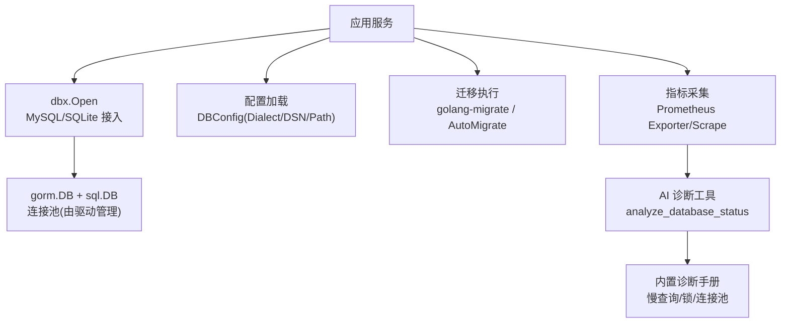
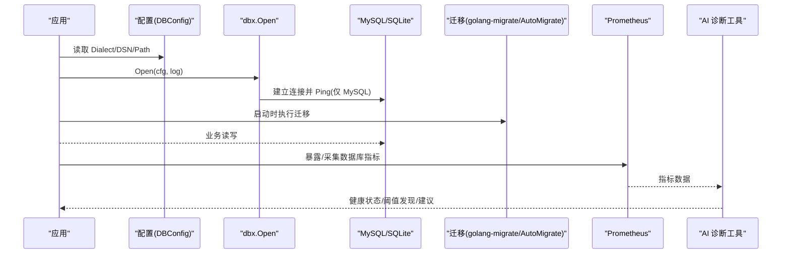
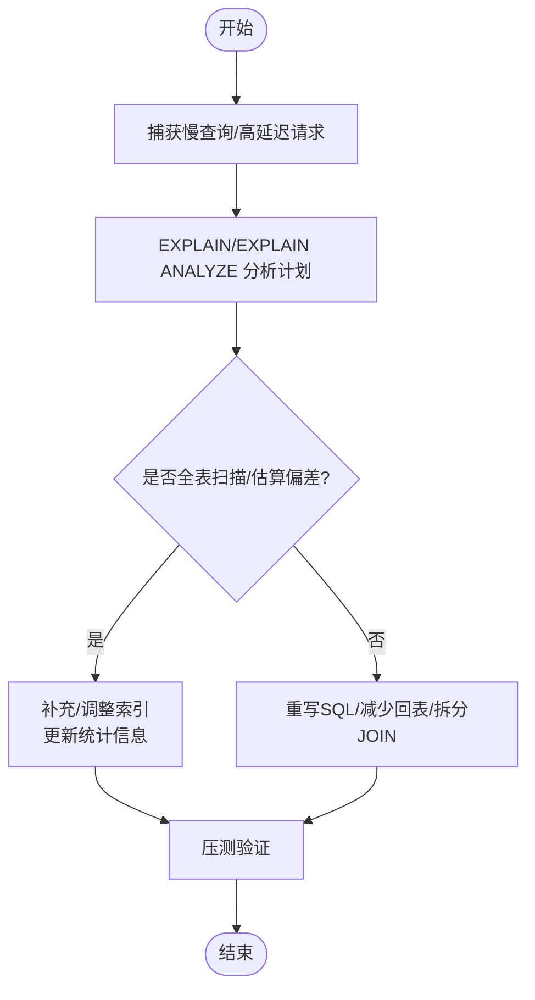
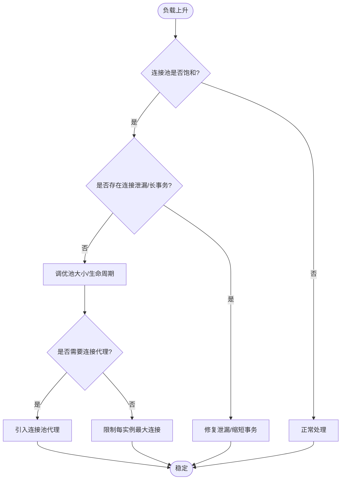
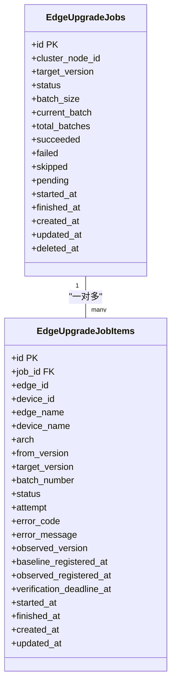
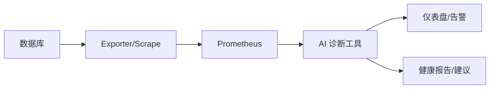
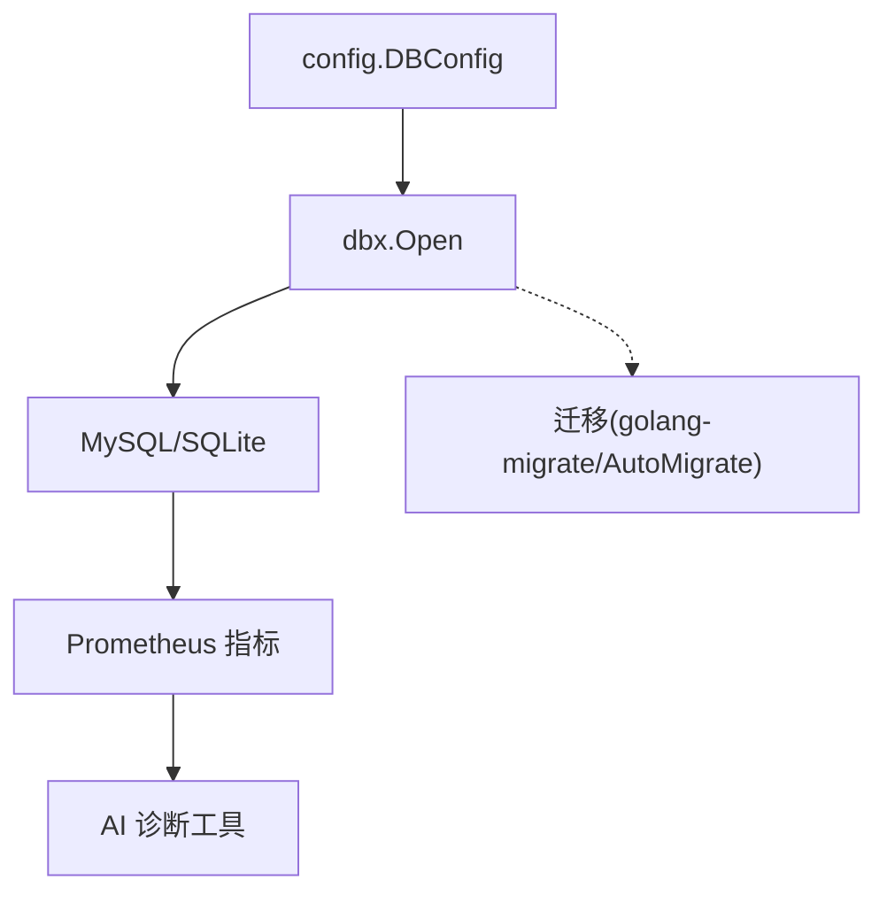

# 数据库优化

<cite>
**本文引用的文件**
- [internal/pkg/dbx/dbx.go](file://internal/pkg/dbx/dbx.go)
- [internal/pkg/config/config.go](file://internal/pkg/config/config.go)
- [db/README.md](file://db/README.md)
- [db/migrations/20260731173000_create_edge_upgrade_jobs.up.sql](file://db/migrations/20260731173000_create_edge_upgrade_jobs.up.sql)
- [internal/manager/biz/knowledge/builtin_vault/diagnostics/db-connection-pool-exhaustion.md](file://internal/manager/biz/knowledge/builtin_vault/diagnostics/db-connection-pool-exhaustion.md)
- [internal/manager/biz/knowledge/builtin_vault/diagnostics/db-slow-queries-locks.md](file://internal/manager/biz/knowledge/builtin_vault/diagnostics/db-slow-queries-locks.md)
- [internal/manager/biz/edge/plugin_config_databasemetrics.go](file://internal/manager/biz/edge/plugin_config_databasemetrics.go)
- [internal/manager/biz/aiops/tools/analyze_database_status.go](file://internal/manager/biz/aiops/tools/analyze_database_status.go)
</cite>

## 目录
1. [简介](#简介)
2. [项目结构](#项目结构)
3. [核心组件](#核心组件)
4. [架构总览](#架构总览)
5. [详细组件分析](#详细组件分析)
6. [依赖关系分析](#依赖关系分析)
7. [性能考量](#性能考量)
8. [故障排查指南](#故障排查指南)
9. [结论](#结论)
10. [附录](#附录)

## 简介
本指南面向生产环境的数据库性能优化，覆盖查询优化、连接池配置、表结构与索引设计、分区与归档、监控与诊断、以及可复现的基准测试方法。内容基于仓库中的数据库接入层、迁移脚本、指标采集与分析工具，并结合内置的诊断手册，形成从“发现问题—定位根因—实施优化—持续验证”的闭环实践。

## 项目结构
与数据库相关的代码主要分布在以下位置：
- 数据库接入与初始化：internal/pkg/dbx（MySQL/SQLite 统一入口）
- 运行时配置：internal/pkg/config（DBConfig 等）
- 版本化迁移：db/migrations（golang-migrate 命名规范）
- 指标采集与诊断：internal/manager/biz/edge/plugin_config_databasemetrics.go、internal/manager/biz/aiops/tools/analyze_database_status.go
- 知识库诊断手册：builtin_vault/diagnostics（慢查询/锁、连接池耗尽）

**图示来源**
- [internal/pkg/dbx/dbx.go:34-77](file://internal/pkg/dbx/dbx.go#L34-L77)
- [internal/pkg/config/config.go:306-319](file://internal/pkg/config/config.go#L306-L319)
- [db/README.md:1-15](file://db/README.md#L1-L15)
- [internal/manager/biz/aiops/tools/analyze_database_status.go:807-836](file://internal/manager/biz/aiops/tools/analyze_database_status.go#L807-L836)

**章节来源**
- [internal/pkg/dbx/dbx.go:34-151](file://internal/pkg/dbx/dbx.go#L34-L151)
- [internal/pkg/config/config.go:306-319](file://internal/pkg/config/config.go#L306-L319)
- [db/README.md:1-15](file://db/README.md#L1-L15)

## 核心组件
- 数据库接入层 dbx：提供统一的 Open 接口，默认 MySQL，可选 SQLite；对 MySQL 在启动时 Ping 校验连通性；对 SQLite 启用 WAL、busy_timeout、外键约束等 pragmas。
- 配置 DBConfig：通过环境变量注入 Dialect/DSN/Path，决定后端类型与连接参数。
- 迁移系统：生产使用 golang-migrate 版本化管理；本地/单机使用 GORM AutoMigrate 初始化空库。
- 指标采集与诊断：边缘侧支持多种数据库类型的指标采集；AI 工具根据发现的指标能力进行健康评估与阈值告警。

**章节来源**
- [internal/pkg/dbx/dbx.go:34-151](file://internal/pkg/dbx/dbx.go#L34-L151)
- [internal/pkg/config/config.go:306-319](file://internal/pkg/config/config.go#L306-L319)
- [db/README.md:1-15](file://db/README.md#L1-L15)
- [internal/manager/biz/edge/plugin_config_databasemetrics.go:470-493](file://internal/manager/biz/edge/plugin_config_databasemetrics.go#L470-L493)
- [internal/manager/biz/aiops/tools/analyze_database_status.go:807-836](file://internal/manager/biz/aiops/tools/analyze_database_status.go#L807-L836)

## 架构总览
下图展示了从应用到数据库的连接、迁移与指标采集路径，以及 AI 诊断如何基于 Prometheus 指标给出健康状态与建议。

**图示来源**
- [internal/pkg/dbx/dbx.go:51-77](file://internal/pkg/dbx/dbx.go#L51-L77)
- [db/README.md:1-15](file://db/README.md#L1-L15)
- [internal/manager/biz/aiops/tools/analyze_database_status.go:807-836](file://internal/manager/biz/aiops/tools/analyze_database_status.go#L807-L836)

## 详细组件分析

### 查询优化与 EXPLAIN 分析
- 慢查询识别：通过慢查询日志或性能视图捕获重复出现的长耗时 SQL。
- 计划分析：使用 EXPLAIN/EXPLAIN ANALYZE 查看扫描方式、行数估计与实际差异、是否走索引。
- 常见根因：缺失索引、统计信息陈旧、全表扫描、复杂 JOIN 未命中合适索引、回表过多。
- 优化手段：补充复合索引、重写条件/JOIN、拆分大事务、避免 SELECT *、分页与游标式拉取。

**章节来源**
- [internal/manager/biz/knowledge/builtin_vault/diagnostics/db-slow-queries-locks.md:39-48](file://internal/manager/biz/knowledge/builtin_vault/diagnostics/db-slow-queries-locks.md#L39-L48)

### 连接池配置与超时
- 客户端连接池：关注最大连接数、空闲连接、连接生命周期，避免连接泄漏与频繁创建销毁。
- 服务端上限：确保所有实例的连接总数低于数据库 max_connections，并保留余量。
- 代理层：多实例小连接场景可引入连接池代理（如 PgBouncer/ProxySQL）复用连接。
- 超时设置：为获取连接、查询执行设置合理超时，防止雪崩。

**章节来源**
- [internal/manager/biz/knowledge/builtin_vault/diagnostics/db-connection-pool-exhaustion.md:8-84](file://internal/manager/biz/knowledge/builtin_vault/diagnostics/db-connection-pool-exhaustion.md#L8-L84)

### 表结构设计优化与索引原则
- 主键与唯一键：选择稳定的自增或有序 ID，避免热点更新；为高频过滤列建立索引。
- 复合索引：按等值条件在前、范围条件在后；尽量覆盖常用查询谓词。
- 冗余与反范式：适度冗余字段以减少 JOIN，但需权衡写入放大与一致性。
- 软删除与时间列：为 deleted_at、created_at 等建立索引以支撑分页与清理任务。
- 示例参考：升级作业表包含批量号、状态、时间戳等列，并针对查询模式建立索引。

**图示来源**
- [db/migrations/20260731173000_create_edge_upgrade_jobs.up.sql:4-59](file://db/migrations/20260731173000_create_edge_upgrade_jobs.up.sql#L4-L59)

**章节来源**
- [db/migrations/20260731173000_create_edge_upgrade_jobs.up.sql:4-59](file://db/migrations/20260731173000_create_edge_upgrade_jobs.up.sql#L4-L59)

### 分区策略与归档方案
- 分区策略：按时间（月/季）、租户或业务域进行水平分区，便于冷热分离与快速裁剪。
- 归档方案：将历史数据迁移至归档库或对象存储，保留必要索引与元数据；定期清理过期分区。
- 维护窗口：在低峰期执行分区切换、重建索引、统计信息更新。
- 监控要点：分区数量、各分区大小、热点分区访问比例、归档成功率。

[本节为通用实践说明，不直接分析具体文件]

### 数据库性能监控
- 慢查询日志：开启并定期分析，结合 EXPLAIN 定位根因。
- 锁等待监控：观察阻塞链，识别长事务与 DDL 影响。
- 缓冲池命中率：关注 InnoDB Buffer Pool 命中率、读请求与物理读比例。
- 连接使用率：当前连接数与上限比值，识别接近上限的风险。
- 指标来源：通过 Prometheus 采集器收集数据库指标，并由 AI 诊断工具汇总能力与阈值。

**图示来源**
- [internal/manager/biz/edge/plugin_config_databasemetrics.go:470-493](file://internal/manager/biz/edge/plugin_config_databasemetrics.go#L470-L493)
- [internal/manager/biz/aiops/tools/analyze_database_status.go:807-836](file://internal/manager/biz/aiops/tools/analyze_database_status.go#L807-L836)

**章节来源**
- [internal/manager/biz/edge/plugin_config_databasemetrics.go:470-493](file://internal/manager/biz/edge/plugin_config_databasemetrics.go#L470-L493)
- [internal/manager/biz/aiops/tools/analyze_database_status.go:986-1005](file://internal/manager/biz/aiops/tools/analyze_database_status.go#L986-L1005)
- [internal/manager/biz/aiops/tools/analyze_database_status.go:1259-1285](file://internal/manager/biz/aiops/tools/analyze_database_status.go#L1259-L1285)

## 依赖关系分析
- dbx 依赖配置模块提供的 DBConfig，决定后端类型与连接参数。
- 迁移系统与 dbx 解耦：生产使用 golang-migrate，本地使用 AutoMigrate。
- 指标采集与 AI 诊断依赖 Prometheus 生态，通过指标名匹配判断能力并生成健康结论。

**图示来源**
- [internal/pkg/config/config.go:306-319](file://internal/pkg/config/config.go#L306-L319)
- [internal/pkg/dbx/dbx.go:34-77](file://internal/pkg/dbx/dbx.go#L34-L77)
- [db/README.md:1-15](file://db/README.md#L1-L15)
- [internal/manager/biz/aiops/tools/analyze_database_status.go:807-836](file://internal/manager/biz/aiops/tools/analyze_database_status.go#L807-L836)

**章节来源**
- [internal/pkg/config/config.go:306-319](file://internal/pkg/config/config.go#L306-L319)
- [internal/pkg/dbx/dbx.go:34-77](file://internal/pkg/dbx/dbx.go#L34-L77)
- [db/README.md:1-15](file://db/README.md#L1-L15)
- [internal/manager/biz/aiops/tools/analyze_database_status.go:807-836](file://internal/manager/biz/aiops/tools/analyze_database_status.go#L807-L836)

## 性能考量
- 连接池：控制每实例最大连接数，确保集群总连接数低于数据库上限；设置连接生命周期以避免僵尸连接。
- 查询：优先走索引、减少回表、避免大事务与长事务；分页采用游标式拉取。
- 索引：按查询模式设计复合索引，定期更新统计信息；避免过度索引导致写入放大。
- 分区与归档：按时间或租户分区，冷数据归档，降低热表体积。
- 监控：持续跟踪慢查询、锁等待、缓冲池命中率、连接使用率；结合 AI 诊断输出阈值告警。

[本节为通用指导，不直接分析具体文件]

## 故障排查指南
- 连接池耗尽：检查客户端池配置与服务端 max_connections；排查 idle in transaction 或泄漏；必要时引入连接代理。
- 慢查询与锁竞争：区分“慢查询”和“被锁等待”，先查阻塞源再优化计划；DDL 在高并发下谨慎执行。
- 缓冲池不足：提升缓冲池大小、优化热点访问模式、减少随机 IO。
- 指标缺失：确认 Exporter/Scrape 已启用对应 collector，并在 AI 诊断中查看能力覆盖。

**章节来源**
- [internal/manager/biz/knowledge/builtin_vault/diagnostics/db-connection-pool-exhaustion.md:8-84](file://internal/manager/biz/knowledge/builtin_vault/diagnostics/db-connection-pool-exhaustion.md#L8-L84)
- [internal/manager/biz/knowledge/builtin_vault/diagnostics/db-slow-queries-locks.md:23-85](file://internal/manager/biz/knowledge/builtin_vault/diagnostics/db-slow-queries-locks.md#L23-L85)

## 结论
通过规范的连接池配置、合理的表结构与索引设计、分区与归档策略、以及完善的监控与诊断体系，可以显著提升数据库性能与稳定性。建议将慢查询治理、锁竞争分析与连接池调优纳入常态化运维流程，并以基准测试验证优化效果。

[本节为总结性内容，不直接分析具体文件]

## 附录

### 基准测试方法
- 目标：评估优化前后 QPS、TPS、P95/P99 延迟、错误率、资源利用率。
- 工具：使用压测工具模拟典型工作负载（读多写少/写多读少/混合）。
- 步骤：
  - 准备基线数据集与预热缓存/缓冲池。
  - 执行基线测试，记录关键指标。
  - 实施优化（索引/SQL/连接池/分区）。
  - 再次压测，对比指标变化。
  - 回归测试，确保功能正确性与稳定性。
- 注意：隔离环境、固定资源、多次采样取中位数；关注抖动与尾部延迟。

[本节为通用实践说明，不直接分析具体文件]