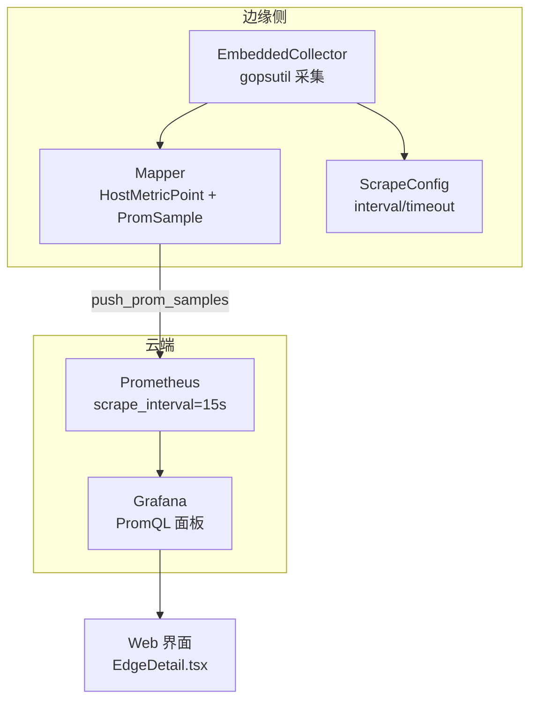
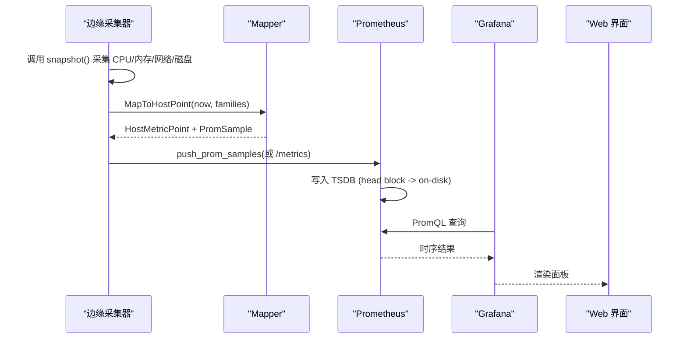
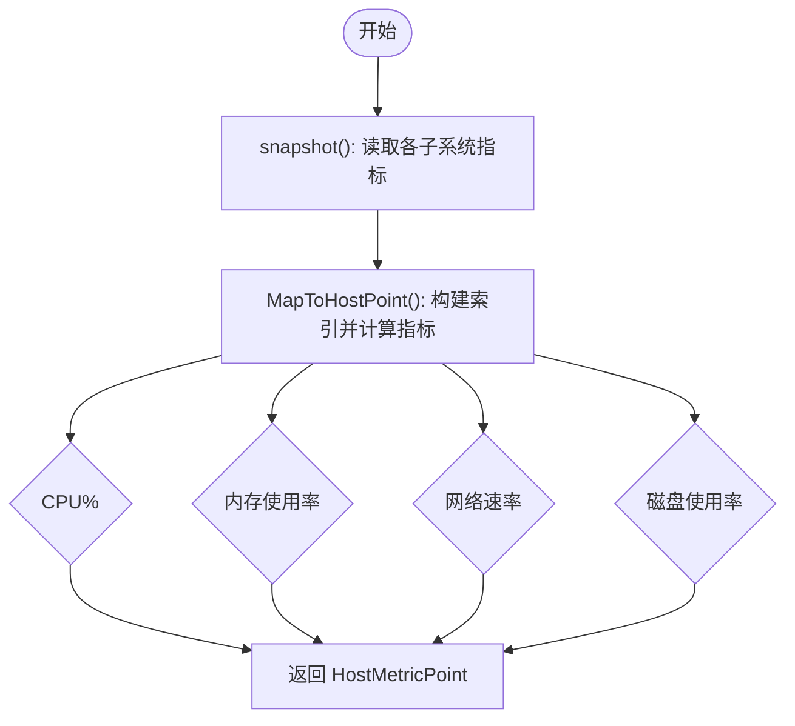
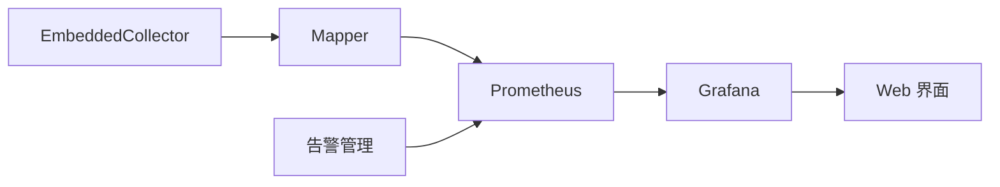

# 系统监控

<cite>
**本文引用的文件**
- [embedded.go](file://internal/edgeagent/collector/embedded.go)
- [mapper.go](file://internal/edgeagent/collector/mapper.go)
- [types.go](file://internal/edgeagent/collector/types.go)
- [scrapecfg.go](file://internal/edgeagent/collector/scrapecfg.go)
- [prometheus.yml](file://deploy/install/prometheus/prometheus.yml)
- [manager_metrics.go](file://internal/pkg/prom/manager_metrics.go)
- [EdgeDetail.tsx](file://web/src/pages/EdgeDetail.tsx)
- [service.go](file://internal/manager/biz/grafana/service.go)
- [alert_rule_manager.go](file://internal/manager/biz/aiops/alertconfig/alert_rule_manager.go)
- [seed_rules.go](file://internal/manager/data/alert/store/seed_rules.go)
- [prom_handler.go](file://internal/manager/server/metric/prom_handler.go)
- [query.go](file://internal/manager/biz/metric/query.go)
- [spec.go](file://internal/edgeagent/plugins/custommetrics/spec.go)
- [spec.go](file://internal/edgeagent/plugins/databasemetrics/spec.go)
</cite>

## 目录
1. [简介](#简介)
2. [项目结构](#项目结构)
3. [核心组件](#核心组件)
4. [架构总览](#架构总览)
5. [详细组件分析](#详细组件分析)
6. [依赖关系分析](#依赖关系分析)
7. [性能考量](#性能考量)
8. [故障排查指南](#故障排查指南)
9. [结论](#结论)
10. [附录](#附录)

## 简介
本文件系统化梳理本仓库中的“系统监控”能力，覆盖 CPU、内存、磁盘 I/O、网络吞吐等关键指标的采集原理、频率配置与性能影响；说明 goroutine、内存分配、GC 暂停时间、网络吞吐量等指标的来源与计算方式；阐述监控数据的存储策略（Prometheus TSDB）、时间序列优化与查询调优；并提供告警规则示例与性能瓶颈识别方法。

## 项目结构
监控相关代码主要分布在以下层次：
- 边缘侧采集器：通过 gopsutil 直接读取宿主指标并生成 Prometheus 格式指标族，同时输出“快速路径”的 8 字段 HostMetricPoint。
- 指标映射与扁平化：将 MetricFamily 转换为统一 HostMetricPoint 和 PromSample 列表，支持速率转换与标签合并。
- 抓取配置：支持 YAML 抓取目标配置（interval/timeout/labels），以及数据库插件的目标解析。
- 云端存储与展示：Prometheus 定时抓取 /metrics，Grafana 面板使用 PromQL 渲染；管理端提供监控面板定义与查询接口。
- 告警：内置规则与草稿流程，支持预览与生效。

图表来源
- [embedded.go:198-234](file://internal/edgeagent/collector/embedded.go#L198-L234)
- [mapper.go:40-62](file://internal/edgeagent/collector/mapper.go#L40-L62)
- [prometheus.yml:6-19](file://deploy/install/prometheus/prometheus.yml#L6-L19)
- [EdgeDetail.tsx:322-332](file://web/src/pages/EdgeDetail.tsx#L322-L332)

章节来源
- [embedded.go:198-234](file://internal/edgeagent/collector/embedded.go#L198-L234)
- [prometheus.yml:6-19](file://deploy/install/prometheus/prometheus.yml#L6-L19)

## 核心组件
- EmbeddedCollector：在进程内通过 gopsutil 采集 CPU、内存、负载、网络、文件系统、时间等指标，并以 node_exporter 兼容命名输出 MetricFamily；同时生成 HostMetricPoint 与 PromSample。
- Mapper：对 MetricFamily 进行索引与状态缓存，计算 CPU%、内存使用率、网络速率、磁盘使用率等，保证并发安全。
- ScrapeConfig：加载抓取目标配置，设置默认 interval/timeout，校验角色与必填字段。
- Manager Metrics：注册 Go 运行时与进程级 Collector，暴露 goroutine、堆、GC、FD 等指标。
- Grafana 服务：定义监控面板与 PromQL，自动生成 Dashboard JSON。
- 告警管理：支持自然语言到规则的编译、预览、应用与回滚。

章节来源
- [embedded.go:26-73](file://internal/edgeagent/collector/embedded.go#L26-L73)
- [mapper.go:16-62](file://internal/edgeagent/collector/mapper.go#L16-L62)
- [scrapecfg.go:51-90](file://internal/edgeagent/collector/scrapecfg.go#L51-L90)
- [manager_metrics.go:303-316](file://internal/pkg/prom/manager_metrics.go#L303-L316)
- [service.go:590-604](file://internal/manager/biz/grafana/service.go#L590-L604)
- [alert_rule_manager.go:101-173](file://internal/manager/biz/aiops/alert_rule_manager.go#L101-L173)

## 架构总览
整体数据流：边缘侧采集器周期性采样宿主指标，转换为 Prometheus 指标族；云端 Prometheus 按 scrape_interval 抓取并写入本地 TSDB；Grafana 基于 PromQL 渲染监控面板；管理端提供查询与告警能力。

图表来源
- [embedded.go:198-234](file://internal/edgeagent/collector/embedded.go#L198-L234)
- [mapper.go:40-62](file://internal/edgeagent/collector/mapper.go#L40-L62)
- [prometheus.yml:6-19](file://deploy/install/prometheus/prometheus.yml#L6-L19)
- [EdgeDetail.tsx:322-332](file://web/src/pages/EdgeDetail.tsx#L322-L332)

## 详细组件分析

### 指标采集器（CPU、内存、负载、网络、磁盘）
- CPU：通过 per-cpu 与 per-mode 计数器差值计算占用百分比，排除 idle 增量。
- 内存：优先使用 MemAvailable/MemTotal 计算使用率，缺失时回退到 MemFree+Buffers+Cached。
- 负载：直接取 node_load1/5/15。
- 网络：对接收/发送字节计数器做差值除以时间间隔得到 Bps，排除 lo 等虚拟设备。
- 磁盘：对根挂载点计算 (1 - avail/size) 得到使用率。

图表来源
- [embedded.go:198-234](file://internal/edgeagent/collector/embedded.go#L198-L234)
- [mapper.go:40-62](file://internal/edgeagent/collector/mapper.go#L40-L62)
- [mapper.go:227-307](file://internal/edgeagent/collector/mapper.go#L227-L307)

章节来源
- [embedded.go:198-234](file://internal/edgeagent/collector/embedded.go#L198-L234)
- [mapper.go:40-62](file://internal/edgeagent/collector/mapper.go#L40-L62)
- [mapper.go:227-307](file://internal/edgeagent/collector/mapper.go#L227-L307)

### 指标扁平化与快速路径
- FlattenSamples：将 MetricFamily 展开为 PromSample 列表，处理 Gauge/Counter/Summary/Histogram，过滤 NaN/Inf。
- HostMetricPoint：8 字段的快速路径，用于历史兼容与高效传输；首次调用速率类字段为 0。

章节来源
- [mapper.go:64-146](file://internal/edgeagent/collector/mapper.go#L64-L146)
- [types.go:21-36](file://internal/edgeagent/collector/types.go#L21-L36)

### 抓取配置与频率
- 边缘侧抓取：YAML 配置 targets，默认 interval=30s、timeout=10s，可指定 source_label、sample_limit、label_drop。
- 云端抓取：Prometheus global scrape_interval=15s，evaluation_interval=15s。
- 数据库插件：为不同 DB 类型设置默认监听地址与 label_drop，确保高基数标签可控。

章节来源
- [scrapecfg.go:51-90](file://internal/edgeagent/collector/scrapecfg.go#L51-L90)
- [prometheus.yml:6-19](file://deploy/install/prometheus/prometheus.yml#L6-L19)
- [spec.go:95-131](file://internal/edgeagent/plugins/databasemetrics/spec.go#L95-L131)
- [spec.go:48-84](file://internal/edgeagent/plugins/custommetrics/spec.go#L48-L84)

### 运行时与进程指标（goroutine、内存分配、GC、FD）
- 通过注册 Go 运行时与进程 Collector，自动暴露 goroutines、heap、GC pause、FD 等指标，供上层查询与可视化。

章节来源
- [manager_metrics.go:303-316](file://internal/pkg/prom/manager_metrics.go#L303-L316)

### 监控面板与查询
- Grafana 面板：内置多项系统指标面板（网络吞吐、负载饱和度、磁盘 I/O、conntrack、TCP 连接数等）。
- Web 查询：EdgeDetail 页面构造 PromQL 表达式，按 device_id 维度聚合 CPU、磁盘、网络收发速率。
- 后端聚合：PromHandler 并行执行多个 PromQL 表达式，对齐时间戳后返回。

章节来源
- [service.go:590-604](file://internal/manager/biz/grafana/service.go#L590-L604)
- [EdgeDetail.tsx:322-332](file://web/src/pages/EdgeDetail.tsx#L322-L332)
- [prom_handler.go:151-201](file://internal/manager/server/metric/prom_handler.go#L151-L201)

### 告警规则与预览
- 告警草稿：支持自然语言转规则，预览命中情况，限制样本与系列数量，避免过大查询。
- 内置规则：如 scrape_down（up==0）作为平台链路健康检查。
- 应用流程：草稿哈希校验、范围确认、创建规则与回滚。

章节来源
- [alert_rule_manager.go:101-173](file://internal/manager/biz/aiops/alert_rule_manager.go#L101-L173)
- [seed_rules.go:165-188](file://internal/manager/data/alert/store/seed_rules.go#L165-L188)

## 依赖关系分析
- 采集器依赖 gopsutil 获取宿主指标，并通过 Mapper 转换为统一格式。
- 云端依赖 Prometheus 进行拉取与存储，Grafana 消费 TSDB 数据。
- Web 层依赖 PromQL 表达式与后端聚合接口。
- 告警模块依赖规则管理与预览工具链。

图表来源
- [embedded.go:198-234](file://internal/edgeagent/collector/embedded.go#L198-L234)
- [mapper.go:40-62](file://internal/edgeagent/collector/mapper.go#L40-L62)
- [prometheus.yml:6-19](file://deploy/install/prometheus/prometheus.yml#L6-L19)
- [alert_rule_manager.go:101-173](file://internal/manager/biz/aiops/alert_rule_manager.go#L101-L173)

## 性能考量
- 采集频率与存储成本：Prometheus 的 scrape_interval 决定分辨率；降低间隔会线性增加存储与查询成本。
- 基数控制：高基数标签是存储与查询的主要成本来源；应通过 label_drop、sample_limit 控制。
- 速率计算：Mapper 对计数器差值进行速率换算，首次调用返回 0，避免误报。
- 查询优化：后端并行执行多个 PromQL，并对时间戳对齐；合理选择窗口与步长可减少查询延迟。
- 面板设计：Grafana 面板使用 $__rate_interval 与聚合函数，减少重复计算。

章节来源
- [prometheus.yml:6-19](file://deploy/install/prometheus/prometheus.yml#L6-L19)
- [mapper.go:227-307](file://internal/edgeagent/collector/mapper.go#L227-L307)
- [prom_handler.go:151-201](file://internal/manager/server/metric/prom_handler.go#L151-L201)
- [service.go:590-604](file://internal/manager/biz/grafana/service.go#L590-L604)

## 故障排查指南
- 指标缺失：检查采集器 snapshot 是否成功，Mapper 是否正确索引 MetricFamily。
- 速率异常：确认计数器未重置；首次调用速率字段为 0 属正常。
- 存储增长：关注高基数标签，使用 count by(__name__) 定位热点 series。
- IO 性能：结合 iostat/iotop 分析 await/svctm/%util，区分硬件与队列问题。
- 告警误报：审查规则窗口与阈值，必要时调整 for 持续时间或聚合方式。

章节来源
- [embedded.go:198-234](file://internal/edgeagent/collector/embedded.go#L198-L234)
- [mapper.go:227-307](file://internal/edgeagent/collector/mapper.go#L227-L307)
- [alert_rule_manager.go:101-173](file://internal/manager/biz/aiops/alert_rule_manager.go#L101-L173)

## 结论
本系统的监控实现以边缘侧嵌入式采集为核心，结合统一的指标映射与扁平化机制，向云端 Prometheus 推送高质量时序数据；通过 Grafana 与 Web 界面提供直观可视化与查询能力；告警模块支持从自然语言到规则的闭环流程。通过合理的采集频率、基数控制与查询优化，可在保障观测能力的同时控制存储与查询成本。

## 附录
- 关键指标与 PromQL 参考：
  - CPU 使用率：100 * (1 - avg by(device_id, cpu)(rate(node_cpu_seconds_total{device_id="..."}[5m])))
  - 磁盘使用率：100 * max by(device_id, device)((node_filesystem_size_bytes - node_filesystem_avail_bytes)/node_filesystem_size_bytes)
  - 网络吞吐：sum by(device_id)(rate(node_network_receive_bytes_total[5m])) + sum by(device_id)(rate(node_network_transmit_bytes_total[5m]))
- 时间序列优化建议：
  - 使用 $__rate_interval 替代固定窗口
  - 合理设置 sample_limit 与 label_drop
  - 选择合适的时间范围与步长，避免全表扫描

章节来源
- [EdgeDetail.tsx:322-332](file://web/src/pages/EdgeDetail.tsx#L322-L332)
- [service.go:590-604](file://internal/manager/biz/grafana/service.go#L590-L604)
- [query.go:14-36](file://internal/manager/biz/metric/query.go#L14-L36)