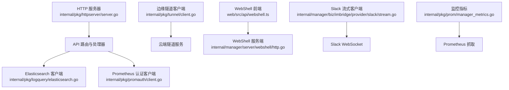
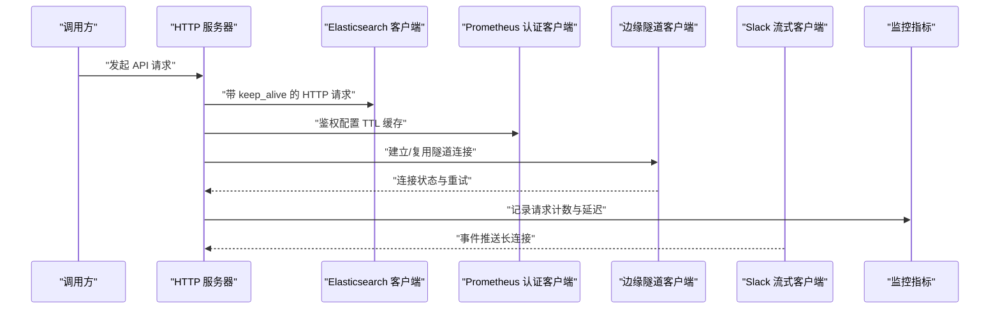
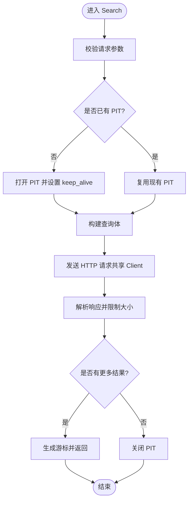
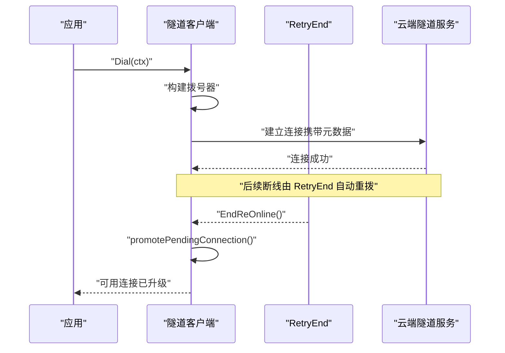
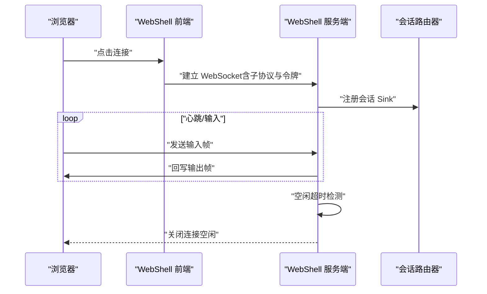
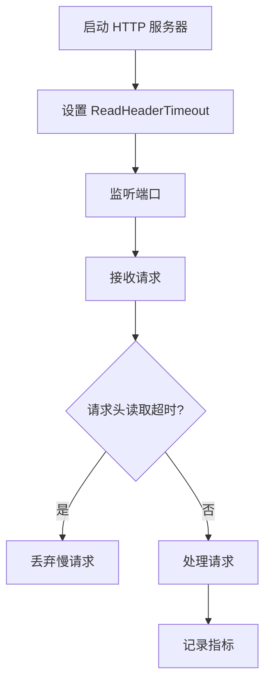
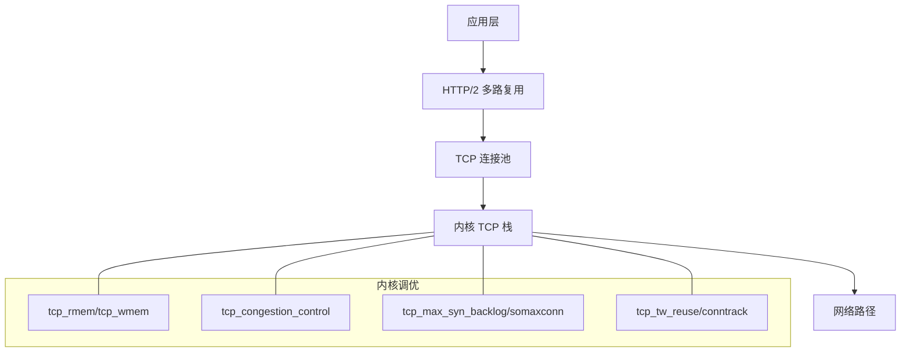
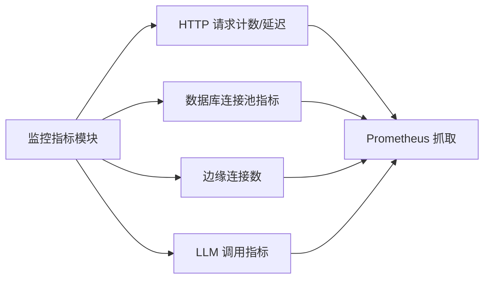
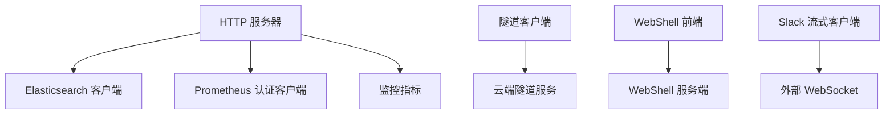

# 网络性能优化

<cite>
**本文引用的文件**
- [internal/pkg/httpserver/server.go](file://internal/pkg/httpserver/server.go)
- [internal/pkg/logquery/elasticsearch.go](file://internal/pkg/logquery/elasticsearch.go)
- [internal/pkg/promauth/client.go](file://internal/pkg/promauth/client.go)
- [internal/pkg/tunnel/client.go](file://internal/pkg/tunnel/client.go)
- [internal/pkg/tunnel/types.go](file://internal/pkg/tunnel/types.go)
- [internal/manager/biz/knowledge/builtin_vault/diagnostics/load-balancer-health-flapping.md](file://internal/manager/biz/knowledge/builtin_vault/diagnostics/load-balancer-health-flapping.md)
- [internal/manager/biz/knowledge/builtin_vault/diagnostics/ephemeral-port-exhaustion.md](file://internal/manager/biz/knowledge/builtin_vault/diagnostics/ephemeral-port-exhaustion.md)
- [internal/manager/biz/knowledge/builtin_vault/systems/network/tcp-stack.md](file://internal/manager/biz/knowledge/builtin_vault/systems/network/tcp-stack.md)
- [internal/manager/biz/knowledge/builtin_vault/diagnostics/conntrack-table-full.md](file://internal/manager/biz/knowledge/builtin_vault/diagnostics/conntrack-table-full.md)
- [internal/manager/biz/knowledge/builtin_vault/diagnostics/tcp-retransmit-loss.md](file://internal/manager/biz/knowledge/builtin_vault/diagnostics/tcp-retransmit-loss.md)
- [web/src/api/webshell.ts](file://web/src/api/webshell.ts)
- [internal/manager/server/webshell/http.go](file://internal/manager/server/webshell/http.go)
- [internal/manager/biz/imbridge/provider/slack/stream.go](file://internal/manager/biz/imbridge/provider/slack/stream.go)
- [internal/manager/biz/imbridge/provider/slack/client.go](file://internal/manager/biz/imbridge/provider/slack/client.go)
- [internal/pkg/prom/manager_metrics.go](file://internal/pkg/prom/manager_metrics.go)
- [cmd/ongrid/main.go](file://cmd/ongrid/main.go)
</cite>

## 目录
1. [简介](#简介)
2. [项目结构](#项目结构)
3. [核心组件](#核心组件)
4. [架构总览](#架构总览)
5. [详细组件分析](#详细组件分析)
6. [依赖关系分析](#依赖关系分析)
7. [性能考量](#性能考量)
8. [故障排查指南](#故障排查指南)
9. [结论](#结论)
10. [附录](#附录)

## 简介
本指南聚焦于网络性能优化，围绕连接复用、超时配置、负载均衡与故障转移、协议层优化（TCP/HTTP/2/gRPC/流式）、以及监控与排障方法，结合仓库中的实际实现与诊断文档，提供可落地的最佳实践。内容覆盖：
- HTTP Keep-Alive 与连接池复用
- gRPC 连接池与会话管理（通过隧道与重试机制）
- WebSocket 连接生命周期与保活
- 连接/读取/写入超时的合理设置
- 服务发现、健康检查与故障转移
- TCP 参数调优、HTTP/2 多路复用、gRPC 流式传输
- 指标采集与常见问题定位

## 项目结构
本项目在多个子系统中实现了网络相关的优化能力：
- HTTP 服务器封装了优雅关闭与读头超时，避免慢请求占用资源
- 日志查询客户端使用共享 http.Client 并配置 keep_alive 以复用连接
- 认证中间件对鉴权配置进行 TTL 缓存，减少解析开销
- 边缘隧道客户端基于 geminio 的重试端点实现断线重连与连接升级
- 前端 WebShell 通过 WebSocket 建立会话，配合服务端空闲超时与探测
- 集成消息通道（如 Slack Socket Mode）采用长连接与 ping 保活
- 监控模块暴露 HTTP 请求、延迟、数据库连接池、边缘连接等指标

图表来源
- [internal/pkg/httpserver/server.go:1-60](file://internal/pkg/httpserver/server.go#L1-L60)
- [internal/pkg/logquery/elasticsearch.go:1-120](file://internal/pkg/logquery/elasticsearch.go#L1-L120)
- [internal/pkg/promauth/client.go:61-81](file://internal/pkg/promauth/client.go#L61-L81)
- [internal/pkg/tunnel/client.go:1-120](file://internal/pkg/tunnel/client.go#L1-L120)
- [web/src/api/webshell.ts:1-29](file://web/src/api/webshell.ts#L1-L29)
- [internal/manager/server/webshell/http.go:397-432](file://internal/manager/server/webshell/http.go#L397-L432)
- [internal/manager/biz/imbridge/provider/slack/stream.go:107-192](file://internal/manager/biz/imbridge/provider/slack/stream.go#L107-L192)
- [internal/pkg/prom/manager_metrics.go:155-317](file://internal/pkg/prom/manager_metrics.go#L155-L317)

章节来源
- [internal/pkg/httpserver/server.go:1-60](file://internal/pkg/httpserver/server.go#L1-L60)
- [internal/pkg/logquery/elasticsearch.go:1-120](file://internal/pkg/logquery/elasticsearch.go#L1-L120)
- [internal/pkg/promauth/client.go:61-81](file://internal/pkg/promauth/client.go#L61-L81)
- [internal/pkg/tunnel/client.go:1-120](file://internal/pkg/tunnel/client.go#L1-L120)
- [web/src/api/webshell.ts:1-29](file://web/src/api/webshell.ts#L1-L29)
- [internal/manager/server/webshell/http.go:397-432](file://internal/manager/server/webshell/http.go#L397-L432)
- [internal/manager/biz/imbridge/provider/slack/stream.go:107-192](file://internal/manager/biz/imbridge/provider/slack/stream.go#L107-L192)
- [internal/pkg/prom/manager_metrics.go:155-317](file://internal/pkg/prom/manager_metrics.go#L155-L317)

## 核心组件
- HTTP 服务器封装：统一设置读头超时与优雅关闭，降低慢请求风险
- Elasticsearch 客户端：共享 http.Client，PIT 保持活跃，控制响应大小
- Prometheus 认证客户端：TTL 缓存鉴权配置，减少每次请求的解析成本
- 边缘隧道客户端：指数退避重拨、连接升级、断线自动恢复
- WebShell：WebSocket 会话、空闲超时、异常断开后预检
- Slack 流式客户端：Socket Mode 长连接、ping 保活、错误回退
- 监控指标：HTTP 请求计数与延迟、数据库连接池、边缘连接数

章节来源
- [internal/pkg/httpserver/server.go:1-60](file://internal/pkg/httpserver/server.go#L1-L60)
- [internal/pkg/logquery/elasticsearch.go:1-120](file://internal/pkg/logquery/elasticsearch.go#L1-L120)
- [internal/pkg/promauth/client.go:61-81](file://internal/pkg/promauth/client.go#L61-L81)
- [internal/pkg/tunnel/client.go:1-120](file://internal/pkg/tunnel/client.go#L1-L120)
- [web/src/api/webshell.ts:1-29](file://web/src/api/webshell.ts#L1-L29)
- [internal/manager/server/webshell/http.go:397-432](file://internal/manager/server/webshell/http.go#L397-L432)
- [internal/manager/biz/imbridge/provider/slack/stream.go:107-192](file://internal/manager/biz/imbridge/provider/slack/stream.go#L107-L192)
- [internal/pkg/prom/manager_metrics.go:155-317](file://internal/pkg/prom/manager_metrics.go#L155-L317)

## 架构总览
下图展示了从 API 到后端存储、边缘隧道与外部服务的整体网络路径，体现连接复用、超时与监控的关键节点。

图表来源
- [internal/pkg/httpserver/server.go:1-60](file://internal/pkg/httpserver/server.go#L1-L60)
- [internal/pkg/logquery/elasticsearch.go:1-120](file://internal/pkg/logquery/elasticsearch.go#L1-L120)
- [internal/pkg/promauth/client.go:61-81](file://internal/pkg/promauth/client.go#L61-L81)
- [internal/pkg/tunnel/client.go:1-120](file://internal/pkg/tunnel/client.go#L1-L120)
- [internal/manager/biz/imbridge/provider/slack/stream.go:107-192](file://internal/manager/biz/imbridge/provider/slack/stream.go#L107-L192)
- [internal/pkg/prom/manager_metrics.go:155-317](file://internal/pkg/prom/manager_metrics.go#L155-L317)

## 详细组件分析

### HTTP Keep-Alive 与连接池复用
- 共享 http.Client：Elasticsearch 客户端在未传入时创建默认客户端并设置超时，确保连接复用与超时控制
- PIT 保持活跃：搜索过程中使用 PIT 并保持活跃时间，避免频繁创建上下文导致连接抖动
- 响应限制：对响应体大小进行限制，防止内存压力影响连接复用效率

图表来源
- [internal/pkg/logquery/elasticsearch.go:88-175](file://internal/pkg/logquery/elasticsearch.go#L88-L175)
- [internal/pkg/logquery/elasticsearch.go:522-551](file://internal/pkg/logquery/elasticsearch.go#L522-L551)
- [internal/pkg/logquery/elasticsearch.go:553-591](file://internal/pkg/logquery/elasticsearch.go#L553-L591)

章节来源
- [internal/pkg/logquery/elasticsearch.go:1-120](file://internal/pkg/logquery/elasticsearch.go#L1-L120)
- [internal/pkg/logquery/elasticsearch.go:522-551](file://internal/pkg/logquery/elasticsearch.go#L522-L551)
- [internal/pkg/logquery/elasticsearch.go:553-591](file://internal/pkg/logquery/elasticsearch.go#L553-L591)

### gRPC 连接池与会话管理（隧道与重试）
- 指数退避重拨：首次拨号失败时使用指数退避策略，上限为固定值，避免雪崩
- 连接升级：后台重试端点在重连成功后提升待处理连接为活动连接，保证 RPC 不丢失
- 连接版本化：通过代际编号避免旧连接被误用，确保并发安全

图表来源
- [internal/pkg/tunnel/client.go:81-120](file://internal/pkg/tunnel/client.go#L81-L120)
- [internal/pkg/tunnel/client.go:290-320](file://internal/pkg/tunnel/client.go#L290-L320)

章节来源
- [internal/pkg/tunnel/client.go:1-120](file://internal/pkg/tunnel/client.go#L1-L120)
- [internal/pkg/tunnel/client.go:290-320](file://internal/pkg/tunnel/client.go#L290-L320)
- [internal/pkg/tunnel/types.go:33-66](file://internal/pkg/tunnel/types.go#L33-L66)

### WebSocket 连接管理（WebShell）
- 前端工厂：构造 WebSocket 并协商子协议，附加令牌以便鉴权
- 服务端空闲超时：定时检测最后输入时间，超过阈值主动终止会话
- 异常断开后预检：当出现异常关闭码时，尝试访问同一路径获取 HTTP 状态，辅助定位问题

图表来源
- [web/src/api/webshell.ts:1-29](file://web/src/api/webshell.ts#L1-L29)
- [internal/manager/server/webshell/http.go:397-432](file://internal/manager/server/webshell/http.go#L397-L432)

章节来源
- [web/src/api/webshell.ts:1-29](file://web/src/api/webshell.ts#L1-L29)
- [internal/manager/server/webshell/http.go:397-432](file://internal/manager/server/webshell/http.go#L397-L432)

### 超时配置优化（连接/读取/写入）
- HTTP 服务器：设置读头超时，避免慢请求阻塞；优雅关闭时限定截止时间
- Elasticsearch 客户端：默认超时与 PIT keep_alive 控制连接与上下文生命周期
- Prometheus 认证客户端：构建客户端时传入总超时，TTL 缓存鉴权配置
- 主进程：多处使用 context.WithTimeout 控制同步任务与工具执行时限

图表来源
- [internal/pkg/httpserver/server.go:19-33](file://internal/pkg/httpserver/server.go#L19-L33)
- [internal/pkg/logquery/elasticsearch.go:58-86](file://internal/pkg/logquery/elasticsearch.go#L58-L86)
- [internal/pkg/promauth/client.go:76-81](file://internal/pkg/promauth/client.go#L76-L81)
- [cmd/ongrid/main.go:251-251](file://cmd/ongrid/main.go#L251-L251)

章节来源
- [internal/pkg/httpserver/server.go:1-60](file://internal/pkg/httpserver/server.go#L1-L60)
- [internal/pkg/logquery/elasticsearch.go:58-86](file://internal/pkg/logquery/elasticsearch.go#L58-L86)
- [internal/pkg/promauth/client.go:76-81](file://internal/pkg/promauth/client.go#L76-L81)
- [cmd/ongrid/main.go:251-251](file://cmd/ongrid/main.go#L251-L251)

### 负载均衡配置（服务发现、健康检查、故障转移）
- 健康检查抖动：调整 interval、timeout 与健康/不健康阈值，避免 p99 抖动导致后端被剔除
- 浅/深检查：浅检查仅验证进程存活，深检查可能因依赖抖动导致全量下线，需谨慎
- 部署联动：启用连接 draining 与就绪探针，避免新旧实例切换期间的 502
- 决策树：根据信号选择动作（手动检查 vs LB 配置、负载下抖动、依赖抖动、真实不健康）

章节来源
- [internal/manager/biz/knowledge/builtin_vault/diagnostics/load-balancer-health-flapping.md:1-75](file://internal/manager/biz/knowledge/builtin_vault/diagnostics/load-balancer-health-flapping.md#L1-L75)

### 网络协议优化（TCP/HTTP/2/gRPC 流式）
- TCP 栈调优：窗口与拥塞算法、SYN 队列、keepalive、TIME_WAIT 与 conntrack 限制
- 短连接风暴：启用 tcp_tw_reuse 与扩大本地端口范围，避免 SNAT 端口耗尽
- HTTP/2 多路复用：通过共享 http.Client 与连接池复用，减少握手开销
- gRPC 流式传输：利用隧道与重试端点实现稳定流式通信，配合连接升级与版本化

图表来源
- [internal/manager/biz/knowledge/builtin_vault/systems/network/tcp-stack.md:47-125](file://internal/manager/biz/knowledge/builtin_vault/systems/network/tcp-stack.md#L47-L125)
- [internal/manager/biz/knowledge/builtin_vault/diagnostics/ephemeral-port-exhaustion.md:45-79](file://internal/manager/biz/knowledge/builtin_vault/diagnostics/ephemeral-port-exhaustion.md#L45-L79)
- [internal/manager/biz/knowledge/builtin_vault/diagnostics/conntrack-table-full.md:56-84](file://internal/manager/biz/knowledge/builtin_vault/diagnostics/conntrack-table-full.md#L56-L84)
- [internal/manager/biz/knowledge/builtin_vault/diagnostics/tcp-retransmit-loss.md:101-134](file://internal/manager/biz/knowledge/builtin_vault/diagnostics/tcp-retransmit-loss.md#L101-L134)

章节来源
- [internal/manager/biz/knowledge/builtin_vault/systems/network/tcp-stack.md:47-125](file://internal/manager/biz/knowledge/builtin_vault/systems/network/tcp-stack.md#L47-L125)
- [internal/manager/biz/knowledge/builtin_vault/diagnostics/ephemeral-port-exhaustion.md:45-79](file://internal/manager/biz/knowledge/builtin_vault/diagnostics/ephemeral-port-exhaustion.md#L45-L79)
- [internal/manager/biz/knowledge/builtin_vault/diagnostics/conntrack-table-full.md:56-84](file://internal/manager/biz/knowledge/builtin_vault/diagnostics/conntrack-table-full.md#L56-L84)
- [internal/manager/biz/knowledge/builtin_vault/diagnostics/tcp-retransmit-loss.md:101-134](file://internal/manager/biz/knowledge/builtin_vault/diagnostics/tcp-retransmit-loss.md#L101-L134)

### 监控方法与指标体系
- HTTP 请求计数与延迟：按方法、路由模板与状态类统计，便于识别热点与异常
- 数据库连接池：开放连接数、使用中连接数、空闲连接数与等待计数，指导容量规划
- 边缘连接数：当前隧道连接数量，用于评估边缘在线率与稳定性
- LLM 调用：调用次数、延迟与 token 消耗，支持成本与性能分析

图表来源
- [internal/pkg/prom/manager_metrics.go:155-317](file://internal/pkg/prom/manager_metrics.go#L155-L317)

章节来源
- [internal/pkg/prom/manager_metrics.go:155-317](file://internal/pkg/prom/manager_metrics.go#L155-L317)

## 依赖关系分析
- HTTP 服务器依赖标准库 net/http，并通过 handler 链路与业务逻辑耦合
- Elasticsearch 客户端依赖共享 http.Client，受全局连接池与超时影响
- Prometheus 认证客户端通过 RoundTripper 注入鉴权头，TTL 缓存降低解析频率
- 隧道客户端依赖 geminio 的重试端点，内部维护连接代际与升级逻辑
- WebShell 前后端通过 WebSocket 协议交互，服务端维护会话路由与空闲超时
- Slack 流式客户端通过 WebSocket 长连接与 ping 保活维持事件通道
- 监控指标模块集中注册与暴露指标，供 Prometheus 抓取

图表来源
- [internal/pkg/httpserver/server.go:1-60](file://internal/pkg/httpserver/server.go#L1-L60)
- [internal/pkg/logquery/elasticsearch.go:1-120](file://internal/pkg/logquery/elasticsearch.go#L1-L120)
- [internal/pkg/promauth/client.go:61-81](file://internal/pkg/promauth/client.go#L61-L81)
- [internal/pkg/tunnel/client.go:1-120](file://internal/pkg/tunnel/client.go#L1-L120)
- [web/src/api/webshell.ts:1-29](file://web/src/api/webshell.ts#L1-L29)
- [internal/manager/server/webshell/http.go:397-432](file://internal/manager/server/webshell/http.go#L397-L432)
- [internal/manager/biz/imbridge/provider/slack/stream.go:107-192](file://internal/manager/biz/imbridge/provider/slack/stream.go#L107-L192)
- [internal/pkg/prom/manager_metrics.go:155-317](file://internal/pkg/prom/manager_metrics.go#L155-L317)

章节来源
- [internal/pkg/httpserver/server.go:1-60](file://internal/pkg/httpserver/server.go#L1-L60)
- [internal/pkg/logquery/elasticsearch.go:1-120](file://internal/pkg/logquery/elasticsearch.go#L1-L120)
- [internal/pkg/promauth/client.go:61-81](file://internal/pkg/promauth/client.go#L61-L81)
- [internal/pkg/tunnel/client.go:1-120](file://internal/pkg/tunnel/client.go#L1-L120)
- [web/src/api/webshell.ts:1-29](file://web/src/api/webshell.ts#L1-L29)
- [internal/manager/server/webshell/http.go:397-432](file://internal/manager/server/webshell/http.go#L397-L432)
- [internal/manager/biz/imbridge/provider/slack/stream.go:107-192](file://internal/manager/biz/imbridge/provider/slack/stream.go#L107-L192)
- [internal/pkg/prom/manager_metrics.go:155-317](file://internal/pkg/prom/manager_metrics.go#L155-L317)

## 性能考量
- 连接复用优先：通过共享 http.Client 与 PIT keep_alive 减少握手与上下文开销
- 超时分层：读头超时保护入口，业务层 context 超时保护长任务，避免级联超时
- 健康检查稳健：浅检查为主，深检查需放宽阈值，避免抖动导致全量下线
- TCP 调优：启用 tcp_tw_reuse、增大 SYN 队列与缓冲区，必要时切换拥塞算法
- 监控驱动：基于 HTTP 延迟与错误率、连接池等待、边缘连接数进行容量与瓶颈定位

[本节为通用指导，无需特定文件来源]

## 故障排查指南
- 健康检查抖动：复现 LB 的检查路径与预期响应，调整 interval/timeout/阈值；部署时启用 draining 与就绪探针
- 临时端口耗尽：启用 tcp_tw_reuse，扩大 ip_local_port_range，端到端复用连接；若位于 NAT/LB 后，考虑扩展源 IP 或提高网关 SNAT 范围
- Conntrack 表满：提高 nf_conntrack_max 与 hashsize，谨慎调整 TIME_WAIT 与 ESTABLISHED 超时
- TCP 重传与丢包：检查 mtr 路径丢包、retransmit 比例、accept 队列溢出；必要时启用 BBR 或调整窗口
- WebSocket 异常断开：捕获 1006 后进行预检，结合服务端空闲超时与日志定位

章节来源
- [internal/manager/biz/knowledge/builtin_vault/diagnostics/load-balancer-health-flapping.md:1-75](file://internal/manager/biz/knowledge/builtin_vault/diagnostics/load-balancer-health-flapping.md#L1-L75)
- [internal/manager/biz/knowledge/builtin_vault/diagnostics/ephemeral-port-exhaustion.md:45-79](file://internal/manager/biz/knowledge/builtin_vault/diagnostics/ephemeral-port-exhaustion.md#L45-L79)
- [internal/manager/biz/knowledge/builtin_vault/diagnostics/conntrack-table-full.md:56-84](file://internal/manager/biz/knowledge/builtin_vault/diagnostics/conntrack-table-full.md#L56-L84)
- [internal/manager/biz/knowledge/builtin_vault/diagnostics/tcp-retransmit-loss.md:101-134](file://internal/manager/biz/knowledge/builtin_vault/diagnostics/tcp-retransmit-loss.md#L101-L134)

## 结论
通过连接复用、合理的超时配置、稳健的健康检查与故障转移、以及 TCP/HTTP/2/gRPC 的协议层优化，并结合完善的监控与排障流程，可以显著提升系统的网络性能与稳定性。建议在生产环境中持续观测关键指标，结合诊断文档进行渐进式调优。

[本节为总结性内容，无需特定文件来源]

## 附录
- 常用命令参考：ss、nstat、ip 等用于观察连接状态与队列深度
- 系统调优要点：tcp_tw_reuse、somaxconn、tcp_max_syn_backlog、tcp_rmem/wmem、拥塞算法选择
- 部署注意事项：draining 与就绪探针、LB 健康检查策略、SNAT 端口范围与源 IP 扩展

[本节为补充信息，无需特定文件来源]