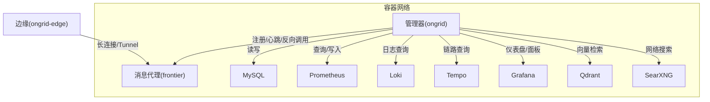
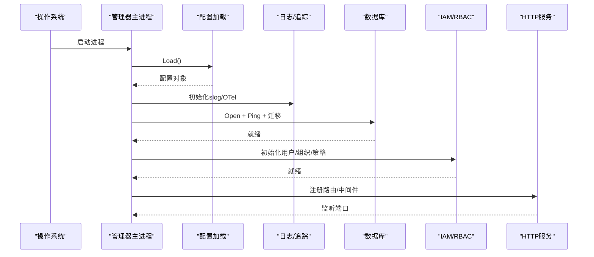
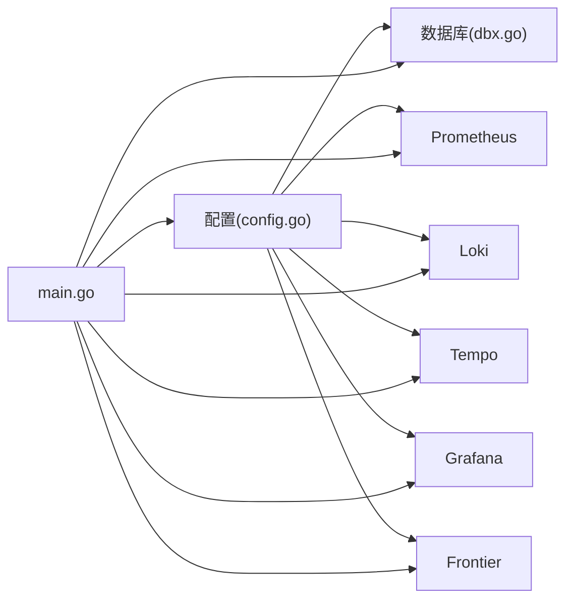

# 常见问题诊断

<cite>
**本文引用的文件**
- [cmd/ongrid/main.go](file://cmd/ongrid/main.go)
- [internal/pkg/config/config.go](file://internal/pkg/config/config.go)
- [internal/pkg/dbx/dbx.go](file://internal/pkg/dbx/dbx.go)
- [internal/pkg/logger/logger.go](file://internal/pkg/logger/logger.go)
- [internal/pkg/errs/errs.go](file://internal/pkg/errs/errs.go)
- [internal/manager/server/systemhealth/http.go](file://internal/manager/server/systemhealth/http.go)
- [web/src/api/systemHealth.ts](file://web/src/api/systemHealth.ts)
- [deploy/install/docker-compose.yml](file://deploy/install/docker-compose.yml)
- [internal/manager/biz/knowledge/builtin_vault/diagnostics/db-connection-pool-exhaustion.md](file://internal/manager/biz/knowledge/builtin_vault/diagnostics/db-connection-pool-exhaustion.md)
- [internal/manager/biz/knowledge/builtin_vault/diagnostics/ephemeral-port-exhaustion.md](file://internal/manager/biz/knowledge/builtin_vault/diagnostics/ephemeral-port-exhaustion.md)
- [internal/manager/server/edge/http.go](file://internal/manager/server/edge/http.go)
- [internal/manager/service/systemhealth/service.go](file://internal/manager/service/systemhealth/service.go)
</cite>

## 目录
1. [简介](#简介)
2. [项目结构](#项目结构)
3. [核心组件](#核心组件)
4. [架构总览](#架构总览)
5. [详细组件分析](#详细组件分析)
6. [依赖关系分析](#依赖关系分析)
7. [性能注意事项](#性能注意事项)
8. [故障排查指南](#故障排查指南)
9. [结论](#结论)
10. [附录](#附录)

## 简介
本指南面向运维与SRE，聚焦Ongrid系统常见故障的快速定位与修复，覆盖：
- 系统启动失败
- 服务连接异常（数据库、Prometheus/Loki/Tempo/Grafana、Frontier代理、Edge隧道）
- 数据同步问题（Edge心跳、指标/日志/链路上报）
- 错误日志分析方法
- 配置检查清单
- 快速修复步骤
- 常用命令行工具与API接口
- 网络连通性检查、数据库连接验证、外部服务状态监控
- 常见错误代码含义与解决方案

## 项目结构
Ongrid由云端管理器（ongrid）、边缘代理（ongrid-edge）、消息代理（frontier）、可观测性栈（Prometheus/Loki/Tempo/Grafana/Qdrant/SearXNG）组成。管理器通过HTTP API暴露能力，并通过Tunnel与Edge通信；所有外部依赖在docker-compose中编排并健康检查。

图表来源
- [deploy/install/docker-compose.yml:20-528](file://deploy/install/docker-compose.yml#L20-L528)
- [cmd/ongrid/main.go:208-300](file://cmd/ongrid/main.go#L208-L300)

章节来源
- [deploy/install/docker-compose.yml:20-528](file://deploy/install/docker-compose.yml#L20-L528)
- [cmd/ongrid/main.go:208-300](file://cmd/ongrid/main.go#L208-L300)

## 核心组件
- 启动与初始化：加载配置、初始化日志、Tracing、数据库迁移、IAM/RBAC、LLM路由、设置默认值、注册HTTP路由与服务端SDK。
- 配置中心：集中从环境变量读取运行时配置，提供默认值与开关。
- 数据库层：支持MySQL与SQLite，打开时进行Ping校验或WAL等参数设置。
- 健康检查：统一的健康检查API，聚合DB、Prom、Edge、LLM等子系统状态。
- 错误体系：统一的错误哨兵与HTTP状态码映射，便于前端与自动化处理。

章节来源
- [cmd/ongrid/main.go:208-300](file://cmd/ongrid/main.go#L208-L300)
- [internal/pkg/config/config.go:417-549](file://internal/pkg/config/config.go#L417-L549)
- [internal/pkg/dbx/dbx.go:34-77](file://internal/pkg/dbx/dbx.go#L34-L77)
- [internal/manager/server/systemhealth/http.go:30-50](file://internal/manager/server/systemhealth/http.go#L30-L50)
- [internal/pkg/errs/errs.go:12-26](file://internal/pkg/errs/errs.go#L12-L26)

## 架构总览
管理器启动流程关键路径：
- 读取配置并记录关键地址（HTTP/Metrics/Frontier/DB）
- 初始化Tracing（可选）
- 打开数据库并执行迁移
- 初始化IAM、RBAC、默认组织与成员
- 注入各业务模块（Alert/Prom/Loki/Tempo/Grafana/LLM等）
- 启动HTTP服务与后台任务

图表来源
- [cmd/ongrid/main.go:208-300](file://cmd/ongrid/main.go#L208-L300)
- [internal/pkg/config/config.go:417-549](file://internal/pkg/config/config.go#L417-L549)
- [internal/pkg/dbx/dbx.go:34-77](file://internal/pkg/dbx/dbx.go#L34-L77)

## 详细组件分析

### 启动失败诊断
典型症状
- 进程退出码非0，控制台输出“config load”“open db”“run migrations”“FATAL: JWT secret...”等
- 无法访问Web界面或API

排查要点
- 确认环境变量是否完整且正确（JWT Secret必填、DB DSN、Frontier地址、PublicURL等）
- 确认依赖服务可达（MySQL、Frontier、Prom/Loki/Tempo/Grafana）
- 查看日志输出位置（JSON行，stderr或挂载的日志目录）

快速修复
- 补齐缺失的环境变量（如JWT Secret、数据库凭据）
- 修正Docker Compose中的端口/网络/卷挂载
- 重启服务并观察健康检查

章节来源
- [cmd/ongrid/main.go:208-300](file://cmd/ongrid/main.go#L208-L300)
- [internal/pkg/config/config.go:417-549](file://internal/pkg/config/config.go#L417-L549)
- [internal/pkg/logger/logger.go:13-26](file://internal/pkg/logger/logger.go#L13-L26)
- [deploy/install/docker-compose.yml:52-271](file://deploy/install/docker-compose.yml#L52-L271)

### 数据库连接异常
典型症状
- 启动时报“mysql open/ping failed”或“sqlite mkdir/open”
- 请求卡住或报“too many connections”“pool timeout”
- 延迟突增，CPU正常但连接数接近上限

排查要点
- 使用健康检查API查看DB检查项状态与耗时
- 核对DSN、权限、字符集、时区
- 检查客户端连接池与服务器max_connections
- 若为SQLite，确认路径存在、WAG模式启用、外键开启

快速修复
- 修正DSN与权限，必要时调整连接池参数
- 对MySQL：清理空闲事务、提升max_connections或减少并发
- 对SQLite：确保目录可写、磁盘空间充足

章节来源
- [internal/pkg/dbx/dbx.go:34-128](file://internal/pkg/dbx/dbx.go#L34-L128)
- [internal/manager/server/systemhealth/http.go:30-50](file://internal/manager/server/systemhealth/http.go#L30-L50)
- [internal/manager/biz/knowledge/builtin_vault/diagnostics/db-connection-pool-exhaustion.md:1-47](file://internal/manager/biz/knowledge/builtin_vault/diagnostics/db-connection-pool-exhaustion.md#L1-L47)

### 服务连接异常（Prom/Loki/Tempo/Grafana）
典型症状
- 指标页面空白或报错
- 日志/链路查询返回503或超时
- Grafana面板为空或无法打开

排查要点
- 通过健康检查API逐项确认后端可用性
- 核对Prom URL/RemoteWrite URL、Loki/Tempo URL、Grafana Root URL
- 检查TLS/CA与证书校验配置
- 确认Compose服务间DNS解析与端口可达

快速修复
- 修正URL与认证信息
- 对外部Grafana启用TLSInsecure或使用正确的CA
- 重启相关服务并观察健康检查

章节来源
- [internal/pkg/config/config.go:254-304](file://internal/pkg/config/config.go#L254-L304)
- [internal/pkg/config/config.go:498-507](file://internal/pkg/config/config.go#L498-L507)
- [internal/manager/server/systemhealth/http.go:30-50](file://internal/manager/server/systemhealth/http.go#L30-L50)
- [deploy/install/docker-compose.yml:141-180](file://deploy/install/docker-compose.yml#L141-L180)

### Edge隧道与数据同步问题
典型症状
- Edge显示离线或频繁掉线
- 指标/日志/链路未上报
- WebShell/远程命令失败

排查要点
- 确认Frontier服务可达、Edge侧CloudAddr正确
- 检查Manager的PublicURL是否正确下发给Edge
- 查看Edge心跳时间戳与阈值
- 检查防火墙/NAT与端口映射（Tunnel端口）

快速修复
- 修正Frontier地址与Edge CloudAddr
- 确保PublicURL可被Edge访问
- 调整EdgeOfflineThreshold或修复网络问题

章节来源
- [internal/pkg/config/config.go:288-304](file://internal/pkg/config/config.go#L288-L304)
- [internal/pkg/config/config.go:494-496](file://internal/pkg/config/config.go#L494-L496)
- [deploy/install/docker-compose.yml:273-291](file://deploy/install/docker-compose.yml#L273-L291)

### 错误日志分析
- 日志格式：结构化JSON行，最小级别可通过环境变量控制
- 关键上下文：service、trace_id、org_id等属性在调用点注入
- 日志位置：容器内stderr或挂载到宿主的日志目录

建议
- 使用日志采集器将JSON行转发至Loki/ES
- 结合Trace ID关联请求链路
- 过滤ERROR/WARN级别并结合关键字定位

章节来源
- [internal/pkg/logger/logger.go:13-26](file://internal/pkg/logger/logger.go#L13-L26)
- [deploy/install/docker-compose.yml:221-271](file://deploy/install/docker-compose.yml#L221-L271)

### 健康检查API
- 接口：POST /v1/system/health/check（需管理员权限）
- 返回：整体状态、各检查项ID/组/标签/状态/消息/耗时
- 用途：快速判断DB、Prom、Edge、LLM等子系统健康度

章节来源
- [internal/manager/server/systemhealth/http.go:30-50](file://internal/manager/server/systemhealth/http.go#L30-L50)
- [web/src/api/systemHealth.ts:1-31](file://web/src/api/systemHealth.ts#L1-L31)

## 依赖关系分析
管理器依赖的关键外部组件及其配置入口：
- MySQL/SQLite：DB.Dialect/DSN/Path
- Frontier：FrontierClient.Addr/ServiceName
- Prometheus：Prom.Enabled/URL/RemoteWriteURL/QueryURL/TLS
- Loki/Tempo：Logs.URL/Traces.URL
- Grafana：InternalRootURL/BootstrapUser/Password/TLSInsecure
- Qdrant：嵌入知识检索
- SearXNG：网络搜索

图表来源
- [internal/pkg/config/config.go:417-549](file://internal/pkg/config/config.go#L417-L549)
- [internal/pkg/dbx/dbx.go:34-77](file://internal/pkg/dbx/dbx.go#L34-L77)
- [cmd/ongrid/main.go:208-300](file://cmd/ongrid/main.go#L208-L300)

章节来源
- [internal/pkg/config/config.go:417-549](file://internal/pkg/config/config.go#L417-L549)
- [internal/pkg/dbx/dbx.go:34-77](file://internal/pkg/dbx/dbx.go#L34-L77)
- [cmd/ongrid/main.go:208-300](file://cmd/ongrid/main.go#L208-L300)

## 性能注意事项
- 连接复用与Keep-Alive：避免每次请求新建连接导致TIME_WAIT堆积与端口耗尽
- 连接池大小：根据并发与慢查询时长合理设置max_open/max_idle/conn_max_lifetime
- 外部服务限流：注意上游服务的速率限制与重试退避
- 资源配额：LLM每日Token限额、Prom存储保留期、日志/链路保留策略

章节来源
- [internal/manager/biz/knowledge/builtin_vault/diagnostics/ephemeral-port-exhaustion.md:45-79](file://internal/manager/biz/knowledge/builtin_vault/diagnostics/ephemeral-port-exhaustion.md#L45-L79)
- [internal/manager/biz/knowledge/builtin_vault/diagnostics/db-connection-pool-exhaustion.md:1-47](file://internal/manager/biz/knowledge/builtin_vault/diagnostics/db-connection-pool-exhaustion.md#L1-L47)

## 故障排查指南

### 一、系统启动失败
步骤
1. 检查环境变量：JWT Secret、DB DSN、Frontier地址、PublicURL等
2. 查看日志：关注“config load”“open db”“run migrations”“FATAL”
3. 验证依赖：MySQL/SQLite、Frontier、Prom/Loki/Tempo/Grafana是否可达
4. 修正配置后重启，观察健康检查

命令参考
- 查看容器日志：docker logs -f ongrid
- 检查端口：ss -tlnp | grep -E '8080|9100|40012'
- 测试DB连通：mysqladmin ping（MySQL）或sqlite3 .db ".tables"（SQLite）

章节来源
- [cmd/ongrid/main.go:208-300](file://cmd/ongrid/main.go#L208-L300)
- [internal/pkg/config/config.go:417-549](file://internal/pkg/config/config.go#L417-L549)
- [internal/pkg/dbx/dbx.go:34-77](file://internal/pkg/dbx/dbx.go#L34-L77)

### 二、服务连接异常
步骤
1. 调用健康检查API：POST /v1/system/health/check
2. 逐项检查DB/Prom/Loki/Tempo/Grafana/Edge状态
3. 核对URL、TLS、CA、认证信息
4. 检查Compose服务间DNS与端口映射

命令参考
- curl POST /v1/system/health/check（需管理员令牌）
- 检查服务健康：curl http://prometheus/-/healthy、http://loki/-/ready、http://tempo/-/ready
- 检查Frontier：telnet frontier 40011

章节来源
- [internal/manager/server/systemhealth/http.go:30-50](file://internal/manager/server/systemhealth/http.go#L30-L50)
- [deploy/install/docker-compose.yml:141-180](file://deploy/install/docker-compose.yml#L141-L180)

### 三、数据同步问题（Edge/指标/日志/链路）
步骤
1. 确认Edge在线：健康检查中Edge采样状态
2. 检查Frontier与Edge Tunnel端口映射
3. 确认PublicURL可被Edge访问
4. 检查Prom/Loki/Tempo接收端点与认证

命令参考
- 查看Edge列表与状态（通过管理器API）
- 检查Prom remote_write：curl http://prometheus/-/write
- 检查Loki/Tempo：curl http://loki/-/ready、http://tempo/-/ready

章节来源
- [internal/pkg/config/config.go:288-304](file://internal/pkg/config/config.go#L288-L304)
- [deploy/install/docker-compose.yml:273-291](file://deploy/install/docker-compose.yml#L273-L291)

### 四、网络连通性检查
步骤
1. 主机到容器：ping/curl/telnet
2. 容器到容器：nslookup/curl内部域名
3. 外部到公网：检查防火墙/NAT/安全组
4. 端口耗尽：检查TIME_WAIT与本地端口范围

命令参考
- ss -s、ss -tnp、netstat -an
- sysctl net.ipv4.tcp_tw_reuse=1（仅出站复用）
- 调整ip_local_port_range（谨慎）

章节来源
- [internal/manager/biz/knowledge/builtin_vault/diagnostics/ephemeral-port-exhaustion.md:45-79](file://internal/manager/biz/knowledge/builtin_vault/diagnostics/ephemeral-port-exhaustion.md#L45-L79)

### 五、数据库连接验证
步骤
1. 健康检查API查看DB项
2. 核对DSN、权限、字符集与时区
3. 检查连接池与max_connections
4. SQLite：确认路径、WAL、外键

命令参考
- mysqladmin ping -u root -p$MYSQL_ROOT_PASSWORD
- sqlite3 data.db ".tables"
- 查看连接：SHOW PROCESSLIST; SELECT count(*) FROM information_schema.processlist;

章节来源
- [internal/pkg/dbx/dbx.go:34-128](file://internal/pkg/dbx/dbx.go#L34-L128)
- [internal/manager/biz/knowledge/builtin_vault/diagnostics/db-connection-pool-exhaustion.md:1-47](file://internal/manager/biz/knowledge/builtin_vault/diagnostics/db-connection-pool-exhaustion.md#L1-L47)

### 六、外部服务状态监控
步骤
1. 使用健康检查API聚合状态
2. 针对Prom/Loki/Tempo/Grafana单独探测
3. 配置告警规则与通知通道

命令参考
- curl http://prometheus/-/healthy
- curl http://loki/-/ready
- curl http://tempo/-/ready
- 检查Grafana：curl -k https://grafana:3000/api/health

章节来源
- [internal/manager/server/systemhealth/http.go:30-50](file://internal/manager/server/systemhealth/http.go#L30-L50)
- [deploy/install/docker-compose.yml:339-426](file://deploy/install/docker-compose.yml#L339-L426)

### 七、常见错误代码与解决方案
- unauthorized：未登录或令牌无效，重新登录或刷新令牌
- forbidden：无权限访问，检查角色与租户
- invalid：参数不合法，检查请求体与必填字段
- not-found：资源不存在，检查ID与路径
- conflict：资源冲突，检查唯一约束与并发操作
- budget-exceeded：LLM预算超限，调整配额或模型
- edge-offline：Edge离线，检查网络与Frontier连接
- not-wired-yet：功能未接入，等待后续版本或检查配置
- upstream：上游服务不可用，检查依赖服务健康

章节来源
- [internal/pkg/errs/errs.go:12-26](file://internal/pkg/errs/errs.go#L12-L26)
- [internal/manager/server/edge/http.go:1124-1147](file://internal/manager/server/edge/http.go#L1124-L1147)

## 结论
通过统一的健康检查API、结构化日志与清晰的错误码映射，Ongrid提供了完善的故障定位基础。结合环境变量配置、Compose编排与健康探针，大多数启动与连接问题可在几分钟内定位并修复。对于复杂场景（连接池耗尽、端口耗尽、NAT限速），应优先从连接复用、池化与系统参数入手，逐步缩小根因范围。

## 附录

### A. 配置检查清单（关键项）
- JWT Secret：必须设置强随机值
- DB：Dialect/DSN/Path正确，权限与字符集一致
- Frontier：Addr/ServiceName正确，端口可达
- PublicURL：Edge可访问，用于插件上报
- Prom/Loki/Tempo/Grafana：URL/TLS/CA/认证正确
- Edge：CloudAddr/AccessKey/SecretKey正确
- 通知通道：Enabled/URL/Secret正确

章节来源
- [internal/pkg/config/config.go:417-549](file://internal/pkg/config/config.go#L417-L549)
- [deploy/install/docker-compose.yml:52-271](file://deploy/install/docker-compose.yml#L52-L271)

### B. 常用API与命令
- 健康检查：POST /v1/system/health/check（管理员）
- 查看Prom健康：GET http://prometheus/-/healthy
- 查看Loki健康：GET http://loki/-/ready
- 查看Tempo健康：GET http://tempo/-/ready
- 查看Edge状态：通过管理器API获取Edge列表与心跳

章节来源
- [internal/manager/server/systemhealth/http.go:30-50](file://internal/manager/server/systemhealth/http.go#L30-L50)
- [web/src/api/systemHealth.ts:1-31](file://web/src/api/systemHealth.ts#L1-L31)