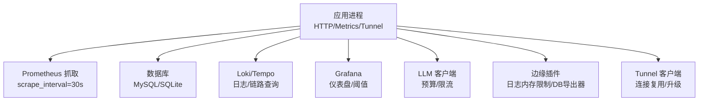
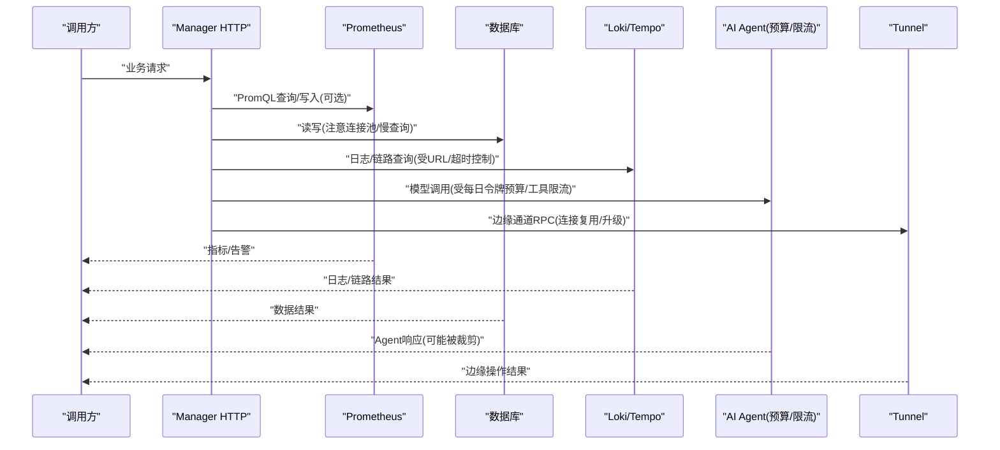
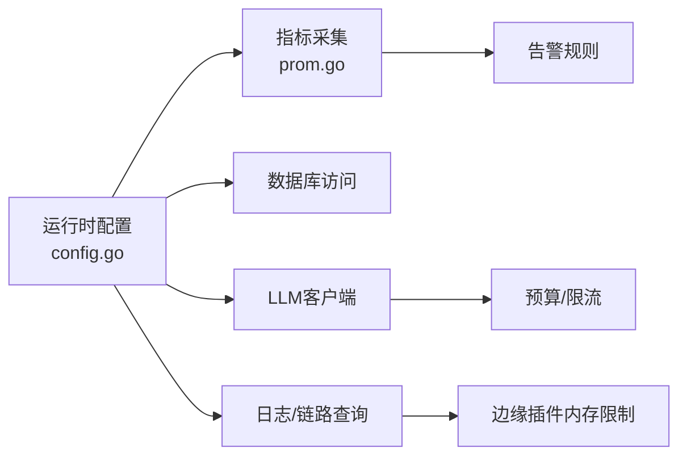

# 性能优化指南

<cite>
**本文引用的文件**
- [internal/pkg/config/config.go](file://internal/pkg/config/config.go)
- [internal/pkg/prom/prom.go](file://internal/pkg/prom/prom.go)
- [deploy/install/prometheus.yml](file://deploy/install/prometheus.yml)
- [internal/manager/server/metric/prom_handler.go](file://internal/manager/server/metric/prom_handler.go)
- [internal/edgeagent/plugins/logs/render.go](file://internal/edgeagent/plugins/logs/render.go)
- [internal/manager/biz/knowledge/builtin_vault/diagnostics/db-slow-queries-locks.md](file://internal/manager/biz/knowledge/builtin_vault/diagnostics/db-slow-queries-locks.md)
- [internal/manager/biz/knowledge/builtin_vault/diagnostics/db-connection-pool-exhaustion.md](file://internal/manager/biz/knowledge/builtin_vault/diagnostics/db-connection-pool-exhaustion.md)
- [internal/manager/biz/knowledge/builtin_vault/diagnostics/ephemeral-port-exhaustion.md](file://internal/manager/biz/knowledge/builtin_vault/diagnostics/ephemeral-port-exhaustion.md)
- [internal/manager/biz/knowledge/builtin_vault/diagnostics/oom-killed.md](file://internal/manager/biz/knowledge/builtin_vault/diagnostics/oom-killed.md)
- [internal/manager/biz/knowledge/builtin_vault/systems/scheduling/cfs-and-cgroups.md](file://internal/manager/biz/knowledge/builtin_vault/systems/scheduling/cfs-and-cgroups.md)
- [internal/pkg/llm/budget.go](file://internal/pkg/llm/budget.go)
- [internal/pkg/llm/budget_callback.go](file://internal/pkg/llm/budget_callback.go)
- [internal/manager/biz/aiops/graph/budget_stop_model.go](file://internal/manager/biz/aiops/graph/budget_stop_model.go)
- [internal/manager/biz/aiops/tools/decorators/ratelimit.go](file://internal/manager/biz/aiops/tools/decorators/ratelimit.go)
- [internal/pkg/tunnel/client.go](file://internal/pkg/tunnel/client.go)
</cite>

## 目录
1. [简介](#简介)
2. [项目结构](#项目结构)
3. [核心组件](#核心组件)
4. [架构总览](#架构总览)
5. [详细组件分析](#详细组件分析)
6. [依赖关系分析](#依赖关系分析)
7. [性能注意事项](#性能注意事项)
8. [故障排查指南](#故障排查指南)
9. [结论](#结论)
10. [附录](#附录)

## 简介
本指南面向OnGrid系统的运维与研发人员，聚焦生产环境的性能监控、瓶颈识别、慢查询与长事务治理、内存与网络优化、容量规划与扩展策略，以及AI Agent执行性能与资源限制配置。内容基于仓库中的配置、可观测性实现与内置诊断文档，提供可操作的阈值建议、参数调优路径与排障流程。

## 项目结构
从性能视角看，系统的关键位置包括：
- 运行时配置入口：集中管理HTTP、Metrics、数据库、LLM、Prometheus/Grafana、日志/链路等开关与阈值。
- 指标采集与暴露：进程级Prometheus注册表与抓取间隔、告警规则加载。
- 数据面与边缘侧：日志管道内存限制、数据库导出器采样与过滤、隧道连接复用与切换。
- AI Agent能力：令牌预算、工具调用限流、按工具维度的熔断与裁剪。

图表来源
- [internal/pkg/prom/prom.go:1-29](file://internal/pkg/prom/prom.go#L1-L29)
- [deploy/install/prometheus.yml:1-36](file://deploy/install/prometheus.yml#L1-L36)
- [internal/pkg/config/config.go:417-548](file://internal/pkg/config/config.go#L417-L548)
- [internal/edgeagent/plugins/logs/render.go:165-179](file://internal/edgeagent/plugins/logs/render.go#L165-L179)
- [internal/pkg/tunnel/client.go:290-320](file://internal/pkg/tunnel/client.go#L290-L320)

章节来源
- [internal/pkg/config/config.go:417-548](file://internal/pkg/config/config.go#L417-L548)
- [internal/pkg/prom/prom.go:1-29](file://internal/pkg/prom/prom.go#L1-L29)
- [deploy/install/prometheus.yml:1-36](file://deploy/install/prometheus.yml#L1-L36)

## 核心组件
- 运行时配置中心：通过环境变量驱动关键性能开关（如Prom启用、日志/链路查询URL、JWT TTL、Edge采集模式与间隔、通知超时、告警评估间隔等）。
- 指标体系：进程级Prometheus注册表，统一暴露；Prometheus抓取间隔与规则文件挂载用于自监控与告警。
- 日志与遥测：边缘日志管道带内存限制处理器，避免高吞吐下OOM；Manager侧提供Loki/Tempo查询代理。
- 数据库访问：内置诊断文档覆盖慢查询/锁竞争与连接池耗尽的根因定位与修复步骤。
- AI Agent：令牌预算（按日）与工具调用限流（按用户+工具），并在图节点层对超限工具进行裁剪或降级。
- 隧道通信：连接生命周期管理与“待升级连接”提升，保障重连期间的请求不回收错误连接。

章节来源
- [internal/pkg/config/config.go:417-548](file://internal/pkg/config/config.go#L417-L548)
- [internal/pkg/prom/prom.go:1-29](file://internal/pkg/prom/prom.go#L1-L29)
- [internal/edgeagent/plugins/logs/render.go:165-179](file://internal/edgeagent/plugins/logs/render.go#L165-L179)
- [internal/pkg/tunnel/client.go:290-320](file://internal/pkg/tunnel/client.go#L290-L320)

## 架构总览
下图展示从请求到指标、存储与外部服务的整体路径，标注了关键的性能控制点。

图表来源
- [internal/manager/server/metric/prom_handler.go:1-29](file://internal/manager/server/metric/prom_handler.go#L1-L29)
- [internal/pkg/config/config.go:417-548](file://internal/pkg/config/config.go#L417-L548)
- [internal/pkg/llm/budget.go:1-73](file://internal/pkg/llm/budget.go#L1-L73)
- [internal/pkg/tunnel/client.go:290-320](file://internal/pkg/tunnel/client.go#L290-L320)

## 详细组件分析

### 指标采集与监控基线
- 抓取间隔：Prometheus全局抓取与评估间隔为30秒；Manager目标抓取间隔为15秒，适合高频服务自监控。
- 指标注册：进程级Registry已注册Go与Process Collector，各模块按需注册自定义指标。
- 告警规则：通过rule_files挂载规则文件，支持热重载，便于快速迭代阈值。

建议阈值与实践
- 抓取间隔：默认30s适用于多数场景；若需更细粒度，可将Manager目标抓取降至10-15s，但需评估TSDB压力。
- 指标基数：遵循标签基数红线，避免使用高基数标签（如org_id/user_id/edge_id/全路径URL），仅允许method、code、status、model、direction、result、plan_bucket等低基数维度。
- 告警冷却：结合系统内Alert.Cooldown与EvaluatorInterval，避免重复告警风暴。

章节来源
- [deploy/install/prometheus.yml:1-36](file://deploy/install/prometheus.yml#L1-L36)
- [internal/pkg/prom/prom.go:1-29](file://internal/pkg/prom/prom.go#L1-L29)

### 数据库性能：慢查询与锁竞争
- 症状区分：单条慢（索引缺失/扫描过大/计划劣化） vs 批量慢（锁争用/长事务阻塞）。
- 定位方法：查看活动会话与等待事件；对慢查询执行EXPLAIN ANALYZE；识别阻塞链并清理持有锁的会话。
- 结构性修复：添加索引/更新统计信息/重写SQL；DDL在负载下使用在线变更工具；热点行缩短事务范围。

建议阈值与实践
- 慢查询阈值：开启慢查询日志，设定合理阈值（例如>1s），配合定期巡检。
- 锁等待：设置合理的锁等待超时；发现idle in transaction及时终止并修复代码提交路径。
- 连接池：确保每实例max_open与副本数乘积小于服务端max_connections，留有余量。

章节来源
- [internal/manager/biz/knowledge/builtin_vault/diagnostics/db-slow-queries-locks.md:1-85](file://internal/manager/biz/knowledge/builtin_vault/diagnostics/db-slow-queries-locks.md#L1-L85)
- [internal/manager/biz/knowledge/builtin_vault/diagnostics/db-connection-pool-exhaustion.md:1-84](file://internal/manager/biz/knowledge/builtin_vault/diagnostics/db-connection-pool-exhaustion.md#L1-L84)

### 数据库连接池耗尽治理
- 现象：出现“获取连接超时”“too many connections”，或在负载拐点出现延迟陡增。
- 根因：客户端池过小/连接被长时间占用；服务端max_connections不足；连接泄漏（未释放/长事务未提交）。
- 修复顺序：先修复泄漏与长事务，再调整池大小，必要时引入连接代理（PgBouncer/ProxySQL），最后考虑提高服务端上限。

建议阈值与实践
- max_open_conns：根据并发与慢查询时长估算，保证N实例×max_open < 服务端max_connections。
- conn_max_lifetime：设置合理生命周期以感知后端失效。
- idle in transaction：监控并清理长期空闲事务，修复遗漏的commit/rollback。

章节来源
- [internal/manager/biz/knowledge/builtin_vault/diagnostics/db-connection-pool-exhaustion.md:1-84](file://internal/manager/biz/knowledge/builtin_vault/diagnostics/db-connection-pool-exhaustion.md#L1-L84)

### 内存使用分析与OOM防护
- 边缘日志管道：内置memory_limiter处理器，可通过spec配置limit_mib与spike_limit_mib，防止突发流量导致OOM。
- OOMKilled排查：区分cgroup限制与系统级OOM；读取dmesg/journal记录，核对容器memory.max与current；检查Kubernetes limits。
- cgroup/CPU配额：理解cpu.cfs_period_us与cpu.max的影响，避免多线程下尾延迟爆炸；必要时调整period或改用weight。

建议阈值与实践
- 日志内存限制：limit_mib建议从192MB起步，spike_limit_mib约48MB，依据实际峰值压测调整。
- 容器内存：limits应略大于工作集，预留GC与突发空间；监控RSS与page cache。
- CPU配额：在高并发短任务场景适当增大period或降低权重，减少频繁节流带来的尾部抖动。

章节来源
- [internal/edgeagent/plugins/logs/render.go:165-179](file://internal/edgeagent/plugins/logs/render.go#L165-L179)
- [internal/manager/biz/knowledge/builtin_vault/diagnostics/oom-killed.md:1-47](file://internal/manager/biz/knowledge/builtin_vault/diagnostics/oom-killed.md#L1-L47)
- [internal/manager/biz/knowledge/builtin_vault/systems/scheduling/cfs-and-cgroups.md:54-89](file://internal/manager/biz/knowledge/builtin_vault/systems/scheduling/cfs-and-cgroups.md#L54-L89)

### 网络通信优化与端口耗尽
- 连接复用：优先使用连接池与keep-alive，避免每次请求新建连接导致TIME_WAIT堆积。
- 内核参数：出站方向可启用tcp_tw_reuse；避免使用已废弃的tcp_tw_recycle。
- NAT/LB后端口耗尽：扩大ip_local_port_range，增加源IP或启用端到端连接复用。

建议阈值与实践
- 客户端连接池：保持pool size > 并发峰值的合理比例，设置合理的IdleTimeout。
- tcp_tw_reuse：仅在出站客户端启用；确认内核版本与NAT环境兼容性。
- SNAT限制：在多Pod/多实例环境下，关注网关SNAT端口上限，必要时横向扩展源IP。

章节来源
- [internal/manager/biz/knowledge/builtin_vault/diagnostics/ephemeral-port-exhaustion.md:45-79](file://internal/manager/biz/knowledge/builtin_vault/diagnostics/ephemeral-port-exhaustion.md#L45-L79)

### AI Agent执行性能与资源限制
- 令牌预算：按UTC日全局限制，超过则拒绝后续调用；回调将软信号转为硬错误，供图节点处理。
- 工具限流：按（工具名, 用户ID）维护令牌桶，防止单一用户或工具独占资源；支持测试无限制模式。
- 图节点裁剪：当某工具达到预算上限时，自动剔除该工具的后续调用，引导模型基于已有证据作答或切换到其他证据工具。

建议阈值与实践
- 每日令牌限额：根据成本与SLA设定合理上限；初期可设为较大值，逐步收紧。
- 工具限流：RatePerMinute与Burst按工具特性调优，避免关键工具被非关键工具挤占。
- 降级策略：在预算耗尽时，优先返回基于现有证据的答案，避免失败重试放大开销。

章节来源
- [internal/pkg/llm/budget.go:1-73](file://internal/pkg/llm/budget.go#L1-L73)
- [internal/pkg/llm/budget_callback.go:27-69](file://internal/pkg/llm/budget_callback.go#L27-L69)
- [internal/manager/biz/aiops/graph/budget_stop_model.go:51-79](file://internal/manager/biz/aiops/graph/budget_stop_model.go#L51-L79)
- [internal/manager/biz/aiops/tools/decorators/ratelimit.go:29-64](file://internal/manager/biz/aiops/tools/decorators/ratelimit.go#L29-L64)

### 隧道连接与重连稳定性
- 连接升级：在底层End切换后，将待升级连接提升为活跃连接，避免旧代际连接被误回收。
- 连接代际：通过generation隔离新旧连接，确保错误不会关闭正在使用的替换连接。

实践要点
- 观察重连频率与失败原因，确保上游服务健康；必要时调整心跳与超时。
- 在高并发场景，连接复用与正确关闭是稳定性的关键。

章节来源
- [internal/pkg/tunnel/client.go:290-320](file://internal/pkg/tunnel/client.go#L290-L320)

## 依赖关系分析
- 配置依赖：所有性能相关开关均通过环境变量注入，便于在不同环境（开发/测试/生产）快速切换。
- 可观测性依赖：Prometheus抓取与规则文件挂载，支撑指标与告警；Grafana作为可视化与阈值配置界面。
- 外部服务依赖：数据库、Loki/Tempo、LLM提供商、边缘插件等，均需配置超时、重试与限流策略。

图表来源
- [internal/pkg/config/config.go:417-548](file://internal/pkg/config/config.go#L417-L548)
- [internal/pkg/prom/prom.go:1-29](file://internal/pkg/prom/prom.go#L1-L29)
- [internal/edgeagent/plugins/logs/render.go:165-179](file://internal/edgeagent/plugins/logs/render.go#L165-L179)
- [internal/pkg/llm/budget.go:1-73](file://internal/pkg/llm/budget.go#L1-L73)

章节来源
- [internal/pkg/config/config.go:417-548](file://internal/pkg/config/config.go#L417-L548)

## 性能注意事项
- 指标基数控制：严格限制高基数标签，避免TSDB膨胀与查询退化。
- 抓取间隔与规则：在精度与存储成本间平衡；规则文件热重载便于快速迭代。
- 连接与端口：优先连接复用；谨慎调整内核参数；关注NAT/LB后的SNAT限制。
- 内存与CPU：为日志管道设置合理内存限制；理解cgroup配额对尾延迟的影响。
- AI Agent：预算与限流双保险；在预算耗尽时优雅降级，避免雪崩。

[本节为通用指导，无需特定文件引用]

## 故障排查指南
- 慢查询与锁竞争：按“活动会话—慢查询计划—阻塞链”三步定位；必要时终止阻塞会话并修复代码。
- 连接池耗尽：区分客户端池与服务端上限；查找idle in transaction；引入连接代理缓解小连接风暴。
- OOMKilled：核对cgroup限制与容器limits；分析RSS增长与GC行为；调整内存限制与工作集。
- 端口耗尽：启用tcp_tw_reuse；扩大端口范围；在NAT后增加源IP或优化连接复用。
- AI Agent限流：检查每日令牌预算与工具限流配置；在预算耗尽时观察是否触发裁剪逻辑。

章节来源
- [internal/manager/biz/knowledge/builtin_vault/diagnostics/db-slow-queries-locks.md:1-85](file://internal/manager/biz/knowledge/builtin_vault/diagnostics/db-slow-queries-locks.md#L1-L85)
- [internal/manager/biz/knowledge/builtin_vault/diagnostics/db-connection-pool-exhaustion.md:1-84](file://internal/manager/biz/knowledge/builtin_vault/diagnostics/db-connection-pool-exhaustion.md#L1-L84)
- [internal/manager/biz/knowledge/builtin_vault/diagnostics/oom-killed.md:1-47](file://internal/manager/biz/knowledge/builtin_vault/diagnostics/oom-killed.md#L1-L47)
- [internal/manager/biz/knowledge/builtin_vault/diagnostics/ephemeral-port-exhaustion.md:45-79](file://internal/manager/biz/knowledge/builtin_vault/diagnostics/ephemeral-port-exhaustion.md#L45-L79)

## 结论
通过对配置、指标、数据库、内存、网络与AI Agent的多维度优化，可在保证稳定性的前提下显著提升OnGrid系统的吞吐与响应质量。建议以“可观测性先行、阈值与限流并重、连接与内存精细化管控”为主线，持续迭代性能基线与容量规划。

[本节为总结性内容，无需特定文件引用]

## 附录

### 关键性能参数与环境变量速查
- 指标与抓取
  - 抓取间隔：30s（全局），Manager目标15s
  - 指标注册：进程级Registry + Go/Process Collector
- 数据库
  - 慢查询：开启慢查询日志，设定阈值，定期EXPLAIN ANALYZE
  - 连接池：max_open × 实例数 < 服务端max_connections；设置conn_max_lifetime
- 内存与CPU
  - 日志内存限制：limit_mib≈192MB，spike_limit_mib≈48MB（可调）
  - cgroup：理解cpu.cfs_period_us与cpu.max；必要时调整period或weight
- 网络
  - 连接复用与keep-alive；出站tcp_tw_reuse=1；必要时扩大ip_local_port_range
- AI Agent
  - 每日令牌预算：按成本与SLA设定；预算耗尽时裁剪工具调用
  - 工具限流：按（工具, 用户）维度令牌桶；支持测试无限制模式
- 隧道
  - 连接代际与升级：确保重连期间不回收错误连接

章节来源
- [deploy/install/prometheus.yml:1-36](file://deploy/install/prometheus.yml#L1-L36)
- [internal/pkg/prom/prom.go:1-29](file://internal/pkg/prom/prom.go#L1-L29)
- [internal/edgeagent/plugins/logs/render.go:165-179](file://internal/edgeagent/plugins/logs/render.go#L165-L179)
- [internal/pkg/config/config.go:417-548](file://internal/pkg/config/config.go#L417-L548)
- [internal/pkg/llm/budget.go:1-73](file://internal/pkg/llm/budget.go#L1-L73)
- [internal/pkg/tunnel/client.go:290-320](file://internal/pkg/tunnel/client.go#L290-L320)