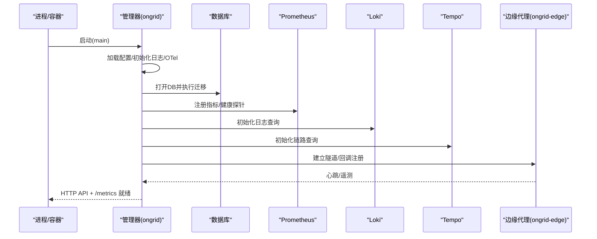
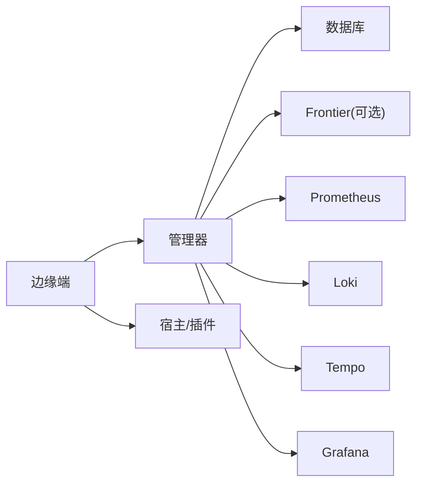
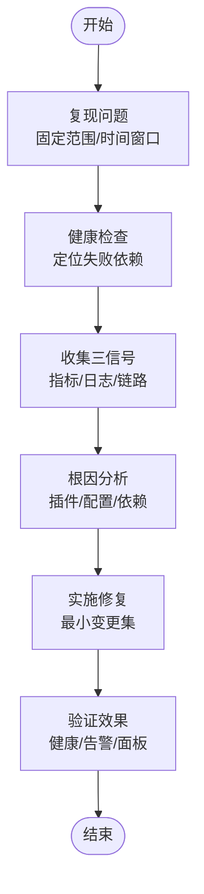
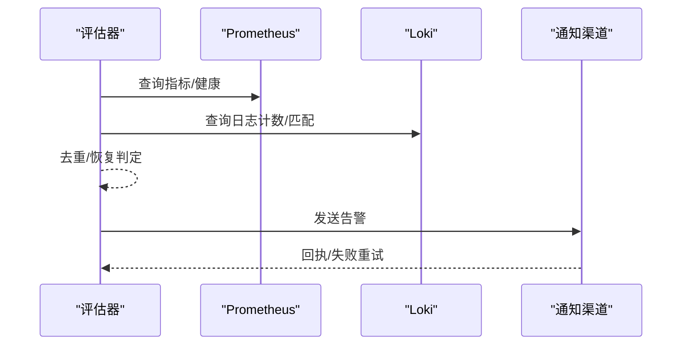

# 故障排查

<cite>
**本文引用的文件**
- [cmd/ongrid/main.go](file://cmd/ongrid/main.go)
- [cmd/ongrid-edge/main.go](file://cmd/ongrid-edge/main.go)
- [internal/pkg/config/config.go](file://internal/pkg/config/config.go)
- [internal/pkg/logger/logger.go](file://internal/pkg/logger/logger.go)
- [internal/manager/service/systemhealth/service.go](file://internal/manager/service/systemhealth/service.go)
- [web/src/api/systemHealth.ts](file://web/src/api/systemHealth.ts)
- [internal/edgeagent/plugins/supervisor.go](file://internal/edgeagent/plugins/supervisor.go)
- [internal/edgeagent/plugins/config_tunnel_logs_secret.go](file://internal/edgeagent/plugins/config_tunnel_logs_secret.go)
- [internal/manager/biz/alert/evaluators_phaseB.go](file://internal/manager/biz/alert/evaluators_phaseB.go)
- [internal/manager/biz/knowledge/builtin_vault/diagnostics/crashloop-restart.md](file://internal/manager/biz/knowledge/builtin_vault/diagnostics/crashloop-restart.md)
- [internal/manager/biz/knowledge/builtin_vault/concepts/observability.md](file://internal/manager/biz/knowledge/builtin_vault/concepts/observability.md)
- [deploy/install/prometheus-rules.yml](file://deploy/install/prometheus-rules.yml)
- [deploy/install/prometheus.yml](file://deploy/install/prometheus.yml)
- [deploy/install/grafana/provisioning/datasources/prometheus.yml](file://deploy/install/grafana/provisioning/datasources/prometheus.yml)
- [deploy/install/grafana/provisioning/datasources/loki.yml](file://deploy/install/grafana/provisioning/datasources/loki.yml)
- [deploy/install/grafana/provisioning/datasources/tempo.yml](file://deploy/install/grafana/provisioning/datasources/tempo.yml)
</cite>

## 目录
1. [简介](#简介)
2. [项目结构](#项目结构)
3. [核心组件](#核心组件)
4. [架构总览](#架构总览)
5. [详细组件分析](#详细组件分析)
6. [依赖关系分析](#依赖关系分析)
7. [性能注意事项](#性能注意事项)
8. [故障排查指南](#故障排查指南)
9. [结论](#结论)
10. [附录](#附录)

## 简介
本指南面向生产运维与SRE，聚焦可操作的故障排查方法：覆盖启动失败、连接异常、性能问题与数据不一致等常见故障类型；提供日志分析方法（级别设置、关键日志识别、错误模式分析）；介绍调试工具（命令行、API、性能分析）；给出问题定位流程（复现、根因分析、验证）；并包含监控告警配置与处理流程、最佳实践与预防措施。

## 项目结构
系统由云侧管理器（ongrid）与边缘端代理（ongrid-edge）组成，通过隧道通信；内置指标、日志、链路追踪与告警能力，支持Grafana/Loki/Tempo/Prometheus集成。

```mermaid
graph TB
subgraph "云侧"
M["管理器(ongrid)<br/>HTTP API / /metrics"]
DB["数据库(MySQL/SQLite)"]
PROM["Prometheus"]
LOKI["Loki"]
TEMPO["Tempo"]
end
subgraph "边缘端"
E["边缘代理(ongrid-edge)<br/>采集/插件/健康检查"]
end
E < --> |隧道| M
M --> DB
M --> PROM
M --> LOKI
M --> TEMPO
```

图表来源
- [cmd/ongrid/main.go:208-300](file://cmd/ongrid/main.go#L208-L300)
- [cmd/ongrid-edge/main.go:66-150](file://cmd/ongrid-edge/main.go#L66-L150)
- [internal/pkg/config/config.go:417-549](file://internal/pkg/config/config.go#L417-L549)

章节来源
- [cmd/ongrid/main.go:208-300](file://cmd/ongrid/main.go#L208-L300)
- [cmd/ongrid-edge/main.go:66-150](file://cmd/ongrid-edge/main.go#L66-L150)
- [internal/pkg/config/config.go:417-549](file://internal/pkg/config/config.go#L417-L549)

## 核心组件
- 配置加载与环境变量：集中管理所有运行时参数，包括DB、JWT、LLM、Prom、Grafana、通知、告警、日志/链路查询URL等。
- 日志框架：结构化JSON日志，默认输出到stderr，支持服务名注入与级别控制。
- 健康检查：统一的探针执行与汇总，返回ok/degraded/failed/unknown状态及耗时。
- 告警评估器：对指标、日志、链路进行规则评估，生成告警事件并触发通知。
- 插件监管：边缘端插件的拉取、启动、就绪检测与配置应用上报。

章节来源
- [internal/pkg/config/config.go:417-549](file://internal/pkg/config/config.go#L417-L549)
- [internal/pkg/logger/logger.go:1-27](file://internal/pkg/logger/logger.go#L1-L27)
- [internal/manager/service/systemhealth/service.go:388-442](file://internal/manager/service/systemhealth/service.go#L388-L442)
- [internal/manager/biz/alert/evaluators_phaseB.go:1-200](file://internal/manager/biz/alert/evaluators_phaseB.go#L1-L200)
- [internal/edgeagent/plugins/supervisor.go:135-255](file://internal/edgeagent/plugins/supervisor.go#L135-L255)

## 架构总览
管理器启动时完成配置加载、数据库迁移、鉴权、LLM路由、Prom/Grafana/Loki/Tempo集成、审计与设置初始化、拓扑对齐、边缘设备同步等；边缘端负责建立隧道、注册采集器与插件、暴露本地/metrics与健康端点。



图表来源
- [cmd/ongrid/main.go:208-300](file://cmd/ongrid/main.go#L208-L300)
- [cmd/ongrid-edge/main.go:136-160](file://cmd/ongrid-edge/main.go#L136-L160)

## 详细组件分析

### 启动与初始化（管理器）
- 配置加载失败直接退出，便于快速发现环境/密钥问题。
- 数据库迁移失败会终止启动，避免脏数据。
- JWT默认密钥保护：若仍为开发默认值则拒绝启动，强制安全基线。
- 首次启动自动播种必要设置（如Prom/Loki/Tempo URL），不影响后续重启。
- 系统健康检查在运行期持续探测依赖项，超时视为失败。

章节来源
- [cmd/ongrid/main.go:208-300](file://cmd/ongrid/main.go#L208-L300)
- [internal/pkg/config/config.go:417-549](file://internal/pkg/config/config.go#L417-L549)
- [internal/manager/service/systemhealth/service.go:388-442](file://internal/manager/service/systemhealth/service.go#L388-L442)

### 启动与初始化（边缘端）
- 支持Kubernetes模式下的注册与凭据刷新，失败时记录明确错误。
- 采集器模式（off/auto/embedded/scrape）决定指标推送路径，错误时降级或退出。
- 插件监管从隧道拉取配置，逐个启动并等待就绪，失败不中断其他插件。
- 本地/metrics与/healthz用于快速自检。

章节来源
- [cmd/ongrid-edge/main.go:66-160](file://cmd/ongrid-edge/main.go#L66-L160)
- [cmd/ongrid-edge/main.go:428-488](file://cmd/ongrid-edge/main.go#L428-L488)
- [internal/edgeagent/plugins/supervisor.go:135-255](file://internal/edgeagent/plugins/supervisor.go#L135-L255)

### 告警与评估
- 支持log_search/log_match/log_volume/trace_error_rate等规则，统一去重键与恢复机制。
- 评估失败记录警告日志，不阻断主循环；结果持久化后触发通知。
- 可通过PromQL/LogQL/Trace指标驱动，结合窗口与阈值判定。

章节来源
- [internal/manager/biz/alert/evaluators_phaseB.go:1-200](file://internal/manager/biz/alert/evaluators_phaseB.go#L1-L200)

### 插件与配置下发
- 插件配置变更通过隧道下发，监管器定期reconcile，记录“期望/启用”快照。
- 启动失败按错误类别分类（权限、二进制缺失、配置拒绝、未就绪等），便于前端展示与告警。

章节来源
- [internal/edgeagent/plugins/supervisor.go:135-255](file://internal/edgeagent/plugins/supervisor.go#L135-L255)
- [internal/edgeagent/plugins/config_tunnel_logs_secret.go:234-267](file://internal/edgeagent/plugins/config_tunnel_logs_secret.go#L234-L267)

## 依赖关系分析
- 管理器强依赖：数据库、Frontier（可选）、Prometheus、Loki、Tempo、Grafana、通知渠道。
- 边缘端依赖：云端隧道、Kubernetes API（可选）、宿主系统资源（node_exporter/process-exporter等）。
- 健康检查将各依赖纳入统一探针，超时即标记失败。



图表来源
- [internal/pkg/config/config.go:417-549](file://internal/pkg/config/config.go#L417-L549)
- [internal/manager/service/systemhealth/service.go:388-442](file://internal/manager/service/systemhealth/service.go#L388-L442)

章节来源
- [internal/pkg/config/config.go:417-549](file://internal/pkg/config/config.go#L417-L549)
- [internal/manager/service/systemhealth/service.go:388-442](file://internal/manager/service/systemhealth/service.go#L388-L442)

## 性能注意事项
- 指标基数控制：避免高基数标签导致存储与查询压力。
- 日志索引基数控制：避免在高基数字段上打标签。
- 采样率：链路追踪按需采样，优先错误/慢请求。
- 评估间隔：告警评估间隔不宜过短，避免风暴与CPU占用。
- 插件子进程：合理限制并发与资源，避免争抢宿主资源。

章节来源
- [internal/manager/biz/knowledge/builtin_vault/concepts/observability.md:1-53](file://internal/manager/biz/knowledge/builtin_vault/concepts/observability.md#L1-L53)
- [internal/manager/biz/alert/evaluators_phaseB.go:1-200](file://internal/manager/biz/alert/evaluators_phaseB.go#L1-L200)

## 故障排查指南

### 常见问题类型与定位要点
- 启动失败
  - 现象：进程立即退出或反复重启。
  - 关键点：首行错误日志、环境变量/密钥、数据库连通性、迁移失败、JWT默认密钥保护。
  - 参考：启动流程与错误退出点。
- 连接异常
  - 现象：边缘无法连云端、Prom/Loki/Tempo不可用、Grafana集成失败。
  - 关键点：网络可达性、TLS/CA、认证凭据、超时配置、健康检查失败项。
- 性能问题
  - 现象：接口延迟升高、指标抖动、日志量大、告警风暴。
  - 关键点：指标基数、日志基数、采样率、评估间隔、插件并发。
- 数据不一致
  - 现象：设备在线状态陈旧、拓扑不同步、告警未恢复。
  - 关键点：心跳阈值、拓扑对齐任务、告警去重键与恢复逻辑。

章节来源
- [cmd/ongrid/main.go:208-300](file://cmd/ongrid/main.go#L208-L300)
- [cmd/ongrid-edge/main.go:66-160](file://cmd/ongrid-edge/main.go#L66-L160)
- [internal/manager/biz/alert/evaluators_phaseB.go:1-200](file://internal/manager/biz/alert/evaluators_phaseB.go#L1-L200)

### 日志分析方法
- 日志级别设置
  - 使用结构化JSON日志，默认输出stderr；可按服务名区分上下文。
  - 建议：生产默认Info，临时诊断提升至Debug；注意不要记录敏感内容。
- 关键日志识别
  - 启动阶段：配置加载、DB迁移、鉴权、OTel初始化、设置播种。
  - 运行阶段：健康探针超时、插件启动失败、告警评估失败、通知发送失败。
- 错误模式分析
  - 分类插件错误：权限/只读文件系统、配置拒绝、二进制缺失、未就绪、通用启动失败。
  - 关联trace_id/edge_id，跨信号（指标/日志/链路）定位。

章节来源
- [internal/pkg/logger/logger.go:1-27](file://internal/pkg/logger/logger.go#L1-L27)
- [internal/edgeagent/plugins/config_tunnel_logs_secret.go:234-267](file://internal/edgeagent/plugins/config_tunnel_logs_secret.go#L234-L267)
- [internal/manager/biz/knowledge/builtin_vault/concepts/observability.md:1-53](file://internal/manager/biz/knowledge/builtin_vault/concepts/observability.md#L1-L53)

### 调试工具使用
- 命令行工具
  - 版本/帮助：边缘端支持--version/--help快速确认构建信息与用法。
  - 健康检查：边缘端本地/metrics与/healthz用于快速自检。
- API调试
  - 系统健康：调用POST /system/health/check获取分组检查结果与耗时。
  - 告警规则：创建/预览/启停规则，观察评估结果与通知。
- 性能分析
  - Prometheus：查看up、remote_write健康、指标基数与增长趋势。
  - Grafana：仪表盘与面板联动，结合exemplars跳转链路。
  - Tempo：基于trace_id检索调用链，定位慢依赖。

章节来源
- [cmd/ongrid-edge/main.go:89-117](file://cmd/ongrid-edge/main.go#L89-L117)
- [cmd/ongrid-edge/main.go:282-290](file://cmd/ongrid-edge/main.go#L282-L290)
- [web/src/api/systemHealth.ts:1-31](file://web/src/api/systemHealth.ts#L1-L31)
- [internal/manager/service/systemhealth/service.go:388-442](file://internal/manager/service/systemhealth/service.go#L388-L442)

### 问题定位流程
- 复现问题
  - 固定时间窗口与范围（edge_id/device_id），最小化变更集。
  - 使用预览/试算功能验证规则与查询。
- 根因分析
  - 从健康检查入手，定位失败的依赖组。
  - 通过指标/日志/链路三信号交叉验证，结合trace_id与edge_id。
  - 关注插件错误分类与配置快照，判断是否配置下发失败。
- 解决方案验证
  - 修改配置后观察健康检查与告警恢复。
  - 通过API预览与仪表盘确认效果，必要时回滚。



### 监控告警配置
- 告警规则设置
  - 通过API创建/更新规则，选择kind（metric_raw/log_search/log_match/log_volume/trace_latency/trace_error_rate）。
  - 设置scope_type、severity、labels、runbook_url，启用/禁用与冷却策略。
- 通知渠道配置
  - 支持Webhook/Slack/Feishu/DingTalk等，按通道独立开关与超时。
  - 全局通知开关与默认通道列表控制整体行为。
- 告警处理流程
  - 评估器周期性扫描，记录firing并触发通知；条件消失自动恢复。
  - 评估失败仅记录警告，不阻塞主循环。



图表来源
- [internal/manager/biz/alert/evaluators_phaseB.go:1-200](file://internal/manager/biz/alert/evaluators_phaseB.go#L1-L200)

章节来源
- [internal/manager/biz/alert/evaluators_phaseB.go:1-200](file://internal/manager/biz/alert/evaluators_phaseB.go#L1-L200)
- [internal/pkg/config/config.go:417-549](file://internal/pkg/config/config.go#L417-L549)

### 最佳实践与预防措施
- 启动前校验
  - 确保JWT密钥非默认值，数据库连通且迁移成功。
  - 配置外部依赖URL（Prom/Loki/Tempo/Grafana）正确可达。
- 运行期治理
  - 控制指标/日志基数，合理设置评估间隔与采样率。
  - 插件配置采用灰度发布，关注reconcile快照与错误分类。
- 可观测性
  - 统一trace_id/edge_id贯穿日志与链路，便于关联。
  - 利用健康检查与仪表盘快速发现退化。
- 演练与回滚
  - 变更前备份配置，变更后通过API预览与面板验证。
  - 出现异常及时回滚并保留证据（日志/指标/链路）。

章节来源
- [internal/manager/biz/knowledge/builtin_vault/diagnostics/crashloop-restart.md:51-85](file://internal/manager/biz/knowledge/builtin_vault/diagnostics/crashloop-restart.md#L51-L85)
- [internal/manager/biz/knowledge/builtin_vault/concepts/observability.md:1-53](file://internal/manager/biz/knowledge/builtin_vault/concepts/observability.md#L1-L53)

## 结论
通过对启动流程、健康检查、告警评估与插件监管的系统化理解，配合结构化日志与三信号关联，能够快速定位并解决启动失败、连接异常、性能问题与数据不一致等故障。建议在部署与运行中落实配置校验、基数治理、采样与评估调优、插件灰度与回滚策略，以持续提升稳定性与可维护性。

## 附录

### 监控与告警配置文件位置
- Prometheus规则与抓取配置
- Grafana数据源（Prometheus/Loki/Tempo）预置

章节来源
- [deploy/install/prometheus-rules.yml](file://deploy/install/prometheus-rules.yml)
- [deploy/install/prometheus.yml](file://deploy/install/prometheus.yml)
- [deploy/install/grafana/provisioning/datasources/prometheus.yml](file://deploy/install/grafana/provisioning/datasources/prometheus.yml)
- [deploy/install/grafana/provisioning/datasources/loki.yml](file://deploy/install/grafana/provisioning/datasources/loki.yml)
- [deploy/install/grafana/provisioning/datasources/tempo.yml](file://deploy/install/grafana/provisioning/datasources/tempo.yml)