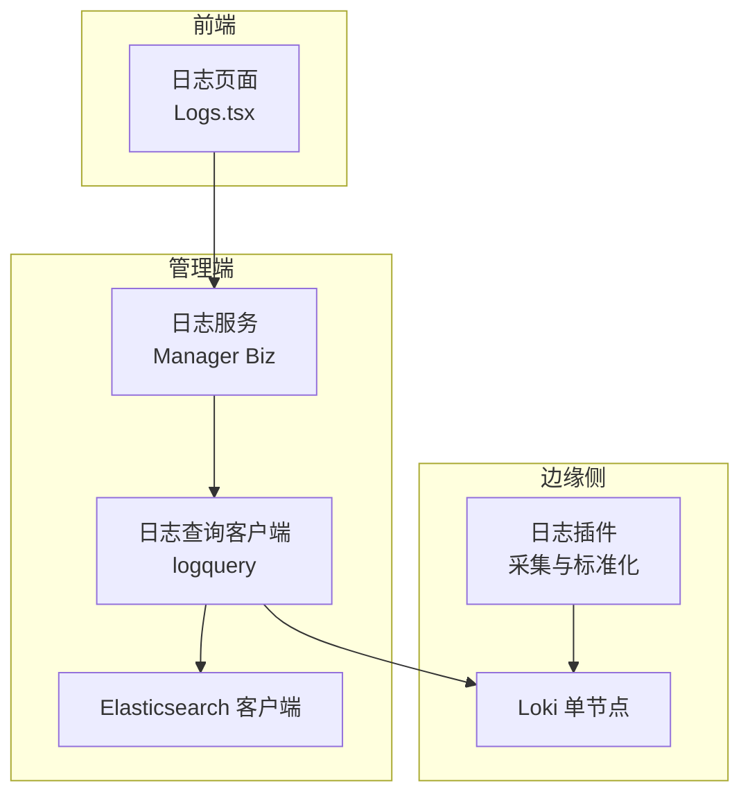
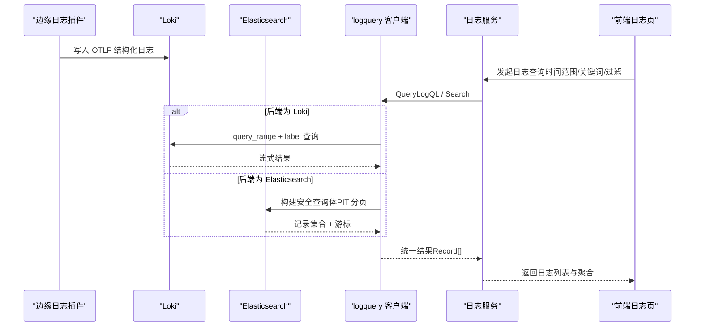
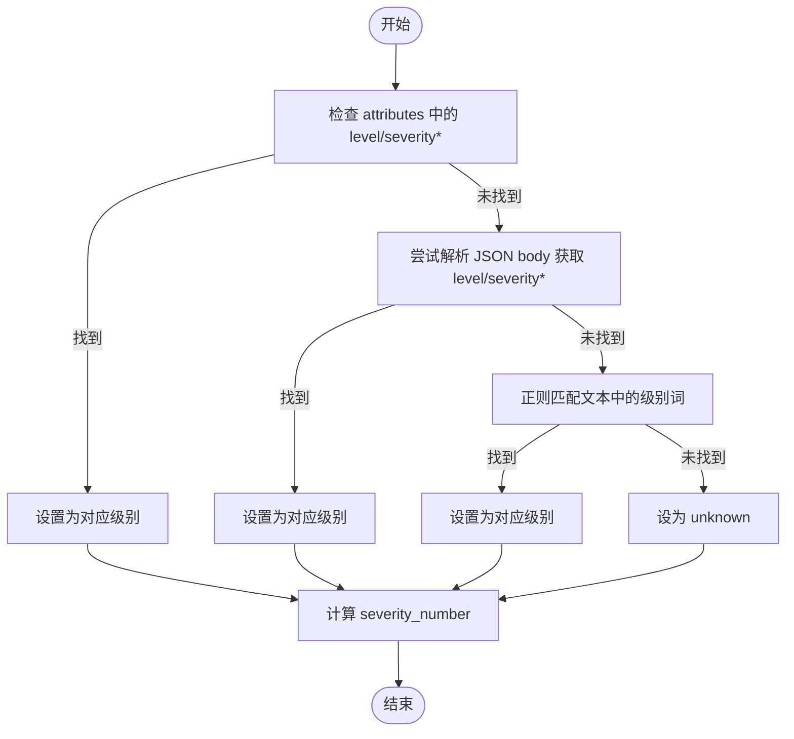
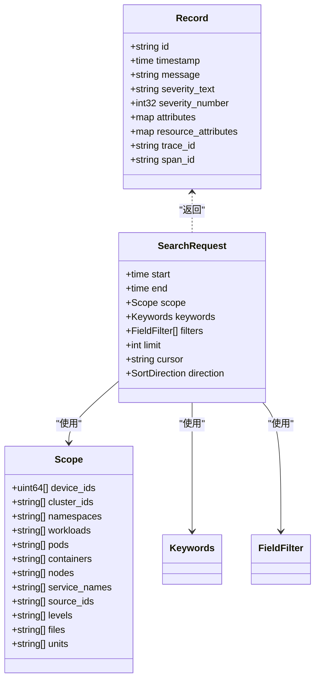
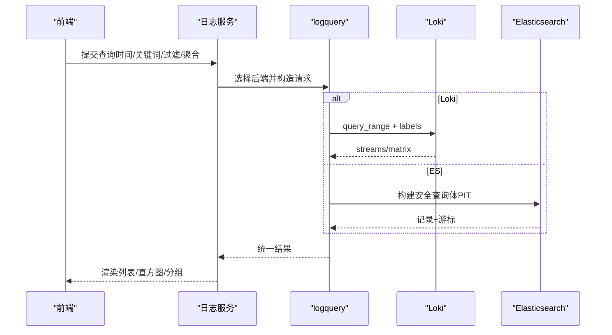
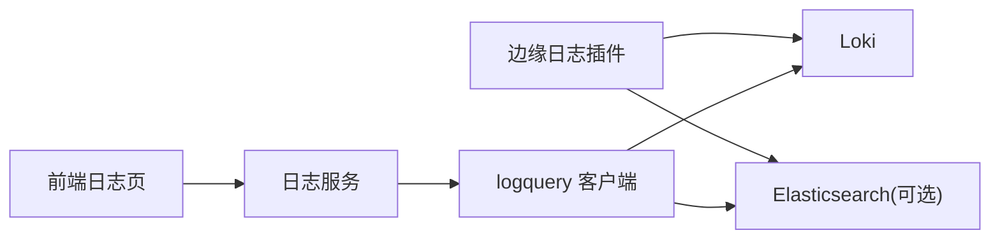

# 日志分析方法

<cite>
**本文引用的文件**
- [internal/pkg/logger/logger.go](file://internal/pkg/logger/logger.go)
- [internal/edgeagent/plugins/logs/render.go](file://internal/edgeagent/plugins/logs/render.go)
- [internal/pkg/logquery/search.go](file://internal/pkg/logquery/search.go)
- [internal/pkg/logquery/client.go](file://internal/pkg/logquery/client.go)
- [internal/pkg/logquery/elasticsearch.go](file://internal/pkg/logquery/elasticsearch.go)
- [internal/pkg/logquery/level.go](file://internal/pkg/logquery/level.go)
- [internal/manager/biz/logs/query_logql.go](file://internal/manager/biz/logs/query_logql.go)
- [internal/manager/biz/aiops/alertdraft/spec_normalize.go](file://internal/manager/biz/aiops/alertdraft/spec_normalize.go)
- [deploy/install/loki-config.yaml](file://deploy/install/loki-config.yaml)
- [web/src/pages/Logs.tsx](file://web/src/pages/Logs.tsx)
</cite>

## 目录
1. [简介](#简介)
2. [项目结构](#项目结构)
3. [核心组件](#核心组件)
4. [架构总览](#架构总览)
5. [详细组件分析](#详细组件分析)
6. [依赖关系分析](#依赖关系分析)
7. [性能考量](#性能考量)
8. [故障排查指南](#故障排查指南)
9. [结论](#结论)
10. [附录](#附录)

## 简介
本指南面向运维与开发人员，系统化说明 ongrid 的日志采集、存储、查询与分析方法。内容涵盖：
- 日志级别设置与规范化
- 日志格式规范（结构化 JSON、OTLP 字段）
- 关键日志识别方法（级别推断、关键字匹配、标签过滤）
- 使用日志查询工具进行问题定位（时间范围筛选、关键字搜索、聚合分析）
- 不同组件的日志输出格式与含义
- 日志轮转配置与存储优化建议
- 性能分析与错误追踪最佳实践

## 项目结构
本项目在边缘侧负责日志采集与标准化，在管理端提供统一的日志查询能力，并支持 Loki 与 Elasticsearch 两种后端。前端通过统一 API 展示日志列表、维度选择与聚合结果。

**图表来源**
- [internal/edgeagent/plugins/logs/render.go:90-123](file://internal/edgeagent/plugins/logs/render.go#L90-L123)
- [internal/pkg/logquery/client.go:124-171](file://internal/pkg/logquery/client.go#L124-L171)
- [internal/pkg/logquery/elasticsearch.go:88-175](file://internal/pkg/logquery/elasticsearch.go#L88-L175)
- [internal/manager/biz/logs/query_logql.go:16-49](file://internal/manager/biz/logs/query_logql.go#L16-L49)
- [web/src/pages/Logs.tsx:207-227](file://web/src/pages/Logs.tsx#L207-L227)

**章节来源**
- [internal/edgeagent/plugins/logs/render.go:90-123](file://internal/edgeagent/plugins/logs/render.go#L90-L123)
- [internal/pkg/logquery/client.go:124-171](file://internal/pkg/logquery/client.go#L124-L171)
- [internal/pkg/logquery/elasticsearch.go:88-175](file://internal/pkg/logquery/elasticsearch.go#L88-L175)
- [internal/manager/biz/logs/query_logql.go:16-49](file://internal/manager/biz/logs/query_logql.go#L16-L49)
- [web/src/pages/Logs.tsx:207-227](file://web/src/pages/Logs.tsx#L207-L227)

## 核心组件
- 日志采集与标准化（边缘侧）：从 journald 或文件源采集日志，解析并标准化为 OTLP 风格的结构化日志，自动推断日志级别，注入设备、集群、命名空间等上下文标签。
- 日志查询客户端（管理端）：封装对 Loki 与 Elasticsearch 的统一查询接口，支持时间窗口、关键词、字段过滤、分页游标、直方图与分组统计。
- 日志服务路由（管理端）：根据当前选定的后端将 LogQL 查询路由到 Loki 或将安全子集转换为 Elasticsearch 查询。
- 前端日志界面：展示日志行、时间格式化、级别着色、维度选择与聚合面板。

**章节来源**
- [internal/edgeagent/plugins/logs/render.go:90-123](file://internal/edgeagent/plugins/logs/render.go#L90-L123)
- [internal/pkg/logquery/search.go:78-152](file://internal/pkg/logquery/search.go#L78-L152)
- [internal/manager/biz/logs/query_logql.go:16-49](file://internal/manager/biz/logs/query_logql.go#L16-L49)
- [web/src/pages/Logs.tsx:1042-1052](file://web/src/pages/Logs.tsx#L1042-L1052)

## 架构总览
下图展示了从边缘采集到管理端查询的完整链路，包括 Loki 与 Elasticsearch 双后端的路由与数据归一化。

**图表来源**
- [internal/edgeagent/plugins/logs/render.go:90-123](file://internal/edgeagent/plugins/logs/render.go#L90-L123)
- [internal/pkg/logquery/client.go:124-171](file://internal/pkg/logquery/client.go#L124-L171)
- [internal/pkg/logquery/elasticsearch.go:88-175](file://internal/pkg/logquery/elasticsearch.go#L88-L175)
- [internal/manager/biz/logs/query_logql.go:16-49](file://internal/manager/biz/logs/query_logql.go#L16-L49)

## 详细组件分析

### 日志级别设置与规范化
- 边缘侧采集阶段会尝试从多种来源提取级别：attributes、JSON body、文本模式匹配（如 klog 风格 I/W/E/F），并进行大小写与别名归一化。
- 若未检测到级别，则标记为 unknown；同时生成对应的 severity_number，便于排序与阈值告警。
- 管理端查询层也具备级别检测与归一化能力，确保跨后端一致显示。

**图表来源**
- [internal/edgeagent/plugins/logs/render.go:254-284](file://internal/edgeagent/plugins/logs/render.go#L254-L284)
- [internal/pkg/logquery/level.go:14-47](file://internal/pkg/logquery/level.go#L14-L47)
- [internal/pkg/logquery/level.go:69-86](file://internal/pkg/logquery/level.go#L69-L86)

**章节来源**
- [internal/edgeagent/plugins/logs/render.go:254-284](file://internal/edgeagent/plugins/logs/render.go#L254-L284)
- [internal/pkg/logquery/level.go:14-47](file://internal/pkg/logquery/level.go#L14-L47)
- [internal/pkg/logquery/level.go:69-86](file://internal/pkg/logquery/level.go#L69-L86)

### 日志格式规范与关键日志识别
- 结构化日志优先：所有应用日志应输出 JSON 或遵循 OTLP 文档结构，包含 @timestamp、body.text、severity_text、trace_id/span_id 等字段。
- 资源属性（resource.attributes）用于设备、集群、命名空间、工作负载、Pod、容器、节点、服务名、源标识、文件路径、unit 等维度。
- 关键日志识别：
  - 级别：error/critical/fatal/panic 高亮显示
  - 关键字：支持 include/exclude 与短语匹配
  - 标签过滤：device_id、cluster_id、namespace、service_name、level、file、unit 等

**图表来源**
- [internal/pkg/logquery/search.go:78-152](file://internal/pkg/logquery/search.go#L78-L152)
- [internal/pkg/logquery/search.go:243-420](file://internal/pkg/logquery/search.go#L243-L420)

**章节来源**
- [internal/pkg/logquery/search.go:78-152](file://internal/pkg/logquery/search.go#L78-L152)
- [internal/pkg/logquery/search.go:243-420](file://internal/pkg/logquery/search.go#L243-L420)

### 使用日志查询工具进行问题定位
- 时间范围筛选：Start/End 必填，最大窗口限制，默认向后排序（最新在前）。
- 关键字搜索：支持任意匹配、全部匹配、短语匹配；可排除无关关键字。
- 字段过滤：支持等于、不等于、包含、存在、前缀匹配；字段白名单受控。
- 聚合分析：直方图按时间区间统计；分组统计支持 device_id、cluster_id、source_id、namespace、service_name。
- 分页游标：Elasticsearch 使用 PIT 游标，Loki 无状态游标；异常时释放资源。

**图表来源**
- [internal/manager/biz/logs/query_logql.go:16-49](file://internal/manager/biz/logs/query_logql.go#L16-L49)
- [internal/pkg/logquery/client.go:124-171](file://internal/pkg/logquery/client.go#L124-L171)
- [internal/pkg/logquery/elasticsearch.go:88-175](file://internal/pkg/logquery/elasticsearch.go#L88-L175)

**章节来源**
- [internal/manager/biz/logs/query_logql.go:16-49](file://internal/manager/biz/logs/query_logql.go#L16-L49)
- [internal/pkg/logquery/client.go:124-171](file://internal/pkg/logquery/client.go#L124-L171)
- [internal/pkg/logquery/elasticsearch.go:88-175](file://internal/pkg/logquery/elasticsearch.go#L88-L175)

### 不同组件的日志输出格式与含义
- 应用日志：推荐输出 JSON，包含 level/severity/severity_text；若无，系统会通过正则推断。
- 系统日志：journald 默认启用，按 unit 分离；也可配置 file_paths 收集 syslog/messages。
- Kubernetes 日志：默认采集 /var/log/pods/*/*/*.log，可按需调整路径。
- OTLP 字段：@timestamp、observed_timestamp、body.text、severity_text、severity_number、trace_id、span_id、resource.attributes.*。

**章节来源**
- [internal/edgeagent/plugins/logs/render.go:90-123](file://internal/edgeagent/plugins/logs/render.go#L90-L123)
- [internal/edgeagent/plugins/logs/render.go:254-284](file://internal/edgeagent/plugins/logs/render.go#L254-L284)
- [internal/pkg/logquery/elasticsearch.go:717-771](file://internal/pkg/logquery/elasticsearch.go#L717-L771)

### 日志轮转配置与存储优化建议
- Loki 单节点配置：
  - 保留期：默认 30 天（720h）
  - 写入速率限制： ingestion_rate_mb=8，burst=16
  - 最大全局流数：10000（控制基数）
  - 拒绝旧样本：reject_old_samples=true，max_age=168h
  - 压缩器：compactor 开启，本地存储
- 存储路径：chunks/rules 位于 /loki，索引周期 24h
- 建议：
  - 合理设置 retention_period 与 reject_old_samples_max_age，避免磁盘膨胀
  - 控制 max_global_streams_per_user，降低高基数风险
  - 对高频写入场景考虑分片与多实例部署

**章节来源**
- [deploy/install/loki-config.yaml:31-76](file://deploy/install/loki-config.yaml#L31-L76)

### 性能分析与错误追踪最佳实践
- 性能：
  - 限制查询窗口与 limit，避免大窗口全量扫描
  - 使用字段过滤缩小范围（device_id、namespace、service_name、level）
  - 利用直方图与分组统计进行趋势分析
  - Elasticsearch 使用 PIT 游标分页，避免重复上下文
- 错误追踪：
  - 关联 trace_id/span_id 实现端到端追踪
  - 对 error/critical/fatal/panic 级别重点监控
  - 结合 alert 规则基于 log_match/log_volume 触发告警

**章节来源**
- [internal/pkg/logquery/search.go:13-22](file://internal/pkg/logquery/search.go#L13-L22)
- [internal/pkg/logquery/elasticsearch.go:522-551](file://internal/pkg/logquery/elasticsearch.go#L522-L551)
- [internal/pkg/logquery/level.go:69-86](file://internal/pkg/logquery/level.go#L69-L86)

## 依赖关系分析
- 边缘侧日志插件依赖采集源（journald/file/k8s pod logs），输出标准化 OTLP 日志至 Loki。
- 管理端日志服务依赖 logquery 客户端，后者抽象 Loki 与 Elasticsearch 差异，向上提供统一接口。
- 前端依赖日志服务提供的 REST API，渲染日志列表与聚合视图。

**图表来源**
- [internal/edgeagent/plugins/logs/render.go:90-123](file://internal/edgeagent/plugins/logs/render.go#L90-L123)
- [internal/pkg/logquery/client.go:124-171](file://internal/pkg/logquery/client.go#L124-L171)
- [internal/pkg/logquery/elasticsearch.go:88-175](file://internal/pkg/logquery/elasticsearch.go#L88-L175)
- [internal/manager/biz/logs/query_logql.go:16-49](file://internal/manager/biz/logs/query_logql.go#L16-L49)

**章节来源**
- [internal/edgeagent/plugins/logs/render.go:90-123](file://internal/edgeagent/plugins/logs/render.go#L90-L123)
- [internal/pkg/logquery/client.go:124-171](file://internal/pkg/logquery/client.go#L124-L171)
- [internal/pkg/logquery/elasticsearch.go:88-175](file://internal/pkg/logquery/elasticsearch.go#L88-L175)
- [internal/manager/biz/logs/query_logql.go:16-49](file://internal/manager/biz/logs/query_logql.go#L16-L49)

## 性能考量
- 查询窗口与限制：
  - 最大搜索窗口 30 天，默认 limit 200，最大 1000
  - 字段值数量限制（scope 每项最多 100）
- 资源保护：
  - Loki 响应体限制 8 MiB，防止内存溢出
  - Elasticsearch 响应体限制 16/32 MiB，避免 OOM
- 游标与上下文：
  - Elasticsearch PIT 保持搜索上下文，失败或放弃时需关闭
  - Loki 游标无状态，无需显式关闭
- 建议：
  - 优先使用精确过滤（device_id、namespace、service_name、level）
  - 使用直方图与分组统计替代全量拉取
  - 合理设置 retention_period 与 reject_old_samples_max_age

**章节来源**
- [internal/pkg/logquery/search.go:13-22](file://internal/pkg/logquery/search.go#L13-L22)
- [internal/pkg/logquery/client.go:257-270](file://internal/pkg/logquery/client.go#L257-L270)
- [internal/pkg/logquery/elasticsearch.go:19-31](file://internal/pkg/logquery/elasticsearch.go#L19-L31)
- [deploy/install/loki-config.yaml:31-76](file://deploy/install/loki-config.yaml#L31-L76)

## 故障排查指南
- 常见问题：
  - 查询为空：检查时间窗口是否有效、关键词与过滤条件是否正确
  - 级别缺失：确认应用输出 JSON 或符合文本级别模式
  - 权限不足：Elasticsearch API Key 需具备所需权限
  - 游标失效：Elasticsearch PIT 过期或无效，需重新打开
- 诊断步骤：
  - 缩小时间窗口与增加过滤条件
  - 查看后端返回的错误信息（非 200 状态码）
  - 验证字段白名单与映射关系
  - 检查 Loki 保留期与拒绝旧样本策略

**章节来源**
- [internal/pkg/logquery/client.go:257-270](file://internal/pkg/logquery/client.go#L257-L270)
- [internal/pkg/logquery/elasticsearch.go:470-520](file://internal/pkg/logquery/elasticsearch.go#L470-L520)
- [internal/pkg/logquery/search.go:257-338](file://internal/pkg/logquery/search.go#L257-L338)

## 结论
ongrid 提供了从边缘采集到管理端查询的完整日志体系，支持 Loki 与 Elasticsearch 双后端，具备严格的输入校验、资源保护与性能优化机制。通过结构化日志、统一查询接口与可视化前端，能够快速定位问题、分析趋势并支撑告警与 AIOps。

## 附录
- 日志级别映射：trace/debug/info/notice/warn/error/critical/fatal/panic
- 常用字段：device_id、cluster_id、namespace、workload、pod、container、node、service_name、source_id、level、file、unit、trace_id、span_id、message
- 查询模式：any/all/phrase；方向 backward/forward
- 聚合维度：device_id、cluster_id、source_id、namespace、service_name

**章节来源**
- [internal/pkg/logquery/search.go:24-47](file://internal/pkg/logquery/search.go#L24-L47)
- [internal/pkg/logquery/search.go:368-420](file://internal/pkg/logquery/search.go#L368-L420)
- [internal/pkg/logquery/level.go:14-47](file://internal/pkg/logquery/level.go#L14-L47)