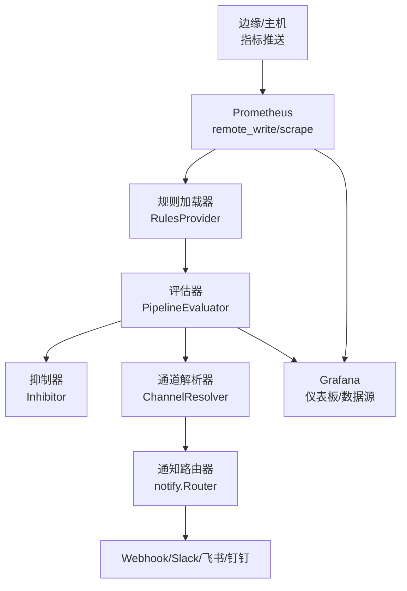
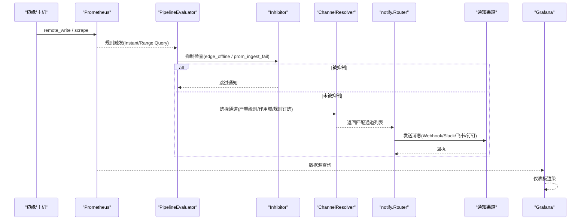
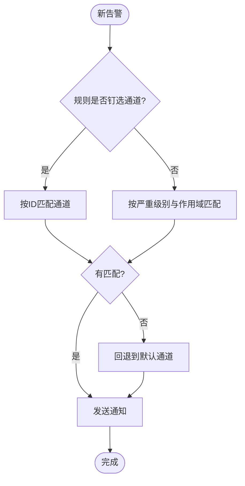
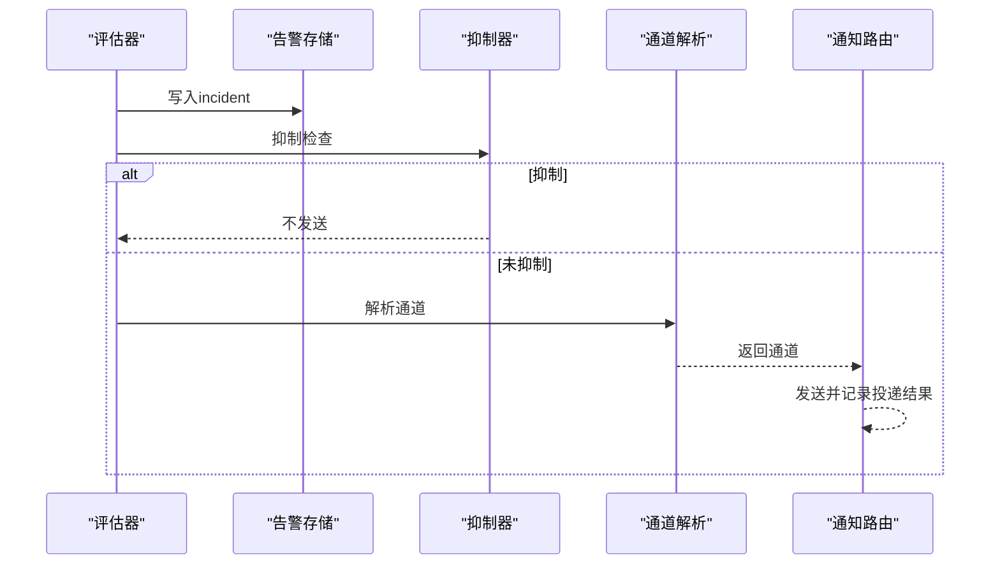
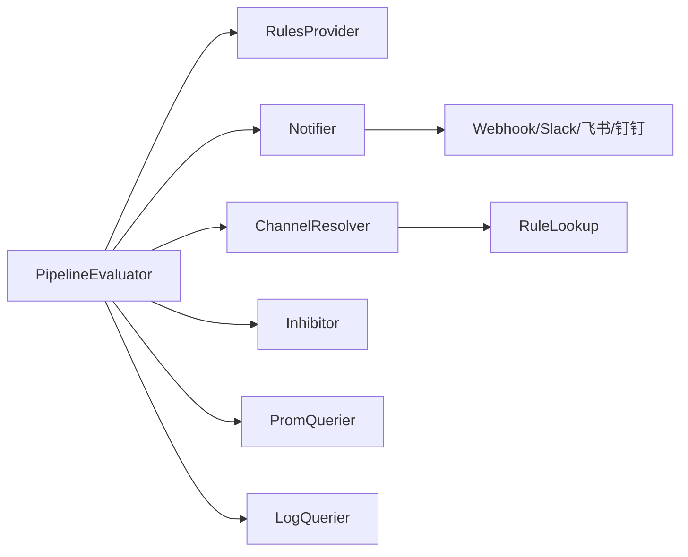

# 监控告警配置

<cite>
**本文引用的文件**
- [prometheus.yml](file://deploy/install/prometheus.yml)
- [prometheus-rules.yml](file://deploy/install/prometheus-rules.yml)
- [docker-compose.yml](file://deploy/install/docker-compose.yml)
- [alert.proto](file://api/manager/alert/v1/alert.proto)
- [pipeline.go](file://internal/manager/biz/alert/pipeline.go)
- [rules.go](file://internal/manager/biz/alert/rules.go)
- [router.go](file://internal/manager/biz/alert/router.go)
- [inhibit.go](file://internal/manager/biz/alert/inhibit.go)
- [notify.go](file://internal/pkg/notify/notify.go)
- [server-detail.json](file://deploy/grafana/provisioning/dashboards/json/server-detail.json)
- [grafana.ts](file://web/src/api/grafana.ts)
- [service.go](file://internal/manager/biz/grafana/service.go)
- [alert_evaluator_test.go](file://tests/e2e/alert_evaluator_test.go)
</cite>

## 目录
1. [简介](#简介)
2. [项目结构](#项目结构)
3. [核心组件](#核心组件)
4. [架构总览](#架构总览)
5. [详细组件分析](#详细组件分析)
6. [依赖关系分析](#依赖关系分析)
7. [性能与容量规划](#性能与容量规划)
8. [故障排查指南](#故障排查指南)
9. [结论](#结论)
10. [附录：快速上手清单](#附录快速上手清单)

## 简介
本指南面向运维与SRE团队，提供基于本项目的监控告警落地方案。内容覆盖Prometheus规则配置、告警阈值设置、通知渠道配置、自定义指标与告警规则创建、告警路由与抑制、告警处理流程与升级策略、可视化仪表板定制，以及告警测试与验证方法。所有说明均基于仓库内现有实现与部署配置，确保可直接在生产环境复用。

## 项目结构
本项目将“采集—存储—评估—路由—通知—可视化”的链路以容器化方式编排，并通过内置的告警管道（Pipeline）统一执行各类规则。关键位置如下：
- Prometheus 配置与自观测规则：deploy/install/prometheus.yml、deploy/install/prometheus-rules.yml
- 服务编排与运行参数：deploy/install/docker-compose.yml
- 告警规则定义与评估引擎：internal/manager/biz/alert/*
- 通知通道与路由：internal/pkg/notify/notify.go、internal/manager/biz/alert/router.go
- 抑制规则：internal/manager/biz/alert/inhibit.go
- 可视化与仪表板：deploy/grafana/provisioning/dashboards/json/server-detail.json、web/src/api/grafana.ts、internal/manager/biz/grafana/service.go
- API契约（事件/状态）：api/manager/alert/v1/alert.proto
- 端到端测试用例：tests/e2e/alert_evaluator_test.go

图表来源
- [prometheus.yml:1-36](file://deploy/install/prometheus.yml#L1-L36)
- [docker-compose.yml:339-381](file://deploy/install/docker-compose.yml#L339-L381)
- [pipeline.go:96-188](file://internal/manager/biz/alert/pipeline.go#L96-L188)
- [notify.go:39-130](file://internal/pkg/notify/notify.go#L39-L130)
- [server-detail.json:1-457](file://deploy/grafana/provisioning/dashboards/json/server-detail.json#L1-L457)

章节来源
- [prometheus.yml:1-36](file://deploy/install/prometheus.yml#L1-L36)
- [docker-compose.yml:52-220](file://deploy/install/docker-compose.yml#L52-L220)
- [docker-compose.yml:339-381](file://deploy/install/docker-compose.yml#L339-L381)

## 核心组件
- Prometheus 与规则
  - 通过 prometheus.yml 启用 self-scrape 与 ongrid-manager 抓取，并挂载 rules.yml 作为 rule_files。
  - 自观测规则在 prometheus-rules.yml 中定义，用于监控管理器健康、LLM错误率、DB池使用率等。
- 告警评估管道
  - PipelineEvaluator 按固定间隔轮询，读取 RulesProvider 提供的规则快照，调用 Prom/Loki 查询并生成告警事件。
  - 支持 metric_raw/anomaly/forecast/burn_rate、log_search/match/volume、trace_latency/error_rate 等多类规则。
- 通知与路由
  - notify.Router 聚合多种通道（Webhook、Slack、飞书、钉钉），支持默认通道与超时控制。
  - ChannelResolver 根据告警严重级别、作用域与规则级“通道钉选”决定最终发送目标。
- 抑制
  - BuiltinInhibitor 内置两类抑制：edge离线抑制同设备主机告警；prom_ingest_fail抑制scrape_down噪音。
- 可视化
  - Grafana 数据源与仪表板通过 provision 注入；系统还提供动态构建监控面板JSON的能力，便于前端渲染或导入。

章节来源
- [prometheus.yml:10-25](file://deploy/install/prometheus.yml#L10-L25)
- [prometheus-rules.yml:7-79](file://deploy/install/prometheus-rules.yml#L7-L79)
- [pipeline.go:96-188](file://internal/manager/biz/alert/pipeline.go#L96-L188)
- [rules.go:29-236](file://internal/manager/biz/alert/rules.go#L29-L236)
- [notify.go:39-130](file://internal/pkg/notify/notify.go#L39-L130)
- [router.go:11-111](file://internal/manager/biz/alert/router.go#L11-L111)
- [inhibit.go:25-74](file://internal/manager/biz/alert/inhibit.go#L25-L74)
- [service.go:607-651](file://internal/manager/biz/grafana/service.go#L607-L651)

## 架构总览
下图展示从指标采集到告警通知与可视化的完整链路，以及与配置文件的映射关系。

图表来源
- [prometheus.yml:16-25](file://deploy/install/prometheus.yml#L16-L25)
- [prometheus-rules.yml:12-79](file://deploy/install/prometheus-rules.yml#L12-L79)
- [pipeline.go:172-188](file://internal/manager/biz/alert/pipeline.go#L172-L188)
- [inhibit.go:44-74](file://internal/manager/biz/alert/inhibit.go#L44-L74)
- [router.go:65-111](file://internal/manager/biz/alert/router.go#L65-L111)
- [notify.go:92-130](file://internal/pkg/notify/notify.go#L92-L130)
- [server-detail.json:1-457](file://deploy/grafana/provisioning/dashboards/json/server-detail.json#L1-L457)

## 详细组件分析

### Prometheus 规则与阈值
- 规则文件挂载与热重载
  - prometheus.yml 通过 rule_files 指向 /etc/prometheus/rules.yml，结合 --web.enable-lifecycle 支持编辑后热重载。
- 自观测规则示例
  - OngridManagerDown：up{job="ongrid-manager"} == 0，持续2分钟，severity=critical。
  - OngridLLMErrorRateHigh：LLM错误率>10%持续10分钟，severity=warning。
  - OngridDBPoolSaturated：DB池使用率>90%持续5分钟，severity=warning。
  - OngridHTTP5xxRateHigh：API 5xx比例>5%持续5分钟，severity=warning。
- 阈值建议
  - 生产环境建议先以 warning 观察，稳定后再提升为 critical。
  - for 持续时间需结合业务容忍度与告警风暴风险综合设定。

章节来源
- [prometheus.yml:10-25](file://deploy/install/prometheus.yml#L10-L25)
- [prometheus-rules.yml:12-79](file://deploy/install/prometheus-rules.yml#L12-L79)

### 自定义监控指标与告警规则
- 指标上报
  - 通过 manager 的 metrics 端口暴露内部指标；Prometheus 以 job_name='ongrid-manager' 定期抓取。
- 自定义规则类型
  - metric_raw：直接写PromQL表达式作为谓词，适合简单阈值与组合条件。
  - metric_anomaly：基于历史基线的异常检测（zscore/mad）。
  - metric_forecast：线性预测未来值是否越界。
  - metric_burn_rate：多窗口燃烧率，贴合SLO/预算消耗。
  - log_search/log_match/log_volume：日志检索与计数阈值。
  - trace_latency/trace_error_rate：基于spanmetrics的延迟与错误率。
- 规则缓存与刷新
  - CachedRulesProvider 周期性从数据源加载规则并原子替换快照，编译失败仅记录警告不影响其他规则。

章节来源
- [docker-compose.yml:52-220](file://deploy/install/docker-compose.yml#L52-L220)
- [rules.go:29-236](file://internal/manager/biz/alert/rules.go#L29-L236)
- [rules.go:333-518](file://internal/manager/biz/alert/rules.go#L333-L518)

### 告警路由与抑制
- 通道解析
  - DBChannelResolver 根据 incident 的 severity/scope_type 过滤启用的通道；若规则指定了“通道钉选”，则优先按钉选结果匹配。
  - 无匹配时回退到环境变量配置的默认通道集合。
- 内置抑制
  - edge离线抑制同设备主机告警，避免误报。
  - prom_ingest_fail抑制scrape_down系列告警，聚焦根因。
- 通知路由
  - notify.Router 支持超时、默认通道、多通道并发发送与错误聚合。

图表来源
- [router.go:65-111](file://internal/manager/biz/alert/router.go#L65-L111)
- [notify.go:92-130](file://internal/pkg/notify/notify.go#L92-L130)

章节来源
- [router.go:11-111](file://internal/manager/biz/alert/router.go#L11-L111)
- [inhibit.go:25-74](file://internal/manager/biz/alert/inhibit.go#L25-L74)
- [notify.go:39-130](file://internal/pkg/notify/notify.go#L39-L130)

### 通知渠道配置
- 支持渠道
  - Webhook、Slack、飞书、钉钉。可通过环境变量启用并配置URL/密钥。
- 配置要点
  - 开启通知开关、设置默认通道、配置各渠道URL与可选密钥。
  - 注意超时时间，避免慢下游阻塞评估循环。
- 发送语义
  - 未配置任何通道会报错；已禁用通道会被忽略；每个通道独立超时与错误收集。

章节来源
- [docker-compose.yml:195-215](file://deploy/install/docker-compose.yml#L195-L215)
- [notify.go:67-90](file://internal/pkg/notify/notify.go#L67-L90)
- [notify.go:92-130](file://internal/pkg/notify/notify.go#L92-L130)

### 告警处理流程与升级策略
- 处理流程
  - 评估器定时触发 → 查询数据源 → 生成incident → 抑制判断 → 通道解析 → 通知发送 → 持久化与审计。
- 升级策略
  - 建议分阶段：先只打日志通道，再逐步接入IM/电话；critical级别可配置更短冷却时间与更多通道。
  - 对高频告警使用抑制与冷却，降低噪声。
  - 通过 runbook_url 关联处置手册，提升排障效率。

图表来源
- [pipeline.go:172-188](file://internal/manager/biz/alert/pipeline.go#L172-L188)
- [inhibit.go:44-74](file://internal/manager/biz/alert/inhibit.go#L44-L74)
- [router.go:65-111](file://internal/manager/biz/alert/router.go#L65-L111)
- [notify.go:92-130](file://internal/pkg/notify/notify.go#L92-L130)

章节来源
- [pipeline.go:96-188](file://internal/manager/biz/alert/pipeline.go#L96-L188)
- [inhibit.go:25-74](file://internal/manager/biz/alert/inhibit.go#L25-L74)
- [router.go:11-111](file://internal/manager/biz/alert/router.go#L11-L111)

### 监控数据可视化与仪表板定制
- 预置仪表板
  - server-detail.json 提供CPU/内存/Load/网络等面板，绑定Prometheus数据源UID，支持变量筛选设备。
- 动态面板生成
  - 系统可将用户管理的监控面板列表渲染为Grafana Dashboard JSON，便于导入或前端原生渲染。
- 数据源与子路径
  - Grafana 通过 sub_path 暴露于 /grafana，数据源由 provision 注入，PromQL查询来自Prometheus。

章节来源
- [server-detail.json:1-457](file://deploy/grafana/provisioning/dashboards/json/server-detail.json#L1-L457)
- [service.go:607-651](file://internal/manager/biz/grafana/service.go#L607-L651)
- [grafana.ts:1-43](file://web/src/api/grafana.ts#L1-L43)

### 告警测试与验证
- 端到端测试
  - 通过创建 metric_raw 规则并在FakeProm中注入瞬时结果，验证评估器能正确产生incident。
- 本地验证步骤
  - 修改规则或阈值 → 触发Prom reload → 等待一个评估周期 → 查看incident列表与通知投递记录。
- 回归与冒烟
  - 利用静态规则提供者与测试夹具，隔离验证特定规则类型的编译与评估逻辑。

章节来源
- [alert_evaluator_test.go:29-57](file://tests/e2e/alert_evaluator_test.go#L29-L57)
- [rules.go:333-518](file://internal/manager/biz/alert/rules.go#L333-L518)

## 依赖关系分析
- 组件耦合
  - PipelineEvaluator 依赖 RulesProvider、Notifier、ChannelResolver、Inhibitor 及数据访问接口（Prom/Loki/Edge）。
  - ChannelResolver 依赖规则查找以支持“通道钉选”。
  - notify.Router 依赖具体Sender实现（Webhook/Slack/飞书/钉钉）。
- 外部依赖
  - Prometheus（规则与查询）、Loki（日志）、Grafana（可视化）、Frontier/Tunnel（遥测通道，间接影响指标可达性）。

图表来源
- [pipeline.go:63-94](file://internal/manager/biz/alert/pipeline.go#L63-L94)
- [rules.go:213-236](file://internal/manager/biz/alert/rules.go#L213-L236)
- [router.go:25-54](file://internal/manager/biz/alert/router.go#L25-L54)
- [notify.go:39-90](file://internal/pkg/notify/notify.go#L39-L90)

章节来源
- [pipeline.go:63-94](file://internal/manager/biz/alert/pipeline.go#L63-L94)
- [rules.go:213-236](file://internal/manager/biz/alert/rules.go#L213-L236)
- [router.go:25-54](file://internal/manager/biz/alert/router.go#L25-L54)
- [notify.go:39-90](file://internal/pkg/notify/notify.go#L39-L90)

## 性能与容量规划
- 评估间隔与冷却
  - 评估间隔默认5分钟，冷却默认10分钟；可根据业务敏感度调整，但过短会增加负载与告警风暴风险。
- 规则复杂度
  - 复杂PromQL/LogQL会影响查询延迟；尽量将比较与过滤下推到PromQL/LogQL侧。
- 存储与保留
  - Prometheus TSDB 保留90天/20GB上限；合理设置指标基数与标签维度，避免膨胀。
- 通知通道
  - 为下游通道设置合理超时，避免阻塞评估循环；批量通知时关注速率限制。

[本节为通用指导，无需代码引用]

## 故障排查指南
- 常见问题定位
  - 规则未生效：确认 rule_files 挂载与Prom reload；检查规则编译日志。
  - 告警不通知：检查通知开关、默认通道、通道URL/密钥；查看投递记录与错误。
  - 告警风暴：启用抑制与冷却；审查规则粒度与for持续时间。
  - 数据缺失：确认远程写入/抓取目标可达；检查edge在线性与Tunnel连通性。
- 诊断手段
  - 查看Prometheus targets与规则状态；使用PromQL验证表达式；核对incident列表与状态流转。
  - 通过Grafana仪表板快速定位资源瓶颈与趋势。

章节来源
- [prometheus.yml:10-25](file://deploy/install/prometheus.yml#L10-L25)
- [prometheus-rules.yml:12-79](file://deploy/install/prometheus-rules.yml#L12-L79)
- [notify.go:92-130](file://internal/pkg/notify/notify.go#L92-L130)
- [inhibit.go:44-74](file://internal/manager/biz/alert/inhibit.go#L44-L74)
- [server-detail.json:1-457](file://deploy/grafana/provisioning/dashboards/json/server-detail.json#L1-L457)

## 结论
本项目提供了从指标采集、规则评估、路由抑制到通知与可视化的完整闭环。通过灵活的规则类型、可插拔的通知通道与内置抑制策略，既能满足基础监控需求，也能支撑复杂的SLO与AIOps场景。建议在生产环境中循序渐进地启用功能，配合合理的阈值与冷却策略，持续优化告警质量与运营效率。

## 附录：快速上手清单
- 启用Prometheus自观测规则
  - 确认 prometheus.yml 已挂载 rules.yml 并启用生命周期管理。
  - 按需调整 prometheus-rules.yml 中的阈值与持续时间。
- 配置通知渠道
  - 在 docker-compose.yml 的环境变量中启用并配置 Webhook/Slack/飞书/钉钉。
  - 设置默认通道与超时，先在日志通道验证。
- 创建自定义规则
  - 通过UI或API创建 metric_raw/log_search/trace_latency 等规则，编写表达式并保存。
  - 使用端到端测试思路进行冒烟验证。
- 配置抑制与路由
  - 利用内置抑制减少噪声；通过通道解析器按严重级别与作用域定向通知。
- 可视化与仪表板
  - 使用预置仪表板快速查看主机指标；根据需要导入或动态生成面板。
- 验证与演练
  - 构造触发条件，观察incident状态流转与通知到达；复盘并调优阈值与冷却。