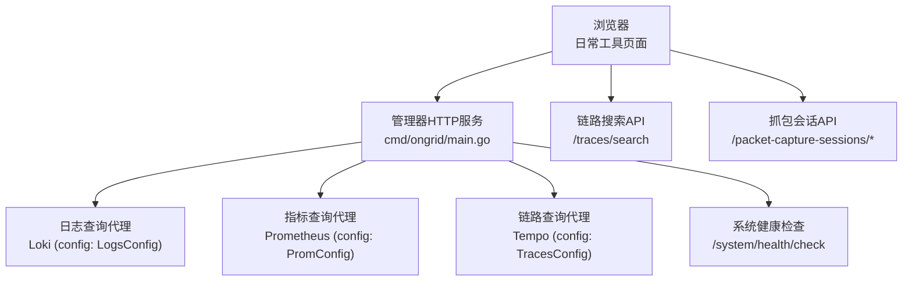
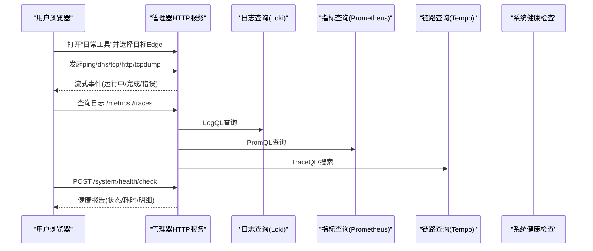
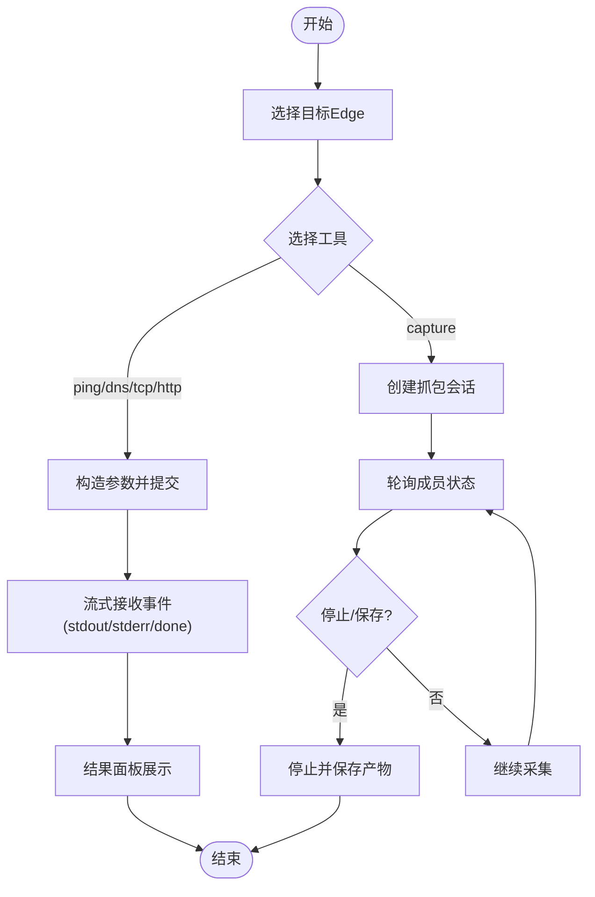
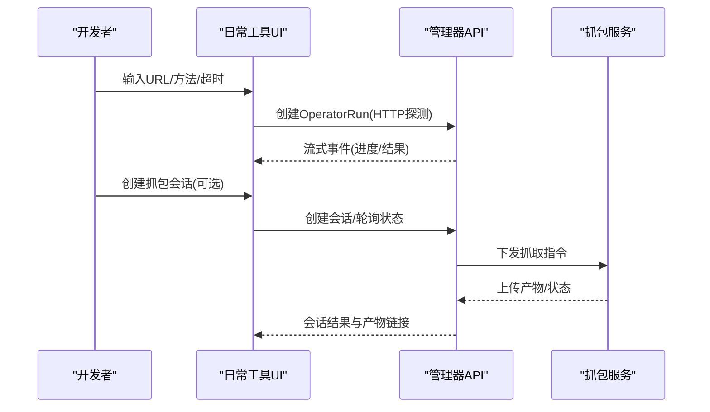
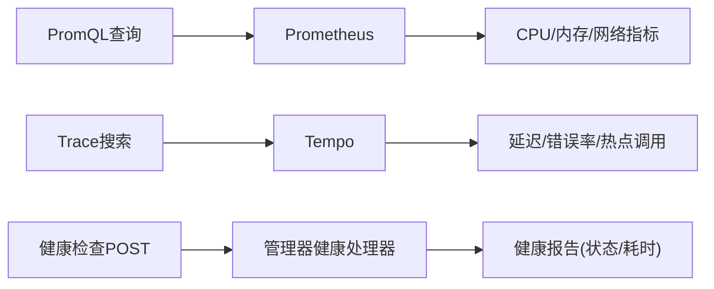
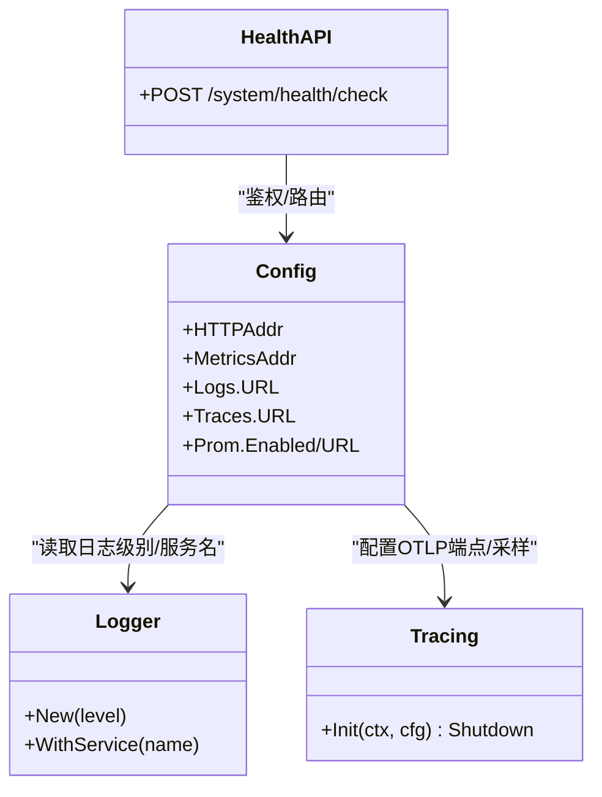
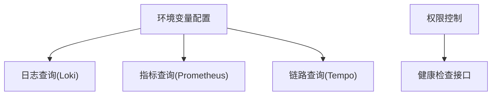

# 调试工具使用

<cite>
**本文引用的文件**
- [cmd/ongrid/main.go](file://cmd/ongrid/main.go)
- [internal/pkg/config/config.go](file://internal/pkg/config/config.go)
- [internal/pkg/logger/logger.go](file://internal/pkg/logger/logger.go)
- [internal/pkg/tracing/tracing.go](file://internal/pkg/tracing/tracing.go)
- [web/src/pages/DailyTools.tsx](file://web/src/pages/DailyTools.tsx)
- [web/src/api/packetCaptures.ts](file://web/src/api/packetCaptures.ts)
- [web/src/api/traces.ts](file://web/src/api/traces.ts)
- [web/src/api/systemHealth.ts](file://web/src/api/systemHealth.ts)
- [internal/manager/server/systemhealth/http_test.go](file://internal/manager/server/systemhealth/http_test.go)
- [internal/manager/biz/knowledge/builtin_vault/reference/promql-snippets.md](file://internal/manager/biz/knowledge/builtin_vault/reference/promql-snippets.md)
- [internal/manager/biz/knowledge/builtin_vault/systems/observability-stack/prometheus.md](file://internal/manager/biz/knowledge/builtin_vault/systems/observability-stack/prometheus.md)
- [internal/manager/biz/aiops/tools/query_logql.go](file://internal/manager/biz/aiops/tools/query_logql.go)
</cite>

## 目录
1. [简介](#简介)
2. [项目结构](#项目结构)
3. [核心组件](#核心组件)
4. [架构总览](#架构总览)
5. [详细组件分析](#详细组件分析)
6. [依赖关系分析](#依赖关系分析)
7. [性能注意事项](#性能注意事项)
8. [故障排查指南](#故障排查指南)
9. [结论](#结论)
10. [附录](#附录)

## 简介
本手册面向运维与研发人员，系统化介绍本项目内置的调试与排障能力：包括前端“日常工具”页（网络探测、抓包）、日志/指标/链路查询、系统健康检查、远程调试与日志收集方法。文档同时给出浏览器开发者工具的实战技巧，帮助快速定位接口问题与前端错误。

## 项目结构
与调试相关的关键位置如下：
- 后端入口与可观测性集成：cmd/ongrid/main.go
- 运行时配置（端口、Prom/Loki/Tempo、告警等）：internal/pkg/config/config.go
- 结构化日志输出：internal/pkg/logger/logger.go
- 分布式追踪（OpenTelemetry + Tempo）：internal/pkg/tracing/tracing.go
- 前端调试工作台（ping/dns/tcp/http/tcpdump）：web/src/pages/DailyTools.tsx
- 抓包会话 API：web/src/api/packetCaptures.ts
- 链路搜索 API：web/src/api/traces.ts
- 系统健康检查 API：web/src/api/systemHealth.ts
- 健康检查服务端测试（权限校验）：internal/manager/server/systemhealth/http_test.go
- PromQL 参考片段与最佳实践：internal/manager/biz/knowledge/builtin_vault/reference/promql-snippets.md、prometheus.md
- 日志查询工具实现（LogQL）：internal/manager/biz/aiops/tools/query_logql.go

图表来源
- [cmd/ongrid/main.go:1-200](file://cmd/ongrid/main.go#L1-L200)
- [internal/pkg/config/config.go:81-103](file://internal/pkg/config/config.go#L81-L103)
- [web/src/api/traces.ts:81-112](file://web/src/api/traces.ts#L81-L112)
- [web/src/api/packetCaptures.ts:189-210](file://web/src/api/packetCaptures.ts#L189-L210)
- [web/src/api/systemHealth.ts:1-31](file://web/src/api/systemHealth.ts#L1-L31)

章节来源
- [cmd/ongrid/main.go:1-200](file://cmd/ongrid/main.go#L1-L200)
- [internal/pkg/config/config.go:81-103](file://internal/pkg/config/config.go#L81-L103)

## 核心组件
- 结构化日志：统一以 JSON 行输出到标准错误，便于集中采集与检索；支持附加 service、trace_id 等上下文属性。
- 可观测性配置：通过环境变量启用/关闭 Prometheus、Loki、Tempo 等后端，并设置地址、超时、TLS 等参数。
- 分布式追踪：启动时初始化 OTel TracerProvider，将 span 批量上报至 Tempo，用于延迟与错误率评估。
- 前端调试工作台：提供 ping/dig/tcp/http/tcpdump 等常用诊断命令，支持多 Edge 并行执行与结果持久化。
- 系统健康检查：受管理员权限保护，返回各子系统状态与耗时，辅助快速发现异常。

章节来源
- [internal/pkg/logger/logger.go:1-27](file://internal/pkg/logger/logger.go#L1-L27)
- [internal/pkg/config/config.go:21-63](file://internal/pkg/config/config.go#L21-L63)
- [internal/pkg/tracing/tracing.go:1-106](file://internal/pkg/tracing/tracing.go#L1-L106)
- [web/src/pages/DailyTools.tsx:128-134](file://web/src/pages/DailyTools.tsx#L128-L134)
- [web/src/api/systemHealth.ts:1-31](file://web/src/api/systemHealth.ts#L1-L31)

## 架构总览
下图展示了从浏览器到后端及可观测性后端的调用链，以及调试工具如何串联日志、指标、链路数据。

图表来源
- [web/src/pages/DailyTools.tsx:357-431](file://web/src/pages/DailyTools.tsx#L357-L431)
- [internal/manager/biz/aiops/tools/query_logql.go:167-221](file://internal/manager/biz/aiops/tools/query_logql.go#L167-L221)
- [web/src/api/traces.ts:81-112](file://web/src/api/traces.ts#L81-L112)
- [web/src/api/systemHealth.ts:1-31](file://web/src/api/systemHealth.ts#L1-L31)

## 详细组件分析

### 内置调试命令与工具（日常工具页）
- 功能概览
  - 网络连通性：ping、dig（DNS）、TCP 端口探测、HTTP 请求（支持 HEAD/GET、超时、跳过 TLS 验证）。
  - 抓包：tcpdump 模式，支持过滤条件、时长、大小限制、命名空间选择，支持会话管理与实时预览。
  - 多 Edge 并行执行：一次操作可同时作用于多个边缘节点，结果分栏展示，历史保存在本地浏览器存储。
- 关键流程
  - 选择 Edge → 选择工具与参数 → 提交任务 → 流式接收 stdout/stderr 与完成事件 → 结果面板展示。
  - 抓包会话创建 → 轮询成员状态 → 停止并保存 → 查看产物链接。
- 实用建议
  - 优先用 HTTP 探测服务存活与健康端点；必要时开启“跳过 TLS 检测”仅用于临时排障。
  - 抓包时尽量限定时间窗口与包大小，避免磁盘与带宽压力。
  - 结合“网络命名空间”字段在容器化环境中精准捕获流量。

图表来源
- [web/src/pages/DailyTools.tsx:357-431](file://web/src/pages/DailyTools.tsx#L357-L431)
- [web/src/pages/DailyTools.tsx:468-570](file://web/src/pages/DailyTools.tsx#L468-L570)
- [web/src/api/packetCaptures.ts:189-210](file://web/src/api/packetCaptures.ts#L189-L210)

章节来源
- [web/src/pages/DailyTools.tsx:128-134](file://web/src/pages/DailyTools.tsx#L128-L134)
- [web/src/pages/DailyTools.tsx:357-431](file://web/src/pages/DailyTools.tsx#L357-L431)
- [web/src/pages/DailyTools.tsx:468-570](file://web/src/pages/DailyTools.tsx#L468-L570)
- [web/src/api/packetCaptures.ts:189-210](file://web/src/api/packetCaptures.ts#L189-L210)

### API 调试与问题复现
- 通过“日常工具”的 HTTP 探测快速验证后端健康端点或第三方依赖可达性。
- 使用抓包会话捕获真实流量，结合过滤器缩小范围，便于复现与定位。
- 借助链路搜索按服务/操作/时间范围筛选，定位慢调用与错误路径。

图表来源
- [web/src/pages/DailyTools.tsx:357-431](file://web/src/pages/DailyTools.tsx#L357-L431)
- [web/src/api/packetCaptures.ts:189-210](file://web/src/api/packetCaptures.ts#L189-L210)

章节来源
- [web/src/pages/DailyTools.tsx:357-431](file://web/src/pages/DailyTools.tsx#L357-L431)
- [web/src/api/packetCaptures.ts:189-210](file://web/src/api/packetCaptures.ts#L189-L210)

### 性能分析工具（CPU/内存/网络）
- 指标查询（Prometheus）
  - 使用内置 PromQL 片段快速计算 CPU 利用率、内存使用、磁盘 IO、网络吞吐、TCP 重传比例等。
  - 关注高基数标签与 rate() 的正确用法，避免误用导致噪声或性能问题。
- 链路分析（Tempo）
  - 通过链路搜索接口按服务/操作/时间范围检索，结合 span 详情定位瓶颈。
- 系统健康检查
  - 调用健康检查接口获取各子系统状态与耗时，辅助判断整体健康度。

图表来源
- [internal/manager/biz/knowledge/builtin_vault/reference/promql-snippets.md:1-92](file://internal/manager/biz/knowledge/builtin_vault/reference/promql-snippets.md#L1-L92)
- [internal/manager/biz/knowledge/builtin_vault/systems/observability-stack/prometheus.md:67-110](file://internal/manager/biz/knowledge/builtin_vault/systems/observability-stack/prometheus.md#L67-L110)
- [web/src/api/traces.ts:81-112](file://web/src/api/traces.ts#L81-L112)
- [web/src/api/systemHealth.ts:1-31](file://web/src/api/systemHealth.ts#L1-L31)

章节来源
- [internal/manager/biz/knowledge/builtin_vault/reference/promql-snippets.md:1-92](file://internal/manager/biz/knowledge/builtin_vault/reference/promql-snippets.md#L1-L92)
- [internal/manager/biz/knowledge/builtin_vault/systems/observability-stack/prometheus.md:67-110](file://internal/manager/biz/knowledge/builtin_vault/systems/observability-stack/prometheus.md#L67-L110)
- [web/src/api/traces.ts:81-112](file://web/src/api/traces.ts#L81-L112)
- [web/src/api/systemHealth.ts:1-31](file://web/src/api/systemHealth.ts#L1-L31)

### 浏览器开发者工具使用技巧
- 网络请求调试
  - 在“日常工具”页执行 HTTP 探测时，观察 Network 面板的请求/响应、状态码、耗时与跨域情况。
  - 抓包会话产物可通过链接下载，配合 Wireshark 进一步分析协议细节。
- 前端错误排查
  - 使用 Console 面板查看 JS 错误与警告；结合 Sources 断点调试异步流程。
  - 利用 Performance 面板录制页面交互，识别卡顿与长任务。
- 本地缓存与历史
  - “日常工具”的运行历史保存在浏览器本地存储，刷新后可恢复未完成的任务。

章节来源
- [web/src/pages/DailyTools.tsx:660-682](file://web/src/pages/DailyTools.tsx#L660-L682)

### 远程调试配置与日志收集
- 日志
  - 后端使用结构化 JSON 日志输出到标准错误，建议接入集中式日志系统（如 Loki）进行检索与分析。
  - 可在日志中注入 trace_id、service 等上下文，便于跨服务关联。
- 追踪
  - 启动时初始化 OpenTelemetry 并配置 OTLP HTTP 端点，将 span 批量上报至 Tempo；采样比可按规模调整。
- 指标
  - 通过环境变量启用 Prometheus 集成，暴露 /metrics 供抓取；也可通过内部查询接口进行 PromQL 检索。
- 健康检查
  - 健康检查接口需管理员权限，返回各子系统的状态与耗时，适合自动化巡检与告警。

图表来源
- [internal/pkg/config/config.go:21-63](file://internal/pkg/config/config.go#L21-L63)
- [internal/pkg/logger/logger.go:13-26](file://internal/pkg/logger/logger.go#L13-L26)
- [internal/pkg/tracing/tracing.go:35-106](file://internal/pkg/tracing/tracing.go#L35-L106)
- [internal/manager/server/systemhealth/http_test.go:41-87](file://internal/manager/server/systemhealth/http_test.go#L41-L87)

章节来源
- [internal/pkg/logger/logger.go:13-26](file://internal/pkg/logger/logger.go#L13-L26)
- [internal/pkg/tracing/tracing.go:35-106](file://internal/pkg/tracing/tracing.go#L35-L106)
- [internal/manager/server/systemhealth/http_test.go:41-87](file://internal/manager/server/systemhealth/http_test.go#L41-L87)

## 依赖关系分析
- 配置驱动的可观测性开关
  - 通过环境变量控制是否启用 Prometheus/Loki/Tempo 等后端，影响 AI 工具注册与页面可用性。
- 日志/指标/链路联动
  - 日志查询基于 LogQL，指标查询基于 PromQL，链路查询基于 Tempo；三者共同构成问题定位闭环。
- 权限与安全
  - 健康检查接口要求管理员权限，防止非授权访问。

图表来源
- [internal/pkg/config/config.go:81-103](file://internal/pkg/config/config.go#L81-L103)
- [internal/manager/server/systemhealth/http_test.go:41-87](file://internal/manager/server/systemhealth/http_test.go#L41-L87)

章节来源
- [internal/pkg/config/config.go:81-103](file://internal/pkg/config/config.go#L81-L103)
- [internal/manager/server/systemhealth/http_test.go:41-87](file://internal/manager/server/systemhealth/http_test.go#L41-L87)

## 性能注意事项
- 指标查询
  - 使用合适的 time window（如 5m）避免抖动；谨慎处理高基数标签，避免产生过多系列。
- 链路采样
  - 根据规模调整采样比，平衡成本与覆盖度；生产环境可适当降低采样以降低开销。
- 抓包资源
  - 限制持续时间、最大字节数与包数量，避免对目标 Edge 造成额外负载。
- 健康检查频率
  - 合理设置巡检间隔，避免频繁调用带来不必要压力。

[本节为通用指导，不直接分析具体文件]

## 故障排查指南
- 无法查询日志
  - 检查日志后端 URL 是否配置正确；若未配置，日志页面将不可用。
  - 使用 LogQL 工具时确保查询语句与设备范围有效。
- 指标为空或异常
  - 确认 Prometheus 已启用且可访问；检查 scrape 与 remote_write 是否正常。
  - 使用 PromQL 片段验证基础指标是否存在。
- 链路无数据
  - 确认 OTel 导出器与 Tempo 端点配置正确；检查采样比与网络连通性。
- 健康检查失败
  - 确认当前用户具备管理员权限；查看返回的检查项与耗时定位异常子系统。

章节来源
- [internal/pkg/config/config.go:81-103](file://internal/pkg/config/config.go#L81-L103)
- [internal/manager/biz/aiops/tools/query_logql.go:167-221](file://internal/manager/biz/aiops/tools/query_logql.go#L167-L221)
- [internal/manager/biz/knowledge/builtin_vault/reference/promql-snippets.md:1-92](file://internal/manager/biz/knowledge/builtin_vault/reference/promql-snippets.md#L1-L92)
- [internal/pkg/tracing/tracing.go:35-106](file://internal/pkg/tracing/tracing.go#L35-L106)
- [internal/manager/server/systemhealth/http_test.go:41-87](file://internal/manager/server/systemhealth/http_test.go#L41-L87)

## 结论
本项目提供了从前端到后端的完整调试与可观测性能力：通过“日常工具”快速进行网络探测与抓包，结合日志、指标与链路数据进行问题定位；系统健康检查与结构化日志、分布式追踪共同构成稳定的排障基线。建议在日常工作中形成“先连通性、再日志/指标、最后链路”的排查习惯，并合理使用抓包与会话管理，提升效率与准确性。

## 附录
- 常用环境变量（节选）
  - 日志查询：ONGRID_LOG_QUERY_URL
  - 链路查询：ONGRID_TRACE_QUERY_URL
  - 指标查询：ONGRID_PROM_ENABLED、ONGRID_PROM_URL
  - 健康检查：无需额外变量，通过管理员权限调用
- 常用接口
  - 健康检查：POST /system/health/check
  - 链路搜索：GET /traces/search
  - 抓包会话：POST/GET/POST /packet-capture-sessions/*

[本节为补充信息，不直接分析具体文件]