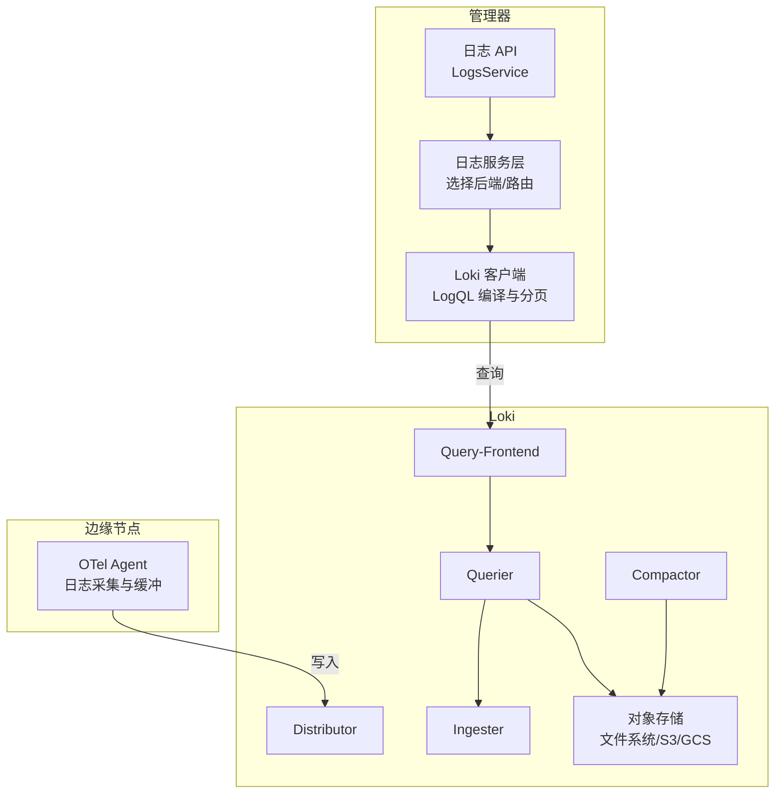
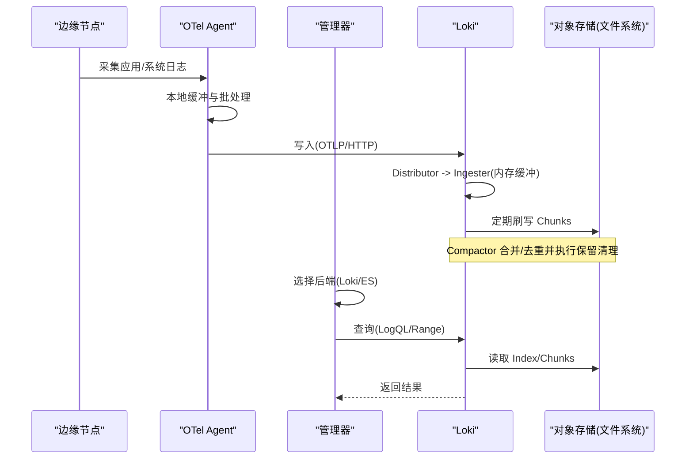
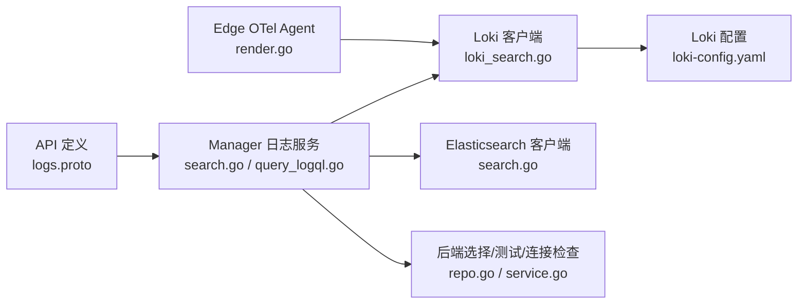
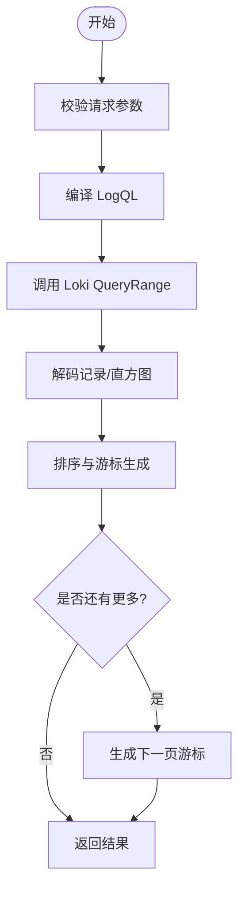
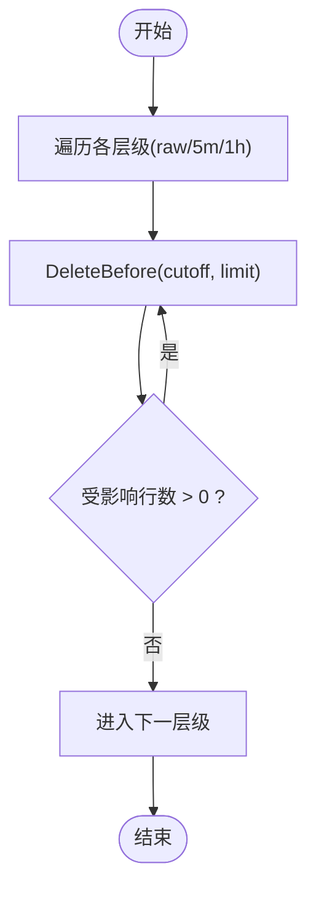

# 日志存储与保留

<cite>
**本文引用的文件**
- [loki-config.yaml](file://deploy/install/loki-config.yaml)
- [logs.proto](file://api/manager/logs/v1/logs.proto)
- [repo.go](file://internal/manager/data/logs/store/repo.go)
- [migrate.go](file://internal/manager/data/logs/store/migrate.go)
- [model.go](file://internal/manager/model/logs/model.go)
- [service.go](file://internal/manager/biz/logs/service.go)
- [search.go](file://internal/manager/biz/logs/search.go)
- [query_logql.go](file://internal/manager/biz/logs/query_logql.go)
- [loki_search.go](file://internal/pkg/logquery/loki_search.go)
- [runtime_client.go](file://internal/pkg/logquery/runtime_client.go)
- [render.go](file://internal/edgeagent/plugins/logs/render.go)
- [retention.go](file://internal/manager/biz/metric/retention.go)
- [writer.go](file://internal/manager/data/metric/store/writer.go)
- [block-devices-and-filesystems.md](file://internal/manager/biz/knowledge/builtin_vault/systems/storage/block-devices-and-filesystems.md)
- [io-scheduling.md](file://internal/manager/biz/knowledge/builtin_vault/systems/storage/io-scheduling.md)
- [disk-io-saturation.md](file://internal/manager/biz/knowledge/builtin_vault/diagnostics/disk-io-saturation.md)
- [disk-pressure.md](file://internal/manager/biz/knowledge/builtin_vault/diagnostics/disk-pressure.md)
- [loki.md](file://internal/manager/biz/knowledge/builtin_vault/systems/observability-stack/loki.md)
</cite>

## 目录
1. [简介](#简介)
2. [项目结构](#项目结构)
3. [核心组件](#核心组件)
4. [架构总览](#架构总览)
5. [详细组件分析](#详细组件分析)
6. [依赖关系分析](#依赖关系分析)
7. [性能考虑](#性能考虑)
8. [故障排查指南](#故障排查指南)
9. [结论](#结论)
10. [附录](#附录)

## 简介
本文件围绕 Loki 作为日志存储后端，在本项目中的集成、配置与运维策略进行系统化说明。内容涵盖：
- Loki 存储后端配置（对象存储、本地文件系统、分布式部署）
- 数据分片与复制策略（分片键设计、副本因子、负载均衡）
- 日志保留策略（基于时间、基于大小、冷热分层）
- 存储性能优化（索引、压缩、内存、磁盘 I/O）
- 数据迁移与备份方案（导出、恢复、灾难恢复）
- 存储空间监控与容量规划建议

本项目在 Manager 侧提供统一的日志查询与后端管理 API，Edge 侧通过 OTel Agent 将日志写入 Loki；Loki 默认以单二进制模式运行，使用本地文件系统作为对象存储后端，并通过 Compactor 执行保留清理。

## 项目结构
与日志存储与保留相关的代码与配置主要分布在以下位置：
- 部署配置：deploy/install/loki-config.yaml（Loki 单节点配置）
- 控制面模型与存储：internal/manager/model/logs、internal/manager/data/logs/store
- 查询路由与客户端：internal/manager/biz/logs、internal/pkg/logquery
- Edge 采集与落盘：internal/edgeagent/plugins/logs/render.go
- 指标保留（参考）：internal/manager/biz/metric、internal/manager/data/metric/store
- 知识文档：internal/manager/biz/knowledge/builtin_vault/systems/*, diagnostics/*

图表来源
- [loki-config.yaml:1-76](file://deploy/install/loki-config.yaml#L1-L76)
- [loki_search.go:31-118](file://internal/pkg/logquery/loki_search.go#L31-L118)
- [search.go:27-59](file://internal/manager/biz/logs/search.go#L27-L59)

章节来源
- [loki-config.yaml:1-76](file://deploy/install/loki-config.yaml#L1-L76)
- [logs.proto:9-25](file://api/manager/logs/v1/logs.proto#L9-L25)

## 核心组件
- Loki 单节点配置与存储后端：使用文件系统作为 chunks/rules 存储，启用 compactor 并设置 retention_period。
- 日志后端管理：Manager 支持外部 Elasticsearch 后端与内置 Loki 的切换与连接检查。
- 日志查询路由：根据当前选定的后端，将 LogQL 或安全子集转发到对应后端。
- Edge 端日志缓冲：OTel Agent 本地持久化缓冲，保障网络抖动时的可靠性。
- 指标保留（参考）：按 tier 定时删除过期数据，体现“基于时间的保留”思想。

章节来源
- [loki-config.yaml:10-75](file://deploy/install/loki-config.yaml#L10-L75)
- [repo.go:85-106](file://internal/manager/data/logs/store/repo.go#L85-L106)
- [search.go:27-59](file://internal/manager/biz/logs/search.go#L27-L59)
- [render.go:191-224](file://internal/edgeagent/plugins/logs/render.go#L191-L224)
- [retention.go:47-103](file://internal/manager/biz/metric/retention.go#L47-L103)

## 架构总览
下图展示了从 Edge 采集到 Loki 存储与查询的端到端流程，以及 Manager 对后端的统一管理与路由。

图表来源
- [loki-config.yaml:10-75](file://deploy/install/loki-config.yaml#L10-L75)
- [loki_search.go:31-118](file://internal/pkg/logquery/loki_search.go#L31-L118)
- [search.go:27-59](file://internal/manager/biz/logs/search.go#L27-L59)

## 详细组件分析

### Loki 存储后端配置
- 存储后端：默认使用文件系统作为对象存储后端，chunks 与 rules 目录分离，便于独立挂载与扩容。
- 复制因子：replication_factor=1（单节点），如需高可用可提升为多副本并配合 ring 与 kvstore。
- 索引与 schema：TSDB-style index 文件，period=24h，prefix=index_。
- 保留策略：limits_config.retention_period=720h（30天），compactor 启用并指向本地 working_directory。
- 限制与吞吐：ingestion_rate_mb、ingestion_burst_size_mb、max_query_series、max_query_lookback 等限流与查询保护。
- Ruler：规则存储类型为 local，目录与临时目录分离。

章节来源
- [loki-config.yaml:10-75](file://deploy/install/loki-config.yaml#L10-L75)

### 数据分片与复制策略
- 分片键设计：Loki 以 stream（标签集合）为单位组织数据，标签即分片键。项目将 device_id、cluster_id、namespace、workload、pod、container、node、service_name、source_id、level、file、unit 等作为标签/结构化元数据映射到 Loki 标签或结构化元数据中，用于高效过滤与聚合。
- 副本因子：当前部署 replication_factor=1；若需跨节点容灾，可在微服务模式提升副本数并配置 ring 与 kvstore。
- 负载均衡：单二进制模式下由进程内各组件协作；微服务模式可通过 distributor 哈希分发至 ingester 集群。

章节来源
- [loki.md:13-46](file://internal/manager/biz/knowledge/builtin_vault/systems/observability-stack/loki.md#L13-L46)
- [loki-config.yaml:10-30](file://deploy/install/loki-config.yaml#L10-L30)
- [loki_search.go:390-526](file://internal/pkg/logquery/loki_search.go#L390-L526)

### 日志保留策略
- 基于时间的保留：Loki limits_config.retention_period 控制数据生命周期；compactor 负责后台合并与删除过期 chunk。
- 基于大小的清理：当前未直接暴露按大小阈值清理的配置项；可通过调整 retention_period 与 compactor 工作目录空间监控间接实现。
- 冷热分层：可将热数据置于高性能本地盘，冷数据归档至对象存储（S3/GCS）。当前部署使用本地文件系统，可按需迁移至远端对象存储以降低成本。
- 参考指标保留逻辑：按 tier 循环删除直到无影响行，体现“批量+回退”的保留思想，可用于指导日志清理脚本设计。

章节来源
- [loki-config.yaml:31-75](file://deploy/install/loki-config.yaml#L31-L75)
- [retention.go:47-103](file://internal/manager/biz/metric/retention.go#L47-L103)
- [writer.go:161-182](file://internal/manager/data/metric/store/writer.go#L161-L182)

### 查询与后端路由
- 后端选择：Manager 支持选择内置 Loki 或外部 Elasticsearch；当未选择外部后端时，查询走 Loki。
- 查询路由：QueryLogQL 根据 selectedBackend 决定调用 Loki 的 QueryRange 或将 LogQL 转换为安全搜索子集调用 ES。
- 游标与分页：Loki 客户端实现基于时间戳与 skip 的稳定游标，避免重复与遗漏。

章节来源
- [search.go:27-59](file://internal/manager/biz/logs/search.go#L27-L59)
- [query_logql.go:16-49](file://internal/manager/biz/logs/query_logql.go#L16-L49)
- [loki_search.go:31-118](file://internal/pkg/logquery/loki_search.go#L31-L118)

### Edge 端日志缓冲与可靠性
- OTel Agent 启用本地存储扩展，设置目录、超时、最大尺寸、fsync、压缩与回弹阈值，确保在网络不可用或 Loki 抖动时不丢日志。
- 健康检查端口暴露，便于编排平台探测存活。

章节来源
- [render.go:191-224](file://internal/edgeagent/plugins/logs/render.go#L191-L224)

### 控制面模型与迁移
- Backend 模型：记录后端名称、类型、状态、版本、端点、命名空间、索引模式、凭据引用、CA、Kibana URL、TLS 选项、检测到的版本等。
- 迁移：AutoMigrate 创建表并回填软删除标记，保证升级兼容。
- 选择 Loki：SelectLoki 会取消所有已选的外部后端，使 Loki 成为权威后端。

章节来源
- [model.go:24-49](file://internal/manager/model/logs/model.go#L24-L49)
- [migrate.go:10-30](file://internal/manager/data/logs/store/migrate.go#L10-L30)
- [repo.go:85-106](file://internal/manager/data/logs/store/repo.go#L85-L106)

### 运行时 Loki 客户端与端点解析
- RuntimeClient：每次公开操作前解析当前 Loki 端点（URL、Basic Auth、TLS），变更无需重启。
- 缓存：复用 HTTP Client，减少握手开销。

章节来源
- [runtime_client.go:16-51](file://internal/pkg/logquery/runtime_client.go#L16-L51)

## 依赖关系分析

图表来源
- [logs.proto:9-25](file://api/manager/logs/v1/logs.proto#L9-L25)
- [search.go:27-59](file://internal/manager/biz/logs/search.go#L27-L59)
- [query_logql.go:16-49](file://internal/manager/biz/logs/query_logql.go#L16-L49)
- [loki_search.go:31-118](file://internal/pkg/logquery/loki_search.go#L31-L118)
- [repo.go:85-106](file://internal/manager/data/logs/store/repo.go#L85-L106)
- [render.go:191-224](file://internal/edgeagent/plugins/logs/render.go#L191-L224)
- [loki-config.yaml:10-75](file://deploy/install/loki-config.yaml#L10-L75)

章节来源
- [logs.proto:9-25](file://api/manager/logs/v1/logs.proto#L9-L25)
- [search.go:27-59](file://internal/manager/biz/logs/search.go#L27-L59)
- [loki_search.go:31-118](file://internal/pkg/logquery/loki_search.go#L31-L118)

## 性能考虑
- 索引优化
  - 控制标签基数：避免将高基数字段（如 request_id）作为标签；优先使用低基数字段（device_id、namespace、workload 等）。
  - 结构化元数据：非索引字段放入结构化元数据，减少索引膨胀。
- 压缩与对象存储
  - 当前使用文件系统作为对象存储；生产环境可迁移至 S3/GCS，结合压缩与生命周期策略降低存储成本。
- 内存管理
  - Ingester 内存缓冲与 flush 周期影响写入延迟与吞吐；合理设置 ingestion_rate 与 burst，避免内存峰值过高。
- 磁盘 I/O 调优
  - 文件系统选择：大数据量并行写入场景推荐 xfs；SSD/NVMe 设备建议使用 none 或 mq-deadline 调度器。
  - 队列深度与预读：nr_requests、read_ahead_kb 可根据负载调优。
  - 脏页写回：vm.dirty_* 参数影响写放大与延迟，应结合 workload 调整。
- 查询性能
  - 限制 max_query_series、max_query_lookback；使用精确的时间窗口与标签匹配减少扫描范围。
  - 直方图与计数：利用 count_over_time 与 step 对齐，避免重叠计算。

章节来源
- [loki.md:13-46](file://internal/manager/biz/knowledge/builtin_vault/systems/observability-stack/loki.md#L13-L46)
- [loki-config.yaml:31-75](file://deploy/install/loki-config.yaml#L31-L75)
- [block-devices-and-filesystems.md:1-42](file://internal/manager/biz/knowledge/builtin_vault/systems/storage/block-devices-and-filesystems.md#L1-L42)
- [io-scheduling.md:1-57](file://internal/manager/biz/knowledge/builtin_vault/systems/storage/io-scheduling.md#L1-L57)
- [disk-io-saturation.md:55-85](file://internal/manager/biz/knowledge/builtin_vault/diagnostics/disk-io-saturation.md#L55-L85)
- [disk-pressure.md:74-96](file://internal/manager/biz/knowledge/builtin_vault/diagnostics/disk-pressure.md#L74-L96)

## 故障排查指南
- 磁盘压力与 IO 饱和
  - 使用 iostat/iotop 定位热点设备与进程；关注 await、svctm、%util。
  - 若 Dirty 塌陷导致周期性卡顿，调整 vm.dirty_* 参数以获得更平滑的写回。
- 块设备与文件系统
  - NVMe 使用 none 调度器；SATA SSD 使用 mq-deadline；旋转盘可使用 bfq。
  - 大文件与高并发写入场景优先选择 xfs。
- 指标保留与清理
  - 参考指标保留的“每层循环删除直到零影响行”的模式，确保日志清理任务幂等且健壮。
- 连接与健康检查
  - Edge 端 OTel Agent 暴露健康检查端口；Manager 提供后端连接检查接口，便于快速发现离线或失败节点。

章节来源
- [disk-io-saturation.md:55-85](file://internal/manager/biz/knowledge/builtin_vault/diagnostics/disk-io-saturation.md#L55-L85)
- [block-devices-and-filesystems.md:1-42](file://internal/manager/biz/knowledge/builtin_vault/systems/storage/block-devices-and-filesystems.md#L1-L42)
- [io-scheduling.md:1-57](file://internal/manager/biz/knowledge/builtin_vault/systems/storage/io-scheduling.md#L1-L57)
- [retention.go:47-103](file://internal/manager/biz/metric/retention.go#L47-L103)
- [render.go:191-224](file://internal/edgeagent/plugins/logs/render.go#L191-L224)

## 结论
本项目以 Loki 为核心日志存储后端，采用单二进制模式与本地文件系统存储，配合 Compactor 实现基于时间的保留清理。Manager 提供统一的后端管理与查询路由，Edge 端通过 OTel Agent 实现可靠采集与本地缓冲。通过合理的标签设计、I/O 调优与保留策略，可在保证查询性能的同时控制存储成本。生产环境建议逐步迁移至对象存储并开启压缩与生命周期策略，同时完善监控告警与容量规划。

## 附录

### 关键流程图：日志查询与分页

图表来源
- [loki_search.go:31-118](file://internal/pkg/logquery/loki_search.go#L31-L118)
- [loki_search.go:318-388](file://internal/pkg/logquery/loki_search.go#L318-L388)

### 关键流程图：保留清理（参考指标保留）

图表来源
- [retention.go:47-103](file://internal/manager/biz/metric/retention.go#L47-L103)
- [writer.go:161-182](file://internal/manager/data/metric/store/writer.go#L161-L182)