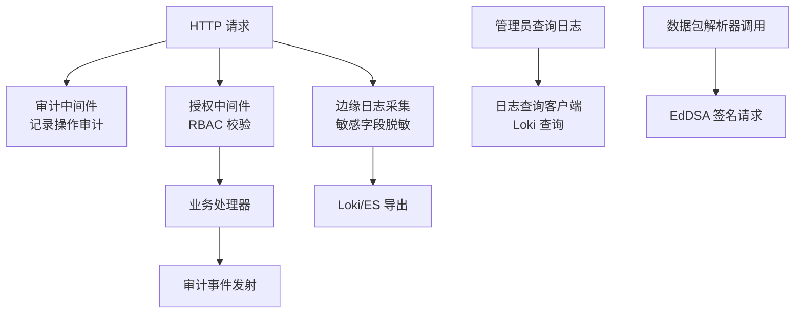
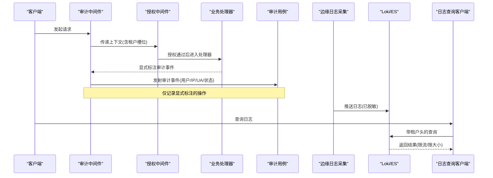
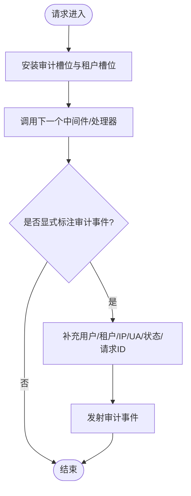
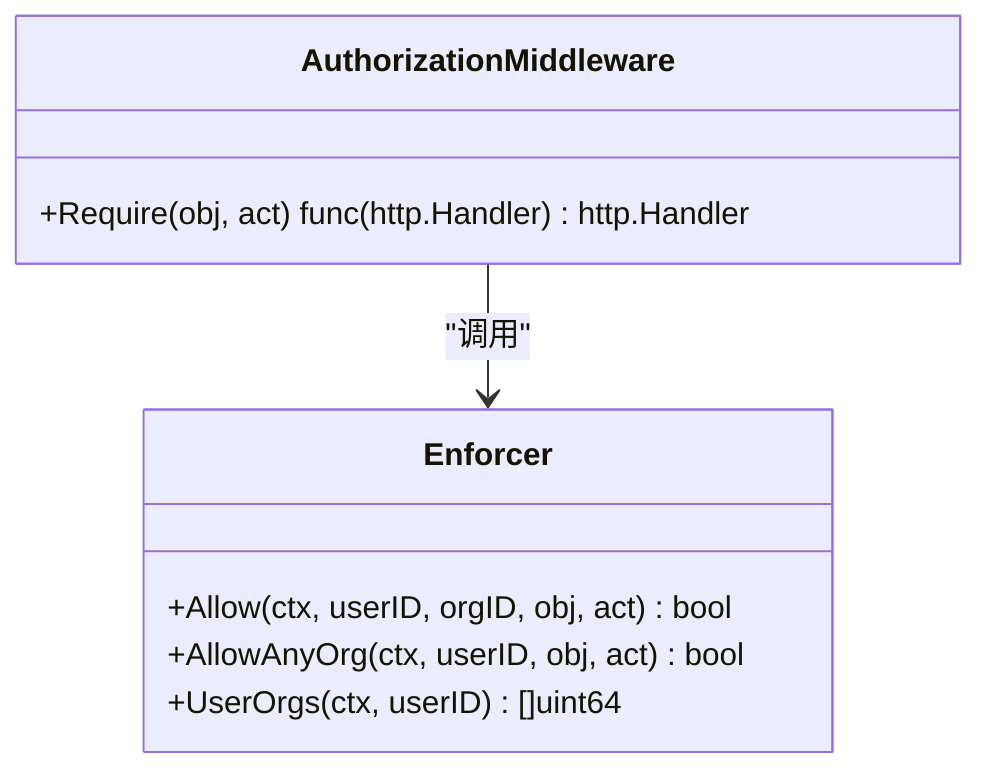
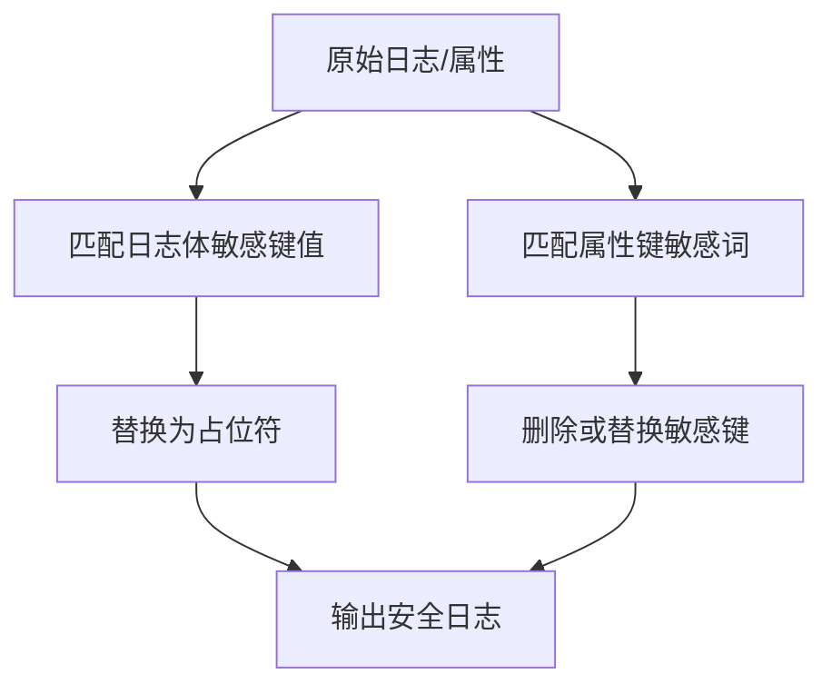
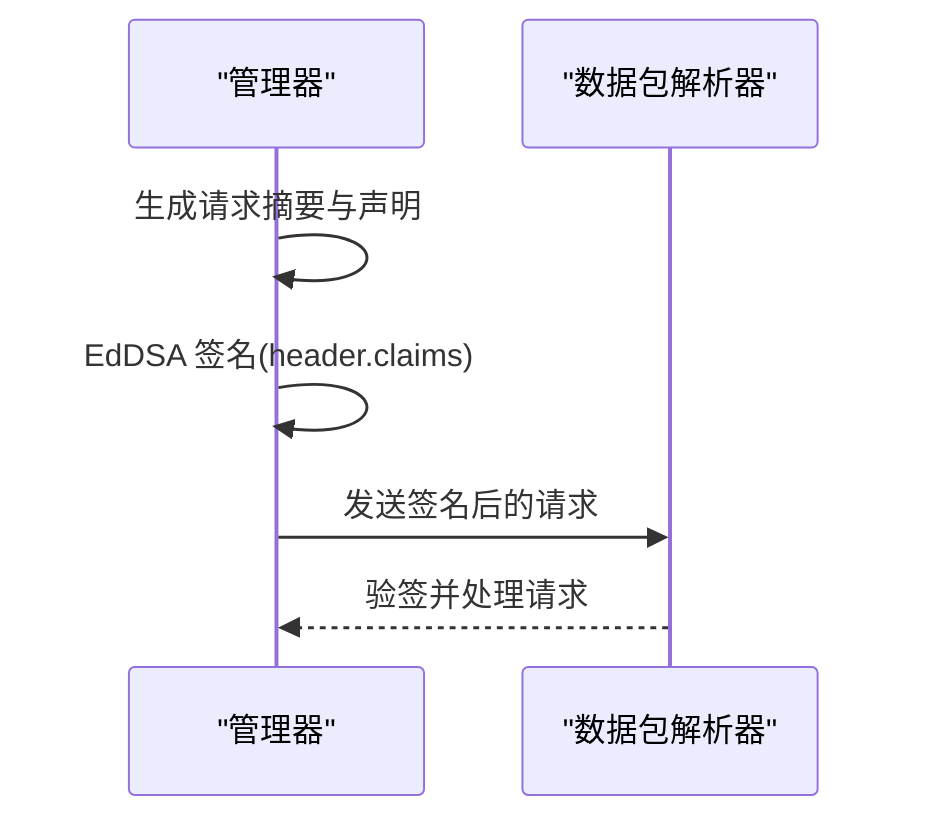
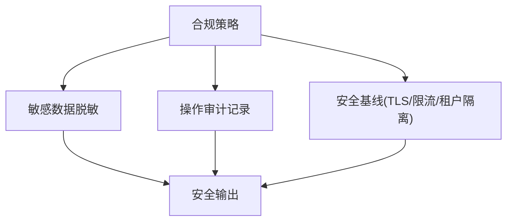
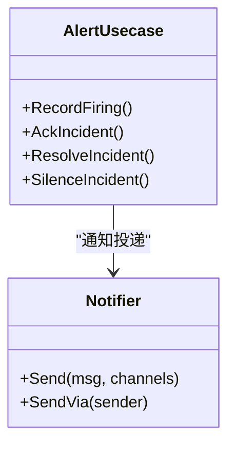
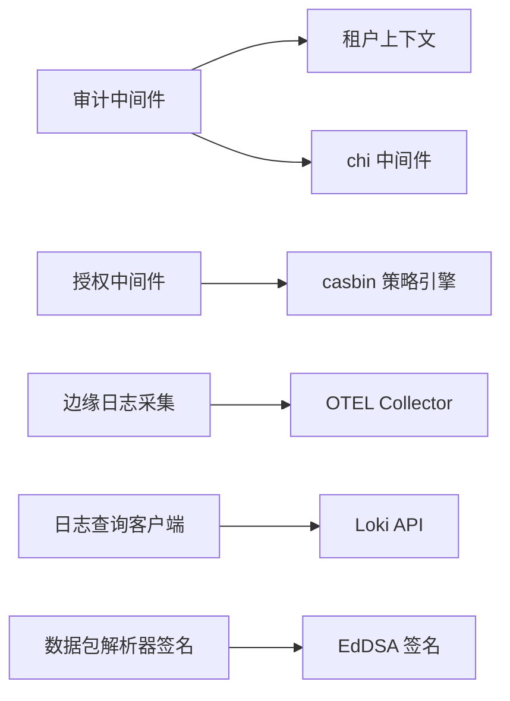

# 日志安全与审计

<cite>
**本文引用的文件**
- [internal/manager/server/middleware/audit.go](file://internal/manager/server/middleware/audit.go)
- [internal/manager/model/audit/log.go](file://internal/manager/model/audit/log.go)
- [internal/pkg/authzmw/middleware.go](file://internal/pkg/authzmw/middleware.go)
- [internal/iam/biz/authz/authz.go](file://internal/iam/biz/authz/authz.go)
- [internal/pkg/k8sredact/redact.go](file://internal/pkg/k8sredact/redact.go)
- [internal/edgeagent/plugins/logs/render_test.go](file://internal/edgeagent/plugins/logs/render_test.go)
- [internal/pkg/secretbox/secretbox.go](file://internal/pkg/secretbox/secretbox.go)
- [internal/edgeagent/config/secrets.go](file://internal/edgeagent/config/secrets.go)
- [internal/manager/biz/packetcapture/parser_client.go](file://internal/manager/biz/packetcapture/parser_client.go)
- [internal/pkg/logquery/client.go](file://internal/pkg/logquery/client.go)
- [tests/e2e/settings_reveal_test.go](file://tests/e2e/settings_reveal_test.go)
- [ROADMAP.zh-CN.md](file://ROADMAP.zh-CN.md)
</cite>

## 目录
1. [简介](#简介)
2. [项目结构](#项目结构)
3. [核心组件](#核心组件)
4. [架构总览](#架构总览)
5. [详细组件分析](#详细组件分析)
6. [依赖关系分析](#依赖关系分析)
7. [性能考量](#性能考量)
8. [故障排查指南](#故障排查指南)
9. [结论](#结论)
10. [附录](#附录)

## 简介
本指南聚焦于日志安全与审计，覆盖以下主题：
- 敏感信息脱敏机制：自动识别规则、自定义模式与动态数据过滤
- 访问控制策略：用户权限验证、资源访问控制与操作审计记录
- 日志完整性保护：数字签名、防篡改机制与传输加密
- 合规性要求：数据隐私法规、审计标准与安全基线配置
- 安全事件检测：异常行为识别、入侵检测与安全告警
- 安全配置最佳实践与常见威胁防护方案

## 项目结构
围绕日志安全与审计的关键代码分布在以下模块：
- 审计中间件与模型：负责在请求链路中捕获并持久化关键操作审计日志
- 授权中间件与策略引擎：基于角色的细粒度访问控制（RBAC）
- 边缘侧日志采集与脱敏：对日志体与属性键进行敏感字段匹配与替换
- 密钥与凭据保护：静态加密与平台原生加密存储
- 数据包解析器签名：使用 EdDSA 对出站请求进行签名以保障完整性
- 日志查询客户端：统一封装 Loki 查询接口，限制响应大小与租户隔离
- 端到端测试：验证设置项的敏感标记与值遮蔽

**图表来源**
- [internal/manager/server/middleware/audit.go:72-104](file://internal/manager/server/middleware/audit.go#L72-L104)
- [internal/pkg/authzmw/middleware.go:70-98](file://internal/pkg/authzmw/middleware.go#L70-L98)
- [internal/edgeagent/plugins/logs/render_test.go:211-241](file://internal/edgeagent/plugins/logs/render_test.go#L211-L241)
- [internal/manager/biz/packetcapture/parser_client.go:249-274](file://internal/manager/biz/packetcapture/parser_client.go#L249-L274)
- [internal/pkg/logquery/client.go:120-171](file://internal/pkg/logquery/client.go#L120-L171)

**章节来源**
- [internal/manager/server/middleware/audit.go:72-104](file://internal/manager/server/middleware/audit.go#L72-L104)
- [internal/pkg/authzmw/middleware.go:70-98](file://internal/pkg/authzmw/middleware.go#L70-L98)
- [internal/edgeagent/plugins/logs/render_test.go:211-241](file://internal/edgeagent/plugins/logs/render_test.go#L211-L241)
- [internal/manager/biz/packetcapture/parser_client.go:249-274](file://internal/manager/biz/packetcapture/parser_client.go#L249-L274)
- [internal/pkg/logquery/client.go:120-171](file://internal/pkg/logquery/client.go#L120-L171)

## 核心组件
- 审计中间件：在请求处理前后注入上下文槽位，收集用户、租户、IP、UA、请求ID、状态码等元数据，并在处理器显式标注后发射审计事件
- 授权中间件：基于 casbin 的策略引擎，提供对象/动作维度的细粒度访问控制，支持多组织域与超级用户短路
- 边缘日志脱敏：通过正则匹配日志体与结构化属性键，将敏感值替换为占位符；同时标准化级别与资源属性
- 静态加密：使用 AES-256-GCM 对凭据进行静态加密，支持版本前缀与向后兼容明文读取
- 平台加密：Edge Agent 使用 DPAPI 解密 secrets.enc 中的令牌
- 数据包解析器签名：使用 EdDSA 对请求载荷进行签名，确保请求不可篡改且可验签
- 日志查询客户端：封装 Loki 查询，限制响应大小、注入租户头、统一超时与错误处理

**章节来源**
- [internal/manager/server/middleware/audit.go:72-104](file://internal/manager/server/middleware/audit.go#L72-L104)
- [internal/pkg/authzmw/middleware.go:70-98](file://internal/pkg/authzmw/middleware.go#L70-L98)
- [internal/edgeagent/plugins/logs/render_test.go:211-241](file://internal/edgeagent/plugins/logs/render_test.go#L211-L241)
- [internal/pkg/secretbox/secretbox.go:53-75](file://internal/pkg/secretbox/secretbox.go#L53-L75)
- [internal/edgeagent/config/secrets.go:21-38](file://internal/edgeagent/config/secrets.go#L21-L38)
- [internal/manager/biz/packetcapture/parser_client.go:249-274](file://internal/manager/biz/packetcapture/parser_client.go#L249-L274)
- [internal/pkg/logquery/client.go:120-171](file://internal/pkg/logquery/client.go#L120-L171)

## 架构总览
下图展示从 HTTP 请求到审计记录、授权校验、日志采集与查询的整体流程。

**图表来源**
- [internal/manager/server/middleware/audit.go:72-104](file://internal/manager/server/middleware/audit.go#L72-L104)
- [internal/pkg/authzmw/middleware.go:70-98](file://internal/pkg/authzmw/middleware.go#L70-L98)
- [internal/edgeagent/plugins/logs/render_test.go:211-241](file://internal/edgeagent/plugins/logs/render_test.go#L211-L241)
- [internal/pkg/logquery/client.go:120-171](file://internal/pkg/logquery/client.go#L120-L171)

## 详细组件分析

### 审计中间件与审计模型
- 审计中间件在请求进入时安装可变槽位，允许下游中间件/处理器写入审计事件；在请求结束后从上下文与请求中补充用户、租户、IP、UA、请求ID、状态码等信息并发射审计事件
- 审计模型包含用户标识、邮箱、角色、IP、UA、动作、资源类型/ID/名称、状态、错误码、负载JSON、请求ID与创建时间等字段，便于检索与分析

**图表来源**
- [internal/manager/server/middleware/audit.go:72-104](file://internal/manager/server/middleware/audit.go#L72-L104)
- [internal/manager/server/middleware/audit.go:106-144](file://internal/manager/server/middleware/audit.go#L106-L144)
- [internal/manager/model/audit/log.go:33-47](file://internal/manager/model/audit/log.go#L33-L47)

**章节来源**
- [internal/manager/server/middleware/audit.go:72-104](file://internal/manager/server/middleware/audit.go#L72-L104)
- [internal/manager/server/middleware/audit.go:106-144](file://internal/manager/server/middleware/audit.go#L106-L144)
- [internal/manager/model/audit/log.go:33-47](file://internal/manager/model/audit/log.go#L33-L47)

### 访问控制策略（RBAC）
- 授权中间件包装 casbin 策略引擎，提供 Require(obj, act) 装饰器；未携带租户上下文返回未认证；超级用户短路放行；否则按对象/动作维度校验
- 策略引擎内置角色矩阵（org_admin/member/viewer/superuser），并通过成员关系同步 g 规则；支持跨组织默认域判定

**图表来源**
- [internal/pkg/authzmw/middleware.go:70-98](file://internal/pkg/authzmw/middleware.go#L70-L98)
- [internal/iam/biz/authz/authz.go:233-289](file://internal/iam/biz/authz/authz.go#L233-L289)

**章节来源**
- [internal/pkg/authzmw/middleware.go:70-98](file://internal/pkg/authzmw/middleware.go#L70-L98)
- [internal/iam/biz/authz/authz.go:233-289](file://internal/iam/biz/authz/authz.go#L233-L289)

### 敏感信息脱敏机制
- 自动识别规则：对日志体中的常见凭据片段（如 authorization、token、password 等）进行匹配替换；对 URL 中的凭据进行遮蔽
- 结构化属性键屏蔽：对包含敏感关键词的属性键进行删除或替换，避免泄露
- 动态数据过滤：在边缘侧日志管道中插入转换语句，对 body 与 resource.attributes 执行敏感匹配与清理，并规范化日志级别

**图表来源**
- [internal/pkg/k8sredact/redact.go:8-15](file://internal/pkg/k8sredact/redact.go#L8-L15)
- [internal/edgeagent/plugins/logs/render_test.go:211-241](file://internal/edgeagent/plugins/logs/render_test.go#L211-L241)
- [internal/edgeagent/plugins/logs/render_test.go:243-264](file://internal/edgeagent/plugins/logs/render_test.go#L243-L264)

**章节来源**
- [internal/pkg/k8sredact/redact.go:8-15](file://internal/pkg/k8sredact/redact.go#L8-L15)
- [internal/edgeagent/plugins/logs/render_test.go:211-241](file://internal/edgeagent/plugins/logs/render_test.go#L211-L241)
- [internal/edgeagent/plugins/logs/render_test.go:243-264](file://internal/edgeagent/plugins/logs/render_test.go#L243-L264)

### 日志完整性保护（数字签名与传输加密）
- 数据包解析器请求签名：使用 EdDSA 对请求头与声明进行签名，包含过期时间、请求摘要等，防止请求被篡改
- 传输加密：日志导出至 Loki/ES 时使用 HTTPS/TLS；查询客户端通过 HTTP 客户端与 TLS 配置保证传输安全
- 静态加密：凭据使用 AES-256-GCM 加密存储，支持版本前缀与向后兼容明文读取；Edge Agent 使用 DPAPI 解密本地加密文件

**图表来源**
- [internal/manager/biz/packetcapture/parser_client.go:249-274](file://internal/manager/biz/packetcapture/parser_client.go#L249-L274)
- [internal/pkg/secretbox/secretbox.go:53-75](file://internal/pkg/secretbox/secretbox.go#L53-L75)
- [internal/edgeagent/config/secrets.go:21-38](file://internal/edgeagent/config/secrets.go#L21-L38)

**章节来源**
- [internal/manager/biz/packetcapture/parser_client.go:249-274](file://internal/manager/biz/packetcapture/parser_client.go#L249-L274)
- [internal/pkg/secretbox/secretbox.go:53-75](file://internal/pkg/secretbox/secretbox.go#L53-L75)
- [internal/edgeagent/config/secrets.go:21-38](file://internal/edgeagent/config/secrets.go#L21-L38)

### 合规性要求
- 数据隐私：敏感字段在采集阶段即被脱敏，避免明文落入后端存储；设置项列表与返回需遮蔽敏感值
- 审计标准：审计日志记录用户、租户、资源、动作、状态与错误信息，满足可追溯性与可审计性
- 安全基线：强制 HTTPS/TLS、限制响应大小、租户隔离、最小权限原则（RBAC）、超管短路但策略引擎兜底

**章节来源**
- [tests/e2e/settings_reveal_test.go:24-68](file://tests/e2e/settings_reveal_test.go#L24-L68)
- [internal/manager/server/middleware/audit.go:106-144](file://internal/manager/server/middleware/audit.go#L106-L144)
- [internal/pkg/logquery/client.go:232-271](file://internal/pkg/logquery/client.go#L232-L271)

### 安全事件检测
- 告警模型：基于信号源与触发模式的两维分类，支持阈值、异常、变更、缺失、比率、谓词等多种触发方式
- 严重级别与路由：critical/warning/info 对应不同通知渠道与处置流程
- 抑制与分组：下游告警抑制上游告警，同维度告警合并以减少风暴
- 调查与自动化：新告警可触发 AI 调查与工作流编排，辅助根因分析与处置

**图表来源**
- [internal/manager/biz/alert/usecase.go:121-139](file://internal/manager/biz/alert/usecase.go#L121-L139)

**章节来源**
- [internal/manager/biz/alert/usecase.go:121-139](file://internal/manager/biz/alert/usecase.go#L121-L139)

### 安全配置最佳实践与常见威胁防护
- 配置最小化：仅暴露必要 API 与端口；对外部 Loki/ES 启用 TLS 与鉴权
- 敏感配置管理：使用环境变量或外部密钥管理服务；避免硬编码；定期轮换
- 访问控制：启用 RBAC；限制 per-org 策略；超管短路但保留策略兜底
- 日志安全：开启采集阶段脱敏；限制查询窗口与结果大小；租户隔离
- 完整性与机密性：对出站请求签名；传输层使用 TLS；静态数据加密
- 威胁防护：防注入（输入校验与白名单）、防越权（RBAC 与租户隔离）、防重放（签名与过期时间）、防风暴（抑制与分组）

[本节为通用指导，不直接分析具体文件]

## 依赖关系分析
- 审计中间件依赖租户上下文与 chi 中间件工具；授权中间件依赖 casbin 策略引擎；边缘日志采集依赖 OTEL Collector 配置渲染；日志查询客户端依赖 Loki API；数据包解析器依赖 EdDSA 签名库

**图表来源**
- [internal/manager/server/middleware/audit.go:72-104](file://internal/manager/server/middleware/audit.go#L72-L104)
- [internal/pkg/authzmw/middleware.go:70-98](file://internal/pkg/authzmw/middleware.go#L70-L98)
- [internal/edgeagent/plugins/logs/render_test.go:211-241](file://internal/edgeagent/plugins/logs/render_test.go#L211-L241)
- [internal/pkg/logquery/client.go:120-171](file://internal/pkg/logquery/client.go#L120-L171)
- [internal/manager/biz/packetcapture/parser_client.go:249-274](file://internal/manager/biz/packetcapture/parser_client.go#L249-L274)

**章节来源**
- [internal/manager/server/middleware/audit.go:72-104](file://internal/manager/server/middleware/audit.go#L72-L104)
- [internal/pkg/authzmw/middleware.go:70-98](file://internal/pkg/authzmw/middleware.go#L70-L98)
- [internal/edgeagent/plugins/logs/render_test.go:211-241](file://internal/edgeagent/plugins/logs/render_test.go#L211-L241)
- [internal/pkg/logquery/client.go:120-171](file://internal/pkg/logquery/client.go#L120-L171)
- [internal/manager/biz/packetcapture/parser_client.go:249-274](file://internal/manager/biz/packetcapture/parser_client.go#L249-L274)

## 性能考量
- 审计事件仅在显式标注时记录，减少无关噪音与写入开销
- 日志查询客户端限制单次响应大小为 8 MiB，避免内存压力
- 边缘侧日志管道通过队列与批处理提升吞吐，同时保持脱敏与标准化
- 授权判断走 casbin 内存策略，结合成员关系缓存，降低数据库压力

[本节为通用指导，不直接分析具体文件]

## 故障排查指南
- 审计日志缺失：确认处理器是否调用 SetAuditEvent；检查中间件链是否正确安装槽位
- 授权失败：检查租户上下文是否存在；确认 casbin 策略与成员关系是否同步；查看超管短路逻辑
- 敏感信息泄露：检查边缘侧脱敏规则是否生效；确认属性键匹配与日志体替换是否配置正确
- 查询失败：检查 Loki 可达性与租户头；确认查询窗口与限制参数；查看非 200 响应与错误信息
- 凭据解密失败：检查环境密钥是否设置；确认静态加密版本前缀；验证 DPAPI 解密路径与权限

**章节来源**
- [internal/manager/server/middleware/audit.go:72-104](file://internal/manager/server/middleware/audit.go#L72-L104)
- [internal/pkg/authzmw/middleware.go:70-98](file://internal/pkg/authzmw/middleware.go#L70-L98)
- [internal/edgeagent/plugins/logs/render_test.go:211-241](file://internal/edgeagent/plugins/logs/render_test.go#L211-L241)
- [internal/pkg/logquery/client.go:232-271](file://internal/pkg/logquery/client.go#L232-L271)
- [internal/pkg/secretbox/secretbox.go:53-75](file://internal/pkg/secretbox/secretbox.go#L53-L75)
- [internal/edgeagent/config/secrets.go:21-38](file://internal/edgeagent/config/secrets.go#L21-L38)

## 结论
本系统通过多层安全机制保障日志的安全与可审计性：
- 采集阶段敏感信息脱敏，避免明文落地
- 请求级审计记录关键操作，满足可追溯性
- RBAC 细粒度访问控制，结合租户隔离与超管短路
- 传输与静态加密、请求签名保障机密性与完整性
- 告警与调查能力支撑安全事件快速响应
建议在生产环境中严格遵循最小权限、强密码与密钥管理、TLS 强制与定期轮换、持续监控与审计等最佳实践。

[本节为总结，不直接分析具体文件]

## 附录
- 未来规划参考：包括哈希链审计日志、凭证轮换策略、TLS 证书自动轮换、PII 过滤、速率限制、静态加密扩展、合规证据包导出、异常使用检测等

**章节来源**
- [ROADMAP.zh-CN.md:458-504](file://ROADMAP.zh-CN.md#L458-L504)