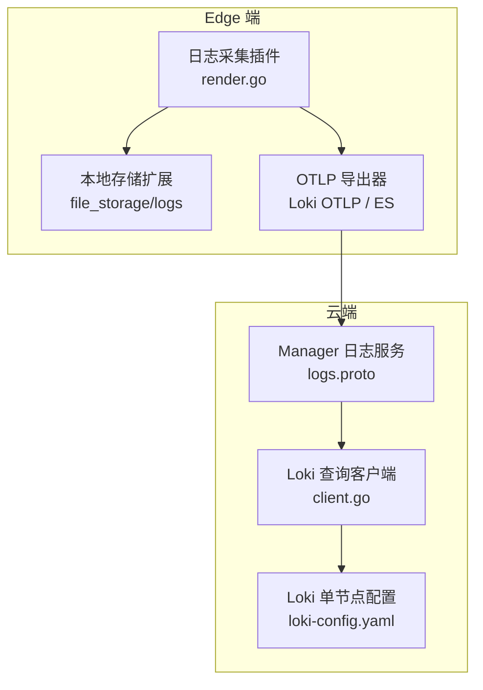
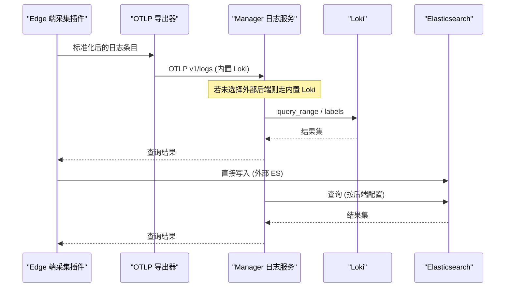
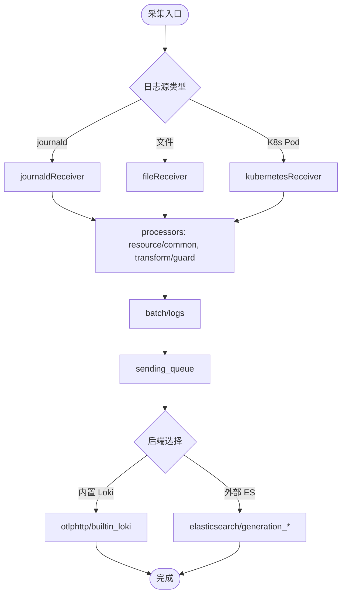
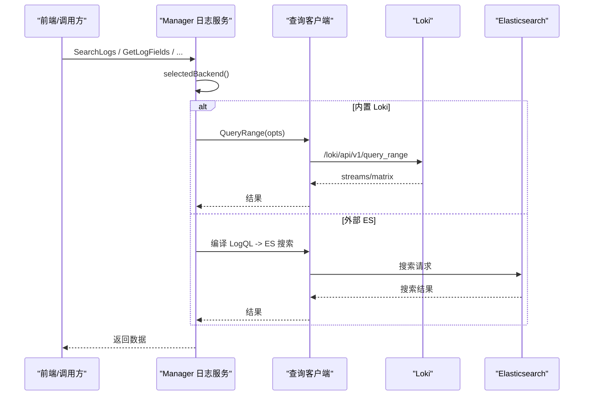
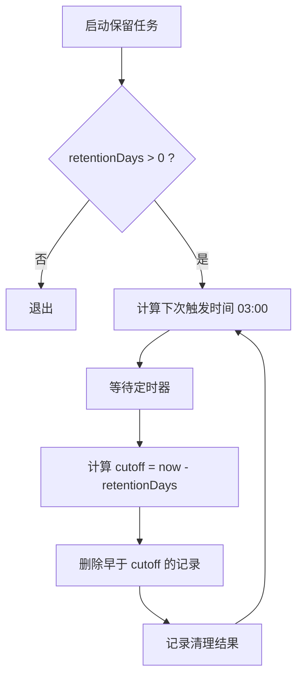
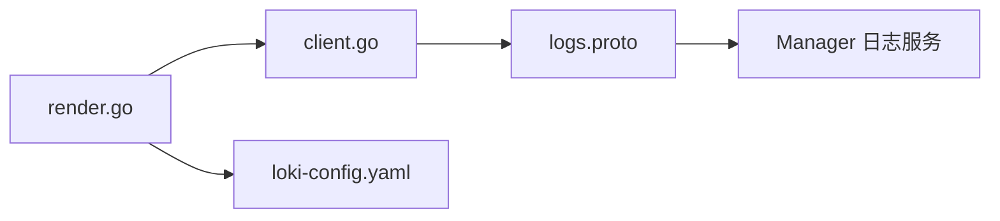

# 日志收集架构

<cite>
**本文引用的文件**
- [internal/edgeagent/plugins/logs/render.go](file://internal/edgeagent/plugins/logs/render.go)
- [deploy/install/loki-config.yaml](file://deploy/install/loki-config.yaml)
- [internal/edgeagent/config/rotation.go](file://internal/edgeagent/config/rotation.go)
- [api/manager/logs/v1/logs.proto](file://api/manager/logs/v1/logs.proto)
- [internal/pkg/logquery/client.go](file://internal/pkg/logquery/client.go)
- [internal/manager/biz/logs/query_logql.go](file://internal/manager/biz/logs/query_logql.go)
- [internal/manager/biz/knowledge/builtin_vault/systems/observability-stack/loki.md](file://internal/manager/biz/knowledge/builtin_vault/systems/observability-stack/loki.md)
- [internal/manager/biz/knowledge/diagnostics/journal-disk-full.md](file://internal/manager/biz/knowledge/diagnostics/journal-disk-full.md)
- [internal/manager/biz/audit/usecase.go](file://internal/manager/biz/audit/usecase.go)
- [tests/e2e/settings_reveal_test.go](file://tests/e2e/settings_reveal_test.go)
</cite>

## 目录
1. [简介](#简介)
2. [项目结构](#项目结构)
3. [核心组件](#核心组件)
4. [架构总览](#架构总览)
5. [详细组件分析](#详细组件分析)
6. [依赖关系分析](#依赖关系分析)
7. [性能考量](#性能考量)
8. [故障排查指南](#故障排查指南)
9. [结论](#结论)
10. [附录](#附录)

## 简介
本文件系统化梳理 Edge 端日志采集与云端日志处理的全链路架构，覆盖：
- Edge 端：文件监听、系统日志捕获（journald）、应用日志聚合、数据格式标准化与安全脱敏。
- 云端：日志接收、数据验证、字段映射、标签注入、路由分发（内置 Loki 或外部 Elasticsearch）。
- Loki 配置优化：索引、分片、压缩、查询性能调优。
- 日志轮转与保留：磁盘空间监控、历史清理规则、归档机制。
- 安全配置：访问控制、敏感信息脱敏、审计日志记录。
- 故障排查与性能优化建议。

## 项目结构
与日志收集相关的关键目录与文件：
- Edge 端日志采集插件：internal/edgeagent/plugins/logs
- 云端日志查询客户端：internal/pkg/logquery
- 云端日志服务 API 定义：api/manager/logs/v1/logs.proto
- Loki 单节点配置：deploy/install/loki-config.yaml
- 轮转策略工具：internal/edgeagent/config/rotation.go
- 运维知识文档：internal/manager/biz/knowledge/...

图表来源
- [internal/edgeagent/plugins/logs/render.go:52-251](file://internal/edgeagent/plugins/logs/render.go#L52-L251)
- [internal/pkg/logquery/client.go:120-171](file://internal/pkg/logquery/client.go#L120-L171)
- [deploy/install/loki-config.yaml:1-76](file://deploy/install/loki-config.yaml#L1-L76)
- [api/manager/logs/v1/logs.proto:9-25](file://api/manager/logs/v1/logs.proto#L9-L25)

章节来源
- [internal/edgeagent/plugins/logs/render.go:52-251](file://internal/edgeagent/plugins/logs/render.go#L52-L251)
- [internal/pkg/logquery/client.go:120-171](file://internal/pkg/logquery/client.go#L120-L171)
- [deploy/install/loki-config.yaml:1-76](file://deploy/install/loki-config.yaml#L1-L76)
- [api/manager/logs/v1/logs.proto:9-25](file://api/manager/logs/v1/logs.proto#L9-L25)

## 核心组件
- Edge 端日志采集插件：负责生成独立的 otelcol-contrib 配置，支持 journald、文件、Kubernetes Pod 日志；统一资源标签、级别检测、敏感信息脱敏、批处理与发送队列。
- 云端日志查询客户端：封装 Loki HTTP 接口，提供 QueryRange、LabelNames、LabelValues 等能力，并限制响应大小与超时。
- Manager 日志服务：暴露统一的日志搜索与管理 API，支持选择后端（内置 Loki 或外部 Elasticsearch），并在不同后端间路由查询。
- Loki 配置：单节点部署，TSDB 索引、对象存储为文件系统，启用 compactor 与 retention，设置 ingestion rate、max_global_streams_per_user 等限流与基数保护。

章节来源
- [internal/edgeagent/plugins/logs/render.go:52-251](file://internal/edgeagent/plugins/logs/render.go#L52-L251)
- [internal/pkg/logquery/client.go:120-171](file://internal/pkg/logquery/client.go#L120-L171)
- [internal/manager/biz/logs/query_logql.go:16-49](file://internal/manager/biz/logs/query_logql.go#L16-L49)
- [deploy/install/loki-config.yaml:21-60](file://deploy/install/loki-config.yaml#L21-L60)

## 架构总览
Edge 端通过 otelcol-contrib 采集多种日志源，经处理器标准化后，以 OTLP 方式推送到 Manager 的 Loki OTLP 端点或直接写入外部 Elasticsearch。云端 Manager 提供统一日志查询 API，内部根据当前选定的后端路由到 Loki 或 Elasticsearch 查询客户端。

图表来源
- [internal/edgeagent/plugins/logs/render.go:502-619](file://internal/edgeagent/plugins/logs/render.go#L502-L619)
- [internal/pkg/logquery/client.go:120-171](file://internal/pkg/logquery/client.go#L120-L171)
- [internal/manager/biz/logs/query_logql.go:16-49](file://internal/manager/biz/logs/query_logql.go#L16-L49)

## 详细组件分析

### Edge 端日志采集机制
- 日志源支持：
  - journald 系统日志：默认开启，可配置 units、directory、start_at。
  - 文件日志：支持 include/exclude 模式、JSON/正则解析、多行合并、排除旧日志。
  - Kubernetes Pod 日志：默认路径 /var/log/pods/*/*/*.log，可配置 exclude 列表。
- 数据处理流水线：
  - 资源标签注入：device_id、cluster_id、cluster_name、k8s.*、service.name、data_stream.* 等。
  - 级别检测：从 attributes/body 推断 severity_text/number，兼容多种日志格式。
  - 安全脱敏：对 body 中的敏感键值进行替换，删除匹配的属性键，限制属性数量与长度。
  - 批处理与队列：send_batch_size/send_batch_max_size、sending_queue 配置，保障吞吐与稳定性。
- 导出器：
  - 内置 Loki：OTLP v1/logs，gzip 压缩，重试策略，TLS 跳过校验开关。
  - 外部 Elasticsearch：直写 ES，API key 文件读取，mapping 模式锁定为 otel，重试策略与状态码过滤。

图表来源
- [internal/edgeagent/plugins/logs/render.go:298-388](file://internal/edgeagent/plugins/logs/render.go#L298-L388)
- [internal/edgeagent/plugins/logs/render.go:147-208](file://internal/edgeagent/plugins/logs/render.go#L147-L208)
- [internal/edgeagent/plugins/logs/render.go:502-619](file://internal/edgeagent/plugins/logs/render.go#L502-L619)

章节来源
- [internal/edgeagent/plugins/logs/render.go:89-173](file://internal/edgeagent/plugins/logs/render.go#L89-L173)
- [internal/edgeagent/plugins/logs/render.go:254-296](file://internal/edgeagent/plugins/logs/render.go#L254-L296)
- [internal/edgeagent/plugins/logs/render.go:298-388](file://internal/edgeagent/plugins/logs/render.go#L298-L388)
- [internal/edgeagent/plugins/logs/render.go:502-619](file://internal/edgeagent/plugins/logs/render.go#L502-L619)

### 云端日志接收与处理流程
- 数据验证：
  - Endpoint 合法性校验（Loki OTLP、ES HTTPS）。
  - 禁止内联敏感凭据（如 loki_authorization、elasticsearch_api_key），强制使用受管文件。
- 字段映射与标签注入：
  - 资源标签：device_id、cluster_id、cluster_name、k8s.*、service.name、data_stream.*。
  - 稳定维度：workload、pod、container、node、filename、unit。
- 路由分发：
  - 若未选择外部后端，则走内置 Loki；否则选择外部 ES 客户端。
  - 查询时根据后端类型调用对应查询客户端（Loki QueryRange 或 ES 搜索）。

图表来源
- [internal/manager/biz/logs/query_logql.go:16-49](file://internal/manager/biz/logs/query_logql.go#L16-L49)
- [internal/pkg/logquery/client.go:120-171](file://internal/pkg/logquery/client.go#L120-L171)
- [api/manager/logs/v1/logs.proto:9-25](file://api/manager/logs/v1/logs.proto#L9-L25)

章节来源
- [internal/edgeagent/plugins/logs/render.go:502-619](file://internal/edgeagent/plugins/logs/render.go#L502-L619)
- [internal/manager/biz/logs/query_logql.go:16-49](file://internal/manager/biz/logs/query_logql.go#L16-L49)
- [internal/pkg/logquery/client.go:120-171](file://internal/pkg/logquery/client.go#L120-L171)
- [api/manager/logs/v1/logs.proto:9-25](file://api/manager/logs/v1/logs.proto#L9-L25)

### Loki 配置优化策略
- 索引与分片：
  - TSDB 索引 schema v13，index prefix 与 period 配置，对象存储为 filesystem。
- 压缩算法：
  - Edge 端导出器使用 gzip 压缩传输。
- 查询性能调优：
  - ingestion_rate_mb、ingestion_burst_size_mb 控制写入速率。
  - max_global_streams_per_user 控制高基数字段风险。
  - reject_old_samples、reject_old_samples_max_age 防止过期样本堆积。
  - max_query_series、max_query_lookback 限制查询范围。
- 保留与压缩：
  - retention_period 设置为 720h（约30天），compactor 启用并配置 working_directory。

章节来源
- [deploy/install/loki-config.yaml:21-60](file://deploy/install/loki-config.yaml#L21-L60)
- [internal/edgeagent/plugins/logs/render.go:502-619](file://internal/edgeagent/plugins/logs/render.go#L502-L619)

### 日志轮转与保留策略
- Token 轮转周期：
  - clampRotationDays 将 rotationDays 钳制在 [30, 365]，默认 90 天。
- 历史日志清理：
  - 每日凌晨 3 点执行保留清理，删除早于 retentionDays 的记录，支持外部归档场景。
- 磁盘空间监控与告警：
  - 参考诊断文档定位 log flood、journald 占用过大等问题，及时 vacuum/truncate 释放空间。

图表来源
- [internal/edgeagent/config/rotation.go:12-36](file://internal/edgeagent/config/rotation.go#L12-L36)
- [internal/manager/biz/audit/usecase.go:149-183](file://internal/manager/biz/audit/usecase.go#L149-L183)

章节来源
- [internal/edgeagent/config/rotation.go:12-36](file://internal/edgeagent/config/rotation.go#L12-L36)
- [internal/manager/biz/audit/usecase.go:149-183](file://internal/manager/biz/audit/usecase.go#L149-L183)
- [internal/manager/biz/knowledge/diagnostics/journal-disk-full.md:1-50](file://internal/manager/biz/knowledge/diagnostics/journal-disk-full.md#L1-L50)

### 日志安全配置指南
- 访问控制：
  - 禁止内联敏感凭据（Loki authorization、ES API key），强制使用受管文件。
  - Manager 日志后端管理接口需管理员权限。
- 敏感信息脱敏：
  - 对 body 中常见敏感键（password、secret、api_key、authorization）进行替换。
  - 删除匹配的属性键，限制属性数量与长度，避免泄露。
- 审计日志记录：
  - 保留任务执行记录（删除行数、retention_days），便于审计与回溯。
- 测试验证：
  - 系统设置项自动标记敏感键（如 *_api_key），返回时掩码，确保不泄露明文。

章节来源
- [internal/edgeagent/plugins/logs/render.go:147-173](file://internal/edgeagent/plugins/logs/render.go#L147-L173)
- [internal/edgeagent/plugins/logs/render.go:502-619](file://internal/edgeagent/plugins/logs/render.go#L502-L619)
- [internal/manager/biz/audit/usecase.go:149-183](file://internal/manager/biz/audit/usecase.go#L149-L183)
- [tests/e2e/settings_reveal_test.go:24-68](file://tests/e2e/settings_reveal_test.go#L24-L68)

## 依赖关系分析
- Edge 端采集插件依赖：
  - otelcol-contrib 配置渲染、本地存储扩展、健康检查扩展。
  - 后端导出器：内置 Loki OTLP、外部 Elasticsearch。
- 云端依赖：
  - Manager 日志服务依赖日志查询客户端（Loki/ES）。
  - Loki 配置影响索引、保留、查询性能与基数保护。

图表来源
- [internal/edgeagent/plugins/logs/render.go:502-619](file://internal/edgeagent/plugins/logs/render.go#L502-L619)
- [internal/pkg/logquery/client.go:120-171](file://internal/pkg/logquery/client.go#L120-L171)
- [deploy/install/loki-config.yaml:21-60](file://deploy/install/loki-config.yaml#L21-L60)
- [api/manager/logs/v1/logs.proto:9-25](file://api/manager/logs/v1/logs.proto#L9-L25)

章节来源
- [internal/edgeagent/plugins/logs/render.go:502-619](file://internal/edgeagent/plugins/logs/render.go#L502-L619)
- [internal/pkg/logquery/client.go:120-171](file://internal/pkg/logquery/client.go#L120-L171)
- [deploy/install/loki-config.yaml:21-60](file://deploy/install/loki-config.yaml#L21-L60)
- [api/manager/logs/v1/logs.proto:9-25](file://api/manager/logs/v1/logs.proto#L9-L25)

## 性能考量
- 写入侧：
  - 批处理大小与超时：send_batch_size=1024、send_batch_max_size=2048、timeout=1s。
  - 发送队列：queue_size=5000、num_consumers=4、block_on_overflow=true。
  - 内存限制：memory_limiter 限制与 spike_limit 防抖。
- 查询侧：
  - 限制响应体大小（8 MiB），避免 OOM。
  - 限制查询窗口与 limit，避免大窗口全表扫描。
- Loki 侧：
  - 控制 ingestion rate 与 burst，防止写入风暴。
  - 限制 max_global_streams_per_user，降低高基数字段风险。
  - 启用 compactor 与 retention，保持索引与存储健康。

章节来源
- [internal/edgeagent/plugins/logs/render.go:174-208](file://internal/edgeagent/plugins/logs/render.go#L174-L208)
- [internal/pkg/logquery/client.go:232-271](file://internal/pkg/logquery/client.go#L232-L271)
- [deploy/install/loki-config.yaml:31-60](file://deploy/install/loki-config.yaml#L31-L60)

## 故障排查指南
- 日志洪泛与磁盘满：
  - 定位最大日志目录与 journal 占用，识别 spamming 服务。
  - 立即释放空间：journalctl --vacuum-size/time，truncate 大文件而非删除打开的文件。
- 高基数字段导致查询慢：
  - 避免将 request_id 等高基数字段作为 label，遵循 Loki 设计原则。
- 连接与认证问题：
  - 检查 Loki/ES endpoint 合法性与 TLS 配置。
  - 确认凭据文件路径与权限，禁止内联敏感信息。

章节来源
- [internal/manager/biz/knowledge/diagnostics/journal-disk-full.md:1-50](file://internal/manager/biz/knowledge/diagnostics/journal-disk-full.md#L1-L50)
- [internal/manager/biz/knowledge/builtin_vault/systems/observability-stack/loki.md:1-46](file://internal/manager/biz/knowledge/builtin_vault/systems/observability-stack/loki.md#L1-L46)
- [internal/edgeagent/plugins/logs/render.go:502-619](file://internal/edgeagent/plugins/logs/render.go#L502-L619)

## 结论
该日志收集架构通过 Edge 端 otelcol 插件实现多源采集与标准化，云端 Manager 提供统一查询与管理能力，支持内置 Loki 与外部 Elasticsearch 双后端。通过严格的输入校验、敏感信息脱敏、标签注入与限流策略，保障了安全性与性能。配合 Loki 的索引与保留策略，以及日志轮转与清理机制，形成完整的可观测性闭环。

## 附录
- 关键配置路径参考：
  - Edge 端日志插件配置渲染：internal/edgeagent/plugins/logs/render.go
  - Loki 单节点配置：deploy/install/loki-config.yaml
  - 日志查询客户端：internal/pkg/logquery/client.go
  - 日志服务 API：api/manager/logs/v1/logs.proto
  - 轮转策略工具：internal/edgeagent/config/rotation.go
  - 审计保留任务：internal/manager/biz/audit/usecase.go