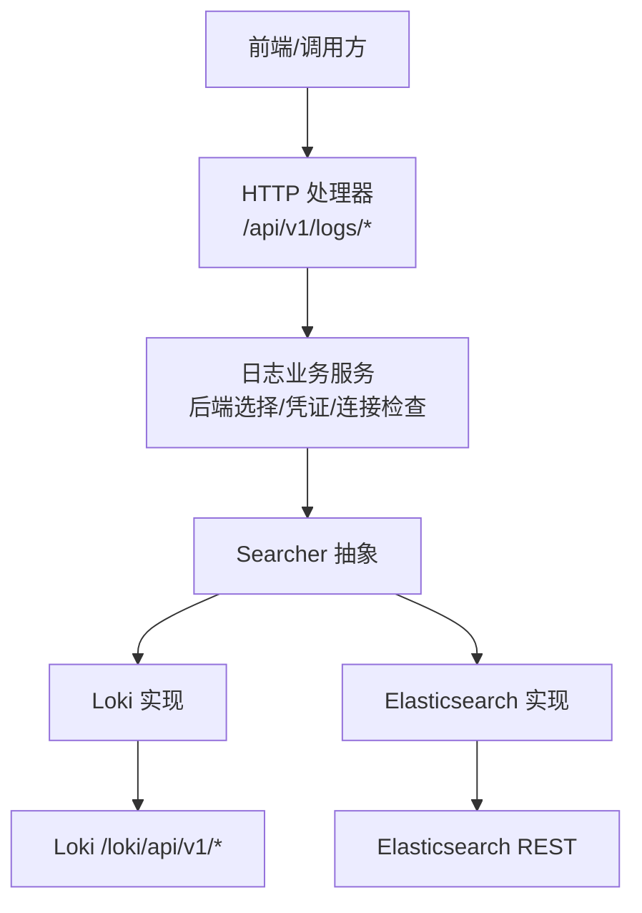
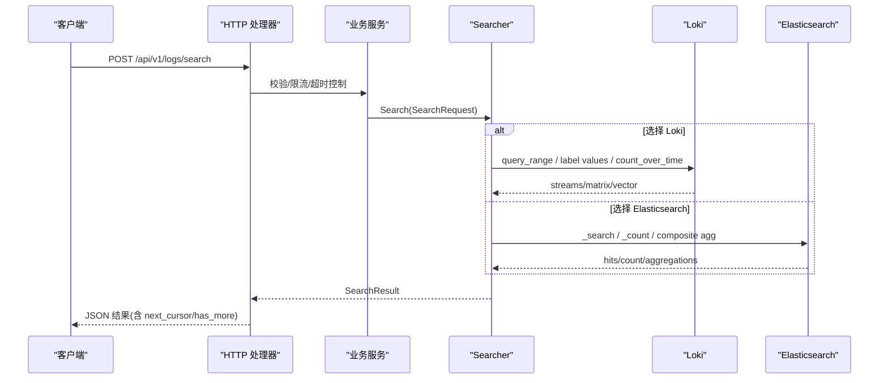
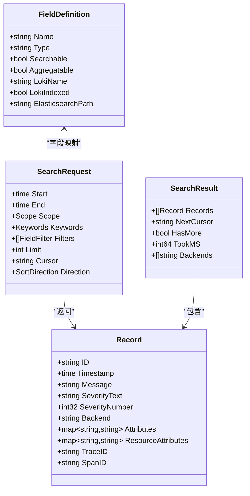
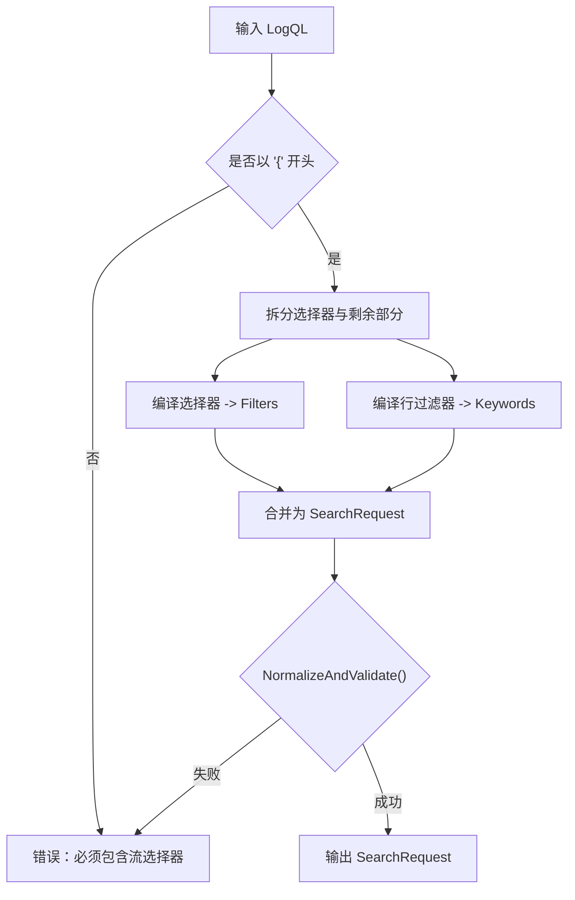
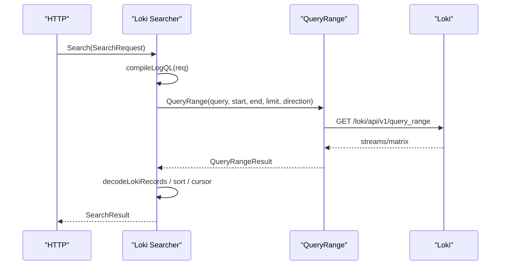
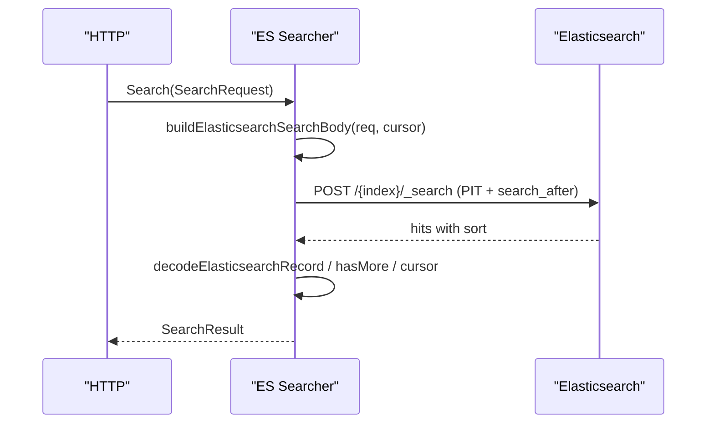
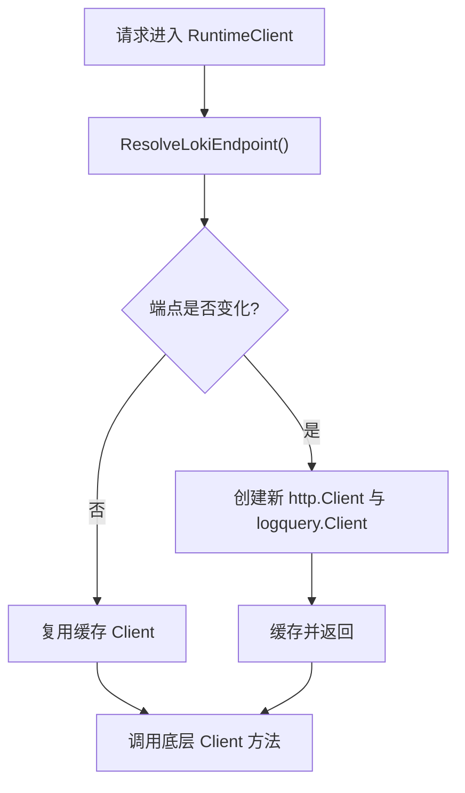
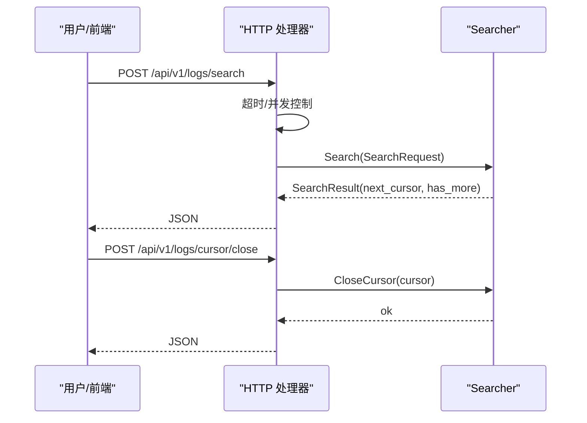
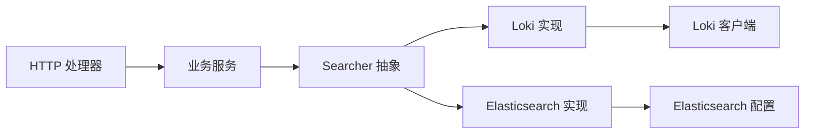

# 日志查询与分析

<cite>
**本文引用的文件**
- [search.go](file://internal/pkg/logquery/search.go)
- [logql_portable.go](file://internal/pkg/logquery/logql_portable.go)
- [client.go](file://internal/pkg/logquery/client.go)
- [loki_search.go](file://internal/pkg/logquery/loki_search.go)
- [elasticsearch.go](file://internal/pkg/logquery/elasticsearch.go)
- [runtime_client.go](file://internal/pkg/logquery/runtime_client.go)
- [level.go](file://internal/pkg/logquery/level.go)
- [http.go](file://internal/manager/server/logs/http.go)
- [service.go](file://internal/manager/biz/logs/service.go)
</cite>

## 目录
1. [简介](#简介)
2. [项目结构](#项目结构)
3. [核心组件](#核心组件)
4. [架构总览](#架构总览)
5. [详细组件分析](#详细组件分析)
6. [依赖关系分析](#依赖关系分析)
7. [性能与优化](#性能与优化)
8. [故障排查指南](#故障排查指南)
9. [结论](#结论)
10. [附录：常用查询场景与最佳实践](#附录：常用查询场景与最佳实践)

## 简介
本指南面向日志查询与分析的使用者与开发者，系统性说明后端提供的日志查询能力、LogQL 子集编译、后端无关的搜索接口、实时与分页机制、统计与趋势分析、可视化对接方式以及性能优化建议。系统同时支持 Loki 与 Elasticsearch 两种后端，并通过统一的 Searcher 抽象对外暴露一致的查询语义。

## 项目结构
- 查询协议与数据模型：定义统一请求/响应结构、字段白名单、游标与聚合桶等。
- 后端实现：Loki 与 Elasticsearch 的具体查询、计数、直方图、字段值枚举等。
- 运行时客户端：动态解析 Loki 端点、复用 HTTP 连接、支持 Basic Auth 与 TLS。
- HTTP 服务层：提供结构化日志搜索、直方图、上下文日志、标签与值查询、后端管理等 REST 接口。
- 业务编排：后端选择、凭证管理、连接检查、Grafana 同步等。

图表来源
- [http.go:100-118](file://internal/manager/server/logs/http.go#L100-L118)
- [service.go:230-265](file://internal/manager/biz/logs/service.go#L230-L265)
- [loki_search.go:31-118](file://internal/pkg/logquery/loki_search.go#L31-L118)
- [elasticsearch.go:88-175](file://internal/pkg/logquery/elasticsearch.go#L88-L175)

章节来源
- [http.go:100-118](file://internal/manager/server/logs/http.go#L100-L118)
- [service.go:230-265](file://internal/manager/biz/logs/service.go#L230-L265)

## 核心组件
- 统一搜索接口 Searcher：封装 Search、Count、Histogram、Fields、FieldValues、CountGrouped 等方法，屏蔽后端差异。
- 请求与模型：SearchRequest、Record、SearchResult、Scope、Keywords、FieldFilter、HistogramBucket 等。
- LogQL 编译器：将受限 LogQL（流选择器 + 行过滤器）编译为后端无关的 SearchRequest。
- 后端客户端：
  - Loki：基于 QueryRange、LabelNames、LabelValues 构建查询；支持 count_over_time 与直方图。
  - Elasticsearch：基于 _search、_count、composite aggregation、date_histogram 实现一致语义。
- 运行时客户端 RuntimeClient：按当前配置动态解析 Loki 端点并缓存 HTTP 客户端。
- HTTP 处理器：提供结构化搜索、直方图、上下文日志、字段与值查询、后端管理等路由。

章节来源
- [search.go:78-152](file://internal/pkg/logquery/search.go#L78-L152)
- [logql_portable.go:21-84](file://internal/pkg/logquery/logql_portable.go#L21-L84)
- [client.go:120-171](file://internal/pkg/logquery/client.go#L120-L171)
- [loki_search.go:31-118](file://internal/pkg/logquery/loki_search.go#L31-L118)
- [elasticsearch.go:88-175](file://internal/pkg/logquery/elasticsearch.go#L88-L175)
- [runtime_client.go:53-83](file://internal/pkg/logquery/runtime_client.go#L53-L83)
- [http.go:310-332](file://internal/manager/server/logs/http.go#L310-L332)

## 架构总览
系统通过 HTTP 层接收查询请求，交由业务服务选择后端，再调用 Searcher 抽象执行具体后端逻辑。Loki 路径直接调用其原生 API；Elasticsearch 路径使用固定索引模式与受控 DSL。所有查询均遵循统一的数据边界与分页约定。

图表来源
- [http.go:310-332](file://internal/manager/server/logs/http.go#L310-L332)
- [loki_search.go:31-118](file://internal/pkg/logquery/loki_search.go#L31-L118)
- [elasticsearch.go:88-175](file://internal/pkg/logquery/elasticsearch.go#L88-L175)

## 详细组件分析

### 统一搜索接口与数据模型
- SearchRequest：包含时间窗口、范围过滤 Scope、关键词 Keywords、字段过滤 Filters、分页 Limit/Cursor、方向 Direction。
- Record/SearchResult：记录包含 ID、时间戳、消息、严重级别、后端标识、属性、资源属性、Trace/Span 关联；结果包含下一页游标、是否还有更多、耗时与后端列表。
- 字段白名单与映射：LookupField/AllowedFields 限定可查询与聚合字段，并提供 Loki 名称与 Elasticsearch 路径映射。
- 游标与关闭：CursorCloser 用于释放后端侧状态（如 Elasticsearch PIT）。

图表来源
- [search.go:78-152](file://internal/pkg/logquery/search.go#L78-L152)
- [search.go:243-251](file://internal/pkg/logquery/search.go#L243-L251)
- [search.go:368-420](file://internal/pkg/logquery/search.go#L368-L420)

章节来源
- [search.go:78-152](file://internal/pkg/logquery/search.go#L78-L152)
- [search.go:243-251](file://internal/pkg/logquery/search.go#L243-L251)
- [search.go:368-420](file://internal/pkg/logquery/search.go#L368-L420)

### LogQL 子集编译
- 支持的语法：以花括号开头的流选择器，支持 =、!=、=~、!~ 匹配器；行过滤器 |=、!=、|~、!~；正则仅允许字面量交替。
- 编译目标：将 LogQL 转换为后端无关的 SearchRequest（Filters + Keywords），限制 limit 与方向，并进行规范化与校验。
- 安全约束：拒绝解析阶段、unwrap、指标表达式等非兼容特性；对大小写不敏感或负向前缀等仅在 Loki 可用。

图表来源
- [logql_portable.go:21-84](file://internal/pkg/logquery/logql_portable.go#L21-L84)
- [logql_portable.go:86-174](file://internal/pkg/logquery/logql_portable.go#L86-L174)
- [logql_portable.go:262-320](file://internal/pkg/logquery/logql_portable.go#L262-L320)

章节来源
- [logql_portable.go:21-84](file://internal/pkg/logquery/logql_portable.go#L21-L84)
- [logql_portable.go:86-174](file://internal/pkg/logquery/logql_portable.go#L86-L174)
- [logql_portable.go:262-320](file://internal/pkg/logquery/logql_portable.go#L262-L320)

### Loki 后端实现
- 搜索：将 SearchRequest 编译为 LogQL 查询，调用 query_range，解码 streams 为 Record，排序并处理游标分页。
- 计数：使用 count_over_time 在区间末尾进行瞬时查询，避免重叠计数。
- 分组计数：通过 sum by 保留产品维度标签，限制桶数量。
- 直方图：使用 count_over_time 配合 step 生成时间桶，并对对齐与偏移进行处理。
- 字段值：优先走 LabelValues，否则扫描搜索结果去重。

图表来源
- [loki_search.go:31-118](file://internal/pkg/logquery/loki_search.go#L31-L118)
- [loki_search.go:390-526](file://internal/pkg/logquery/loki_search.go#L390-L526)
- [client.go:120-171](file://internal/pkg/logquery/client.go#L120-L171)

章节来源
- [loki_search.go:31-118](file://internal/pkg/logquery/loki_search.go#L31-L118)
- [loki_search.go:390-526](file://internal/pkg/logquery/loki_search.go#L390-L526)
- [client.go:120-171](file://internal/pkg/logquery/client.go#L120-L171)

### Elasticsearch 后端实现
- 搜索：使用固定索引模式与受控 DSL，PIT 维持一致性，search_after 分页，限制响应体大小。
- 计数：_count API 与相同过滤条件。
- 分组计数：composite aggregation 分页遍历，限制桶数。
- 直方图：date_histogram 固定间隔，extended/hard bounds 控制边界。
- 字段值：terms aggregation 获取前 N 个值。

图表来源
- [elasticsearch.go:88-175](file://internal/pkg/logquery/elasticsearch.go#L88-L175)
- [elasticsearch.go:553-591](file://internal/pkg/logquery/elasticsearch.go#L553-L591)
- [elasticsearch.go:593-669](file://internal/pkg/logquery/elasticsearch.go#L593-L669)

章节来源
- [elasticsearch.go:88-175](file://internal/pkg/logquery/elasticsearch.go#L88-L175)
- [elasticsearch.go:553-591](file://internal/pkg/logquery/elasticsearch.go#L553-L591)
- [elasticsearch.go:593-669](file://internal/pkg/logquery/elasticsearch.go#L593-L669)

### 运行时客户端与连接管理
- RuntimeClient：每次调用前解析 Loki 端点，若变化则重建 HTTP 客户端并复用连接；支持 Basic Auth 与 TLS 跳过验证（测试环境）。
- 连接管理：Loki 游标无服务端状态；Elasticsearch 游标携带 PIT，需显式 CloseCursor 释放。

图表来源
- [runtime_client.go:53-83](file://internal/pkg/logquery/runtime_client.go#L53-L83)
- [runtime_client.go:99-116](file://internal/pkg/logquery/runtime_client.go#L99-L116)

章节来源
- [runtime_client.go:53-83](file://internal/pkg/logquery/runtime_client.go#L53-L83)
- [runtime_client.go:99-116](file://internal/pkg/logquery/runtime_client.go#L99-L116)

### HTTP 服务与实时/增量查询
- 结构化搜索：POST /api/v1/logs/search，返回 next_cursor 与 has_more，支持前后向排序。
- 游标关闭：POST /api/v1/logs/cursor/close，释放后端侧资源（如 ES PIT）。
- 直方图：POST /api/v1/logs/histogram，按 interval 聚合。
- 上下文日志：POST /api/v1/logs/context，围绕指定时间戳读取前后若干条。
- 标签与值：GET /api/v1/logs/labels 与 /api/v1/logs/labels/{name}/values。
- 限流与超时：并发槽位限制与重试头，避免过载。

图表来源
- [http.go:310-355](file://internal/manager/server/logs/http.go#L310-L355)
- [http.go:451-482](file://internal/manager/server/logs/http.go#L451-L482)
- [http.go:484-546](file://internal/manager/server/logs/http.go#L484-L546)

章节来源
- [http.go:310-355](file://internal/manager/server/logs/http.go#L310-L355)
- [http.go:451-482](file://internal/manager/server/logs/http.go#L451-L482)
- [http.go:484-546](file://internal/manager/server/logs/http.go#L484-L546)

### 日志级别与严重性
- 标准化：normalizeLevel 将多种表示归一为 info/warn/error/critical/fatal 等。
- 检测：detectLevel 从 JSON 或文本中推断级别；severityNumberForLevel 映射数值。
- 后端适配：Loki/Elasticsearch 解码时优先取标准字段，否则回退到文本推断。

章节来源
- [level.go:14-47](file://internal/pkg/logquery/level.go#L14-L47)
- [level.go:69-87](file://internal/pkg/logquery/level.go#L69-L87)
- [loki_search.go:625-640](file://internal/pkg/logquery/loki_search.go#L625-L640)
- [elasticsearch.go:744-770](file://internal/pkg/logquery/elasticsearch.go#L744-L770)

## 依赖关系分析
- HTTP 处理器依赖业务服务与 Searcher 抽象；业务服务负责后端选择、凭证与连接检查。
- Searcher 抽象由 Loki 与 Elasticsearch 实现；两者均依赖统一的数据模型与字段映射。
- RuntimeClient 解耦 Loki 端点配置变更，保证热更新。

图表来源
- [http.go:100-118](file://internal/manager/server/logs/http.go#L100-L118)
- [service.go:230-265](file://internal/manager/biz/logs/service.go#L230-L265)
- [client.go:120-171](file://internal/pkg/logquery/client.go#L120-L171)
- [elasticsearch.go:33-49](file://internal/pkg/logquery/elasticsearch.go#L33-L49)

章节来源
- [http.go:100-118](file://internal/manager/server/logs/http.go#L100-L118)
- [service.go:230-265](file://internal/manager/biz/logs/service.go#L230-L265)
- [client.go:120-171](file://internal/pkg/logquery/client.go#L120-L171)
- [elasticsearch.go:33-49](file://internal/pkg/logquery/elasticsearch.go#L33-L49)

## 性能与优化
- 索引与匹配器：
  - Loki：优先使用已索引标签作为流选择器；非索引字段转为行过滤器。
  - Elasticsearch：使用 term/terms/prefix/exists 等高效过滤；避免任意 DSL。
- 查询限制：
  - 最大时间窗口、limit、关键词与过滤器数量、scope 值数量均有上限，防止滥用。
- 分页与游标：
  - Loki：基于时间戳与 skip 的游标；Elasticsearch：search_after + PIT。
  - 未使用的游标应主动关闭以释放服务端资源。
- 直方图与计数：
  - 使用 count_over_time 与 date_histogram 减少全量扫描；合理设置 interval。
- 并发与超时：
  - HTTP 层限制并发结构化搜索次数，超时保护，避免雪崩。

章节来源
- [search.go:13-22](file://internal/pkg/logquery/search.go#L13-L22)
- [search.go:257-338](file://internal/pkg/logquery/search.go#L257-L338)
- [loki_search.go:390-526](file://internal/pkg/logquery/loki_search.go#L390-L526)
- [elasticsearch.go:553-591](file://internal/pkg/logquery/elasticsearch.go#L553-L591)
- [http.go:357-397](file://internal/manager/server/logs/http.go#L357-L397)

## 故障排查指南
- 常见错误码与提示：
  - LOG_QUERY_INVALID：参数非法、字段不允许、游标无效、超出限制等。
  - LOG_QUERY_TIMEOUT：查询超时。
  - LOG_BACKEND_ERROR：后端请求失败。
  - LOG_BACKEND_DISABLED：后端未启用或未配置。
- 定位步骤：
  - 检查时间窗口、limit、direction、keywords/filters 是否合法。
  - 确认所选后端是否可用（Loki 或 Elasticsearch）。
  - 对于 Elasticsearch，确认 PIT 是否被正确关闭。
  - 查看后端版本与权限（Elasticsearch 要求 8.16+，API Key 权限）。
- 日志级别异常：
  - 若无法识别级别，系统将尝试从消息文本推断；必要时调整采集格式。

章节来源
- [http.go:731-748](file://internal/manager/server/logs/http.go#L731-L748)
- [elasticsearch.go:435-458](file://internal/pkg/logquery/elasticsearch.go#L435-L458)
- [level.go:32-47](file://internal/pkg/logquery/level.go#L32-L47)

## 结论
本系统通过统一的 Searcher 抽象与严格的请求校验，提供了跨后端的日志查询与分析能力。借助受限但安全的 LogQL 编译、稳定的分页与游标机制、高效的统计与直方图计算，以及与 Grafana 的集成，能够满足日常运维与告警需求。结合合理的索引使用、查询限制与并发控制，可在高负载下保持稳定与高性能。

## 附录：常用查询场景与最佳实践
- 流选择器与过滤器
  - 使用已索引标签缩小范围（如 device_id、namespace、pod、container、service_name、source_id、level、file、unit）。
  - 关键词匹配：包含/排除、短语匹配、字面量正则交替。
  - 字段过滤：等于、不等于、存在、前缀、多值。
- 实时与增量
  - 使用 next_cursor 与 has_more 实现翻页；向后/向前排序。
  - 及时关闭游标以释放后端资源（尤其是 Elasticsearch PIT）。
- 统计与趋势
  - Count/CountGrouped：精确计数与分组计数，适合告警与阈值判断。
  - Histogram：按固定间隔聚合，观察趋势与峰值。
- 可视化对接
  - 直方图数据可直接用于折线图/柱状图。
  - 字段值可用于下拉筛选器与自动补全。
  - 时间范围选择：严格遵循 MaxSearchWindow 限制。
- 导出与对比
  - 通过 limit 控制单次导出量；结合 cursor 分页拉取完整数据集。
  - 多指标对比：分别发起多个直方图或分组计数请求，前端组合展示。
- 性能建议
  - 尽量使用索引标签过滤；避免宽泛的正则。
  - 合理设置 limit 与 interval；避免过大时间窗口。
  - 利用并发限制与超时保护，避免压垮后端。

章节来源
- [search.go:78-152](file://internal/pkg/logquery/search.go#L78-L152)
- [search.go:257-338](file://internal/pkg/logquery/search.go#L257-L338)
- [logql_portable.go:21-84](file://internal/pkg/logquery/logql_portable.go#L21-L84)
- [loki_search.go:31-118](file://internal/pkg/logquery/loki_search.go#L31-L118)
- [elasticsearch.go:88-175](file://internal/pkg/logquery/elasticsearch.go#L88-L175)
- [http.go:310-355](file://internal/manager/server/logs/http.go#L310-L355)
- [http.go:451-482](file://internal/manager/server/logs/http.go#L451-L482)