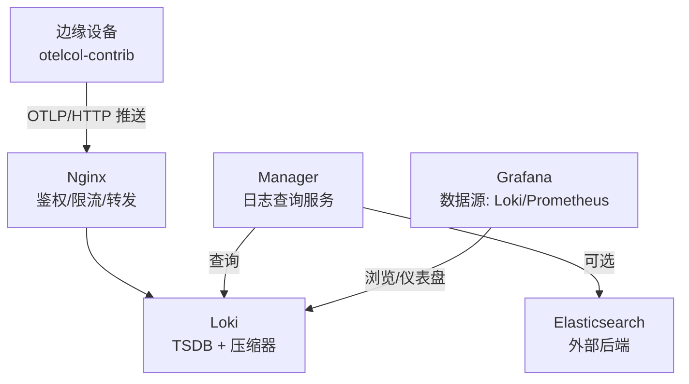
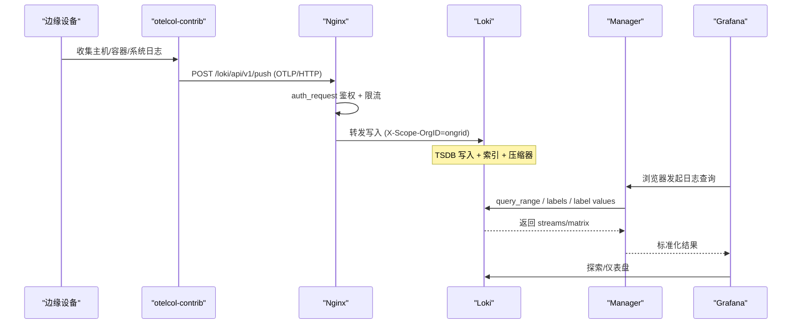
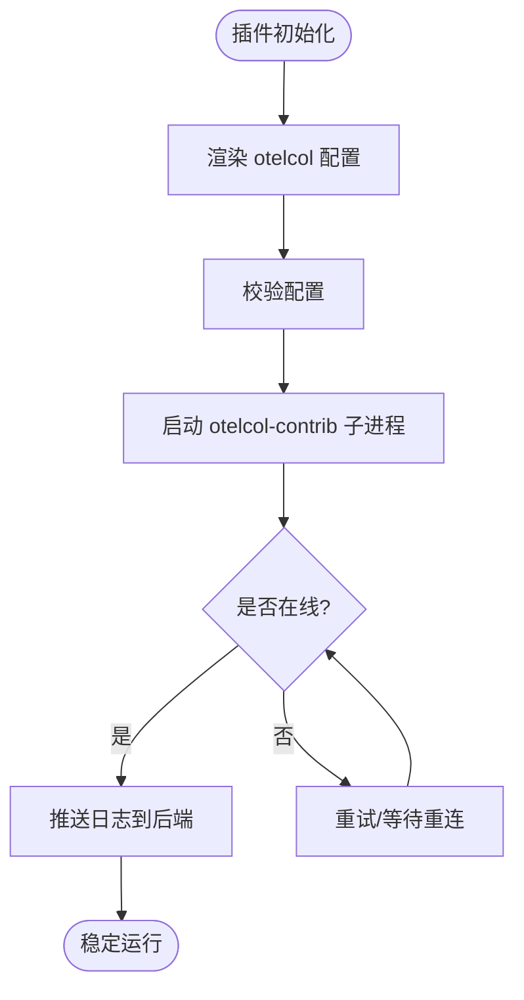
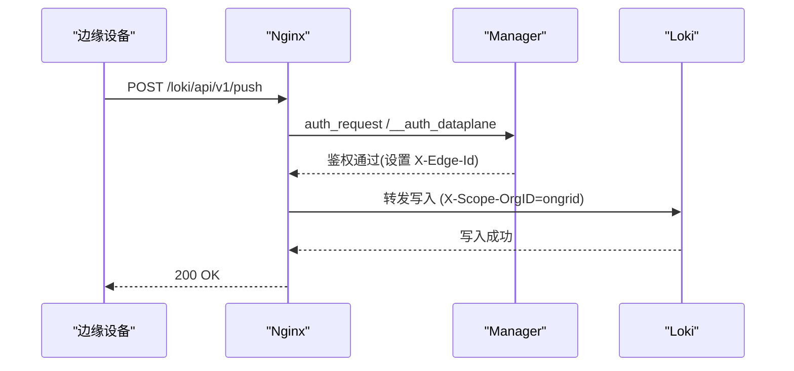
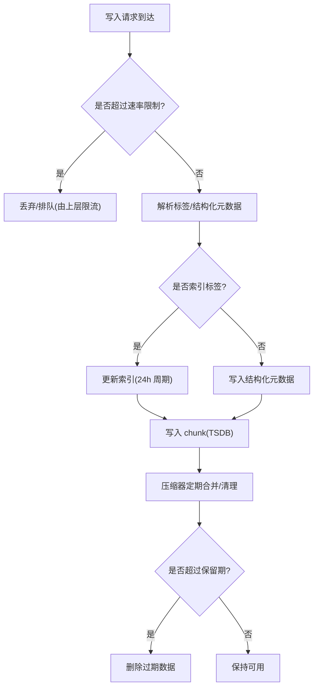
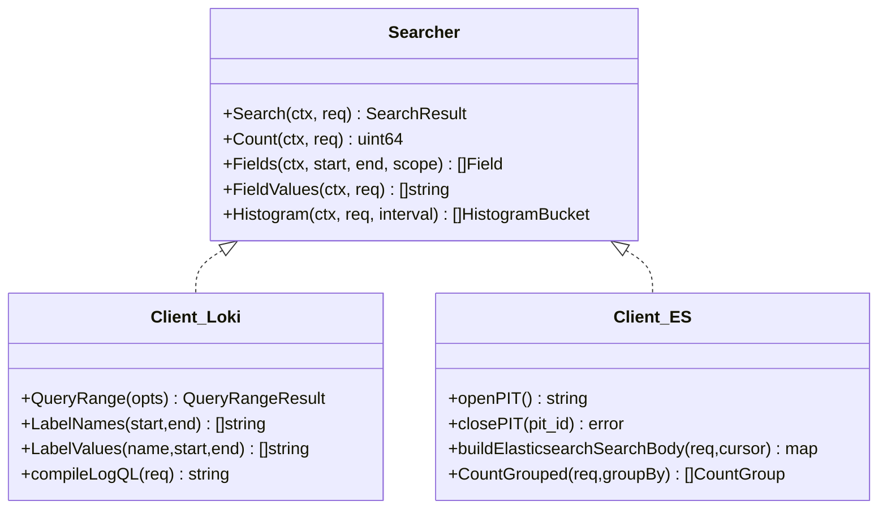
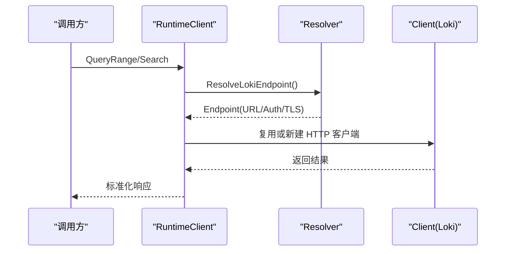
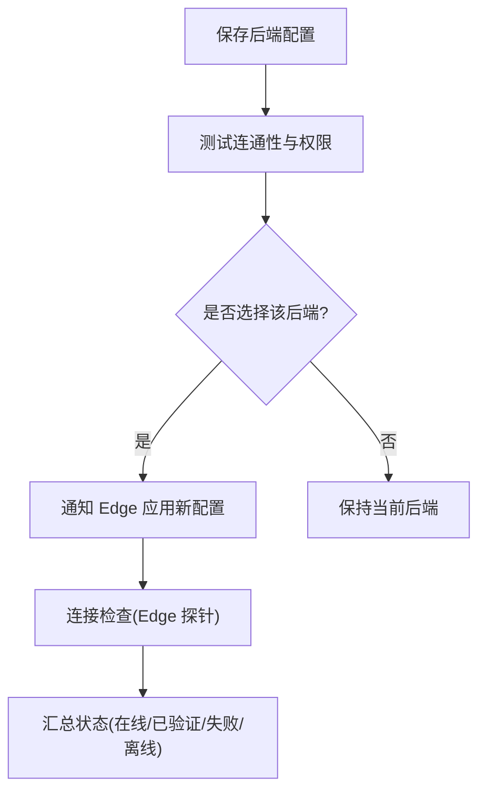
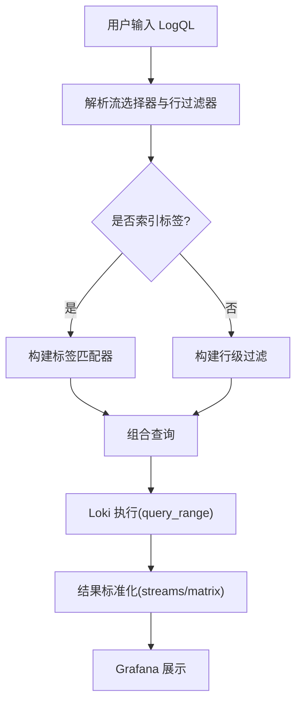
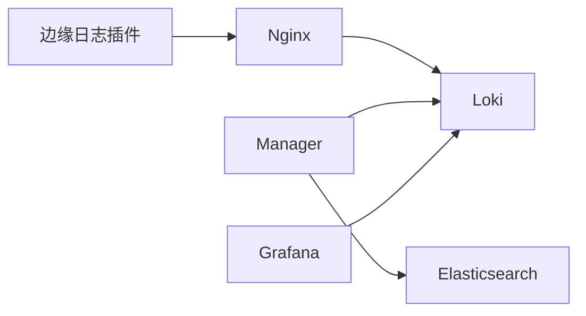

# 日志管理

<cite>
**本文引用的文件**
- [deploy/install/loki-config.yaml](file://deploy/install/loki-config.yaml)
- [deploy/install/docker-compose.yml](file://deploy/install/docker-compose.yml)
- [deploy/install/nginx.conf](file://deploy/install/nginx.conf)
- [internal/pkg/logquery/client.go](file://internal/pkg/logquery/client.go)
- [internal/pkg/logquery/loki_search.go](file://internal/pkg/logquery/loki_search.go)
- [internal/pkg/logquery/elasticsearch.go](file://internal/pkg/logquery/elasticsearch.go)
- [internal/pkg/logquery/search.go](file://internal/pkg/logquery/search.go)
- [internal/pkg/logquery/logql_portable.go](file://internal/pkg/logquery/logql_portable.go)
- [internal/pkg/logquery/runtime_client.go](file://internal/pkg/logquery/runtime_client.go)
- [api/manager/logs/v1/logs.proto](file://api/manager/logs/v1/logs.proto)
- [internal/manager/biz/logs/service.go](file://internal/manager/biz/logs/service.go)
- [internal/edgeagent/plugins/logs/plugin.go](file://internal/edgeagent/plugins/logs/plugin.go)
</cite>

## 目录
1. [简介](#简介)
2. [项目结构](#项目结构)
3. [核心组件](#核心组件)
4. [架构总览](#架构总览)
5. [详细组件分析](#详细组件分析)
6. [依赖关系分析](#依赖关系分析)
7. [性能与容量规划](#性能与容量规划)
8. [故障排查指南](#故障排查指南)
9. [结论](#结论)
10. [附录](#附录)

## 简介
本指南面向在 ongrid 平台中部署和运维日志系统的工程师，覆盖从 Edge 端采集、云端聚合存储到查询分析与安全治理的全链路。重点包括：
- 日志采集架构：Edge 侧通过 OpenTelemetry Collector 子进程将日志推送到内置 Loki 或外部 Elasticsearch；云端通过 Nginx 统一入口进行鉴权与限流后写入后端。
- Loki 配置优化：索引分片周期、保留策略、压缩与查询限制等。
- 轮转与保留：Loki 压缩器与保留期、历史清理与归档建议。
- 查询与分析：LogQL 语法、过滤器、聚合与可视化（Grafana）。
- 安全配置：访问控制、敏感信息脱敏与审计。
- 故障排查与性能调优：常见问题定位与优化建议。

## 项目结构
- 边缘侧插件：Edge 上的 logs 插件以 otelcol-contrib 子进程形式运行，根据管理器下发的配置渲染并启动，直接推送日志到后端。
- 云端网关：Nginx 负责 TLS 终止、数据面鉴权、速率限制与反向代理，将日志写入内部 Loki。
- 云端存储：Loki 单节点部署，使用文件系统 TSDB，开启压缩器与保留策略。
- 云端查询：Manager 提供后端无关的日志查询接口，底层可路由到内置 Loki 或外部 Elasticsearch。
- 可视化：Grafana 预置数据源，支持对 Loki 的探索与仪表盘展示。

**图表来源**
- [deploy/install/nginx.conf:159-209](file://deploy/install/nginx.conf#L159-L209)
- [deploy/install/docker-compose.yml:383-402](file://deploy/install/docker-compose.yml#L383-L402)
- [internal/edgeagent/plugins/logs/plugin.go:1-42](file://internal/edgeagent/plugins/logs/plugin.go#L1-L42)
- [internal/pkg/logquery/client.go:1-120](file://internal/pkg/logquery/client.go#L1-L120)

**章节来源**
- [internal/edgeagent/plugins/logs/plugin.go:1-42](file://internal/edgeagent/plugins/logs/plugin.go#L1-L42)
- [deploy/install/nginx.conf:159-209](file://deploy/install/nginx.conf#L159-L209)
- [deploy/install/docker-compose.yml:383-402](file://deploy/install/docker-compose.yml#L383-L402)

## 核心组件
- 边缘日志插件：封装 otelcol-contrib，按管理器下发的配置渲染并启动，支持直写内置 Loki 或外部 Elasticsearch。
- 云端网关：Nginx 暴露 /loki/api/v1/push 与 OTLP 日志入口，强制鉴权与限流，透传 X-Scope-OrgID 至 Loki。
- Loki 存储：单节点 TSDB，schema v13，索引前缀与周期配置，启用压缩器与保留策略。
- 查询客户端：Manager 侧提供后端无关的 Searcher 接口，实现 Loki 与 Elasticsearch 两种后端，支持分页游标、计数、分组统计与直方图。
- 协议定义：logs.proto 定义了搜索、字段、直方图、后端选择与连接检查等 RPC。

**章节来源**
- [internal/edgeagent/plugins/logs/plugin.go:1-42](file://internal/edgeagent/plugins/logs/plugin.go#L1-L42)
- [deploy/install/nginx.conf:159-209](file://deploy/install/nginx.conf#L159-L209)
- [deploy/install/loki-config.yaml:1-76](file://deploy/install/loki-config.yaml#L1-L76)
- [internal/pkg/logquery/search.go:13-159](file://internal/pkg/logquery/search.go#L13-L159)
- [api/manager/logs/v1/logs.proto:9-25](file://api/manager/logs/v1/logs.proto#L9-L25)

## 架构总览
下图展示了日志从 Edge 到云端再到查询与可视化的完整流程，以及 Manager 在后端选择与查询路由中的角色。

**图表来源**
- [deploy/install/nginx.conf:159-209](file://deploy/install/nginx.conf#L159-L209)
- [internal/pkg/logquery/client.go:120-171](file://internal/pkg/logquery/client.go#L120-L171)
- [internal/pkg/logquery/loki_search.go:31-118](file://internal/pkg/logquery/loki_search.go#L31-L118)

## 详细组件分析

### 边缘日志采集插件
- 职责：以子进程方式运行 otelcol-contrib，读取工作目录下的配置文件，按管理器下发的 PluginConfig 渲染配置并启动。
- 特点：不触碰日志字节流，仅负责配置与生命周期管理；支持内置 Loki 或外部 Elasticsearch 作为目标。

**图表来源**
- [internal/edgeagent/plugins/logs/plugin.go:1-42](file://internal/edgeagent/plugins/logs/plugin.go#L1-L42)

**章节来源**
- [internal/edgeagent/plugins/logs/plugin.go:1-42](file://internal/edgeagent/plugins/logs/plugin.go#L1-L42)

### 云端网关与鉴权
- 入口：/loki/api/v1/push 与 /loki/otlp/v1/logs 两个路径均受鉴权保护，并通过 limit_req_zone 进行每边界的速率限制。
- 安全：auth_request 调用 Manager 的数据平面验证接口，通过后设置 X-Edge-Id 并转发到内部 Loki；同时注入 X-Scope-OrgID=ongrid。
- 传输：关闭上游 Authorization 头，避免凭证泄露；合理设置超时与缓冲。

**图表来源**
- [deploy/install/nginx.conf:159-209](file://deploy/install/nginx.conf#L159-L209)

**章节来源**
- [deploy/install/nginx.conf:159-209](file://deploy/install/nginx.conf#L159-L209)

### Loki 配置与优化
- 存储与索引：
  - schema v13，对象存储 filesystem，索引前缀 index_，周期 24h。
  - chunks_directory 与 rules_directory 位于 /loki。
- 保留与压缩：
  - retention_period 720h（约30天），compactor 启用，delete_request_store filesystem。
- 限制与吞吐：
  - ingestion_rate_mb 8，ingestion_burst_size_mb 16，max_query_series 10000，max_query_lookback 720h。
  - reject_old_samples_max_age 168h，防止陈旧样本堆积。
- 结构化元数据：
  - allow_structured_metadata true，支持原生 OTLP 日志摄入。
  - resource_attributes 中部分属性被标记为 index_label，其余为 structured_metadata。

**图表来源**
- [deploy/install/loki-config.yaml:21-75](file://deploy/install/loki-config.yaml#L21-L75)

**章节来源**
- [deploy/install/loki-config.yaml:1-76](file://deploy/install/loki-config.yaml#L1-L76)

### 查询客户端与后端无关接口
- 抽象层：Searcher 接口统一 Search、Count、Histogram、FieldValues 等方法，屏蔽 Loki 与 Elasticsearch 差异。
- Loki 实现：
  - QueryRange 调用 /loki/api/v1/query_range，默认方向 backward，limit 默认 1000。
  - LabelNames/LabelValues 用于字段自动补全与值枚举。
  - compileLogQL 将产品级过滤条件编译为 LogQL 表达式，区分索引标签与行级过滤。
- Elasticsearch 实现：
  - 使用 PIT（Point-in-Time）进行分页，search_after 排序保证一致性。
  - CountGrouped 使用 composite aggregation 避免高基数截断。
  - Histogram 使用 date_histogram 聚合时间线。

**图表来源**
- [internal/pkg/logquery/search.go:138-159](file://internal/pkg/logquery/search.go#L138-L159)
- [internal/pkg/logquery/loki_search.go:31-118](file://internal/pkg/logquery/loki_search.go#L31-L118)
- [internal/pkg/logquery/elasticsearch.go:88-175](file://internal/pkg/logquery/elasticsearch.go#L88-L175)

**章节来源**
- [internal/pkg/logquery/search.go:138-159](file://internal/pkg/logquery/search.go#L138-L159)
- [internal/pkg/logquery/loki_search.go:31-118](file://internal/pkg/logquery/loki_search.go#L31-L118)
- [internal/pkg/logquery/elasticsearch.go:88-175](file://internal/pkg/logquery/elasticsearch.go#L88-L175)

### 运行时客户端与动态端点解析
- RuntimeClient 支持运行时解析 Loki 端点（URL、Basic Auth、TLS 设置），并在端点变化时重建 HTTP 客户端，避免重启。
- 每次调用前解析端点，缓存当前客户端，减少握手开销。

**图表来源**
- [internal/pkg/logquery/runtime_client.go:45-83](file://internal/pkg/logquery/runtime_client.go#L45-L83)

**章节来源**
- [internal/pkg/logquery/runtime_client.go:16-100](file://internal/pkg/logquery/runtime_client.go#L16-L100)

### 后端管理与选择
- Service 负责保存、测试与选择日志后端（内置 Loki 或外部 Elasticsearch），维护生成号与状态，通知 Edge 变更。
- SelectLoki 切换权威后端为内置 Loki；Select 切换到外部 ES，并进行版本探测与权限校验。
- 连接检查：StartConnectionCheck 为每个 Edge 下发探针，汇总在线、已验证、失败、离线状态。

**图表来源**
- [internal/manager/biz/logs/service.go:303-507](file://internal/manager/biz/logs/service.go#L303-L507)
- [internal/manager/biz/logs/service.go:509-703](file://internal/manager/biz/logs/service.go#L509-L703)

**章节来源**
- [internal/manager/biz/logs/service.go:303-507](file://internal/manager/biz/logs/service.go#L303-L507)
- [internal/manager/biz/logs/service.go:509-703](file://internal/manager/biz/logs/service.go#L509-L703)

### 日志轮转与保留策略
- Loki 侧：
  - compactor 启用，retention_enabled=true，delete_request_store=filesystem。
  - retention_period=720h（约30天），reject_old_samples_max_age=168h。
- 磁盘空间管理建议：
  - 监控 /loki/chunks 与 /loki/compactor 占用，结合 retention 调整窗口。
  - 若需更长保留，考虑外部化 Loki 或使用对象存储（如 S3）替代 filesystem。
- 历史清理与归档：
  - 利用 compactor 的保留机制自动清理；如需归档，可将旧 chunk 迁移至冷存储并调整 retention。

**章节来源**
- [deploy/install/loki-config.yaml:31-75](file://deploy/install/loki-config.yaml#L31-L75)

### 日志查询与分析（LogQL）
- 基础语法：
  - 流选择器：{label="value"}，支持 =、!=、=~、!~。
  - 行过滤器：|=、!=、|~、!~，支持字面量正则交替。
- 过滤器使用：
  - 索引标签优先匹配（device_id、cluster_id、namespace、service_name 等）。
  - 非索引字段走行级过滤（workload、pod、container、node、filename、unit、level）。
- 聚合操作：
  - count_over_time、sum by(...) 用于分组统计。
  - histogram 使用 step 与 offset 对齐评估时间网格，确保桶边界一致。
- 可视化展示：
  - Grafana 数据源指向 Loki，支持 Explore 与仪表盘；可通过 drilldown 链接跳转到具体日志上下文。

**图表来源**
- [internal/pkg/logquery/loki_search.go:390-526](file://internal/pkg/logquery/loki_search.go#L390-L526)
- [internal/pkg/logquery/logql_portable.go:21-84](file://internal/pkg/logquery/logql_portable.go#L21-L84)

**章节来源**
- [internal/pkg/logquery/loki_search.go:390-526](file://internal/pkg/logquery/loki_search.go#L390-L526)
- [internal/pkg/logquery/logql_portable.go:21-84](file://internal/pkg/logquery/logql_portable.go#L21-L84)

### 安全配置
- 访问控制：
  - Nginx 通过 auth_request 调用 Manager 的数据平面验证接口，仅允许持有有效凭据的边缘设备写入。
  - 查询侧通过 Manager API 访问，支持 JWT 鉴权与 RBAC（Manager 整体鉴权不在本节展开）。
- 敏感信息脱敏：
  - 查询客户端在解码 Loki 记录时剔除实现细节（如 severity_text、severity_number、attributes_*、resource_attributes_*），避免泄露内部字段。
  - 对 service_name=unknown_service 的情况进行清理。
- 审计日志：
  - Manager 侧对后端选择、连接检查等操作有日志输出；可按需接入集中式审计。

**章节来源**
- [deploy/install/nginx.conf:159-209](file://deploy/install/nginx.conf#L159-L209)
- [internal/pkg/logquery/loki_search.go:563-644](file://internal/pkg/logquery/loki_search.go#L563-L644)

## 依赖关系分析
- 边缘插件依赖 otelcol-contrib 二进制与工作目录配置。
- Nginx 依赖 Manager 的鉴权接口与内部 Loki 服务。
- Manager 查询客户端依赖 Loki REST API 或 Elasticsearch REST API。
- Grafana 依赖 Loki/Prometheus 数据源配置。

**图表来源**
- [internal/edgeagent/plugins/logs/plugin.go:1-42](file://internal/edgeagent/plugins/logs/plugin.go#L1-L42)
- [deploy/install/nginx.conf:159-209](file://deploy/install/nginx.conf#L159-L209)
- [internal/pkg/logquery/client.go:120-171](file://internal/pkg/logquery/client.go#L120-L171)
- [internal/pkg/logquery/elasticsearch.go:88-175](file://internal/pkg/logquery/elasticsearch.go#L88-L175)

**章节来源**
- [internal/edgeagent/plugins/logs/plugin.go:1-42](file://internal/edgeagent/plugins/logs/plugin.go#L1-L42)
- [deploy/install/nginx.conf:159-209](file://deploy/install/nginx.conf#L159-L209)
- [internal/pkg/logquery/client.go:120-171](file://internal/pkg/logquery/client.go#L120-L171)
- [internal/pkg/logquery/elasticsearch.go:88-175](file://internal/pkg/logquery/elasticsearch.go#L88-L175)

## 性能与容量规划
- 写入吞吐：
  - Loki ingestion_rate_mb=8，burst=16；Nginx 每边 rate=2000r/m，burst=200。
  - 建议按边缘数量与日志量评估是否需要水平扩展或外部化 Loki。
- 查询性能：
  - 优先使用索引标签过滤（device_id、cluster_id、namespace、service_name）。
  - 控制 limit 与时间窗口，避免大窗口无界查询。
  - 使用 count_over_time 与 sum by(...) 进行聚合，减少数据传输。
- 存储容量：
  - 保留期 720h，chunk 与索引目录位于 /loki；监控磁盘使用率。
  - 如需长期保留，考虑对象存储或归档策略。

[本节为通用指导，无需特定文件引用]

## 故障排查指南
- 写入失败：
  - 检查 Nginx 鉴权是否通过（auth_request）、速率限制是否触发（429）。
  - 确认 X-Scope-OrgID 是否正确注入。
- 查询慢或超时：
  - 缩小时间窗口，增加 limit 上限但避免过大。
  - 优先使用索引标签过滤，避免全量扫描。
- 数据缺失：
  - 检查 Edge 插件是否正常运行，otelcol 子进程是否存活。
  - 查看 Loki 压缩器与保留策略是否误删数据。
- 后端切换问题：
  - 使用 Manager 的连接检查接口确认 Edge 探针状态。
  - 验证 ES 权限与版本兼容性。

**章节来源**
- [deploy/install/nginx.conf:159-209](file://deploy/install/nginx.conf#L159-L209)
- [internal/pkg/logquery/client.go:120-171](file://internal/pkg/logquery/client.go#L120-L171)
- [internal/pkg/logquery/loki_search.go:31-118](file://internal/pkg/logquery/loki_search.go#L31-L118)
- [internal/manager/biz/logs/service.go:509-703](file://internal/manager/biz/logs/service.go#L509-L703)

## 结论
本指南基于 ongrid 代码库梳理了日志管理的端到端方案：Edge 采集、云端网关鉴权、Loki 存储与查询、Grafana 可视化，以及后端无关的查询抽象与安全治理。通过合理的索引、保留与查询优化，可在保障性能的同时满足多场景的日志分析需求。

[本节为总结性内容，无需特定文件引用]

## 附录
- API 定义：logs.proto 定义了搜索、字段、直方图、后端选择与连接检查等 RPC，便于集成与自动化。
- 部署清单：docker-compose.yml 包含 Loki、Prometheus、Tempo、Grafana 等服务的编排与持久化卷挂载。

**章节来源**
- [api/manager/logs/v1/logs.proto:9-25](file://api/manager/logs/v1/logs.proto#L9-L25)
- [deploy/install/docker-compose.yml:383-402](file://deploy/install/docker-compose.yml#L383-L402)