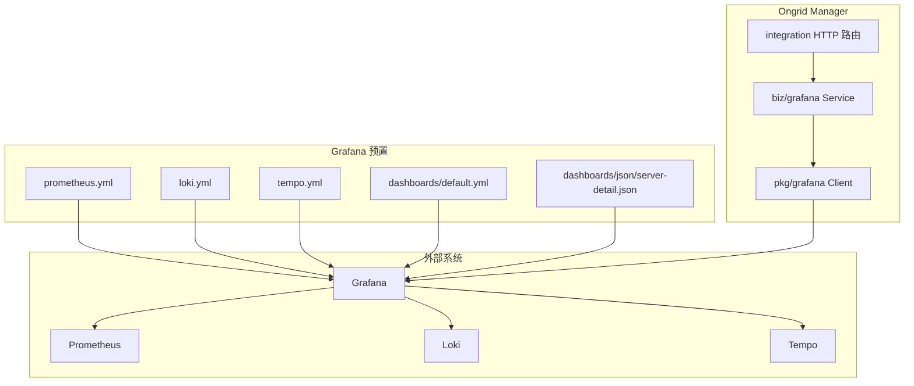
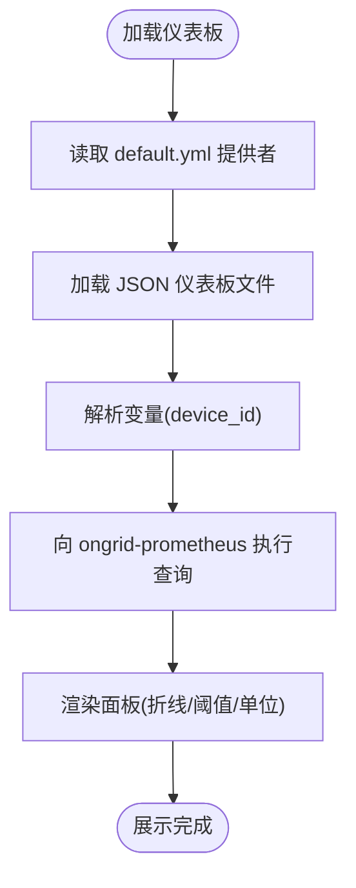
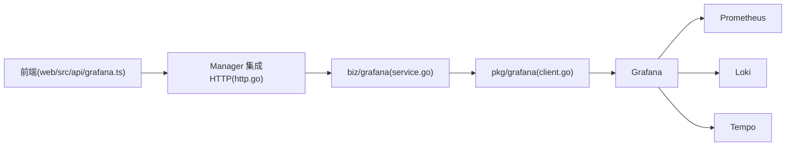

# Grafana 仪表板配置

<cite>
**本文引用的文件**
- [prometheus.yml](file://deploy/grafana/provisioning/datasources/prometheus.yml)
- [loki.yml](file://deploy/grafana/provisioning/datasources/loki.yml)
- [tempo.yml](file://deploy/grafana/provisioning/datasources/tempo.yml)
- [default.yml](file://deploy/grafana/provisioning/dashboards/default.yml)
- [server-detail.json](file://deploy/grafana/provisioning/dashboards/json/server-detail.json)
- [client.go](file://internal/pkg/grafana/client.go)
- [service.go](file://internal/manager/biz/grafana/service.go)
- [http.go](file://internal/manager/server/integration/http.go)
- [grafana.ts](file://web/src/api/grafana.ts)
- [model.go](file://internal/manager/model/setting/model.go)
- [cluster-overview.json](file://internal/manager/biz/grafana/dashboards/cluster-overview.json)
</cite>

## 目录
1. [简介](#简介)
2. [项目结构](#项目结构)
3. [核心组件](#核心组件)
4. [架构总览](#架构总览)
5. [详细组件分析](#详细组件分析)
6. [依赖关系分析](#依赖关系分析)
7. [性能注意事项](#性能注意事项)
8. [故障排查指南](#故障排查指南)
9. [结论](#结论)
10. [附录](#附录)

## 简介
本文件面向 Ongrid 平台中 Grafana 仪表板的完整配置与集成，覆盖数据源（Prometheus、Loki、Tempo）的预置与运行时同步、内置与自定义仪表板的启用与管理、面板配置与变量机制、Ongrid 专用仪表板示例、权限与分享方式以及与前端系统的集成路径。文档同时提供故障排查与性能优化建议，帮助运维与开发者快速落地并稳定运行。

## 项目结构
Ongrid 对 Grafana 的配置分为两类：
- 静态预置：通过 provisioning 目录下的 YAML 文件定义默认数据源与仪表板提供者，便于容器化部署时自动加载。
- 运行时同步：Manager 服务在启动或设置变更时，调用 Grafana 管理 API 创建/更新数据源、推送仪表板 JSON，确保平台侧配置与用户 Grafana 一致。



图表来源
- [prometheus.yml:1-11](file://deploy/grafana/provisioning/datasources/prometheus.yml#L1-L11)
- [loki.yml:1-20](file://deploy/grafana/provisioning/datasources/loki.yml#L1-L20)
- [tempo.yml:1-51](file://deploy/grafana/provisioning/datasources/tempo.yml#L1-L51)
- [default.yml:1-14](file://deploy/grafana/provisioning/dashboards/default.yml#L1-L14)
- [server-detail.json:1-457](file://deploy/grafana/provisioning/dashboards/json/server-detail.json#L1-L457)
- [service.go:1-680](file://internal/manager/biz/grafana/service.go#L1-L680)
- [client.go:1-367](file://internal/pkg/grafana/client.go#L1-L367)
- [http.go:122-143](file://internal/manager/server/integration/http.go#L122-L143)

章节来源
- [prometheus.yml:1-11](file://deploy/grafana/provisioning/datasources/prometheus.yml#L1-L11)
- [loki.yml:1-20](file://deploy/grafana/provisioning/datasources/loki.yml#L1-L20)
- [tempo.yml:1-51](file://deploy/grafana/provisioning/datasources/tempo.yml#L1-L51)
- [default.yml:1-14](file://deploy/grafana/provisioning/dashboards/default.yml#L1-L14)
- [server-detail.json:1-457](file://deploy/grafana/provisioning/dashboards/json/server-detail.json#L1-L457)
- [service.go:1-680](file://internal/manager/biz/grafana/service.go#L1-L680)
- [client.go:1-367](file://internal/pkg/grafana/client.go#L1-L367)
- [http.go:122-143](file://internal/manager/server/integration/http.go#L122-L143)

## 核心组件
- 数据源预置
  - Prometheus：默认数据源，指向内部 prometheus 服务，作为时序指标查询后端。
  - Loki：日志数据源，URL 通过环境变量注入；支持运行时由 Manager 更新。
  - Tempo：链路追踪数据源，启用 tracesToLogsV2 与 tracesToMetrics，联动 Loki 与 Prometheus。
- 仪表板提供者
  - 通过 default.yml 将 ongrid 文件夹下的 JSON 仪表板以 file 类型提供者注册，禁止 UI 直接修改，保证可重复部署。
- Manager 集成层
  - biz/grafana.Service：负责健康检查、数据源 upsert、仪表板推送、Monitor 面板镜像等。
  - pkg/grafana.Client：封装 Grafana Admin API（鉴权、健康检查、数据源/仪表板 CRUD）。
  - integration HTTP：对外暴露测试、同步、仪表盘代理等接口。
- 前端集成
  - web/src/api/grafana.ts：通过 Manager 代理获取 Grafana 仪表板 JSON，避免跨域与凭据问题。

章节来源
- [prometheus.yml:1-11](file://deploy/grafana/provisioning/datasources/prometheus.yml#L1-L11)
- [loki.yml:1-20](file://deploy/grafana/provisioning/datasources/loki.yml#L1-L20)
- [tempo.yml:1-51](file://deploy/grafana/provisioning/datasources/tempo.yml#L1-L51)
- [default.yml:1-14](file://deploy/grafana/provisioning/dashboards/default.yml#L1-L14)
- [service.go:1-680](file://internal/manager/biz/grafana/service.go#L1-L680)
- [client.go:1-367](file://internal/pkg/grafana/client.go#L1-L367)
- [http.go:122-143](file://internal/manager/server/integration/http.go#L122-L143)
- [grafana.ts:1-88](file://web/src/api/grafana.ts#L1-L88)

## 架构总览
下图展示了从 Ongrid Manager 到 Grafana 及监控后端的整体流程：Manager 读取配置，调用 Grafana API 创建/更新数据源并推送仪表板；Grafana 再向 Prometheus/Loki/Tempo 发起查询。

```mermaid
sequenceDiagram
participant Admin as "管理员"
participant API as "Manager 集成API"
participant Biz as "biz/grafana Service"
participant C as "pkg/grafana Client"
participant G as "Grafana"
participant P as "Prometheus"
participant L as "Loki"
participant T as "Tempo"
Admin->>API : 触发同步/测试
API->>Biz : 调用 Sync/Test
Biz->>C : Health / UpsertDatasource / UpsertDashboard
C->>G : 管理API请求
G-->>C : 返回结果
Biz-->>API : 返回同步结果
Note over G,P,L,T : Grafana 查询时访问后端
G->>P : 时序指标查询
G->>L : 日志查询
G->>T : 链路查询
```

图表来源
- [service.go:212-299](file://internal/manager/biz/grafana/service.go#L212-L299)
- [client.go:68-159](file://internal/pkg/grafana/client.go#L68-L159)
- [http.go:122-143](file://internal/manager/server/integration/http.go#L122-L143)

章节来源
- [service.go:212-299](file://internal/manager/biz/grafana/service.go#L212-L299)
- [client.go:68-159](file://internal/pkg/grafana/client.go#L68-L159)
- [http.go:122-143](file://internal/manager/server/integration/http.go#L122-L143)

## 详细组件分析

### 数据源配置（Prometheus、Loki、Tempo）
- Prometheus
  - 预置为默认数据源，类型为 prometheus，访问模式 proxy，URL 指向内部服务。
  - Manager 会在 Sync 时根据设置动态写入 Bearer Token 或 Basic Auth，确保外部 TSDB 可被查询。
- Loki
  - 预置 URL 通过环境变量注入；editable 为 true，允许 Manager 运行时更新。
  - Manager 会按当前日志后端（Loki 或 Elasticsearch）生成对应数据源并 upsert。
- Tempo
  - 预置启用 tracesToLogsV2 与 tracesToMetrics，分别关联 ongrid-loki 与 ongrid-prometheus。
  - 启用 nodeGraph、search 与 lokiSearch，增强链路到日志与指标的联动能力。

章节来源
- [prometheus.yml:1-11](file://deploy/grafana/provisioning/datasources/prometheus.yml#L1-L11)
- [loki.yml:1-20](file://deploy/grafana/provisioning/datasources/loki.yml#L1-L20)
- [tempo.yml:1-51](file://deploy/grafana/provisioning/datasources/tempo.yml#L1-L51)
- [service.go:233-280](file://internal/manager/biz/grafana/service.go#L233-L280)
- [service.go:395-431](file://internal/manager/biz/grafana/service.go#L395-L431)

### 仪表板模板与提供者
- 仪表板提供者
  - default.yml 将 ongrid 文件夹设为 file 类型提供者，禁用删除与 UI 更新，保证可重复部署。
- 内置仪表板
  - server-detail.json：服务器详情仪表板，包含 CPU、内存、负载、网络等面板，使用 PromQL 查询 ongrid-prometheus。
  - cluster-overview.json：集群概览仪表板（嵌入于 Manager 二进制，随 Sync 推送）。
- 变量与模板
  - server-detail.json 定义了 device_id 变量，基于 label_values 动态拉取设备列表，供面板过滤。
  - 前端渲染时通过 URL 参数替换 $device_id 等变量，无需额外下拉框。



图表来源
- [default.yml:1-14](file://deploy/grafana/provisioning/dashboards/default.yml#L1-L14)
- [server-detail.json:414-444](file://deploy/grafana/provisioning/dashboards/json/server-detail.json#L414-L444)
- [grafana.ts:60-68](file://web/src/api/grafana.ts#L60-L68)

章节来源
- [default.yml:1-14](file://deploy/grafana/provisioning/dashboards/default.yml#L1-L14)
- [server-detail.json:1-457](file://deploy/grafana/provisioning/dashboards/json/server-detail.json#L1-L457)
- [cluster-overview.json](file://internal/manager/biz/grafana/dashboards/cluster-overview.json)
- [grafana.ts:60-68](file://web/src/api/grafana.ts#L60-L68)

### 面板配置选项（图表类型、查询、样式、交互）
- 图表类型
  - 时间序列（timeseries）、统计（stat）、仪表盘（gauge）等，由面板 type 决定。
- 查询语句
  - PromQL：如 CPU 使用率、内存使用率、负载、网络吞吐等，均基于 ongrid-prometheus。
  - Loki/Tempo：日志与链路查询通过相应数据源类型承载，前端若不支持原生渲染则回退到深链跳转。
- 样式定制
  - fieldConfig.defaults 中的 unit、min/max、thresholds.steps 控制单位、范围与告警色带。
  - overrides 可用于覆盖特定序列的样式。
- 交互功能
  - graphTooltip、legend、刷新间隔、时间选择器、变量筛选等。
  - Monitor 页面“在 Grafana 中打开”会复用同一组面板，保持前后端一致体验。

章节来源
- [server-detail.json:24-124](file://deploy/grafana/provisioning/dashboards/json/server-detail.json#L24-L124)
- [server-detail.json:125-225](file://deploy/grafana/provisioning/dashboards/json/server-detail.json#L125-L225)
- [server-detail.json:226-324](file://deploy/grafana/provisioning/dashboards/json/server-detail.json#L226-L324)
- [server-detail.json:325-406](file://deploy/grafana/provisioning/dashboards/json/server-detail.json#L325-L406)
- [service.go:573-680](file://internal/manager/biz/grafana/service.go#L573-L680)
- [grafana.ts:35-68](file://web/src/api/grafana.ts#L35-L68)

### Ongrid 专用仪表板示例
- 服务器详情
  - 包含 CPU、内存、Load1、网络接收速率等面板，变量 device_id 用于多设备切换。
- 集群概览
  - 由 Manager 内嵌的 cluster-overview.json 组成，随 Sync 推送到 ongrid 文件夹。
- 性能监控
  - Monitor 页面面板镜像 dashboard（uid 固定），每次编辑后重新推送，保证 Grafana 视图与平台一致。

章节来源
- [server-detail.json:1-457](file://deploy/grafana/provisioning/dashboards/json/server-detail.json#L1-L457)
- [cluster-overview.json](file://internal/manager/biz/grafana/dashboards/cluster-overview.json)
- [service.go:530-571](file://internal/manager/biz/grafana/service.go#L530-L571)

### 权限管理与分享机制
- 认证与授权
  - Manager 通过 Service Account token 或 API Key 以 Bearer 方式访问 Grafana。
  - 首次启动可自动创建 SA 并保存 token；外部 Grafana 场景支持粘贴已有 api_key。
- 分享与代理
  - 前端不直接访问外部 Grafana，而是通过 Manager 代理获取仪表板 JSON，避免 CORS/Cookie 问题。
  - 仪表板提供者禁用 UI 更新，防止手动修改破坏一致性。

章节来源
- [model.go:164-182](file://internal/manager/model/setting/model.go#L164-L182)
- [service.go:125-190](file://internal/manager/biz/grafana/service.go#L125-L190)
- [service.go:433-460](file://internal/manager/biz/grafana/service.go#L433-L460)
- [grafana.ts:75-87](file://web/src/api/grafana.ts#L75-L87)

### 与其他系统集成
- Prometheus
  - 时序指标查询，支持 Bearer 或 Basic Auth 透传到 TSDB。
- Loki
  - 日志查询，支持 TLS 跳过验证与 Basic Auth；Manager 可在运行时更新 URL。
- Tempo
  - 链路查询，联动 Loki 与 Prometheus，提供 RED 指标与服务拓扑图。

章节来源
- [service.go:233-280](file://internal/manager/biz/grafana/service.go#L233-L280)
- [service.go:395-431](file://internal/manager/biz/grafana/service.go#L395-L431)
- [tempo.yml:1-51](file://deploy/grafana/provisioning/datasources/tempo.yml#L1-L51)

## 依赖关系分析
- Manager 与 Grafana
  - biz/grafana.Service 依赖 pkg/grafana.Client，后者封装 Grafana Admin API。
  - integration HTTP 路由暴露测试、同步与仪表盘代理接口。
- 数据源与后端
  - Prometheus/Loki/Tempo 通过 Grafana 数据源连接；Manager 负责维护数据源配置的一致性。
- 前端与后端
  - 前端通过 Manager 代理获取仪表板 JSON，避免跨域与凭据泄露。



图表来源
- [grafana.ts:75-87](file://web/src/api/grafana.ts#L75-L87)
- [http.go:122-143](file://internal/manager/server/integration/http.go#L122-L143)
- [service.go:212-299](file://internal/manager/biz/grafana/service.go#L212-L299)
- [client.go:68-159](file://internal/pkg/grafana/client.go#L68-L159)

章节来源
- [grafana.ts:75-87](file://web/src/api/grafana.ts#L75-L87)
- [http.go:122-143](file://internal/manager/server/integration/http.go#L122-L143)
- [service.go:212-299](file://internal/manager/biz/grafana/service.go#L212-L299)
- [client.go:68-159](file://internal/pkg/grafana/client.go#L68-L159)

## 性能注意事项
- 查询窗口与聚合粒度
  - 合理设置 $__rate_interval 与时间窗口，避免过大范围导致查询缓慢。
- 指标标签基数
  - 控制高基数字段（如 device_id）的维度数量，必要时进行聚合或采样。
- 日志行数限制
  - Loki 数据源的 maxLines 需根据场景调整，避免单次返回过多日志影响渲染。
- 链路指标
  - tracesToMetrics 的 spanmetrics 远程写入目标应容量充足，避免背压。
- 缓存与刷新
  - 仪表板 refresh 间隔不宜过短，减少 Grafana 与后端压力。

[本节为通用指导，不直接分析具体文件]

## 故障排查指南
- 无法连接 Grafana
  - 检查 root_url、sa_token/api_key 是否配置正确；使用测试接口验证连通性。
- 数据源不可用
  - 确认 Prometheus/Loki/Tempo 地址与鉴权信息；查看 Manager 同步日志。
- 仪表板未显示或为空
  - 检查仪表板提供者路径与 JSON 文件是否存在；确认 Sync 是否成功推送。
- 变量未生效
  - 确认变量定义与查询表达式；检查前端是否正确替换 $device_id 等变量。
- 只读数据源错误
  - 当数据源由 provisioning 创建且 editable:false 时，Manager 会跳过更新；如需修改，请调整 provisioning 或改用运行时同步。

章节来源
- [service.go:201-210](file://internal/manager/biz/grafana/service.go#L201-L210)
- [service.go:212-299](file://internal/manager/biz/grafana/service.go#L212-L299)
- [client.go:115-159](file://internal/pkg/grafana/client.go#L115-L159)
- [server-detail.json:414-444](file://deploy/grafana/provisioning/dashboards/json/server-detail.json#L414-L444)

## 结论
Ongrid 通过“静态预置 + 运行时同步”的双轨策略，确保 Grafana 数据源与仪表板的一致性与可维护性。Manager 负责数据源 upsert、仪表板推送与 Monitor 面板镜像，前端通过代理安全地获取仪表板内容。结合 Prometheus/Loki/Tempo 的联动能力，平台提供了完整的可观测性体验。遵循本文的配置与排障建议，可快速搭建并稳定运行 Ongrid 的 Grafana 仪表板体系。

## 附录
- 关键常量与键名
  - 文件夹与数据源 UID：ongrid、ongrid-prometheus、ongrid-loki、ongrid-elasticsearch。
  - 设置项：root_url、sa_token、api_key、org_id。
- 常用操作
  - 测试连接：调用集成测试接口验证 Grafana 连通性。
  - 同步数据源与仪表板：触发 Sync，确保 ongrid 文件夹与数据源最新。
  - 仅更新 Loki：使用 sync-loki 接口，避免重写仪表板。

章节来源
- [service.go:38-54](file://internal/manager/biz/grafana/service.go#L38-L54)
- [model.go:164-182](file://internal/manager/model/setting/model.go#L164-L182)
- [http.go:122-143](file://internal/manager/server/integration/http.go#L122-L143)