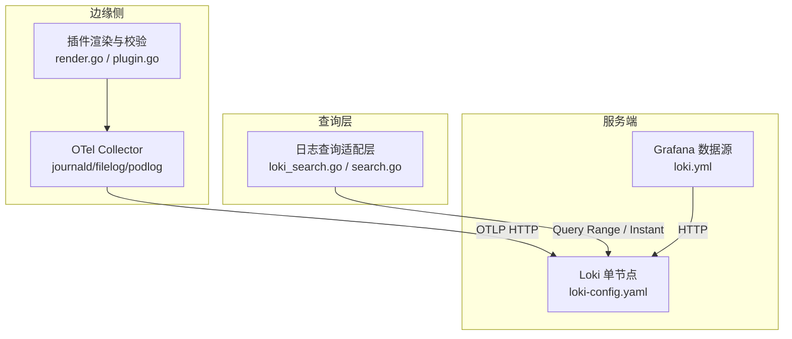
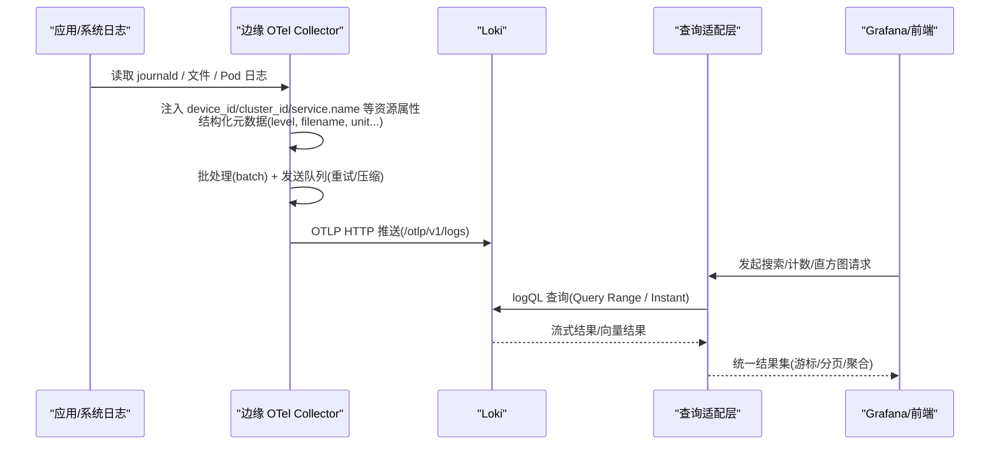
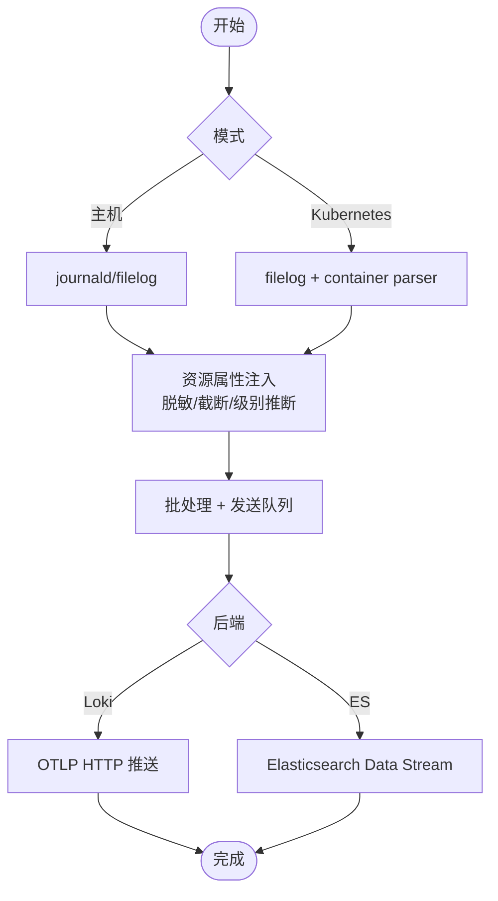
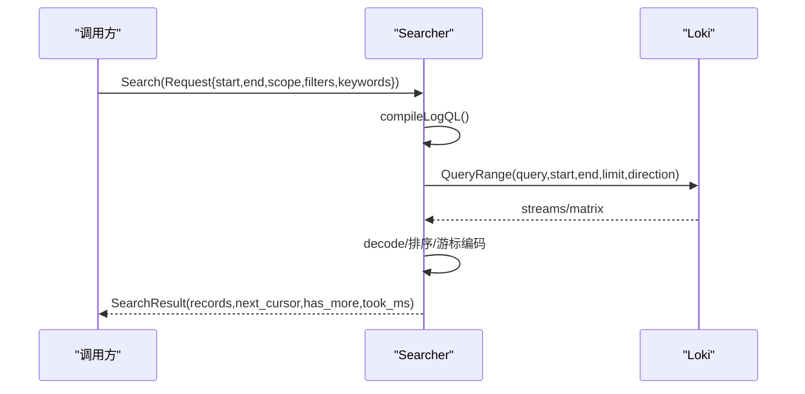
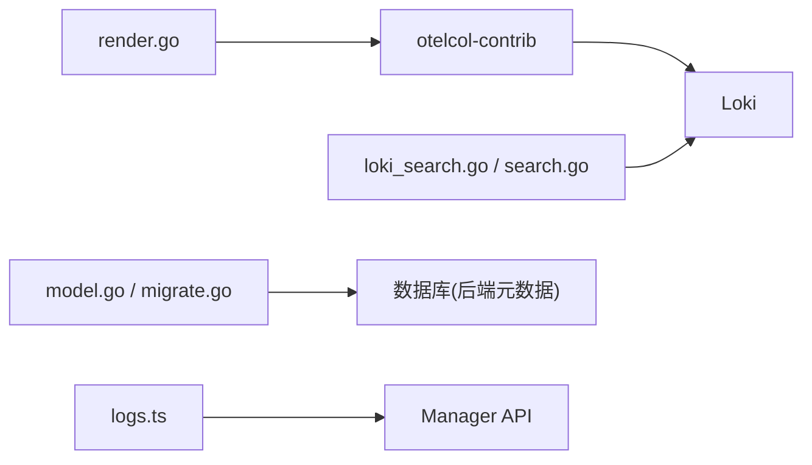

# Loki 日志聚合配置

<cite>
**本文引用的文件**
- [loki-config.yaml](file://deploy/install/loki-config.yaml)
- [loki.yml](file://deploy/grafana/provisioning/datasources/loki.yml)
- [render.go](file://internal/edgeagent/plugins/logs/render.go)
- [plugin.go](file://internal/edgeagent/plugins/logs/plugin.go)
- [loki_search.go](file://internal/pkg/logquery/loki_search.go)
- [search.go](file://internal/pkg/logquery/search.go)
- [level.go](file://internal/pkg/logquery/level.go)
- [model.go](file://internal/manager/model/logs/model.go)
- [migrate.go](file://internal/manager/data/logs/store/migrate.go)
- [logs.ts](file://web/src/api/logs.ts)
- [RFC-003-otel-elasticsearch-logs.md](file://docs/rfc/RFC-003-otel-elasticsearch-logs.md)
</cite>

## 目录
1. [简介](#简介)
2. [项目结构](#项目结构)
3. [核心组件](#核心组件)
4. [架构总览](#架构总览)
5. [详细组件分析](#详细组件分析)
6. [依赖关系分析](#依赖关系分析)
7. [性能考虑](#性能考虑)
8. [故障排查指南](#故障排查指南)
9. [结论](#结论)
10. [附录](#附录)

## 简介
本指南面向在 Ongrid 中部署与使用 Loki 日志聚合系统的运维与开发者，覆盖以下主题：
- Loki 单节点配置要点：索引策略、分片与周期、存储后端、压缩与保留策略。
- 标签设计与结构化日志：资源属性、结构化元数据、标签选择器优化与查询性能调优。
- LogQL 查询语言：搜索语法、聚合操作、时间范围过滤与直方图统计。
- Ongrid 边缘侧日志采集：应用日志接入、格式标准化、错误日志特殊处理。
- 数据生命周期管理：归档、清理与备份机制（结合 Loki compactor 与系统级备份建议）。
- 性能调优与常见问题解决方案。

## 项目结构
Ongrid 的日志链路包含三部分：
- 边缘侧采集：通过 OTel Collector 子进程收集 journald、文件与 Kubernetes Pod 日志，并写入内置 Loki 或外部 Elasticsearch。
- 服务端存储：Loki 单节点以文件系统为后端，启用 TSDB 索引与 Compactor 进行保留清理。
- 查询与集成：Manager 提供统一的日志查询接口，Grafana 通过数据源配置对接 Loki。

图表来源
- [render.go:191-252](file://internal/edgeagent/plugins/logs/render.go#L191-L252)
- [plugin.go:1-41](file://internal/edgeagent/plugins/logs/plugin.go#L1-L41)
- [loki-config.yaml:1-76](file://deploy/install/loki-config.yaml#L1-L76)
- [loki.yml:1-20](file://deploy/grafana/provisioning/datasources/loki.yml#L1-L20)
- [loki_search.go:31-118](file://internal/pkg/logquery/loki_search.go#L31-L118)
- [search.go:138-152](file://internal/pkg/logquery/search.go#L138-L152)

章节来源
- [render.go:52-252](file://internal/edgeagent/plugins/logs/render.go#L52-L252)
- [plugin.go:1-41](file://internal/edgeagent/plugins/logs/plugin.go#L1-L41)
- [loki-config.yaml:1-76](file://deploy/install/loki-config.yaml#L1-L76)
- [loki.yml:1-20](file://deploy/grafana/provisioning/datasources/loki.yml#L1-L20)
- [loki_search.go:31-118](file://internal/pkg/logquery/loki_search.go#L31-L118)
- [search.go:138-152](file://internal/pkg/logquery/search.go#L138-L152)

## 核心组件
- 边缘日志插件：负责生成 OTel Collector 配置、注入设备维度、安全脱敏、批处理与发送队列，支持内置 Loki 与外部 Elasticsearch 两种后端。
- Loki 服务：单节点部署，TSDB 索引 + 文件系统对象存储，启用 Compactor 做保留清理，Ruler 用于规则（可选），限制入参与查询能力。
- 查询适配层：将产品化的 Scope/Filters/Keywords 编译为 LogQL，实现分页游标、计数、分组计数、直方图统计与字段值枚举。
- Grafana 数据源：动态配置 Loki URL，支持超时与最大行数等参数。

章节来源
- [render.go:191-252](file://internal/edgeagent/plugins/logs/render.go#L191-L252)
- [loki-config.yaml:21-75](file://deploy/install/loki-config.yaml#L21-L75)
- [loki_search.go:31-118](file://internal/pkg/logquery/loki_search.go#L31-L118)
- [loki.yml:1-20](file://deploy/grafana/provisioning/datasources/loki.yml#L1-L20)

## 架构总览
下图展示从边缘采集到查询的端到端流程，包括标签注入、结构化元数据、批量与重试、以及 Loki 的索引与保留。

图表来源
- [render.go:147-208](file://internal/edgeagent/plugins/logs/render.go#L147-L208)
- [render.go:502-600](file://internal/edgeagent/plugins/logs/render.go#L502-L600)
- [loki_search.go:31-118](file://internal/pkg/logquery/loki_search.go#L31-L118)
- [loki_search.go:318-388](file://internal/pkg/logquery/loki_search.go#L318-L388)

## 详细组件分析

### Loki 服务配置要点
- 认证与监听：关闭鉴权；HTTP 端口 3100，gRPC 端口 9096。
- 公共路径与存储：path_prefix 为 /loki；对象存储 filesystem，chunks/rules 目录独立；ring 使用内存 kvstore。
- 索引策略：schema v13，store tsdb，object_store filesystem，index prefix 为 index_，period 24h。
- 限制与保留：允许结构化元数据；OTLP resource_attributes 中部分作为索引标签，部分作为结构化元数据；retention_period 720h（30 天）；限制全局流数、入参速率与查询规模；拒绝旧样本。
- 压缩与清理：compactor 工作目录启用，开启 retention_enabled，delete_request_store 使用 filesystem。
- 告警规则：ruler 本地存储规则目录，临时目录用于运行期。

章节来源
- [loki-config.yaml:6-20](file://deploy/install/loki-config.yaml#L6-L20)
- [loki-config.yaml:21-30](file://deploy/install/loki-config.yaml#L21-L30)
- [loki-config.yaml:31-60](file://deploy/install/loki-config.yaml#L31-L60)
- [loki-config.yaml:61-75](file://deploy/install/loki-config.yaml#L61-L75)

### 边缘侧日志采集与标准化
- 采集源：
  - 主机模式：journald（可开关）、filelog（支持 include/exclude、正则/JSON 解析、多行合并、过期剔除）。
  - Kubernetes 模式：filelog 读取 /var/log/pods，容器解析器提取 K8s 元数据。
- 资源属性注入：device_id、cluster_id、cluster_name、k8s.node.name、service.name、workload、pod、container、node、namespace、filename、unit、ongrid_source 等。
- 结构化元数据：level/severity_text、trace_id/span_id 等；对敏感字段进行脱敏与截断。
- 批处理与可靠性：batch 大小与超时、sending queue、重试策略、压缩 gzip。
- 后端选择：
  - 内置 Loki：OTLP HTTP 导出至 Manager 暴露的 /otlp/v1/logs，支持 edge/basic/none 认证模式。
  - 外部 Elasticsearch：data stream 路由（dataset/namespace），mapping 固定为 otel 模式，API Key 通过文件注入。

图表来源
- [render.go:89-126](file://internal/edgeagent/plugins/logs/render.go#L89-L126)
- [render.go:147-208](file://internal/edgeagent/plugins/logs/render.go#L147-L208)
- [render.go:502-600](file://internal/edgeagent/plugins/logs/render.go#L502-L600)

章节来源
- [render.go:52-252](file://internal/edgeagent/plugins/logs/render.go#L52-L252)
- [render.go:298-388](file://internal/edgeagent/plugins/logs/render.go#L298-L388)
- [render.go:502-600](file://internal/edgeagent/plugins/logs/render.go#L502-L600)
- [RFC-003-otel-elasticsearch-logs.md:12-31](file://docs/rfc/RFC-003-otel-elasticsearch-logs.md#L12-L31)

### 标签设计与查询性能调优
- 标签设计原则：
  - 高基数字段（如 service.name、pod、container）尽量放入结构化元数据而非索引标签，避免基数爆炸。
  - 常用筛选维度（device_id、cluster_id、namespace、source_id、level）映射为索引标签以提升查询性能。
  - 统一资源属性键名，便于跨后端一致查询。
- 查询性能优化：
  - 优先使用索引标签匹配，减少全量扫描。
  - 控制关键词数量与长度、过滤器数量与值数量上限。
  - 合理设置时间窗口与 limit，避免过大查询。
  - 使用游标分页，避免重复拉取。
  - 直方图统计时注意 Loki 对齐步长与 offset 补偿。

章节来源
- [search.go:13-22](file://internal/pkg/logquery/search.go#L13-L22)
- [search.go:49-87](file://internal/pkg/logquery/search.go#L49-L87)
- [search.go:257-338](file://internal/pkg/logquery/search.go#L257-L338)
- [loki_search.go:390-526](file://internal/pkg/logquery/loki_search.go#L390-L526)
- [loki_search.go:318-388](file://internal/pkg/logquery/loki_search.go#L318-L388)

### LogQL 查询语言与聚合
- 搜索语法：
  - 基于 Scope/Filters/Keywords 编译为 LogQL 匹配器与行过滤。
  - 支持包含/排除关键词、短语匹配、前缀匹配、存在性判断、不等于与 IN 操作。
- 聚合操作：
  - 计数：count_over_time 区间求和，支持按维度分组（group_by 限定字段集合）。
  - 直方图：按间隔计算 count_over_time，处理对齐偏移与半桶补全。
- 时间范围过滤：
  - 严格边界 (Start, End]，相邻桶不重复计数。
  - 游标分页保证前后向排序一致性。

图表来源
- [loki_search.go:31-118](file://internal/pkg/logquery/loki_search.go#L31-L118)
- [loki_search.go:390-526](file://internal/pkg/logquery/loki_search.go#L390-L526)
- [search.go:138-152](file://internal/pkg/logquery/search.go#L138-L152)

章节来源
- [loki_search.go:31-118](file://internal/pkg/logquery/loki_search.go#L31-L118)
- [loki_search.go:318-388](file://internal/pkg/logquery/loki_search.go#L318-L388)
- [loki_search.go:390-526](file://internal/pkg/logquery/loki_search.go#L390-L526)
- [search.go:138-152](file://internal/pkg/logquery/search.go#L138-L152)

### 数据生命周期管理（保留、归档、清理、备份）
- 保留策略：
  - Loki 侧：retention_period 720h（30 天），compactor 启用删除请求存储于文件系统。
  - 建议配合外部归档（如对象存储快照）以满足更长合规要求。
- 清理机制：
  - 指标与审计模块有独立的保留清理循环（示例为每日定时任务），日志侧依赖 Loki compactor。
- 备份建议：
  - 对 /loki/chunks、/loki/rules、/loki/compactor 目录定期快照或增量备份。
  - 确保 compactor 与主服务版本兼容，避免索引损坏。

章节来源
- [loki-config.yaml:31-60](file://deploy/install/loki-config.yaml#L31-L60)
- [loki-config.yaml:61-75](file://deploy/install/loki-config.yaml#L61-L75)
- [usecase.go:149-183](file://internal/manager/biz/audit/usecase.go#L149-L183)
- [retention.go:9-103](file://internal/manager/biz/metric/retention.go#L9-L103)

### Grafana 数据源与连接状态
- 数据源配置：名称 ongrid-loki，类型 loki，访问代理，URL 由环境变量注入，可编辑，超时与最大行数可调。
- 后端连接检查：前端 API 提供获取/保存/测试/选择后端的能力，返回连接状态与边缘节点在线情况。

章节来源
- [loki.yml:1-20](file://deploy/grafana/provisioning/datasources/loki.yml#L1-L20)
- [logs.ts:158-206](file://web/src/api/logs.ts#L158-L206)

## 依赖关系分析
- 边缘插件依赖 OTel Collector 二进制与配置文件渲染逻辑，输出 YAML 后由子进程执行。
- 查询适配层依赖 Loki 的 Query Range 与 Instant Query 接口，封装游标与聚合。
- Manager 模型与迁移脚本维护日志后端元数据（当前默认 ES 模型，但 Loki 同样被查询层支持）。

图表来源
- [plugin.go:1-41](file://internal/edgeagent/plugins/logs/plugin.go#L1-L41)
- [loki_search.go:31-118](file://internal/pkg/logquery/loki_search.go#L31-L118)
- [model.go:1-82](file://internal/manager/model/logs/model.go#L1-L82)
- [migrate.go:1-30](file://internal/manager/data/logs/store/migrate.go#L1-L30)
- [logs.ts:158-206](file://web/src/api/logs.ts#L158-L206)

章节来源
- [plugin.go:1-41](file://internal/edgeagent/plugins/logs/plugin.go#L1-L41)
- [loki_search.go:31-118](file://internal/pkg/logquery/loki_search.go#L31-L118)
- [model.go:1-82](file://internal/manager/model/logs/model.go#L1-L82)
- [migrate.go:1-30](file://internal/manager/data/logs/store/migrate.go#L1-L30)
- [logs.ts:158-206](file://web/src/api/logs.ts#L158-L206)

## 性能考虑
- 索引与标签：
  - 将高频筛选字段设为索引标签（device_id、cluster_id、namespace、source_id、level）。
  - 避免将高基数字段（如 pod/container）作为索引标签；必要时用结构化元数据+行过滤。
- 查询限制：
  - 控制 time window、limit、keyword/filter 数量与长度，避免大查询。
  - 使用游标分页，避免重复拉取与内存压力。
- 采集侧：
  - 调整 batch size、queue size、重试间隔与压缩策略，平衡吞吐与延迟。
  - 对大体积日志启用 max_log_size 与 exclude_older_than，减少不必要数据。
- 存储与保留：
  - 合理设置 retention_period 与 compactor 阈值，避免磁盘膨胀。
  - 监控 chunks 目录增长与 compactor 任务耗时。

章节来源
- [search.go:13-22](file://internal/pkg/logquery/search.go#L13-L22)
- [search.go:257-338](file://internal/pkg/logquery/search.go#L257-L338)
- [render.go:174-208](file://internal/edgeagent/plugins/logs/render.go#L174-L208)
- [render.go:502-600](file://internal/edgeagent/plugins/logs/render.go#L502-L600)
- [loki-config.yaml:31-75](file://deploy/install/loki-config.yaml#L31-L75)

## 故障排查指南
- 无法写入 Loki：
  - 检查 OTLP 端点是否指向正确的 /otlp/v1/logs，认证模式是否正确（edge/basic/none）。
  - 确认发送队列与重试配置，查看 collector 健康检查端口。
- 查询无结果或慢：
  - 确认 Scope/Filters 是否命中索引标签；避免过宽的时间窗口与 limit。
  - 检查关键词与过滤器数量是否超限；使用游标分页。
- 级别识别异常：
  - 结构化 JSON 中的 level/severity/severity_text 会被优先识别；文本日志通过正则推断级别。
- 数据丢失或重复：
  - 确认采集 start_at 策略（beginning/end）与文件轮转；检查 batch 与 queue 配置。
  - 验证 Loki 保留策略与 compactor 任务是否正常。

章节来源
- [render.go:502-600](file://internal/edgeagent/plugins/logs/render.go#L502-L600)
- [render.go:254-296](file://internal/edgeagent/plugins/logs/render.go#L254-L296)
- [level.go:14-47](file://internal/pkg/logquery/level.go#L14-L47)
- [loki_search.go:31-118](file://internal/pkg/logquery/loki_search.go#L31-L118)
- [loki-config.yaml:31-75](file://deploy/install/loki-config.yaml#L31-L75)

## 结论
Ongrid 通过边缘侧 OTel Collector 与 Loki 单节点实现了统一的日志采集、存储与查询能力。通过合理的标签设计、查询限制与保留策略，可在保障性能的同时满足日常运维与排障需求。建议在生产环境中结合外部归档与备份策略，确保数据的长期可用性与合规性。

## 附录
- 关键配置参考：
  - Loki 单节点配置：[loki-config.yaml](file://deploy/install/loki-config.yaml)
  - Grafana 数据源：[loki.yml](file://deploy/grafana/provisioning/datasources/loki.yml)
  - 边缘插件渲染与导出：[render.go](file://internal/edgeagent/plugins/logs/render.go)
  - 查询适配层：[loki_search.go](file://internal/pkg/logquery/loki_search.go)、[search.go](file://internal/pkg/logquery/search.go)
  - 级别识别：[level.go](file://internal/pkg/logquery/level.go)
  - 后端模型与迁移：[model.go](file://internal/manager/model/logs/model.go)、[migrate.go](file://internal/manager/data/logs/store/migrate.go)
  - 前端 API：[logs.ts](file://web/src/api/logs.ts)
  - 外部 ES 采集 RFC：[RFC-003-otel-elasticsearch-logs.md](file://docs/rfc/RFC-003-otel-elasticsearch-logs.md)