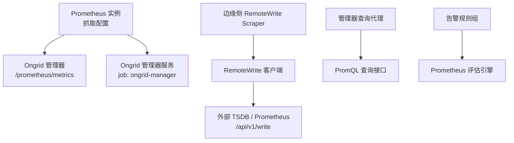
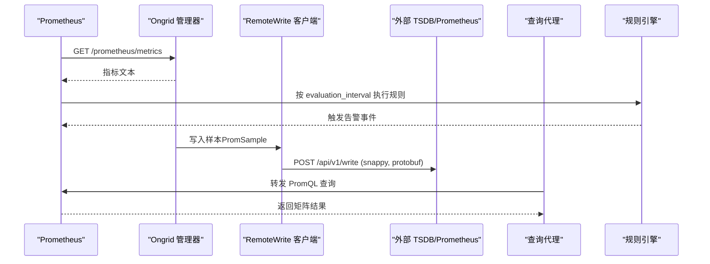
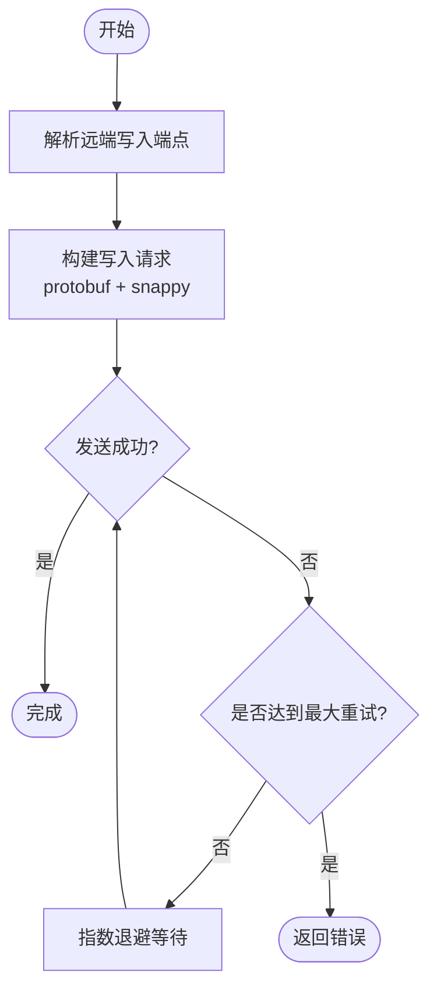
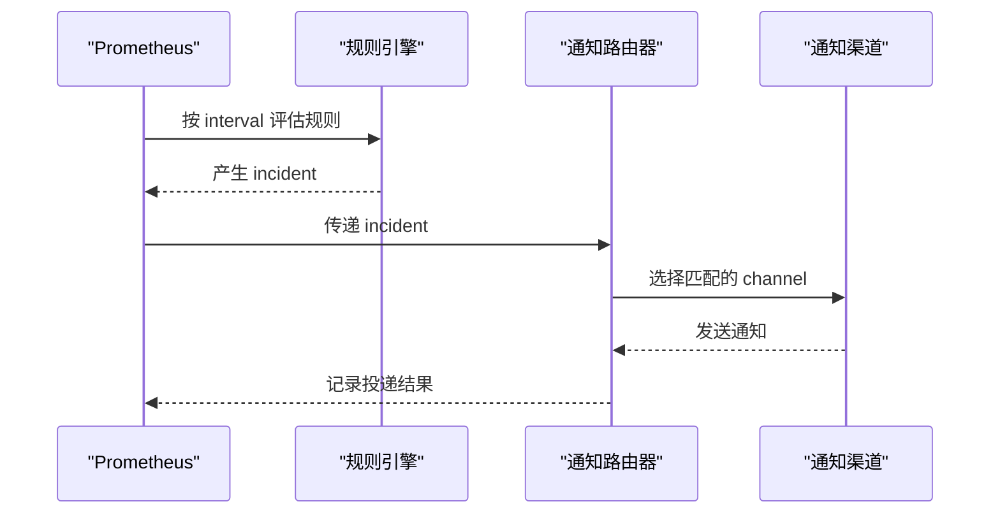
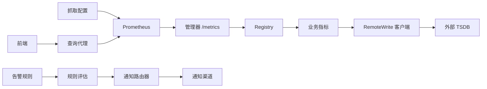

# Prometheus 配置

<cite>
**本文引用的文件**
- [deploy/install/prometheus/prometheus.yml](file://deploy/install/prometheus/prometheus.yml)
- [deploy/prometheus/prometheus.yml](file://deploy/prometheus/prometheus.yml)
- [deploy/install/prometheus-rules.yml](file://deploy/install/prometheus-rules.yml)
- [internal/pkg/prom/prom.go](file://internal/pkg/prom/prom.go)
- [internal/pkg/prom/manager_metrics.go](file://internal/pkg/prom/manager_metrics.go)
- [internal/manager/server/metric/prom_handler.go](file://internal/manager/server/metric/prom_handler.go)
- [internal/manager/server/prometheus/http.go](file://internal/manager/server/prometheus/http.go)
- [internal/pkg/promwrite/client.go](file://internal/pkg/promwrite/client.go)
- [cmd/ongrid/main.go](file://cmd/ongrid/main.go)
- [cmd/ongrid-edge/k8s_data_plane.go](file://cmd/ongrid-edge/k8s_data_plane.go)
- [internal/edgeagent/k8s/remote_write_scraper.go](file://internal/edgeagent/k8s/remote_write_scraper.go)
- [internal/edgeagent/k8s/metrics.go](file://internal/edgeagent/k8s/metrics.go)
- [internal/edgeagent/k8s/metrics_observer.go](file://internal/edgeagent/k8s/metrics_observer.go)
- [internal/edgeagent/collector/scrapecfg.go](file://internal/edgeagent/collector/scrapecfg.go)
- [internal/edgeagent/plugins/metrics/plugin.go](file://internal/edgeagent/plugins/metrics/plugin.go)
- [internal/edgeagent/plugins/databasemetrics/spec.go](file://internal/edgeagent/plugins/databasemetrics/spec.go)
- [internal/manager/biz/alert/router.go](file://internal/manager/biz/alert/router.go)
- [internal/manager/model/alert/model.go](file://internal/manager/model/alert/model.go)
- [internal/manager/data/alert/store/seed_rules.go](file://internal/manager/data/alert/store/seed_rules.go)
- [internal/manager/biz/metric/retention.go](file://internal/manager/biz/metric/retention.go)
- [internal/edgeagent/plugins/metricscommon/scrape_test.go](file://internal/edgeagent/plugins/metricscommon/scrape_test.go)
- [internal/edgeagent/plugins/metrics/scrape_test.go](file://internal/edgeagent/plugins/metrics/scrape_test.go)
- [internal/manager/server/metric/prom_handler_test.go](file://internal/manager/server/metric/prom_handler_test.go)
</cite>

## 目录
1. [简介](#简介)
2. [项目结构](#项目结构)
3. [核心组件](#核心组件)
4. [架构总览](#架构总览)
5. [详细组件分析](#详细组件分析)
6. [依赖关系分析](#依赖关系分析)
7. [性能与容量规划](#性能与容量规划)
8. [故障排查指南](#故障排查指南)
9. [结论](#结论)
10. [附录：关键配置清单](#附录关键配置清单)

## 简介
本指南面向 Ongrid 平台中的 Prometheus 监控体系，覆盖以下主题：
- Prometheus 全局配置、抓取目标配置与服务发现
- Ongrid 管理器的指标暴露（/prometheus/metrics）与自定义指标
- 远程写入（Remote Write）到外部存储的集成方式
- 告警规则文件的组织、评估间隔与通知渠道集成
- 常见问题的定位与优化建议（抓取失败、内存占用过高、查询性能）

## 项目结构
Ongrid 在部署层提供 Prometheus 配置文件，并在管理器与边缘侧实现指标采集、推送与查询代理。关键位置如下：
- 部署配置：生产与开发两套 Prometheus 抓取配置
- 管理器指标：进程级 /metrics 处理器与业务自观测指标注册
- 远程写入：管理器与边缘侧通过统一客户端向远端 TSDB 写入
- 告警规则：内置规则组与系统自观测告警
- 查询代理：将前端 PromQL 请求转发至后端 Prometheus

图表来源
- [deploy/prometheus/prometheus.yml:6-19](file://deploy/prometheus/prometheus.yml#L6-L19)
- [internal/pkg/prom/prom.go:16-29](file://internal/pkg/prom/prom.go#L16-L29)
- [internal/edgeagent/k8s/remote_write_scraper.go:135-189](file://internal/edgeagent/k8s/remote_write_scraper.go#L135-L189)
- [internal/pkg/promwrite/client.go:126-176](file://internal/pkg/promwrite/client.go#L126-L176)
- [internal/manager/server/metric/prom_handler.go:71-74](file://internal/manager/server/metric/prom_handler.go#L71-L74)
- [deploy/install/prometheus-rules.yml:7-10](file://deploy/install/prometheus-rules.yml#L7-L10)

章节来源
- [deploy/install/prometheus/prometheus.yml:6-20](file://deploy/install/prometheus/prometheus.yml#L6-L20)
- [deploy/prometheus/prometheus.yml:6-28](file://deploy/prometheus/prometheus.yml#L6-L28)

## 核心组件
- Prometheus 抓取配置
  - 全局参数：抓取间隔、超时、评估间隔
  - 抓取任务：静态目标、路径、标签
- Ongrid 管理器指标
  - 进程级 /metrics 处理器
  - 业务自观测指标（HTTP、数据库池、LLM、告警评估等）
- 远程写入
  - 统一客户端封装，支持固定 URL 或动态解析器
  - 重试与错误处理
- 告警规则
  - 规则组、评估间隔、表达式、标签与注解
  - 通知渠道选择与过滤
- 查询代理
  - 安全地对外暴露 PromQL 查询能力

章节来源
- [internal/pkg/prom/prom.go:16-29](file://internal/pkg/prom/prom.go#L16-L29)
- [internal/pkg/prom/manager_metrics.go:155-317](file://internal/pkg/prom/manager_metrics.go#L155-L317)
- [internal/pkg/promwrite/client.go:126-176](file://internal/pkg/promwrite/client.go#L126-L176)
- [deploy/install/prometheus-rules.yml:7-79](file://deploy/install/prometheus-rules.yml#L7-L79)
- [internal/manager/server/metric/prom_handler.go:71-96](file://internal/manager/server/metric/prom_handler.go#L71-L96)

## 架构总览
下图展示从抓取、指标暴露、远程写入到查询与告警的整体流程。

图表来源
- [deploy/prometheus/prometheus.yml:10-19](file://deploy/prometheus/prometheus.yml#L10-L19)
- [internal/pkg/prom/prom.go:26-29](file://internal/pkg/prom/prom.go#L26-L29)
- [internal/pkg/promwrite/client.go:126-176](file://internal/pkg/promwrite/client.go#L126-L176)
- [internal/manager/server/metric/prom_handler.go:71-96](file://internal/manager/server/metric/prom_handler.go#L71-L96)
- [deploy/install/prometheus-rules.yml:7-10](file://deploy/install/prometheus-rules.yml#L7-L10)

## 详细组件分析

### Prometheus 抓取配置（全局与目标）
- 全局配置
  - scrape_interval：控制抓取频率
  - scrape_timeout：单次抓取超时
  - evaluation_interval：规则评估周期
- 抓取目标
  - job_name：区分不同抓取任务
  - metrics_path：指标端点路径
  - static_configs.targets：静态目标列表
  - labels：附加标签用于区分环境与来源

示例参考
- 生产环境抓取配置
- 开发环境抓取配置（包含对管理器自身的抓取）

章节来源
- [deploy/install/prometheus/prometheus.yml:6-20](file://deploy/install/prometheus/prometheus.yml#L6-L20)
- [deploy/prometheus/prometheus.yml:6-28](file://deploy/prometheus/prometheus.yml#L6-L28)

### Ongrid 管理器的指标暴露与自定义指标
- 指标处理器
  - 使用独立 Registry 并注册 Go 运行时与进程指标
  - 提供 /metrics HTTP 处理器供 Prometheus 抓取
- 自定义指标
  - HTTP 请求计数与时延（方法、路由、状态类）
  - 数据库连接池指标（打开、使用中、空闲、等待计数）
  - LLM 调用计数、时延与 Token 用量
  - 告警评估时延与次数、会话与工作负载状态
  - 边设备连接数、调查工作流并发等

最佳实践
- 严格控制标签基数，避免高基数字段作为标签
- 使用直方图分桶与计数器聚合，降低查询成本

章节来源
- [internal/pkg/prom/prom.go:16-29](file://internal/pkg/prom/prom.go#L16-L29)
- [internal/pkg/prom/manager_metrics.go:155-317](file://internal/pkg/prom/manager_metrics.go#L155-L317)

### 抓取目标配置与边缘侧抓取策略
- 边缘侧抓取配置
  - 目标名称、URL、角色（host/component）、间隔、超时
  - 认证与 TLS 选项、静态标签合并
- 默认行为
  - 未指定角色时默认为 component
  - 默认间隔与超时保护慢目标
- 插件化抓取
  - 支持多目标抓取与源标签区分
  - 数据库指标插件支持 scrape_interval 与 scrape_timeout

章节来源
- [internal/edgeagent/collector/scrapecfg.go:12-90](file://internal/edgeagent/collector/scrapecfg.go#L12-L90)
- [internal/edgeagent/plugins/metrics/plugin.go:26-35](file://internal/edgeagent/plugins/metrics/plugin.go#L26-L35)
- [internal/edgeagent/plugins/databasemetrics/spec.go:95-133](file://internal/edgeagent/plugins/databasemetrics/spec.go#L95-L133)

### 服务发现机制
- Kubernetes 应用指标发现
  - 基于 In-Cluster API 扫描带注解的 Pod
  - 为每个可发现目标生成抓取目标并限制采样数量
- 就绪性判断
  - 核心目标成功即视为就绪；应用目标失败不影响整体健康
- 标签与保留字段
  - 自动注入 cluster_id、ongrid_source
  - 过滤保留字段以避免冲突

章节来源
- [internal/edgeagent/k8s/remote_write_scraper.go:152-226](file://internal/edgeagent/k8s/remote_write_scraper.go#L152-L226)
- [internal/edgeagent/k8s/remote_write_scraper.go:353-382](file://internal/edgeagent/k8s/remote_write_scraper.go#L353-L382)

### 远程写入（Remote Write）配置与优化
- 客户端能力
  - 支持固定 URL 或动态解析器（EndpointResolver）
  - 每次写入前解析端点，便于热更新配置
  - 使用 snappy 压缩与 protobuf 编码
- 重试与退避
  - 指数退避与最大重试次数
  - 上下文超时控制
- 管理器与边缘侧集成
  - 管理器根据设置解析远端写地址与鉴权信息
  - 边缘侧批量采样后写入，附带状态样本

图表来源
- [internal/pkg/promwrite/client.go:126-176](file://internal/pkg/promwrite/client.go#L126-L176)
- [internal/edgeagent/k8s/remote_write_scraper.go:279-306](file://internal/edgeagent/k8s/remote_write_scraper.go#L279-L306)

章节来源
- [internal/pkg/promwrite/client.go:33-107](file://internal/pkg/promwrite/client.go#L33-L107)
- [cmd/ongrid/main.go:3144-3188](file://cmd/ongrid/main.go#L3144-L3188)
- [cmd/ongrid-edge/k8s_data_plane.go:446-514](file://cmd/ongrid-edge/k8s_data_plane.go#L446-L514)

### 告警规则与通知渠道集成
- 规则文件组织
  - groups.name：规则组名
  - interval：组内评估间隔
  - rules：具体规则定义（expr、for、labels、annotations）
- 内置规则
  - 管理器自观测告警（如 manager 不可达、LLM 错误率高等）
  - 内置规则种子（如抓取失败的通用规则）
- 通知渠道
  - 通道类型、启用状态、匹配严重级别与作用域
  - 规则级通道锁定（优先于全局过滤）

图表来源
- [deploy/install/prometheus-rules.yml:7-79](file://deploy/install/prometheus-rules.yml#L7-L79)
- [internal/manager/biz/alert/router.go:11-95](file://internal/manager/biz/alert/router.go#L11-L95)
- [internal/manager/model/alert/model.go:345-366](file://internal/manager/model/alert/model.go#L345-L366)
- [internal/manager/data/alert/store/seed_rules.go:165-188](file://internal/manager/data/alert/store/seed_rules.go#L165-L188)

章节来源
- [deploy/install/prometheus-rules.yml:7-79](file://deploy/install/prometheus-rules.yml#L7-L79)
- [internal/manager/biz/alert/router.go:11-95](file://internal/manager/biz/alert/router.go#L11-L95)
- [internal/manager/model/alert/model.go:345-366](file://internal/manager/model/alert/model.go#L345-L366)
- [internal/manager/data/alert/store/seed_rules.go:165-188](file://internal/manager/data/alert/store/seed_rules.go#L165-L188)

### 查询代理与前端集成
- 管理器提供受保护的 PromQL 查询接口
- 前端通过 API 发起查询，后端转发至 Prometheus
- 当 Prometheus 未启用时，接口返回降级响应

章节来源
- [internal/manager/server/metric/prom_handler.go:71-96](file://internal/manager/server/metric/prom_handler.go#L71-L96)
- [internal/manager/server/prometheus/http.go:45-74](file://internal/manager/server/prometheus/http.go#L45-L74)
- [internal/manager/server/metric/prom_handler_test.go:132-201](file://internal/manager/server/metric/prom_handler_test.go#L132-L201)

## 依赖关系分析
- 抓取配置驱动 Prometheus 对 Ongrid 管理器指标的采集
- 管理器指标由统一的 Registry 提供，业务模块按需注册
- 远程写入客户端被管理器与边缘侧复用，确保一致的行为
- 告警规则与通知渠道解耦，通过路由器选择合适渠道
- 查询代理屏蔽底层 Prometheus 细节，提供统一入口

图表来源
- [deploy/prometheus/prometheus.yml:10-19](file://deploy/prometheus/prometheus.yml#L10-L19)
- [internal/pkg/prom/prom.go:16-29](file://internal/pkg/prom/prom.go#L16-L29)
- [internal/pkg/promwrite/client.go:126-176](file://internal/pkg/promwrite/client.go#L126-L176)
- [internal/manager/biz/alert/router.go:11-95](file://internal/manager/biz/alert/router.go#L11-L95)
- [internal/manager/server/metric/prom_handler.go:71-96](file://internal/manager/server/metric/prom_handler.go#L71-L96)

章节来源
- [internal/pkg/prom/manager_metrics.go:155-317](file://internal/pkg/prom/manager_metrics.go#L155-L317)
- [internal/pkg/promwrite/client.go:33-107](file://internal/pkg/promwrite/client.go#L33-L107)
- [internal/manager/biz/alert/router.go:11-95](file://internal/manager/biz/alert/router.go#L11-L95)

## 性能与容量规划
- 抓取间隔与超时
  - 合理设置 scrape_interval 与 scrape_timeout，避免频繁抓取导致资源紧张
  - 对慢目标单独调整超时与采样限制
- 指标基数控制
  - 避免高基数字段作为标签（如用户 ID、完整 URL）
  - 使用直方图分桶与计数器聚合减少时间序列数量
- 远程写入批处理
  - 使用批量采样与字节限制，降低网络开销
  - 配置重试与退避，提高稳定性
- 数据保留策略
  - 原始数据、降采样数据的保留期需平衡查询需求与存储成本
- 查询性能
  - 限制查询范围与步长，避免全量扫描
  - 使用预聚合指标与物化视图提升查询效率

章节来源
- [internal/edgeagent/k8s/remote_write_scraper.go:31-43](file://internal/edgeagent/k8s/remote_write_scraper.go#L31-L43)
- [internal/edgeagent/k8s/metrics.go:210-288](file://internal/edgeagent/k8s/metrics.go#L210-L288)
- [internal/edgeagent/k8s/metrics_observer.go:85-118](file://internal/edgeagent/k8s/metrics_observer.go#L85-L118)
- [internal/manager/biz/metric/retention.go:9-45](file://internal/manager/biz/metric/retention.go#L9-L45)

## 故障排查指南
- 抓取失败
  - 检查 Targets 页面 lastError 与 up 状态
  - 手动 curl 目标 /metrics 验证可达性与格式
  - 确认认证、TLS 与超时配置正确
- 内存占用过高
  - 检查指标基数是否过大，移除高基数字段
  - 调整 sample_limit 与 label_drop 减少不必要标签
  - 审查远程写入错误日志，避免重复写入
- 查询性能问题
  - 限制查询时间范围与步长
  - 使用预聚合指标与分组聚合
  - 避免复杂函数链与全表扫描

章节来源
- [internal/edgeagent/plugins/metricscommon/scrape_test.go:16-53](file://internal/edgeagent/plugins/metricscommon/scrape_test.go#L16-L53)
- [internal/edgeagent/plugins/metrics/scrape_test.go:94-121](file://internal/edgeagent/plugins/metrics/scrape_test.go#L94-L121)
- [internal/manager/server/metric/prom_handler_test.go:132-201](file://internal/manager/server/metric/prom_handler_test.go#L132-L201)

## 结论
Ongrid 的 Prometheus 监控体系通过清晰的配置分层、严格的指标基数控制与健壮的远程写入机制，实现了从边缘到云端的可观测性闭环。结合告警规则与通知渠道，能够快速发现并响应异常。在生产环境中，应重点关注抓取间隔、指标基数、远程写入稳定性与查询性能，以确保系统的可观测性与可靠性。

## 附录：关键配置清单
- Prometheus 全局配置
  - scrape_interval、scrape_timeout、evaluation_interval
- 抓取目标配置
  - job_name、metrics_path、static_configs.targets、labels
- 边缘侧抓取配置
  - name、url、role、interval、timeout、bearer_token_file、tls_insecure、static_labels
- 远程写入配置
  - endpoint_resolver 或 write_url、鉴权信息、TLS 配置、重试与超时
- 告警规则
  - groups.name、interval、rules.expr、for、labels.severity、annotations.summary/description
- 通知渠道
  - channel_type、enabled、match_severity_min、match_scope_types、rule-level 通道锁定

章节来源
- [deploy/install/prometheus/prometheus.yml:6-20](file://deploy/install/prometheus/prometheus.yml#L6-L20)
- [deploy/prometheus/prometheus.yml:6-28](file://deploy/prometheus/prometheus.yml#L6-L28)
- [internal/edgeagent/collector/scrapecfg.go:12-90](file://internal/edgeagent/collector/scrapecfg.go#L12-L90)
- [internal/pkg/promwrite/client.go:33-107](file://internal/pkg/promwrite/client.go#L33-L107)
- [deploy/install/prometheus-rules.yml:7-79](file://deploy/install/prometheus-rules.yml#L7-L79)
- [internal/manager/model/alert/model.go:345-366](file://internal/manager/model/alert/model.go#L345-L366)