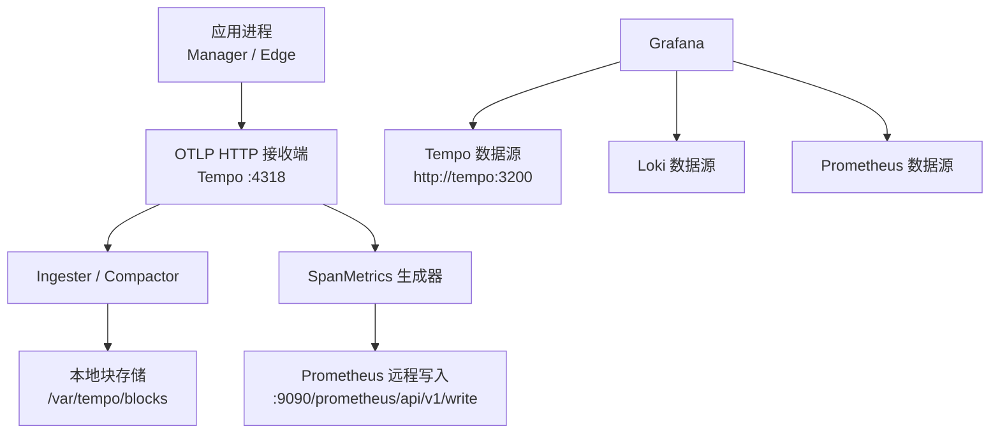
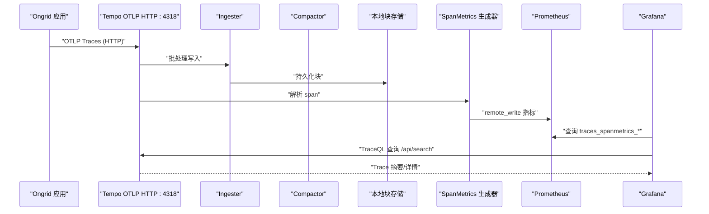
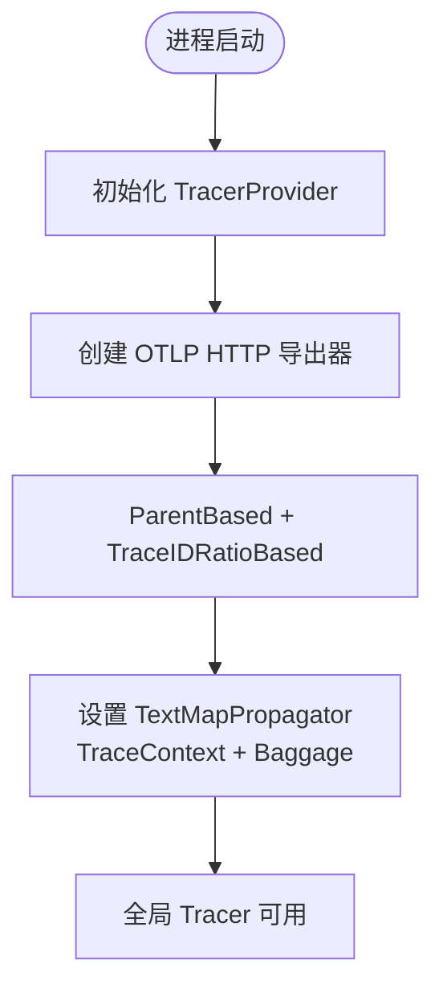
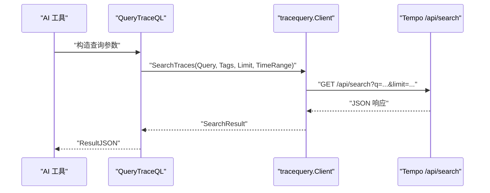
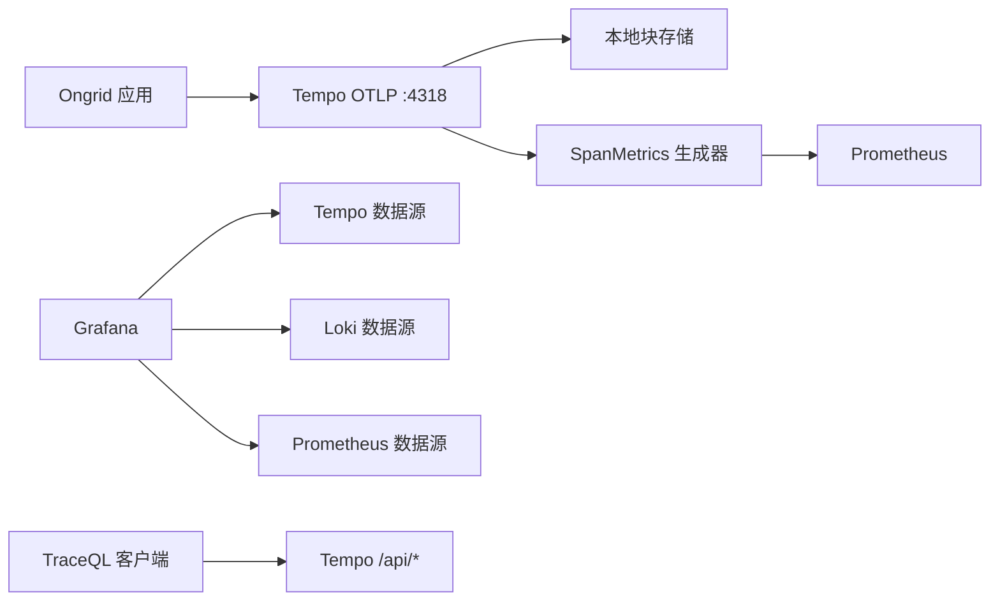

# Tempo 分布式追踪配置

<cite>
**本文引用的文件**
- [tempo-config.yaml](file://deploy/install/tempo-config.yaml)
- [tracing.go](file://internal/pkg/tracing/tracing.go)
- [main.go](file://cmd/ongrid/main.go)
- [docker-compose.yml](file://deploy/install/docker-compose.yml)
- [tempo.yml（Grafana 数据源）](file://deploy/install/grafana/provisioning/datasources/tempo.yml)
- [client.go（TraceQL 客户端）](file://internal/pkg/tracequery/client.go)
- [query_traceql.go](file://internal/manager/biz/aiops/tools/query_traceql.go)
- [probe.go](file://internal/manager/biz/setting/probe.go)
</cite>

## 目录
1. [简介](#简介)
2. [项目结构](#项目结构)
3. [核心组件](#核心组件)
4. [架构总览](#架构总览)
5. [详细组件分析](#详细组件分析)
6. [依赖关系分析](#依赖关系分析)
7. [性能与扩展性](#性能与扩展性)
8. [故障排查指南](#故障排查指南)
9. [结论](#结论)
10. [附录](#附录)

## 简介
本文件面向 Ongrid 项目中 Tempo 分布式追踪系统的落地配置与使用，覆盖以下主题：
- Tempo 核心配置：采样策略、存储后端、索引与查询优化、SpanMetrics 生成。
- 追踪数据模型：span 结构、标签定义、上下文传播机制。
- OpenTelemetry 集成：SDK 初始化、导出器设置、链路采样策略。
- Ongrid 应用埋点示例：HTTP 请求、数据库操作、异步任务。
- 查询与分析：Jaeger UI 替代方案（Grafana + Tempo）、TraceQL 查询语言、性能分析技巧。
- 部署架构与扩展性：容器编排、存储与保留策略、多租户与容量规划。

## 项目结构
Ongrid 将 Tempo 作为可观测性栈的一部分，通过 Docker Compose 部署，并通过 OpenTelemetry OTLP HTTP 接收端点接入追踪数据；Grafana 预置 Tempo 数据源以提供可视化与 TraceQL 查询能力。

图表来源
- [docker-compose.yml:404-426](file://deploy/install/docker-compose.yml#L404-L426)
- [tempo-config.yaml:6-77](file://deploy/install/tempo-config.yaml#L6-L77)
- [tempo.yml（Grafana 数据源）:1-51](file://deploy/install/grafana/provisioning/datasources/tempo.yml#L1-L51)

章节来源
- [docker-compose.yml:404-426](file://deploy/install/docker-compose.yml#L404-L426)
- [tempo-config.yaml:6-77](file://deploy/install/tempo-config.yaml#L6-L77)
- [tempo.yml（Grafana 数据源）:1-51](file://deploy/install/grafana/provisioning/datasources/tempo.yml#L1-L51)

## 核心组件
- Tempo 单二进制服务：提供 OTLP 接收、写入、压缩、查询等能力。
- SpanMetrics 生成器：从 span 派生指标并远写到 Prometheus，供 RED 面板与评估器复用。
- Grafana 数据源：预配 Tempo/Loki/Prometheus，支持 tracesToLogs、tracesToMetrics、服务拓扑。
- Ongrid OTel SDK 集成：在 Manager/Edge 启动时初始化 TracerProvider，统一上报到 Tempo。
- TraceQL 查询客户端：封装 Tempo /api/search 与 /api/traces/<id>，供 AI 工具与前端调用。

章节来源
- [tempo-config.yaml:6-77](file://deploy/install/tempo-config.yaml#L6-L77)
- [tempo.yml（Grafana 数据源）:1-51](file://deploy/install/grafana/provisioning/datasources/tempo.yml#L1-L51)
- [tracing.go:35-106](file://internal/pkg/tracing/tracing.go#L35-L106)
- [client.go:89-157](file://internal/pkg/tracequery/client.go#L89-L157)

## 架构总览
下图展示 Ongrid 中追踪数据的端到端流转：应用通过 OTLP HTTP 发送 span，Tempo 接收后落盘并生成指标，Grafana 通过数据源进行可视化与查询。

图表来源
- [tempo-config.yaml:10-77](file://deploy/install/tempo-config.yaml#L10-L77)
- [docker-compose.yml:404-426](file://deploy/install/docker-compose.yml#L404-L426)
- [tempo.yml（Grafana 数据源）:18-51](file://deploy/install/grafana/provisioning/datasources/tempo.yml#L18-L51)

## 详细组件分析

### Tempo 服务端配置
- 监听端口：HTTP 查询 :3200，gRPC 接收 :9095，OTLP 接收 :4317/:4318。
- 接收器：启用 gRPC 与 HTTP 两种 OTLP 协议。
- 写入与压缩：Ingester 超时与块时长控制；Compactor 保留 7 天，块大小约 100MB。
- SpanMetrics：维度包含 service.name、span.kind、status.code；远写至 Prometheus。
- 存储后端：本地文件系统，WAL 与块路径分离；并发池与队列深度可调。
- 覆盖参数：每租户摄入速率限制、最大 trace 大小限制。

章节来源
- [tempo-config.yaml:6-77](file://deploy/install/tempo-config.yaml#L6-L77)

### OpenTelemetry 集成（SDK 初始化与采样）
- 初始化入口：在进程启动时创建 TracerProvider，设置资源属性（service.name），配置批量导出器与采样策略。
- 采样策略：默认全量采样（SamplingRatio=1.0），可按需下调；采用 ParentBased + TraceIDRatioBased。
- 传播机制：启用 TraceContext 与 Baggage 文本映射传播，跨服务传递上下文。
- 导出器：OTLP HTTP 导出到 Tempo 的 :4318；Insecure 模式用于容器内网明文传输。
- 批处理：2 秒快速刷新，降低故障场景下的延迟。

图表来源
- [tracing.go:60-106](file://internal/pkg/tracing/tracing.go#L60-L106)
- [main.go:231-254](file://cmd/ongrid/main.go#L231-L254)

章节来源
- [tracing.go:35-106](file://internal/pkg/tracing/tracing.go#L35-L106)
- [main.go:231-254](file://cmd/ongrid/main.go#L231-L254)

### 追踪数据模型与标签
- Span 结构：遵循 OTLP 规范，包含 resourceSpans、scopeSpans、spans；Ongrid 通过客户端直接透传原始 JSON，避免版本差异带来的字段丢失。
- 关键标签：
  - resource.service.name：服务名，SpanMetrics 按此拆分系列。
  - name：span 名称（如 HTTP 方法+路径）。
  - status.code：状态码，用于错误率统计。
  - edge_id：设备标识，便于设备级过滤。
- 上下文传播：通过 TraceContext 与 Baggage 在 HTTP/gRPC 间传递，确保跨服务链路完整。

章节来源
- [client.go:16-30](file://internal/pkg/tracequery/client.go#L16-L30)
- [tempo.yml（Grafana 数据源）:20-30](file://deploy/install/grafana/provisioning/datasources/tempo.yml#L20-L30)
- [tracing.go:101-104](file://internal/pkg/tracing/tracing.go#L101-L104)

### Ongrid 应用埋点示例
- HTTP 请求追踪：在 Manager 的 HTTP 路由层使用 otelhttp 中间件自动捕获请求 span。
- 数据库操作追踪：对 DB 访问包装 span，记录 SQL 语句与耗时（建议脱敏敏感信息）。
- 异步任务追踪：为后台任务创建独立 span，关联父 span 以形成完整链路。
- 设备侧追踪：Edge 插件支持追踪管道，可配置批次大小与队列深度，保障内存与吞吐平衡。

章节来源
- [main.go:231-254](file://cmd/ongrid/main.go#L231-L254)
- [tracing.go:91-99](file://internal/pkg/tracing/tracing.go#L91-L99)
- [render.go:321-334](file://internal/edgeagent/plugins/traces/render.go#L321-L334)

### TraceQL 查询与工具
- 查询入口：AI 工具 query_traceql 支持直接 TraceQL 或基于 service/operation/device_id 构建查询。
- 时间窗口：默认最近 1 小时，可通过 start/end 指定。
- 结果返回：SearchResult 中的 traces 字段保持原始 JSON，兼容不同 Tempo 版本。
- 设备范围：当传入 device_id 时，自动注入 resource.device_id 谓词，避免与用户 query 冲突。

图表来源
- [query_traceql.go:148-275](file://internal/manager/biz/aiops/tools/query_traceql.go#L148-L275)
- [client.go:111-157](file://internal/pkg/tracequery/client.go#L111-L157)

章节来源
- [query_traceql.go:77-284](file://internal/manager/biz/aiops/tools/query_traceql.go#L77-L284)
- [client.go:89-157](file://internal/pkg/tracequery/client.go#L89-L157)

### Grafana 集成与可视化
- 数据源：预置 ongrid-tempo，指向 Tempo HTTP 查询端点。
- 链路跳转：tracesToLogs 配置将 span 跳转到 Loki 日志，支持时间偏移与标签映射。
- 指标联动：tracesToMetrics 使用 Prometheus 中的 traces_spanmetrics_* 指标绘制 RED 面板。
- 服务拓扑：启用 nodeGraph 与服务图，辅助定位瓶颈。

章节来源
- [tempo.yml（Grafana 数据源）:1-51](file://deploy/install/grafana/provisioning/datasources/tempo.yml#L1-L51)

## 依赖关系分析
- 应用依赖 OTel SDK 与 exporter，向 Tempo 发送 span。
- Tempo 依赖本地存储与 Prometheus 远写目标。
- Grafana 依赖 Tempo、Loki、Prometheus 数据源以实现跨信号关联。
- Ongrid 的 TraceQL 客户端依赖 Tempo 的 /api/search 与 /api/traces/<id>。

图表来源
- [docker-compose.yml:404-426](file://deploy/install/docker-compose.yml#L404-L426)
- [tempo-config.yaml:30-77](file://deploy/install/tempo-config.yaml#L30-L77)
- [client.go:187-243](file://internal/pkg/tracequery/client.go#L187-L243)

章节来源
- [docker-compose.yml:404-426](file://deploy/install/docker-compose.yml#L404-L426)
- [tempo-config.yaml:30-77](file://deploy/install/tempo-config.yaml#L30-L77)
- [client.go:187-243](file://internal/pkg/tracequery/client.go#L187-L243)

## 性能与扩展性
- 采样策略：默认全量采样，生产环境可根据 span 体积与存储压力调整 SamplingRatio。
- 批处理与缓冲：Exporter 批超时 2s，Ingester 块时长与 WAL 路径影响写入延迟与恢复速度。
- 存储与保留：块大小约 100MB，保留 7 天；可根据业务需求调整 compaction_window 与 retention。
- 并发与队列：pool.max_workers 与 queue_depth 影响高吞吐写入稳定性。
- 指标生成：SpanMetrics 远写 Prometheus，RED 面板复用现有查询路径，减少额外开销。
- 扩展性：通过环境变量与配置覆盖实现多租户速率限制与 per-trace 大小上限；外部化存储与查询端点可平滑迁移到托管服务。

章节来源
- [tempo-config.yaml:19-77](file://deploy/install/tempo-config.yaml#L19-L77)
- [tracing.go:91-99](file://internal/pkg/tracing/tracing.go#L91-L99)

## 故障排查指南
- 无法连接 OTLP 端点：检查网络连通性与认证（Basic Auth），使用 probe 函数验证可达性与路径。
- 无追踪数据：确认 OTel 已初始化且 Endpoint 非空；若为空则导出关闭，评估器将读到空矩阵。
- 查询缓慢：冷块搜索可能较慢，适当增大 limit 与时间窗口；关注 Tempo 日志中的非 200 响应。
- 指标缺失：确认 SpanMetrics 已启用并成功远写 Prometheus；检查 remote_write URL 与权限。
- 设备范围冲突：当同时提供 device_id 与自定义 query 时，会检测到冲突并报错，需合并谓词。

章节来源
- [probe.go:324-348](file://internal/manager/biz/setting/probe.go#L324-L348)
- [tracing.go:60-66](file://internal/pkg/tracing/tracing.go#L60-L66)
- [client.go:203-243](file://internal/pkg/tracequery/client.go#L203-L243)
- [query_traceql.go:166-179](file://internal/manager/biz/aiops/tools/query_traceql.go#L166-L179)

## 结论
Ongrid 通过标准化的 OTel 集成与 Tempo 单二进制部署，实现了轻量而高效的分布式追踪能力。配合 Grafana 的数据源预置与 TraceQL 查询，可在不引入额外复杂性的前提下完成链路可视化、指标联动与问题定位。在生产环境中，建议根据流量与存储成本合理配置采样、保留与并发参数，并持续监控 SpanMetrics 与查询性能。

## 附录
- 环境变量与配置键：
  - ONGRID_OTEL_ENDPOINT：OTLP HTTP 接收端点（默认 tempo:4318）。
  - Tempo 配置：server、distributor、ingester、compactor、storage、overrides、metrics_generator。
  - Grafana 数据源：url、tracesToLogs、tracesToMetrics、serviceMap、nodeGraph。
- 常用 TraceQL 示例：
  - 按服务名过滤：{ resource.service.name = "web" }
  - 按操作名过滤：{ name = "GET /api" }
  - 组合条件：{ resource.service.name = "web" && duration > 200ms }
  - 设备范围：{ resource.device_id = "24" && resource.service.name = "web" }

章节来源
- [main.go:231-254](file://cmd/ongrid/main.go#L231-L254)
- [tempo-config.yaml:6-77](file://deploy/install/tempo-config.yaml#L6-L77)
- [tempo.yml（Grafana 数据源）:18-51](file://deploy/install/grafana/provisioning/datasources/tempo.yml#L18-L51)
- [query_traceql.go:148-179](file://internal/manager/biz/aiops/tools/query_traceql.go#L148-L179)