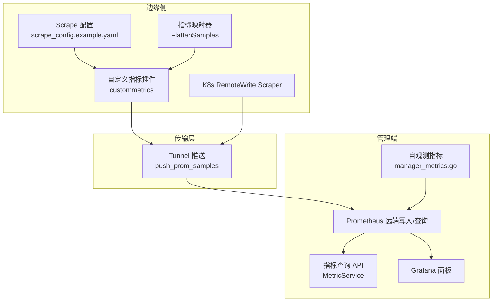
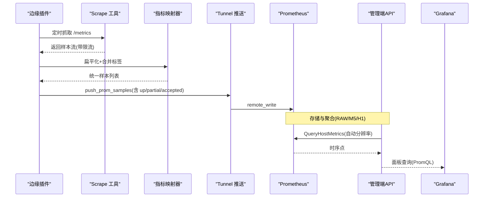
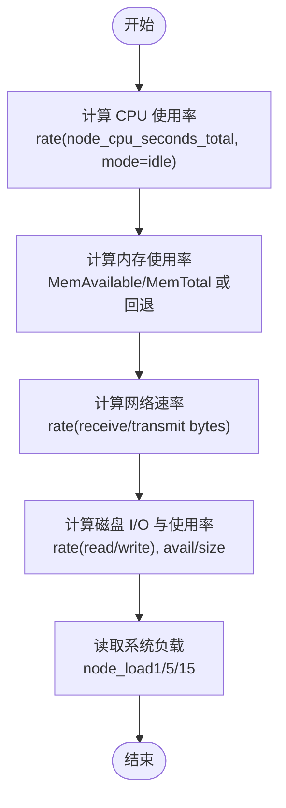
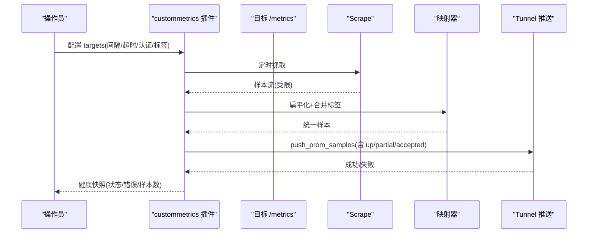
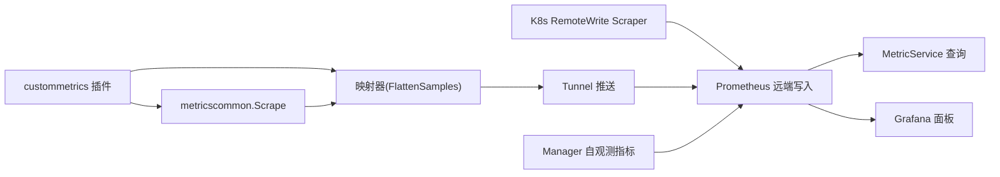

# 监控指标定义

<cite>
**本文引用的文件**
- [metric.proto](file://api/manager/metric/v1/metric.proto)
- [model.go](file://internal/edgeagent/model/model.go)
- [mapper.go](file://internal/edgeagent/collector/mapper.go)
- [scrape_config.example.yaml](file://internal/edgeagent/collector/scrape_config.example.yaml)
- [scrape.go](file://internal/edgeagent/plugins/metricscommon/scrape.go)
- [plugin.go](file://internal/edgeagent/plugins/custommetrics/plugin.go)
- [remote_write_scraper.go](file://internal/edgeagent/k8s/remote_write_scraper.go)
- [promql.go](file://internal/manager/biz/aiops/alertdraft/promql.go)
- [service.go](file://internal/manager/biz/grafana/service.go)
- [EdgeDetail.tsx](file://web/src/pages/EdgeDetail.tsx)
- [prometheus.yml](file://deploy/prometheus/prometheus.yml)
- [manager_metrics.go](file://internal/pkg/prom/manager_metrics.go)
</cite>

## 目录
1. [简介](#简介)
2. [项目结构](#项目结构)
3. [核心组件](#核心组件)
4. [架构总览](#架构总览)
5. [详细组件分析](#详细组件分析)
6. [依赖关系分析](#依赖关系分析)
7. [性能考量](#性能考量)
8. [故障排查指南](#故障排查指南)
9. [结论](#结论)
10. [附录](#附录)

## 简介
本规范围绕 Ongrid 的监控指标体系，统一命名约定、分类与类型选择，覆盖系统级指标（CPU、内存、网络、磁盘 I/O）、业务指标与自定义指标的采集、注册、推送与查询。文档同时给出元数据管理（标签、单位、描述）与质量评估、最佳实践，帮助在边缘侧与管理端一致地构建可观测性能力。

## 项目结构
Ongrid 的指标体系由“边缘采集 → 隧道推送 → 远端写入/聚合 → 查询与展示”构成：
- 边缘侧负责从本地或目标 /metrics 拉取指标，转换为统一的样本并推送至云端。
- 管理端提供指标查询 API、告警规则与 Grafana 面板，以及自身可观测性指标。
- Prometheus 作为远端存储与计算后端，支持远程写入与查询。

图表来源
- [plugin.go:135-211](file://internal/edgeagent/plugins/custommetrics/plugin.go#L135-L211)
- [remote_write_scraper.go:135-189](file://internal/edgeagent/k8s/remote_write_scraper.go#L135-L189)
- [mapper.go:64-137](file://internal/edgeagent/collector/mapper.go#L64-L137)
- [prometheus.yml:1-28](file://deploy/prometheus/prometheus.yml#L1-L28)
- [manager_metrics.go:155-317](file://internal/pkg/prom/manager_metrics.go#L155-L317)

章节来源
- [scrape_config.example.yaml:1-30](file://internal/edgeagent/collector/scrape_config.example.yaml#L1-L30)
- [prometheus.yml:1-28](file://deploy/prometheus/prometheus.yml#L1-L28)

## 核心组件
- 指标模型与协议
  - 主机指标点结构定义了 CPU、内存、负载、网络收发速率、磁盘使用率等标准字段，用于跨端一致表达。
  - 查询接口支持按时间窗口与分辨率读取原始或聚合时序点。
- 指标采集与转换
  - 通过 Scrape 拉取 Prometheus 文本格式指标，流式解析并限制样本数，避免高基数与内存膨胀。
  - 将不同指标类型（计数器、仪表盘、直方图、摘要）扁平化为统一样本集合，附加源标签与时间戳。
- 推送与写入
  - 边缘侧通过 Tunnel 推送样本到云端；K8s 场景支持直接 remote_write 到远端存储。
- 查询与可视化
  - 管理端暴露指标查询 API；Grafana 面板基于 PromQL 展示系统指标；前端页面也包含常用 PromQL 表达式。
- 自观测指标
  - 管理端注册内部运行指标（HTTP、LLM、数据库连接池、告警评估延迟等），便于运维观察。

章节来源
- [metric.proto:9-54](file://api/manager/metric/v1/metric.proto#L9-L54)
- [model.go:10-21](file://internal/edgeagent/model/model.go#L10-L21)
- [scrape.go:22-92](file://internal/edgeagent/plugins/metricscommon/scrape.go#L22-L92)
- [mapper.go:64-137](file://internal/edgeagent/collector/mapper.go#L64-L137)
- [plugin.go:187-229](file://internal/edgeagent/plugins/custommetrics/plugin.go#L187-L229)
- [remote_write_scraper.go:135-189](file://internal/edgeagent/k8s/remote_write_scraper.go#L135-L189)
- [manager_metrics.go:155-317](file://internal/pkg/prom/manager_metrics.go#L155-L317)

## 架构总览
下图展示了从边缘采集到云端可视化的端到端流程，包括健康探针与状态上报。

图表来源
- [plugin.go:135-211](file://internal/edgeagent/plugins/custommetrics/plugin.go#L135-L211)
- [scrape.go:74-115](file://internal/edgeagent/plugins/metricscommon/scrape.go#L74-L115)
- [mapper.go:64-137](file://internal/edgeagent/collector/mapper.go#L64-L137)
- [metric.proto:12-54](file://api/manager/metric/v1/metric.proto#L12-L54)

## 详细组件分析

### 指标命名约定与分类体系
- 命名约定
  - 系统指标沿用 node_* 系列（如 node_cpu_seconds_total、node_memory_MemTotal_bytes、node_filesystem_*、node_network_*、node_load*）。
  - 业务指标建议以领域前缀区分（例如 app_、db_、queue_），保持低基数且语义清晰。
  - 自定义指标通过插件 SourceLabel 标注来源（如 scrape:<name>、k8s-app-metrics），便于过滤与溯源。
- 分类体系
  - 系统指标：CPU、内存、负载、网络、磁盘 I/O、文件系统、内核表（conntrack）等。
  - 业务指标：应用请求总量、错误率、队列长度、缓存命中率等。
  - 自定义指标：第三方 exporter 暴露的指标，经边缘侧抓取后统一推送。

章节来源
- [promql.go:492-522](file://internal/manager/biz/aiops/alertdraft/promql.go#L492-L522)
- [EdgeDetail.tsx:322-332](file://web/src/pages/EdgeDetail.tsx#L322-L332)
- [scrape_config.example.yaml:9-30](file://internal/edgeagent/collector/scrape_config.example.yaml#L9-L30)

### 指标类型选择与适用场景
- 计数器（Counter）
  - 适用于单调递增的事件计数，如请求总数、错误数、令牌消耗。
  - 在扁平化时直接输出为单一样本。
- 仪表盘（Gauge）
  - 适用于瞬时值，如 CPU 使用率、内存占用、连接数。
  - 适合做阈值告警与实时看板。
- 直方图（Histogram）
  - 适用于分布统计，如请求耗时、响应大小。
  - 扁平化时输出每个桶（le=上界）的累积计数，以及 _sum 与 _count。
- 摘要（Summary）
  - 适用于分位数统计，如 p95/p99 延迟。
  - 扁平化时输出每个 quantile 的值，以及 _sum 与 _count。

章节来源
- [mapper.go:64-137](file://internal/edgeagent/collector/mapper.go#L64-L137)

### Ongrid 核心系统指标采集实现
- CPU 使用率
  - 通过 idle 模式的 rate(node_cpu_seconds_total) 计算百分比。
- 内存消耗
  - 优先使用 MemAvailable/MemTotal 计算占比；缺失时回退到 MemFree+Buffers+Cached。
- 网络流量
  - 使用 receive/transmit 字节率的 rate 计算 bps。
- 磁盘 I/O
  - 使用 read/write 字节率的 rate 计算吞吐；文件系统使用率基于 avail/size。
- 负载
  - 直接使用 node_load1/5/15。

图表来源
- [promql.go:492-522](file://internal/manager/biz/aiops/alertdraft/promql.go#L492-L522)
- [mapper.go:175-225](file://internal/edgeagent/collector/mapper.go#L175-L225)

章节来源
- [promql.go:492-522](file://internal/manager/biz/aiops/alertdraft/promql.go#L492-L522)
- [mapper.go:175-225](file://internal/edgeagent/collector/mapper.go#L175-L225)

### 自定义指标开发指南
- 指标注册
  - 通过插件配置 targets 指定 /metrics URL、认证方式、静态标签与采集间隔。
  - 支持 bearer token、basic auth、TLS 选项与超时控制。
- 数据采集
  - 使用 Scrape 进行流式解析，限制样本上限，避免高基数与内存压力。
  - 扁平化时将不同指标类型转为统一样本，附加 source、target、kind 等标签。
- 性能优化
  - 设置合理的 Interval 与 Timeout，避免频繁抓取导致资源紧张。
  - 使用 LabelDrop 删除高基数或不必要的标签。
  - 利用 SampleLimit 保护边缘进程稳定性。
- 健康与状态
  - 每次抓取都会上报 up 状态；失败时记录 last_error 与 samples 数量。
  - 支持 partial 与 accepted samples 指标，便于判断是否被截断。

图表来源
- [scrape_config.example.yaml:9-30](file://internal/edgeagent/collector/scrape_config.example.yaml#L9-L30)
- [scrape.go:74-115](file://internal/edgeagent/plugins/metricscommon/scrape.go#L74-L115)
- [plugin.go:135-211](file://internal/edgeagent/plugins/custommetrics/plugin.go#L135-L211)

章节来源
- [scrape_config.example.yaml:1-30](file://internal/edgeagent/collector/scrape_config.example.yaml#L1-L30)
- [scrape.go:22-92](file://internal/edgeagent/plugins/metricscommon/scrape.go#L22-L92)
- [plugin.go:67-229](file://internal/edgeagent/plugins/custommetrics/plugin.go#L67-L229)

### 指标元数据管理（标签、单位、描述）
- 标签设计
  - 稳定低基数：device_id、namespace、pod、app、kind、source、target_id、target_name。
  - 避免将 URL、错误消息等放入标签，防止基数爆炸。
  - 使用 SourceLabel 标识数据来源（如 scrape:<name>、k8s-app-metrics）。
- 单位定义
  - 速率类使用 bps（字节每秒），百分比使用 percent，字节使用 bytes，秒使用 seconds。
  - 在面板中明确单位，便于统一解读。
- 描述信息
  - 指标 Help 应说明含义、单位与典型用法；在 Grafana 面板标题中体现业务含义。

章节来源
- [scrape.go:150-213](file://internal/edgeagent/plugins/metricscommon/scrape.go#L150-L213)
- [service.go:597-605](file://internal/manager/biz/grafana/service.go#L597-L605)

### 指标质量评估与监控最佳实践
- 质量评估
  - 使用 up 指标判断目标可达性；partial 与 accepted samples 判断抓取完整性。
  - 对高基数指标进行标签裁剪与采样限制。
- 最佳实践
  - 合理设置采集间隔与超时，避免过载。
  - 对关键路径（核心 endpoint）与可选路径（应用发现）分别保障就绪状态。
  - 使用自动分辨率查询（RAW/M5/H1）平衡精度与成本。
  - 在告警中使用 PromQL 直接比较（如 cpu_pct > 90），减少客户端重复计算。

章节来源
- [remote_write_scraper.go:125-189](file://internal/edgeagent/k8s/remote_write_scraper.go#L125-L189)
- [promql.go:492-522](file://internal/manager/biz/aiops/alertdraft/promql.go#L492-L522)

## 依赖关系分析
- 边缘侧依赖
  - custommetrics 插件依赖 metricscommon 的 Scrape 与状态上报。
  - K8s scraper 依赖 Kubernetes API 与应用发现，并通过 remote_write 写入。
- 管理端依赖
  - MetricService 依赖 Prometheus 进行查询；Grafana 面板依赖 PromQL。
  - 自观测指标依赖 prometheus client_golang 注册与观测。

图表来源
- [plugin.go:135-211](file://internal/edgeagent/plugins/custommetrics/plugin.go#L135-L211)
- [scrape.go:74-115](file://internal/edgeagent/plugins/metricscommon/scrape.go#L74-L115)
- [remote_write_scraper.go:135-189](file://internal/edgeagent/k8s/remote_write_scraper.go#L135-L189)
- [manager_metrics.go:155-317](file://internal/pkg/prom/manager_metrics.go#L155-L317)

章节来源
- [plugin.go:135-211](file://internal/edgeagent/plugins/custommetrics/plugin.go#L135-L211)
- [remote_write_scraper.go:135-189](file://internal/edgeagent/k8s/remote_write_scraper.go#L135-L189)
- [manager_metrics.go:155-317](file://internal/pkg/prom/manager_metrics.go#L155-L317)

## 性能考量
- 采集频率与超时
  - 默认间隔 30s，超时 5s；可根据目标稳定性调整。
- 样本限制
  - 使用 SampleLimit 与 BatchSampleLimit 控制单次抓取与批处理的样本量，避免内存与带宽压力。
- 标签基数控制
  - 使用 LabelDrop 删除不必要的高基数标签；避免将动态值（URL、错误）作为标签。
- 聚合策略
  - 查询时使用 AUTO 分辨率自动选择 RAW/M5/H1，兼顾精度与成本。

章节来源
- [scrape.go:22-92](file://internal/edgeagent/plugins/metricscommon/scrape.go#L22-L92)
- [remote_write_scraper.go:62-123](file://internal/edgeagent/k8s/remote_write_scraper.go#L62-L123)
- [metric.proto:19-54](file://api/manager/metric/v1/metric.proto#L19-L54)

## 故障排查指南
- 常见问题
  - 抓取失败：检查目标 URL、认证、TLS 设置与超时；查看 up 与 last_error。
  - 样本过多：启用 SampleLimit 与 LabelDrop；降低采集频率。
  - 部分抓取：关注 partial 与 accepted samples，确认上游是否截断。
  - 就绪状态：K8s 场景下确保核心 endpoint 与 remote_write 正常；应用发现失败不影响核心就绪。
- 诊断步骤
  - 查看插件健康快照（状态、错误、样本数）。
  - 检查 Prometheus 接收到的样本与标签。
  - 使用 PromQL 验证指标是否存在与数值合理。

章节来源
- [plugin.go:187-229](file://internal/edgeagent/plugins/custommetrics/plugin.go#L187-L229)
- [remote_write_scraper.go:125-189](file://internal/edgeagent/k8s/remote_write_scraper.go#L125-L189)

## 结论
Ongrid 的监控指标体系以标准化模型与统一采集流程为核心，结合灵活的自定义指标扩展与稳健的远端写入机制，实现了从边缘到云端的完整可观测性闭环。遵循本规范的命名、类型选择与元数据管理，可有效提升指标质量与可维护性，支撑告警、分析与可视化需求。

## 附录
- 常用 PromQL 示例
  - CPU 使用率：100 * (1 - avg by (device_id) (rate(node_cpu_seconds_total{mode="idle"}[5m])))
  - 内存使用率：100 * (1 - node_memory_MemAvailable_bytes / node_memory_MemTotal_bytes)
  - 网络速率：sum by (device_id) (rate(node_network_receive_bytes_total[1m]))
  - 磁盘 I/O 吞吐：sum by (device_id) (rate(node_disk_read_bytes_total[$__rate_interval])) + sum by (device_id) (rate(node_disk_written_bytes_total[$__rate_interval]))
- 面板与查询
  - Grafana 面板已内置系统指标视图；前端页面提供设备维度的 PromQL 表达式。

章节来源
- [promql.go:492-522](file://internal/manager/biz/aiops/alertdraft/promql.go#L492-L522)
- [service.go:597-605](file://internal/manager/biz/grafana/service.go#L597-L605)
- [EdgeDetail.tsx:322-332](file://web/src/pages/EdgeDetail.tsx#L322-L332)