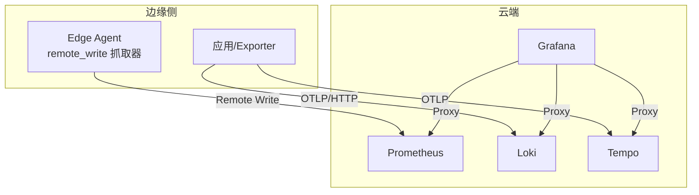
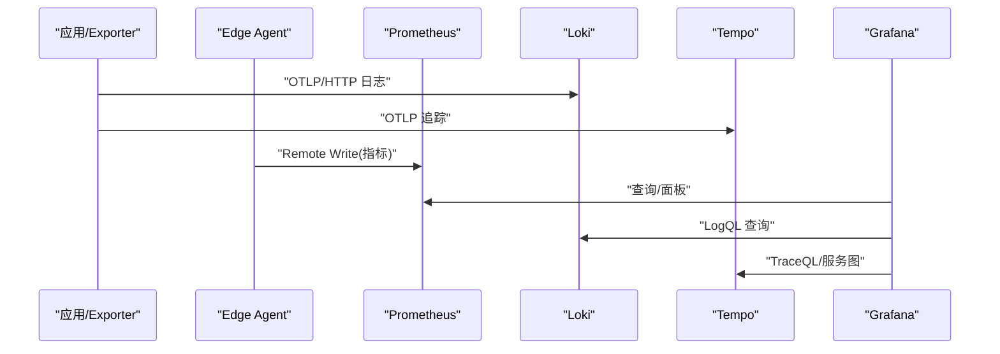
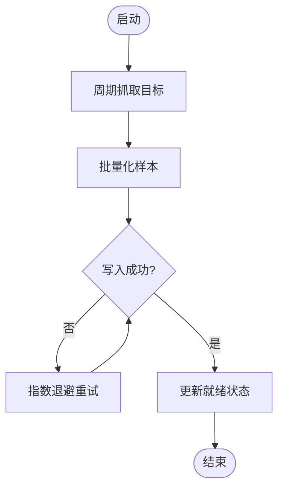
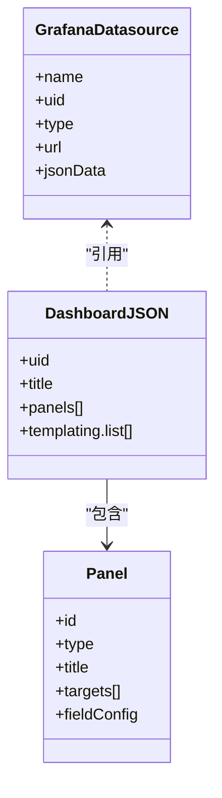
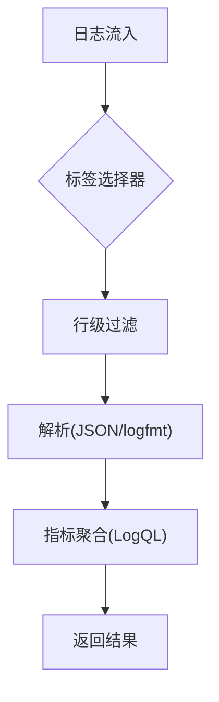
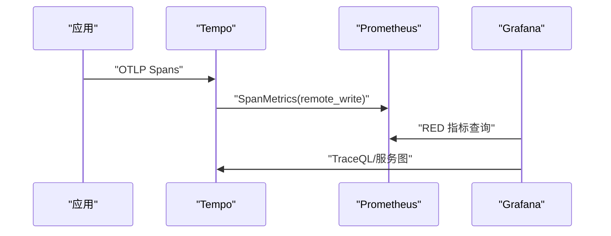
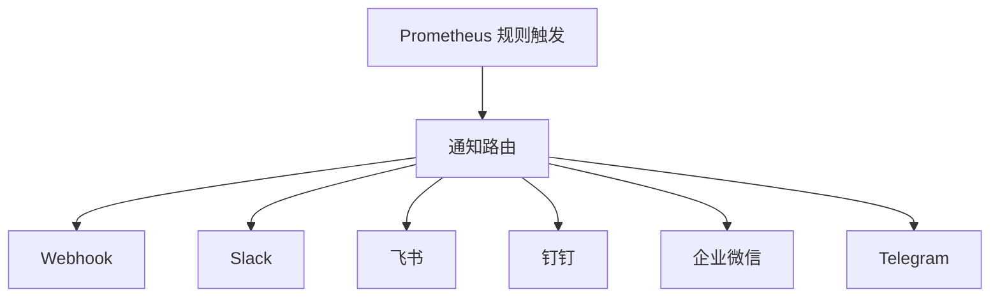
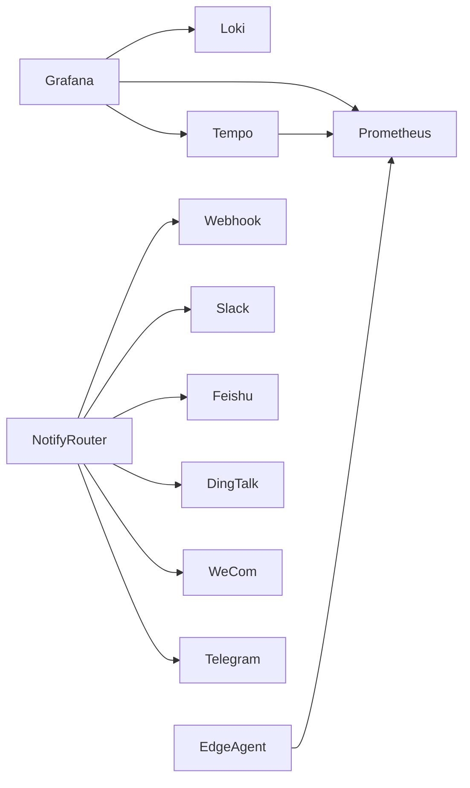

# 监控配置

<cite>
**本文引用的文件**
- [deploy/install/prometheus.yml](file://deploy/install/prometheus.yml)
- [deploy/install/prometheus-rules.yml](file://deploy/install/prometheus-rules.yml)
- [deploy/grafana/provisioning/datasources/prometheus.yml](file://deploy/grafana/provisioning/datasources/prometheus.yml)
- [deploy/grafana/provisioning/datasources/loki.yml](file://deploy/grafana/provisioning/datasources/loki.yml)
- [deploy/grafana/provisioning/datasources/tempo.yml](file://deploy/grafana/provisioning/datasources/tempo.yml)
- [deploy/grafana/provisioning/dashboards/default.yml](file://deploy/grafana/provisioning/dashboards/default.yml)
- [deploy/grafana/provisioning/dashboards/json/server-detail.json](file://deploy/grafana/provisioning/dashboards/json/server-detail.json)
- [deploy/install/loki-config.yaml](file://deploy/install/loki-config.yaml)
- [deploy/install/tempo-config.yaml](file://deploy/install/tempo-config.yaml)
- [internal/edgeagent/k8s/remote_write_scraper.go](file://internal/edgeagent/k8s/remote_write_scraper.go)
- [internal/pkg/tracing/tracing.go](file://internal/pkg/tracing/tracing.go)
- [internal/manager/model/setting/model.go](file://internal/manager/model/setting/model.go)
- [web/src/api/grafana.ts](file://web/src/api/grafana.ts)
- [internal/manager/biz/grafana/service.go](file://internal/manager/biz/grafana/service.go)
- [internal/manager/model/monitor/model.go](file://internal/manager/model/monitor/model.go)
- [internal/manager/data/alert/store/seed.go](file://internal/manager/data/alert/store/seed.go)
- [internal/pkg/notify/notify.go](file://internal/pkg/notify/notify.go)
- [internal/pkg/notify/webhook.go](file://internal/pkg/notify/webhook.go)
- [internal/manager/model/alert/model.go](file://internal/manager/model/alert/model.go)
- [internal/manager/biz/logs/query_logql.go](file://internal/manager/biz/logs/query_logql.go)
</cite>

## 目录
1. [简介](#简介)
2. [项目结构](#项目结构)
3. [核心组件](#核心组件)
4. [架构总览](#架构总览)
5. [详细组件分析](#详细组件分析)
6. [依赖关系分析](#依赖关系分析)
7. [性能与容量规划](#性能与容量规划)
8. [故障排查指南](#故障排查指南)
9. [结论](#结论)
10. [附录：指标、告警与通知清单](#附录指标告警与通知清单)

## 简介
本指南面向部署与运维人员，系统化说明 ongrid 内置可观测性栈的配置与使用，覆盖 Prometheus（采集、存储、远程写入、查询优化）、Grafana（数据源、仪表板模板、自定义面板）、Loki（日志聚合、索引策略、分片与查询调优）、Tempo（分布式追踪、采样、存储后端、链路分析），以及告警规则与通知渠道。内容基于仓库中实际配置文件与实现代码，确保落地可用。

## 项目结构
- 可观测性组件配置集中在 deploy/install 与 deploy/grafana/provisioning 下，分别对应 Prometheus/Loki/Tempo 运行时配置与 Grafana 数据源与仪表板预置。
- 边缘侧通过 remote_write 将指标推送到云端 Prometheus；追踪通过 OTLP 推送至 Tempo；日志通过 OTLP/HTTP 推送至 Loki。
- 管理端提供对 Grafana 的代理访问与动态面板同步能力，并在设置页暴露 Loki/Tempo 集成配置项。

图表来源
- [deploy/install/prometheus.yml:16-25](file://deploy/install/prometheus.yml#L16-L25)
- [deploy/install/loki-config.yaml:6-8](file://deploy/install/loki-config.yaml#L6-L8)
- [deploy/install/tempo-config.yaml:6-17](file://deploy/install/tempo-config.yaml#L6-L17)
- [deploy/grafana/provisioning/datasources/prometheus.yml:3-10](file://deploy/grafana/provisioning/datasources/prometheus.yml#L3-L10)
- [deploy/grafana/provisioning/datasources/loki.yml:6-19](file://deploy/grafana/provisioning/datasources/loki.yml#L6-L19)
- [deploy/grafana/provisioning/datasources/tempo.yml:8-50](file://deploy/grafana/provisioning/datasources/tempo.yml#L8-L50)

章节来源
- [deploy/install/prometheus.yml:1-36](file://deploy/install/prometheus.yml#L1-L36)
- [deploy/install/loki-config.yaml:1-76](file://deploy/install/loki-config.yaml#L1-L76)
- [deploy/install/tempo-config.yaml:1-77](file://deploy/install/tempo-config.yaml#L1-L77)
- [deploy/grafana/provisioning/datasources/prometheus.yml:1-11](file://deploy/grafana/provisioning/datasources/prometheus.yml#L1-L11)
- [deploy/grafana/provisioning/datasources/loki.yml:1-20](file://deploy/grafana/provisioning/datasources/loki.yml#L1-L20)
- [deploy/grafana/provisioning/datasources/tempo.yml:1-51](file://deploy/grafana/provisioning/datasources/tempo.yml#L1-L51)

## 核心组件
- Prometheus：负责指标采集、规则评估与远程写入接收；默认采集自身与 ongrid 管理器，并通过命令行启用远程写入接收器。
- Grafana：通过 provisioning 预置数据源与仪表板；支持从 manager 代理获取仪表板 JSON 并原生渲染面板。
- Loki：单节点模式，TSDB 索引 + 文件系统对象存储；限制流基数与查询范围，启用结构化元数据以兼容 OTLP 日志。
- Tempo：单二进制模式，OTLP 接收，SpanMetrics 生成 RED 指标并 remote_write 到 Prometheus；本地块存储与 WAL。
- 边缘侧 Remote Write Scraper：周期性抓取目标指标并批量推送至云端 Prometheus，支持 K8s 应用发现与重试退避。
- 追踪 SDK：初始化 OTLP HTTP 导出器，支持采样率与 TLS 开关。

章节来源
- [deploy/install/prometheus.yml:6-25](file://deploy/install/prometheus.yml#L6-L25)
- [deploy/install/loki-config.yaml:21-59](file://deploy/install/loki-config.yaml#L21-L59)
- [deploy/install/tempo-config.yaml:10-50](file://deploy/install/tempo-config.yaml#L10-L50)
- [internal/edgeagent/k8s/remote_write_scraper.go:135-189](file://internal/edgeagent/k8s/remote_write_scraper.go#L135-L189)
- [internal/pkg/tracing/tracing.go:35-73](file://internal/pkg/tracing/tracing.go#L35-L73)

## 架构总览
下图展示 ongrid 可观测性栈的数据流向与关键交互点：边缘侧通过 remote_write 上报指标，应用直接推送日志与追踪到 Loki/Tempo，Grafana 作为统一可视化入口，通过代理访问各后端。

图表来源
- [deploy/install/prometheus.yml:16-25](file://deploy/install/prometheus.yml#L16-L25)
- [deploy/install/loki-config.yaml:6-8](file://deploy/install/loki-config.yaml#L6-L8)
- [deploy/install/tempo-config.yaml:10-17](file://deploy/install/tempo-config.yaml#L10-L17)
- [deploy/grafana/provisioning/datasources/prometheus.yml:3-10](file://deploy/grafana/provisioning/datasources/prometheus.yml#L3-L10)
- [deploy/grafana/provisioning/datasources/loki.yml:6-19](file://deploy/grafana/provisioning/datasources/loki.yml#L6-L19)
- [deploy/grafana/provisioning/datasources/tempo.yml:8-50](file://deploy/grafana/provisioning/datasources/tempo.yml#L8-L50)

## 详细组件分析

### Prometheus 配置与优化
- 数据采集目标
  - 自采集 prometheus 自身 /prometheus/metrics。
  - 采集 ongrid 管理器指标（job: ongrid-manager）。
  - 边缘侧主机与进程指标通过 edge → tunnel push → remote_write 回传，不再在云端直接 scrape。
- 存储策略
  - 通过命令行启用远程写入接收器；规则文件挂载为 rules.yml，支持热加载。
- 远程写入
  - 边缘侧 scraper 周期性抓取并批量写入云端 Prometheus，具备重试与就绪状态。
- 查询优化
  - 合理设置 scrape_interval/evaluation_interval；避免高基数字段；结合业务指标命名规范减少标签爆炸。

图表来源
- [internal/edgeagent/k8s/remote_write_scraper.go:135-189](file://internal/edgeagent/k8s/remote_write_scraper.go#L135-L189)
- [internal/edgeagent/k8s/remote_write_scraper.go:228-255](file://internal/edgeagent/k8s/remote_write_scraper.go#L228-L255)

章节来源
- [deploy/install/prometheus.yml:6-25](file://deploy/install/prometheus.yml#L6-L25)
- [internal/edgeagent/k8s/remote_write_scraper.go:98-123](file://internal/edgeagent/k8s/remote_write_scraper.go#L98-L123)
- [internal/edgeagent/k8s/remote_write_scraper.go:135-189](file://internal/edgeagent/k8s/remote_write_scraper.go#L135-L189)
- [internal/edgeagent/k8s/remote_write_scraper.go:228-255](file://internal/edgeagent/k8s/remote_write_scraper.go#L228-L255)

### Grafana 仪表板与数据源
- 数据源
  - Prometheus：默认数据源，代理访问云端 Prometheus。
  - Loki：通过环境变量注入 URL，支持超时与最大行数等参数。
  - Tempo：开启 tracesToLogs、tracesToMetrics、serviceMap、nodeGraph 等联动能力。
- 仪表板模板
  - 通过 provisioning 自动加载 JSON 仪表板；server-detail.json 提供服务器 CPU/内存/负载/网络示例。
  - 管理端可从 Grafana 拉取仪表板 JSON 并在 SPA 内原生渲染面板，无需 iframe。
- 自定义面板开发
  - 用户可在 ongrid 设置中创建/编辑面板，系统将其映射为 Grafana 面板 JSON 并同步到 Grafana 仪表板，布局按两列网格排列。

图表来源
- [deploy/grafana/provisioning/datasources/prometheus.yml:3-10](file://deploy/grafana/provisioning/datasources/prometheus.yml#L3-L10)
- [deploy/grafana/provisioning/datasources/loki.yml:6-19](file://deploy/grafana/provisioning/datasources/loki.yml#L6-L19)
- [deploy/grafana/provisioning/datasources/tempo.yml:8-50](file://deploy/grafana/provisioning/datasources/tempo.yml#L8-L50)
- [deploy/grafana/provisioning/dashboards/json/server-detail.json:23-406](file://deploy/grafana/provisioning/dashboards/json/server-detail.json#L23-L406)
- [web/src/api/grafana.ts:60-87](file://web/src/api/grafana.ts#L60-L87)
- [internal/manager/biz/grafana/service.go:607-651](file://internal/manager/biz/grafana/service.go#L607-L651)
- [internal/manager/model/monitor/model.go:1-21](file://internal/manager/model/monitor/model.go#L1-L21)

章节来源
- [deploy/grafana/provisioning/datasources/prometheus.yml:1-11](file://deploy/grafana/provisioning/datasources/prometheus.yml#L1-L11)
- [deploy/grafana/provisioning/datasources/loki.yml:1-20](file://deploy/grafana/provisioning/datasources/loki.yml#L1-L20)
- [deploy/grafana/provisioning/datasources/tempo.yml:1-51](file://deploy/grafana/provisioning/datasources/tempo.yml#L1-L51)
- [deploy/grafana/provisioning/dashboards/default.yml:1-14](file://deploy/grafana/provisioning/dashboards/default.yml#L1-L14)
- [deploy/grafana/provisioning/dashboards/json/server-detail.json:1-457](file://deploy/grafana/provisioning/dashboards/json/server-detail.json#L1-L457)
- [web/src/api/grafana.ts:1-87](file://web/src/api/grafana.ts#L1-L87)
- [internal/manager/biz/grafana/service.go:607-651](file://internal/manager/biz/grafana/service.go#L607-L651)
- [internal/manager/model/monitor/model.go:1-21](file://internal/manager/model/monitor/model.go#L1-L21)

### Loki 日志聚合配置
- 索引策略
  - schema v13，TSDB 索引，period 24h，prefix index_；对象存储使用 filesystem。
- 分片与限制
  - 单节点 ring inmemory；limits_config 限制 per-user 流数量、查询系列数、查询回溯时间；保留期 30 天。
- 查询性能调优
  - 优先用低基数字段过滤；先做行级过滤再解析 JSON/logfmt；控制 max_query_series 与 max_query_lookback。
- 与 Grafana 集成
  - 数据源通过环境变量注入 URL；支持 timeout 与 maxLines；tracesToLogs 联动需正确配置 tag 映射。

图表来源
- [deploy/install/loki-config.yaml:21-59](file://deploy/install/loki-config.yaml#L21-L59)
- [internal/manager/biz/logs/query_logql.go:16-49](file://internal/manager/biz/logs/query_logql.go#L16-L49)

章节来源
- [deploy/install/loki-config.yaml:1-76](file://deploy/install/loki-config.yaml#L1-L76)
- [deploy/grafana/provisioning/datasources/loki.yml:1-20](file://deploy/grafana/provisioning/datasources/loki.yml#L1-L20)
- [internal/manager/biz/logs/query_logql.go:16-49](file://internal/manager/biz/logs/query_logql.go#L16-L49)

### Tempo 分布式追踪配置
- 采样策略
  - 应用侧 SDK 支持 SamplingRatio（0..1）；生产建议根据 QPS 调整；Tail sampling 建议在 Collector 层配置。
- 存储后端
  - 本地块存储与 WAL；compactor 保留 7 天；ingester 块大小与时长可调。
- 链路分析
  - SpanMetrics 生成 RED 指标并 remote_write 到 Prometheus；Grafana 启用 serviceMap/nodeGraph；tracesToLogs 支持从 span 跳转到日志。
- 查询与成本
  - TraceQL 适合按 trace_id 精确查找；跨属性扫描成本高，建议通过 metrics-generator 派生指标进行快速定位。

图表来源
- [deploy/install/tempo-config.yaml:10-50](file://deploy/install/tempo-config.yaml#L10-L50)
- [internal/pkg/tracing/tracing.go:35-73](file://internal/pkg/tracing/tracing.go#L35-L73)
- [deploy/grafana/provisioning/datasources/tempo.yml:18-50](file://deploy/grafana/provisioning/datasources/tempo.yml#L18-L50)

章节来源
- [deploy/install/tempo-config.yaml:1-77](file://deploy/install/tempo-config.yaml#L1-L77)
- [internal/pkg/tracing/tracing.go:35-73](file://internal/pkg/tracing/tracing.go#L35-L73)
- [deploy/grafana/provisioning/datasources/tempo.yml:1-51](file://deploy/grafana/provisioning/datasources/tempo.yml#L1-L51)

### 监控指标定义与采集展示
- 系统指标
  - 通过 node_* 系列指标（CPU、内存、负载、网络）在 server-detail.json 中展示。
- 业务指标
  - 通过 ongrid 管理器自监控指标（如 LLM 调用错误率、HTTP 5xx 比率、数据库连接池利用率）用于健康度评估。
- 自定义指标
  - 在 ongrid 设置中新增面板，系统将 PromQL 映射为 Grafana 面板并同步展示；支持单位、阈值与图例格式。

章节来源
- [deploy/grafana/provisioning/dashboards/json/server-detail.json:23-406](file://deploy/grafana/provisioning/dashboards/json/server-detail.json#L23-L406)
- [deploy/install/prometheus-rules.yml:12-79](file://deploy/install/prometheus-rules.yml#L12-L79)
- [internal/manager/model/monitor/model.go:1-21](file://internal/manager/model/monitor/model.go#L1-L21)
- [internal/manager/biz/grafana/service.go:607-651](file://internal/manager/biz/grafana/service.go#L607-L651)

### 告警规则与通知渠道
- 告警规则
  - 内置 ongrid-self 组规则，覆盖管理器存活、会话泄漏、LLM 错误率、数据库池饱和、评估器停滞、API 5xx 比率等。
  - 所有规则携带 source="self"，便于区分系统自监控与业务告警。
- 通知渠道
  - 支持 Webhook、Slack、飞书、钉钉、企业微信、Telegram；可通过环境变量或 UI 配置；发送时支持签名与格式化。
  - 启动时会从配置同步通知渠道，禁用通道标记为 enabled=false 而非删除，保证投递记录外键完整。

图表来源
- [deploy/install/prometheus-rules.yml:7-79](file://deploy/install/prometheus-rules.yml#L7-L79)
- [internal/manager/data/alert/store/seed.go:13-37](file://internal/manager/data/alert/store/seed.go#L13-L37)
- [internal/pkg/notify/notify.go:67-90](file://internal/pkg/notify/notify.go#L67-L90)
- [internal/pkg/notify/webhook.go:18-45](file://internal/pkg/notify/webhook.go#L18-L45)
- [internal/manager/model/alert/model.go:186-203](file://internal/manager/model/alert/model.go#L186-L203)

章节来源
- [deploy/install/prometheus-rules.yml:1-79](file://deploy/install/prometheus-rules.yml#L1-L79)
- [internal/manager/data/alert/store/seed.go:13-37](file://internal/manager/data/alert/store/seed.go#L13-L37)
- [internal/pkg/notify/notify.go:67-90](file://internal/pkg/notify/notify.go#L67-L90)
- [internal/pkg/notify/webhook.go:18-45](file://internal/pkg/notify/webhook.go#L18-L45)
- [internal/manager/model/alert/model.go:186-203](file://internal/manager/model/alert/model.go#L186-L203)

## 依赖关系分析
- 组件耦合
  - Grafana 通过数据源配置依赖 Prometheus/Loki/Tempo；Tempo 的 SpanMetrics 依赖 Prometheus 作为远端写入目标。
  - 边缘侧 remote_write 依赖云端 Prometheus 的远程写入接收器；若不可用则影响指标可达性。
- 外部依赖
  - 通知渠道依赖外部 webhook/IM 平台；需确保网络连通性与鉴权配置正确。
- 潜在循环依赖
  - 无直接循环；但需注意 Grafana 与后端服务的可用性，避免级联失败。

图表来源
- [deploy/grafana/provisioning/datasources/prometheus.yml:3-10](file://deploy/grafana/provisioning/datasources/prometheus.yml#L3-L10)
- [deploy/grafana/provisioning/datasources/loki.yml:6-19](file://deploy/grafana/provisioning/datasources/loki.yml#L6-L19)
- [deploy/grafana/provisioning/datasources/tempo.yml:8-50](file://deploy/grafana/provisioning/datasources/tempo.yml#L8-L50)
- [deploy/install/tempo-config.yaml:34-42](file://deploy/install/tempo-config.yaml#L34-L42)
- [internal/pkg/notify/notify.go:67-90](file://internal/pkg/notify/notify.go#L67-L90)

章节来源
- [deploy/grafana/provisioning/datasources/prometheus.yml:1-11](file://deploy/grafana/provisioning/datasources/prometheus.yml#L1-L11)
- [deploy/grafana/provisioning/datasources/loki.yml:1-20](file://deploy/grafana/provisioning/datasources/loki.yml#L1-L20)
- [deploy/grafana/provisioning/datasources/tempo.yml:1-51](file://deploy/grafana/provisioning/datasources/tempo.yml#L1-L51)
- [deploy/install/tempo-config.yaml:34-42](file://deploy/install/tempo-config.yaml#L34-L42)
- [internal/pkg/notify/notify.go:67-90](file://internal/pkg/notify/notify.go#L67-L90)

## 性能与容量规划
- Prometheus
  - 合理设置 scrape_interval 与 evaluation_interval；避免高基数字段；利用 remote_write 将边缘指标集中处理。
- Loki
  - 控制每租户流数量上限；限制查询系列数与回溯时间；优先使用低基数字段与行级过滤提升查询性能。
- Tempo
  - 调整 ingester 块大小与时长；启用 compactor 保留 7 天；根据 QPS 调整采样率；利用 SpanMetrics 进行快速定位。
- Grafana
  - 通过代理访问后端，避免 CORS/认证问题；面板变量与查询尽量复用，减少重复计算。

[本节为通用指导，不直接分析具体文件]

## 故障排查指南
- Prometheus
  - 检查 ongrid-manager 是否可达；确认 rules.yml 已挂载且生效；验证 remote_write 接收器是否启用。
- Loki
  - 若查询缓慢，检查标签基数与时间范围；确认 retention_period 与 max_query_lookback；查看 ingestion_rate 与 burst_size。
- Tempo
  - 若 spans_received=0，检查 OTLP 导出器与 endpoint；若 discarded 上升，检查速率限制与队列深度；缺失中间服务多为上下文传播问题。
- Grafana
  - 若无法加载仪表板，检查数据源 URL 与权限；确认 manager 代理可达；必要时通过浏览器开发者工具查看响应码。
- 通知渠道
  - 检查 webhook/IM 平台连通性与签名；确认 channel 已启用且 URL/Secret 正确；查看告警事件表中的投递状态。

章节来源
- [deploy/install/prometheus.yml:16-25](file://deploy/install/prometheus.yml#L16-L25)
- [deploy/install/loki-config.yaml:31-59](file://deploy/install/loki-config.yaml#L31-L59)
- [deploy/install/tempo-config.yaml:19-73](file://deploy/install/tempo-config.yaml#L19-L73)
- [internal/pkg/tracing/tracing.go:35-73](file://internal/pkg/tracing/tracing.go#L35-L73)
- [internal/manager/data/alert/store/seed.go:13-37](file://internal/manager/data/alert/store/seed.go#L13-L37)
- [internal/pkg/notify/webhook.go:18-45](file://internal/pkg/notify/webhook.go#L18-L45)

## 结论
本指南基于仓库实际配置与实现，给出了 ongrid 可观测性栈的端到端配置要点与调优建议。通过合理的采集目标、存储策略、远程写入与查询优化，配合 Grafana 的统一可视化与告警通知体系，可实现稳定、可扩展且易用的监控、日志与追踪一体化方案。

[本节为总结性内容，不直接分析具体文件]

## 附录：指标、告警与通知清单
- 系统指标
  - CPU 使用率、内存使用率、Load 1m、网络收发速率（参考 server-detail.json 面板）。
- 业务指标
  - LLM 调用错误率、API 5xx 比率、数据库连接池利用率（参考 prometheus-rules.yml 中的表达式）。
- 告警规则
  - OngridManagerDown、OngridOrphanWorkerSessions、OngridLLMErrorRateHigh、OngridDBPoolSaturated、OngridAlertEvaluatorStalled、OngridHTTP5xxRateHigh。
- 通知渠道
  - Webhook、Slack、飞书、钉钉、企业微信、Telegram；通过环境变量或 UI 配置，支持签名与消息格式化。

章节来源
- [deploy/grafana/provisioning/dashboards/json/server-detail.json:23-406](file://deploy/grafana/provisioning/dashboards/json/server-detail.json#L23-L406)
- [deploy/install/prometheus-rules.yml:12-79](file://deploy/install/prometheus-rules.yml#L12-L79)
- [internal/manager/data/alert/store/seed.go:13-37](file://internal/manager/data/alert/store/seed.go#L13-L37)
- [internal/pkg/notify/notify.go:67-90](file://internal/pkg/notify/notify.go#L67-L90)
- [internal/pkg/notify/webhook.go:18-45](file://internal/pkg/notify/webhook.go#L18-L45)
- [internal/manager/model/alert/model.go:186-203](file://internal/manager/model/alert/model.go#L186-L203)