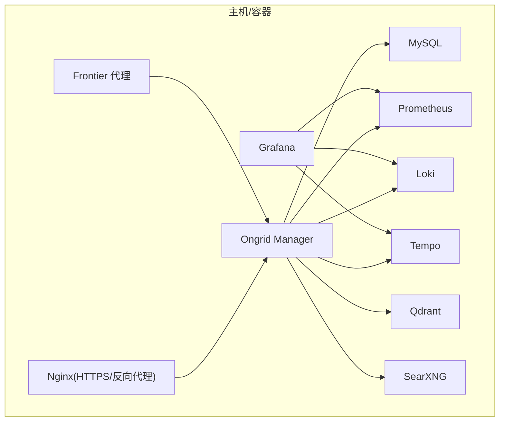
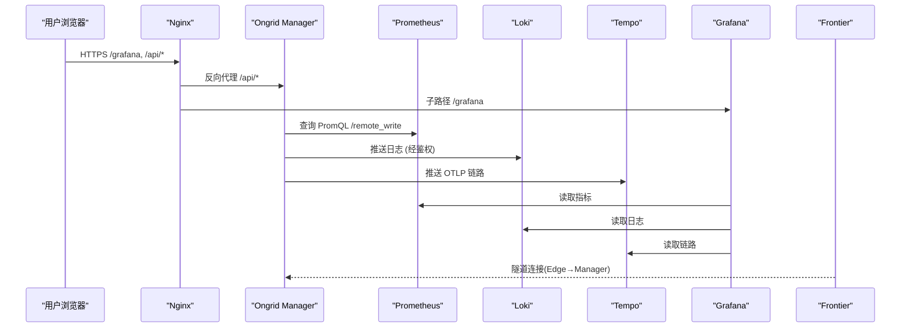
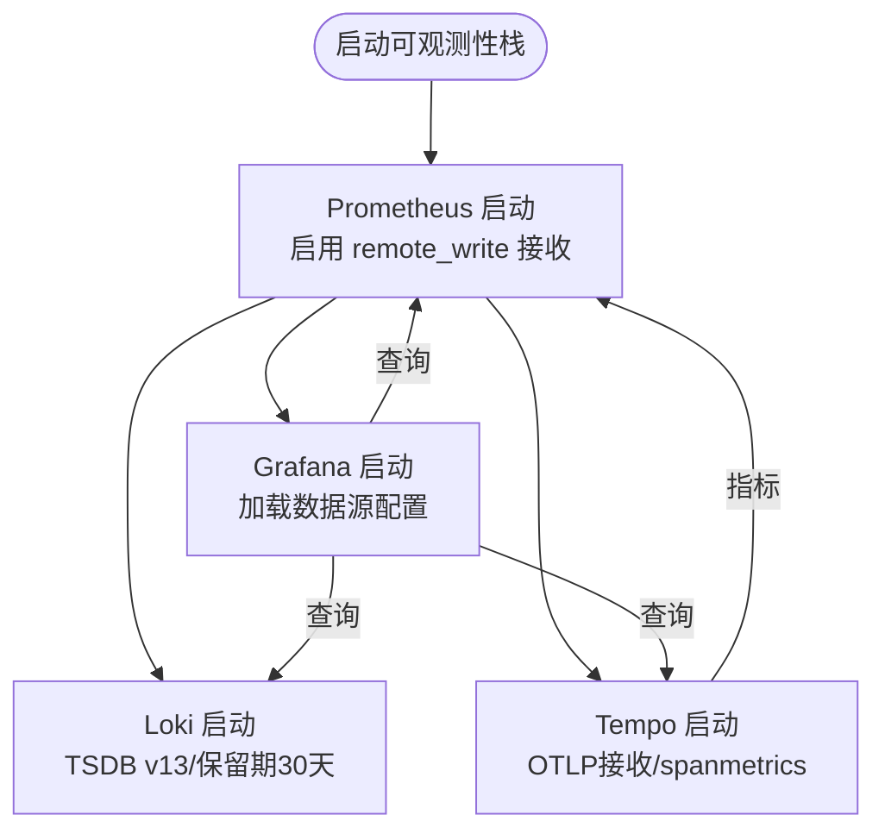
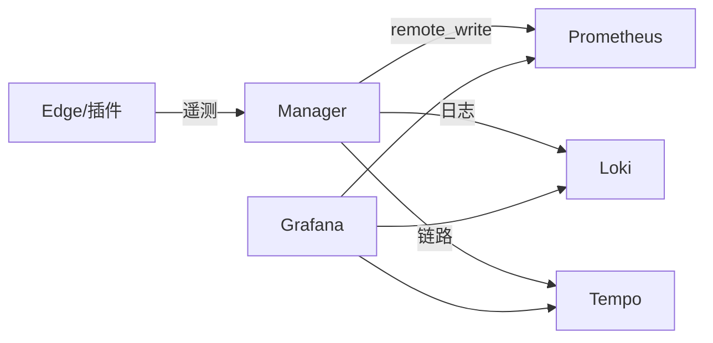

# 部署与运维

<cite>
**本文引用的文件**
- [deploy/docker-compose.yml](file://deploy/docker-compose.yml)
- [deploy/install/docker-compose.yml](file://deploy/install/docker-compose.yml)
- [deploy/prometheus/prometheus.yml](file://deploy/prometheus/prometheus.yml)
- [deploy/grafana/provisioning/datasources/prometheus.yml](file://deploy/grafana/provisioning/datasources/prometheus.yml)
- [deploy/grafana/provisioning/datasources/loki.yml](file://deploy/grafana/provisioning/datasources/loki.yml)
- [deploy/grafana/provisioning/datasources/tempo.yml](file://deploy/grafana/provisioning/datasources/tempo.yml)
- [deploy/install/loki-config.yaml](file://deploy/install/loki-config.yaml)
- [deploy/install/tempo-config.yaml](file://deploy/install/tempo-config.yaml)
- [deploy/install/prometheus-rules.yml](file://deploy/install/prometheus-rules.yml)
- [deploy/kubernetes/ongrid-edge/values.yaml](file://deploy/kubernetes/ongrid-edge/values.yaml)
- [deploy/kubernetes/ongrid-edge/templates/deployment.yaml](file://deploy/kubernetes/ongrid-edge/templates/deployment.yaml)
- [deploy/kubernetes/ongrid-edge/templates/daemonset.yaml](file://deploy/kubernetes/ongrid-edge/templates/daemonset.yaml)
- [deploy/kubernetes/ongrid-edge/templates/metrics-scraper-deployment.yaml](file://deploy/kubernetes/ongrid-edge/templates/metrics-scraper-deployment.yaml)
- [deploy/kubernetes/ongrid-edge/templates/telemetry-gateway-deployment.yaml](file://deploy/kubernetes/ongrid-edge/templates/telemetry-gateway-deployment.yaml)
- [deploy/install/install.sh](file://deploy/install/install.sh)
- [deploy/install/upgrade.sh](file://deploy/install/upgrade.sh)
</cite>

## 目录
1. [简介](#简介)
2. [项目结构](#项目结构)
3. [核心组件](#核心组件)
4. [架构总览](#架构总览)
5. [详细组件分析](#详细组件分析)
6. [依赖关系分析](#依赖关系分析)
7. [性能考虑](#性能考虑)
8. [故障排查指南](#故障排查指南)
9. [结论](#结论)
10. [附录](#附录)

## 简介
本指南面向生产与运维场景，覆盖三种部署方式（Docker Compose、Kubernetes Helm Chart、传统服务器安装），并深入说明可观测性栈（Prometheus、Grafana、Loki、Tempo）的集成与仪表板配置；同时给出日志收集与轮转、健康检查与自动恢复、版本升级与配置变更、性能调优以及常见问题的排障方法。内容均基于仓库内提供的配置文件与脚本进行说明，确保可操作性与一致性。

## 项目结构
仓库中与部署和运维直接相关的资源集中在 deploy 目录：
- Docker Compose（开发/生产两套）：用于本地开发与生产一键拉起整套服务
- Kubernetes Helm Chart（Edge 侧）：用于在 K8s 集群中部署 Edge 节点与控制器、指标采集器与遥测网关
- 安装与升级脚本：install.sh、upgrade.sh 负责环境准备、数据卷迁移、权限修复、证书生成与服务启停
- 可观测性配置：Prometheus/Loki/Tempo/Grafana 的数据源与规则文件

图表来源
- [deploy/docker-compose.yml:13-367](file://deploy/docker-compose.yml#L13-L367)
- [deploy/install/docker-compose.yml:20-528](file://deploy/install/docker-compose.yml#L20-L528)

章节来源
- [deploy/docker-compose.yml:1-405](file://deploy/docker-compose.yml#L1-L405)
- [deploy/install/docker-compose.yml:1-528](file://deploy/install/docker-compose.yml#L1-L528)

## 核心组件
- Ongrid Manager：业务主服务，负责设备管理、AIOps、告警、通知、知识库等；通过环境变量接入数据库、向量库、LLM、Prometheus、Grafana、OTLP 等
- Nginx：对外提供 HTTPS、静态资源与 /api 反向代理，统一入口
- MySQL：默认持久化存储
- Prometheus：指标采集与查询后端，支持 remote_write 接收
- Loki：日志后端，单二进制模式，文件系统存储，带压缩与保留策略
- Tempo：链路追踪后端，OTLP 接收，spanmetrics 写入 Prometheus
- Grafana：可视化与数据源编排，预置 Prometheus/Loki/Tempo 数据源
- Qdrant：向量检索，支撑知识库/RAG
- SearXNG：内置 web_search skill 的后端聚合搜索
- Frontier：上游代理/隧道，供 Edge 连接

章节来源
- [deploy/docker-compose.yml:39-185](file://deploy/docker-compose.yml#L39-L185)
- [deploy/install/docker-compose.yml:52-271](file://deploy/install/docker-compose.yml#L52-L271)

## 架构总览
下图展示了从外部访问到内部各组件的调用链，以及 Edge 侧通过隧道上报遥测数据的流向。

图表来源
- [deploy/docker-compose.yml:187-367](file://deploy/docker-compose.yml#L187-L367)
- [deploy/install/docker-compose.yml:293-426](file://deploy/install/docker-compose.yml#L293-L426)

## 详细组件分析

### Docker Compose 部署（开发/生产）
- 开发版 compose：包含 ongrid、nginx、frontier、prometheus、loki、tempo、qdrant、searxng、mysql，端口映射更宽松，便于本地调试
- 生产版 compose：所有状态数据以 host bind mount 形式落盘，敏感信息来自 .env，不暴露数据库端口，启用日志轮转，严格限制网络可达性

关键要点
- 数据持久化：MySQL/Prometheus/Loki/Tempo/Qdrant/Grafana 均使用 host 目录挂载，便于备份与替换存储介质
- 安全与认证：Nginx 统一入口，Loki/Tempo 仅内部端口，外部通过 Nginx 转发并经 manager edgeauth 鉴权
- 可观测性：Prometheus 开启 remote_write receiver；Grafana 预置数据源；Loki/Tempo 分别配置保留期与压缩
- 启动顺序与健康检查：MySQL 健康检查通过后 ongrid 才连接；各服务之间通过 depends_on 控制启动顺序

章节来源
- [deploy/docker-compose.yml:13-367](file://deploy/docker-compose.yml#L13-L367)
- [deploy/install/docker-compose.yml:20-528](file://deploy/install/docker-compose.yml#L20-L528)

### Kubernetes Helm Chart（Edge 侧）
Helm Chart 主要部署 Edge 侧组件：
- Controller：单副本，负责与 Manager 通信、清单同步、指标采集调度
- Node DaemonSet：在每个节点上运行，chroot 进入宿主系统，采集主机指标、日志等
- Metrics Scraper：独立 Deployment，按配置抓取 K8s 指标并通过 remote_write 上报
- Telemetry Gateway：可选 Deployment，提供 OTLP gRPC/HTTP 接收端点，具备内存限制、批处理、队列与自动扩缩容

关键要点
- 安全上下文：非 root 运行、只读根文件系统、最小能力集
- 配置注入：ConfigMap/Secret 注入控制器、节点、采集器与网关所需参数
- 弹性与稳定性：滚动更新、拓扑Spread、PDB、HPA（可选）
- 指标模式：支持 controller 内嵌或独立 scraper 两种模式

章节来源
- [deploy/kubernetes/ongrid-edge/values.yaml:1-188](file://deploy/kubernetes/ongrid-edge/values.yaml#L1-L188)
- [deploy/kubernetes/ongrid-edge/templates/deployment.yaml:17-193](file://deploy/kubernetes/ongrid-edge/templates/deployment.yaml#L17-L193)
- [deploy/kubernetes/ongrid-edge/templates/daemonset.yaml:1-188](file://deploy/kubernetes/ongrid-edge/templates/daemonset.yaml#L1-L188)
- [deploy/kubernetes/ongrid-edge/templates/metrics-scraper-deployment.yaml:1-169](file://deploy/kubernetes/ongrid-edge/templates/metrics-scraper-deployment.yaml#L1-L169)
- [deploy/kubernetes/ongrid-edge/templates/telemetry-gateway-deployment.yaml:1-164](file://deploy/kubernetes/ongrid-edge/templates/telemetry-gateway-deployment.yaml#L1-L164)

### 传统服务器部署（install.sh/upgrade.sh）
- install.sh：检测/安装 Docker，准备数据目录与权限，复制配置与证书，生成密钥与环境变量，拉取镜像并启动服务
- upgrade.sh：预检新镜像与 Edge 资源，迁移旧 named volume 至 host 目录，修复权限，平滑重启并健康检查

关键流程
- 环境准备：自动安装 Docker（优先官方脚本，回退到发行包管理器）
- 数据与权限：创建并 chown 各组件数据目录，保证容器内用户可写
- 证书与域名：自动生成自签证书，提示替换为正式证书
- 版本升级：先拉取新镜像与 Edge 资源，再停止旧栈，迁移数据，启动新栈，最后清理历史产物

章节来源
- [deploy/install/install.sh:307-800](file://deploy/install/install.sh#L307-L800)
- [deploy/install/upgrade.sh:209-800](file://deploy/install/upgrade.sh#L209-L800)

### 监控系统集成（Prometheus、Grafana、Loki、Tempo）
- Prometheus
  - 自监控：scrape prometheus 自身与 ongrid-manager
  - Remote Write：manager 将开放集合样本写入 prometheus
  - 规则：内置 self-observability 规则，标记 source=self，便于区分业务告警
- Grafana
  - 数据源：预置 ongrid-prometheus、ongrid-loki、ongrid-tempo
  - 集成：tracesToLogs、tracesToMetrics、Service Map、Node Graph
- Loki
  - 单二进制模式，TSDB v13，保留期 30 天，限制 cardinality 与 ingestion 速率
- Tempo
  - OTLP 接收，spanmetrics + service-graph 生成指标并 remote_write 到 Prometheus，保留期 7 天

图表来源
- [deploy/prometheus/prometheus.yml:1-28](file://deploy/prometheus/prometheus.yml#L1-L28)
- [deploy/grafana/provisioning/datasources/prometheus.yml:1-11](file://deploy/grafana/provisioning/datasources/prometheus.yml#L1-L11)
- [deploy/grafana/provisioning/datasources/loki.yml:1-20](file://deploy/grafana/provisioning/datasources/loki.yml#L1-L20)
- [deploy/grafana/provisioning/datasources/tempo.yml:1-51](file://deploy/grafana/provisioning/datasources/tempo.yml#L1-L51)
- [deploy/install/loki-config.yaml:1-76](file://deploy/install/loki-config.yaml#L1-L76)
- [deploy/install/tempo-config.yaml:1-77](file://deploy/install/tempo-config.yaml#L1-L77)

章节来源
- [deploy/prometheus/prometheus.yml:1-28](file://deploy/prometheus/prometheus.yml#L1-L28)
- [deploy/grafana/provisioning/datasources/prometheus.yml:1-11](file://deploy/grafana/provisioning/datasources/prometheus.yml#L1-L11)
- [deploy/grafana/provisioning/datasources/loki.yml:1-20](file://deploy/grafana/provisioning/datasources/loki.yml#L1-L20)
- [deploy/grafana/provisioning/datasources/tempo.yml:1-51](file://deploy/grafana/provisioning/datasources/tempo.yml#L1-L51)
- [deploy/install/loki-config.yaml:1-76](file://deploy/install/loki-config.yaml#L1-L76)
- [deploy/install/tempo-config.yaml:1-77](file://deploy/install/tempo-config.yaml#L1-L77)

### 日志收集与分析（轮转、聚合、查询优化）
- 日志轮转：compose 中各服务启用 json-file 驱动，设置 max-size 与 max-file，避免磁盘打满
- 聚合：Loki 作为统一日志后端，支持结构化元数据与 OTLP 日志；通过标签（device_id、cluster_id、service.name 等）提升查询效率
- 查询优化：限制 max_query_series、max_query_lookback；合理设置 retention 与 compactor；利用索引周期与 schema v13

章节来源
- [deploy/install/docker-compose.yml:46-51](file://deploy/install/docker-compose.yml#L46-L51)
- [deploy/install/docker-compose.yml:267-271](file://deploy/install/docker-compose.yml#L267-L271)
- [deploy/install/docker-compose.yml:383-402](file://deploy/install/docker-compose.yml#L383-L402)
- [deploy/install/loki-config.yaml:21-59](file://deploy/install/loki-config.yaml#L21-L59)

### 健康检查与故障恢复
- 健康检查
  - MySQL：healthcheck ping 成功后 ongrid 才连接
  - Nginx：对外 /healthz 探测，升级后等待健康返回
  - K8s 组件：readiness/liveness/startup probe 定义于 metrics-scraper 与 telemetry-gateway
- 自动重启：services 统一 restart: unless-stopped
- 灾难恢复
  - 数据卷迁移：upgrade.sh 检测 legacy named volumes，支持自动拷贝或手动迁移
  - 权限修复：提供 --repair-permissions 递归修复数据所有权
  - 回滚：Edge 资源采用原子替换与备份目录，失败时自动恢复

章节来源
- [deploy/docker-compose.yml:14-37](file://deploy/docker-compose.yml#L14-L37)
- [deploy/install/docker-compose.yml:40-45](file://deploy/install/docker-compose.yml#L40-L45)
- [deploy/install/docker-compose.yml:216-220](file://deploy/install/docker-compose.yml#L216-L220)
- [deploy/kubernetes/ongrid-edge/templates/metrics-scraper-deployment.yaml:117-138](file://deploy/kubernetes/ongrid-edge/templates/metrics-scraper-deployment.yaml#L117-L138)
- [deploy/kubernetes/ongrid-edge/templates/telemetry-gateway-deployment.yaml:129-143](file://deploy/kubernetes/ongrid-edge/templates/telemetry-gateway-deployment.yaml#L129-L143)
- [deploy/install/upgrade.sh:439-560](file://deploy/install/upgrade.sh#L439-L560)
- [deploy/install/upgrade.sh:731-760](file://deploy/install/upgrade.sh#L731-L760)

### 运维操作指南（版本升级、配置变更、性能调优）
- 版本升级
  - 使用 upgrade.sh：预检镜像与 Edge 资源 → 迁移数据卷 → 修复权限 → 启动新栈 → 健康检查 → 清理历史产物
  - 注意：若存在 legacy named volumes，需选择 --migrate-volumes 或 --no-migrate-volumes
- 配置变更
  - 修改 .env 后重新 up（Compose）或滚动更新（K8s）
  - Grafana 数据源可通过 provisioning 动态更新；Loki/Tempo 配置通过挂载文件热更新
- 性能调优
  - Prometheus：调整 scrape_interval、retention、remote_write 目标容量
  - Loki：限制 ingestion_rate_mb、max_global_streams_per_user，合理设置 compactor 与保留期
  - Tempo：调整 block_retention、max_bytes_per_trace、metrics_generator 处理器
  - K8s：调整 Telemetry Gateway 的 memory limiter、batch、queueSize、HPA 目标 CPU/Memory

章节来源
- [deploy/install/upgrade.sh:209-800](file://deploy/install/upgrade.sh#L209-L800)
- [deploy/install/docker-compose.yml:339-381](file://deploy/install/docker-compose.yml#L339-L381)
- [deploy/install/loki-config.yaml:31-75](file://deploy/install/loki-config.yaml#L31-L75)
- [deploy/install/tempo-config.yaml:23-76](file://deploy/install/tempo-config.yaml#L23-L76)
- [deploy/kubernetes/ongrid-edge/values.yaml:134-188](file://deploy/kubernetes/ongrid-edge/values.yaml#L134-L188)

## 依赖关系分析
- 服务间依赖
  - ongrid 依赖 mysql、qdrant、prometheus、grafana、tempo、loki、frontier
  - grafana 依赖 prometheus、loki、tempo
  - loki/tempo 无外部依赖（仅内部网络可达）
- 数据流
  - 指标：edge/plugin → tunnel → manager → prometheus（remote_write）
  - 日志：edge/plugin → nginx → manager edgeauth → loki
  - 链路：edge/plugin → nginx → manager edgeauth → tempo（OTLP）
  - 可视化：grafana 查询 prometheus/loki/tempo

图表来源
- [deploy/docker-compose.yml:228-367](file://deploy/docker-compose.yml#L228-L367)
- [deploy/install/docker-compose.yml:339-426](file://deploy/install/docker-compose.yml#L339-L426)

章节来源
- [deploy/docker-compose.yml:228-367](file://deploy/docker-compose.yml#L228-L367)
- [deploy/install/docker-compose.yml:339-426](file://deploy/install/docker-compose.yml#L339-L426)

## 性能考虑
- 指标采集
  - 合理设置 scrape_interval 与 sampleLimit/batchByteLimit，避免过载
  - 对远端 remote_write 目标设置超时与重试，保障稳定性
- 日志与链路
  - Loki 限制 ingestion 速率与全局 stream 数，防止 cardinality 爆炸
  - Tempo 限制 trace 大小与块大小，减少 IO 压力
- 存储与保留
  - 根据业务需求调整 Prometheus/Loki/Tempo 的 retention
  - 使用 SSD/NVMe 承载 TSDB，提升读写性能
- 计算资源
  - 为各服务设置 requests/limits，避免争抢
  - Telemetry Gateway 启用 HPA，依据 CPU/Memory 自动扩缩容

[本节为通用指导，无需特定文件引用]

## 故障排查指南
- 常见问题定位
  - 服务不可用：查看 docker logs 与 Nginx 错误日志；确认 healthcheck 是否通过
  - 指标缺失：检查 prometheus 目标状态与 remote_write 是否成功
  - 日志无法查询：确认 Loki 数据源 URL、标签是否正确；检查 ingestion 限制
  - 链路无法展示：确认 Tempo OTLP 端口与 Grafana tracesToLogs/tracesToMetrics 配置
- 告警与自愈
  - 使用 Prometheus 内置规则（source=self）快速发现 manager 异常、LLM 错误率、DB 池饱和、评估器停滞、高 5xx 比例
  - 结合通知渠道（Webhook/Slack/飞书/钉钉）及时告警
- 升级问题
  - 若健康检查失败，检查 ongrid 日志与数据库连通性；必要时回滚 Edge 资源目录并重建
  - 若 legacy named volumes 未迁移，按提示执行迁移或手动拷贝

章节来源
- [deploy/install/prometheus-rules.yml:1-79](file://deploy/install/prometheus-rules.yml#L1-L79)
- [deploy/install/upgrade.sh:731-760](file://deploy/install/upgrade.sh#L731-L760)

## 结论
本指南基于仓库内提供的 Compose、Helm Chart 与安装脚本，给出了从部署到运维的全链路方案。通过标准化的数据持久化、严格的网络边界、完善的可观测性集成与健壮的升级回滚机制，能够在多种环境下稳定运行 Ongrid 平台。建议在生产环境中结合实际负载调整资源配额与保留策略，并建立完善的备份与演练流程。

## 附录
- 常用命令
  - 启动/停止：docker compose up/down
  - 升级：sudo ./upgrade.sh [--migrate-volumes|--no-migrate-volumes] [--repair-permissions]
  - 查看日志：docker logs -f <service>
  - 健康检查：curl -fsSk https://localhost:<PORT>/healthz
- 关键环境变量
  - ONGRID_PUBLIC_URL：Edge 可达的公网地址
  - ONGRID_JWT_SECRET/ONGRID_SECRET_KEY：鉴权与加密密钥
  - MYSQL_ROOT_PASSWORD/MYSQL_PASSWORD：数据库密码
  - GRAFANA_ADMIN_PASSWORD：Grafana 管理员密码（用于首次引导 SA Token）

[本节为补充信息，无需特定文件引用]