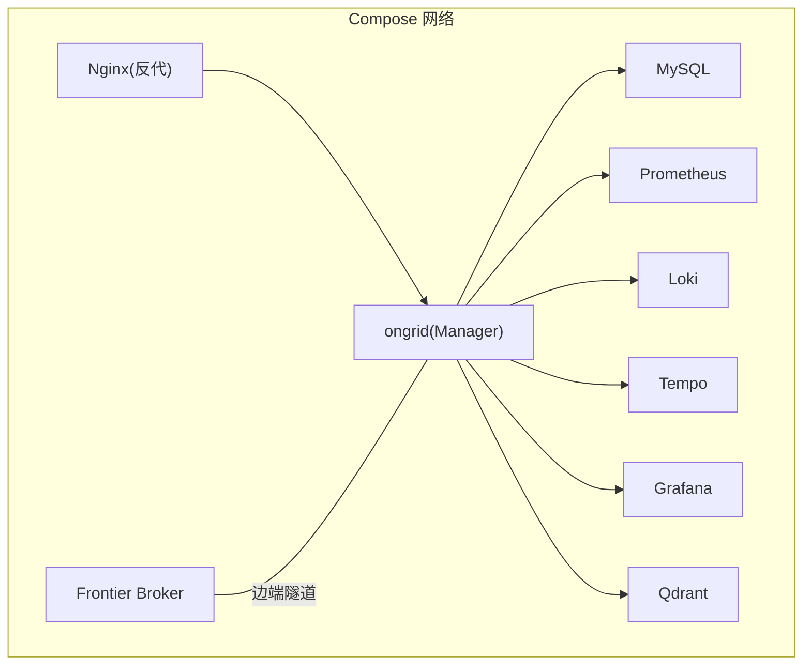
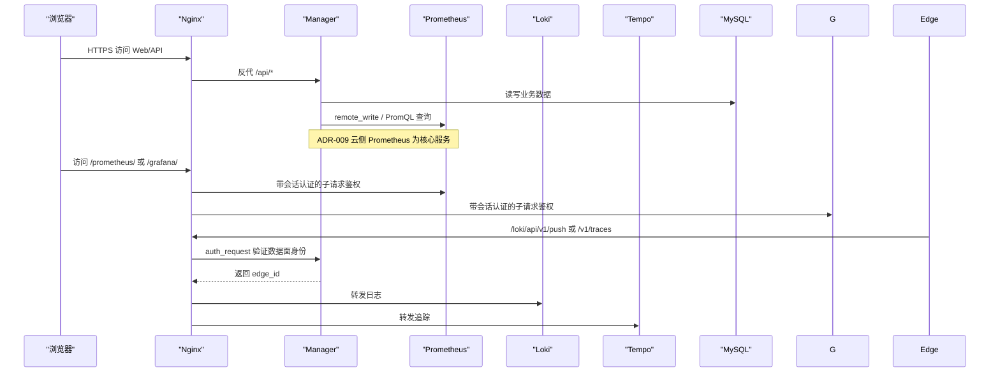
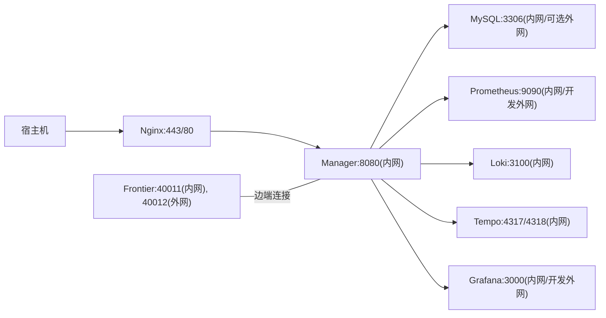

# Docker Compose 部署

<cite>
**本文引用的文件**
- [deploy/docker-compose.yml](file://deploy/docker-compose.yml)
- [deploy/install/docker-compose.yml](file://deploy/install/docker-compose.yml)
- [deploy/README.md](file://deploy/README.md)
- [deploy/install/README.md](file://deploy/install/README.md)
- [deploy/prometheus/prometheus.yml](file://deploy/prometheus/prometheus.yml)
- [deploy/install/prometheus.yml](file://deploy/install/prometheus.yml)
- [deploy/install/loki-config.yaml](file://deploy/install/loki-config.yaml)
- [deploy/install/tempo-config.yaml](file://deploy/install/tempo-config.yaml)
- [deploy/grafana/provisioning/datasources/prometheus.yml](file://deploy/grafana/provisioning/datasources/prometheus.yml)
- [deploy/grafana/provisioning/datasources/loki.yml](file://deploy/grafana/provisioning/datasources/loki.yml)
- [deploy/grafana/provisioning/datasources/tempo.yml](file://deploy/grafana/provisioning/datasources/tempo.yml)
- [deploy/nginx/nginx.conf](file://deploy/nginx/nginx.conf)
- [deploy/install/frontier.yaml](file://deploy/install/frontier.yaml)
- [deploy/install/prometheus-rules.yml](file://deploy/install/prometheus-rules.yml)
</cite>

## 目录
1. [简介](#简介)
2. [项目结构](#项目结构)
3. [核心组件](#核心组件)
4. [架构总览](#架构总览)
5. [详细组件分析](#详细组件分析)
6. [依赖关系与网络拓扑](#依赖关系与网络拓扑)
7. [性能与容量规划](#性能与容量规划)
8. [故障排查指南](#故障排查指南)
9. [生产环境与安全加固](#生产环境与安全加固)
10. [结论](#结论)

## 简介
本指南面向使用 Docker Compose 在本地或单台主机上部署 ongrid 全栈（Manager、Frontier Broker、MySQL、Prometheus、Loki、Tempo、Grafana、Nginx 反代）的运维与开发者。内容覆盖：
- 完整服务编排与环境变量说明
- 数据卷与持久化策略
- MySQL、Prometheus、Loki、Tempo、Grafana 集成方式
- Frontier Broker 隧道连接机制与端口映射
- 启动命令、依赖顺序与健康检查
- 常见问题排查与性能优化建议
- 生产部署注意事项与安全加固

## 项目结构
仓库提供两套 Compose 配置：
- 开发用 compose：deploy/docker-compose.yml，适合本地调试，默认暴露部分端口到宿主机
- 生产风格 compose：deploy/install/docker-compose.yml，随发布包分发，强调安全与可运维性

关键目录与职责：
- deploy/：开发用编排与构建产物
- deploy/install/：生产风格编排与安装脚本、配置文件
- deploy/grafana/provisioning/：Grafana 数据源与仪表盘预置
- deploy/nginx/nginx.conf：统一入口、TLS 终止、鉴权与反向代理
- deploy/prometheus/prometheus.yml：开发用 Prometheus 抓取配置
- deploy/install/prometheus.yml：生产用 Prometheus 抓取配置
- deploy/install/loki-config.yaml / tempo-config.yaml：日志与追踪后端配置
- deploy/install/frontier.yaml：Frontier Broker 边端与服务端监听配置

**图表来源**
- [deploy/docker-compose.yml:13-405](file://deploy/docker-compose.yml#L13-L405)
- [deploy/install/docker-compose.yml:20-528](file://deploy/install/docker-compose.yml#L20-L528)

**章节来源**
- [deploy/README.md:1-130](file://deploy/README.md#L1-L130)
- [deploy/install/README.md:1-403](file://deploy/install/README.md#L1-L403)

## 核心组件
- Manager（ongrid）：业务 API、AIOps、遥测接入、数据库访问、向量检索、通知等
- MySQL：关系型存储（默认后端），健康检查驱动 Manager 启动顺序
- Frontier Broker：边端隧道服务端，管理边端注册与会话
- Prometheus：指标采集与查询，支持 remote_write 接收
- Loki：日志后端，通过 Nginx 鉴权后写入
- Tempo：分布式追踪后端，OTLP HTTP/gRPC 接收
- Grafana：可视化与数据源预置（Prom/Loki/Tempo）
- Nginx：TLS 终止、SPA 静态资源、API 反代、遥测数据面鉴权与限流
- Qdrant：向量数据库，用于知识库/RAG

**章节来源**
- [deploy/docker-compose.yml:13-405](file://deploy/docker-compose.yml#L13-L405)
- [deploy/install/docker-compose.yml:20-528](file://deploy/install/docker-compose.yml#L20-L528)

## 架构总览
下图展示了请求从浏览器到各服务的流转路径，以及遥测数据面（日志/追踪/指标）的鉴权与转发流程。

**图表来源**
- [deploy/nginx/nginx.conf:120-402](file://deploy/nginx/nginx.conf#L120-L402)
- [deploy/install/docker-compose.yml:20-528](file://deploy/install/docker-compose.yml#L20-L528)

## 详细组件分析

### MySQL 数据库
- 作用：Manager 默认后端存储，承载用户、设备、告警、知识等数据
- 健康检查：compose 中定义 mysqladmin ping，Manager 依赖其 healthy 后再启动
- 字符集：utf8mb4，排序规则 utf8mb4_unicode_ci
- 端口：开发环境暴露 3306；生产环境仅容器内网可达
- 数据持久化：开发使用命名卷；生产 bind-mount 至宿主机目录，便于备份与替换存储

**章节来源**
- [deploy/docker-compose.yml:14-38](file://deploy/docker-compose.yml#L14-L38)
- [deploy/install/docker-compose.yml:21-51](file://deploy/install/docker-compose.yml#L21-L51)

### Manager（ongrid）
- 环境变量要点：
  - 数据库：DIALECT=mysql，DSN 指向 compose 内的 mysql 服务
  - JWT 与密钥：JWT_SECRET、SECRET_KEY（凭据库离线加密）
  - AI/LLM：OPENAI_*、ZHIPU_*、ANTHROPIC_*、GEMINI_*、DEEPSEEK_*、KIMI_* 及默认提供者
  - 观测：Prom URL、remote_write URL、query URL；OTEL_ENDPOINT 指向 Tempo
  - 知识库：Qdrant URL、Embedding Provider/Model/Dim/BaseURL/Key
  - Grafana：内部地址、Bootstrap 管理员账号密码（首次初始化 SA Token）
  - 公共端点：PUBLIC_URL/TUNNEL_ADDR 用于下发给边端的遥测推送地址
  - 告警与通知：内置阈值告警开关与冷却时间；通知通道（Webhook/Slack/飞书/钉钉）
- 依赖：等待 MySQL 健康、Qdrant 已启动
- 端口：仅暴露 metrics 9100；HTTP API 不直接对外，由 Nginx 反代

**章节来源**
- [deploy/docker-compose.yml:39-185](file://deploy/docker-compose.yml#L39-L185)
- [deploy/install/docker-compose.yml:52-272](file://deploy/install/docker-compose.yml#L52-L272)

### Frontier Broker（隧道）
- 角色：上游 singchia/frontier，负责边端连接与会话
- 端口：
  - 40011：服务绑定端口，供 Manager 通过 compose 网络拨号
  - 40012：边端绑定端口，映射到宿主端口（开发/生产均保持 40012）
- 配置：frontier.yaml 设置 edgebound/servicebound 监听地址与认证策略
- 安全：当 Manager 的 ID 服务不可用时，禁止分配未认证临时 ID

**章节来源**
- [deploy/docker-compose.yml:214-227](file://deploy/docker-compose.yml#L214-L227)
- [deploy/install/docker-compose.yml:273-292](file://deploy/install/docker-compose.yml#L273-L292)
- [deploy/install/frontier.yaml:1-29](file://deploy/install/frontier.yaml#L1-L29)

### Prometheus（指标）
- 角色：云侧核心指标服务，接收 Manager remote_write，并提供 PromQL 查询能力
- 抓取目标：自身与 Manager（ongrid:9100）
- 保留策略：时间 90 天、大小 20GB（开发/生产一致）
- 自观察规则：bind-mount rules.yml，支持热重载
- 访问：开发暴露 9090；生产不暴露 host 端口，通过 Nginx 子路径访问

**章节来源**
- [deploy/prometheus/prometheus.yml:1-28](file://deploy/prometheus/prometheus.yml#L1-L28)
- [deploy/install/prometheus.yml:1-36](file://deploy/install/prometheus.yml#L1-L36)
- [deploy/install/prometheus-rules.yml:1-79](file://deploy/install/prometheus-rules.yml#L1-L79)
- [deploy/docker-compose.yml:228-260](file://deploy/docker-compose.yml#L228-L260)
- [deploy/install/docker-compose.yml:339-382](file://deploy/install/docker-compose.yml#L339-L382)

### Loki（日志）
- 角色：单二进制日志后端，文件系统存储，默认 30 天保留
- 限制：最大全局流数、摄入速率、拒绝旧样本等
- 接入：通过 Nginx /loki/api/v1/push 与 OTLP 路径，经 auth_request 鉴权后转发
- 数据持久化：bind-mount 至宿主机目录

**章节来源**
- [deploy/install/loki-config.yaml:1-76](file://deploy/install/loki-config.yaml#L1-L76)
- [deploy/docker-compose.yml:262-276](file://deploy/docker-compose.yml#L262-L276)
- [deploy/install/docker-compose.yml:383-403](file://deploy/install/docker-compose.yml#L383-L403)
- [deploy/nginx/nginx.conf:168-218](file://deploy/nginx/nginx.conf#L168-L218)

### Tempo（追踪）
- 角色：单二进制追踪后端，OTLP gRPC :4317、HTTP :4318
- Spanmetrics 与 Service Graph：生成指标并 remote_write 到 Prometheus，供评估器复用
- 保留策略：块保留 7 天
- 接入：通过 Nginx /v1/traces 鉴权后转发，不直接暴露端口

**章节来源**
- [deploy/install/tempo-config.yaml:1-77](file://deploy/install/tempo-config.yaml#L1-L77)
- [deploy/docker-compose.yml:277-293](file://deploy/docker-compose.yml#L277-L293)
- [deploy/install/docker-compose.yml:404-427](file://deploy/install/docker-compose.yml#L404-L427)
- [deploy/nginx/nginx.conf:295-321](file://deploy/nginx/nginx.conf#L295-L321)

### Grafana（可视化）
- 角色：统一可视化入口，预置数据源（Prom/Loki/Tempo）与仪表盘
- 访问：通过 Nginx /grafana/ 子路径，复用会话鉴权
- 首启：Manager 可使用 Bootstrap 管理员账号创建 Service Account Token
- 语言与嵌入：默认语言 en-US，允许 iframe 嵌入以支持 solo 面板

**章节来源**
- [deploy/docker-compose.yml:321-367](file://deploy/docker-compose.yml#L321-L367)
- [deploy/install/docker-compose.yml:470-519](file://deploy/install/docker-compose.yml#L470-L519)
- [deploy/grafana/provisioning/datasources/prometheus.yml:1-11](file://deploy/grafana/provisioning/datasources/prometheus.yml#L1-L11)
- [deploy/grafana/provisioning/datasources/loki.yml:1-20](file://deploy/grafana/provisioning/datasources/loki.yml#L1-L20)
- [deploy/grafana/provisioning/datasources/tempo.yml:1-51](file://deploy/grafana/provisioning/datasources/tempo.yml#L1-L51)
- [deploy/nginx/nginx.conf:388-402](file://deploy/nginx/nginx.conf#L388-L402)

### Nginx（反代与鉴权）
- 角色：TLS 终止、SPA 静态资源、API 反代、遥测数据面鉴权与限流
- 鉴权：
  - /prometheus/ 与 /grafana/：基于会话的子请求鉴权
  - /loki/api/v1/push 与 /v1/traces：数据面身份校验，注入 edge_id
  - /prometheus/api/v1/write：集群遥测凭证校验
- 限流：按 edge 数据面、K8s 注册、边缘注册分别限速
- 超时与缓冲：长连接与 SSE 场景关闭缓冲，确保实时流式响应

**章节来源**
- [deploy/nginx/nginx.conf:1-441](file://deploy/nginx/nginx.conf#L1-L441)

## 依赖关系与网络拓扑
- 服务依赖：
  - Manager 依赖 MySQL 健康、Qdrant 已启动
  - Grafana 依赖 Prometheus、Loki、Tempo
  - Prometheus 依赖 Manager 指标端点
  - Nginx 依赖 Manager、Prometheus、Grafana、Loki、Tempo
- 网络：所有服务加入同一 bridge 网络，服务间通过服务名通信
- 端口映射：
  - 开发：MySQL 3306、Prometheus 9090、Frontier 40012、Grafana 3000、Manager metrics 9100
  - 生产：仅 Nginx 对外（HTTPS 443/80），其余仅容器内网可达

**图表来源**
- [deploy/docker-compose.yml:13-405](file://deploy/docker-compose.yml#L13-L405)
- [deploy/install/docker-compose.yml:20-528](file://deploy/install/docker-compose.yml#L20-L528)
- [deploy/install/frontier.yaml:1-29](file://deploy/install/frontier.yaml#L1-L29)

**章节来源**
- [deploy/docker-compose.yml:13-405](file://deploy/docker-compose.yml#L13-L405)
- [deploy/install/docker-compose.yml:20-528](file://deploy/install/docker-compose.yml#L20-L528)

## 性能与容量规划
- 指标保留：Prometheus 默认 90 天/20GB，可按需调整 retention.time 与 retention.size
- 日志保留：Loki 默认 30 天，可通过 compactor.retention_enabled 与 retention_period 调整
- 追踪保留：Tempo 默认块保留 7 天，可按需调整 block_retention
- 摄入限制：Loki/Tempo 对 ingestion rate/burst 进行限制，避免过载
- 数据库：MySQL 使用 utf8mb4，注意索引与慢查询；生产建议独立 SSD/NVMe
- 存储布局：生产将所有有状态数据 bind-mount 到宿主机，便于备份与扩容
- 监控自观察：Prometheus 规则检测 Manager 存活、LLM 错误率、DB 池饱和、告警评估停滞、HTTP 5xx 比例

**章节来源**
- [deploy/install/docker-compose.yml:339-382](file://deploy/install/docker-compose.yml#L339-L382)
- [deploy/install/loki-config.yaml:31-76](file://deploy/install/loki-config.yaml#L31-L76)
- [deploy/install/tempo-config.yaml:23-77](file://deploy/install/tempo-config.yaml#L23-L77)
- [deploy/install/prometheus-rules.yml:1-79](file://deploy/install/prometheus-rules.yml#L1-L79)

## 故障排查指南
- 启动顺序与依赖：
  - MySQL 冷启动较慢，Manager 会等待 healthcheck 成功
  - 若 healthcheck 超时，查看 MySQL 日志与磁盘空间
- 端口冲突：
  - 修改 .env 中的 HTTP/Redirect/Tunnel/Metrics 端口后重启
- 证书问题：
  - 自签证书首次访问需信任；替换为正式证书后重启 Nginx
- 鉴权失败：
  - /healthz 不通时检查 JWT_SECRET、DSN、DB 连通性
  - 遥测写入失败检查 nginx 鉴权与 edge 凭证
- 指标/日志/追踪不可用：
  - 确认对应服务容器运行与端口可达（开发/生产差异）
  - 检查 prometheus.yml/rules.yml 是否生效（支持热重载）
- 升级与迁移：
  - 使用 upgrade.sh 自动拉取镜像、渲染配置、拉起新栈
  - 老版本 named volumes 迁移到 bind-mount，参考安装文档

**章节来源**
- [deploy/README.md:14-27](file://deploy/README.md#L14-L27)
- [deploy/install/README.md:16-121](file://deploy/install/README.md#L16-L121)
- [deploy/install/README.md:241-263](file://deploy/install/README.md#L241-L263)
- [deploy/install/README.md:360-403](file://deploy/install/README.md#L360-L403)

## 生产环境与安全加固
- 最小暴露面：仅 Nginx 对外（HTTPS 443/80），其余服务仅容器内网可达
- TLS：使用正式证书替换自签证书；启用强加密套件与协议
- 鉴权：
  - Web/Grafana/Prometheus 子路径通过会话鉴权
  - 遥测数据面（Loki/Tempo/Prom write）通过数据面凭证鉴权
- 限流：对数据面、注册接口实施速率限制，防止滥用
- 密钥管理：
  - .env 权限 600，包含 MYSQL_ROOT_PASSWORD、MYSQL_PASSWORD、ONGRID_JWT_SECRET、GRAFANA_ADMIN_PASSWORD 等
  - SECRET_KEY（凭据库离线加密）必须设置且足够随机
- 数据持久化：所有有状态服务 bind-mount 到宿主机，便于备份与外部存储挂载
- 外部观测栈：可切换至客户自有 Prometheus/Loki/Tempo/Grafana/qdrant，减少重复运维

**章节来源**
- [deploy/install/docker-compose.yml:21-528](file://deploy/install/docker-compose.yml#L21-L528)
- [deploy/nginx/nginx.conf:56-62](file://deploy/nginx/nginx.conf#L56-L62)
- [deploy/install/README.md:123-160](file://deploy/install/README.md#L123-L160)
- [deploy/install/README.md:241-263](file://deploy/install/README.md#L241-L263)

## 结论
本指南基于仓库提供的开发/生产 Compose 配置与配套脚本，给出了完整的本地与生产部署方案。通过统一的 Nginx 入口与严格的鉴权/限流策略，结合 MySQL、Prometheus、Loki、Tempo、Grafana 的集成，ongrid 可在本地快速搭建并在生产环境中稳定运行。建议在生产中采用外部观测栈、严格密钥管理与最小暴露面原则，以获得更高的安全性与可维护性。