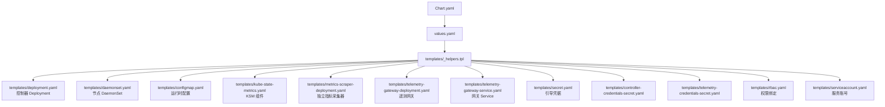
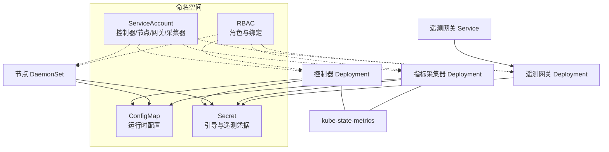
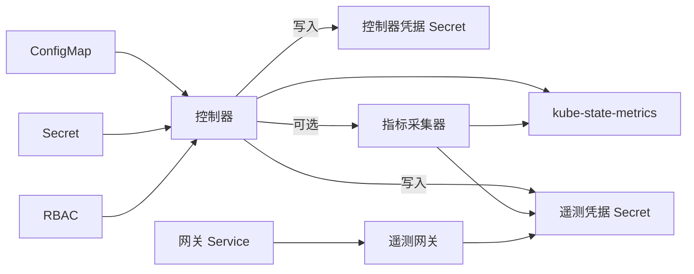

# Helm Chart 定制

<cite>
**本文引用的文件**
- [Chart.yaml](file://deploy/kubernetes/ongrid-edge/Chart.yaml)
- [values.yaml](file://deploy/kubernetes/ongrid-edge/values.yaml)
- [_helpers.tpl](file://deploy/kubernetes/ongrid-edge/templates/_helpers.tpl)
- [configmap.yaml](file://deploy/kubernetes/ongrid-edge/templates/configmap.yaml)
- [deployment.yaml](file://deploy/kubernetes/ongrid-edge/templates/deployment.yaml)
- [daemonset.yaml](file://deploy/kubernetes/ongrid-edge/templates/daemonset.yaml)
- [kube-state-metrics.yaml](file://deploy/kubernetes/ongrid-edge/templates/kube-state-metrics.yaml)
- [metrics-scraper-deployment.yaml](file://deploy/kubernetes/ongrid-edge/templates/metrics-scraper-deployment.yaml)
- [telemetry-gateway-deployment.yaml](file://deploy/kubernetes/ongrid-edge/templates/telemetry-gateway-deployment.yaml)
- [telemetry-gateway-service.yaml](file://deploy/kubernetes/ongrid-edge/templates/telemetry-gateway-service.yaml)
- [secret.yaml](file://deploy/kubernetes/ongrid-edge/templates/secret.yaml)
- [controller-credentials-secret.yaml](file://deploy/kubernetes/ongrid-edge/templates/controller-credentials-secret.yaml)
- [telemetry-credentials-secret.yaml](file://deploy/kubernetes/ongrid-edge/templates/telemetry-credentials-secret.yaml)
- [rbac.yaml](file://deploy/kubernetes/ongrid-edge/templates/rbac.yaml)
- [serviceaccount.yaml](file://deploy/kubernetes/ongrid-edge/templates/serviceaccount.yaml)
</cite>

## 目录
1. [简介](#简介)
2. [项目结构](#项目结构)
3. [核心组件](#核心组件)
4. [架构总览](#架构总览)
5. [详细组件分析](#详细组件分析)
6. [依赖关系分析](#依赖关系分析)
7. [性能与可观测性](#性能与可观测性)
8. [多环境部署最佳实践](#多环境部署最佳实践)
9. [版本管理与发布流程](#版本管理与发布流程)
10. [故障排查指南](#故障排查指南)
11. [结论](#结论)

## 简介
本指南面向需要在 Kubernetes 上通过 Helm 安装和定制 ongrid-edge 的工程师，围绕以下目标展开：
- 深入说明 Chart.yaml 的结构与配置选项（版本、元数据、应用版本）
- 详解 values.yaml 的参数定制（环境变量、资源配置、服务发现）
- 模板文件使用要点（条件渲染、循环处理、函数调用）
- 如何创建自定义 values 并覆盖默认配置
- 多环境（开发、测试、生产）差异化部署策略
- Chart 的版本管理与发布流程
- 常见问题的定位与排障技巧

## 项目结构
Helm Chart 位于 deploy/kubernetes/ongrid-edge，包含 Chart 描述、默认值、以及一组模板资源。关键目录与职责如下：
- Chart.yaml：定义 Chart 名称、类型、版本与应用版本等元信息
- values.yaml：提供所有可调参数，包括镜像、控制器、节点、遥测网关、指标采集等
- templates：Kubernetes 资源模板，按功能拆分（控制器、节点、RBAC、Secrets、ConfigMap、ServiceAccount、Telemetry Gateway、Metrics Scraper、KSM 等）

图表来源
- [Chart.yaml:1-7](file://deploy/kubernetes/ongrid-edge/Chart.yaml#L1-L7)
- [values.yaml:1-188](file://deploy/kubernetes/ongrid-edge/values.yaml#L1-L188)
- [_helpers.tpl:1-210](file://deploy/kubernetes/ongrid-edge/templates/_helpers.tpl#L1-L210)

章节来源
- [Chart.yaml:1-7](file://deploy/kubernetes/ongrid-edge/Chart.yaml#L1-L7)
- [values.yaml:1-188](file://deploy/kubernetes/ongrid-edge/values.yaml#L1-L188)

## 核心组件
- 控制器（Deployment）：以单副本运行，负责集群清单同步、指标采集（可选）、遥测集成等
- 节点代理（DaemonSet）：在每个节点运行，具备主机运行时安装、插件管理、本地日志采集等能力
- 指标采集模式：支持“控制器内嵌”或“独立采集器”两种模式，通过 values 切换
- kube-state-metrics（可选）：暴露集群资源指标，供控制器或独立采集器消费
- 遥测网关（可选）：以独立 Deployment 或嵌入控制器的方式提供 OTLP 接收端点
- RBAC 与服务账号：为各组件最小化授权，按需启用自动挂载 Token

章节来源
- [deployment.yaml:1-193](file://deploy/kubernetes/ongrid-edge/templates/deployment.yaml#L1-L193)
- [daemonset.yaml:1-188](file://deploy/kubernetes/ongrid-edge/templates/daemonset.yaml#L1-L188)
- [kube-state-metrics.yaml:1-136](file://deploy/kubernetes/ongrid-edge/templates/kube-state-metrics.yaml#L1-L136)
- [metrics-scraper-deployment.yaml:1-169](file://deploy/kubernetes/ongrid-edge/templates/metrics-scraper-deployment.yaml#L1-L169)
- [telemetry-gateway-deployment.yaml:1-164](file://deploy/kubernetes/ongrid-edge/templates/telemetry-gateway-deployment.yaml#L1-L164)
- [rbac.yaml:1-174](file://deploy/kubernetes/ongrid-edge/templates/rbac.yaml#L1-L174)
- [serviceaccount.yaml:1-35](file://deploy/kubernetes/ongrid-edge/templates/serviceaccount.yaml#L1-L35)

## 架构总览
下图展示了控制器、节点代理、指标采集器与遥测网关之间的交互关系，以及它们如何通过 ConfigMap/Secret 获取配置与凭据。

图表来源
- [configmap.yaml:1-47](file://deploy/kubernetes/ongrid-edge/templates/configmap.yaml#L1-L47)
- [secret.yaml:1-24](file://deploy/kubernetes/ongrid-edge/templates/secret.yaml#L1-L24)
- [controller-credentials-secret.yaml:1-16](file://deploy/kubernetes/ongrid-edge/templates/controller-credentials-secret.yaml#L1-L16)
- [telemetry-credentials-secret.yaml:1-14](file://deploy/kubernetes/ongrid-edge/templates/telemetry-credentials-secret.yaml#L1-L14)
- [serviceaccount.yaml:1-35](file://deploy/kubernetes/ongrid-edge/templates/serviceaccount.yaml#L1-L35)
- [rbac.yaml:1-174](file://deploy/kubernetes/ongrid-edge/templates/rbac.yaml#L1-L174)
- [deployment.yaml:1-193](file://deploy/kubernetes/ongrid-edge/templates/deployment.yaml#L1-L193)
- [daemonset.yaml:1-188](file://deploy/kubernetes/ongrid-edge/templates/daemonset.yaml#L1-L188)
- [kube-state-metrics.yaml:1-136](file://deploy/kubernetes/ongrid-edge/templates/kube-state-metrics.yaml#L1-L136)
- [metrics-scraper-deployment.yaml:1-169](file://deploy/kubernetes/ongrid-edge/templates/metrics-scraper-deployment.yaml#L1-L169)
- [telemetry-gateway-deployment.yaml:1-164](file://deploy/kubernetes/ongrid-edge/templates/telemetry-gateway-deployment.yaml#L1-L164)
- [telemetry-gateway-service.yaml:1-31](file://deploy/kubernetes/ongrid-edge/templates/telemetry-gateway-service.yaml#L1-L31)

## 详细组件分析

### Chart.yaml 结构与配置
- apiVersion: v2，表示使用 Helm 3 的 Chart 规范
- name: ongrid-edge，Chart 名称
- description: 用于边缘节点与控制器的入网与编排
- type: application，表示这是一个应用型 Chart
- version: Chart 自身版本，用于 Helm 仓库与升级识别
- appVersion: 应用版本，通常与镜像 tag 对应，便于追踪

建议：
- 在 CI/CD 中根据发布分支或标签更新 version 与 appVersion
- 保持 appVersion 与镜像 tag 一致，便于回滚与审计

章节来源
- [Chart.yaml:1-7](file://deploy/kubernetes/ongrid-edge/Chart.yaml#L1-L7)

### values.yaml 参数定制
- mode: 当前仅支持 full-node；若传入其他值会在模板校验时报错
- manager: 公共 URL、隧道地址、TLS 不校验开关
- enrollment: 集群 ID、控制器与节点的引导令牌
- image: 镜像仓库、tag、拉取策略、架构选择（amd64/arm64）
- node: 节点代理的资源、容忍度、采集模式
- controller: 副本数（固定为 1）、清单同步、指标采集参数、资源限制
- kubeStateMetrics: 是否启用、镜像、端口、收集器列表、资源
- telemetryConfig: 遥测配置热刷新间隔
- kubernetesMetrics: 指标采集模式（controller 或 scraper）、端点、重试、资源
- upgrade.migrationHook: 预升级钩子开关与超时
- telemetryGateway: 是否启用、模式（embedded/deployment）、副本、内存限制、批大小、队列、HPA、PDB、Service 端口
- podSecurity: 非 root 运行、UID/GID、fsGroup、附加组

注意：
- 某些字段在模板中有强校验（如 replicas=1、mode 合法、内存单位等），非法值会直接失败
- 可通过 values 文件覆盖任意默认项，或使用 --set/-f 方式注入

章节来源
- [values.yaml:1-188](file://deploy/kubernetes/ongrid-edge/values.yaml#L1-L188)
- [configmap.yaml:21-23](file://deploy/kubernetes/ongrid-edge/templates/configmap.yaml#L21-L23)
- [deployment.yaml:14-16](file://deploy/kubernetes/ongrid-edge/templates/deployment.yaml#L14-L16)
- [metrics-scraper-deployment.yaml:7-15](file://deploy/kubernetes/ongrid-edge/templates/metrics-scraper-deployment.yaml#L7-L15)
- [telemetry-gateway-deployment.yaml:16-30](file://deploy/kubernetes/ongrid-edge/templates/telemetry-gateway-deployment.yaml#L16-L30)

### 模板函数与条件渲染
_helpers.tpl 提供了大量复用逻辑：
- 名称生成：ongrid-edge.name、ongrid-edge.fullname
- 标签生成：ongrid-edge.labels（包含 mode、cluster-id 等）
- 服务账号名：node/controller/telemetry-gateway/metrics-scraper
- 组件名：kube-state-metrics、telemetry-gateway
- 模式与开关：telemetryGateway.mode、kubernetesMetrics.mode/enabled
- 端点推导：kubeStateMetricsEndpoint、k8sMetricsEndpoint、kubernetesMetricsEndpoint
- 资源与时间单位校验：memoryQuantityMiB、durationSeconds
- 镜像拼接：image（仓库 + tag/appVersion）

典型用法：
- 条件渲染：基于 .Values.telemetryGateway.enabled/mode 决定是否输出网关相关资源
- 函数调用：多处通过 include 复用名称、端点、开关判断
- 错误校验：对非法值使用 fail 提前终止，避免生成无效资源

章节来源
- [_helpers.tpl:1-210](file://deploy/kubernetes/ongrid-edge/templates/_helpers.tpl#L1-L210)

### 控制器（Deployment）
- 单副本强制：replicas 必须为 1
- 环境变量：从 ConfigMap/Secret 注入模式、集群 ID、引导令牌、遥测开关、清单同步、指标端点等
- 安全上下文：非 root 运行、只读根文件系统、丢弃全部能力
- 存储：emptyDir 作为状态目录
- 注解：checksum 触发滚动更新

章节来源
- [deployment.yaml:1-193](file://deploy/kubernetes/ongrid-edge/templates/deployment.yaml#L1-L193)
- [configmap.yaml:31-47](file://deploy/kubernetes/ongrid-edge/templates/configmap.yaml#L31-L47)
- [secret.yaml:1-24](file://deploy/kubernetes/ongrid-edge/templates/secret.yaml#L1-L24)

### 节点代理（DaemonSet）
- 每个节点运行，hostPID/hostNetwork 开启，dnsPolicy 指定
- 初始化容器：安装主机运行时，并以 root 执行必要操作
- 主容器：进入宿主 chroot，挂载 /proc、/sys、/，并挂载服务账号令牌与 CA
- 环境变量：从 ConfigMap/Secret 读取模式、集群 ID、引导令牌、管理器地址等
- 安全上下文：需要特定能力（NET_ADMIN、SYS_CHROOT 等）

章节来源
- [daemonset.yaml:1-188](file://deploy/kubernetes/ongrid-edge/templates/daemonset.yaml#L1-L188)

### 指标采集（kube-state-metrics 与独立采集器）
- kube-state-metrics：可选，暴露集群资源指标，提供 Service 与 Deployment
- 指标采集模式：
  - controller：控制器内采集，通过 ConfigMap 注入端点与参数
  - scraper：独立采集器 Deployment，需配置 endpoint 或启用应用发现
- 校验：replicas=1、maxRetries 范围、endpoint 或 app discovery 至少其一

章节来源
- [kube-state-metrics.yaml:1-136](file://deploy/kubernetes/ongrid-edge/templates/kube-state-metrics.yaml#L1-L136)
- [metrics-scraper-deployment.yaml:1-169](file://deploy/kubernetes/ongrid-edge/templates/metrics-scraper-deployment.yaml#L1-L169)
- [_helpers.tpl:165-204](file://deploy/kubernetes/ongrid-edge/templates/_helpers.tpl#L165-L204)

### 遥测网关（Telemetry Gateway）
- 模式：embedded（嵌入控制器）或 deployment（独立 Pod）
- 资源与限流：内存限制、批大小、队列大小、HPA/PDB
- 服务：Service 暴露 OTLP gRPC/HTTP 端口，selector 稳定跨模式
- 校验：副本与 HPA 的关系、内存限制比例、批大小与队列范围

章节来源
- [telemetry-gateway-deployment.yaml:1-164](file://deploy/kubernetes/ongrid-edge/templates/telemetry-gateway-deployment.yaml#L1-L164)
- [telemetry-gateway-service.yaml:1-31](file://deploy/kubernetes/ongrid-edge/templates/telemetry-gateway-service.yaml#L1-L31)
- [_helpers.tpl:64-71](file://deploy/kubernetes/ongrid-edge/templates/_helpers.tpl#L64-L71)

### 凭据与配置（Secrets & ConfigMap）
- 引导 Secret：控制器与节点分别持有 cluster-id 与 bootstrap-token
- 控制器凭据 Secret：由控制器写入，模板通过 lookup 保留已有数据
- 遥测凭据 Secret：由控制器写入，模板刻意不声明 data，防止历史复制
- ConfigMap：集中存放运行时配置（模式、管理器地址、指标端点与参数、清单同步开关等）

章节来源
- [secret.yaml:1-24](file://deploy/kubernetes/ongrid-edge/templates/secret.yaml#L1-L24)
- [controller-credentials-secret.yaml:1-16](file://deploy/kubernetes/ongrid-edge/templates/controller-credentials-secret.yaml#L1-L16)
- [telemetry-credentials-secret.yaml:1-14](file://deploy/kubernetes/ongrid-edge/templates/telemetry-credentials-secret.yaml#L1-L14)
- [configmap.yaml:31-47](file://deploy/kubernetes/ongrid-edge/templates/configmap.yaml#L31-L47)

### RBAC 与服务账号
- 控制器：读写特定 Secret、列举/监听多种资源、删除/驱逐 Pod、Patch 节点等
- 节点：仅能获取 kube-system 命名空间（身份用途）
- 遥测网关：读取 pods/namespaces/nodes 及工作负载资源
- 指标采集器：当启用应用发现时，授予 list pods 权限
- ServiceAccount：为各组件创建独立账号，按需禁用自动挂载 Token

章节来源
- [rbac.yaml:1-174](file://deploy/kubernetes/ongrid-edge/templates/rbac.yaml#L1-L174)
- [serviceaccount.yaml:1-35](file://deploy/kubernetes/ongrid-edge/templates/serviceaccount.yaml#L1-L35)

## 依赖关系分析
- 控制器依赖：
  - ConfigMap：运行时配置（模式、管理器地址、指标端点与参数、清单同步）
  - Secret：引导凭据、遥测凭据、控制器凭据
  - RBAC：访问集群资源、Pod/Node/Events 等
- 节点代理依赖：
  - ConfigMap：运行时配置
  - Secret：引导凭据
  - 宿主机路径：/proc、/sys、/
- 指标采集器依赖：
  - ConfigMap：指标端点与参数
  - Secret：遥测凭据
  - kube-state-metrics（可选）
- 遥测网关依赖：
  - Secret：遥测凭据
  - Service：对外暴露 OTLP 端口

图表来源
- [configmap.yaml:31-47](file://deploy/kubernetes/ongrid-edge/templates/configmap.yaml#L31-L47)
- [secret.yaml:1-24](file://deploy/kubernetes/ongrid-edge/templates/secret.yaml#L1-L24)
- [controller-credentials-secret.yaml:1-16](file://deploy/kubernetes/ongrid-edge/templates/controller-credentials-secret.yaml#L1-L16)
- [telemetry-credentials-secret.yaml:1-14](file://deploy/kubernetes/ongrid-edge/templates/telemetry-credentials-secret.yaml#L1-L14)
- [rbac.yaml:1-174](file://deploy/kubernetes/ongrid-edge/templates/rbac.yaml#L1-L174)
- [deployment.yaml:1-193](file://deploy/kubernetes/ongrid-edge/templates/deployment.yaml#L1-L193)
- [metrics-scraper-deployment.yaml:1-169](file://deploy/kubernetes/ongrid-edge/templates/metrics-scraper-deployment.yaml#L1-L169)
- [telemetry-gateway-deployment.yaml:1-164](file://deploy/kubernetes/ongrid-edge/templates/telemetry-gateway-deployment.yaml#L1-L164)
- [telemetry-gateway-service.yaml:1-31](file://deploy/kubernetes/ongrid-edge/templates/telemetry-gateway-service.yaml#L1-L31)

## 性能与可观测性
- 控制器：
  - 清单同步：watch + 全量周期同步，避免漂移
  - 指标采集：可配置端点、间隔、超时、批次大小与样本限制
- 节点代理：
  - 资源请求/限制：默认较低，可按节点规模调整
  - 采集模式：off 以避免重复指标
- kube-state-metrics：
  - 可配置收集器集合，减少不必要资源监控
- 指标采集器：
  - 最大重试次数、退避时间、批大小、字节限制
- 遥测网关：
  - 内存限制与尖峰限制、批大小、队列大小、HPA/PDB
  - 拓扑分布约束与滚动更新策略

章节来源
- [values.yaml:21-188](file://deploy/kubernetes/ongrid-edge/values.yaml#L21-L188)
- [deployment.yaml:145-181](file://deploy/kubernetes/ongrid-edge/templates/deployment.yaml#L145-L181)
- [daemonset.yaml:144-154](file://deploy/kubernetes/ongrid-edge/templates/daemonset.yaml#L144-L154)
- [kube-state-metrics.yaml:108-129](file://deploy/kubernetes/ongrid-edge/templates/kube-state-metrics.yaml#L108-L129)
- [metrics-scraper-deployment.yaml:117-139](file://deploy/kubernetes/ongrid-edge/templates/metrics-scraper-deployment.yaml#L117-L139)
- [telemetry-gateway-deployment.yaml:129-145](file://deploy/kubernetes/ongrid-edge/templates/telemetry-gateway-deployment.yaml#L129-L145)

## 多环境部署最佳实践
- 环境隔离：
  - 使用不同命名空间区分 dev/test/prod
  - 通过不同的 values 文件或 --set 注入差异配置
- 差异化配置建议：
  - 管理器地址与 TLS 设置：manager.publicURL、manager.tunnelAddr、manager.tlsInsecure
  - 镜像仓库与 tag：image.repository、image.tag、image.pullPolicy
  - 资源限制：controller.resources、node.resources、telemetryGateway.resources
  - 指标采集：kubernetesMetrics.mode、endpoint、appDiscovery.enabled
  - 遥测网关：telemetryGateway.enabled/mode、autoscaling、PDB
- 安全与权限：
  - 最小化 RBAC，仅在必要时启用应用发现
  - 使用独立的 ServiceAccount 与 Token 自动挂载控制
- 升级策略：
  - 使用 pre-upgrade 钩子进行平滑过渡
  - 控制器与采集器采用 Recreate 策略，避免并发冲突
  - 网关采用 RollingUpdate，零不可用

章节来源
- [values.yaml:1-188](file://deploy/kubernetes/ongrid-edge/values.yaml#L1-L188)
- [deployment.yaml:27-28](file://deploy/kubernetes/ongrid-edge/templates/deployment.yaml#L27-L28)
- [metrics-scraper-deployment.yaml:26-27](file://deploy/kubernetes/ongrid-edge/templates/metrics-scraper-deployment.yaml#L26-L27)
- [telemetry-gateway-deployment.yaml:43-47](file://deploy/kubernetes/ongrid-edge/templates/telemetry-gateway-deployment.yaml#L43-L47)

## 版本管理与发布流程
- Chart 版本：
  - Chart.yaml.version 用于 Helm 仓库版本管理
  - Chart.yaml.appVersion 与镜像 tag 保持一致
- 发布步骤建议：
  - 更新 values 与模板后，验证 helm template/helm lint
  - 在 CI 中构建镜像并推送，同时更新 appVersion
  - 打包 chart 并推送到仓库，记录变更日志
  - 在生产环境使用 helm upgrade --install 进行灰度或全量发布
- 回滚策略：
  - 使用 helm rollback 回退到上一版本
  - 确保镜像与 appVersion 可追溯

章节来源
- [Chart.yaml:1-7](file://deploy/kubernetes/ongrid-edge/Chart.yaml#L1-L7)

## 故障排查指南
常见问题与定位方法：
- 模板校验失败：
  - mode 不支持：检查 values.mode，仅支持 full-node
  - replicas 不为 1：控制器与采集器均要求单副本
  - 内存单位非法：telemetryGateway.resources.limits.memory 必须为 Mi/Gi
  - 批大小/队列非法：超出范围将报错
- 无法连接管理器：
  - 检查 ConfigMap 中的 manager-public-url 与 manager-tunnel-addr
  - 确认 TLS 设置与证书链
- 指标未上报：
  - 确认 kubernetesMetrics.mode 与 endpoint 配置
  - 检查 kube-state-metrics 是否启用且可达
  - 查看采集器健康端点 /healthz 与 /readyz
- 遥测网关不可用：
  - 检查 Service 端口与 selector 标签
  - 确认遥测凭据 Secret 已正确写入
- 权限不足：
  - 核对 RBAC 与 ServiceAccount 绑定
  - 如需应用发现，确保授予 list pods 权限

章节来源
- [configmap.yaml:21-23](file://deploy/kubernetes/ongrid-edge/templates/configmap.yaml#L21-L23)
- [deployment.yaml:14-16](file://deploy/kubernetes/ongrid-edge/templates/deployment.yaml#L14-L16)
- [metrics-scraper-deployment.yaml:7-15](file://deploy/kubernetes/ongrid-edge/templates/metrics-scraper-deployment.yaml#L7-L15)
- [telemetry-gateway-deployment.yaml:16-30](file://deploy/kubernetes/ongrid-edge/templates/telemetry-gateway-deployment.yaml#L16-L30)
- [telemetry-gateway-service.yaml:1-31](file://deploy/kubernetes/ongrid-edge/templates/telemetry-gateway-service.yaml#L1-L31)
- [rbac.yaml:1-174](file://deploy/kubernetes/ongrid-edge/templates/rbac.yaml#L1-L174)

## 结论
本 Chart 提供了完整的边缘节点与控制器的 Kubernetes 部署方案，通过 values 与模板实现了高度可定制的运行时行为。建议在多环境中采用分层 values 管理，严格遵循模板校验规则，结合 RBAC 最小权限原则与可观测性配置，实现稳定可靠的部署与运维。版本管理与发布流程应与镜像与 appVersion 保持一致，确保可追溯与可回滚。