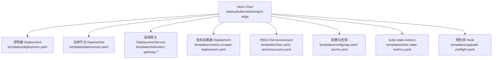
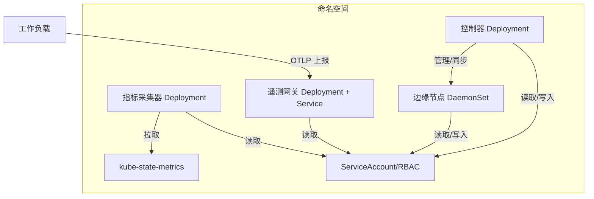
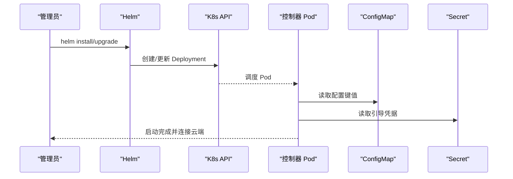
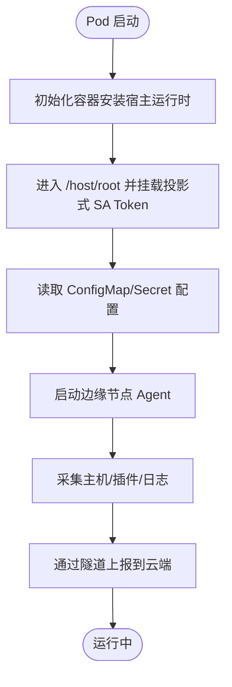
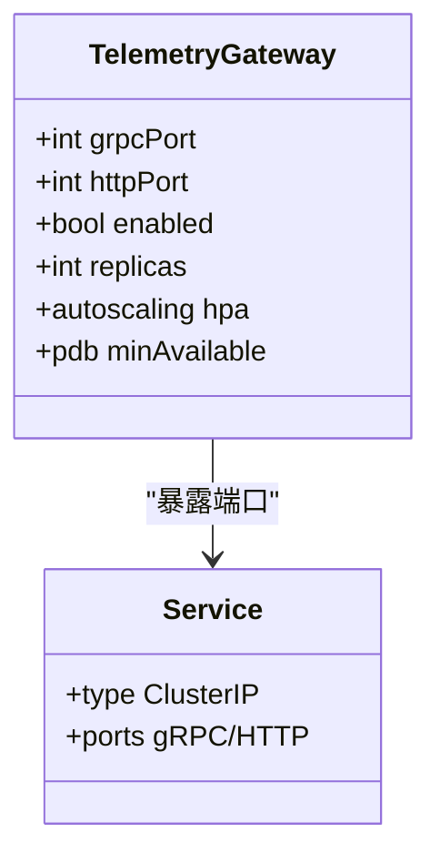
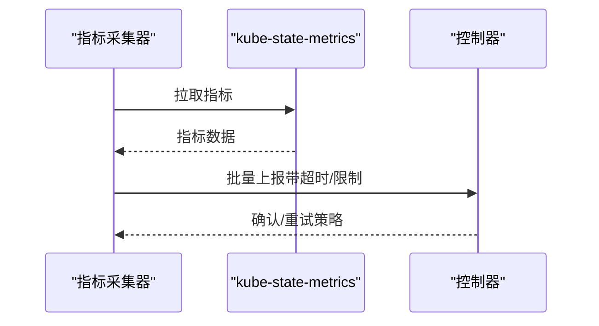
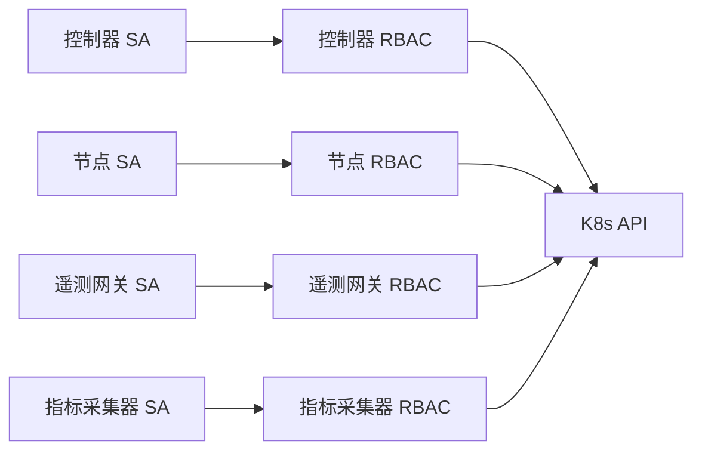

# Kubernetes 部署

<cite>
**本文引用的文件**
- [Chart.yaml](file://deploy/kubernetes/ongrid-edge/Chart.yaml)
- [values.yaml](file://deploy/kubernetes/ongrid-edge/values.yaml)
- [deployment.yaml](file://deploy/kubernetes/ongrid-edge/templates/deployment.yaml)
- [daemonset.yaml](file://deploy/kubernetes/ongrid-edge/templates/daemonset.yaml)
- [configmap.yaml](file://deploy/kubernetes/ongrid-edge/templates/configmap.yaml)
- [secret.yaml](file://deploy/kubernetes/ongrid-edge/templates/secret.yaml)
- [serviceaccount.yaml](file://deploy/kubernetes/ongrid-edge/templates/serviceaccount.yaml)
- [rbac.yaml](file://deploy/kubernetes/ongrid-edge/templates/rbac.yaml)
- [metrics-scraper-deployment.yaml](file://deploy/kubernetes/ongrid-edge/templates/metrics-scraper-deployment.yaml)
- [telemetry-gateway-deployment.yaml](file://deploy/kubernetes/ongrid-edge/templates/telemetry-gateway-deployment.yaml)
- [telemetry-gateway-service.yaml](file://deploy/kubernetes/ongrid-edge/templates/telemetry-gateway-service.yaml)
- [kube-state-metrics.yaml](file://deploy/kubernetes/ongrid-edge/templates/kube-state-metrics.yaml)
- [kind-ongrid-k8s.yaml](file://deploy/kubernetes/kind-ongrid-k8s.yaml)
- [install.sh](file://deploy/install/install.sh)
- [upgrade.sh](file://deploy/install/upgrade.sh)
- [docker-compose.yml](file://deploy/docker-compose.yml)
</cite>

## 目录
1. [简介](#简介)
2. [项目结构](#项目结构)
3. [核心组件](#核心组件)
4. [架构总览](#架构总览)
5. [详细组件分析](#详细组件分析)
6. [依赖关系分析](#依赖关系分析)
7. [性能与扩缩容](#性能与扩缩容)
8. [故障恢复与滚动更新](#故障恢复与滚动更新)
9. [云原生生态集成](#云原生生态集成)
10. [排错指南](#排错指南)
11. [结论](#结论)
12. [附录：安装与升级脚本要点](#附录安装与升级脚本要点)

## 简介
本指南面向在 Kubernetes 上部署 Ongrid 云端管理器与边缘节点（Edge）的运维与平台工程师。内容覆盖 Helm Chart 结构与模板、云端控制器 Deployment、边缘节点 DaemonSet、配置与密钥注入、集群初始化与升级流程，以及扩缩容、滚动更新与故障恢复策略，并给出与 Prometheus Operator、Cert-Manager 等云原生生态的集成建议。

## 项目结构
Ongrid 的 Kubernetes 部署以 Helm Chart 组织，位于 deploy/kubernetes/ongrid-edge。Chart 包含：
- Chart 元数据与可定制 values
- 控制器 Deployment、边缘节点 DaemonSet
- 遥测网关（Telemetry Gateway）与指标采集器（Metrics Scraper）
- RBAC、ServiceAccount、ConfigMap、Secret
- kube-state-metrics 集成模板
- 预检查 Hook（Upgrade Preflight）

图表来源
- [deployment.yaml:17-43](file://deploy/kubernetes/ongrid-edge/templates/deployment.yaml#L17-L43)
- [daemonset.yaml:1-24](file://deploy/kubernetes/ongrid-edge/templates/daemonset.yaml#L1-L24)
- [telemetry-gateway-deployment.yaml](file://deploy/kubernetes/ongrid-edge/templates/telemetry-gateway-deployment.yaml)
- [metrics-scraper-deployment.yaml](file://deploy/kubernetes/ongrid-edge/templates/metrics-scraper-deployment.yaml)
- [rbac.yaml:1-174](file://deploy/kubernetes/ongrid-edge/templates/rbac.yaml#L1-L174)
- [configmap.yaml:24-47](file://deploy/kubernetes/ongrid-edge/templates/configmap.yaml#L24-L47)
- [secret.yaml:1-24](file://deploy/kubernetes/ongrid-edge/templates/secret.yaml#L1-L24)
- [kube-state-metrics.yaml](file://deploy/kubernetes/ongrid-edge/templates/kube-state-metrics.yaml)

章节来源
- [Chart.yaml:1-7](file://deploy/kubernetes/ongrid-edge/Chart.yaml#L1-L7)
- [values.yaml:1-188](file://deploy/kubernetes/ongrid-edge/values.yaml#L1-L188)

## 核心组件
- 云端控制器（Controller）：单副本 Deployment，负责编排与同步边缘节点状态、应用发现、指标拉取与上报。
- 边缘节点（Node Agent）：DaemonSet，运行在每个节点上，具备主机运行时注入、插件管理、本地日志采集与上报能力。
- 遥测网关（Telemetry Gateway）：可选独立 Deployment 或嵌入控制器容器，提供 OTLP gRPC/HTTP 接收端点，支持 HPA 自动扩缩容与 PDB。
- 指标采集器（Kubernetes Metrics Scraper）：独立模式时作为单副本 Deployment，从 kube-state-metrics 拉取指标并通过隧道上报。
- 配置与密钥：通过 ConfigMap 注入非敏感配置，通过 Secret 注入集群 ID、引导令牌、遥测凭据等敏感信息。
- RBAC：为控制器、节点、遥测网关、指标采集器分别授予最小权限。

章节来源
- [deployment.yaml:17-193](file://deploy/kubernetes/ongrid-edge/templates/deployment.yaml#L17-L193)
- [daemonset.yaml:1-188](file://deploy/kubernetes/ongrid-edge/templates/daemonset.yaml#L1-L188)
- [configmap.yaml:24-47](file://deploy/kubernetes/ongrid-edge/templates/configmap.yaml#L24-L47)
- [secret.yaml:1-24](file://deploy/kubernetes/ongrid-edge/templates/secret.yaml#L1-L24)
- [rbac.yaml:1-174](file://deploy/kubernetes/ongrid-edge/templates/rbac.yaml#L1-L174)

## 架构总览
下图展示了 Helm 渲染出的主要资源及其交互关系：控制器与边缘节点通过云端隧道通信；遥测网关暴露 OTLP 端口供工作负载上报；指标采集器从 kube-state-metrics 获取指标；所有组件通过 RBAC 与 ServiceAccount 进行鉴权。

图表来源
- [deployment.yaml:17-193](file://deploy/kubernetes/ongrid-edge/templates/deployment.yaml#L17-L193)
- [daemonset.yaml:1-188](file://deploy/kubernetes/ongrid-edge/templates/daemonset.yaml#L1-L188)
- [telemetry-gateway-service.yaml](file://deploy/kubernetes/ongrid-edge/templates/telemetry-gateway-service.yaml)
- [metrics-scraper-deployment.yaml](file://deploy/kubernetes/ongrid-edge/templates/metrics-scraper-deployment.yaml)
- [kube-state-metrics.yaml](file://deploy/kubernetes/ongrid-edge/templates/kube-state-metrics.yaml)
- [rbac.yaml:1-174](file://deploy/kubernetes/ongrid-edge/templates/rbac.yaml#L1-L174)

## 详细组件分析

### Helm Chart 与 Values 定制
- Chart 元数据：名称、版本、应用版本定义于 Chart.yaml。
- Values 分层：
  - manager：云端公共 URL、隧道地址、TLS 校验开关
  - enrollment：集群 ID、控制器与节点引导令牌
  - image：镜像仓库、标签、拉取策略、架构选择
  - node：节点侧资源限制、容忍度、采集模式
  - controller：副本数（强制为 1）、清单同步策略、指标采集参数
  - kubeStateMetrics：是否启用、镜像与端口、收集器列表、资源限制
  - kubernetesMetrics：独立采集器模式、重试与批处理参数、资源限制
  - telemetryGateway：是否启用、模式（embedded/deployment）、副本、HPA、PDB、服务端口
  - podSecurity：非 root 用户、fsGroup、补充组
- 模板使用：模板通过 include 函数与条件判断渲染不同组件，如 metrics 模式切换、telemetry gateway 模式、app discovery 开关等。

章节来源
- [Chart.yaml:1-7](file://deploy/kubernetes/ongrid-edge/Chart.yaml#L1-L7)
- [values.yaml:1-188](file://deploy/kubernetes/ongrid-edge/values.yaml#L1-L188)
- [configmap.yaml:1-47](file://deploy/kubernetes/ongrid-edge/templates/configmap.yaml#L1-L47)

### 云端管理器（控制器）Deployment
- 副本控制：强制单副本，避免未实现 leader election 的多副本冲突。
- 配置注入：
  - ConfigMap：mode、manager-public-url、manager-tunnel-addr、k8s-inventory-watch/full-sync-interval、k8s-metrics-* 等
  - Secret：cluster-id、bootstrap-token、凭证 Secret 名、遥测凭据 Secret 名
  - 环境变量：角色、模式、字段引用（pod/namespace/node）
- 安全上下文：非 root、只读根文件系统（按需）、能力丢弃、最小权限
- 存储：emptyDir 用于状态缓存
- 滚动更新：Recreate 策略，确保控制器串行更新

图表来源
- [deployment.yaml:17-193](file://deploy/kubernetes/ongrid-edge/templates/deployment.yaml#L17-L193)
- [configmap.yaml:24-47](file://deploy/kubernetes/ongrid-edge/templates/configmap.yaml#L24-L47)
- [secret.yaml:1-24](file://deploy/kubernetes/ongrid-edge/templates/secret.yaml#L1-L24)

章节来源
- [deployment.yaml:17-193](file://deploy/kubernetes/ongrid-edge/templates/deployment.yaml#L17-L193)

### 边缘节点 DaemonSet
- 部署策略：每个节点一个 Pod，hostPID/hostNetwork 开启以访问宿主机资源
- 初始化容器：安装宿主运行时，准备 chroot 环境
- 权限与挂载：
  - 投影式挂载 ServiceAccount Token（含过期时间）与 CA、命名空间
  - hostPath 挂载宿主机根目录，chroot 后保持 token 可读
- 配置注入：
  - ConfigMap：mode、manager-public-url、manager-tunnel-addr
  - Secret：cluster-id、node bootstrap-token
  - 环境变量：角色、模式、路径、collectorMode、HOST_* 等
- 资源限制：CPU/Memory requests/limits 由 values 控制
- 节点选择器与容忍度：按架构选择节点，容忍调度

图表来源
- [daemonset.yaml:1-188](file://deploy/kubernetes/ongrid-edge/templates/daemonset.yaml#L1-L188)
- [configmap.yaml:24-47](file://deploy/kubernetes/ongrid-edge/templates/configmap.yaml#L24-L47)
- [secret.yaml:1-24](file://deploy/kubernetes/ongrid-edge/templates/secret.yaml#L1-L24)

章节来源
- [daemonset.yaml:1-188](file://deploy/kubernetes/ongrid-edge/templates/daemonset.yaml#L1-L188)

### 遥测网关（Telemetry Gateway）
- 模式：embedded（嵌入控制器）或 deployment（独立 Deployment）
- 服务暴露：ClusterIP 服务，gRPC 4317、HTTP 4318
- 自动扩缩容：HPA 基于 CPU 与内存目标，PDB 保证最小可用
- 资源与队列：内存限制、批大小、队列长度、刷新间隔
- RBAC：仅读取 pods/namespaces/nodes 及 workload 资源

图表来源
- [telemetry-gateway-deployment.yaml](file://deploy/kubernetes/ongrid-edge/templates/telemetry-gateway-deployment.yaml)
- [telemetry-gateway-service.yaml](file://deploy/kubernetes/ongrid-edge/templates/telemetry-gateway-service.yaml)
- [values.yaml:134-180](file://deploy/kubernetes/ongrid-edge/values.yaml#L134-L180)

章节来源
- [values.yaml:134-180](file://deploy/kubernetes/ongrid-edge/values.yaml#L134-L180)

### 指标采集器（Kubernetes Metrics Scraper）
- 模式：scraper（独立）或 controller（内置），默认 scraper
- 行为：从 kube-state-metrics 拉取指标，批量上报，带重试与退避
- 资源与副本：requests/limits、maxRetries、retryBackoff
- RBAC：当启用 app 发现时，授予 list pods 权限

图表来源
- [metrics-scraper-deployment.yaml](file://deploy/kubernetes/ongrid-edge/templates/metrics-scraper-deployment.yaml)
- [values.yaml:91-124](file://deploy/kubernetes/ongrid-edge/values.yaml#L91-L124)
- [rbac.yaml:70-99](file://deploy/kubernetes/ongrid-edge/templates/rbac.yaml#L70-L99)

章节来源
- [values.yaml:91-124](file://deploy/kubernetes/ongrid-edge/values.yaml#L91-L124)
- [rbac.yaml:70-99](file://deploy/kubernetes/ongrid-edge/templates/rbac.yaml#L70-L99)

### 配置与密钥管理
- ConfigMap：
  - mode、manager-public-url、manager-tunnel-addr
  - inventory watch/full-sync-interval
  - k8s-metrics-* 系列参数
- Secret：
  - controller-bootstrap：cluster-id、bootstrap-token
  - node-bootstrap：cluster-id、bootstrap-token
  - 遥测凭据 Secret（名称由模板计算）
- 注入方式：
  - envFrom/valueFrom 引用 ConfigMap/Secret
  - 投影式挂载 SA Token 与 CA，支持 token 自动轮换

章节来源
- [configmap.yaml:24-47](file://deploy/kubernetes/ongrid-edge/templates/configmap.yaml#L24-L47)
- [secret.yaml:1-24](file://deploy/kubernetes/ongrid-edge/templates/secret.yaml#L1-L24)
- [daemonset.yaml:155-188](file://deploy/kubernetes/ongrid-edge/templates/daemonset.yaml#L155-L188)

### Ingress 路由设置
- 当前 Chart 未直接提供 Ingress 资源。对外暴露通常通过：
  - 云端 Manager 的 Nginx/TLS 终止（参考 docker-compose 中的 nginx 服务）
  - 结合 Cert-Manager 为 Ingress 签发证书
  - 将 Manager Web/API 与 Grafana/Loki/Tempo 等子路径路由至对应服务
- 建议：
  - 使用 IngressClass 与 TLS Secret
  - 对 /api、/grafana、/loki、/v1/traces 等路径进行反向代理
  - 结合 OIDC/JWT 认证中间件保护入口

[本节为概念性说明，不直接分析具体文件]

## 依赖关系分析
- 控制器依赖：
  - ConfigMap/Secret（配置与引导）
  - RBAC（读写集群资源）
  - 遥测网关（可选，用于 OTLP 接收）
- 边缘节点依赖：
  - ConfigMap/Secret（配置与引导）
  - 宿主运行时（初始化容器安装）
  - 投影式 SA Token（访问 K8s API）
- 指标链路：
  - kube-state-metrics -> 指标采集器 -> 控制器 -> 云端
- 服务账户与权限：
  - 控制器、节点、遥测网关、指标采集器各自独立的 ServiceAccount
  - RBAC 精确授权，遵循最小权限原则

图表来源
- [serviceaccount.yaml:1-35](file://deploy/kubernetes/ongrid-edge/templates/serviceaccount.yaml#L1-L35)
- [rbac.yaml:1-174](file://deploy/kubernetes/ongrid-edge/templates/rbac.yaml#L1-L174)

章节来源
- [serviceaccount.yaml:1-35](file://deploy/kubernetes/ongrid-edge/templates/serviceaccount.yaml#L1-L35)
- [rbac.yaml:1-174](file://deploy/kubernetes/ongrid-edge/templates/rbac.yaml#L1-L174)

## 性能与扩缩容
- 控制器：
  - 单副本，Recreate 策略，适合无状态但需串行更新的场景
  - 清单同步：watch + 全量周期修复漂移
- 指标采集器：
  - 独立模式下单副本，带重试与退避，避免瞬时风暴
- 遥测网关：
  - HPA：基于 CPU 与内存目标自动扩缩容
  - PDB：保证最小可用实例数
  - 内存限制与队列长度控制背压
- 资源建议：
  - 根据集群规模调整 collectorMode、sampleLimit、batchByteLimit
  - 合理设置 HPA targetCPUUtilizationPercentage 与 targetMemoryAverageValue
  - 为边缘节点设置合理的 requests/limits，避免争用

章节来源
- [values.yaml:36-65](file://deploy/kubernetes/ongrid-edge/values.yaml#L36-L65)
- [values.yaml:91-124](file://deploy/kubernetes/ongrid-edge/values.yaml#L91-L124)
- [values.yaml:134-180](file://deploy/kubernetes/ongrid-edge/values.yaml#L134-L180)

## 故障恢复与滚动更新
- 预检查 Hook：
  - Upgrade Preflight：在升级前执行必要的手动交接或校验，保证原子升级
- 控制器更新：
  - Recreate 策略，确保旧实例完全停止后再启动新实例
- 边缘节点更新：
  - DaemonSet 滚动更新，逐节点替换，注意 hostPath 与 chroot 环境一致性
- 回滚策略：
  - Helm rollback 回退到上一版本
  - 若升级失败，保留备份目录以便手动回滚（参考安装/升级脚本逻辑）
- 健康检查：
  - 通过 /healthz 或控制器就绪探针验证服务可用性
  - 升级成功后清理临时工件与旧镜像

章节来源
- [deployment.yaml:27-29](file://deploy/kubernetes/ongrid-edge/templates/deployment.yaml#L27-L29)
- [values.yaml:125-133](file://deploy/kubernetes/ongrid-edge/values.yaml#L125-L133)

## 云原生生态集成
- Prometheus Operator：
  - 可通过 ServiceMonitor/PodMonitor 自动发现 ongrid 指标端点
  - 将遥测网关或控制器指标暴露给 Prometheus
- Cert-Manager：
  - 为 Ingress 或外部 LoadBalancer 签发与管理 TLS 证书
  - 与 NGINX Ingress 配合，自动续期证书
- Grafana：
  - 通过 Provisioning 配置数据源（Prometheus/Loki/Tempo）
  - 仪表盘 JSON 自动加载
- Loki/Tempo：
  - 通过 OTLP 接入日志与追踪数据
  - 通过 Nginx 或 Ingress 暴露查询接口并加鉴权

[本节为概念性说明，不直接分析具体文件]

## 排错指南
- 无法连接云端：
  - 检查 manager.publicURL 与 manager.tunnelAddr 是否正确
  - 确认 TLS 校验与证书链有效
- 指标未上报：
  - 检查 kubernetesMetrics.mode 与 endpoint
  - 查看指标采集器日志与重试退避配置
- 边缘节点无法采集：
  - 确认 hostPID/hostNetwork 与 hostPath 挂载正确
  - 检查 SA Token 投影与 CA 是否挂载成功
- 权限不足：
  - 核对 RBAC 与 ServiceAccount 绑定
  - 确认仅授予所需的最小权限
- 升级失败：
  - 查看 Upgrade Preflight 输出
  - 检查 .env 与数据目录权限（参考安装/升级脚本）

章节来源
- [configmap.yaml:24-47](file://deploy/kubernetes/ongrid-edge/templates/configmap.yaml#L24-L47)
- [daemonset.yaml:155-188](file://deploy/kubernetes/ongrid-edge/templates/daemonset.yaml#L155-L188)
- [rbac.yaml:1-174](file://deploy/kubernetes/ongrid-edge/templates/rbac.yaml#L1-L174)

## 结论
本部署方案通过 Helm Chart 统一管理控制器与边缘节点，结合 ConfigMap/Secret 实现配置与密钥分离，利用 RBAC 保障最小权限。遥测网关与指标采集器提供可扩展的观测能力，HPA/PDB 提升弹性与可用性。配合 Prometheus Operator、Cert-Manager 等生态组件，可实现完整的云原生监控与安全体系。

[本节为总结性内容，不直接分析具体文件]

## 附录：安装与升级脚本要点
- 安装脚本（install.sh）：
  - 检测并安装 Docker/Compose
  - 生成自签名 TLS 证书与环境变量
  - 准备数据目录与权限，复制配置文件
  - 支持 --profile monitoring 启动 Prometheus
- 升级脚本（upgrade.sh）：
  - 预检查新 Compose 模型与镜像可达性
  - 迁移历史卷到宿主绑定目录（可选）
  - 原子替换 edge 资产并重启栈
  - 健康检查与清理旧工件

章节来源
- [install.sh:1-800](file://deploy/install/install.sh#L1-L800)
- [upgrade.sh:1-800](file://deploy/install/upgrade.sh#L1-L800)
- [docker-compose.yml:1-405](file://deploy/docker-compose.yml#L1-L405)