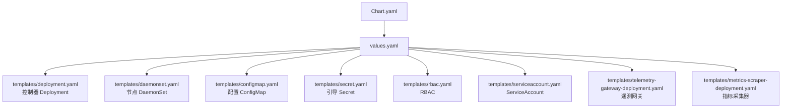
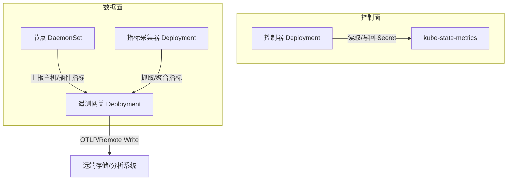
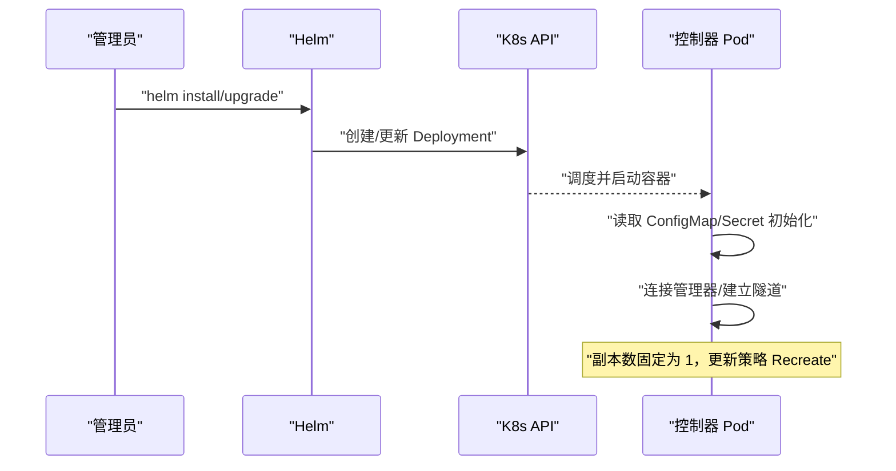
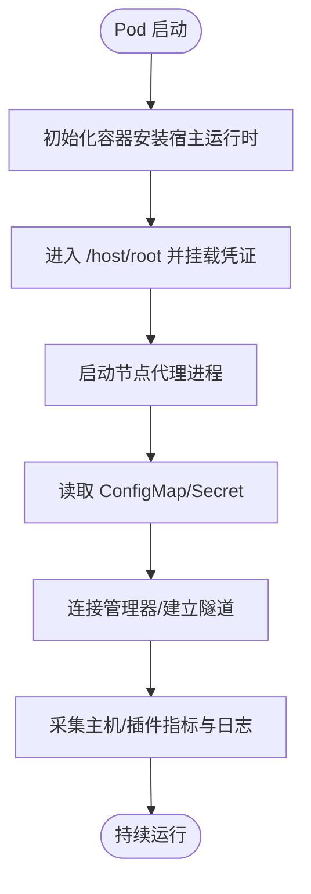
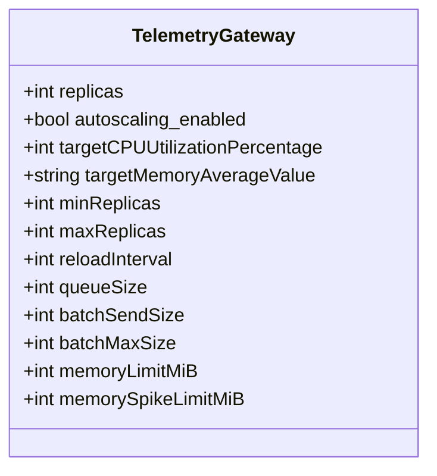
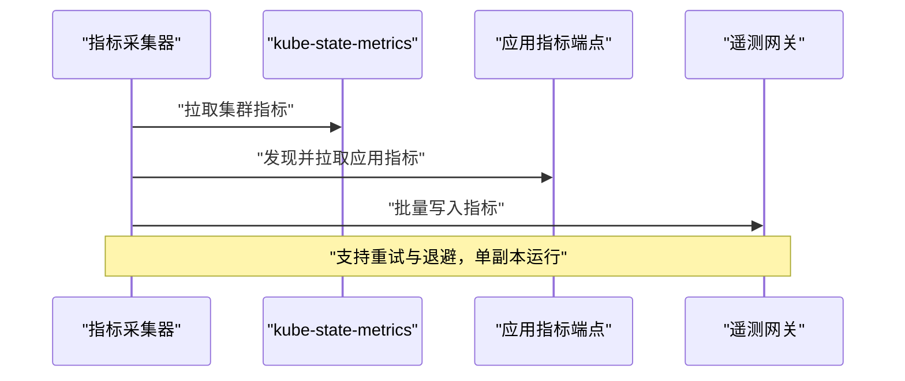
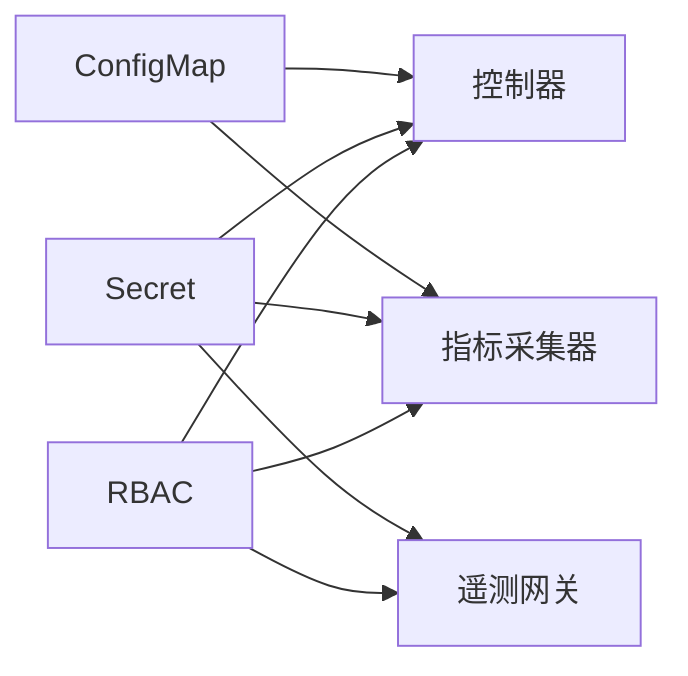

# 云端管理器部署

<cite>
**本文引用的文件**
- [Chart.yaml](file://deploy/kubernetes/ongrid-edge/Chart.yaml)
- [values.yaml](file://deploy/kubernetes/ongrid-edge/values.yaml)
- [_helpers.tpl](file://deploy/kubernetes/ongrid-edge/templates/_helpers.tpl)
- [deployment.yaml](file://deploy/kubernetes/ongrid-edge/templates/deployment.yaml)
- [daemonset.yaml](file://deploy/kubernetes/ongrid-edge/templates/daemonset.yaml)
- [configmap.yaml](file://deploy/kubernetes/ongrid-edge/templates/configmap.yaml)
- [secret.yaml](file://deploy/kubernetes/ongrid-edge/templates/secret.yaml)
- [rbac.yaml](file://deploy/kubernetes/ongrid-edge/templates/rbac.yaml)
- [serviceaccount.yaml](file://deploy/kubernetes/ongrid-edge/templates/serviceaccount.yaml)
- [telemetry-gateway-deployment.yaml](file://deploy/kubernetes/ongrid-edge/templates/telemetry-gateway-deployment.yaml)
- [metrics-scraper-deployment.yaml](file://deploy/kubernetes/ongrid-edge/templates/metrics-scraper-deployment.yaml)
- [README.md](file://deploy/README.md)
</cite>

## 目录
1. [简介](#简介)
2. [项目结构](#项目结构)
3. [核心组件](#核心组件)
4. [架构总览](#架构总览)
5. [详细组件分析](#详细组件分析)
6. [依赖关系分析](#依赖关系分析)
7. [性能与扩缩容](#性能与扩缩容)
8. [滚动更新与故障恢复](#滚动更新与故障恢复)
9. [配置与密钥管理（ConfigMap/Secret）](#配置与密钥管理configmapsecret)
10. [服务暴露与 Ingress 指南](#服务暴露与-ingress-指南)
11. [云原生生态集成（Prometheus/Cert-Manager）](#云原生生态集成prometheuscert-manager)
12. [Helm values 示例与最佳实践](#helm-values-示例与最佳实践)
13. [故障排查指南](#故障排查指南)
14. [结论](#结论)

## 简介
本指南面向在 Kubernetes 中部署 Ongrid 云端管理器及其边缘侧控制器/节点代理的运维与平台工程师。文档基于仓库中的 Helm Chart（deploy/kubernetes/ongrid-edge）进行说明，覆盖 Deployment 配置、副本数、资源请求/限制、Service 暴露方式、Ingress HTTPS 与域名绑定、ConfigMap/Secret 管理、HPA 自动扩缩容、滚动更新策略、故障恢复以及与 Prometheus Operator、Cert-Manager 等云原生生态的集成要点，并提供完整的 Helm values 配置建议与最佳实践。

## 项目结构
Ongrid 的 Kubernetes 部署以 Helm Chart 形式提供，位于 deploy/kubernetes/ongrid-edge：
- Chart.yaml：Chart 元信息
- values.yaml：默认参数与可配置项（副本数、资源、遥测网关、指标采集模式等）
- templates/*：Kubernetes 资源模板（Deployment/DaemonSet/ConfigMap/Secret/RBAC/ServiceAccount 等）

图表来源
- [Chart.yaml:1-7](file://deploy/kubernetes/ongrid-edge/Chart.yaml#L1-L7)
- [values.yaml:1-188](file://deploy/kubernetes/ongrid-edge/values.yaml#L1-L188)

章节来源
- [Chart.yaml:1-7](file://deploy/kubernetes/ongrid-edge/Chart.yaml#L1-L7)
- [values.yaml:1-188](file://deploy/kubernetes/ongrid-edge/values.yaml#L1-L188)

## 核心组件
- 控制器（Controller）：以 Deployment 运行，负责集群状态同步、清单管理与遥测数据推送。当前要求单副本（未实现 Leader Election）。
- 节点代理（Node Agent）：以 DaemonSet 运行在每个节点上，负责主机运行时安装、插件加载、本地日志/指标采集与上报。
- 遥测网关（Telemetry Gateway）：可选独立 Deployment，接收 OTLP gRPC/HTTP 并转发至后端；支持 HPA 与拓扑分散。
- 指标采集器（Metrics Scraper）：可选独立 Deployment，按模式从 kube-state-metrics 或应用发现抓取指标并写入后端。
- 配置与密钥：通过 ConfigMap 注入非敏感配置，通过 Secret 注入引导令牌、遥测凭据等敏感信息。
- RBAC 与 ServiceAccount：为各组件最小权限授权。

章节来源
- [deployment.yaml:17-193](file://deploy/kubernetes/ongrid-edge/templates/deployment.yaml#L17-L193)
- [daemonset.yaml:1-188](file://deploy/kubernetes/ongrid-edge/templates/daemonset.yaml#L1-L188)
- [telemetry-gateway-deployment.yaml:1-164](file://deploy/kubernetes/ongrid-edge/templates/telemetry-gateway-deployment.yaml#L1-L164)
- [metrics-scraper-deployment.yaml:1-169](file://deploy/kubernetes/ongrid-edge/templates/metrics-scraper-deployment.yaml#L1-L169)
- [configmap.yaml:1-47](file://deploy/kubernetes/ongrid-edge/templates/configmap.yaml#L1-L47)
- [secret.yaml:1-24](file://deploy/kubernetes/ongrid-edge/templates/secret.yaml#L1-L24)
- [rbac.yaml:1-174](file://deploy/kubernetes/ongrid-edge/templates/rbac.yaml#L1-L174)
- [serviceaccount.yaml:1-35](file://deploy/kubernetes/ongrid-edge/templates/serviceaccount.yaml#L1-L35)

## 架构总览
下图展示了控制器、节点代理、遥测网关与指标采集器之间的职责与数据流。

图表来源
- [deployment.yaml:17-193](file://deploy/kubernetes/ongrid-edge/templates/deployment.yaml#L17-L193)
- [daemonset.yaml:1-188](file://deploy/kubernetes/ongrid-edge/templates/daemonset.yaml#L1-L188)
- [telemetry-gateway-deployment.yaml:1-164](file://deploy/kubernetes/ongrid-edge/templates/telemetry-gateway-deployment.yaml#L1-L164)
- [metrics-scraper-deployment.yaml:1-169](file://deploy/kubernetes/ongrid-edge/templates/metrics-scraper-deployment.yaml#L1-L169)

## 详细组件分析

### 控制器 Deployment
- 副本数：强制为 1（未实现 Leader Election），任何非 1 的值将导致模板校验失败。
- 更新策略：Recreate（无滚动），避免多实例并发冲突。
- 资源配置：通过 values.controller.resources 设置 requests/limits。
- 配置注入：
  - ConfigMap：模式、管理器公网地址、隧道地址、清单监听开关与全量同步间隔、指标端点/超时/批大小等。
  - Secret：集群 ID、控制器引导令牌、遥测凭据名称。
- 安全上下文：非 root 用户运行，仅 Drop ALL 能力，只读根文件系统（部分路径允许写入状态目录）。
- 探针：通过环境变量与配置驱动，结合外部健康检查。

图表来源
- [deployment.yaml:11-193](file://deploy/kubernetes/ongrid-edge/templates/deployment.yaml#L11-L193)
- [configmap.yaml:24-47](file://deploy/kubernetes/ongrid-edge/templates/configmap.yaml#L24-L47)
- [secret.yaml:1-24](file://deploy/kubernetes/ongrid-edge/templates/secret.yaml#L1-L24)

章节来源
- [deployment.yaml:11-193](file://deploy/kubernetes/ongrid-edge/templates/deployment.yaml#L11-L193)
- [configmap.yaml:24-47](file://deploy/kubernetes/ongrid-edge/templates/configmap.yaml#L24-L47)
- [secret.yaml:1-24](file://deploy/kubernetes/ongrid-edge/templates/secret.yaml#L1-L24)

### 节点 DaemonSet
- 运行模式：每个节点一个 Pod，使用 hostNetwork/hostPID，以便访问宿主机资源。
- 初始化容器：安装宿主运行时，并将必要的凭证投影到 chroot 环境。
- 配置注入：通过 ConfigMap/Secret 注入管理器地址、隧道地址、TLS 选项、节点名等。
- 资源与安全：初始安装容器需要 root 能力，主容器以 root 运行但关闭特权升级，挂载必要系统目录。

图表来源
- [daemonset.yaml:1-188](file://deploy/kubernetes/ongrid-edge/templates/daemonset.yaml#L1-L188)

章节来源
- [daemonset.yaml:1-188](file://deploy/kubernetes/ongrid-edge/templates/daemonset.yaml#L1-L188)

### 遥测网关（Telemetry Gateway）
- 模式：可选择 embedded（嵌入控制器）或 deployment（独立 Deployment）。
- 副本与扩缩容：默认 2 副本；当禁用 HPA 时要求至少 2 副本；支持 HPA 基于 CPU/内存目标值自动扩缩容。
- 资源与内存限制：对 memory limiter 有严格约束（spike < limit ≤ 容器限制的 80%）。
- 端口：OTLP gRPC(4317)、OTLP HTTP(4318)、内部指标(8888)、诊断(9101)。
- 健康检查：/readyz 与 /healthz 探针。

图表来源
- [telemetry-gateway-deployment.yaml:1-164](file://deploy/kubernetes/ongrid-edge/templates/telemetry-gateway-deployment.yaml#L1-L164)
- [values.yaml:134-180](file://deploy/kubernetes/ongrid-edge/values.yaml#L134-L180)

章节来源
- [telemetry-gateway-deployment.yaml:1-164](file://deploy/kubernetes/ongrid-edge/templates/telemetry-gateway-deployment.yaml#L1-L164)
- [values.yaml:134-180](file://deploy/kubernetes/ongrid-edge/values.yaml#L134-L180)

### 指标采集器（Metrics Scraper）
- 模式：scraper（独立采集）或 controller（由控制器直接采集）。
- 数据源：kube-state-metrics 或应用发现（需 RBAC 与 SA Token）。
- 副本：强制为 1（未实现分片/Leader Election）。
- 重试与退避：maxRetries、retryBackoff 可配置。
- 健康检查：/readyz 与 /healthz 探针。

图表来源
- [metrics-scraper-deployment.yaml:1-169](file://deploy/kubernetes/ongrid-edge/templates/metrics-scraper-deployment.yaml#L1-L169)
- [configmap.yaml:31-47](file://deploy/kubernetes/ongrid-edge/templates/configmap.yaml#L31-L47)

章节来源
- [metrics-scraper-deployment.yaml:1-169](file://deploy/kubernetes/ongrid-edge/templates/metrics-scraper-deployment.yaml#L1-L169)
- [configmap.yaml:31-47](file://deploy/kubernetes/ongrid-edge/templates/configmap.yaml#L31-L47)

## 依赖关系分析
- 控制器依赖：
  - ConfigMap：模式、管理器地址、隧道地址、清单与指标相关配置。
  - Secret：集群 ID、引导令牌、遥测凭据名称。
  - RBAC：读写特定 Secret、列举/监听集群资源。
- 节点依赖：
  - ConfigMap/Secret：同上。
  - 宿主机：hostNetwork/hostPID、/proc、/sys、/ 目录挂载。
- 遥测网关依赖：
  - Secret：遥测凭据（远程写入端点、认证、TLS CA）。
  - RBAC：读取 Pod/命名空间/节点与应用资源（用于属性增强）。
- 指标采集器依赖：
  - ConfigMap：指标端点、间隔、超时、批大小、重试策略。
  - RBAC：列出 Pod（应用发现）。

图表来源
- [configmap.yaml:24-47](file://deploy/kubernetes/ongrid-edge/templates/configmap.yaml#L24-L47)
- [secret.yaml:1-24](file://deploy/kubernetes/ongrid-edge/templates/secret.yaml#L1-L24)
- [rbac.yaml:1-174](file://deploy/kubernetes/ongrid-edge/templates/rbac.yaml#L1-L174)

章节来源
- [configmap.yaml:24-47](file://deploy/kubernetes/ongrid-edge/templates/configmap.yaml#L24-L47)
- [secret.yaml:1-24](file://deploy/kubernetes/ongrid-edge/templates/secret.yaml#L1-L24)
- [rbac.yaml:1-174](file://deploy/kubernetes/ongrid-edge/templates/rbac.yaml#L1-L174)

## 性能与扩缩容
- 控制器：单副本，Recreate 更新；适合强一致场景。
- 节点：DaemonSet，随节点扩展而扩展。
- 遥测网关：
  - 默认 2 副本，支持 HPA（CPU 利用率与平均内存目标值）。
  - 内存限制需满足 spike < limit ≤ 容器限制的 80%，确保 OOM 保护有效。
  - 队列与批大小可调，平衡吞吐与延迟。
- 指标采集器：单副本，可通过 kube-state-metrics 或应用发现获取指标；重试与退避可缓解瞬时抖动。

章节来源
- [values.yaml:36-64](file://deploy/kubernetes/ongrid-edge/values.yaml#L36-L64)
- [values.yaml:91-123](file://deploy/kubernetes/ongrid-edge/values.yaml#L91-L123)
- [values.yaml:134-180](file://deploy/kubernetes/ongrid-edge/values.yaml#L134-L180)
- [telemetry-gateway-deployment.yaml:16-30](file://deploy/kubernetes/ongrid-edge/templates/telemetry-gateway-deployment.yaml#L16-L30)
- [metrics-scraper-deployment.yaml:7-15](file://deploy/kubernetes/ongrid-edge/templates/metrics-scraper-deployment.yaml#L7-L15)

## 滚动更新与故障恢复
- 控制器：Recreate 策略，保证同一时间只有一个实例运行，避免并发冲突。
- 遥测网关：RollingUpdate，maxUnavailable=0，maxSurge=1，配合拓扑分散与 PDB（minAvailable=1）提升可用性。
- 节点：DaemonSet 滚动更新，新 Pod 就绪后替换旧 Pod。
- 升级钩子：支持 pre-upgrade 迁移钩子，确保平滑升级。
- 故障恢复：
  - 探针：readiness/liveness/startup 探针保障自愈。
  - 重试：指标采集器支持重试与退避。
  - 资源隔离：严格的资源限制与内存 limiter，防止雪崩。

章节来源
- [deployment.yaml:27-28](file://deploy/kubernetes/ongrid-edge/templates/deployment.yaml#L27-L28)
- [telemetry-gateway-deployment.yaml:43-47](file://deploy/kubernetes/ongrid-edge/templates/telemetry-gateway-deployment.yaml#L43-L47)
- [telemetry-gateway-deployment.yaml:129-143](file://deploy/kubernetes/ongrid-edge/templates/telemetry-gateway-deployment.yaml#L129-L143)
- [metrics-scraper-deployment.yaml:117-137](file://deploy/kubernetes/ongrid-edge/templates/metrics-scraper-deployment.yaml#L117-L137)
- [values.yaml:125-133](file://deploy/kubernetes/ongrid-edge/values.yaml#L125-L133)

## 配置与密钥管理（ConfigMap/Secret）
- ConfigMap：
  - 模式、管理器公网地址、隧道地址。
  - 清单监听开关与全量同步间隔。
  - 指标端点、间隔、超时、批大小、重试策略、应用发现开关。
- Secret：
  - 控制器与节点的引导令牌与集群 ID。
  - 遥测凭据（远程写入端点、认证、TLS CA）。
- 安全上下文：
  - 非 root 用户运行（控制器与网关），节点代理因系统访问需要 root 能力但关闭特权升级。
  - 只读根文件系统（除必要状态目录）。

章节来源
- [configmap.yaml:31-47](file://deploy/kubernetes/ongrid-edge/templates/configmap.yaml#L31-L47)
- [secret.yaml:1-24](file://deploy/kubernetes/ongrid-edge/templates/secret.yaml#L1-L24)
- [deployment.yaml:49-53](file://deploy/kubernetes/ongrid-edge/templates/deployment.yaml#L49-L53)
- [daemonset.yaml:146-154](file://deploy/kubernetes/ongrid-edge/templates/daemonset.yaml#L146-L154)

## 服务暴露与 Ingress 指南
- 内置服务：
  - 遥测网关：默认 ClusterIP，暴露 OTLP gRPC(4317)/HTTP(4318) 与内部指标(8888)、诊断(9101)。
  - 控制器：通常不直接对外暴露，通过隧道与管理器通信。
- Service 类型选择：
  - ClusterIP：默认，适用于集群内调用（推荐）。
  - NodePort：便于临时调试，不建议生产。
  - LoadBalancer：若需对外暴露遥测网关，请结合 Ingress/TLS 与防火墙策略。
- Ingress 与 HTTPS：
  - 使用 Ingress Controller（如 Nginx/Contour/AWS ALB）将域名绑定到遥测网关 Service。
  - 启用 TLS 终止，证书由 Cert-Manager 管理（见下一节）。
  - 注意：遥测网关主要面向 OTLP 流量，HTTP 端口用于兼容；gRPC 端口用于高性能传输。
- 安全建议：
  - 仅暴露必要端口，限制来源 IP。
  - 使用 mTLS 或 bearer token 鉴权（取决于后端能力）。

章节来源
- [values.yaml:176-180](file://deploy/kubernetes/ongrid-edge/values.yaml#L176-L180)
- [telemetry-gateway-deployment.yaml:93-105](file://deploy/kubernetes/ongrid-edge/templates/telemetry-gateway-deployment.yaml#L93-L105)

## 云原生生态集成（Prometheus/Cert-Manager）
- Prometheus Operator：
  - 可将遥测网关作为 ServiceMonitor/EndpointSlice 暴露给 Prometheus。
  - 指标采集器也可通过 ServiceMonitor 暴露其诊断端口（9101）。
- Grafana：
  - 通过 Data Source 指向 Prometheus，展示指标与告警。
- Cert-Manager：
  - 为 Ingress 自动签发与续期 TLS 证书。
  - 与 Ingress Controller 集成，简化 HTTPS 配置。
- 其他：
  - 可结合 NetworkPolicy 限制跨命名空间访问。
  - 使用 PodDisruptionBudget 保障高可用。

章节来源
- [telemetry-gateway-deployment.yaml:129-143](file://deploy/kubernetes/ongrid-edge/templates/telemetry-gateway-deployment.yaml#L129-L143)
- [metrics-scraper-deployment.yaml:117-137](file://deploy/kubernetes/ongrid-edge/templates/metrics-scraper-deployment.yaml#L117-L137)
- [values.yaml:173-175](file://deploy/kubernetes/ongrid-edge/values.yaml#L173-L175)

## Helm values 示例与最佳实践
以下为关键 values 字段说明与推荐配置思路（具体键名与默认值参考 values.yaml）：
- mode：必须为 full-node。
- manager.publicURL/manager.tunnelAddr：必填，用于控制器与节点连接管理器。
- enrollment.clusterID/controllerBootstrapToken/nodeBootstrapToken：必填，用于引导与身份认证。
- image.repository/tag/pullPolicy：镜像仓库与版本策略。
- node.resources：节点代理的请求/限制，建议根据实际负载调整。
- controller.replicas：固定为 1。
- controller.metrics.*：指标采集模式与参数（endpoint、interval、timeout、sampleLimit、batchSampleLimit、batchByteLimit）。
- kubeStateMetrics.enabled/port：是否启用 kube-state-metrics 及端口。
- kubernetesMetrics.mode/enabled/replicas：指标采集模式（controller/scraper）、是否启用、副本数（scraper 模式为 1）。
- telemetryGateway.enabled/mode/replicas：遥测网关开关、模式（embedded/deployment）、副本数。
- telemetryGateway.autoscaling：HPA 配置（enabled、min/max replicas、CPU/内存目标值、稳定窗口）。
- telemetryGateway.resources.limits.memory：必须满足 memory limiter 约束（spike < limit ≤ 80% 容器限制）。
- podSecurity.runAsNonRoot/runAsUser/runAsGroup/fsGroup：统一安全上下文。

最佳实践：
- 使用 Secret 管理所有敏感信息（引导令牌、遥测凭据）。
- 使用 ConfigMap 管理非敏感配置，并通过 checksum 注解触发滚动更新。
- 为遥测网关启用 HPA，并结合 PDB 保障高可用。
- 在生产环境禁用 NodePort，优先使用 Ingress + TLS。
- 定期轮换引导令牌与遥测凭据。
- 监控资源使用率，动态调整 requests/limits 与 HPA 目标值。

章节来源
- [values.yaml:1-188](file://deploy/kubernetes/ongrid-edge/values.yaml#L1-L188)
- [deployment.yaml:36-38](file://deploy/kubernetes/ongrid-edge/templates/deployment.yaml#L36-L38)
- [telemetry-gateway-deployment.yaml:16-30](file://deploy/kubernetes/ongrid-edge/templates/telemetry-gateway-deployment.yaml#L16-L30)

## 故障排查指南
- 控制器无法启动：
  - 检查 ConfigMap 中 manager-public-url/manager-tunnel-addr 是否正确。
  - 检查 Secret 中 cluster-id/bootstrap-token 是否存在且有效。
  - 查看事件与日志，确认 RBAC 权限是否足够。
- 节点代理无法连接管理器：
  - 检查网络连通性与 DNS（ClusterFirstWithHostNet）。
  - 检查 TLS 配置（tlsInsecure）与证书链。
- 遥测网关不可用：
  - 检查 /readyz 与 /healthz 探针状态。
  - 检查内存 limiter 配置是否满足约束（spike < limit ≤ 80% 容器限制）。
  - 检查 HPA 是否被正确创建与缩放。
- 指标采集失败：
  - 检查 kube-state-metrics 是否可达。
  - 检查应用发现所需的 RBAC 与 SA Token 是否挂载。
  - 调整重试与退避参数。

章节来源
- [deployment.yaml:68-107](file://deploy/kubernetes/ongrid-edge/templates/deployment.yaml#L68-L107)
- [daemonset.yaml:80-123](file://deploy/kubernetes/ongrid-edge/templates/daemonset.yaml#L80-L123)
- [telemetry-gateway-deployment.yaml:129-143](file://deploy/kubernetes/ongrid-edge/templates/telemetry-gateway-deployment.yaml#L129-L143)
- [metrics-scraper-deployment.yaml:117-137](file://deploy/kubernetes/ongrid-edge/templates/metrics-scraper-deployment.yaml#L117-L137)

## 结论
本指南基于仓库提供的 Helm Chart 说明了 Ongrid 云端管理器在 Kubernetes 中的完整部署方案，涵盖控制器与节点代理的部署、遥测网关与指标采集器的配置、配置与密钥管理、服务暴露与 Ingress、HPA 自动扩缩容、滚动更新与故障恢复，以及与 Prometheus Operator、Cert-Manager 等云原生生态的集成要点。建议在生产环境中遵循最小权限、资源隔离、高可用与健康检查的最佳实践，确保系统稳定与可观测性。