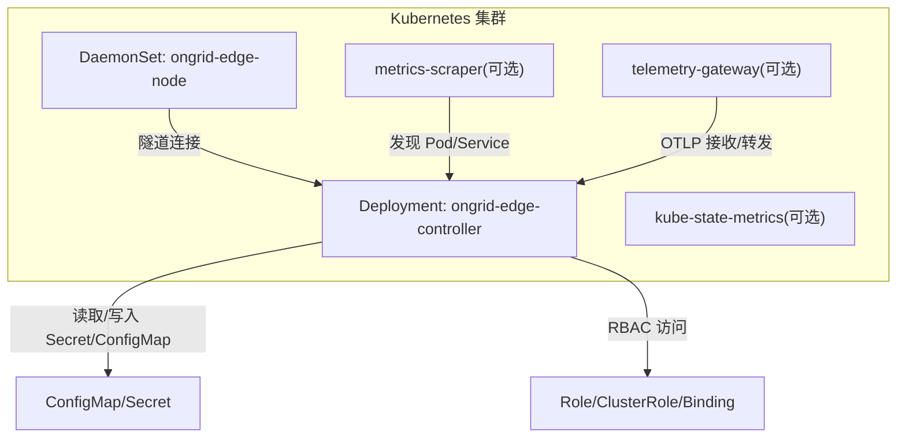
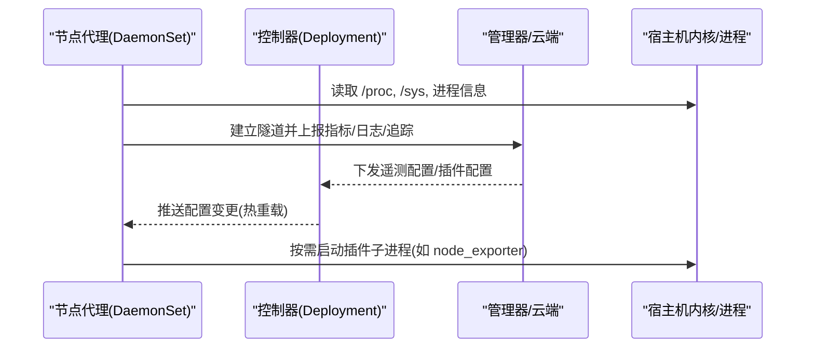
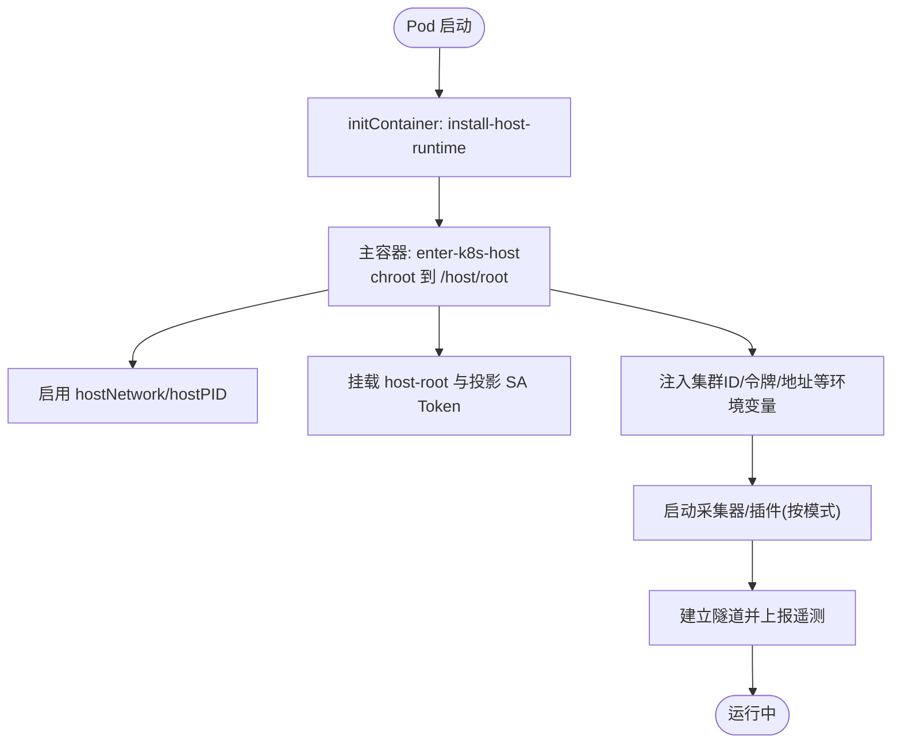
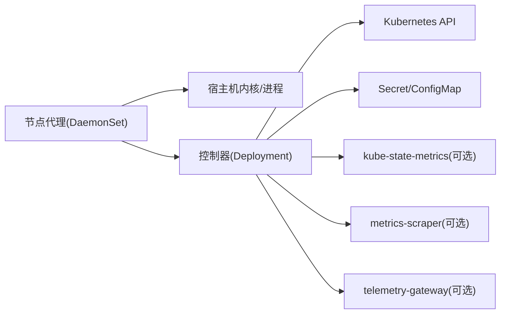

# 边缘节点部署

<cite>
**本文引用的文件**
- [values.yaml](file://deploy/kubernetes/ongrid-edge/values.yaml)
- [Chart.yaml](file://deploy/kubernetes/ongrid-edge/Chart.yaml)
- [daemonset.yaml](file://deploy/kubernetes/ongrid-edge/templates/daemonset.yaml)
- [deployment.yaml](file://deploy/kubernetes/ongrid-edge/templates/deployment.yaml)
- [configmap.yaml](file://deploy/kubernetes/ongrid-edge/templates/configmap.yaml)
- [secret.yaml](file://deploy/kubernetes/ongrid-edge/templates/secret.yaml)
- [serviceaccount.yaml](file://deploy/kubernetes/ongrid-edge/templates/serviceaccount.yaml)
- [rbac.yaml](file://deploy/kubernetes/ongrid-edge/templates/rbac.yaml)
- [main.go](file://cmd/ongrid-edge/main.go)
- [edge.md](file://docs/install/edge.md)
- [kind-ongrid-k8s.yaml](file://deploy/kubernetes/kind-ongrid-k8s.yaml)
</cite>

## 目录
1. [简介](#简介)
2. [项目结构](#项目结构)
3. [核心组件](#核心组件)
4. [架构总览](#架构总览)
5. [详细组件分析](#详细组件分析)
6. [依赖关系分析](#依赖关系分析)
7. [性能与资源限制](#性能与资源限制)
8. [故障排查指南](#故障排查指南)
9. [结论](#结论)
10. [附录：不同环境配置示例](#附录不同环境配置示例)

## 简介
本指南面向在 Kubernetes 中部署 Ongrid 边缘节点（Edge Agent）的运维与平台工程师。内容聚焦于 DaemonSet 部署、RBAC 权限、主机网络与卷挂载、资源限制与请求、节点标签与污点调度，以及生产/开发/测试环境的差异化配置建议与排障要点。所有说明均基于仓库中的 Helm Chart 模板与边缘端二进制行为。

## 项目结构
Ongrid 通过 Helm Chart 提供“控制器 + 节点代理”的一体化部署能力：
- 控制器（Controller）以 Deployment 运行，负责集群元数据同步、遥测网关协调等控制面职责。
- 节点代理（Node Agent）以 DaemonSet 在每个目标节点上运行，具备主机访问能力，用于采集指标、日志、追踪，并执行远程操作。
- 可选的 kube-state-metrics、独立 metrics scraper、telemetry gateway 等组件按需启用。

图表来源
- [daemonset.yaml:1-188](file://deploy/kubernetes/ongrid-edge/templates/daemonset.yaml#L1-L188)
- [deployment.yaml:1-193](file://deploy/kubernetes/ongrid-edge/templates/deployment.yaml#L1-L193)
- [configmap.yaml:1-47](file://deploy/kubernetes/ongrid-edge/templates/configmap.yaml#L1-L47)
- [secret.yaml:1-24](file://deploy/kubernetes/ongrid-edge/templates/secret.yaml#L1-L24)
- [rbac.yaml:1-174](file://deploy/kubernetes/ongrid-edge/templates/rbac.yaml#L1-L174)

章节来源
- [Chart.yaml:1-7](file://deploy/kubernetes/ongrid-edge/Chart.yaml#L1-L7)
- [values.yaml:1-188](file://deploy/kubernetes/ongrid-edge/values.yaml#L1-L188)

## 核心组件
- 节点代理（DaemonSet）：每个节点一个实例，具备 hostNetwork/hostPID 与宿主文件系统访问能力，负责指标/日志/追踪采集与远程操作通道。
- 控制器（Deployment）：单副本运行，负责与云端/管理器通信、遥测网关协调、集群资源观测与编排。
- 服务账户与 RBAC：为节点代理、控制器、telemetry gateway、metrics scraper 分别定义最小权限的 Role/ClusterRole 与绑定。
- 配置与凭据：通过 ConfigMap 与 Secret 注入运行时参数与启动令牌；节点侧使用投影式 ServiceAccount Token 实现自动轮换。
- 可选组件：kube-state-metrics、独立 metrics scraper、telemetry gateway（可嵌入或独立 Deployment）。

章节来源
- [daemonset.yaml:1-188](file://deploy/kubernetes/ongrid-edge/templates/daemonset.yaml#L1-L188)
- [deployment.yaml:1-193](file://deploy/kubernetes/ongrid-edge/templates/deployment.yaml#L1-L193)
- [serviceaccount.yaml:1-35](file://deploy/kubernetes/ongrid-edge/templates/serviceaccount.yaml#L1-L35)
- [rbac.yaml:1-174](file://deploy/kubernetes/ongrid-edge/templates/rbac.yaml#L1-L174)
- [configmap.yaml:1-47](file://deploy/kubernetes/ongrid-edge/templates/configmap.yaml#L1-L47)
- [secret.yaml:1-24](file://deploy/kubernetes/ongrid-edge/templates/secret.yaml#L1-L24)
- [values.yaml:1-188](file://deploy/kubernetes/ongrid-edge/values.yaml#L1-L188)

## 架构总览
边缘节点在 Kubernetes 中的典型工作流如下：
- 节点代理以 DaemonSet 形式在每个节点启动，进入宿主根目录 chroot，并通过隧道连接到管理器/控制器。
- 控制器以 Deployment 运行，负责拉取遥测配置、管理插件生命周期、聚合指标与事件。
- 节点代理通过宿主网络与进程空间访问系统指标，必要时调用插件（如 node_exporter、process-exporter、otelcol-contrib）。
- 控制器与节点之间通过安全隧道传输遥测数据与控制指令。

图表来源
- [main.go:121-417](file://cmd/ongrid-edge/main.go#L121-L417)
- [daemonset.yaml:70-188](file://deploy/kubernetes/ongrid-edge/templates/daemonset.yaml#L70-L188)
- [deployment.yaml:55-193](file://deploy/kubernetes/ongrid-edge/templates/deployment.yaml#L55-L193)

## 详细组件分析

### DaemonSet：边缘节点代理
- 节点选择器：支持按镜像架构设置 kubernetes.io/arch 选择器，便于跨架构部署。
- 容忍度：通过 values.node.tolerations 注入，默认包含 Exists 容忍，便于部署到带污点的节点。
- 亲和性：可通过 Helm values 扩展至节点亲和规则（当前模板未硬编码，建议在 values 层叠加 affinity）。
- 主机网络与 PID：启用 hostNetwork=true、hostPID=true，DNS 策略为 ClusterFirstWithHostNet，确保网络栈与进程可见性。
- 初始化容器：install-host-runtime 以 root 身份安装宿主运行时，随后主容器以 root 进入宿主根目录 chroot。
- 安全上下文：仅授予必要能力（如 NET_ADMIN、SYS_CHROOT 等），禁止特权模式与能力提升。
- 卷挂载：
  - host-root：以 HostToContainer 传播方式挂载宿主根目录，供 chroot 后访问。
  - 投影式 service account token：将 token、CA、命名空间等信息投影到 chroot 路径下，配合 kubelet 自动轮换。
- 环境变量：注入集群 ID、启动令牌、收集器模式、插件目录、升级目录、管理器地址等。
- 资源限制：通过 values.node.resources 统一配置 requests/limits。

图表来源
- [daemonset.yaml:34-188](file://deploy/kubernetes/ongrid-edge/templates/daemonset.yaml#L34-L188)
- [values.yaml:21-35](file://deploy/kubernetes/ongrid-edge/values.yaml#L21-L35)

章节来源
- [daemonset.yaml:1-188](file://deploy/kubernetes/ongrid-edge/templates/daemonset.yaml#L1-L188)
- [values.yaml:13-35](file://deploy/kubernetes/ongrid-edge/values.yaml#L13-L35)

### RBAC：权限模型
- 节点代理：
  - 最小权限 ClusterRole：仅允许读取 kube-system 命名空间的 namespace（用于集群标识）。
  - 对应 ClusterRoleBinding 绑定到节点 ServiceAccount。
- 控制器：
  - ClusterRole：对 nodes/namespaces/pods/services/endpoints/events/pvc 等资源的只读访问，以及对 pods 的删除/驱逐、nodes 的 patch 等有限写权限。
  - 对应 ClusterRoleBinding 绑定到控制器 ServiceAccount。
- telemetry gateway（可选）：
  - ClusterRole：读取 pods/nodes/namespaces 及 workload 资源（apps/batch），用于属性提取与拓扑关联。
  - 对应 ClusterRoleBinding 绑定到 telemetry gateway ServiceAccount。
- metrics scraper（可选）：
  - ClusterRole：仅 list pods，用于应用指标发现。
  - 对应 ClusterRoleBinding 绑定到 metrics scraper ServiceAccount。
- 控制器凭据 Secret 访问：
  - 命名空间级 Role/RoleBinding：允许控制器 SA 读取特定 Secret（控制器凭据与遥测凭据）。

章节来源
- [rbac.yaml:1-174](file://deploy/kubernetes/ongrid-edge/templates/rbac.yaml#L1-L174)
- [serviceaccount.yaml:1-35](file://deploy/kubernetes/ongrid-edge/templates/serviceaccount.yaml#L1-L35)

### 主机网络与卷挂载
- hostNetwork=true：节点代理直接使用宿主网络栈，避免 CNI 隔离带来的端口冲突与 NAT 问题。
- hostPID=true：可枚举宿主进程，便于进程级指标采集与诊断。
- dnsPolicy=ClusterFirstWithHostNet：在宿主网络模式下仍优先解析集群内部域名。
- 卷挂载：
  - host-root：以 HostToContainer 传播，使 chroot 后的进程能访问宿主文件系统。
  - 投影式 SA Token：将 token/ca.crt/namespace 投影到 chroot 下的指定路径，支持 kubelet 自动轮换，避免重启 Pod 获取新凭证。

章节来源
- [daemonset.yaml:34-36](file://deploy/kubernetes/ongrid-edge/templates/daemonset.yaml#L34-L36)
- [daemonset.yaml:155-188](file://deploy/kubernetes/ongrid-edge/templates/daemonset.yaml#L155-L188)

### 资源限制与请求
- 节点代理：通过 values.node.resources.requests/limits 设定 CPU/内存上下限，默认值适合多数边缘场景。
- 控制器：通过 values.controller.resources 配置，默认值满足一般控制面负载。
- 可选组件：kube-state-metrics、metrics-scraper、telemetry gateway 均有独立的 resources 配置项，可按规模调整。
- 建议：
  - 生产环境：适当提高 limits，预留突发峰值；结合 HPA/PDB 保障可用性。
  - 开发/测试：降低 requests/limits，缩短冷启动时间，加快迭代。

章节来源
- [values.yaml:21-35](file://deploy/kubernetes/ongrid-edge/values.yaml#L21-L35)
- [values.yaml:36-64](file://deploy/kubernetes/ongrid-edge/values.yaml#L36-L64)
- [values.yaml:66-84](file://deploy/kubernetes/ongrid-edge/values.yaml#L66-L84)
- [values.yaml:91-123](file://deploy/kubernetes/ongrid-edge/values.yaml#L91-L123)
- [values.yaml:134-179](file://deploy/kubernetes/ongrid-edge/values.yaml#L134-L179)

### 节点标签与污点
- 节点选择器：可通过 values.image.architecture 设置 kubernetes.io/arch 选择器，限定架构。
- 容忍度：values.node.tolerations 默认包含 Exists 容忍，便于部署到带污点的节点。
- 亲和性：可在 values 层添加 nodeAffinity/requiredDuringSchedulingIgnoredDuringExecution 等规则，实现更精细的调度（例如按机房/地域/设备类型）。
- 污点策略：建议为边缘节点打上专用污点（如 edge=true:NoSchedule），并为 DaemonSet 配置对应容忍，从而隔离调度域。

章节来源
- [daemonset.yaml:30-38](file://deploy/kubernetes/ongrid-edge/templates/daemonset.yaml#L30-L38)
- [values.yaml:13-35](file://deploy/kubernetes/ongrid-edge/values.yaml#L13-L35)

### 控制器与遥测网关
- 控制器（Deployment）：单副本运行，负责与云端/管理器通信、遥测配置同步、插件生命周期管理。
- 遥测网关：
  - 可嵌入控制器或独立 Deployment 运行。
  - 暴露 OTLP gRPC/HTTP 端口，供集群内工作负载导出追踪/指标/日志。
  - 支持 HPA 与 PDB，保障高可用与弹性伸缩。
- 配置来源：通过 ConfigMap 注入指标采集间隔、超时、批大小限制等；通过 Secret 注入凭据。

章节来源
- [deployment.yaml:1-193](file://deploy/kubernetes/ongrid-edge/templates/deployment.yaml#L1-L193)
- [configmap.yaml:1-47](file://deploy/kubernetes/ongrid-edge/templates/configmap.yaml#L1-L47)
- [values.yaml:134-179](file://deploy/kubernetes/ongrid-edge/values.yaml#L134-L179)

## 依赖关系分析
- 节点代理依赖：
  - 宿主机资源：/proc、/sys、网络栈、进程表。
  - 控制器/管理器：通过隧道进行认证与数据传输。
  - 插件子系统：按需拉起 node_exporter、process-exporter、otelcol-contrib 等。
- 控制器依赖：
  - Kubernetes API：读取节点/命名空间/Pod/Service/Event 等。
  - Secret/ConfigMap：读取凭据与运行时配置。
  - 可选组件：kube-state-metrics、metrics-scraper、telemetry gateway。

图表来源
- [main.go:121-417](file://cmd/ongrid-edge/main.go#L121-L417)
- [daemonset.yaml:70-188](file://deploy/kubernetes/ongrid-edge/templates/daemonset.yaml#L70-L188)
- [deployment.yaml:55-193](file://deploy/kubernetes/ongrid-edge/templates/deployment.yaml#L55-L193)

章节来源
- [main.go:121-417](file://cmd/ongrid-edge/main.go#L121-L417)
- [daemonset.yaml:70-188](file://deploy/kubernetes/ongrid-edge/templates/daemonset.yaml#L70-L188)
- [deployment.yaml:55-193](file://deploy/kubernetes/ongrid-edge/templates/deployment.yaml#L55-L193)

## 性能与资源限制
- 采集模式：
  - off：默认推荐，避免重复推送 node_* 指标；由管理器直接抓取宿主插件暴露的指标。
  - scrape/embedded/auto：根据历史兼容性与需求选择，注意指标重复与带宽占用。
- 批处理与限流：
  - 控制器/scraper 支持样本数、批次大小、字节上限、重试次数与退避策略，防止拥塞。
- 遥测网关：
  - 内存限制与 HPA 目标（CPU/内存）已内置合理默认值；可根据集群规模调优。
- 建议：
  - 生产：开启 HPA，设置 PDB；增大 batchByteLimit/sampleLimit；监控队列长度与延迟。
  - 开发/测试：关闭非必要插件；降低 replicas 与资源上限；缩短采集间隔以快速验证。

章节来源
- [values.yaml:21-35](file://deploy/kubernetes/ongrid-edge/values.yaml#L21-L35)
- [values.yaml:91-123](file://deploy/kubernetes/ongrid-edge/values.yaml#L91-L123)
- [values.yaml:134-179](file://deploy/kubernetes/ongrid-edge/values.yaml#L134-L179)
- [main.go:428-488](file://cmd/ongrid-edge/main.go#L428-L488)

## 故障排查指南
- 无法连接管理器/控制器：
  - 检查集群 ID、启动令牌、TLS 是否配置正确；确认网络可达与证书信任。
  - 参考安装文档中的连接验证步骤。
- 指标缺失：
  - 确认采集模式与插件状态；检查宿主插件是否监听预期端口；查看控制器/scraper 的批大小与超时。
- 权限错误：
  - 核对 RBAC 是否创建成功；确认 ServiceAccount 与 Binding 匹配；检查 Secret 名称与键名。
- 节点调度失败：
  - 检查节点标签、污点与容忍度；确认架构选择器与亲和性规则是否符合目标节点。
- 日志定位：
  - 查看节点代理与控制器 Pod 日志；关注隧道连接、插件健康、遥测配置刷新等关键事件。

章节来源
- [edge.md:105-119](file://docs/install/edge.md#L105-L119)
- [rbac.yaml:1-174](file://deploy/kubernetes/ongrid-edge/templates/rbac.yaml#L1-L174)
- [daemonset.yaml:34-188](file://deploy/kubernetes/ongrid-edge/templates/daemonset.yaml#L34-L188)
- [deployment.yaml:55-193](file://deploy/kubernetes/ongrid-edge/templates/deployment.yaml#L55-L193)

## 结论
Ongrid 的边缘节点在 Kubernetes 中以 DaemonSet 形式部署，具备宿主网络与进程访问能力，配合控制器完成遥测数据的采集、转发与编排。通过灵活的 RBAC、资源限制与调度策略，可适配生产、开发与测试等多种场景。建议在生产环境中启用 HPA/PDB、合理配置批处理与限流，并结合节点标签与污点进行精细化调度。

## 附录：不同环境配置示例
以下示例基于 values.yaml 与模板渲染逻辑，给出不同环境的推荐配置思路（不直接粘贴代码，仅提供字段与取值建议）：

- 生产环境
  - 节点代理：
    - tolerations：保留 Exists 容忍，并增加针对边缘污点的容忍。
    - resources：requests 不低于 50m CPU/128Mi 内存；limits 适当提高以应对突发。
    - collectorMode：off（默认），避免重复指标。
  - 控制器：
    - replicas：保持 1（模板强制校验）。
    - resources：requests 50m/128Mi；limits 500m/512Mi。
  - telemetry gateway：
    - enabled：true；mode：deployment；replicas：2。
    - autoscaling：enabled true；minReplicas 2；maxReplicas 10；CPU 目标约 60%；内存目标约 512Mi。
    - podDisruptionBudget：enabled true；minAvailable 1。
  - 安全：
    - manager.tlsInsecure：false；严格 TLS 校验。
    - 使用独立命名空间与严格的 RBAC。

- 开发环境
  - 节点代理：
    - tolerations：Exists 即可。
    - resources：requests 10m/64Mi；limits 100m/256Mi。
    - collectorMode：scrape（便于快速验证）。
  - 控制器：
    - resources：requests 20m/64Mi；limits 200m/256Mi。
  - telemetry gateway：
    - enabled：false 或 mode：embedded；replicas：1。
  - 安全：
    - manager.tlsInsecure：true（仅本地/受控环境）。

- 测试环境
  - 节点代理：
    - tolerations：Exists。
    - resources：requests 20m/64Mi；limits 200m/256Mi。
    - collectorMode：auto（兼容旧版行为）。
  - 控制器：
    - resources：requests 20m/64Mi；limits 200m/256Mi。
  - telemetry gateway：
    - enabled：true；mode：deployment；replicas：1；autoscaling：disabled。
  - 安全：
    - manager.tlsInsecure：true（CI/CD 环境常见）。

- 本地 Kind 集群示例
  - 使用 kind-ongrid-k8s.yaml 创建 1 个 control-plane 与多个 worker 节点。
  - 在 worker 节点上部署 DaemonSet，确保 tolerations 覆盖污点（如有）。
  - 通过 values 设置 image.repository/image.tag 指向内部镜像仓库。

章节来源
- [values.yaml:1-188](file://deploy/kubernetes/ongrid-edge/values.yaml#L1-L188)
- [daemonset.yaml:30-38](file://deploy/kubernetes/ongrid-edge/templates/daemonset.yaml#L30-L38)
- [deployment.yaml:14-16](file://deploy/kubernetes/ongrid-edge/templates/deployment.yaml#L14-L16)
- [kind-ongrid-k8s.yaml:1-9](file://deploy/kubernetes/kind-ongrid-k8s.yaml#L1-L9)