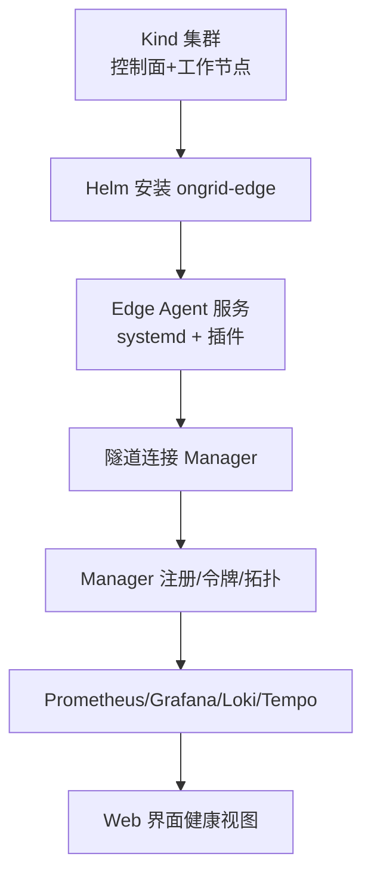
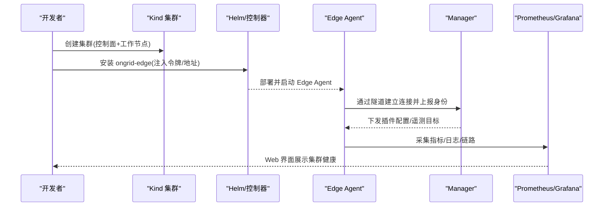
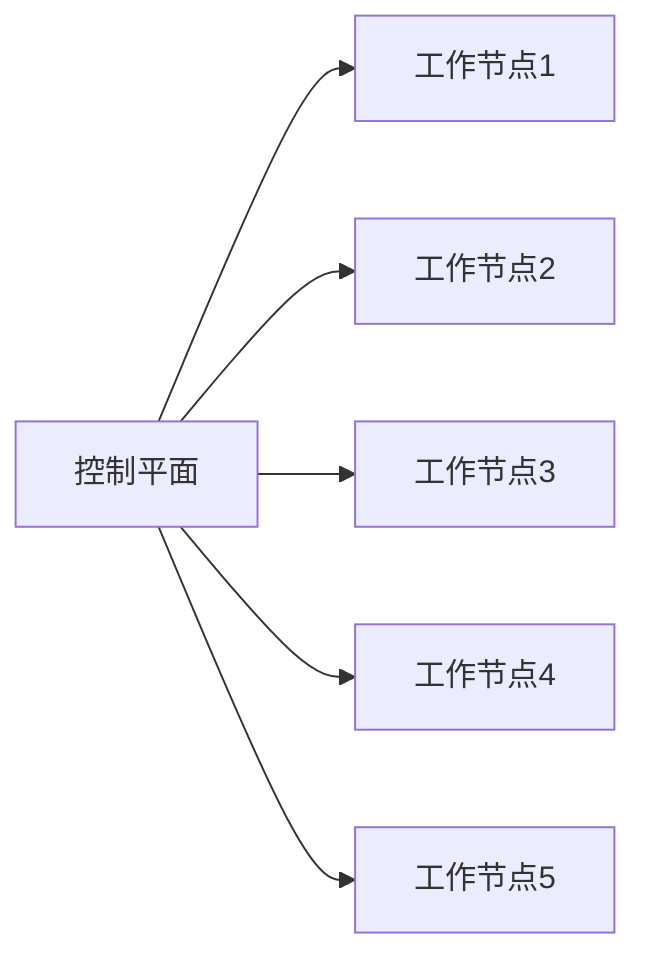
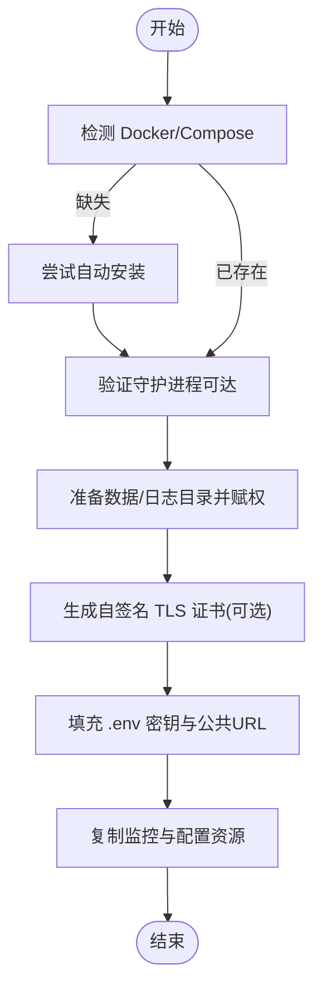
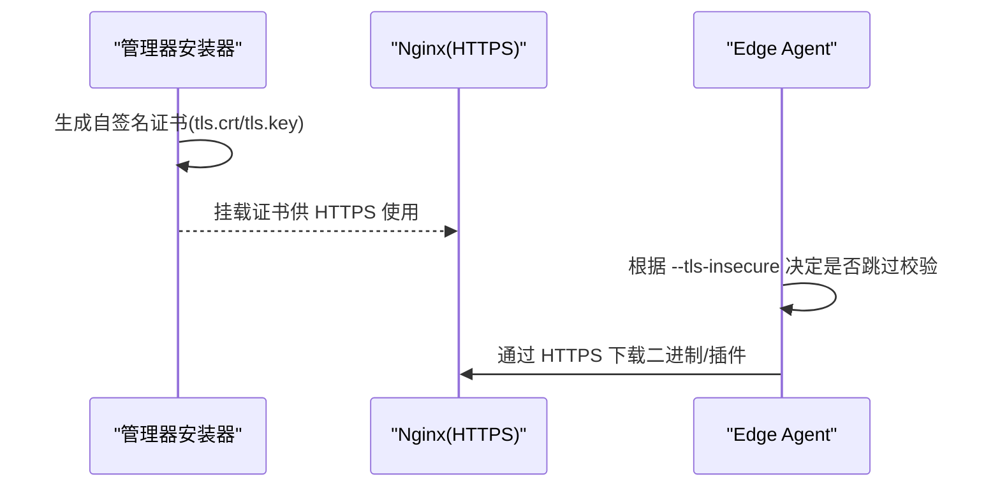
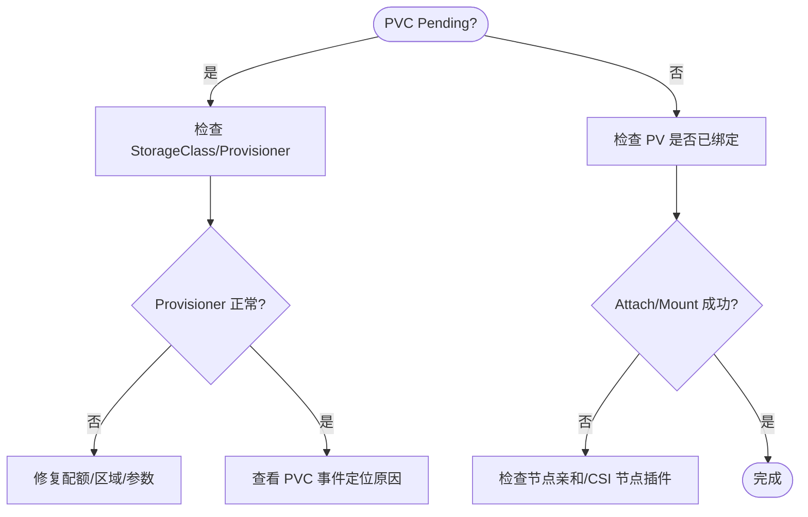
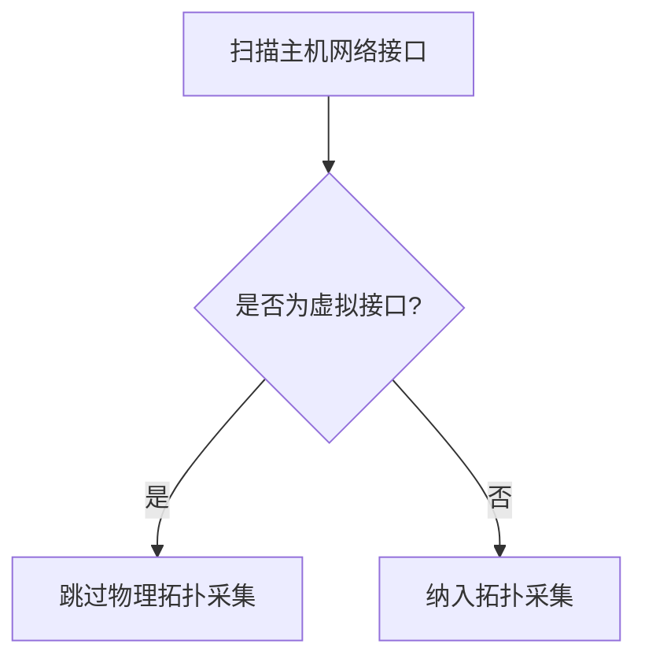
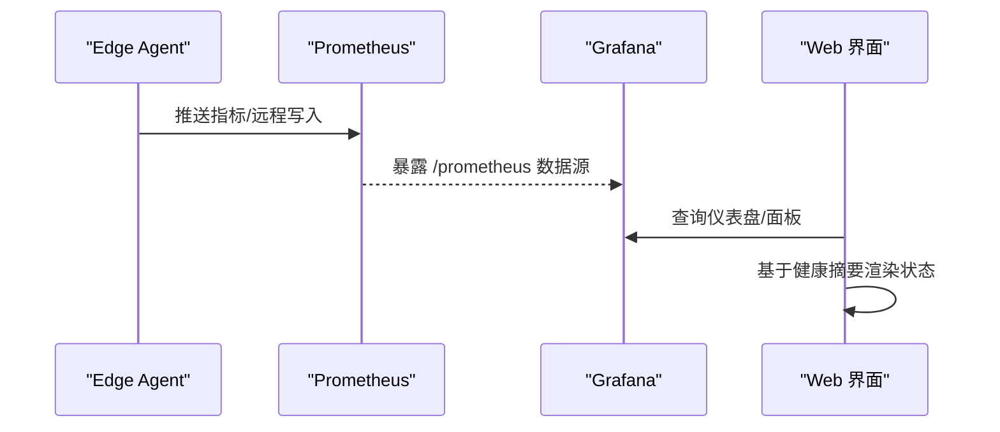
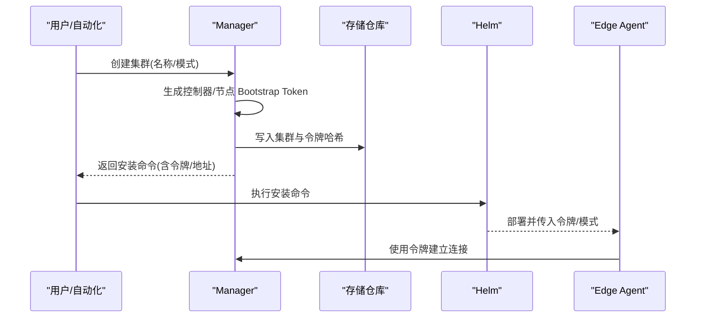
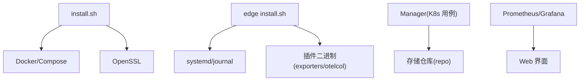

# 集群初始化

<cite>
**本文引用的文件**
- [kind-ongrid-k8s.yaml](file://deploy/kubernetes/kind-ongrid-k8s.yaml)
- [install.sh](file://deploy/install/install.sh)
- [edge install.sh](file://deploy/install/edge/install.sh)
- [prometheus.yml](file://deploy/prometheus/prometheus.yml)
- [grafana prometheus 数据源](file://deploy/grafana/provisioning/datasources/prometheus.yml)
- [usecase.go（K8s 业务用例）](file://internal/manager/biz/k8s/usecase.go)
- [repo.go（K8s 存储仓库）](file://internal/manager/data/k8s/store/repo.go)
- [network_discovery.go（网络发现）](file://internal/edgeagent/collector/network_discovery.go)
- [config_tunnel.go（插件配置拉取）](file://internal/edgeagent/plugins/config_tunnel.go)
- [k8s-pvc-pending.md（PVC 故障排查）](file://internal/manager/biz/knowledge/builtin_vault/diagnostics/k8s-pvc-pending.md)
- [systemHealth.ts（系统健康检查 API）](file://web/src/api/systemHealth.ts)
- [Kubernetes.tsx（集群健康结论）](file://web/src/pages/Kubernetes.tsx)
</cite>

## 目录
1. [简介](#简介)
2. [项目结构](#项目结构)
3. [核心组件](#核心组件)
4. [架构总览](#架构总览)
5. [详细组件分析](#详细组件分析)
6. [依赖关系分析](#依赖关系分析)
7. [性能考虑](#性能考虑)
8. [故障排查指南](#故障排查指南)
9. [结论](#结论)
10. [附录](#附录)

## 简介
本指南面向使用 Kind 在本地快速搭建 Kubernetes 开发环境，并结合项目内置的 Edge Agent、安装脚本与监控栈完成“从集群到可观测”的一体化初始化。内容涵盖：
- 使用 Kind 创建本地集群及节点拓扑
- 预检查与环境准备（Docker、Compose、TLS、环境变量）
- 证书管理与 TLS 配置（自签名证书与 CA）
- 存储类与动态供给（PVC/PV/StorageClass）
- 网络插件（Calico、Flannel 等）识别与注意事项
- 集群健康检查与监控（Prometheus/Grafana/Loki/Tempo）
- 故障排查与性能调优建议

## 项目结构
与集群初始化直接相关的资源主要分布在以下位置：
- 本地开发集群定义：deploy/kubernetes/kind-ongrid-k8s.yaml
- 管理器安装与 TLS 生成：deploy/install/install.sh
- 边缘端安装与自检：deploy/install/edge/install.sh
- 监控与可视化：deploy/prometheus/prometheus.yml、deploy/grafana/provisioning/datasources/prometheus.yml
- K8s 生命周期与注册：internal/manager/biz/k8s/usecase.go、internal/manager/data/k8s/store/repo.go
- 网络与插件：internal/edgeagent/collector/network_discovery.go、internal/edgeagent/plugins/config_tunnel.go
- 诊断知识库：internal/manager/biz/knowledge/builtin_vault/diagnostics/k8s-pvc-pending.md
- 前端健康展示：web/src/pages/Kubernetes.tsx、web/src/api/systemHealth.ts

图表来源
- [kind-ongrid-k8s.yaml:1-9](file://deploy/kubernetes/kind-ongrid-k8s.yaml#L1-L9)
- [usecase.go（K8s 业务用例）:501-542](file://internal/manager/biz/k8s/usecase.go#L501-L542)
- [install.sh:50-93](file://deploy/install/install.sh#L50-L93)
- [prometheus.yml:6-19](file://deploy/prometheus/prometheus.yml#L6-L19)

章节来源
- [kind-ongrid-k8s.yaml:1-9](file://deploy/kubernetes/kind-ongrid-k8s.yaml#L1-L9)
- [install.sh:50-93](file://deploy/install/install.sh#L50-L93)
- [prometheus.yml:6-19](file://deploy/prometheus/prometheus.yml#L6-L19)

## 核心组件
- Kind 集群定义：一个控制面与多个工作节点的轻量集群模板，便于本地开发与调试。
- 管理器安装器：负责 Docker/Compose 检测、数据目录权限、Nginx 与自签名 TLS 证书生成、环境变量填充与服务启动。
- 边缘端安装器：下载并安装 ongrid-edge，创建 systemd 单元，自动获取插件二进制，执行自检并与 Manager 建立隧道连接。
- 监控栈：Prometheus 抓取自身与 Manager；Grafana 通过 Provisioning 配置默认数据源；Loki/Tempo 提供日志与链路追踪。
- K8s 生命周期：创建集群记录、生成 Bootstrap Token、更新拓扑、健康统计。

章节来源
- [kind-ongrid-k8s.yaml:1-9](file://deploy/kubernetes/kind-ongrid-k8s.yaml#L1-L9)
- [install.sh:307-389](file://deploy/install/install.sh#L307-L389)
- [edge install.sh:148-213](file://deploy/install/edge/install.sh#L148-L213)
- [prometheus.yml:6-19](file://deploy/prometheus/prometheus.yml#L6-L19)
- [usecase.go（K8s 业务用例）:501-542](file://internal/manager/biz/k8s/usecase.go#L501-L542)

## 架构总览
下图展示了从 Kind 集群到 Edge Agent、再到 Manager 与监控栈的整体流程。

图表来源
- [kind-ongrid-k8s.yaml:1-9](file://deploy/kubernetes/kind-ongrid-k8s.yaml#L1-L9)
- [usecase.go（K8s 业务用例）:2397-2417](file://internal/manager/biz/k8s/usecase.go#L2397-L2417)
- [edge install.sh:186-213](file://deploy/install/edge/install.sh#L186-L213)
- [prometheus.yml:6-19](file://deploy/prometheus/prometheus.yml#L6-L19)

## 详细组件分析

### Kind 集群与节点设置
- 使用 Kind 配置文件定义一个控制面与多个工作节点，适合本地开发测试。
- 该配置为最小可用拓扑，后续可通过追加节点或调整参数扩展。

图表来源
- [kind-ongrid-k8s.yaml:1-9](file://deploy/kubernetes/kind-ongrid-k8s.yaml#L1-L9)

章节来源
- [kind-ongrid-k8s.yaml:1-9](file://deploy/kubernetes/kind-ongrid-k8s.yaml#L1-L9)

### 预检查脚本的作用与执行流程
管理器安装脚本在安装前进行一系列预检查与环境准备：
- 检测并尝试自动安装 Docker 与 Compose v2
- 校验 Docker 守护进程可达性
- 准备安装目录、数据目录与日志目录，并设置正确的用户与权限
- 生成自签名 TLS 证书（若未提供）
- 填充 .env 中的关键密钥与公共访问地址
- 复制监控与配置资源（Prometheus/Grafana/Loki/Tempo）

图表来源
- [install.sh:307-389](file://deploy/install/install.sh#L307-L389)
- [install.sh:536-640](file://deploy/install/install.sh#L536-L640)
- [install.sh:641-655](file://deploy/install/install.sh#L641-L655)
- [install.sh:683-750](file://deploy/install/install.sh#L683-L750)

章节来源
- [install.sh:307-389](file://deploy/install/install.sh#L307-L389)
- [install.sh:536-640](file://deploy/install/install.sh#L536-L640)
- [install.sh:641-655](file://deploy/install/install.sh#L641-L655)
- [install.sh:683-750](file://deploy/install/install.sh#L683-L750)

### 证书管理与 TLS 配置
- 管理器安装器会在缺少证书时自动生成自签名证书（有效期与 CN 固定），并提示替换为真实证书。
- 边缘端安装支持跳过 TLS 校验以适配自签名场景，便于本地开发。
- 插件配置拉取器在 Kubernetes 模式下可注入 tls_insecure_skip_verify 等默认值，确保在无外部 CA 的环境下连通。

图表来源
- [install.sh:50-93](file://deploy/install/install.sh#L50-L93)
- [edge install.sh:186-213](file://deploy/install/edge/install.sh#L186-L213)
- [config_tunnel.go（插件配置拉取）:288-307](file://internal/edgeagent/plugins/config_tunnel.go#L288-L307)

章节来源
- [install.sh:50-93](file://deploy/install/install.sh#L50-L93)
- [edge install.sh:186-213](file://deploy/install/edge/install.sh#L186-L213)
- [config_tunnel.go（插件配置拉取）:288-307](file://internal/edgeagent/plugins/config_tunnel.go#L288-L307)

### 存储类与动态供给（PVC/PV/StorageClass）
- 当 PVC 处于 Pending 状态时，通常由 StorageClass/Provisioner/容量/区域不匹配导致。
- 动态供给失败需检查 CSI provisioner 运行状态与事件错误信息。
- 若卷已存在但无法挂载，需关注 FailedAttachVolume/FailedMount 以及节点亲和性与文件系统类型。

图表来源
- [k8s-pvc-pending.md:1-86](file://internal/manager/biz/knowledge/builtin_vault/diagnostics/k8s-pvc-pending.md#L1-L86)

章节来源
- [k8s-pvc-pending.md:1-86](file://internal/manager/biz/knowledge/builtin_vault/diagnostics/k8s-pvc-pending.md#L1-L86)

### 网络插件的安装与配置（Calico、Flannel 等）
- 网络发现逻辑会识别常见虚拟接口前缀（如 docker、br-、veth、cni、virbr、flannel、cali、tun、tap），用于过滤虚拟接口。
- 这意味着在启用 Calico 或 Flannel 时，相关接口会被识别为虚拟网络接口，避免误报物理网络拓扑。

图表来源
- [network_discovery.go（网络发现）:115-125](file://internal/edgeagent/collector/network_discovery.go#L115-L125)

章节来源
- [network_discovery.go（网络发现）:115-125](file://internal/edgeagent/collector/network_discovery.go#L115-L125)

### 集群健康检查与监控配置
- 管理器侧聚合 Pod/Node/Workload/Event 等信号，计算集群健康摘要（Pending、CrashLoopBackOff、OOMKilled、ImagePullBackOff、NotReady 等）。
- Prometheus 配置了自抓与 Manager 抓取任务；Grafana 通过 Provisioning 预设默认数据源。
- 前端根据健康摘要给出“Healthy/Degraded/Critical”等结论，并在快照过期时提示可信度问题。

图表来源
- [prometheus.yml:6-19](file://deploy/prometheus/prometheus.yml#L6-L19)
- [grafana prometheus 数据源:1-11](file://deploy/grafana/provisioning/datasources/prometheus.yml#L1-L11)
- [usecase.go（K8s 业务用例）:1024-1068](file://internal/manager/biz/k8s/usecase.go#L1024-L1068)
- [Kubernetes.tsx（集群健康结论）:3747-3819](file://web/src/pages/Kubernetes.tsx#L3747-L3819)

章节来源
- [prometheus.yml:6-19](file://deploy/prometheus/prometheus.yml#L6-L19)
- [grafana prometheus 数据源:1-11](file://deploy/grafana/provisioning/datasources/prometheus.yml#L1-L11)
- [usecase.go（K8s 业务用例）:1024-1068](file://internal/manager/biz/k8s/usecase.go#L1024-L1068)
- [Kubernetes.tsx（集群健康结论）:3747-3819](file://web/src/pages/Kubernetes.tsx#L3747-L3819)

### 集群注册与令牌管理
- 创建集群时会生成控制器与节点两个 Bootstrap Token，并持久化哈希值。
- 安装命令通过 Helm 将集群 ID、令牌、模式等参数注入 to ongrid-edge。
- 存储层支持更新令牌哈希并清理控制器 Pod 名称字段，保证重入安全。

图表来源
- [usecase.go（K8s 业务用例）:501-542](file://internal/manager/biz/k8s/usecase.go#L501-L542)
- [usecase.go（K8s 业务用例）:2397-2417](file://internal/manager/biz/k8s/usecase.go#L2397-L2417)
- [repo.go（K8s 存储仓库）:127-140](file://internal/manager/data/k8s/store/repo.go#L127-L140)

章节来源
- [usecase.go（K8s 业务用例）:501-542](file://internal/manager/biz/k8s/usecase.go#L501-L542)
- [usecase.go（K8s 业务用例）:2397-2417](file://internal/manager/biz/k8s/usecase.go#L2397-L2417)
- [repo.go（K8s 存储仓库）:127-140](file://internal/manager/data/k8s/store/repo.go#L127-L140)

## 依赖关系分析
- 管理器安装器依赖 Docker/Compose 与 OpenSSL，用于容器化部署与证书生成。
- Edge Agent 依赖 systemd、journal 与若干导出器二进制（node_exporter、process_exporter、otelcol-contrib 等）。
- 监控栈依赖 Prometheus/Grafana/Loki/Tempo，并通过 Provisioning 与配置挂载实现零侵入初始化。
- K8s 生命周期模块依赖存储仓库进行集群与令牌状态的持久化。

图表来源
- [install.sh:307-389](file://deploy/install/install.sh#L307-L389)
- [edge install.sh:235-263](file://deploy/install/edge/install.sh#L235-L263)
- [usecase.go（K8s 业务用例）:501-542](file://internal/manager/biz/k8s/usecase.go#L501-L542)
- [prometheus.yml:6-19](file://deploy/prometheus/prometheus.yml#L6-L19)

章节来源
- [install.sh:307-389](file://deploy/install/install.sh#L307-L389)
- [edge install.sh:235-263](file://deploy/install/edge/install.sh#L235-L263)
- [usecase.go（K8s 业务用例）:501-542](file://internal/manager/biz/k8s/usecase.go#L501-L542)
- [prometheus.yml:6-19](file://deploy/prometheus/prometheus.yml#L6-L19)

## 性能考虑
- 合理设置 Prometheus 抓取间隔与评估间隔，避免过高频率造成负载压力。
- 对 Grafana 数据源同步设置超时，防止上游不可用时阻塞。
- 在 Edge Agent 侧，确保插件二进制齐全且状态目录可写，避免采集失败导致的重试风暴。
- 对于大集群，建议分片抓取与合理的标签选择器，减少不必要的数据量。

[本节为通用指导，无需特定文件引用]

## 故障排查指南
- 安装阶段：
  - Docker/Compose 不可用：按提示手动安装或修正网络代理后重试。
  - 权限问题：确认数据目录与日志目录归属正确，必要时重新赋权。
  - TLS 错误：确认自签名证书已生成或被替换为真实证书；边缘端可使用跳过校验选项进行本地调试。
- 连接阶段：
  - 边缘端未连接：检查 journal 中是否出现 unauthorized 或隧道连接失败；确认服务器地址与令牌正确。
  - 插件缺失：自检会报告缺失的二进制，按提示补齐后重启服务。
- 存储与网络：
  - PVC Pending：参考 PVC 故障排查文档，检查 StorageClass/Provisioner/区域与事件。
  - 网络插件：确认虚拟接口被正确识别，避免误判物理拓扑。
- 健康与监控：
  - 使用系统健康检查接口获取整体健康报告。
  - 前端健康结论会综合 Pending、CrashLoopBackOff、OOMKilled、ImagePullBackOff、NotReady 等信号。

章节来源
- [install.sh:307-389](file://deploy/install/install.sh#L307-L389)
- [install.sh:641-655](file://deploy/install/install.sh#L641-L655)
- [edge install.sh:407-518](file://deploy/install/edge/install.sh#L407-L518)
- [k8s-pvc-pending.md:1-86](file://internal/manager/biz/knowledge/builtin_vault/diagnostics/k8s-pvc-pending.md#L1-L86)
- [systemHealth.ts（系统健康检查 API）:1-31](file://web/src/api/systemHealth.ts#L1-L31)
- [Kubernetes.tsx（集群健康结论）:3747-3819](file://web/src/pages/Kubernetes.tsx#L3747-L3819)

## 结论
通过 Kind 快速构建本地 Kubernetes 集群，结合管理器与边缘端的安装脚本，可在数分钟内完成从集群到可观测的全链路初始化。重点在于：
- 严格遵循预检查与环境准备步骤
- 正确配置 TLS 与公共访问地址
- 关注 PVC/StorageClass/CSI 的动态供给链路
- 利用监控与健康检查持续验证集群状态
- 依据故障排查指南快速定位并解决问题

[本节为总结，无需特定文件引用]

## 附录
- 常用命令与路径（示例）
  - 查看 Kind 集群节点：kubectl get nodes
  - 查看 Edge Agent 服务状态：systemctl status ongrid-edge
  - 查看 Prometheus 抓取目标：http://localhost:9090/targets
  - 查看 Grafana 数据源：通过 Web 界面或 API
  - 查看系统健康检查：POST /system/health/check

[本节为补充说明，无需特定文件引用]