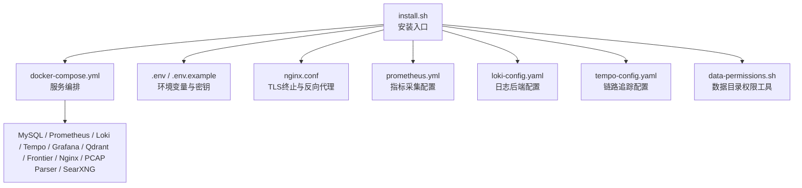
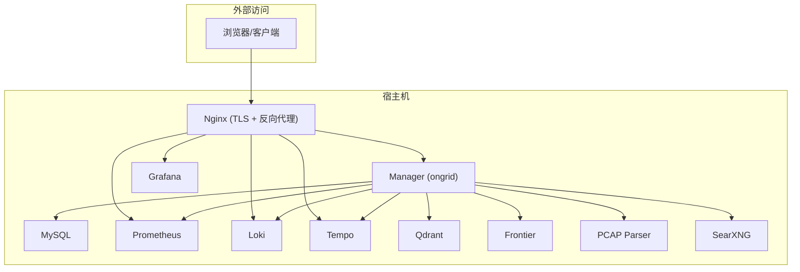
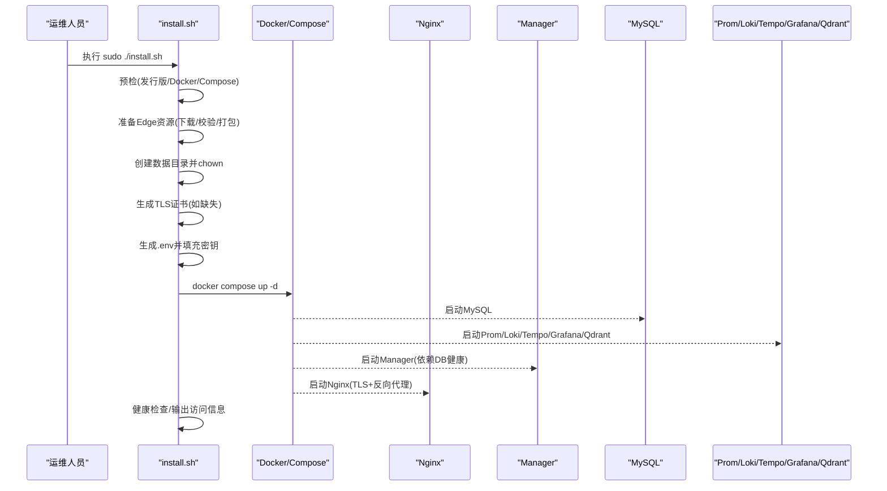
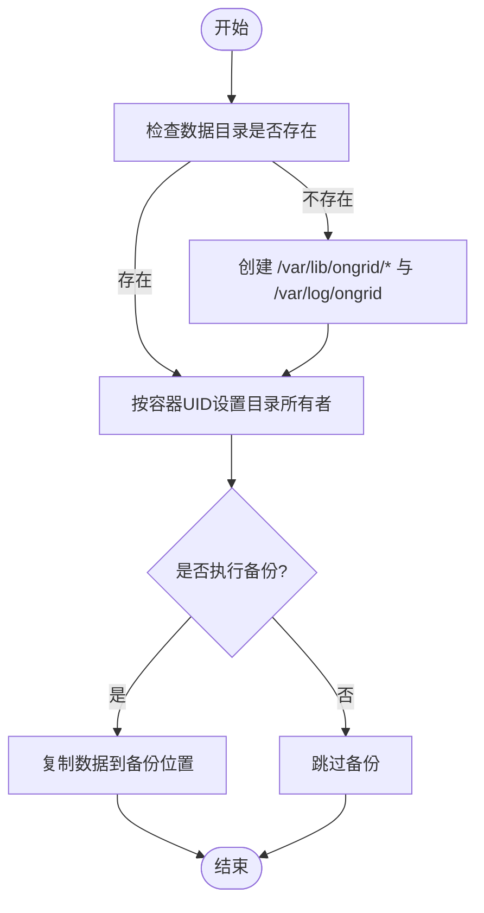
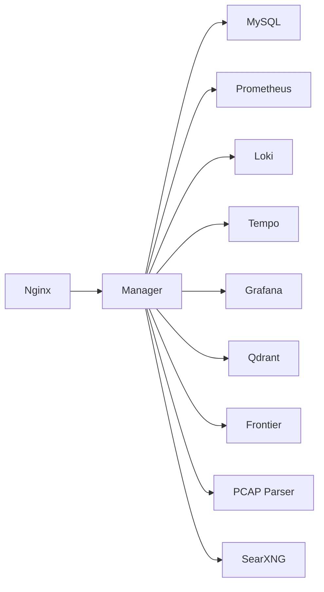

# 传统服务器安装

<cite>
**本文引用的文件**
- [deploy/install/install.sh](file://deploy/install/install.sh)
- [deploy/install/uninstall.sh](file://deploy/install/uninstall.sh)
- [deploy/install/docker-compose.yml](file://deploy/install/docker-compose.yml)
- [deploy/install/data-permissions.sh](file://deploy/install/data-permissions.sh)
- [deploy/install/.env.example](file://deploy/install/.env.example)
- [deploy/install/nginx.conf](file://deploy/install/nginx.conf)
- [deploy/install/prometheus.yml](file://deploy/install/prometheus.yml)
- [deploy/install/loki-config.yaml](file://deploy/install/loki-config.yaml)
- [deploy/install/tempo-config.yaml](file://deploy/install/tempo-config.yaml)
- [deploy/install/upgrade.sh](file://deploy/install/upgrade.sh)
- [deploy/one-click-deploy.sh](file://deploy/one-click-deploy.sh)
- [README.md](file://README.md)
</cite>

## 目录
1. [简介](#简介)
2. [项目结构](#项目结构)
3. [核心组件](#核心组件)
4. [架构总览](#架构总览)
5. [详细组件分析](#详细组件分析)
6. [依赖关系分析](#依赖关系分析)
7. [性能与容量规划](#性能与容量规划)
8. [故障排查指南](#故障排查指南)
9. [结论](#结论)
10. [附录](#附录)

## 简介
本指南面向在传统 Linux 服务器上部署 Ongrid 管理端（Manager）的运维人员，覆盖系统依赖检查、前置条件验证、一键安装脚本执行流程、服务配置与自定义选项、数据目录组织与备份恢复策略、手动安装步骤、卸载与清理、以及防火墙与 SELinux 等安全与系统服务管理要点。所有说明均基于仓库内提供的安装脚本、Compose 编排与配置文件。

## 项目结构
Ongrid 的传统服务器安装以 Docker Compose 为核心，将 MySQL、Prometheus、Loki、Tempo、Grafana、Qdrant、Frontier、Nginx、PCAP Parser、SearXNG 等服务容器化运行，并通过宿主机的 bind mount 持久化数据与日志。安装器负责环境检测、依赖安装、密钥生成、证书生成、数据目录创建与权限设置、Edge 资源准备与原子替换、以及最终拉起服务。

图表来源
- [deploy/install/install.sh:307-389](file://deploy/install/install.sh#L307-L389)
- [deploy/install/docker-compose.yml:20-528](file://deploy/install/docker-compose.yml#L20-L528)
- [deploy/install/data-permissions.sh:90-133](file://deploy/install/data-permissions.sh#L90-L133)

章节来源
- [deploy/install/install.sh:307-389](file://deploy/install/install.sh#L307-L389)
- [deploy/install/docker-compose.yml:20-528](file://deploy/install/docker-compose.yml#L20-L528)

## 核心组件
- 安装器：install.sh 负责预检、Docker 自动安装、Edge 资源准备、数据目录创建与权限设置、TLS 证书生成、环境变量填充、服务启动与健康检查。
- 升级器：upgrade.sh 支持原地升级，包含镜像预拉取、旧栈停止、数据迁移、权限修复、新栈拉起与健康检查。
- 卸载器：uninstall.sh 停止服务、移除命名卷、删除数据目录与安装目录，可选同时卸载 co-located 的 ongrid-edge 守护进程。
- 编排：docker-compose.yml 定义所有运行时服务及其依赖、端口映射、数据挂载、健康检查与日志轮转。
- 配置：nginx.conf 提供 TLS 终止、API 反向代理、遥测数据面接入点；prometheus.yml、loki-config.yaml、tempo-config.yaml 分别配置指标、日志、链路追踪。
- 权限工具：data-permissions.sh 提供数据目录创建、权限初始化、修复与回滚辅助函数。

章节来源
- [deploy/install/install.sh:307-389](file://deploy/install/install.sh#L307-L389)
- [deploy/install/upgrade.sh:209-238](file://deploy/install/upgrade.sh#L209-L238)
- [deploy/install/uninstall.sh:58-81](file://deploy/install/uninstall.sh#L58-L81)
- [deploy/install/docker-compose.yml:20-528](file://deploy/install/docker-compose.yml#L20-L528)
- [deploy/install/data-permissions.sh:90-133](file://deploy/install/data-permissions.sh#L90-L133)

## 架构总览
Ongrid 在单台宿主机上通过 Docker Compose 部署多组件栈。Nginx 作为对外入口，终止 TLS 并反向代理到 Manager API、Grafana、Prometheus 以及遥测数据面（Loki/Tempo/Prometheus）。Manager 连接 MySQL 存储业务数据，使用 Qdrant 做向量检索，集成 Prometheus/Loki/Tempo 进行观测，并通过 Frontier 与 Edge 通信。

图表来源
- [deploy/install/docker-compose.yml:20-528](file://deploy/install/docker-compose.yml#L20-L528)
- [deploy/install/nginx.conf:26-51](file://deploy/install/nginx.conf#L26-L51)

## 详细组件分析

### 系统依赖检查与前置条件验证
- 操作系统与架构：仅支持 Linux，架构为 amd64/arm64。
- Docker 与 Compose：要求 Docker CLI、Docker daemon 可达、Docker Compose v2（docker compose 子命令）。
- 自动安装 Docker：若未检测到 docker，尝试通过官方脚本或发行版包管理器安装，并启用服务。
- 网络与端口：默认 HTTPS 443、HTTP 重定向 80、隧道端口 40012、指标端口 9100。
- 内存建议：低于 2GB 会发出警告。
- 下载工具：需要 curl 或 wget。

章节来源
- [deploy/one-click-deploy.sh:39-68](file://deploy/one-click-deploy.sh#L39-L68)
- [deploy/install/install.sh:307-389](file://deploy/install/install.sh#L307-L389)

### 一键安装脚本执行流程
- 参数解析：支持 --profile monitoring、--no-seed、--force、-h/--help。
- 权限提升：非 root 自动 sudo 重入。
- 预检：检测发行版家族、自动安装 Docker、校验 docker 与 compose。
- Edge 资源准备：在临时目录构建 Edge bundle，校验或下载带校验和的资源，原子替换 /opt/ongrid/edge。
- 复制资产：拷贝 docker-compose.yml、frontier.yaml、prometheus.yml、loki-config.yaml、tempo-config.yaml、grafana/searxng 等。
- 数据目录：创建 /var/lib/ongrid 下各服务子目录并 chown 到对应容器 UID；创建 /var/log/ongrid。
- TLS 证书：若无证书则生成自签证书（CN=ongrid，有效期 365 天）。
- 环境变量：从 .env.example 生成 .env，填充缺失密钥（数据库密码、JWT Secret、管理员密码、Grafana 管理员密码、PCAP Token Secret 等），自动推导 PUBLIC_URL 与 TUNNEL_ADDR。
- 启动服务：docker compose up -d，等待健康检查。

图表来源
- [deploy/install/install.sh:265-389](file://deploy/install/install.sh#L265-L389)
- [deploy/install/install.sh:414-534](file://deploy/install/install.sh#L414-L534)
- [deploy/install/install.sh:536-640](file://deploy/install/install.sh#L536-L640)
- [deploy/install/install.sh:641-800](file://deploy/install/install.sh#L641-L800)

章节来源
- [deploy/install/install.sh:265-389](file://deploy/install/install.sh#L265-L389)
- [deploy/install/install.sh:414-534](file://deploy/install/install.sh#L414-L534)
- [deploy/install/install.sh:536-640](file://deploy/install/install.sh#L536-L640)
- [deploy/install/install.sh:641-800](file://deploy/install/install.sh#L641-L800)

### 服务配置文件位置与自定义选项
- 安装目录：默认 /opt/ongrid，可通过 ONGRID_INSTALL_DIR 覆盖。
- 数据目录：默认 /var/lib/ongrid，可通过 ONGRID_DATA_DIR 覆盖；日志目录默认 /var/log/ongrid，可通过 ONGRID_LOG_DIR 覆盖。
- 环境变量：位于 /opt/ongrid/.env，由 install.sh 从 .env.example 生成并填充缺失项；可编辑后重新拉起服务。
- Nginx：/opt/ongrid/nginx.conf，用于 TLS 终止与反向代理；证书位于 /opt/ongrid/certs/。
- 指标：/opt/ongrid/prometheus.yml，采集 Manager 与自身指标。
- 日志：/opt/ongrid/loki-config.yaml，单节点文件系统后端，保留期 30 天。
- 链路：/opt/ongrid/tempo-config.yaml，本地存储，保留期 7 天，向 Prometheus remote_write 输出 spanmetrics。
- 关键环境变量（节选）：
  - 数据库：MYSQL_ROOT_PASSWORD、MYSQL_PASSWORD
  - 认证：ONGRID_JWT_SECRET、ONGRID_ADMIN_EMAIL、ONGRID_ADMIN_PASSWORD
  - 公网地址：ONGRID_PUBLIC_URL、ONGRID_TUNNEL_PORT、ONGRID_TUNNEL_ADDR
  - 嵌入模型：ONGRID_EMBEDDING_PROVIDER、ONGRID_EMBEDDING_MODEL、ONGRID_EMBEDDING_DIM
  - 通知渠道：Slack/飞书/钉钉 Webhook 开关与 URL/Secret
  - 端口：ONGRID_HTTP_PORT、ONGRID_HTTP_REDIRECT_PORT、ONGRID_METRICS_PORT

章节来源
- [deploy/install/.env.example:8-217](file://deploy/install/.env.example#L8-L217)
- [deploy/install/docker-compose.yml:52-267](file://deploy/install/docker-compose.yml#L52-L267)
- [deploy/install/nginx.conf:92-144](file://deploy/install/nginx.conf#L92-L144)
- [deploy/install/prometheus.yml:6-25](file://deploy/install/prometheus.yml#L6-L25)
- [deploy/install/loki-config.yaml:1-76](file://deploy/install/loki-config.yaml#L1-L76)
- [deploy/install/tempo-config.yaml:1-77](file://deploy/install/tempo-config.yaml#L1-L77)

### 数据目录组织结构与备份恢复策略
- 数据根目录：/var/lib/ongrid（可被覆盖），包含 mysql、prometheus、loki、tempo、qdrant、grafana、embeddings、skills、pages、packet-captures、workspace、tools。
- 日志目录：/var/log/ongrid。
- 权限：install.sh 按容器 UID 对目录进行 chown，确保容器写入权限；embeddings/skills/pages/packet-captures/workspace/tools 由 Manager 用户写入。
- 备份：由于采用 host bind mount，可直接备份 /var/lib/ongrid 与 /var/log/ongrid；也可通过 Docker 卷迁移工具在升级时自动迁移旧 named volumes。
- 恢复：将备份数据复制到相同路径并确保正确权限；或通过 upgrade.sh 的 --migrate-volumes 自动迁移旧 named volumes 到新 bind mount。

图表来源
- [deploy/install/install.sh:536-640](file://deploy/install/install.sh#L536-L640)
- [deploy/install/data-permissions.sh:90-133](file://deploy/install/data-permissions.sh#L90-L133)

章节来源
- [deploy/install/install.sh:536-640](file://deploy/install/install.sh#L536-L640)
- [deploy/install/data-permissions.sh:90-133](file://deploy/install/data-permissions.sh#L90-L133)

### 手动安装分步指导（编译构建、服务注册、开机自启动）
- 编译构建：仓库未提供传统“编译二进制”的安装方式；生产部署通过发布包（tar.xz）解压后运行 install.sh 拉取镜像并启动服务。如需自定义构建，请参考 Makefile 与 Dockerfile（不在本文档范围内）。
- 服务注册与开机自启动：
  - 使用 systemd：可将 docker compose 封装为 service，或使用 supervisor/systemd 管理容器生命周期。
  - 使用开机自启：在 systemd 中配置 After=docker.service 与 WantedBy=multi-user.target，或在 init.d 中调用 docker compose up -d。
  - 注意：仓库未内置 ongrid-manager 的 systemd unit；on-grid-edge 有示例 service 文件，但 Manager 通常通过 compose 管理。

章节来源
- [deploy/install/docker-compose.yml:20-528](file://deploy/install/docker-compose.yml#L20-L528)
- [deploy/install/edge/ongrid-edge.service](file://deploy/install/edge/ongrid-edge.service)

### 卸载脚本使用方法与系统清理步骤
- 停止服务：sudo ./uninstall.sh（默认仅停止容器，保留数据与安装目录）。
- 彻底清理：sudo ./uninstall.sh --purge（删除命名卷、数据目录、安装目录与相关镜像）。
- 清理 co-located Edge：sudo ./uninstall.sh --purge --purge-edge（同时卸载 ongrid-edge 守护进程与服务单元）。
- 确认提示：--yes 跳过交互式确认。

章节来源
- [deploy/install/uninstall.sh:25-51](file://deploy/install/uninstall.sh#L25-L51)
- [deploy/install/uninstall.sh:58-185](file://deploy/install/uninstall.sh#L58-L185)

### 防火墙规则配置、SELinux 设置与系统服务管理
- 防火墙：
  - 开放 HTTPS 端口（默认 443，可在 .env 中修改为其他端口）。
  - 开放隧道端口（默认 40012，供 Edge 拨出）。
  - 若需暴露 Prometheus/Grafana，请谨慎评估安全性；默认仅通过 Nginx 反向代理访问。
- SELinux：
  - 若启用 SELinux，需允许 Nginx 与容器访问绑定目录（/opt/ongrid、/var/lib/ongrid、/var/log/ongrid）；必要时调整上下文或策略。
- 系统服务：
  - Docker：systemctl enable --now docker。
  - 如需将 Manager 作为独立服务管理，可编写 systemd unit 调用 docker compose up -d；仓库未提供默认 unit。

章节来源
- [deploy/install/.env.example:15-24](file://deploy/install/.env.example#L15-L24)
- [deploy/install/nginx.conf:60-113](file://deploy/install/nginx.conf#L60-L113)
- [deploy/install/install.sh:328-373](file://deploy/install/install.sh#L328-L373)

## 依赖关系分析
- 服务间依赖：
  - Manager 依赖 MySQL（健康检查）、Frontier（内部网络）、Prometheus/Loki/Tempo/Grafana/Qdrant（观测与知识库）。
  - Nginx 反向代理到 Manager API、Grafana、Prometheus、Loki、Tempo。
  - PCAP Parser 通过签名请求与 Manager 交互，无宿主端口。
- 外部依赖：
  - Docker 与 Compose v2。
  - OpenSSL（生成自签证书与随机密钥）。
  - 网络可达性：云端元数据探测、公共 IP 探测、DNS 解析。

图表来源
- [deploy/install/docker-compose.yml:20-528](file://deploy/install/docker-compose.yml#L20-L528)

章节来源
- [deploy/install/docker-compose.yml:20-528](file://deploy/install/docker-compose.yml#L20-L528)

## 性能与容量规划
- 指标保留：Prometheus 默认 90 天/20GB（可通过命令行参数调整）。
- 日志保留：Loki 默认 30 天（retention_period 720h）。
- 链路保留：Tempo 默认 7 天（block_retention 168h）。
- 磁盘建议：将数据目录指向 SSD/NFS/iSCSI；监控磁盘使用率与日志轮转。
- 并发与限流：Nginx 对数据面接入点进行速率限制（edge_dataplane、k8s_enrollment、edge_enrollment）。

章节来源
- [deploy/install/docker-compose.yml:344-381](file://deploy/install/docker-compose.yml#L344-L381)
- [deploy/install/loki-config.yaml:52-59](file://deploy/install/loki-config.yaml#L52-L59)
- [deploy/install/tempo-config.yaml:23-29](file://deploy/install/tempo-config.yaml#L23-L29)
- [deploy/install/nginx.conf:53-58](file://deploy/install/nginx.conf#L53-L58)

## 故障排查指南
- 常见错误：
  - Docker 不可达或未安装：检查 docker info 与 systemctl status docker。
  - 端口冲突：修改 .env 中的 HTTP/TUNNEL/METRICS 端口。
  - 权限问题：使用 data-permissions.sh 的修复函数或重新运行 install.sh。
  - 证书问题：替换 /opt/ongrid/certs/ 下的真实证书。
  - 公网地址错误：修正 ONGRID_PUBLIC_URL，确保 Edge 能路由到该地址。
- 健康检查：
  - 访问 https://localhost:<HTTP_PORT>/healthz 与 /readyz。
  - 查看 docker compose logs 定位具体服务异常。
- 升级失败回滚：
  - upgrade.sh 会在失败时尝试恢复 Edge 目录与旧栈；必要时手动回滚。

章节来源
- [deploy/install/install.sh:178-214](file://deploy/install/install.sh#L178-L214)
- [deploy/install/upgrade.sh:300-330](file://deploy/install/upgrade.sh#L300-L330)
- [deploy/install/upgrade.sh:726-760](file://deploy/install/upgrade.sh#L726-L760)

## 结论
Ongrid 的传统服务器安装通过 install.sh 实现了高度自动化的一键部署，涵盖依赖检查、Edge 资源准备、数据目录权限、TLS 证书、环境变量填充与服务启动。运维人员可通过 .env 与配置文件灵活定制网络与安全策略，结合数据目录的 bind mount 实现便捷的备份与恢复。升级与卸载流程提供了安全回滚与清理能力，适合在生产环境中稳定运行。

## 附录
- 快速开始：参考 README 中的下载与安装命令。
- 文档中心：产品文档与安装指南详见官方文档站点。

章节来源
- [README.md:58-86](file://README.md#L58-L86)