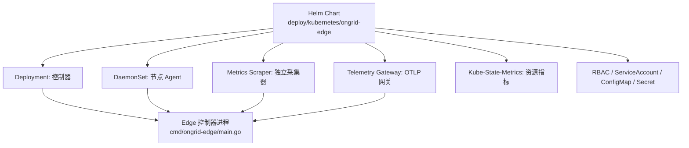
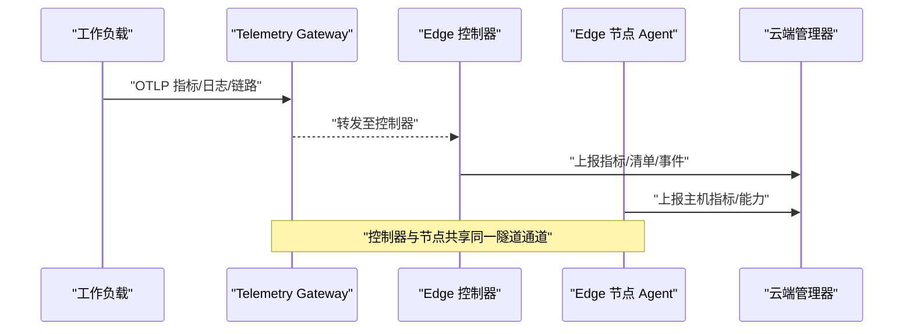
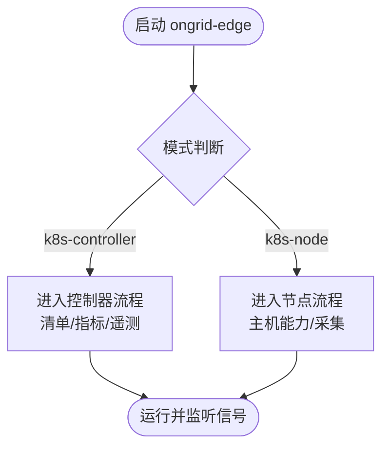
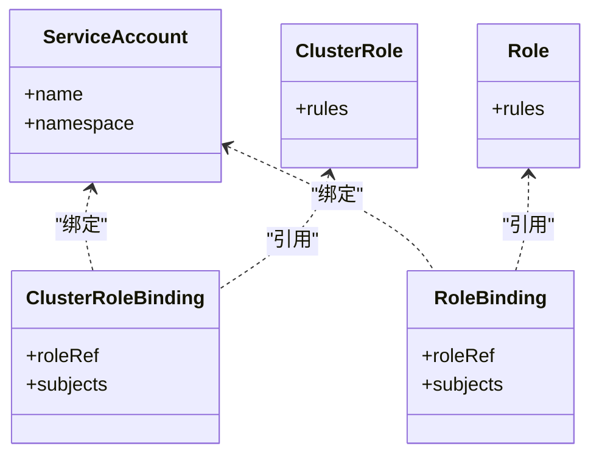
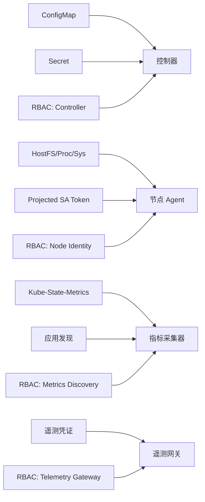

# Kubernetes 集群部署

<cite>
**本文引用的文件**
- [Chart.yaml](file://deploy/kubernetes/ongrid-edge/Chart.yaml)
- [values.yaml](file://deploy/kubernetes/ongrid-edge/values.yaml)
- [configmap.yaml](file://deploy/kubernetes/ongrid-edge/templates/configmap.yaml)
- [daemonset.yaml](file://deploy/kubernetes/ongrid-edge/templates/daemonset.yaml)
- [deployment.yaml](file://deploy/kubernetes/ongrid-edge/templates/deployment.yaml)
- [metrics-scraper-deployment.yaml](file://deploy/kubernetes/ongrid-edge/templates/metrics-scraper-deployment.yaml)
- [kube-state-metrics.yaml](file://deploy/kubernetes/ongrid-edge/templates/kube-state-metrics.yaml)
- [telemetry-gateway-deployment.yaml](file://deploy/kubernetes/ongrid-edge/templates/telemetry-gateway-deployment.yaml)
- [rbac.yaml](file://deploy/kubernetes/ongrid-edge/templates/rbac.yaml)
- [serviceaccount.yaml](file://deploy/kubernetes/ongrid-edge/templates/serviceaccount.yaml)
- [main.go](file://cmd/ongrid-edge/main.go)
</cite>

## 目录
1. [简介](#简介)
2. [项目结构](#项目结构)
3. [核心组件](#核心组件)
4. [架构总览](#架构总览)
5. [详细组件分析](#详细组件分析)
6. [依赖关系分析](#依赖关系分析)
7. [性能与扩缩容](#性能与扩缩容)
8. [监控与告警](#监控与告警)
9. [故障恢复与高可用](#故障恢复与高可用)
10. [多集群部署方案](#多集群部署方案)
11. [排障指南](#排障指南)
12. [结论](#结论)

## 简介
本指南面向在 Kubernetes 集群中部署边缘代理（Ongrid Edge）的运维与平台工程师，聚焦控制器模式与节点模式的差异、Helm Chart 配置项、RBAC 权限、ConfigMap/Secret 使用、多集群隔离与数据同步、监控与告警集成、以及高可用与性能调优。文档基于仓库中的 Helm Chart 模板与边缘端二进制入口进行说明，确保每一步均可追溯到具体实现。

## 项目结构
- Helm Chart 位于 deploy/kubernetes/ongrid-edge，包含 Chart 元信息、默认 values、以及渲染为 Deployment/DaemonSet/ServiceAccount/RBAC/ConfigMap/Secret 等资源的模板。
- 边缘端二进制入口位于 cmd/ongrid-edge/main.go，负责模式选择、注册能力、采集器构建、指标推送、插件运行时管理、健康检查与优雅退出等。

图表来源
- [deployment.yaml:17-193](file://deploy/kubernetes/ongrid-edge/templates/deployment.yaml#L17-L193)
- [daemonset.yaml:1-188](file://deploy/kubernetes/ongrid-edge/templates/daemonset.yaml#L1-L188)
- [metrics-scraper-deployment.yaml:1-169](file://deploy/kubernetes/ongrid-edge/templates/metrics-scraper-deployment.yaml#L1-L169)
- [telemetry-gateway-deployment.yaml:1-164](file://deploy/kubernetes/ongrid-edge/templates/telemetry-gateway-deployment.yaml#L1-L164)
- [kube-state-metrics.yaml:1-136](file://deploy/kubernetes/ongrid-edge/templates/kube-state-metrics.yaml#L1-L136)
- [rbac.yaml:1-174](file://deploy/kubernetes/ongrid-edge/templates/rbac.yaml#L1-L174)
- [serviceaccount.yaml:1-35](file://deploy/kubernetes/ongrid-edge/templates/serviceaccount.yaml#L1-L35)
- [configmap.yaml:1-47](file://deploy/kubernetes/ongrid-edge/templates/configmap.yaml#L1-L47)

章节来源
- [Chart.yaml:1-7](file://deploy/kubernetes/ongrid-edge/Chart.yaml#L1-L7)
- [values.yaml:1-188](file://deploy/kubernetes/ongrid-edge/values.yaml#L1-L188)

## 核心组件
- 控制器（Controller）：以 Deployment 运行，单副本，负责集群清单同步、指标抓取与上报、遥测配置刷新等。
- 节点 Agent（Node）：以 DaemonSet 运行，每个节点一个 Pod，具备主机能力（hostPID/hostNetwork），可执行系统级操作并采集主机指标。
- 指标采集器（Metrics Scraper）：可选独立 Deployment，用于从 kube-state-metrics 或应用发现获取指标并上报。
- 遥测网关（Telemetry Gateway）：可选独立 Deployment，提供 OTLP gRPC/HTTP 接收端点，支持自动扩缩容与 PDB。
- Kube-State-Metrics：可选内置组件，暴露集群资源指标。
- RBAC/SA/ConfigMap/Secret：按组件最小权限原则创建，区分控制器、节点、网关、采集器等角色。

章节来源
- [deployment.yaml:17-193](file://deploy/kubernetes/ongrid-edge/templates/deployment.yaml#L17-L193)
- [daemonset.yaml:1-188](file://deploy/kubernetes/ongrid-edge/templates/daemonset.yaml#L1-L188)
- [metrics-scraper-deployment.yaml:1-169](file://deploy/kubernetes/ongrid-edge/templates/metrics-scraper-deployment.yaml#L1-L169)
- [telemetry-gateway-deployment.yaml:1-164](file://deploy/kubernetes/ongrid-edge/templates/telemetry-gateway-deployment.yaml#L1-L164)
- [kube-state-metrics.yaml:1-136](file://deploy/kubernetes/ongrid-edge/templates/kube-state-metrics.yaml#L1-L136)
- [rbac.yaml:1-174](file://deploy/kubernetes/ongrid-edge/templates/rbac.yaml#L1-L174)
- [serviceaccount.yaml:1-35](file://deploy/kubernetes/ongrid-edge/templates/serviceaccount.yaml#L1-L35)
- [configmap.yaml:1-47](file://deploy/kubernetes/ongrid-edge/templates/configmap.yaml#L1-L47)

## 架构总览
边缘端通过隧道连接云端管理器；控制器模式负责集群侧的清单与指标聚合，节点模式负责主机侧能力与采集。遥测网关可作为独立组件接入 OTLP 协议，支持水平扩展与内存限制。

图表来源
- [telemetry-gateway-deployment.yaml:88-163](file://deploy/kubernetes/ongrid-edge/templates/telemetry-gateway-deployment.yaml#L88-L163)
- [deployment.yaml:55-193](file://deploy/kubernetes/ongrid-edge/templates/deployment.yaml#L55-L193)
- [daemonset.yaml:71-188](file://deploy/kubernetes/ongrid-edge/templates/daemonset.yaml#L71-L188)
- [main.go:136-149](file://cmd/ongrid-edge/main.go#L136-L149)

## 详细组件分析

### 控制器模式 vs 节点模式
- 控制器模式
  - 以 Deployment 运行，强制单副本（模板校验）。
  - 负责集群清单同步、指标抓取、遥测配置刷新。
  - 环境变量通过 ConfigMap/Secret 注入，如集群 ID、Bootstrap Token、遥测配置等。
- 节点模式
  - 以 DaemonSet 运行，启用 hostPID/hostNetwork，chroot 到宿主根文件系统。
  - 具备主机能力（bash、重启服务、文件访问等），采集主机指标。
  - 通过初始化容器安装宿主运行时，并以 root 权限完成必要设置。

图表来源
- [main.go:121-149](file://cmd/ongrid-edge/main.go#L121-L149)
- [deployment.yaml:68-193](file://deploy/kubernetes/ongrid-edge/templates/deployment.yaml#L68-L193)
- [daemonset.yaml:71-188](file://deploy/kubernetes/ongrid-edge/templates/daemonset.yaml#L71-L188)

章节来源
- [deployment.yaml:17-193](file://deploy/kubernetes/ongrid-edge/templates/deployment.yaml#L17-L193)
- [daemonset.yaml:1-188](file://deploy/kubernetes/ongrid-edge/templates/daemonset.yaml#L1-L188)
- [main.go:121-149](file://cmd/ongrid-edge/main.go#L121-L149)

### Helm Chart 配置选项
- 全局与模式
  - mode: full-node（当前仅支持该模式）
  - image.repository/tag/pullPolicy/architecture
  - podSecurity.runAsNonRoot/runAsUser/runAsGroup/fsGroup/supplementalGroups
- 管理器与入网
  - manager.publicURL/tunnelAddr/tlsInsecure
  - enrollment.clusterID/controllerBootstrapToken/nodeBootstrapToken
- 节点（DaemonSet）
  - node.serviceAccountName/collectorMode/tolerations/resources
- 控制器（Deployment）
  - controller.replicas（固定为 1）、controller.inventory.watch/fullSyncInterval
  - controller.metrics.enabled/endpoint/interval/timeout/pushTimeout/sampleLimit/batchSampleLimit/batchByteLimit/appDiscovery.enabled
  - controller.resources
- Kube-State-Metrics
  - kubeStateMetrics.enabled/image/port/telemetryPort/collectors/resources
- 独立指标采集器（Scraper）
  - kubernetesMetrics.mode/enabled/replicas/serviceAccountName/endpoint/interval/timeout/pushTimeout/sampleLimit/batchSampleLimit/batchByteLimit/maxRetries/retryBackoff/resources
- 遥测网关（Gateway）
  - telemetryGateway.enabled/mode/replicas/serviceAccountName/reloadInterval/memoryLimiter/batch/queueSize/resources/autoscaling/podDisruptionBudget/service
- 升级钩子
  - upgrade.migrationHook.enabled/timeout/backoffLimit

章节来源
- [values.yaml:1-188](file://deploy/kubernetes/ongrid-edge/values.yaml#L1-L188)
- [configmap.yaml:1-47](file://deploy/kubernetes/ongrid-edge/templates/configmap.yaml#L1-L47)

### RBAC 权限配置
- ServiceAccount
  - nodeServiceAccount：节点 Agent 使用
  - telemetryGatewayServiceAccount：遥测网关使用
  - metricsScraperServiceAccount：指标采集器使用（仅在启用应用发现时挂载 token）
  - controllerServiceAccount：控制器使用
- ClusterRole/ClusterRoleBinding
  - telemetry-gateway：读取 pods/namespaces/nodes 与应用控制器资源（apps/batch）
  - metrics-scraper-discovery：当启用应用发现时，允许 list pods
  - node-cluster-identity：读取 kube-system 命名空间以识别集群身份
  - controller：读取/监听 nodes/namespaces/pods/services/endpoints/PVC/events，读取日志，patch nodes，删除/驱逐 pods，读写 apps/batch 资源
- Role/RoleBinding
  - controller-credentials：对特定 Secret 的 get/patch/update 权限（控制器凭证与遥测凭证）

图表来源
- [serviceaccount.yaml:1-35](file://deploy/kubernetes/ongrid-edge/templates/serviceaccount.yaml#L1-L35)
- [rbac.yaml:1-174](file://deploy/kubernetes/ongrid-edge/templates/rbac.yaml#L1-L174)

章节来源
- [serviceaccount.yaml:1-35](file://deploy/kubernetes/ongrid-edge/templates/serviceaccount.yaml#L1-L35)
- [rbac.yaml:1-174](file://deploy/kubernetes/ongrid-edge/templates/rbac.yaml#L1-L174)

### ConfigMap 与 Secret 的使用
- ConfigMap
  - 名称由模板生成，包含模式、管理器地址、清单同步开关与间隔、指标端点与参数、重试策略、应用发现开关等。
  - 控制器与采集器通过 ConfigMapKeyRef 注入环境变量。
- Secret
  - 控制器与节点的 Bootstrap Secret：包含 cluster-id 与 bootstrap-token。
  - 控制器凭证 Secret：存储 AccessKey/SecretKey 等。
  - 遥测凭证 Secret：存储 remote write 端点、认证、TLS 配置等，供网关与采集器挂载。

章节来源
- [configmap.yaml:1-47](file://deploy/kubernetes/ongrid-edge/templates/configmap.yaml#L1-L47)
- [daemonset.yaml:90-123](file://deploy/kubernetes/ongrid-edge/templates/daemonset.yaml#L90-L123)
- [deployment.yaml:78-107](file://deploy/kubernetes/ongrid-edge/templates/deployment.yaml#L78-L107)
- [metrics-scraper-deployment.yaml:146-167](file://deploy/kubernetes/ongrid-edge/templates/metrics-scraper-deployment.yaml#L146-L167)
- [telemetry-gateway-deployment.yaml:151-162](file://deploy/kubernetes/ongrid-edge/templates/telemetry-gateway-deployment.yaml#L151-L162)

### 探针与生命周期
- 指标采集器与遥测网关均提供 /healthz 与 /readyz 探针，分别用于存活与就绪检测。
- 控制器与节点通过信号处理实现优雅退出，确保 goroutine 与子进程安全关闭。

章节来源
- [metrics-scraper-deployment.yaml:117-137](file://deploy/kubernetes/ongrid-edge/templates/metrics-scraper-deployment.yaml#L117-L137)
- [telemetry-gateway-deployment.yaml:129-143](file://deploy/kubernetes/ongrid-edge/templates/telemetry-gateway-deployment.yaml#L129-L143)
- [main.go:119-128](file://cmd/ongrid-edge/main.go#L119-L128)

## 依赖关系分析
- 控制器依赖：
  - ConfigMap（管理器地址、指标参数、清单同步开关）
  - Secret（Bootstrap Token、控制器凭证、遥测凭证）
  - RBAC（集群资源读取/写入、日志读取、节点 patch、pod 删除/驱逐）
- 节点依赖：
  - Host 路径挂载（/proc、/sys、宿主根）
  - 投影式 SA Token（带过期时间）与 CA 证书
  - RBAC（读取 kube-system 命名空间）
- 指标采集器依赖：
  - kube-state-metrics 或服务端点
  - 应用发现时的 RBAC（list pods）
- 遥测网关依赖：
  - 遥测凭证 Secret
  - 可选自动扩缩容（HPA）与 PDB

图表来源
- [configmap.yaml:31-47](file://deploy/kubernetes/ongrid-edge/templates/configmap.yaml#L31-L47)
- [rbac.yaml:101-174](file://deploy/kubernetes/ongrid-edge/templates/rbac.yaml#L101-L174)
- [daemonset.yaml:155-188](file://deploy/kubernetes/ongrid-edge/templates/daemonset.yaml#L155-L188)
- [metrics-scraper-deployment.yaml:146-167](file://deploy/kubernetes/ongrid-edge/templates/metrics-scraper-deployment.yaml#L146-L167)
- [telemetry-gateway-deployment.yaml:151-162](file://deploy/kubernetes/ongrid-edge/templates/telemetry-gateway-deployment.yaml#L151-L162)

章节来源
- [rbac.yaml:1-174](file://deploy/kubernetes/ongrid-edge/templates/rbac.yaml#L1-L174)
- [daemonset.yaml:155-188](file://deploy/kubernetes/ongrid-edge/templates/daemonset.yaml#L155-L188)
- [metrics-scraper-deployment.yaml:146-167](file://deploy/kubernetes/ongrid-edge/templates/metrics-scraper-deployment.yaml#L146-L167)
- [telemetry-gateway-deployment.yaml:151-162](file://deploy/kubernetes/ongrid-edge/templates/telemetry-gateway-deployment.yaml#L151-L162)

## 性能与扩缩容
- 指标采集
  - 控制器内嵌指标抓取：可通过 controller.metrics.* 调整 interval/timeout/pushTimeout/sampleLimit/batchSampleLimit/batchByteLimit。
  - 独立采集器：kubernetesMetrics.* 提供 maxRetries/retryBackoff 与资源限制。
- 遥测网关
  - 内存限制与尖峰保护：memoryLimiter.limitMiB/spikeLimitMiB，需满足 limitMiB > spikeMiB 且不超过容器内存限制的 80%。
  - 批处理与队列：batch.sendSize/maxSize、queueSize，受模板校验约束。
  - 自动扩缩容：autoscaling.enabled/minReplicas/maxReplicas/targetCPUUtilizationPercentage/targetMemoryAverageValue/scaleDownStabilizationWindowSeconds/scaleDownMaxPods/scaleDownPeriodSeconds。
  - 拓扑分散：topologySpreadConstraints 跨主机与可用区。
  - PDB：podDisruptionBudget.minAvailable=1。
- 资源限制
  - 各组件均提供 requests/limits，可按规模调整。
- 网络优化
  - 节点模式启用 hostNetwork，减少网络栈开销。
  - 控制器与采集器通过 ConfigMap 控制指标抓取频率与超时。

章节来源
- [values.yaml:36-188](file://deploy/kubernetes/ongrid-edge/values.yaml#L36-L188)
- [telemetry-gateway-deployment.yaml:1-164](file://deploy/kubernetes/ongrid-edge/templates/telemetry-gateway-deployment.yaml#L1-L164)
- [metrics-scraper-deployment.yaml:1-169](file://deploy/kubernetes/ongrid-edge/templates/metrics-scraper-deployment.yaml#L1-L169)

## 监控与告警
- Prometheus 指标
  - 控制器与采集器暴露本地 /metrics（调试端口），可通过 Prometheus 抓取。
  - 遥测网关暴露 OTLP 指标端口（otel-metrics）。
- Grafana 仪表板
  - 仓库提供 Grafana 数据源与仪表板预置配置，可在部署环境中集成。
- 告警规则
  - 仓库提供 Prometheus 规则示例，可根据实际指标定义阈值与告警。

章节来源
- [main.go:282-290](file://cmd/ongrid-edge/main.go#L282-L290)
- [telemetry-gateway-deployment.yaml:93-105](file://deploy/kubernetes/ongrid-edge/templates/telemetry-gateway-deployment.yaml#L93-L105)
- [deploy/grafana/provisioning/datasources/prometheus.yml](file://deploy/grafana/provisioning/datasources/prometheus.yml)
- [deploy/install/prometheus/prometheus.yml](file://deploy/install/prometheus/prometheus.yml)

## 故障恢复与高可用
- 控制器高可用
  - 当前模板强制 replicas=1，待实现 leader election 前不建议横向扩展。
  - 使用 Recreate 策略避免并发冲突。
- 节点高可用
  - DaemonSet 保证每节点一个实例，容忍污点 tolerations 可调。
  - 启用 hostPID/hostNetwork，提升可达性与诊断能力。
- 优雅退出
  - 主进程监听 SIGINT/SIGTERM，取消上下文后等待所有协程结束，确保子进程与采集器安全关闭。
- 资源清理
  - 控制器状态使用 emptyDir，Pod 重建后状态重置。
  - 节点模式通过 chroot 与只读根文件系统降低污染风险。

章节来源
- [deployment.yaml:14-16](file://deploy/kubernetes/ongrid-edge/templates/deployment.yaml#L14-L16)
- [deployment.yaml:27-28](file://deploy/kubernetes/ongrid-edge/templates/deployment.yaml#L27-L28)
- [daemonset.yaml:34-38](file://deploy/kubernetes/ongrid-edge/templates/daemonset.yaml#L34-L38)
- [main.go:119-128](file://cmd/ongrid-edge/main.go#L119-L128)
- [deployment.yaml:187-193](file://deploy/kubernetes/ongrid-edge/templates/deployment.yaml#L187-L193)

## 多集群部署方案
- 集群标识
  - 通过 enrollment.clusterID 与 Bootstrap Token 区分不同集群。
  - 控制器与节点分别使用各自的 Bootstrap Secret。
- 网络隔离
  - 通过 manager.publicURL/tunnelAddr 指定管理器地址，结合 TLS 配置确保安全通信。
  - 节点模式使用 hostNetwork，注意与集群网络策略配合。
- 数据同步
  - 控制器将清单与指标推送到云端管理器，节点上报主机能力与指标。
  - 遥测网关集中接收 OTLP 数据并转发至后端。

章节来源
- [values.yaml:3-12](file://deploy/kubernetes/ongrid-edge/values.yaml#L3-L12)
- [daemonset.yaml:90-123](file://deploy/kubernetes/ongrid-edge/templates/daemonset.yaml#L90-L123)
- [deployment.yaml:78-107](file://deploy/kubernetes/ongrid-edge/templates/deployment.yaml#L78-L107)
- [main.go:537-668](file://cmd/ongrid-edge/main.go#L537-L668)

## 排障指南
- 常见问题
  - 控制器 replicas 不为 1：模板会失败，需调整为 1。
  - 指标采集器未配置端点或未启用 kube-state-metrics 或应用发现：模板会失败。
  - 遥测网关内存限制不合法：需满足 0 < spikeLimitMiB < limitMiB 且 limitMiB ≤ 容器内存限制的 80%。
  - 批处理与队列参数越界：sendSize/maxSize/queueSize 需在模板校验范围内。
- 诊断步骤
  - 查看 Pod 事件与日志，确认探针状态与健康检查。
  - 验证 RBAC 权限是否足够（尤其是控制器与采集器的集群资源访问）。
  - 检查 ConfigMap/Secret 是否正确注入，特别是管理器地址与 Bootstrap Token。
  - 对于节点模式，确认宿主路径挂载与权限（/proc、/sys、宿主根）。

章节来源
- [deployment.yaml:14-16](file://deploy/kubernetes/ongrid-edge/templates/deployment.yaml#L14-L16)
- [metrics-scraper-deployment.yaml:10-15](file://deploy/kubernetes/ongrid-edge/templates/metrics-scraper-deployment.yaml#L10-L15)
- [telemetry-gateway-deployment.yaml:16-30](file://deploy/kubernetes/ongrid-edge/templates/telemetry-gateway-deployment.yaml#L16-L30)
- [daemonset.yaml:155-188](file://deploy/kubernetes/ongrid-edge/templates/daemonset.yaml#L155-L188)

## 结论
本部署指南基于仓库中的 Helm Chart 与边缘端二进制实现，提供了控制器模式与节点模式的完整部署说明，涵盖 RBAC、ConfigMap/Secret、探针与生命周期、性能与扩缩容、监控与告警、高可用与故障恢复、以及多集群隔离与数据同步。建议在生产环境严格遵循模板校验与安全基线，按需调整资源限制与采集频率，并结合团队现有监控体系集成 Prometheus/Grafana。