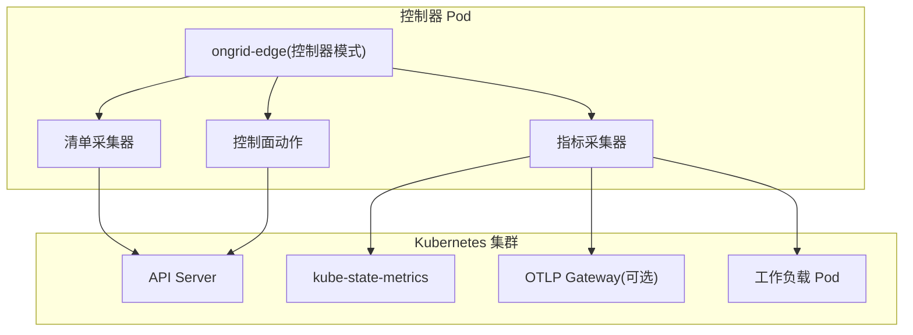
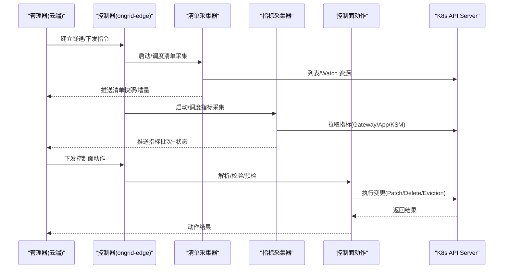
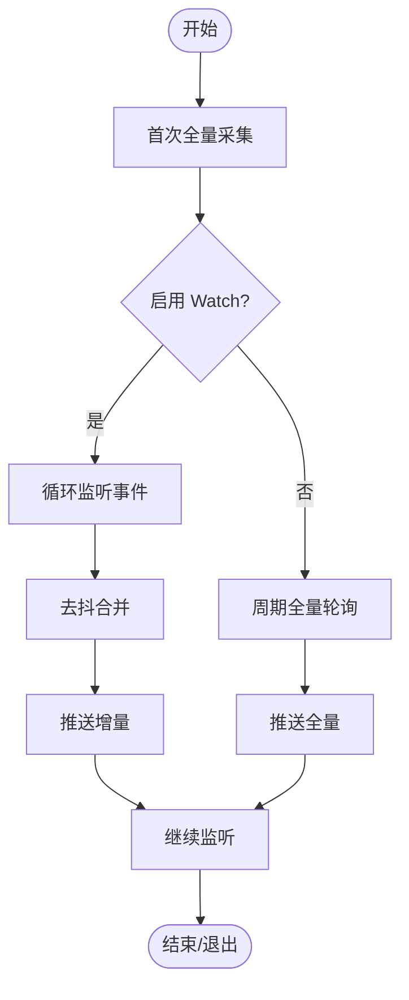
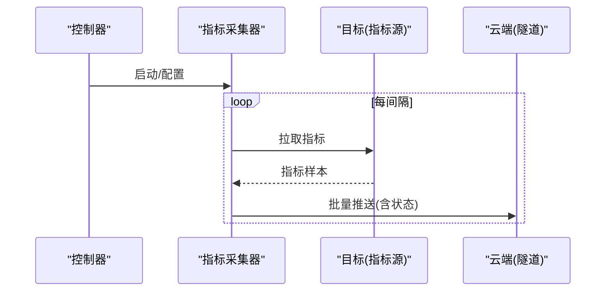
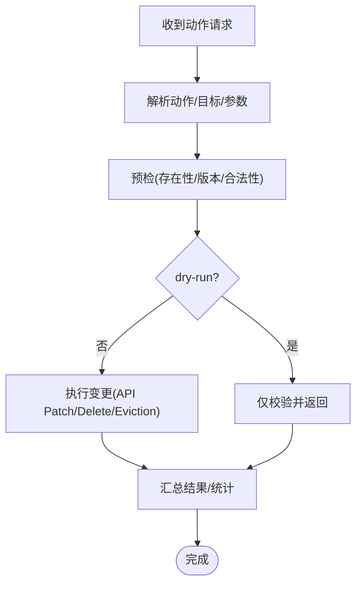
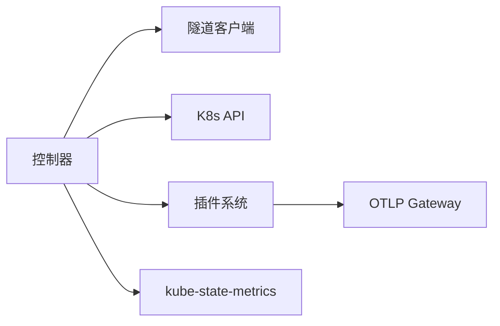

# 控制器模式部署

<cite>
**本文引用的文件**
- [cmd/ongrid-edge/main.go](file://cmd/ongrid-edge/main.go)
- [internal/edgeagent/k8s/inventory.go](file://internal/edgeagent/k8s/inventory.go)
- [internal/edgeagent/k8s/metrics.go](file://internal/edgeagent/k8s/metrics.go)
- [internal/edgeagent/k8s/actions.go](file://internal/edgeagent/k8s/actions.go)
- [deploy/kubernetes/ongrid-edge/values.yaml](file://deploy/kubernetes/ongrid-edge/values.yaml)
- [deploy/kubernetes/ongrid-edge/templates/deployment.yaml](file://deploy/kubernetes/ongrid-edge/templates/deployment.yaml)
- [deploy/kubernetes/ongrid-edge/templates/rbac.yaml](file://deploy/kubernetes/ongrid-edge/templates/rbac.yaml)
</cite>

## 目录
1. [简介](#简介)
2. [项目结构](#项目结构)
3. [核心组件](#核心组件)
4. [架构总览](#架构总览)
5. [详细组件分析](#详细组件分析)
6. [依赖关系分析](#依赖关系分析)
7. [性能考量](#性能考量)
8. [故障排查指南](#故障排查指南)
9. [结论](#结论)
10. [附录](#附录)

## 简介
本指南面向在 Kubernetes 中以“控制器模式”部署边缘代理（ongrid-edge）的运维与平台工程师。文档聚焦控制器角色的职责与能力：集群元数据采集、遥测配置同步与全局状态管理；并详细说明控制器模式的特殊配置项（集群发现、API 服务器访问、权限范围）、高可用策略（副本数、选举机制、故障转移）、与节点代理的通信机制（证书、令牌刷新、连接池）、监控与诊断方法（事件监听、日志聚合、指标），以及升级与维护策略（滚动更新、配置热重载、版本兼容）。

## 项目结构
- 控制器进程由 ongrid-edge 二进制以 k8s-controller 模式运行，通过环境变量和 ConfigMap/Secret 注入配置。
- 控制器内包含三大子系统：
  - 清单采集与推送（InventoryPusher）：周期性全量 + Watch 增量上报集群资源快照。
  - 指标采集与推送（MetricsPusher）：拉取 kube-state-metrics / OTLP Gateway / 应用指标并通过隧道上报。
  - 控制面动作执行（Actions）：对 Deployment/StatefulSet/DaemonSet/Pod/Node 等执行重启、扩缩容、驱逐、排空等操作。
- 部署模板提供 RBAC、ServiceAccount、Deployment、可选 Telemetry Gateway 与独立 Scraper 等。

图表来源
- [internal/edgeagent/k8s/inventory.go:536-594](file://internal/edgeagent/k8s/inventory.go#L536-L594)
- [internal/edgeagent/k8s/metrics.go:161-171](file://internal/edgeagent/k8s/metrics.go#L161-L171)
- [internal/edgeagent/k8s/actions.go:37-141](file://internal/edgeagent/k8s/actions.go#L37-L141)

章节来源
- [deploy/kubernetes/ongrid-edge/templates/deployment.yaml:68-179](file://deploy/kubernetes/ongrid-edge/templates/deployment.yaml#L68-L179)
- [deploy/kubernetes/ongrid-edge/values.yaml:36-123](file://deploy/kubernetes/ongrid-edge/values.yaml#L36-L123)

## 核心组件
- 控制器启动与模式切换
  - 通过环境变量 ONGRID_EDGE_MODE=k8s-controller 与 ONGRID_K8S_ROLE=controller 进入控制器模式。
  - 启用清单采集与推送、指标采集与推送（可配置），并在需要时启用 OTLP Gateway。
- 清单采集器（InventoryPusher）
  - 支持周期全量与 Watch 增量两种模式，自动处理资源版本过期与权限不足时的回退到命名空间级采集。
  - 采集对象包括 Node、Pod、Event 及常见 Workload（Deployment/StatefulSet/DaemonSet/ReplicaSet/Job/CronJob）。
- 指标采集器（MetricsPusher）
  - 支持三类目标：kube-state-metrics、OTLP Gateway、应用指标（基于注解自动发现）。
  - 内置批处理、样本限制、超时与重试，并将抓取状态作为指标上报。
- 控制面动作（Actions）
  - 支持 rollout_restart、scale、delete_pod、evict_pod、cordon/uncordon、drain 等动作，具备 dry-run、预检、资源版本冲突检测与优雅驱逐逻辑。

章节来源
- [cmd/ongrid-edge/main.go:121-149](file://cmd/ongrid-edge/main.go#L121-L149)
- [internal/edgeagent/k8s/inventory.go:85-170](file://internal/edgeagent/k8s/inventory.go#L85-L170)
- [internal/edgeagent/k8s/metrics.go:128-171](file://internal/edgeagent/k8s/metrics.go#L128-L171)
- [internal/edgeagent/k8s/actions.go:37-141](file://internal/edgeagent/k8s/actions.go#L37-L141)

## 架构总览
控制器模式下的数据与控制流如下：
- 控制器启动后读取配置，建立与云端的隧道客户端，并根据角色与开关启动相应子任务。
- 清单采集器按周期或 Watch 事件触发，将集群资源快照分块推送到云端。
- 指标采集器定时拉取 kube-state-metrics/Gateway/应用指标，经批处理后通过隧道上报。
- 控制面动作接收云端指令，校验参数与资源版本，调用 API Server 执行变更。

图表来源
- [cmd/ongrid-edge/main.go:147-149](file://cmd/ongrid-edge/main.go#L147-L149)
- [internal/edgeagent/k8s/inventory.go:177-225](file://internal/edgeagent/k8s/inventory.go#L177-L225)
- [internal/edgeagent/k8s/metrics.go:161-230](file://internal/edgeagent/k8s/metrics.go#L161-L230)
- [internal/edgeagent/k8s/actions.go:37-141](file://internal/edgeagent/k8s/actions.go#L37-L141)

## 详细组件分析

### 控制器启动与配置注入
- 关键环境变量
  - ONGRID_EDGE_MODE: 设置为 k8s-controller
  - ONGRID_K8S_ROLE: controller
  - ONGRID_K8S_CLUSTER_ID / BOOTSTRAP_TOKEN: 用于注册与鉴权
  - ONGRID_MANAGER_PUBLIC_URL / ONGRID_EDGE_CLOUD_ADDR: 管理器地址与隧道端点
  - ONGRID_K8S_INVENTORY_WATCH / INTERVAL: 清单 Watch 开关与全量间隔
  - ONGRID_K8S_METRICS_*: 指标采集相关参数
  - ONGRID_K8S_TELEMETRY_GATEWAY_ENABLED: 是否启用 OTLP Gateway
- 配置来源
  - ConfigMap: mode、manager-public-url、k8s-inventory-watch、k8s-metrics-*
  - Secret: cluster-id、bootstrap-token、凭证与遥测配置
- 健康检查与指标端口
  - 本地 :9101 暴露 /metrics 与 /healthz

章节来源
- [deploy/kubernetes/ongrid-edge/templates/deployment.yaml:68-179](file://deploy/kubernetes/ongrid-edge/templates/deployment.yaml#L68-L179)
- [cmd/ongrid-edge/main.go:119-149](file://cmd/ongrid-edge/main.go#L119-L149)

### 集群元数据采集（清单）
- 采集范围
  - 集群级：Nodes
  - 命名空间级：Pods、Events、Workloads（根据权限自动降级）
- 工作机制
  - 首次全量采集，随后开启 Watch 增量；资源版本过期时触发全量重同步
  - 支持去抖与退避重试，避免 API 压力
- 上报方式
  - 分块上报，附带 resourceVersion、收集耗时、Watch 触发原因等元信息

图表来源
- [internal/edgeagent/k8s/inventory.go:85-170](file://internal/edgeagent/k8s/inventory.go#L85-L170)
- [internal/edgeagent/k8s/inventory.go:346-444](file://internal/edgeagent/k8s/inventory.go#L346-L444)

章节来源
- [internal/edgeagent/k8s/inventory.go:536-594](file://internal/edgeagent/k8s/inventory.go#L536-L594)
- [internal/edgeagent/k8s/inventory.go:446-521](file://internal/edgeagent/k8s/inventory.go#L446-L521)

### 指标采集与推送
- 目标类型
  - kube-state-metrics：固定端点
  - OTLP Gateway：可选，用于聚合链路/日志/指标
  - 应用指标：基于 Pod 注解 prometheus.io/* 自动发现
- 采集策略
  - 定时拉取，支持超时、样本上限、分批大小与字节限制
  - 抓取状态与 up 指标单独上报，便于观测
- 上报通道
  - 通过隧道 RPC 批量推送，带 Source 标签区分来源

图表来源
- [internal/edgeagent/k8s/metrics.go:161-230](file://internal/edgeagent/k8s/metrics.go#L161-L230)
- [internal/edgeagent/k8s/metrics.go:290-326](file://internal/edgeagent/k8s/metrics.go#L290-L326)

章节来源
- [internal/edgeagent/k8s/metrics.go:28-126](file://internal/edgeagent/k8s/metrics.go#L28-L126)
- [internal/edgeagent/k8s/metrics.go:328-377](file://internal/edgeagent/k8s/metrics.go#L328-L377)

### 控制面动作（Rollout/Scale/Drain 等）
- 支持的典型动作
  - rollout_restart：为 Deployment/StatefulSet/DaemonSet 注入重启时间戳
  - scale：调整副本数
  - delete_pod / evict_pod：删除或驱逐 Pod
  - cordon/uncordon：节点不可调度/可调度
  - drain：安全排空节点（驱逐/删除 Pod，支持忽略 DaemonSet、EmptyDir 策略）
- 安全与一致性
  - 预检资源存在性与资源版本冲突
  - 支持 dry-run 验证
  - 驱逐失败时按 PDB 限流重试

图表来源
- [internal/edgeagent/k8s/actions.go:37-141](file://internal/edgeagent/k8s/actions.go#L37-L141)
- [internal/edgeagent/k8s/actions.go:421-478](file://internal/edgeagent/k8s/actions.go#L421-L478)

章节来源
- [internal/edgeagent/k8s/actions.go:143-265](file://internal/edgeagent/k8s/actions.go#L143-L265)
- [internal/edgeagent/k8s/actions.go:267-400](file://internal/edgeagent/k8s/actions.go#L267-L400)

### 遥测配置同步与热重载
- 控制器会定期从管理器获取遥测配置（端点、认证、TLS 等），写入投影 Secret
- Gateway 与 Scraper 可热重载配置，无需滚动更新
- 可通过环境变量控制刷新频率与是否强制要求

章节来源
- [cmd/ongrid-edge/main.go:670-755](file://cmd/ongrid-edge/main.go#L670-L755)
- [deploy/kubernetes/ongrid-edge/values.yaml:86-90](file://deploy/kubernetes/ongrid-edge/values.yaml#L86-L90)

### 与节点代理的通信机制
- 认证与会话
  - 使用 AccessKey/SecretKey 建立隧道；Kubernetes 模式下通过 Bootstrap Token 完成初始注册
  - 控制器与节点共享隧道协议，但职责不同：控制器负责集群视角的数据与控制，节点负责主机侧能力
- 证书与 TLS
  - 控制器访问 API Server 使用 ServiceAccount Token 与 CA；管理器对接支持可选跳过校验（仅测试环境）
- 连接与批处理
  - 指标与清单均使用分块/批处理，配合超时与重试，降低网络抖动影响

章节来源
- [cmd/ongrid-edge/main.go:537-668](file://cmd/ongrid-edge/main.go#L537-L668)
- [internal/edgeagent/k8s/inventory.go:707-741](file://internal/edgeagent/k8s/inventory.go#L707-L741)
- [internal/edgeagent/k8s/metrics.go:311-326](file://internal/edgeagent/k8s/metrics.go#L311-L326)

### 高可用与故障转移
- 副本数
  - 当前实现要求控制器 replicas=1（未实现 Leader Election），模板中已做校验
- 建议的高可用方案
  - 结合 PDB 确保至少一个 Pod 可用
  - 未来可引入基于 Lease 的 Leader Election，使多副本共存
- 故障恢复
  - Watch 断连自动重试与指数退避
  - 资源版本过期自动全量重同步
  - 指标抓取失败记录状态，不影响其他目标

章节来源
- [deploy/kubernetes/ongrid-edge/templates/deployment.yaml:14-16](file://deploy/kubernetes/ongrid-edge/templates/deployment.yaml#L14-L16)
- [internal/edgeagent/k8s/inventory.go:377-444](file://internal/edgeagent/k8s/inventory.go#L377-L444)
- [internal/edgeagent/k8s/metrics.go:257-288](file://internal/edgeagent/k8s/metrics.go#L257-L288)

### 权限范围（RBAC）
- 控制器最小权限
  - 读：nodes/namespaces/pods/services/endpoints/events/pods/log
  - 写：nodes(patch)、pods(delete)、pods/eviction(create)
  - 工作负载：apps/batch 资源的 get/list/watch，部分 patch
- 其他组件
  - Telemetry Gateway：只读访问 pods/namespaces/nodes 与常见 Workload
  - 指标 Scraper（独立模式）：list pods（用于应用指标发现）

章节来源
- [deploy/kubernetes/ongrid-edge/templates/rbac.yaml:101-174](file://deploy/kubernetes/ongrid-edge/templates/rbac.yaml#L101-L174)
- [deploy/kubernetes/ongrid-edge/templates/rbac.yaml:33-69](file://deploy/kubernetes/ongrid-edge/templates/rbac.yaml#L33-L69)
- [deploy/kubernetes/ongrid-edge/templates/rbac.yaml:71-99](file://deploy/kubernetes/ongrid-edge/templates/rbac.yaml#L71-L99)

## 依赖关系分析
- 控制器进程依赖
  - 隧道客户端：与云端管理器通信
  - K8s API Client：读取/操作集群资源
  - 插件系统：可选的 OTLP Gateway、日志/追踪/指标插件
- 外部依赖
  - kube-state-metrics：提供集群指标
  - OTLP Gateway：可选，统一遥测入口
  - Prometheus/Loki/Tempo：后端存储（由管理器侧集成）

图表来源
- [cmd/ongrid-edge/main.go:138-149](file://cmd/ongrid-edge/main.go#L138-L149)
- [internal/edgeagent/k8s/metrics.go:161-171](file://internal/edgeagent/k8s/metrics.go#L161-L171)

章节来源
- [cmd/ongrid-edge/main.go:302-417](file://cmd/ongrid-edge/main.go#L302-L417)

## 性能考量
- 清单采集
  - 合理设置全量间隔与 Watch 去抖，避免频繁全量
  - 关注资源版本过期导致的重同步风暴
- 指标采集
  - 调优 sampleLimit、batchSampleLimit、batchByteLimit 与超时
  - 对大指标集启用 ReportScrapeStatus，便于定位瓶颈
- 控制面动作
  - drain 操作注意 PDB 限制与重试退避，避免大规模驱逐导致 API 限流
- 资源配额
  - 控制器与 Scraper 的 CPU/Memory 请求与限制需与实际规模匹配

章节来源
- [internal/edgeagent/k8s/inventory.go:26-31](file://internal/edgeagent/k8s/inventory.go#L26-L31)
- [internal/edgeagent/k8s/metrics.go:16-26](file://internal/edgeagent/k8s/metrics.go#L16-L26)
- [internal/edgeagent/k8s/actions.go:30-35](file://internal/edgeagent/k8s/actions.go#L30-L35)

## 故障排查指南
- 常见问题
  - 无法发现集群 UID：检查 ServiceAccount 与 CA 配置
  - 清单推送失败：查看 Watch 错误与资源版本过期日志
  - 指标抓取失败：确认端点可达、认证与 TLS 配置
  - 控制面动作被拒：核对 RBAC 与资源版本冲突
- 诊断手段
  - 控制器本地 /metrics 与 /healthz
  - 查看控制器日志中的组件标签（comp）
  - 通过管理器侧查询 Edge 在线状态与最近心跳
- 快速修复
  - 修正 RBAC 或 ServiceAccount
  - 调整指标采样限制与超时
  - 重新注入遥测配置 Secret

章节来源
- [cmd/ongrid-edge/main.go:282-290](file://cmd/ongrid-edge/main.go#L282-L290)
- [internal/edgeagent/k8s/inventory.go:407-444](file://internal/edgeagent/k8s/inventory.go#L407-L444)
- [internal/edgeagent/k8s/metrics.go:257-288](file://internal/edgeagent/k8s/metrics.go#L257-L288)

## 结论
控制器模式将集群视角的元数据采集、指标汇聚与编排动作集中在单一可控进程中，配合 Watch 与批处理机制，兼顾实时性与稳定性。当前实现采用单副本以确保一致性，后续可引入 Leader Election 提升可用性。通过合理的 RBAC、指标阈值与 Watch 去抖，可在大规模集群中稳定运行。

## 附录
- 关键环境变量速查
  - ONGRID_EDGE_MODE、ONGRID_K8S_ROLE、ONGRID_K8S_CLUSTER_ID、ONGRID_K8S_BOOTSTRAP_TOKEN
  - ONGRID_MANAGER_PUBLIC_URL、ONGRID_EDGE_CLOUD_ADDR
  - ONGRID_K8S_INVENTORY_WATCH、ONGRID_K8S_INVENTORY_INTERVAL
  - ONGRID_K8S_METRICS_ENDPOINT、ONGRID_K8S_METRICS_INTERVAL/TIMEOUT/PUSH_TIMEOUT
  - ONGRID_K8S_APP_METRICS_DISCOVERY、ONGRID_K8S_TELEMETRY_GATEWAY_ENABLED
- 部署要点
  - 确保 RBAC 与服务账号正确
  - 按需启用 kube-state-metrics 与 OTLP Gateway
  - 使用 Helm values 控制副本、资源与采集参数

章节来源
- [deploy/kubernetes/ongrid-edge/templates/deployment.yaml:68-179](file://deploy/kubernetes/ongrid-edge/templates/deployment.yaml#L68-L179)
- [deploy/kubernetes/ongrid-edge/values.yaml:36-123](file://deploy/kubernetes/ongrid-edge/values.yaml#L36-L123)