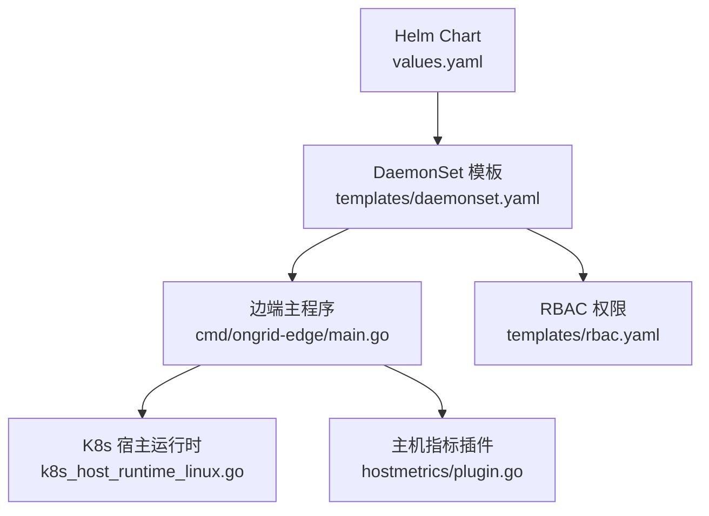
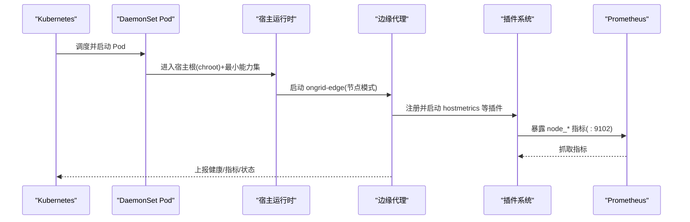
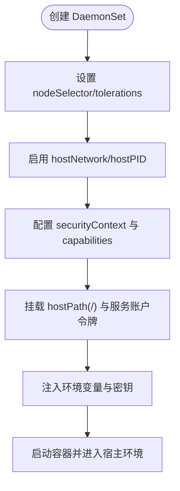
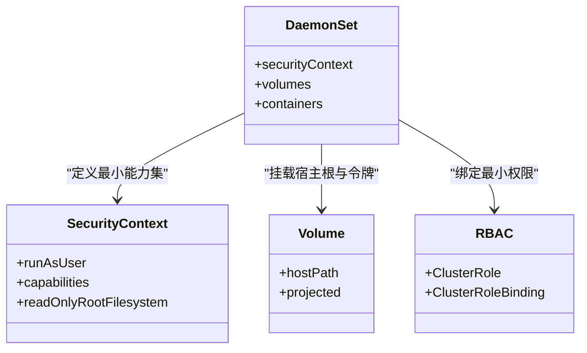
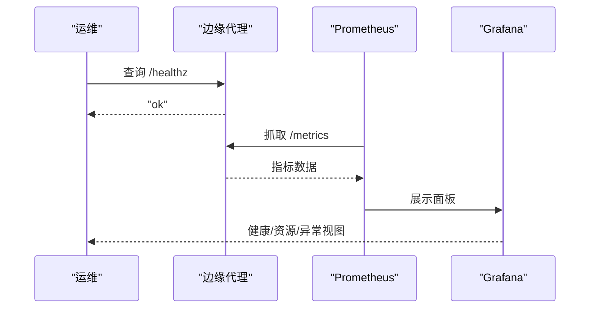
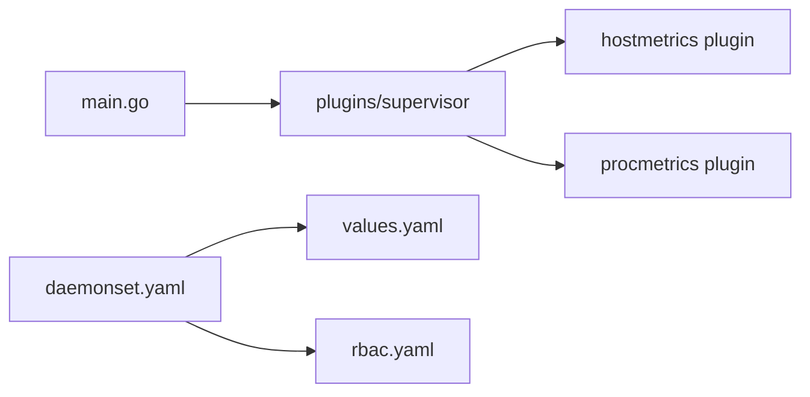

# 节点模式部署

<cite>
**本文引用的文件**
- [cmd/ongrid-edge/main.go](file://cmd/ongrid-edge/main.go)
- [cmd/ongrid-edge/k8s_host_runtime_linux.go](file://cmd/ongrid-edge/k8s_host_runtime_linux.go)
- [deploy/kubernetes/ongrid-edge/values.yaml](file://deploy/kubernetes/ongrid-edge/values.yaml)
- [deploy/kubernetes/ongrid-edge/templates/daemonset.yaml](file://deploy/kubernetes/ongrid-edge/templates/daemonset.yaml)
- [deploy/kubernetes/ongrid-edge/templates/rbac.yaml](file://deploy/kubernetes/ongrid-edge/templates/rbac.yaml)
- [internal/edgeagent/plugins/hostmetrics/plugin.go](file://internal/edgeagent/plugins/hostmetrics/plugin.go)
- [docs/install/edge.md](file://docs/install/edge.md)
</cite>

## 目录
1. [简介](#简介)
2. [项目结构](#项目结构)
3. [核心组件](#核心组件)
4. [架构总览](#架构总览)
5. [详细组件分析](#详细组件分析)
6. [依赖关系分析](#依赖关系分析)
7. [性能与资源管理](#性能与资源管理)
8. [监控与诊断](#监控与诊断)
9. [维护与升级](#维护与升级)
10. [故障排查指南](#故障排查指南)
11. [结论](#结论)

## 简介
本指南面向在 Kubernetes 集群中以 DaemonSet 方式部署边缘代理的“节点模式”。节点模式下的代理在每个节点上运行，具备主机指标采集、进程监控、文件系统访问等能力，并通过隧道将数据上报至控制面。文档从职责与能力、DaemonSet 配置、权限与安全、资源与弹性、监控诊断、维护升级等方面给出可操作的部署建议与最佳实践。

## 项目结构
与节点模式部署直接相关的代码与配置集中在以下位置：
- 边缘代理主程序与 K8s 宿主运行时入口
- Helm Chart 的 DaemonSet 模板与 values 配置
- RBAC 权限定义
- 主机指标插件（node_exporter 子进程）实现
- 安装与连接说明文档

**图表来源**
- [deploy/kubernetes/ongrid-edge/values.yaml:1-188](file://deploy/kubernetes/ongrid-edge/values.yaml#L1-L188)
- [deploy/kubernetes/ongrid-edge/templates/daemonset.yaml:1-188](file://deploy/kubernetes/ongrid-edge/templates/daemonset.yaml#L1-L188)
- [cmd/ongrid-edge/main.go:1-800](file://cmd/ongrid-edge/main.go#L1-L800)
- [cmd/ongrid-edge/k8s_host_runtime_linux.go:1-147](file://cmd/ongrid-edge/k8s_host_runtime_linux.go#L1-L147)
- [internal/edgeagent/plugins/hostmetrics/plugin.go:1-277](file://internal/edgeagent/plugins/hostmetrics/plugin.go#L1-L277)
- [deploy/kubernetes/ongrid-edge/templates/rbac.yaml:1-174](file://deploy/kubernetes/ongrid-edge/templates/rbac.yaml#L1-L174)

**章节来源**
- [deploy/kubernetes/ongrid-edge/values.yaml:1-188](file://deploy/kubernetes/ongrid-edge/values.yaml#L1-L188)
- [deploy/kubernetes/ongrid-edge/templates/daemonset.yaml:1-188](file://deploy/kubernetes/ongrid-edge/templates/daemonset.yaml#L1-L188)
- [cmd/ongrid-edge/main.go:1-800](file://cmd/ongrid-edge/main.go#L1-L800)
- [cmd/ongrid-edge/k8s_host_runtime_linux.go:1-147](file://cmd/ongrid-edge/k8s_host_runtime_linux.go#L1-L147)
- [internal/edgeagent/plugins/hostmetrics/plugin.go:1-277](file://internal/edgeagent/plugins/hostmetrics/plugin.go#L1-L277)
- [deploy/kubernetes/ongrid-edge/templates/rbac.yaml:1-174](file://deploy/kubernetes/ongrid-edge/templates/rbac.yaml#L1-L174)

## 核心组件
- 边缘代理主程序：负责隧道建立、采集器构建、插件生命周期管理、本地 /metrics 健康检查等。
- K8s 宿主运行时：以 chroot + 最小化能力集进入宿主环境，执行 host edge 二进制，确保对宿主的受控访问。
- 主机指标插件：启动 node_exporter 子进程并暴露 node_* 指标；同时通过 textfile 补充内核 conntrack 指标。
- Helm Chart：提供 DaemonSet、ServiceAccount、RBAC、ConfigMap/Secret 等资源，支持节点亲和、容忍度、资源限制等。

**章节来源**
- [cmd/ongrid-edge/main.go:1-800](file://cmd/ongrid-edge/main.go#L1-L800)
- [cmd/ongrid-edge/k8s_host_runtime_linux.go:1-147](file://cmd/ongrid-edge/k8s_host_runtime_linux.go#L1-L147)
- [internal/edgeagent/plugins/hostmetrics/plugin.go:1-277](file://internal/edgeagent/plugins/hostmetrics/plugin.go#L1-L277)
- [deploy/kubernetes/ongrid-edge/values.yaml:1-188](file://deploy/kubernetes/ongrid-edge/values.yaml#L1-L188)

## 架构总览
节点模式下，每个节点上的 DaemonSet Pod 以宿主网络与 PID 命名空间运行，通过 chroot 进入宿主根文件系统，并以最小能力集执行宿主侧逻辑。插件子系统按需拉起 node_exporter、process-exporter 等子进程，暴露指标供 Prometheus 抓取或通过隧道上报。

**图表来源**
- [deploy/kubernetes/ongrid-edge/templates/daemonset.yaml:24-188](file://deploy/kubernetes/ongrid-edge/templates/daemonset.yaml#L24-L188)
- [cmd/ongrid-edge/k8s_host_runtime_linux.go:29-74](file://cmd/ongrid-edge/k8s_host_runtime_linux.go#L29-L74)
- [internal/edgeagent/plugins/hostmetrics/plugin.go:62-133](file://internal/edgeagent/plugins/hostmetrics/plugin.go#L62-L133)
- [cmd/ongrid-edge/main.go:151-417](file://cmd/ongrid-edge/main.go#L151-L417)

## 详细组件分析

### 节点角色职责与能力
- 主机指标采集：默认通过 hostmetrics 插件启动 node_exporter 子进程，监听端口 :9102，暴露 node_* 指标；同时内置 textfile 补充 conntrack 指标。
- 进程监控：通过 process-exporter 插件暴露进程级指标。
- 文件系统访问：以 chroot 方式进入宿主根，配合最小能力集与只读根文件系统，安全地读取 /proc、/sys 等关键路径。
- 插件热更新：通过 Supervisor 拉取插件配置变更并触发重载，无需重启 Pod。

**章节来源**
- [internal/edgeagent/plugins/hostmetrics/plugin.go:1-277](file://internal/edgeagent/plugins/hostmetrics/plugin.go#L1-L277)
- [cmd/ongrid-edge/main.go:309-417](file://cmd/ongrid-edge/main.go#L309-L417)
- [cmd/ongrid-edge/k8s_host_runtime_linux.go:29-74](file://cmd/ongrid-edge/k8s_host_runtime_linux.go#L29-L74)

### DaemonSet 部署优势与配置要点
- 每节点一实例：保证每个节点都能采集本机指标与日志。
- 节点亲和与容忍度：通过 nodeSelector 与 tolerations 将 Pod 调度到目标节点。
- 宿主网络与 PID：启用 hostNetwork 与 hostPID，便于直接访问宿主资源与进程。
- 安全上下文：以 root 用户运行但仅授予必要能力，关闭特权提升，使用只读根文件系统。
- 环境变量注入：通过 ConfigMap/Secret 注入集群 ID、Bootstrap Token、管理器地址等。

**图表来源**
- [deploy/kubernetes/ongrid-edge/templates/daemonset.yaml:24-188](file://deploy/kubernetes/ongrid-edge/templates/daemonset.yaml#L24-L188)
- [deploy/kubernetes/ongrid-edge/values.yaml:21-35](file://deploy/kubernetes/ongrid-edge/values.yaml#L21-L35)

**章节来源**
- [deploy/kubernetes/ongrid-edge/templates/daemonset.yaml:1-188](file://deploy/kubernetes/ongrid-edge/templates/daemonset.yaml#L1-L188)
- [deploy/kubernetes/ongrid-edge/values.yaml:1-188](file://deploy/kubernetes/ongrid-edge/values.yaml#L1-L188)

### 权限配置（Privileged、Volume、HostPath）
- 不启用 Privileged：通过精确的 capabilities 列表满足需求，降低风险。
- 服务账户令牌投影：以 projected volume 方式挂载 token、CA 与命名空间信息，避免隐式挂载。
- HostPath 挂载：将宿主根目录以只读方式挂载到 /host/root，并在 chroot 后以受限身份运行。
- RBAC 最小权限：节点模式仅需读取 kube-system namespace 以识别集群身份；控制器模式才需要更广泛的集群资源访问。

**图表来源**
- [deploy/kubernetes/ongrid-edge/templates/daemonset.yaml:146-188](file://deploy/kubernetes/ongrid-edge/templates/daemonset.yaml#L146-L188)
- [deploy/kubernetes/ongrid-edge/templates/rbac.yaml:101-127](file://deploy/kubernetes/ongrid-edge/templates/rbac.yaml#L101-L127)

**章节来源**
- [deploy/kubernetes/ongrid-edge/templates/daemonset.yaml:146-188](file://deploy/kubernetes/ongrid-edge/templates/daemonset.yaml#L146-L188)
- [deploy/kubernetes/ongrid-edge/templates/rbac.yaml:1-174](file://deploy/kubernetes/ongrid-edge/templates/rbac.yaml#L1-174)

### 资源管理与弹性伸缩
- CPU/内存限制：在 values.yaml 中为节点 Pod 设置 requests 与 limits，保障基础资源与上限。
- QoS 级别：requests 与 limits 的设置会影响 Pod 的 QoS 等级（Guaranteed/Burstable/BestEffort），影响调度与驱逐策略。
- 弹性伸缩：节点模式通常固定副本数（DaemonSet），不建议 HPA；如需横向扩展，应通过调整集群规模或节点池大小实现。
- 插件资源：node_exporter 等子进程由插件管理，其资源占用可通过采集频率与采集器开关进行优化。

**章节来源**
- [deploy/kubernetes/ongrid-edge/values.yaml:21-35](file://deploy/kubernetes/ongrid-edge/values.yaml#L21-L35)
- [internal/edgeagent/plugins/hostmetrics/plugin.go:233-246](file://internal/edgeagent/plugins/hostmetrics/plugin.go#L233-L246)

### 监控与诊断方法
- 节点健康检查：本地 /healthz 返回 ok；结合 Prometheus 抓取 agent 自身指标。
- 资源使用统计：通过 node_* 指标观察 CPU、内存、磁盘、网络等；conntrack 指标用于评估连接跟踪负载。
- 异常检测：关注插件健康快照、重启次数、最后错误信息；结合 Manager 告警规则进行异常发现。
- 日志与追踪：插件支持日志与追踪输出，便于定位问题。

**图表来源**
- [cmd/ongrid-edge/main.go:282-290](file://cmd/ongrid-edge/main.go#L282-L290)
- [internal/edgeagent/plugins/hostmetrics/plugin.go:150-231](file://internal/edgeagent/plugins/hostmetrics/plugin.go#L150-L231)

**章节来源**
- [cmd/ongrid-edge/main.go:282-290](file://cmd/ongrid-edge/main.go#L282-L290)
- [internal/edgeagent/plugins/hostmetrics/plugin.go:150-231](file://internal/edgeagent/plugins/hostmetrics/plugin.go#L150-L231)

### 维护与升级策略
- 滚动更新：通过 Helm 升级 DaemonSet，利用预检查钩子确保平滑过渡。
- 配置同步：插件配置通过隧道动态下发，支持热重载；telemetry 配置定期刷新。
- 故障恢复：插件崩溃由 Supervisor 自动重启；Pod 重启由 DaemonSet 控制器处理。
- 回滚策略：保留旧版本镜像与配置，必要时快速回滚。

**章节来源**
- [deploy/kubernetes/ongrid-edge/values.yaml:125-133](file://deploy/kubernetes/ongrid-edge/values.yaml#L125-L133)
- [cmd/ongrid-edge/main.go:359-417](file://cmd/ongrid-edge/main.go#L359-L417)

## 依赖关系分析
- 主程序依赖插件子系统，插件子系统管理 node_exporter、process-exporter 等子进程。
- DaemonSet 模板依赖 values 配置，注入环境变量与资源限制。
- RBAC 为控制器与节点模式分别定义最小权限集合。

**图表来源**
- [cmd/ongrid-edge/main.go:309-417](file://cmd/ongrid-edge/main.go#L309-L417)
- [deploy/kubernetes/ongrid-edge/templates/daemonset.yaml:1-188](file://deploy/kubernetes/ongrid-edge/templates/daemonset.yaml#L1-L188)
- [deploy/kubernetes/ongrid-edge/templates/rbac.yaml:1-174](file://deploy/kubernetes/ongrid-edge/templates/rbac.yaml#L1-L174)

**章节来源**
- [cmd/ongrid-edge/main.go:309-417](file://cmd/ongrid-edge/main.go#L309-L417)
- [deploy/kubernetes/ongrid-edge/templates/daemonset.yaml:1-188](file://deploy/kubernetes/ongrid-edge/templates/daemonset.yaml#L1-L188)
- [deploy/kubernetes/ongrid-edge/templates/rbac.yaml:1-174](file://deploy/kubernetes/ongrid-edge/templates/rbac.yaml#L1-L174)

## 性能与资源管理
- 采集频率：合理设置 scrape 间隔，避免过度采样导致 CPU/IO 压力。
- 采集器开关：按需启用/禁用特定 collector，减少不必要开销。
- 文本文件指标：textfile 写入采用原子替换，避免部分写入导致的解析失败。
- 资源限制：为节点 Pod 设置合理的 requests/limits，防止资源争用。

**章节来源**
- [internal/edgeagent/plugins/hostmetrics/plugin.go:150-231](file://internal/edgeagent/plugins/hostmetrics/plugin.go#L150-L231)
- [deploy/kubernetes/ongrid-edge/values.yaml:21-35](file://deploy/kubernetes/ongrid-edge/values.yaml#L21-L35)

## 监控与诊断
- 健康检查：/healthz 返回 ok；结合 Prometheus 抓取 agent 指标。
- 指标面板：使用 Grafana 展示节点资源、连接跟踪、进程指标等。
- 日志与追踪：插件输出日志与追踪数据，便于问题定位。
- 告警规则：基于 Prometheus 规则对异常指标进行告警。

**章节来源**
- [cmd/ongrid-edge/main.go:282-290](file://cmd/ongrid-edge/main.go#L282-L290)
- [internal/edgeagent/plugins/hostmetrics/plugin.go:150-231](file://internal/edgeagent/plugins/hostmetrics/plugin.go#L150-L231)

## 维护与升级
- 滚动更新：使用 Helm 升级，确保预检查钩子成功。
- 配置同步：插件配置动态下发，支持热重载。
- 故障恢复：插件崩溃自动重启，Pod 重启由控制器处理。
- 回滚策略：保留旧版本镜像与配置，必要时快速回滚。

**章节来源**
- [deploy/kubernetes/ongrid-edge/values.yaml:125-133](file://deploy/kubernetes/ongrid-edge/values.yaml#L125-L133)
- [cmd/ongrid-edge/main.go:359-417](file://cmd/ongrid-edge/main.go#L359-L417)

## 故障排查指南
- 无法连接控制面：检查 Bootstrap Token、集群 ID、管理器地址是否正确。
- 指标缺失：确认 node_exporter 是否启动，端口 :9102 是否可达。
- 权限不足：检查 capabilities 与 RBAC 是否满足需求。
- 插件异常：查看插件健康快照与日志，必要时重启插件或 Pod。

**章节来源**
- [docs/install/edge.md:105-119](file://docs/install/edge.md#L105-L119)
- [cmd/ongrid-edge/main.go:151-417](file://cmd/ongrid-edge/main.go#L151-L417)

## 结论
节点模式下的边缘代理通过 DaemonSet 在每个节点上运行，具备主机指标采集、进程监控与安全的文件系统访问能力。通过精确的权限控制、合理的资源限制与完善的监控诊断手段，可以在生产环境中稳定运行。建议遵循最小权限原则，合理配置采集频率与采集器，结合告警规则与可视化面板进行持续监控与维护。