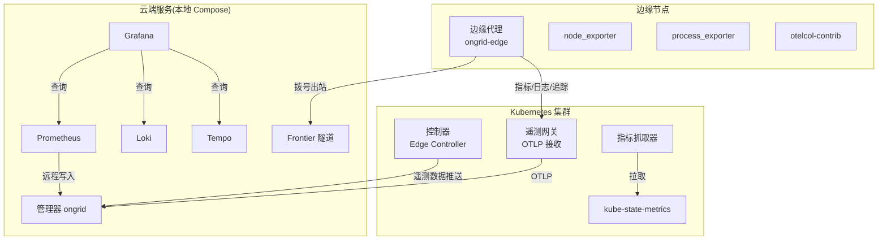
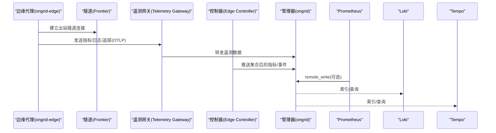
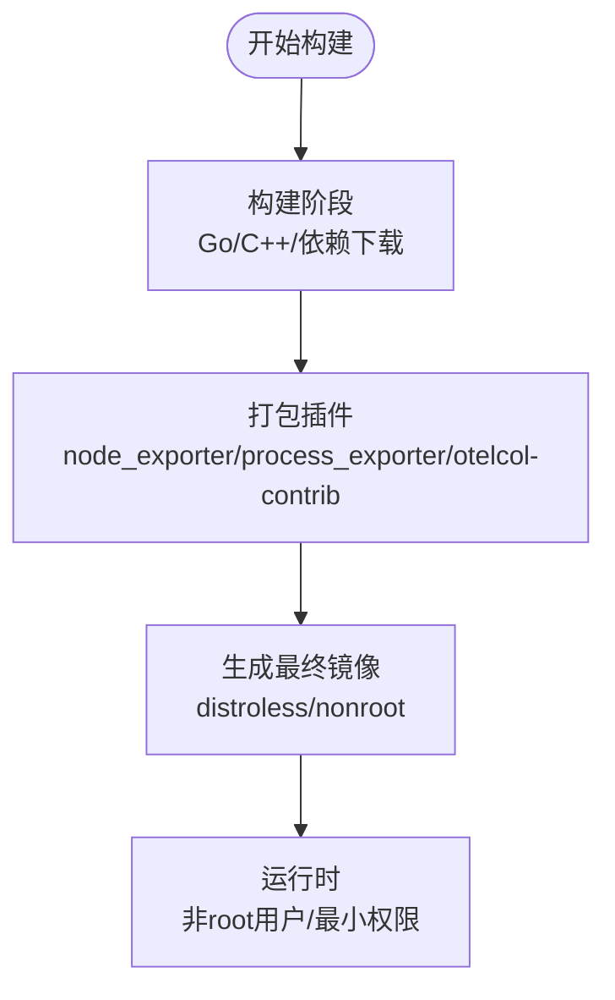
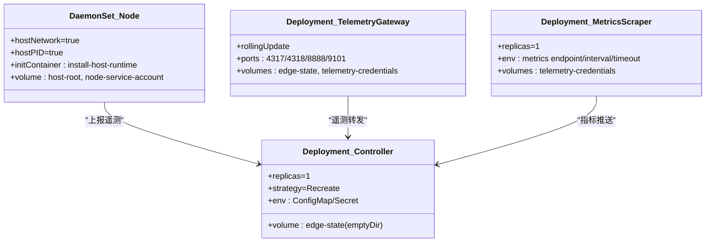
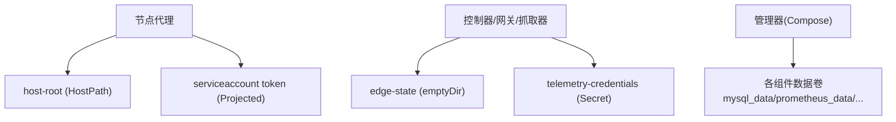
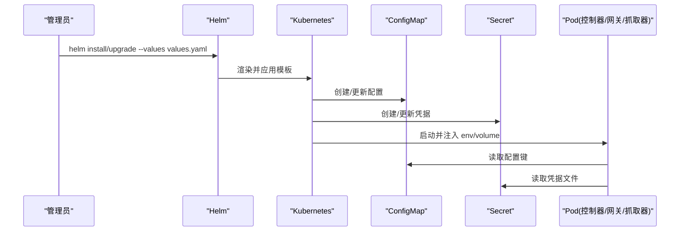
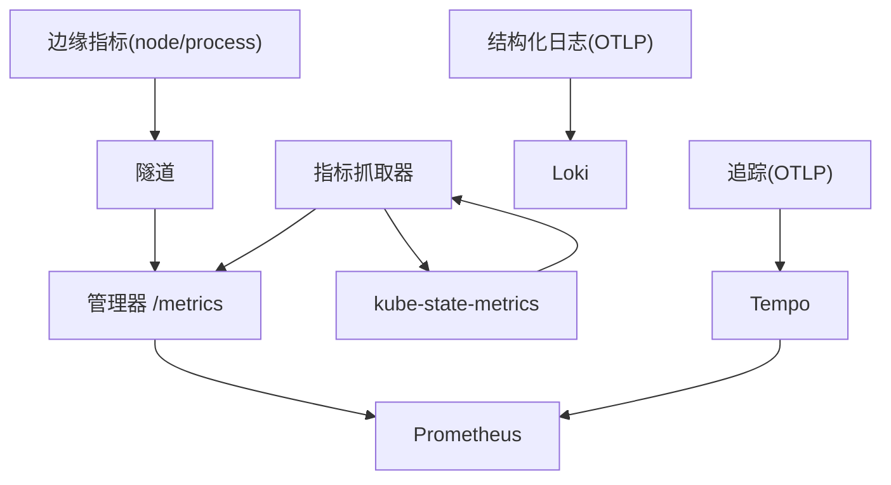
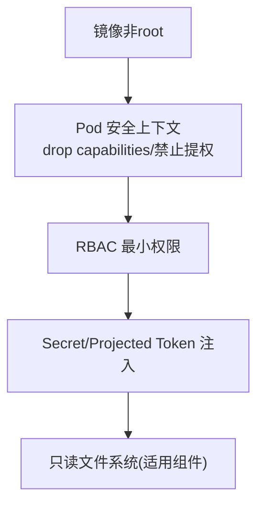
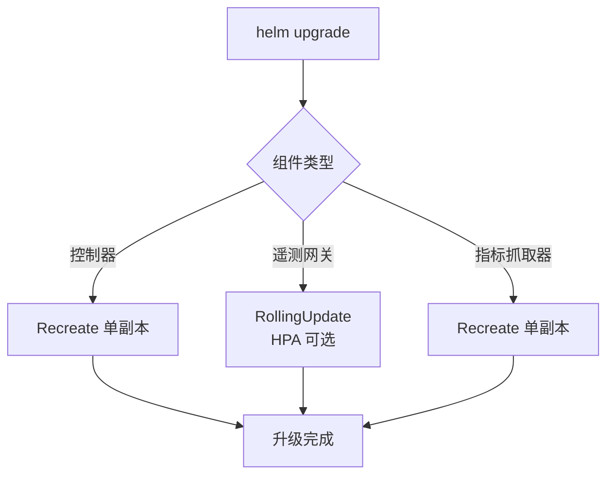
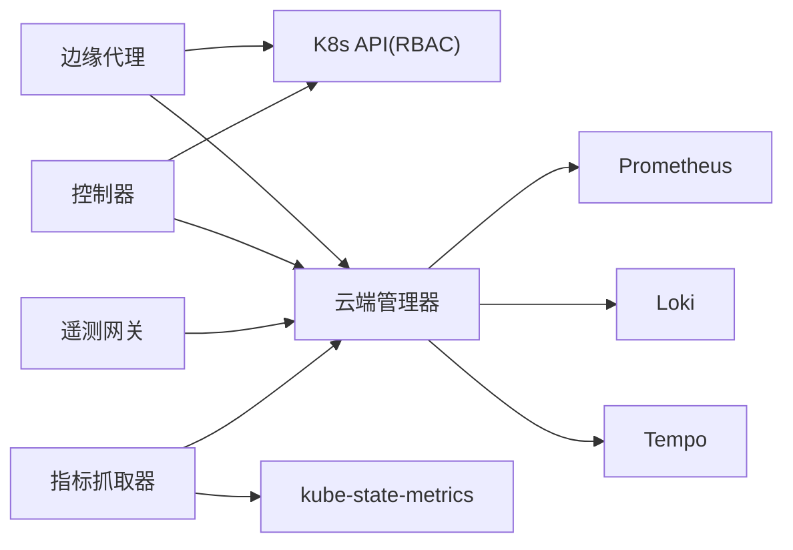

# 容器化部署

<cite>
**本文引用的文件**
- [deploy/Dockerfile.ongrid-edge](file://deploy/Dockerfile.ongrid-edge)
- [deploy/Dockerfile.ongrid](file://deploy/Dockerfile.ongrid)
- [deploy/kubernetes/ongrid-edge/Chart.yaml](file://deploy/kubernetes/ongrid-edge/Chart.yaml)
- [deploy/kubernetes/ongrid-edge/values.yaml](file://deploy/kubernetes/ongrid-edge/values.yaml)
- [deploy/kubernetes/ongrid-edge/templates/daemonset.yaml](file://deploy/kubernetes/ongrid-edge/templates/daemonset.yaml)
- [deploy/kubernetes/ongrid-edge/templates/deployment.yaml](file://deploy/kubernetes/ongrid-edge/templates/deployment.yaml)
- [deploy/kubernetes/ongrid-edge/templates/configmap.yaml](file://deploy/kubernetes/ongrid-edge/templates/configmap.yaml)
- [deploy/kubernetes/ongrid-edge/templates/serviceaccount.yaml](file://deploy/kubernetes/ongrid-edge/templates/serviceaccount.yaml)
- [deploy/kubernetes/ongrid-edge/templates/rbac.yaml](file://deploy/kubernetes/ongrid-edge/templates/rbac.yaml)
- [deploy/kubernetes/ongrid-edge/templates/telemetry-gateway-deployment.yaml](file://deploy/kubernetes/ongrid-edge/templates/telemetry-gateway-deployment.yaml)
- [deploy/kubernetes/ongrid-edge/templates/metrics-scraper-deployment.yaml](file://deploy/kubernetes/ongrid-edge/templates/metrics-scraper-deployment.yaml)
- [deploy/docker-compose.yml](file://deploy/docker-compose.yml)
- [deploy/install/prometheus.yml](file://deploy/install/prometheus.yml)
- [deploy/install/loki-config.yaml](file://deploy/install/loki-config.yaml)
- [deploy/install/tempo-config.yaml](file://deploy/install/tempo-config.yaml)
</cite>

## 目录
1. [简介](#简介)
2. [项目结构](#项目结构)
3. [核心组件](#核心组件)
4. [架构总览](#架构总览)
5. [详细组件分析](#详细组件分析)
6. [依赖关系分析](#依赖关系分析)
7. [性能考虑](#性能考虑)
8. [故障排查指南](#故障排查指南)
9. [结论](#结论)
10. [附录](#附录)

## 简介
本指南面向在容器化环境中部署边缘代理（ongrid-edge）与配套控制面组件的运维与平台团队。内容覆盖镜像构建、运行时安全加固、Kubernetes 编排（Deployment/DaemonSet/StatefulSet 使用场景）、网络与服务暴露、存储卷挂载、Helm Chart 值与环境变量注入、监控与日志采集、以及升级回滚策略。文档严格基于仓库内提供的 Dockerfile、Helm Chart 模板与本地开发 Compose 配置进行说明，确保可落地与可追溯。

## 项目结构
仓库中与容器化部署直接相关的资源集中在 deploy 目录：
- 镜像定义：Dockerfile.ongrid（云侧管理器）、Dockerfile.ongrid-edge（边缘节点代理）
- Kubernetes Helm Chart：deploy/kubernetes/ongrid-edge（包含 Deployment、DaemonSet、ServiceAccount、RBAC、ConfigMap、Telemetry Gateway、Metrics Scraper 等模板）
- 本地开发栈：deploy/docker-compose.yml（含 MySQL、Prometheus、Loki、Tempo、Grafana、Frontier 等）
- 观测性后端配置：deploy/install/prometheus.yml、loki-config.yaml、tempo-config.yaml

**图表来源**
- [deploy/Dockerfile.ongrid-edge:114-126](file://deploy/Dockerfile.ongrid-edge#L114-L126)
- [deploy/kubernetes/ongrid-edge/templates/daemonset.yaml:24-188](file://deploy/kubernetes/ongrid-edge/templates/daemonset.yaml#L24-L188)
- [deploy/kubernetes/ongrid-edge/templates/deployment.yaml:17-193](file://deploy/kubernetes/ongrid-edge/templates/deployment.yaml#L17-L193)
- [deploy/kubernetes/ongrid-edge/templates/telemetry-gateway-deployment.yaml:31-164](file://deploy/kubernetes/ongrid-edge/templates/telemetry-gateway-deployment.yaml#L31-L164)
- [deploy/kubernetes/ongrid-edge/templates/metrics-scraper-deployment.yaml:16-169](file://deploy/kubernetes/ongrid-edge/templates/metrics-scraper-deployment.yaml#L16-L169)
- [deploy/docker-compose.yml:39-185](file://deploy/docker-compose.yml#L39-L185)

**章节来源**
- [deploy/Dockerfile.ongrid-edge:1-127](file://deploy/Dockerfile.ongrid-edge#L1-L127)
- [deploy/Dockerfile.ongrid:1-159](file://deploy/Dockerfile.ongrid#L1-L159)
- [deploy/kubernetes/ongrid-edge/Chart.yaml:1-7](file://deploy/kubernetes/ongrid-edge/Chart.yaml#L1-L7)
- [deploy/kubernetes/ongrid-edge/values.yaml:1-188](file://deploy/kubernetes/ongrid-edge/values.yaml#L1-L188)
- [deploy/docker-compose.yml:1-405](file://deploy/docker-compose.yml#L1-L405)

## 核心组件
- 边缘代理镜像（ongrid-edge）
  - 多阶段构建：Go 二进制 + node_exporter + process_exporter + otelcol-contrib 打包进最终镜像
  - 运行态使用 distroless nonroot 基础镜像，仅暴露本地 /metrics 端口（调试用），正常不接收入站流量
- 管理器镜像（ongrid）
  - CGO 编译（ONNX Runtime 依赖），最终镜像为 debian bookworm slim，非 root 用户运行
  - 内置 skills/agents 包，支持知识仓库与工具链持久化
- Kubernetes 编排
  - DaemonSet：每个节点一个边缘代理 Pod，hostNetwork/hostPID，chroot 到宿主根文件系统以采集主机指标
  - Deployment：控制器单副本（Recreate 策略），遥测网关独立 Deployment（滚动更新），指标抓取器独立 Deployment
  - ConfigMap/Secret/ServiceAccount/RBAC：集中管理配置、凭据与最小权限访问
- 本地开发栈（Compose）
  - 提供 MySQL、Prometheus、Loki、Tempo、Grafana、Frontier 等，便于联调与演示

**章节来源**
- [deploy/Dockerfile.ongrid-edge:16-126](file://deploy/Dockerfile.ongrid-edge#L16-L126)
- [deploy/Dockerfile.ongrid:7-159](file://deploy/Dockerfile.ongrid#L7-L159)
- [deploy/kubernetes/ongrid-edge/templates/daemonset.yaml:1-188](file://deploy/kubernetes/ongrid-edge/templates/daemonset.yaml#L1-L188)
- [deploy/kubernetes/ongrid-edge/templates/deployment.yaml:1-193](file://deploy/kubernetes/ongrid-edge/templates/deployment.yaml#L1-L193)
- [deploy/kubernetes/ongrid-edge/templates/telemetry-gateway-deployment.yaml:1-164](file://deploy/kubernetes/ongrid-edge/templates/telemetry-gateway-deployment.yaml#L1-L164)
- [deploy/kubernetes/ongrid-edge/templates/metrics-scraper-deployment.yaml:1-169](file://deploy/kubernetes/ongrid-edge/templates/metrics-scraper-deployment.yaml#L1-L169)
- [deploy/docker-compose.yml:13-405](file://deploy/docker-compose.yml#L13-L405)

## 架构总览
边缘代理通过隧道主动拨号至云端（Frontier/Manager），不暴露入站端口；遥测数据经 OTLP 进入集群内的遥测网关或控制器，再汇聚到云端管理器。指标可通过 Prometheus remote_write 或独立抓取器采集。日志与追踪分别由 Loki 与 Tempo 接收并存储，Grafana 统一查询。

**图表来源**
- [deploy/Dockerfile.ongrid-edge:114-126](file://deploy/Dockerfile.ongrid-edge#L114-L126)
- [deploy/kubernetes/ongrid-edge/templates/telemetry-gateway-deployment.yaml:88-164](file://deploy/kubernetes/ongrid-edge/templates/telemetry-gateway-deployment.yaml#L88-L164)
- [deploy/kubernetes/ongrid-edge/templates/deployment.yaml:54-193](file://deploy/kubernetes/ongrid-edge/templates/deployment.yaml#L54-L193)
- [deploy/docker-compose.yml:39-185](file://deploy/docker-compose.yml#L39-L185)

## 详细组件分析

### 镜像构建与运行时安全
- 边缘代理镜像
  - 构建阶段：Go 交叉编译、下载并校验 node_exporter/process_exporter/otelcol-contrib 二进制
  - 运行阶段：distroless base-debian12:nonroot，设置 USER nonroot，仅 EXPOSE 9101（本地 /metrics）
- 管理器镜像
  - 构建阶段：golang:1.25-bookworm，启用 CGO，安装 gcc/pkg-config，缓存 go mod 与编译缓存
  - 运行阶段：debian:bookworm-slim，安装 git/openssh-client/ca-certificates/tzdata/libgomp1/libstdc++6/curl/python3/pip，安装 ONNX Runtime 共享库，设置 HOME=/var/lib/ongrid，USER nonroot

**图表来源**
- [deploy/Dockerfile.ongrid-edge:16-126](file://deploy/Dockerfile.ongrid-edge#L16-L126)
- [deploy/Dockerfile.ongrid:7-159](file://deploy/Dockerfile.ongrid#L7-L159)

**章节来源**
- [deploy/Dockerfile.ongrid-edge:16-126](file://deploy/Dockerfile.ongrid-edge#L16-L126)
- [deploy/Dockerfile.ongrid:7-159](file://deploy/Dockerfile.ongrid#L7-L159)

### Kubernetes 编排：Deployment、DaemonSet、StatefulSet
- DaemonSet（节点代理）
  - hostNetwork/hostPID，chroot 到宿主根文件系统，挂载 host-root 与投影的服务账户令牌
  - 通过 initContainer 安装宿主运行时，主容器以特权能力集（SYS_CHROOT、NET_ADMIN 等）运行
- Deployment（控制器）
  - 单副本（强制限制），Recreate 策略，读取 ConfigMap/Secret 配置，状态目录 emptyDir
  - 可选嵌入遥测网关（端口 4317/4318）
- StatefulSet
  - 当前 Helm Chart 未直接创建 StatefulSet；如需有状态工作负载（如数据库/向量库），可在外部部署并通过环境变量/ConfigMap 接入管理器
- 遥测网关与指标抓取器
  - 遥测网关 Deployment：滚动更新、拓扑分散、内存限制与队列参数、健康探针
  - 指标抓取器 Deployment：单副本、从 kube-state-metrics 或应用发现获取指标，读取遥测凭据 Secret

**图表来源**
- [deploy/kubernetes/ongrid-edge/templates/daemonset.yaml:24-188](file://deploy/kubernetes/ongrid-edge/templates/daemonset.yaml#L24-L188)
- [deploy/kubernetes/ongrid-edge/templates/deployment.yaml:17-193](file://deploy/kubernetes/ongrid-edge/templates/deployment.yaml#L17-L193)
- [deploy/kubernetes/ongrid-edge/templates/telemetry-gateway-deployment.yaml:31-164](file://deploy/kubernetes/ongrid-edge/templates/telemetry-gateway-deployment.yaml#L31-L164)
- [deploy/kubernetes/ongrid-edge/templates/metrics-scraper-deployment.yaml:16-169](file://deploy/kubernetes/ongrid-edge/templates/metrics-scraper-deployment.yaml#L16-L169)

**章节来源**
- [deploy/kubernetes/ongrid-edge/templates/daemonset.yaml:1-188](file://deploy/kubernetes/ongrid-edge/templates/daemonset.yaml#L1-L188)
- [deploy/kubernetes/ongrid-edge/templates/deployment.yaml:1-193](file://deploy/kubernetes/ongrid-edge/templates/deployment.yaml#L1-L193)
- [deploy/kubernetes/ongrid-edge/templates/telemetry-gateway-deployment.yaml:1-164](file://deploy/kubernetes/ongrid-edge/templates/telemetry-gateway-deployment.yaml#L1-L164)
- [deploy/kubernetes/ongrid-edge/templates/metrics-scraper-deployment.yaml:1-169](file://deploy/kubernetes/ongrid-edge/templates/metrics-scraper-deployment.yaml#L1-L169)

### 容器网络配置：Pod 网络策略、Service 暴露与 Ingress
- Pod 网络
  - 节点代理使用 hostNetwork 与 ClusterFirstWithHostNet，以便直接访问宿主机网络与系统路径
  - 遥测网关与控制器默认使用集群内部网络，暴露 gRPC/HTTP OTLP 端口供应用导出
- Service 暴露
  - 当前 Helm Chart 未显式创建 Service；若需对外暴露 OTLP 入口，可在集群中创建 Service 并通过 Ingress/Traefik/Nginx 反向代理
  - 本地 Compose 中通过 ports 映射暴露必要端口（如 Prometheus 9090、Grafana 3000）
- Ingress 路由
  - 生产环境建议通过 Ingress 统一入口，结合认证中间件（如 manager 的 edgeauth）保护 OTLP 与 API

[本节为概念性说明，不直接分析具体文件]

### 容器存储卷挂载：配置文件、日志与持久化数据
- 节点代理
  - host-root 以 HostPath 挂载，chroot 后访问宿主文件系统
  - 投影 serviceaccount token 与 CA 证书，支持 kubelet 令牌轮换
- 控制器与遥测组件
  - edge-state 使用 emptyDir 存放临时状态
  - telemetry-credentials 通过 Secret 挂载只读凭据
- 管理器（Compose）
  - 多个持久化卷：MySQL、Prometheus、Loki、Tempo、Grafana、Qdrant
  - 边缘升级包目录以只读方式挂载到管理器，供升级流程读取

**图表来源**
- [deploy/kubernetes/ongrid-edge/templates/daemonset.yaml:155-188](file://deploy/kubernetes/ongrid-edge/templates/daemonset.yaml#L155-L188)
- [deploy/kubernetes/ongrid-edge/templates/telemetry-gateway-deployment.yaml:151-164](file://deploy/kubernetes/ongrid-edge/templates/telemetry-gateway-deployment.yaml#L151-L164)
- [deploy/kubernetes/ongrid-edge/templates/metrics-scraper-deployment.yaml:145-169](file://deploy/kubernetes/ongrid-edge/templates/metrics-scraper-deployment.yaml#L145-L169)
- [deploy/docker-compose.yml:153-185](file://deploy/docker-compose.yml#L153-L185)

**章节来源**
- [deploy/kubernetes/ongrid-edge/templates/daemonset.yaml:155-188](file://deploy/kubernetes/ongrid-edge/templates/daemonset.yaml#L155-L188)
- [deploy/kubernetes/ongrid-edge/templates/telemetry-gateway-deployment.yaml:151-164](file://deploy/kubernetes/ongrid-edge/templates/telemetry-gateway-deployment.yaml#L151-L164)
- [deploy/kubernetes/ongrid-edge/templates/metrics-scraper-deployment.yaml:145-169](file://deploy/kubernetes/ongrid-edge/templates/metrics-scraper-deployment.yaml#L145-L169)
- [deploy/docker-compose.yml:153-185](file://deploy/docker-compose.yml#L153-L185)

### Helm Chart 部署：值文件与环境变量注入
- 关键值项
  - mode: full-node
  - manager.publicURL/manager.tunnelAddr：管理器公网地址与隧道地址
  - enrollment.*：集群 ID 与引导令牌
  - image.repository/tag/pullPolicy：镜像仓库与版本
  - node.collectorMode/resources/tolerations：节点采集模式与资源配额
  - controller.metrics/kubeStateMetrics/telemetryGateway/kubernetesMetrics：遥测与指标采集开关与参数
  - podSecurity.runAsNonRoot/runAsUser/fsGroup：安全上下文
- 环境变量注入
  - 控制器/节点/网关/抓取器通过 ConfigMap/Secret/FieldRef 注入大量环境变量（如 ONGRID_EDGE_MODE、ONGRID_K8S_*、ONGRID_MANAGER_PUBLIC_URL 等）
  - 遥测凭据通过 Secret 挂载到固定路径，组件热加载

**图表来源**
- [deploy/kubernetes/ongrid-edge/values.yaml:1-188](file://deploy/kubernetes/ongrid-edge/values.yaml#L1-L188)
- [deploy/kubernetes/ongrid-edge/templates/configmap.yaml:24-47](file://deploy/kubernetes/ongrid-edge/templates/configmap.yaml#L24-L47)
- [deploy/kubernetes/ongrid-edge/templates/deployment.yaml:68-193](file://deploy/kubernetes/ongrid-edge/templates/deployment.yaml#L68-L193)
- [deploy/kubernetes/ongrid-edge/templates/telemetry-gateway-deployment.yaml:106-164](file://deploy/kubernetes/ongrid-edge/templates/telemetry-gateway-deployment.yaml#L106-L164)
- [deploy/kubernetes/ongrid-edge/templates/metrics-scraper-deployment.yaml:62-169](file://deploy/kubernetes/ongrid-edge/templates/metrics-scraper-deployment.yaml#L62-L169)

**章节来源**
- [deploy/kubernetes/ongrid-edge/values.yaml:1-188](file://deploy/kubernetes/ongrid-edge/values.yaml#L1-L188)
- [deploy/kubernetes/ongrid-edge/templates/configmap.yaml:1-47](file://deploy/kubernetes/ongrid-edge/templates/configmap.yaml#L1-L47)
- [deploy/kubernetes/ongrid-edge/templates/deployment.yaml:1-193](file://deploy/kubernetes/ongrid-edge/templates/deployment.yaml#L1-L193)
- [deploy/kubernetes/ongrid-edge/templates/telemetry-gateway-deployment.yaml:1-164](file://deploy/kubernetes/ongrid-edge/templates/telemetry-gateway-deployment.yaml#L1-L164)
- [deploy/kubernetes/ongrid-edge/templates/metrics-scraper-deployment.yaml:1-169](file://deploy/kubernetes/ongrid-edge/templates/metrics-scraper-deployment.yaml#L1-L169)

### 监控与日志收集：指标导出与结构化日志
- 指标
  - 管理器自暴露 /metrics（9100），Prometheus 定期抓取
  - 边缘节点通过 node_exporter/process_exporter 采集主机/进程指标，经隧道推送到云端
  - 集群内指标可通过独立抓取器从 kube-state-metrics 或应用发现拉取，再推送至管理器
- 日志
  - Loki 配置开启结构化元数据与 OTLP 日志接收，保留期与速率限制可调
- 追踪
  - Tempo 接收 OTLP 追踪，SpanMetrics 与 Service Graph 生成指标并远写到 Prometheus

**图表来源**
- [deploy/install/prometheus.yml:1-36](file://deploy/install/prometheus.yml#L1-L36)
- [deploy/install/loki-config.yaml:1-76](file://deploy/install/loki-config.yaml#L1-L76)
- [deploy/install/tempo-config.yaml:1-77](file://deploy/install/tempo-config.yaml#L1-L77)
- [deploy/docker-compose.yml:228-367](file://deploy/docker-compose.yml#L228-L367)

**章节来源**
- [deploy/install/prometheus.yml:1-36](file://deploy/install/prometheus.yml#L1-L36)
- [deploy/install/loki-config.yaml:1-76](file://deploy/install/loki-config.yaml#L1-L76)
- [deploy/install/tempo-config.yaml:1-77](file://deploy/install/tempo-config.yaml#L1-L77)
- [deploy/docker-compose.yml:228-367](file://deploy/docker-compose.yml#L228-L367)

### 安全最佳实践：非 root、只读文件系统与权限最小化
- 镜像层
  - 边缘与管理器均使用非 root 用户运行（nonroot）
  - 最终镜像精简依赖，避免多余工具
- Pod 安全上下文
  - 控制器/网关/抓取器：allowPrivilegeEscalation=false，capabilities drop ALL，部分组件 readOnlyRootFilesystem=true
  - 节点代理：因 chroot 与系统访问需要，赋予有限能力集（DAC_READ_SEARCH、NET_ADMIN、SETUID/SETGID、SYS_CHROOT 等）
- RBAC
  - 按组件最小授权：控制器、节点、遥测网关、指标抓取器各自 Role/ClusterRole/Binding 限定资源范围
- 凭据管理
  - 通过 Secret 与 Projected Token 注入，避免硬编码

**图表来源**
- [deploy/Dockerfile.ongrid-edge:114-126](file://deploy/Dockerfile.ongrid-edge#L114-L126)
- [deploy/Dockerfile.ongrid:146-159](file://deploy/Dockerfile.ongrid#L146-L159)
- [deploy/kubernetes/ongrid-edge/templates/daemonset.yaml:146-155](file://deploy/kubernetes/ongrid-edge/templates/daemonset.yaml#L146-L155)
- [deploy/kubernetes/ongrid-edge/templates/telemetry-gateway-deployment.yaml:146-151](file://deploy/kubernetes/ongrid-edge/templates/telemetry-gateway-deployment.yaml#L146-L151)
- [deploy/kubernetes/ongrid-edge/templates/metrics-scraper-deployment.yaml:140-145](file://deploy/kubernetes/ongrid-edge/templates/metrics-scraper-deployment.yaml#L140-L145)
- [deploy/kubernetes/ongrid-edge/templates/rbac.yaml:1-174](file://deploy/kubernetes/ongrid-edge/templates/rbac.yaml#L1-L174)

**章节来源**
- [deploy/Dockerfile.ongrid-edge:114-126](file://deploy/Dockerfile.ongrid-edge#L114-L126)
- [deploy/Dockerfile.ongrid:146-159](file://deploy/Dockerfile.ongrid#L146-L159)
- [deploy/kubernetes/ongrid-edge/templates/daemonset.yaml:146-155](file://deploy/kubernetes/ongrid-edge/templates/daemonset.yaml#L146-L155)
- [deploy/kubernetes/ongrid-edge/templates/telemetry-gateway-deployment.yaml:146-151](file://deploy/kubernetes/ongrid-edge/templates/telemetry-gateway-deployment.yaml#L146-L151)
- [deploy/kubernetes/ongrid-edge/templates/metrics-scraper-deployment.yaml:140-145](file://deploy/kubernetes/ongrid-edge/templates/metrics-scraper-deployment.yaml#L140-L145)
- [deploy/kubernetes/ongrid-edge/templates/rbac.yaml:1-174](file://deploy/kubernetes/ongrid-edge/templates/rbac.yaml#L1-L174)

### 升级与回滚：滚动更新与蓝绿部署
- 控制器
  - Recreate 策略，单副本；升级时先停旧实例再启新实例
- 遥测网关
  - RollingUpdate 策略，maxUnavailable=0、maxSurge=1；支持 HPA 自动扩缩容
- 指标抓取器
  - Recreate 策略，单副本
- 蓝绿部署
  - 可通过双 Release（命名空间隔离）实现蓝绿切换；配合 Ingress/Service 切换流量
- 前置检查
  - 提供 upgrade-preflight Hook（预检查），保障升级前条件满足

**图表来源**
- [deploy/kubernetes/ongrid-edge/templates/deployment.yaml:26-29](file://deploy/kubernetes/ongrid-edge/templates/deployment.yaml#L26-L29)
- [deploy/kubernetes/ongrid-edge/templates/telemetry-gateway-deployment.yaml:43-48](file://deploy/kubernetes/ongrid-edge/templates/telemetry-gateway-deployment.yaml#L43-L48)
- [deploy/kubernetes/ongrid-edge/templates/metrics-scraper-deployment.yaml:25-28](file://deploy/kubernetes/ongrid-edge/templates/metrics-scraper-deployment.yaml#L25-L28)

**章节来源**
- [deploy/kubernetes/ongrid-edge/templates/deployment.yaml:26-29](file://deploy/kubernetes/ongrid-edge/templates/deployment.yaml#L26-L29)
- [deploy/kubernetes/ongrid-edge/templates/telemetry-gateway-deployment.yaml:43-48](file://deploy/kubernetes/ongrid-edge/templates/telemetry-gateway-deployment.yaml#L43-L48)
- [deploy/kubernetes/ongrid-edge/templates/metrics-scraper-deployment.yaml:25-28](file://deploy/kubernetes/ongrid-edge/templates/metrics-scraper-deployment.yaml#L25-L28)

## 依赖关系分析
- 组件耦合
  - 节点代理依赖宿主内核接口（/proc、/sys）与网络栈，需 hostNetwork/hostPID
  - 控制器依赖 ConfigMap/Secret 与 K8s API（RBAC 限定）
  - 遥测网关依赖 OTLP 上游与遥测凭据 Secret
  - 指标抓取器依赖 kube-state-metrics 或应用发现（RBAC 限流）
- 外部依赖
  - 云端管理器（Frontier/ongrid）作为遥测与指令中心
  - 观测性后端（Prometheus/Loki/Tempo/Grafana）用于指标、日志、追踪与可视化

**图表来源**
- [deploy/kubernetes/ongrid-edge/templates/rbac.yaml:1-174](file://deploy/kubernetes/ongrid-edge/templates/rbac.yaml#L1-L174)
- [deploy/docker-compose.yml:228-367](file://deploy/docker-compose.yml#L228-L367)

**章节来源**
- [deploy/kubernetes/ongrid-edge/templates/rbac.yaml:1-174](file://deploy/kubernetes/ongrid-edge/templates/rbac.yaml#L1-L174)
- [deploy/docker-compose.yml:228-367](file://deploy/docker-compose.yml#L228-L367)

## 性能考虑
- 指标采集
  - 控制器/抓取器支持样本数与批次大小限制，避免单次请求过大
  - 遥测网关支持内存限制与队列长度，防止背压导致崩溃
- 资源配额
  - 各组件提供 requests/limits 默认值，可按规模调整
- 存储与保留
  - Loki/Tempo/Prometheus 保留期与压缩策略影响磁盘与 CPU 占用
- 网络
  - 边缘代理出站拨号，减少入站端口暴露，降低攻击面

[本节为通用指导，不直接分析具体文件]

## 故障排查指南
- 节点代理无法采集主机指标
  - 检查 hostNetwork/hostPID 与安全上下文是否允许 SYS_CHROOT/NET_ADMIN
  - 确认 host-root 挂载与 chroot 路径正确
- 遥测数据未到达管理器
  - 验证遥测网关端口（4317/4318）可达性与凭据 Secret 是否正确挂载
  - 检查遥测网关健康端点（/healthz、/readyz）
- 指标缺失
  - 确认 kube-state-metrics 可用且抓取器 RBAC 具备 pods list 权限
  - 检查 ConfigMap 中的指标端点、间隔与超时配置
- 日志/追踪不可查
  - 验证 Loki/Tempo 配置与保留期，确认 OTLP 接收端口开放
  - 检查 Grafana 数据源配置与鉴权

**章节来源**
- [deploy/kubernetes/ongrid-edge/templates/daemonset.yaml:146-188](file://deploy/kubernetes/ongrid-edge/templates/daemonset.yaml#L146-L188)
- [deploy/kubernetes/ongrid-edge/templates/telemetry-gateway-deployment.yaml:129-145](file://deploy/kubernetes/ongrid-edge/templates/telemetry-gateway-deployment.yaml#L129-L145)
- [deploy/kubernetes/ongrid-edge/templates/metrics-scraper-deployment.yaml:117-145](file://deploy/kubernetes/ongrid-edge/templates/metrics-scraper-deployment.yaml#L117-L145)
- [deploy/install/loki-config.yaml:1-76](file://deploy/install/loki-config.yaml#L1-L76)
- [deploy/install/tempo-config.yaml:1-77](file://deploy/install/tempo-config.yaml#L1-L77)

## 结论
本指南基于仓库内提供的镜像与 Helm 模板，给出了边缘代理在容器化环境下的完整部署方案。通过多阶段构建与非 root 运行确保安全；通过 DaemonSet/Deployment 组合实现节点级与控制面解耦；通过遥测网关与指标抓取器实现可扩展的观测性；通过 ConfigMap/Secret 与环境变量注入实现灵活配置。建议在生产环境结合 Ingress 与 RBAC 强化网络安全与权限控制，并根据规模调整资源配额与保留策略。

## 附录
- 快速参考
  - 边缘代理镜像：仅暴露本地 /metrics（9101），正常不接收入站流量
  - 管理器镜像：CGO 编译，需 ONNX Runtime 共享库
  - Helm Chart：mode=full-node，需配置 manager.publicURL 与 manager.tunnelAddr
  - 本地 Compose：适合开发与演示，生产请使用 Helm 与集群编排

[本节为补充信息，不直接分析具体文件]