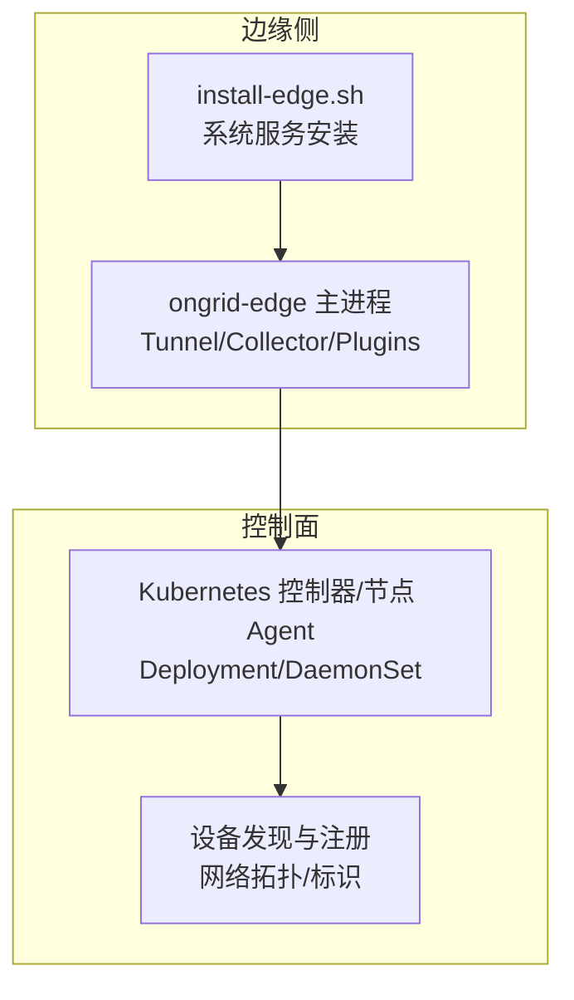
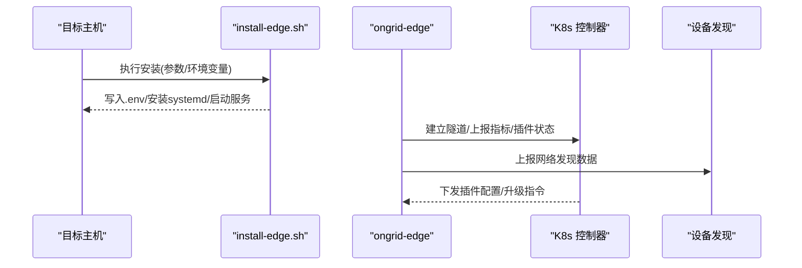
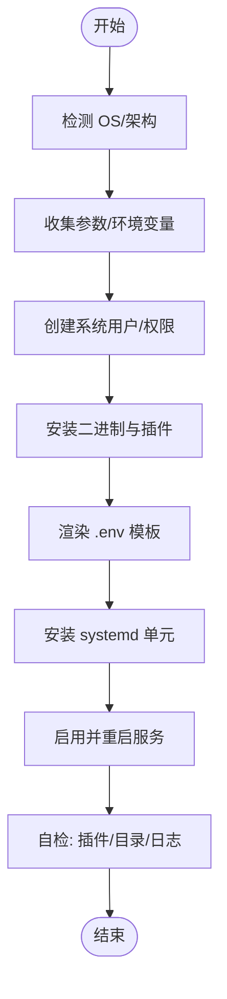
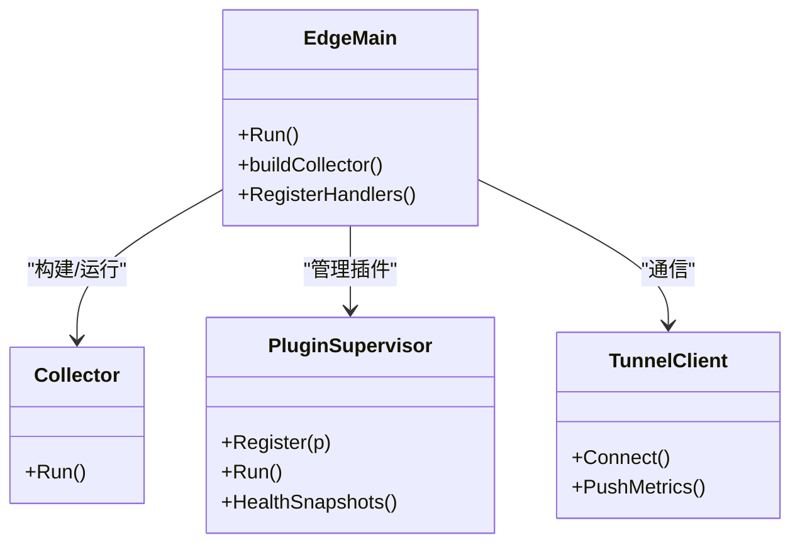
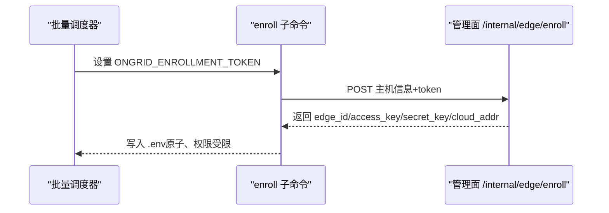
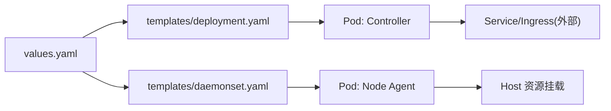
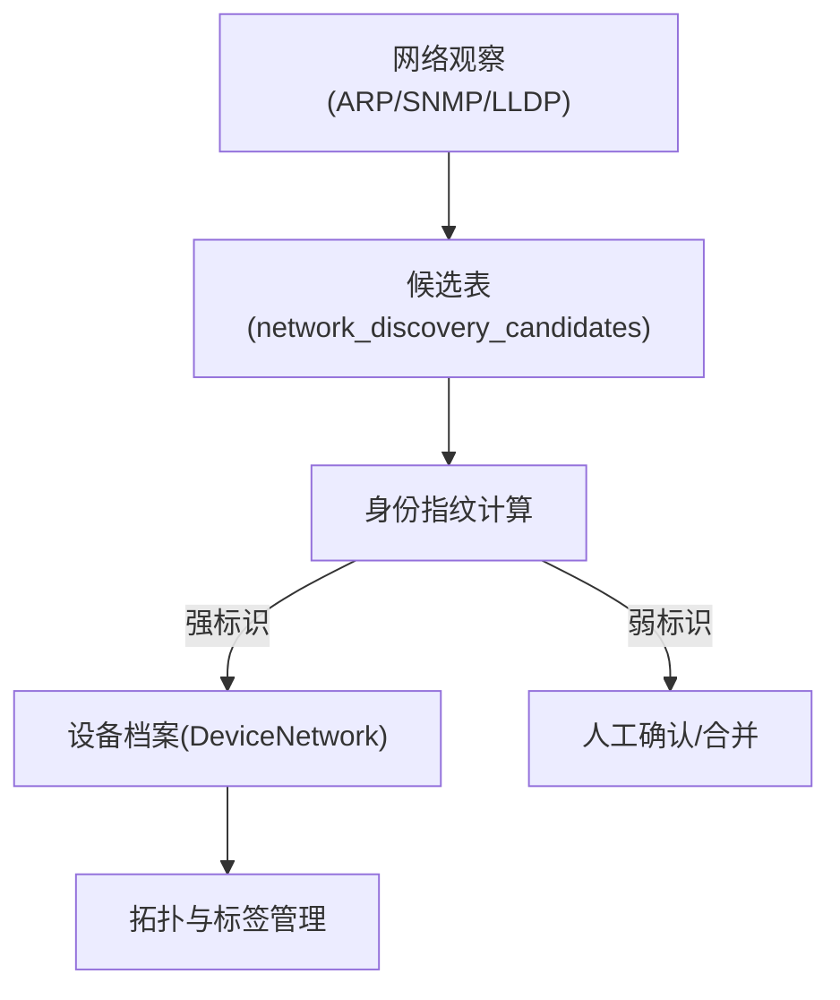
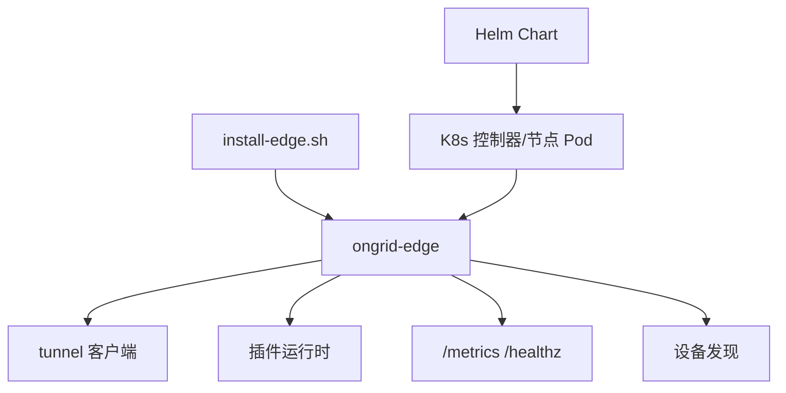

# 批量部署

<cite>
**本文引用的文件**
- [install-edge.sh](file://deploy/install/edge/install-edge.sh)
- [main.go](file://cmd/ongrid-edge/main.go)
- [enroll.go](file://cmd/ongrid-edge/enroll.go)
- [values.yaml](file://deploy/kubernetes/ongrid-edge/values.yaml)
- [daemonset.yaml](file://deploy/kubernetes/ongrid-edge/templates/daemonset.yaml)
- [deployment.yaml](file://deploy/kubernetes/ongrid-edge/templates/deployment.yaml)
- [edge.md](file://docs/install/edge.md)
- [network_discovery.go](file://internal/manager/biz/device/network_discovery.go)
- [network_discovery_test.go](file://internal/manager/biz/device/network_discovery_test.go)
- [http.go](file://internal/manager/server/device/http.go)
- [service_test.go](file://internal/manager/service/systemhealth/service_test.go)
</cite>

## 目录
1. [简介](#简介)
2. [项目结构](#项目结构)
3. [核心组件](#核心组件)
4. [架构总览](#架构总览)
5. [详细组件分析](#详细组件分析)
6. [依赖关系分析](#依赖关系分析)
7. [性能与规模化](#性能与规模化)
8. [故障排查指南](#故障排查指南)
9. [结论](#结论)
10. [附录：最佳实践清单](#附录最佳实践清单)

## 简介
本指南面向需要在大规模边缘节点上批量部署 ongrid-edge 的运维与平台团队。内容覆盖：
- 自动化安装脚本的参数、环境变量与错误处理
- 配置模板管理与变量替换（含条件渲染）
- 批量部署工具链（Helm/Kubernetes、CI/CD 集成思路）
- 设备发现与自动注册（MAC、主机名、标签）
- 分批发布、灰度与回滚策略
- 部署验证与监控（健康检查、性能基准、告警）
- 大规模优化（并行执行、资源限流、故障隔离）
- 文档生成（配置清单、变更记录、运维手册）

## 项目结构
仓库围绕“云端管理面 + 边缘代理”的双端设计，批量部署主要涉及以下路径：
- 边缘侧安装与运行：deploy/install/edge、cmd/ongrid-edge
- Kubernetes 部署：deploy/kubernetes/ongrid-edge（Helm Chart）
- 设备发现与管理：internal/manager/biz/device、internal/manager/server/device
- 文档与示例：docs/install/edge.md

图表来源
- [install-edge.sh:1-369](file://deploy/install/edge/install-edge.sh#L1-L369)
- [main.go:66-426](file://cmd/ongrid-edge/main.go#L66-L426)
- [deployment.yaml:17-193](file://deploy/kubernetes/ongrid-edge/templates/deployment.yaml#L17-L193)
- [daemonset.yaml:1-188](file://deploy/kubernetes/ongrid-edge/templates/daemonset.yaml#L1-L188)
- [network_discovery.go:82-100](file://internal/manager/biz/device/network_discovery.go#L82-L100)

章节来源
- [install-edge.sh:1-369](file://deploy/install/edge/install-edge.sh#L1-L369)
- [main.go:66-426](file://cmd/ongrid-edge/main.go#L66-L426)
- [values.yaml:1-188](file://deploy/kubernetes/ongrid-edge/values.yaml#L1-L188)
- [daemonset.yaml:1-188](file://deploy/kubernetes/ongrid-edge/templates/daemonset.yaml#L1-L188)
- [deployment.yaml:17-193](file://deploy/kubernetes/ongrid-edge/templates/deployment.yaml#L17-L193)
- [edge.md:1-119](file://docs/install/edge.md#L1-L119)

## 核心组件
- 边缘安装脚本：负责检测 OS/Arch、安装二进制、创建用户与目录、渲染环境文件、安装 systemd 单元并启动服务，内置自检与错误提示。
- 边缘主程序：加载配置、建立隧道、构建采集器、注册插件、暴露本地指标与健康接口、支持 K8s 模式与遥测网关。
- Helm Chart：定义 Controller 与 Node 两种角色，注入环境变量、Secret/ConfigMap、资源限制、升级钩子与可观测性能力。
- 设备发现：基于 ARP/SNMP/LLDP 等观察数据，聚合候选设备，形成网络拓扑与身份标识，支持强/弱标识与置信度。

章节来源
- [install-edge.sh:1-369](file://deploy/install/edge/install-edge.sh#L1-L369)
- [main.go:66-426](file://cmd/ongrid-edge/main.go#L66-L426)
- [values.yaml:1-188](file://deploy/kubernetes/ongrid-edge/values.yaml#L1-L188)
- [network_discovery.go:82-100](file://internal/manager/biz/device/network_discovery.go#L82-L100)

## 架构总览
边缘侧通过出站隧道连接控制面；在 Kubernetes 中，Controller 负责编排与遥测转发，Node DaemonSet 在每个节点运行宿主能力采集。设备发现将网络侧观察汇聚为可管理的设备资产。

图表来源
- [install-edge.sh:104-282](file://deploy/install/edge/install-edge.sh#L104-L282)
- [main.go:136-417](file://cmd/ongrid-edge/main.go#L136-L417)
- [network_discovery.go:291-307](file://internal/manager/biz/device/network_discovery.go#L291-L307)

## 详细组件分析

### 自动化安装脚本（非 K8s 批量）
- 参数与环境变量
  - 支持 --uninstall、-h/--help
  - 必填环境变量：ONGRID_CLOUD_ADDR、EDGE_ACCESS_KEY、EDGE_SECRET_KEY
  - 交互式提示缺失时补全
- 系统准备
  - 创建专用系统用户与组，加入必要日志读取组
  - 安装二进制、插件二进制、工作目录与权限
- 配置渲染
  - 基于模板文件渲染 .env，使用占位符替换
- 服务化
  - 安装 systemd 单元，启用并重启服务
  - 远程升级预切换脚本（可选）
- 自检
  - 插件二进制存在性与可执行性
  - 状态目录可写性校验
  - journald 可读性校验
  - 输出诊断信息与修复建议

图表来源
- [install-edge.sh:78-127](file://deploy/install/edge/install-edge.sh#L78-L127)
- [install-edge.sh:128-282](file://deploy/install/edge/install-edge.sh#L128-L282)
- [install-edge.sh:296-355](file://deploy/install/edge/install-edge.sh#L296-L355)

章节来源
- [install-edge.sh:1-369](file://deploy/install/edge/install-edge.sh#L1-L369)

### 边缘主程序与插件生命周期
- 启动流程
  - 解析命令行（版本/帮助）、加载配置、初始化日志与指标
  - 根据模式选择采集器（off/auto/embedded/scrape）
  - 建立隧道客户端，注册各类能力（host files、bash、operator、webshell）
  - 启动插件运行时（logs/traces/metrics/custommetrics/databasemetrics/hostmetrics/procmetrics）
  - 暴露 /metrics 与 /healthz
- 关键环境变量
  - 插件目录与工作目录、升级阶段目录、网络发现开关与间隔、K8s 相关模式与凭据等
- 健康与可观测
  - 插件健康快照上报，便于集中监控

图表来源
- [main.go:66-426](file://cmd/ongrid-edge/main.go#L66-L426)

章节来源
- [main.go:66-426](file://cmd/ongrid-edge/main.go#L66-L426)

### 批量注册与令牌机制（非 K8s）
- 通过 enrollment token 调用管理面 API，换取一次性 AccessKey/SecretKey 与 CloudAddr
- 输出安全的环境文件（原子写入、严格权限），供后续安装或容器启动使用
- 支持 TLS 校验开关与 URL 规范化

图表来源
- [enroll.go:40-141](file://cmd/ongrid-edge/enroll.go#L40-L141)
- [enroll.go:190-239](file://cmd/ongrid-edge/enroll.go#L190-L239)

章节来源
- [enroll.go:1-239](file://cmd/ongrid-edge/enroll.go#L1-L239)

### Kubernetes 批量部署（Helm）
- 角色与模式
  - controller：单副本，负责编排、遥测转发、指标抓取
  - node：DaemonSet，每个节点运行宿主能力采集
- 配置注入
  - ConfigMap/Secret 注入集群 ID、Bootstrap Token、公共 URL、隧道地址
  - 环境变量控制采集模式、指标抓取、应用发现、遥测网关等
- 资源与安全
  - 明确的 CPU/Memory 请求与限制
  - 最小权限原则（只读根文件系统、能力裁剪）
- 升级与迁移
  - Pre-upgrade Hook 保障平滑迁移
  - 控制器 Recreate 策略保证串行更新

图表来源
- [values.yaml:1-188](file://deploy/kubernetes/ongrid-edge/values.yaml#L1-L188)
- [deployment.yaml:17-193](file://deploy/kubernetes/ongrid-edge/templates/deployment.yaml#L17-L193)
- [daemonset.yaml:1-188](file://deploy/kubernetes/ongrid-edge/templates/daemonset.yaml#L1-L188)

章节来源
- [values.yaml:1-188](file://deploy/kubernetes/ongrid-edge/values.yaml#L1-L188)
- [deployment.yaml:17-193](file://deploy/kubernetes/ongrid-edge/templates/deployment.yaml#L17-L193)
- [daemonset.yaml:1-188](file://deploy/kubernetes/ongrid-edge/templates/daemonset.yaml#L1-L188)

### 设备发现与自动注册
- 数据来源：ARP、SNMP、LLDP 等网络探测
- 候选设备：记录 IP、MAC、接口、链路、来源与时间戳
- 身份聚合：优先使用强标识（如 LLDP Chassis ID、SNMP Engine ID、Bridge Base MAC），否则以候选 ID 作为指纹
- 结果展示：API 提供候选列表、关联观察者边/主机、状态与置信度

图表来源
- [network_discovery.go:505-529](file://internal/manager/biz/device/network_discovery.go#L505-L529)
- [network_discovery_test.go:114-132](file://internal/manager/biz/device/network_discovery_test.go#L114-L132)
- [http.go:606-644](file://internal/manager/server/device/http.go#L606-L644)

章节来源
- [network_discovery.go:82-100](file://internal/manager/biz/device/network_discovery.go#L82-L100)
- [network_discovery.go:291-307](file://internal/manager/biz/device/network_discovery.go#L291-L307)
- [network_discovery.go:505-529](file://internal/manager/biz/device/network_discovery.go#L505-L529)
- [network_discovery_test.go:114-132](file://internal/manager/biz/device/network_discovery_test.go#L114-L132)
- [http.go:606-644](file://internal/manager/server/device/http.go#L606-L644)

## 依赖关系分析
- 安装脚本依赖系统能力（systemd、journalctl、useradd）与目标主机上的二进制包
- 边缘主程序依赖隧道客户端、插件运行时、本地指标与健康端点
- Helm Chart 依赖 Kubernetes 对象（Deployment/DaemonSet/ConfigMap/Secret/RBAC）
- 设备发现依赖网络探测能力与存储层（候选表、设备档案）

图表来源
- [install-edge.sh:1-369](file://deploy/install/edge/install-edge.sh#L1-L369)
- [main.go:136-426](file://cmd/ongrid-edge/main.go#L136-L426)
- [deployment.yaml:17-193](file://deploy/kubernetes/ongrid-edge/templates/deployment.yaml#L17-L193)
- [daemonset.yaml:1-188](file://deploy/kubernetes/ongrid-edge/templates/daemonset.yaml#L1-L188)

章节来源
- [main.go:136-426](file://cmd/ongrid-edge/main.go#L136-L426)
- [deployment.yaml:17-193](file://deploy/kubernetes/ongrid-edge/templates/deployment.yaml#L17-L193)
- [daemonset.yaml:1-188](file://deploy/kubernetes/ongrid-edge/templates/daemonset.yaml#L1-L188)

## 性能与规模化
- 并行与限流
  - 插件与采集器通过协程与批处理并发执行，避免阻塞主循环
  - 指标推送采用批次大小与字节限制，防止拥塞
- 资源配额
  - Helm values 中明确 CPU/Memory 请求与限制，确保节点资源可控
  - 控制器单副本，避免多实例竞争
- 故障隔离
  - 插件失败不影响主进程存活，仅降级能力
  - 状态目录与日志目录独立，便于定位与清理
- 可观测性
  - 本地 /metrics 与 /healthz 便于快速自检
  - 插件健康快照上报至控制面，统一监控

章节来源
- [main.go:282-417](file://cmd/ongrid-edge/main.go#L282-L417)
- [values.yaml:21-65](file://deploy/kubernetes/ongrid-edge/values.yaml#L21-L65)
- [values.yaml:134-188](file://deploy/kubernetes/ongrid-edge/values.yaml#L134-L188)

## 故障排查指南
- 安装后自检失败
  - 插件二进制缺失：检查 bundle 是否完整，重新打包分发
  - 状态目录不可写：修正目录所有者与权限，重启服务
  - journald 不可读：将服务用户加入 systemd-journal 组，并确保持久化日志开启
- 连接问题
  - 检查 tunnel 端口与证书配置，必要时使用自签跳过校验进行调试
  - 查看 journal 日志中的隧道连接成功消息
- 健康检查
  - 通过 /healthz 快速判断进程存活
  - 控制面健康检查服务会汇总各子系统状态，辅助定位退化项

章节来源
- [install-edge.sh:296-355](file://deploy/install/edge/install-edge.sh#L296-L355)
- [edge.md:105-119](file://docs/install/edge.md#L105-L119)
- [service_test.go:98-199](file://internal/manager/service/systemhealth/service_test.go#L98-L199)

## 结论
本项目提供了从单机到 Kubernetes 的多形态批量部署能力：
- 非 K8s 场景：通过安装脚本与环境变量完成快速部署与自检
- K8s 场景：通过 Helm Chart 实现声明式部署、资源治理与平滑升级
- 设备发现：基于网络观察与强/弱标识聚合，形成可管理的设备资产
- 可观测与排障：完善的健康检查、指标与日志通道，支撑大规模运维

## 附录：最佳实践清单
- 分批发布
  - 按机房/集群/分组逐步放量，观察指标与告警后再推进下一批
- 灰度发布
  - 先小比例节点或新集群灰度，对比基线后再全量
- 回滚策略
  - 保留上一版本镜像与配置，出现问题快速回滚
  - 控制器采用串行更新，降低风险
- 配置模板
  - 使用 Helm values 管理差异配置，敏感信息走 Secret
  - 模板变更纳入版本控制与变更评审
- 监控与告警
  - 关注插件健康、指标推送延迟、错误率与资源水位
  - 对关键路径（隧道连接、插件启动）设置告警
- 文档生成
  - 自动生成配置清单（Helm values、Secret/ConfigMap 摘要）
  - 变更记录包含版本、影响范围、回滚方案
  - 运维手册包含常见故障与处置步骤