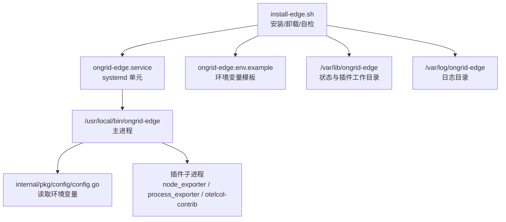
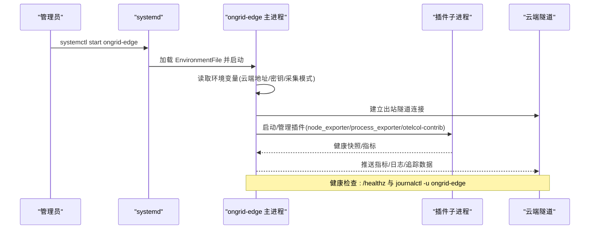
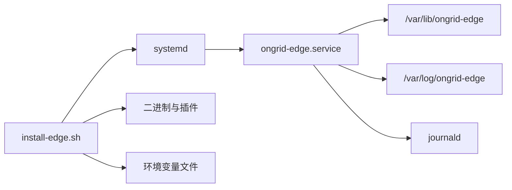

# 物理服务器部署

<cite>
**本文引用的文件**
- [install-edge.sh](file://deploy/install/edge/install-edge.sh)
- [ongrid-edge.service](file://deploy/install/edge/ongrid-edge.service)
- [ongrid-edge.env.example](file://deploy/install/edge/ongrid-edge.env.example)
- [main.go](file://cmd/ongrid-edge/main.go)
- [config.go](file://internal/pkg/config/config.go)
- [edge.md](file://docs/install/edge.md)
- [build-edge-bundle.sh](file://deploy/install/edge/build-edge-bundle.sh)
- [fetch-edge-assets.sh](file://deploy/install/edge/fetch-edge-assets.sh)
- [verify-edge-deps-archive.sh](file://deploy/install/edge/verify-edge-deps-archive.sh)
</cite>

## 目录
1. [简介](#简介)
2. [项目结构](#项目结构)
3. [核心组件](#核心组件)
4. [架构总览](#架构总览)
5. [详细组件分析](#详细组件分析)
6. [依赖关系分析](#依赖关系分析)
7. [性能考虑](#性能考虑)
8. [故障排查指南](#故障排查指南)
9. [结论](#结论)
10. [附录](#附录)

## 简介
本指南面向在物理（裸金属）服务器上部署 Ongrid Edge Agent 的运维与实施人员。内容覆盖系统依赖检查、二进制安装、systemd 服务配置、环境变量配置、网络出站要求、批量部署脚本与健康检查、日志查看与故障排查，以及性能调优建议。Edge Agent 通过“出站连接”方式与云端管理器建立隧道，无需在服务端开放入站端口。

## 项目结构
与物理服务器部署直接相关的目录与文件：
- 安装与卸载脚本：deploy/install/edge/install-edge.sh
- systemd 单元文件：deploy/install/edge/ongrid-edge.service
- 环境变量模板：deploy/install/edge/ongrid-edge.env.example
- 边缘代理主程序入口：cmd/ongrid-edge/main.go
- 运行时配置加载：internal/pkg/config/config.go
- 快速上手与验证文档：docs/install/edge.md
- 升级包构建与资产拉取：deploy/install/edge/build-edge-bundle.sh, fetch-edge-assets.sh, verify-edge-deps-archive.sh

图表来源
- [install-edge.sh:25-35](file://deploy/install/edge/install-edge.sh#L25-L35)
- [ongrid-edge.service:17-54](file://deploy/install/edge/ongrid-edge.service#L17-L54)
- [config.go:487-492](file://internal/pkg/config/config.go#L487-L492)

章节来源
- [install-edge.sh:1-369](file://deploy/install/edge/install-edge.sh#L1-L369)
- [ongrid-edge.service:1-58](file://deploy/install/edge/ongrid-edge.service#L1-L58)
- [ongrid-edge.env.example:1-37](file://deploy/install/edge/ongrid-edge.env.example#L1-L37)
- [config.go:377-412](file://internal/pkg/config/config.go#L377-L412)

## 核心组件
- 安装脚本 install-edge.sh：负责检测 OS/架构、创建运行用户、安装二进制与插件、渲染环境变量、安装并启用 systemd 单元、执行自检（插件二进制存在性、状态目录可写、journald 可读）。
- systemd 单元 ongrid-edge.service：定义启动参数、重启策略、安全沙箱、状态与日志路径、能力位等。
- 环境变量 ongrid-edge.env.example：包含云端地址、认证密钥、采集模式、采集间隔、网络发现开关、插件开关等。
- 主程序 main.go：加载配置、建立隧道、注册采集器与插件、暴露本地 /metrics 与 /healthz。
- 配置加载 config.go：从环境变量解析 Edge 相关配置项（云端地址、AccessKey/SecretKey、采集模式、采集间隔、抓取配置文件路径等）。

章节来源
- [install-edge.sh:128-281](file://deploy/install/edge/install-edge.sh#L128-L281)
- [ongrid-edge.service:17-54](file://deploy/install/edge/ongrid-edge.service#L17-L54)
- [main.go:66-159](file://cmd/ongrid-edge/main.go#L66-L159)
- [config.go:377-412](file://internal/pkg/config/config.go#L377-L412)

## 架构总览
Edge Agent 在物理主机上以 systemd 服务形式运行，使用 EnvironmentFile 注入的环境变量连接云端隧道，周期性或按需上报指标，并通过插件子系统管理 node_exporter、process_exporter、otelcol-contrib 等子进程，实现主机指标、日志、链路追踪等数据采集与上报。

图表来源
- [ongrid-edge.service:17-54](file://deploy/install/edge/ongrid-edge.service#L17-L54)
- [main.go:138-159](file://cmd/ongrid-edge/main.go#L138-L159)
- [main.go:282-290](file://cmd/ongrid-edge/main.go#L282-L290)

## 详细组件分析

### 安装流程与系统依赖检查
- 自动检测操作系统与架构，选择对应二进制；若未找到带后缀的二进制则回退到通用名称。
- 创建专用系统用户与组，并将该用户加入必要组以便读取系统日志（adm、systemd-journal）及可选 LLDP 控制套接字（_lldpd）。
- 安装主二进制与插件二进制（node_exporter、process_exporter、mysqld_exporter、postgres_exporter、redis_exporter、mongodb_exporter、otelcol-contrib），并设置权限与所有者。
- 渲染环境变量文件，将云端地址与认证密钥填入模板生成实际配置。
- 安装 systemd 单元并启用/重启服务；输出最后日志行便于快速定位问题。
- 自检：
  - 插件二进制是否存在且可执行
  - 状态目录是否对运行时用户可写（兼容旧版 systemd 的 StateDirectory= 行为差异）
  - 服务用户是否能读取 journald（确保日志采集可用）

章节来源
- [install-edge.sh:78-102](file://deploy/install/edge/install-edge.sh#L78-L102)
- [install-edge.sh:128-169](file://deploy/install/edge/install-edge.sh#L128-L169)
- [install-edge.sh:234-281](file://deploy/install/edge/install-edge.sh#L234-L281)
- [install-edge.sh:302-355](file://deploy/install/edge/install-edge.sh#L302-L355)

### systemd 服务配置详解
- 启动时机：After network-online.target，Wants network-online.target，确保网络就绪。
- 远程升级钩子：Wants/After ongrid-edge-upgrade.service，保证每次重启前应用待升级包。
- 运行身份与安全：
  - Type=simple，Restart=always，RestartSec=5
  - AmbientCapabilities=CAP_NET_ADMIN CAP_NET_RAW，NoNewPrivileges=true
  - ProtectSystem=strict，ProtectHome=true，PrivateTmp=true
  - StateDirectory=ongrid-edge，StateDirectoryMode=0755
  - ReadWritePaths=/var/lib/ongrid-edge /var/log/ongrid-edge
- 日志输出：StandardOutput=journal，StandardError=journal
- 环境变量：EnvironmentFile=/etc/ongrid-edge/ongrid-edge.env

章节来源
- [ongrid-edge.service:1-58](file://deploy/install/edge/ongrid-edge.service#L1-L58)

### 环境变量配置说明
- 云端连接与认证：
  - ONGRID_EDGE_CLOUD_ADDR：云端隧道地址
  - ONGRID_EDGE_ACCESS_KEY / ONGRID_EDGE_SECRET_KEY：设备认证密钥
- 采集模式与周期：
  - ONGRID_EDGE_COLLECTOR_MODE：off/auto/embedded/scrape（默认 off，避免重复上报）
  - ONGRID_EDGE_SCRAPE_CONFIG_FILE：抓取目标配置文件路径（scrape 模式使用）
  - ONGRID_EDGE_COLLECTOR_INTERVAL：采集间隔（默认 10s）
- 网络发现：
  - ONGRID_NETWORK_DISCOVERY_ENABLED：是否启用被动网络发现（默认 true）
  - ONGRID_NETWORK_DISCOVERY_INTERVAL：发现间隔（默认 1m）
- 插件与日志：
  - ONGRID_EDGE_PLUGIN_LOGS_ENABLED：是否启用日志插件（默认 false）
  - ONGRID_EDGE_PLUGIN_LOGS_ENDPOINT：日志推送端点
  - AUTH_USER/AUTH_PASS：日志认证（默认复用 AccessKey/SecretKey）
  - SPEC_JSON：指定采集的文件路径列表

章节来源
- [ongrid-edge.env.example:1-37](file://deploy/install/edge/ongrid-edge.env.example#L1-L37)
- [config.go:377-412](file://internal/pkg/config/config.go#L377-L412)

### 网络配置要求
- 出站 HTTPS/TCP：Edge Agent 主动拨号至云端隧道地址，无需在主机开放入站端口。
- 代理支持：如需通过 HTTP/HTTPS 代理访问外网，请在主机层面配置标准代理环境变量（例如 http_proxy/https_proxy），由底层网络栈与 curl 等工具链生效；Edge 主进程通过 Go 标准库发起连接，遵循系统代理设置。
- 防火墙规则：
  - 放行出站到云端隧道地址的 TCP 连接（默认端口 40012，具体以服务端配置为准）
  - 如启用日志/追踪直推后端，需放行相应出站端口与域名
  - 注意 conntrack 表大小与 TIME_WAIT 堆积，必要时调整 sysctl 参数

章节来源
- [edge.md:3-18](file://docs/install/edge.md#L3-L18)
- [edge.md:83-103](file://docs/install/edge.md#L83-L103)

### 批量部署与自定义模板
- 一键安装命令：从 Web UI 的设备页面生成，支持传入 access-key、secret-key、server-edge-addr、server-http-addr 等参数。
- 批量安装：通过“批量安装”功能创建安装档案，支持仅批量或绑定集群；生成的命令可在多台主机重复执行，具备一次性令牌与上限控制。
- 源码构建与打包：
  - 交叉编译 edge 二进制
  - 拉取 exporter/collector 依赖（node_exporter、process_exporter、otelcol-contrib）
  - 构建升级包：build-edge-bundle.sh 将松散二进制组装为可升级 bundle
  - 下载与校验：fetch-edge-assets.sh 与 verify-edge-deps-archive.sh 提供带校验的资产拉取与归档验证

章节来源
- [edge.md:19-38](file://docs/install/edge.md#L19-L38)
- [edge.md:40-71](file://docs/install/edge.md#L40-L71)
- [build-edge-bundle.sh:1-88](file://deploy/install/edge/build-edge-bundle.sh#L1-L88)
- [fetch-edge-assets.sh:1-150](file://deploy/install/edge/fetch-edge-assets.sh#L1-L150)
- [verify-edge-deps-archive.sh:1-138](file://deploy/install/edge/verify-edge-deps-archive.sh#L1-L138)

### 健康检查与验证
- 服务状态：systemctl status ongrid-edge
- 日志查看：journalctl -u ongrid-edge -f
- 连接成功标志：日志中出现 tunnel connected 并附带 server_addr 与 edge_id
- 本地健康接口：HTTP :9101/healthz 返回 ok；/metrics 暴露 Prometheus 指标

章节来源
- [edge.md:105-116](file://docs/install/edge.md#L105-L116)
- [main.go:282-290](file://cmd/ongrid-edge/main.go#L282-L290)

## 依赖关系分析
- 安装脚本依赖：curl/tar/sha256sum/systemd/journalctl；需要 root 权限或 sudo。
- 运行时依赖：
  - systemd >= 235 时 StateDirectory= 生效；旧版本需依赖 ReadWritePaths= 显式白名单
  - 插件二进制必须存在且可执行，否则对应功能不可用
  - journald 持久化需开启，服务用户需具备读取权限
- 外部依赖：云端隧道地址可达；如需代理，需正确配置系统代理；日志/追踪后端需可达。

图表来源
- [install-edge.sh:128-281](file://deploy/install/edge/install-edge.sh#L128-L281)
- [ongrid-edge.service:17-54](file://deploy/install/edge/ongrid-edge.service#L17-L54)

章节来源
- [install-edge.sh:296-355](file://deploy/install/edge/install-edge.sh#L296-L355)
- [ongrid-edge.service:17-54](file://deploy/install/edge/ongrid-edge.service#L17-L54)

## 性能考虑
- 内存限制：
  - 通过 systemd 的 MemoryMax/MemoryHigh 等 cgroup v2 控制器限制进程内存使用，防止 OOM 影响宿主
  - 插件子进程（node_exporter、process_exporter、otelcol-contrib）也会占用内存，建议在宿主机层面对整个 service 进行内存上限控制
- CPU 亲和性与配额：
  - 使用 cpuset.cpus 固定 CPU 核，减少上下文切换
  - 使用 cpu.max 或 cpu.weight 控制 CPU 配额与权重，避免抢占关键业务
- 网络优化：
  - 合理设置 conntrack 表大小与超时，避免短连接风暴导致表满
  - 使用连接池与 Keep-Alive 减少频繁握手
  - 对内部高吞吐流量可考虑 NOTRACK 绕过 conntrack（谨慎评估）
- 采集频率：
  - 根据负载调整 ONGRID_EDGE_COLLECTOR_INTERVAL 与抓取目标间隔，平衡实时性与资源消耗
- 日志与追踪：
  - 仅在需要时启用日志/追踪插件，避免额外 IO 与网络开销
  - 合理配置日志轮转与采样策略

章节来源
- [edge.md:83-103](file://docs/install/edge.md#L83-L103)
- [config.go:377-412](file://internal/pkg/config/config.go#L377-L412)

## 故障排查指南
- 服务无法启动：
  - 检查 EnvironmentFile 是否正确渲染，云端地址与密钥是否有效
  - 查看 journalctl -u ongrid-edge 最近日志，确认是否因配置加载失败退出
- 无数据上报：
  - 自检失败提示插件二进制缺失或状态目录不可写，按提示修复
  - 确认 journald 持久化已开启且服务用户有读取权限
- 网络连接问题：
  - 确认出站到云端隧道地址的防火墙规则已放行
  - 如使用代理，检查系统代理环境变量与证书配置
- 性能抖动：
  - 检查 conntrack 表使用率与 TIME_WAIT 堆积，必要时调整 sysctl
  - 调整采集间隔与插件开关，降低资源占用

章节来源
- [install-edge.sh:296-355](file://deploy/install/edge/install-edge.sh#L296-L355)
- [edge.md:105-116](file://docs/install/edge.md#L105-L116)

## 结论
在物理服务器上部署 Ongrid Edge Agent 的关键在于：正确的系统依赖准备、安全的 systemd 服务配置、准确的环境变量注入、稳定的出站网络连接，以及合理的性能调优。通过安装脚本的自检与日志输出，可以快速定位常见问题；结合批量部署脚本与升级包机制，可实现规模化与可维护的部署实践。

## 附录
- 常用命令参考：
  - 安装：sudo ./install-edge.sh
  - 卸载：sudo ./install-edge.sh --uninstall
  - 查看状态：systemctl status ongrid-edge
  - 查看日志：journalctl -u ongrid-edge -f
  - 健康检查：curl http://127.0.0.1:9101/healthz
- 升级流程：
  - 构建升级包：build-edge-bundle.sh <edge_dir> <version> [arch]
  - 下载并校验资产：fetch-edge-assets.sh <destination> <version> [targets...]
  - 依赖归档验证：verify-edge-deps-archive.sh <archive> <target> <release-tag> [extract-dir]

章节来源
- [install-edge.sh:39-57](file://deploy/install/edge/install-edge.sh#L39-L57)
- [build-edge-bundle.sh:18-88](file://deploy/install/edge/build-edge-bundle.sh#L18-L88)
- [fetch-edge-assets.sh:6-150](file://deploy/install/edge/fetch-edge-assets.sh#L6-L150)
- [verify-edge-deps-archive.sh:6-138](file://deploy/install/edge/verify-edge-deps-archive.sh#L6-L138)