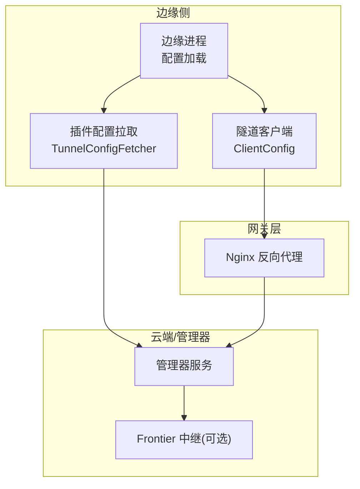
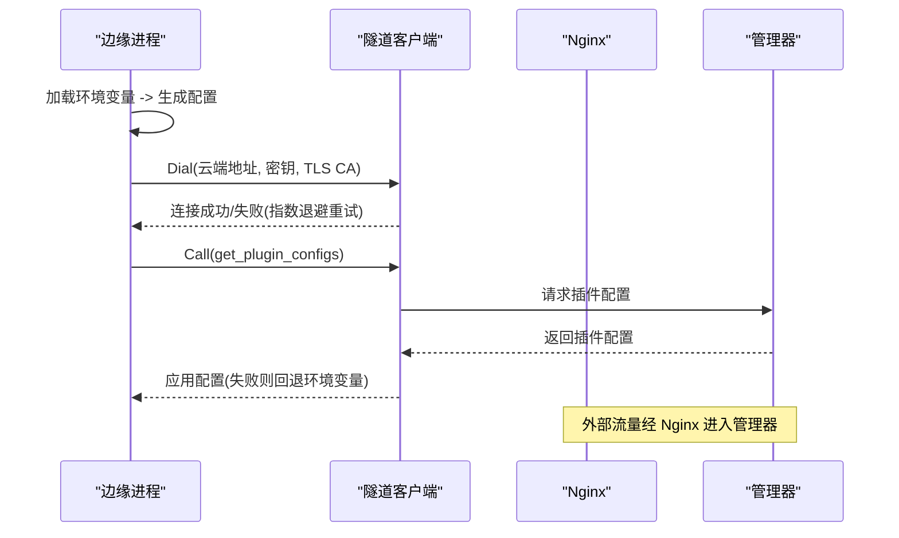
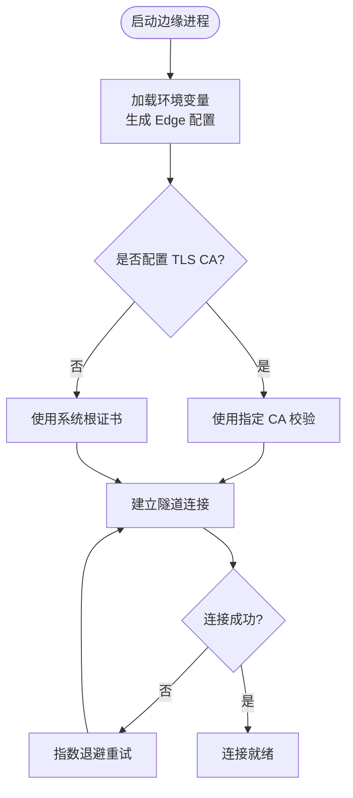
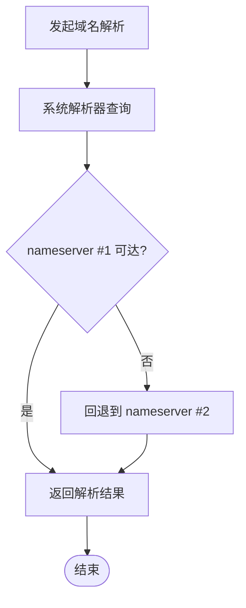
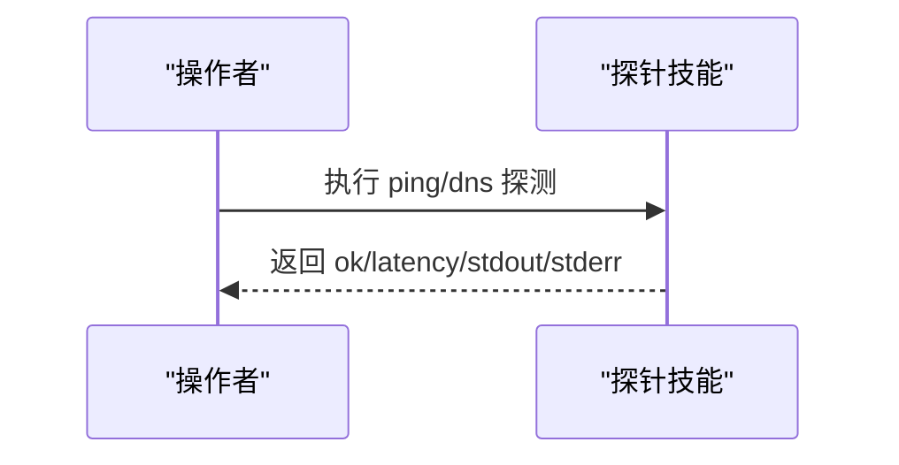
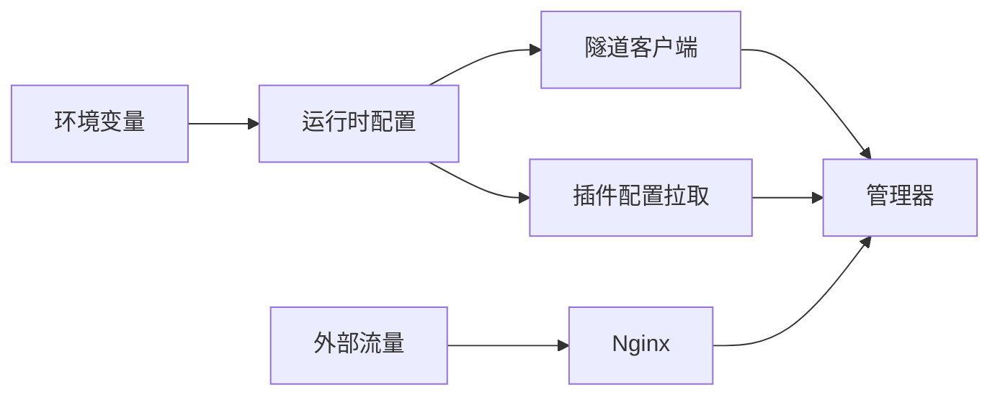

# 网络配置

<cite>
**本文引用的文件**
- [internal/pkg/config/config.go](file://internal/pkg/config/config.go)
- [internal/pkg/tunnel/types.go](file://internal/pkg/tunnel/types.go)
- [internal/edgeagent/plugins/config_tunnel.go](file://internal/edgeagent/plugins/config_tunnel.go)
- [deploy/install/edge/ongrid-edge.env.example](file://deploy/install/edge/ongrid-edge.env.example)
- [deploy/nginx/nginx.conf](file://deploy/nginx/nginx.conf)
- [internal/skill/builtin/probe_dns.go](file://internal/skill/builtin/probe_dns.go)
- [internal/skill/builtin/probe_ping.go](file://internal/skill/builtin/probe_ping.go)
- [internal/manager/biz/knowledge/builtin_vault/diagnostics/network-connectivity.md](file://internal/manager/biz/knowledge/builtin_vault/diagnostics/network-connectivity.md)
- [internal/manager/biz/knowledge/builtin_vault/diagnostics/dns-resolution-failure.md](file://internal/manager/biz/knowledge/builtin_vault/diagnostics/dns-resolution-failure.md)
- [internal/manager/biz/knowledge/builtin_vault/diagnostics/tls-handshake-failure.md](file://internal/manager/biz/knowledge/builtin_vault/diagnostics/tls-handshake-failure.md)
- [internal/manager/biz/knowledge/builtin_vault/systems/network/conntrack.md](file://internal/manager/biz/knowledge/builtin_vault/systems/network/conntrack.md)
- [internal/manager/biz/knowledge/builtin_vault/diagnostics/ephemeral-port-exhaustion.md](file://internal/manager/biz/knowledge/builtin_vault/diagnostics/ephemeral-port-exhaustion.md)
</cite>

## 目录
1. [简介](#简介)
2. [项目结构](#项目结构)
3. [核心组件](#核心组件)
4. [架构总览](#架构总览)
5. [详细组件分析](#详细组件分析)
6. [依赖关系分析](#依赖关系分析)
7. [性能考虑](#性能考虑)
8. [故障排查指南](#故障排查指南)
9. [结论](#结论)
10. [附录](#附录)

## 简介
本指南聚焦边缘代理的网络配置与运维，覆盖云端连接、代理服务器、防火墙规则、DNS 解析、网络诊断、故障排查与性能优化，并给出多网络环境适配建议。内容基于仓库中的配置加载、隧道客户端、插件配置拉取、Nginx 反向代理以及内置诊断技能等实现进行说明，帮助你在生产环境中稳定、安全地部署和排障。

## 项目结构
与网络配置直接相关的代码与配置主要分布在以下位置：
- 运行时配置加载：环境变量到配置的映射（Edge、Prom、Grafana、通知、日志/追踪查询等）
- 边缘侧隧道客户端：云端地址、认证密钥、TLS CA 配置与重连行为
- 插件配置拉取：通过隧道从管理器获取插件配置，并在离线时回退到环境变量
- Nginx 反向代理：HTTPS 入口、WebSocket 升级、超时与转发头设置
- 诊断技能：DNS 解析探测、Ping 连通性探测
- 知识库文档：网络连通性、DNS、TLS、conntrack、端口耗尽等排障指引

图表来源
- [internal/pkg/config/config.go:377-412](file://internal/pkg/config/config.go#L377-L412)
- [internal/pkg/tunnel/types.go:33-66](file://internal/pkg/tunnel/types.go#L33-L66)
- [internal/edgeagent/plugins/config_tunnel.go:18-98](file://internal/edgeagent/plugins/config_tunnel.go#L18-L98)
- [deploy/nginx/nginx.conf:63-153](file://deploy/nginx/nginx.conf#L63-L153)

章节来源
- [internal/pkg/config/config.go:377-412](file://internal/pkg/config/config.go#L377-L412)
- [internal/pkg/tunnel/types.go:33-66](file://internal/pkg/tunnel/types.go#L33-L66)
- [internal/edgeagent/plugins/config_tunnel.go:18-98](file://internal/edgeagent/plugins/config_tunnel.go#L18-L98)
- [deploy/nginx/nginx.conf:63-153](file://deploy/nginx/nginx.conf#L63-L153)

## 核心组件
- 边缘侧运行时配置：通过环境变量加载 Edge 相关参数（云端地址、访问密钥、采集模式、抓取间隔等），并提供默认值与开关控制。
- 隧道客户端配置：定义云端端点、兼容旧字段、认证密钥、TLS CA 文件及日志；提供重连、注册处理器、调用 RPC、接受流式通道等能力。
- 插件配置拉取：优先通过隧道从管理器拉取插件配置，失败时回退到环境变量快照；在 Kubernetes 场景下自动注入默认值（如日志/追踪端点、集群/节点标签等）。
- Nginx 反向代理：统一 HTTPS 入口，处理 WebSocket 升级、内部私有回调路径、超时与转发头设置。
- 诊断技能：提供 DNS 解析与 Ping 探测，便于快速验证连通性与解析延迟。

章节来源
- [internal/pkg/config/config.go:417-548](file://internal/pkg/config/config.go#L417-L548)
- [internal/pkg/tunnel/types.go:33-105](file://internal/pkg/tunnel/types.go#L33-L105)
- [internal/edgeagent/plugins/config_tunnel.go:100-186](file://internal/edgeagent/plugins/config_tunnel.go#L100-L186)
- [deploy/nginx/nginx.conf:63-153](file://deploy/nginx/nginx.conf#L63-L153)
- [internal/skill/builtin/probe_dns.go:15-84](file://internal/skill/builtin/probe_dns.go#L15-L84)
- [internal/skill/builtin/probe_ping.go:14-125](file://internal/skill/builtin/probe_ping.go#L14-L125)

## 架构总览
边缘进程启动后读取环境变量生成运行时配置，建立到云端的隧道连接；同时通过隧道或环境变量获取插件配置，驱动日志、指标、追踪等数据面插件。外部流量经 Nginx 进入管理器，支持 WebSocket 长连接与私有回调路径。

图表来源
- [internal/pkg/config/config.go:417-548](file://internal/pkg/config/config.go#L417-L548)
- [internal/pkg/tunnel/types.go:68-105](file://internal/pkg/tunnel/types.go#L68-L105)
- [internal/edgeagent/plugins/config_tunnel.go:100-186](file://internal/edgeagent/plugins/config_tunnel.go#L100-L186)
- [deploy/nginx/nginx.conf:63-153](file://deploy/nginx/nginx.conf#L63-L153)

## 详细组件分析

### 云端连接配置（CloudAddr、TLS、超时）
- 云端地址
  - 使用 Edge 配置中的云端地址字段；若存在新旧双字段，优先采用新字段。
  - 环境变量示例包含云端地址、访问密钥与密钥。
- TLS 证书
  - 支持指定 CA 文件用于校验服务端证书；若未指定则使用系统根证书。
  - 在部分集成中可通过“跳过 TLS 校验”选项临时绕过（仅用于自签测试环境）。
- 连接超时与重试
  - 隧道客户端具备指数退避的重连机制；首次拨号成功后保持连接，断线由底层透明处理。
  - Nginx 对上游的 connect/send/read 超时分别设置，以适配不同业务场景（例如 WebSocket 长连接需较长 read/send 超时）。

图表来源
- [internal/pkg/config/config.go:487-492](file://internal/pkg/config/config.go#L487-L492)
- [internal/pkg/tunnel/types.go:33-66](file://internal/pkg/tunnel/types.go#L33-L66)
- [deploy/nginx/nginx.conf:140-153](file://deploy/nginx/nginx.conf#L140-L153)

章节来源
- [internal/pkg/config/config.go:487-492](file://internal/pkg/config/config.go#L487-L492)
- [internal/pkg/tunnel/types.go:33-66](file://internal/pkg/tunnel/types.go#L33-L66)
- [deploy/nginx/nginx.conf:140-153](file://deploy/nginx/nginx.conf#L140-L153)
- [deploy/install/edge/ongrid-edge.env.example:7-12](file://deploy/install/edge/ongrid-edge.env.example#L7-L12)

### 代理服务器支持（HTTP/HTTPS、SOCKS5、认证）
- HTTP/HTTPS 代理
  - 当前仓库未显式暴露通用 HTTP/HTTPS 代理环境变量；如需通过代理出站，建议在容器/主机层面配置系统级代理或使用网络命名空间隔离。
- SOCKS5 代理
  - 未在代码中发现 SOCKS5 代理配置项；如需支持，可在宿主网络栈或容器运行时注入代理能力。
- 认证配置
  - 数据面插件的 Basic 认证用户/密码可从环境变量注入，或在 Kubernetes 场景中结合隧道下发的配置与默认值。
  - 管理器对外暴露的 Web 接口通常位于 Nginx 之后，由 Nginx 或上层鉴权中间件保护。

章节来源
- [internal/edgeagent/plugins/config_tunnel.go:68-98](file://internal/edgeagent/plugins/config_tunnel.go#L68-L98)
- [internal/edgeagent/plugins/config_tunnel.go:246-363](file://internal/edgeagent/plugins/config_tunnel.go#L246-L363)
- [deploy/nginx/nginx.conf:63-153](file://deploy/nginx/nginx.conf#L63-L153)

### 防火墙规则配置（出站端口、IP 白名单、网络安全组）
- 出站端口开放
  - 边缘需能访问云端隧道端口（通常为 TCP 443 或自定义端口），确保防火墙放行。
  - Nginx 监听 443（HTTPS）与内部 8081（私有回调），需在主机/云安全组放行对应入站端口。
- IP 白名单
  - 若管理器前置了 WAF/网关，可结合其白名单策略限制来源 IP。
- 网络安全组
  - 在云平台中为边缘实例与管理器实例配置安全组规则，最小化暴露面。

章节来源
- [deploy/nginx/nginx.conf:63-153](file://deploy/nginx/nginx.conf#L63-L153)
- [internal/manager/biz/knowledge/builtin_vault/systems/network/conntrack.md:6-47](file://internal/manager/biz/knowledge/builtin_vault/systems/network/conntrack.md#L6-L47)

### DNS 解析配置（自定义 DNS、域名解析、重试策略）
- 自定义 DNS 服务器
  - 通过 /etc/resolv.conf 或系统解析器配置 nameserver、search 域与 ndots 选项。
- 域名解析
  - 使用系统解析器进行 A/AAAA 记录查询；可通过内置技能 probe_dns 测量解析延迟与结果。
- 重试策略
  - 解析失败时，常见表现为首个上游不可达导致 ~5s 等待后回退到第二个上游；合理调整 upstream 顺序与超时可减少抖动。

图表来源
- [internal/skill/builtin/probe_dns.go:15-84](file://internal/skill/builtin/probe_dns.go#L15-L84)
- [internal/manager/biz/knowledge/builtin_vault/diagnostics/dns-resolution-failure.md:16-61](file://internal/manager/biz/knowledge/builtin_vault/diagnostics/dns-resolution-failure.md#L16-L61)

章节来源
- [internal/skill/builtin/probe_dns.go:15-84](file://internal/skill/builtin/probe_dns.go#L15-L84)
- [internal/manager/biz/knowledge/builtin_vault/diagnostics/dns-resolution-failure.md:16-61](file://internal/manager/biz/knowledge/builtin_vault/diagnostics/dns-resolution-failure.md#L16-L61)

### 网络诊断工具与方法（连通性、延迟、带宽）
- 连通性测试
  - 使用 Ping 技能发送 ICMP 探测，返回成功与否、耗时与原始输出。
  - 使用 DNS 技能解析目标主机，评估解析延迟与错误信息。
- 延迟测量
  - DNS 技能返回解析耗时；Ping 技能返回整体往返耗时。
- 带宽监控
  - 可结合系统工具（如 tc、ethtool）与队列统计观察丢包与拥塞情况。

图表来源
- [internal/skill/builtin/probe_ping.go:14-125](file://internal/skill/builtin/probe_ping.go#L14-L125)
- [internal/skill/builtin/probe_dns.go:15-84](file://internal/skill/builtin/probe_dns.go#L15-L84)

章节来源
- [internal/skill/builtin/probe_ping.go:14-125](file://internal/skill/builtin/probe_ping.go#L14-L125)
- [internal/skill/builtin/probe_dns.go:15-84](file://internal/skill/builtin/probe_dns.go#L15-L84)
- [internal/manager/biz/knowledge/builtin_vault/diagnostics/network-connectivity.md:13-91](file://internal/manager/biz/knowledge/builtin_vault/diagnostics/network-connectivity.md#L13-L91)

### 网络故障排查（连接失败、超时、证书问题）
- 连接失败
  - 检查物理链路、路由表、邻居表与防火墙规则；关注 conntrack 表是否打满。
- 超时错误
  - 区分 DNS、TCP/TLS、应用层超时；Nginx 已对不同路径设置合理的 connect/send/read 超时。
- 证书验证问题
  - 检查证书链完整性、SNI/CN/SAN、协议与密码套件协商；必要时启用“跳过 TLS 校验”用于自签调试。

章节来源
- [internal/manager/biz/knowledge/builtin_vault/diagnostics/network-connectivity.md:13-91](file://internal/manager/biz/knowledge/builtin_vault/diagnostics/network-connectivity.md#L13-L91)
- [internal/manager/biz/knowledge/builtin_vault/diagnostics/tls-handshake-failure.md:8-87](file://internal/manager/biz/knowledge/builtin_vault/diagnostics/tls-handshake-failure.md#L8-L87)
- [deploy/nginx/nginx.conf:140-153](file://deploy/nginx/nginx.conf#L140-L153)

### 网络性能优化（连接池、并发、流量控制）
- 连接池与复用
  - 使用连接复用与 keep-alive 减少短连接带来的 TIME_WAIT 堆积与端口耗尽风险。
- 并发限制
  - 合理设置每实例最大连接数，避免超过后端服务上限；在高并发场景下引入连接代理（如 PgBouncer/ProxySQL）进行连接复用。
- 流量控制
  - 通过 qdisc、tc 与内核参数（如 tcp_tw_reuse）缓解端口耗尽；在 NAT/LB 后注意 SNAT 端口范围与源 IP 数量。

章节来源
- [internal/manager/biz/knowledge/builtin_vault/diagnostics/ephemeral-port-exhaustion.md:45-79](file://internal/manager/biz/knowledge/builtin_vault/diagnostics/ephemeral-port-exhaustion.md#L45-L79)
- [internal/manager/biz/knowledge/builtin_vault/systems/network/conntrack.md:6-47](file://internal/manager/biz/knowledge/builtin_vault/systems/network/conntrack.md#L6-L47)

### 多网络环境适配（内网穿透、VPN 隧道、负载均衡）
- 内网穿透
  - 通过隧道客户端建立到云端的长连接，规避复杂 NAT 与防火墙限制。
- VPN 隧道
  - 在边缘侧接入企业 VPN 后，确保 DNS、路由与证书信任链正确；必要时调整 resolv.conf 与 CA 配置。
- 负载均衡
  - 管理器前可放置 LB，将 443 流量分发至多个管理器实例；注意会话保持与 WebSocket 升级头透传。

章节来源
- [internal/pkg/tunnel/types.go:68-105](file://internal/pkg/tunnel/types.go#L68-L105)
- [deploy/nginx/nginx.conf:140-153](file://deploy/nginx/nginx.conf#L140-L153)

## 依赖关系分析
- 配置加载依赖环境变量；Edge 配置影响隧道客户端与插件配置拉取。
- 插件配置拉取依赖隧道客户端；当隧道不可用时回退到环境变量快照。
- Nginx 作为统一入口，负责 HTTPS、WebSocket 与超时控制，将流量转发至管理器。

图表来源
- [internal/pkg/config/config.go:417-548](file://internal/pkg/config/config.go#L417-L548)
- [internal/edgeagent/plugins/config_tunnel.go:100-186](file://internal/edgeagent/plugins/config_tunnel.go#L100-L186)
- [deploy/nginx/nginx.conf:63-153](file://deploy/nginx/nginx.conf#L63-L153)

章节来源
- [internal/pkg/config/config.go:417-548](file://internal/pkg/config/config.go#L417-L548)
- [internal/edgeagent/plugins/config_tunnel.go:100-186](file://internal/edgeagent/plugins/config_tunnel.go#L100-L186)
- [deploy/nginx/nginx.conf:63-153](file://deploy/nginx/nginx.conf#L63-L153)

## 性能考虑
- 连接复用与 Keep-Alive：减少短连接导致的 TIME_WAIT 与端口耗尽。
- 合理设置超时：根据业务特性调整 connect/send/read 超时，避免长连接被误杀。
- 资源上限：关注 conntrack 表大小、文件描述符与端口范围，避免在高并发下成为瓶颈。
- 缓存与降级：插件配置拉取失败时使用缓存与环境变量快照，保障基本运行。

[本节为通用指导，不直接分析具体文件]

## 故障排查指南
- 连通性问题：按链路自底向上检查 NIC、路由、DNS、TCP/TLS、防火墙与 conntrack。
- DNS 问题：检查 resolv.conf、upstream nameserver 可达性与缓存状态；关注 ndots 与 search 域导致的多次查询。
- TLS 问题：检查证书链、SNI/CN/SAN、协议与密码套件；必要时启用“跳过 TLS 校验”用于自签调试。
- 端口耗尽：启用连接复用与 tcp_tw_reuse；在 NAT/LB 后增加源 IP 或扩大 SNAT 端口范围。

章节来源
- [internal/manager/biz/knowledge/builtin_vault/diagnostics/network-connectivity.md:13-91](file://internal/manager/biz/knowledge/builtin_vault/diagnostics/network-connectivity.md#L13-L91)
- [internal/manager/biz/knowledge/builtin_vault/diagnostics/dns-resolution-failure.md:16-61](file://internal/manager/biz/knowledge/builtin_vault/diagnostics/dns-resolution-failure.md#L16-L61)
- [internal/manager/biz/knowledge/builtin_vault/diagnostics/tls-handshake-failure.md:8-87](file://internal/manager/biz/knowledge/builtin_vault/diagnostics/tls-handshake-failure.md#L8-L87)
- [internal/manager/biz/knowledge/builtin_vault/diagnostics/ephemeral-port-exhaustion.md:45-79](file://internal/manager/biz/knowledge/builtin_vault/diagnostics/ephemeral-port-exhaustion.md#L45-L79)

## 结论
通过环境变量驱动的运行时配置、稳定的隧道客户端与健壮的插件配置拉取机制，配合 Nginx 的统一入口与超时控制，本项目提供了完整的边缘代理网络能力。在生产环境中，应重点关注云端地址与 TLS 配置、防火墙与安全组、DNS 解析稳定性与连接复用策略，并结合内置诊断技能与知识库文档进行快速定位与修复。

[本节为总结，不直接分析具体文件]

## 附录
- 环境变量参考：边缘侧安装示例中包含云端地址、访问密钥、采集模式与抓取间隔等关键项。
- Nginx 配置要点：HTTPS 入口、WebSocket 升级、私有回调路径与超时设置。
- 诊断技能：DNS 解析与 Ping 探测，便于快速验证连通性与解析延迟。

章节来源
- [deploy/install/edge/ongrid-edge.env.example:7-12](file://deploy/install/edge/ongrid-edge.env.example#L7-L12)
- [deploy/nginx/nginx.conf:63-153](file://deploy/nginx/nginx.conf#L63-L153)
- [internal/skill/builtin/probe_dns.go:15-84](file://internal/skill/builtin/probe_dns.go#L15-L84)
- [internal/skill/builtin/probe_ping.go:14-125](file://internal/skill/builtin/probe_ping.go#L14-L125)