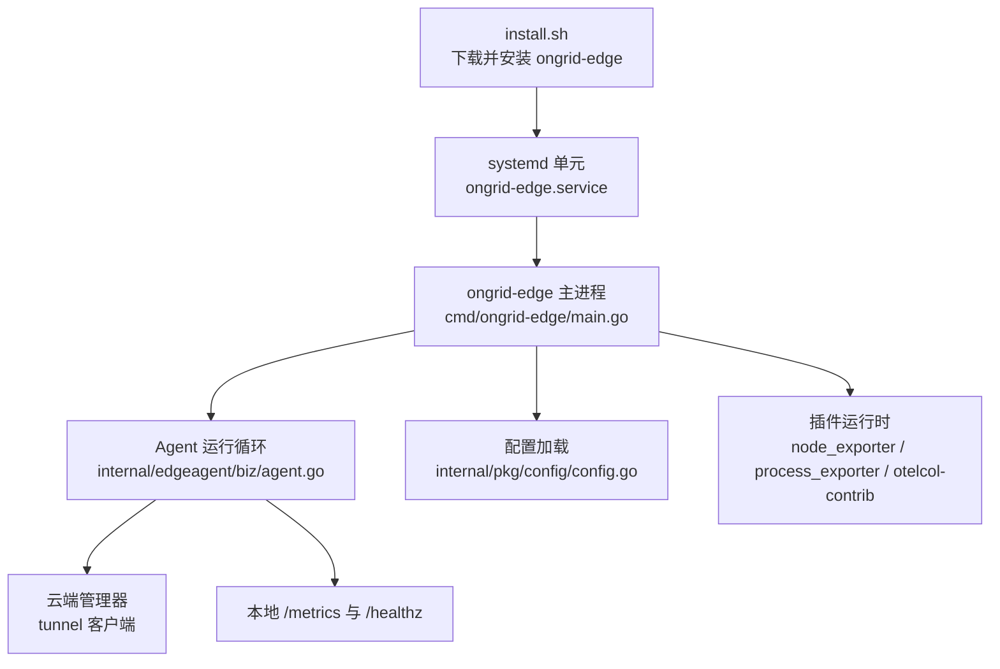
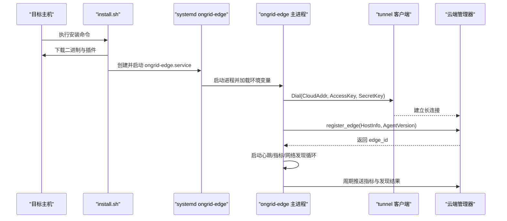
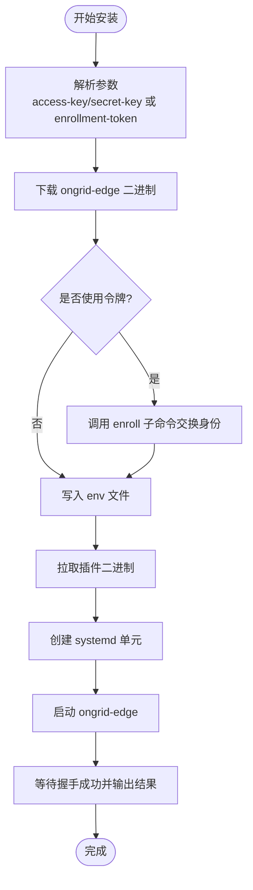
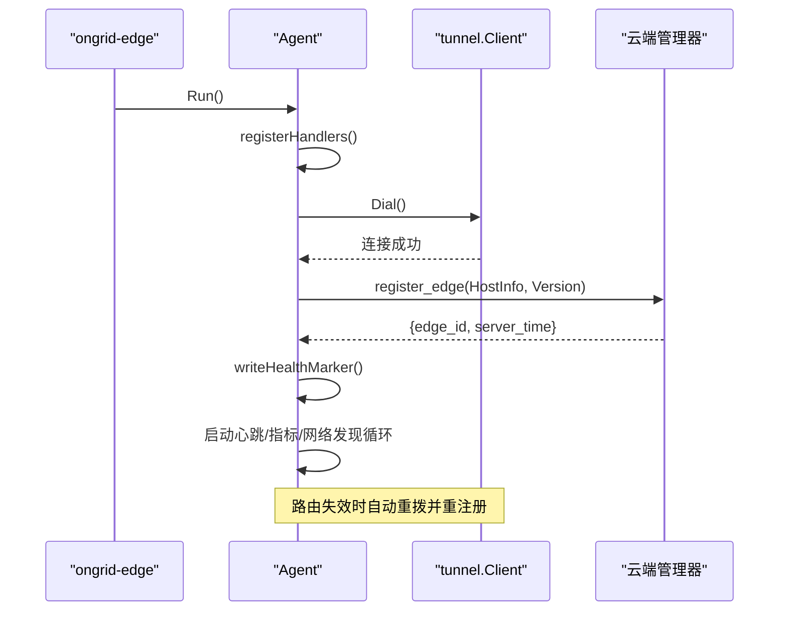
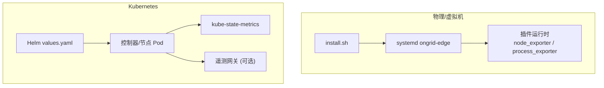
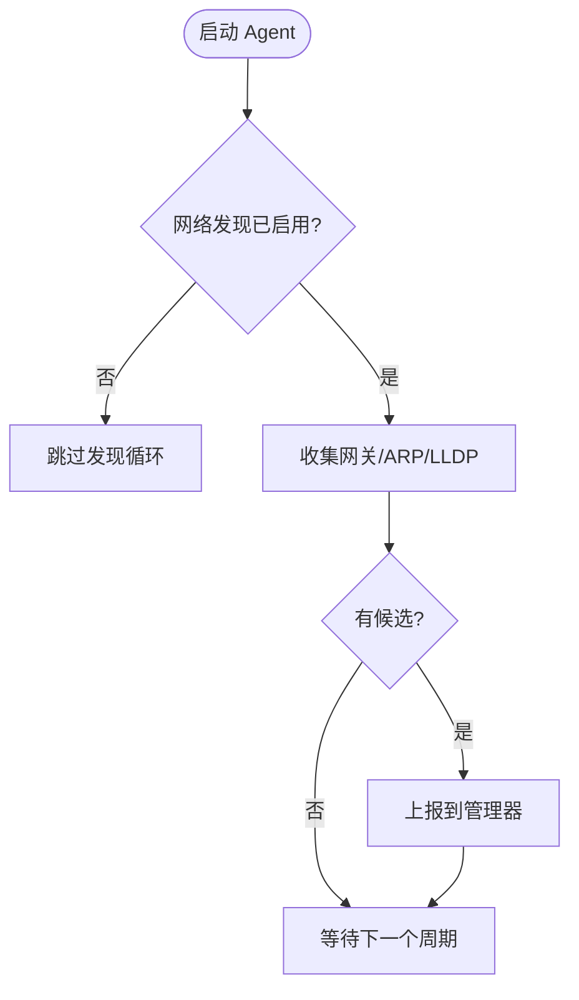
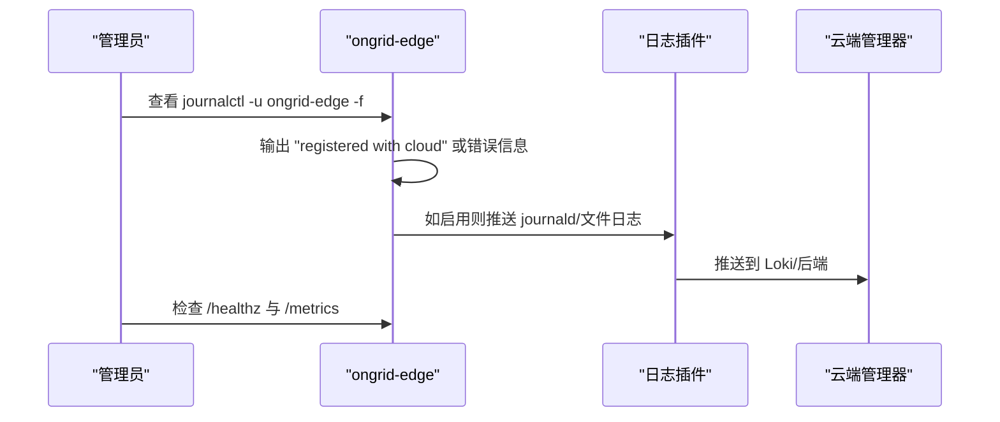
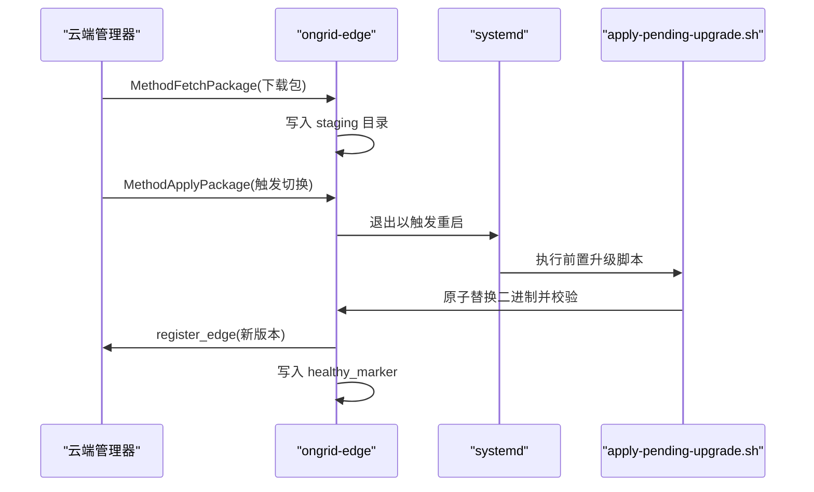
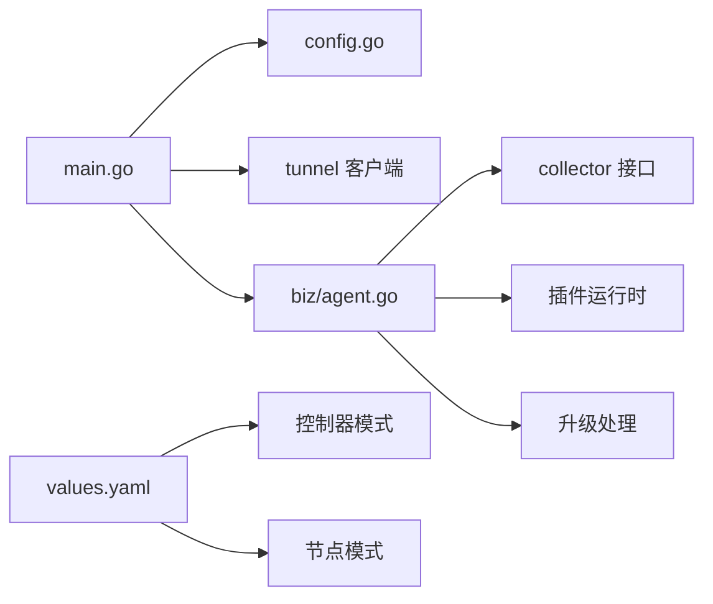

# 边缘代理部署

<cite>
**本文引用的文件**
- [cmd/ongrid-edge/main.go](file://cmd/ongrid-edge/main.go)
- [internal/edgeagent/biz/agent.go](file://internal/edgeagent/biz/agent.go)
- [internal/pkg/config/config.go](file://internal/pkg/config/config.go)
- [deploy/install/edge/install.sh](file://deploy/install/edge/install.sh)
- [deploy/install/edge/ongrid-edge.env.example](file://deploy/install/edge/ongrid-edge.env.example)
- [deploy/kubernetes/ongrid-edge/values.yaml](file://deploy/kubernetes/ongrid-edge/values.yaml)
- [docs/install/edge.md](file://docs/install/edge.md)
</cite>

## 目录
1. [简介](#简介)
2. [项目结构](#项目结构)
3. [核心组件](#核心组件)
4. [架构总览](#架构总览)
5. [详细组件分析](#详细组件分析)
6. [依赖关系分析](#依赖关系分析)
7. [性能与资源调优](#性能与资源调优)
8. [故障诊断与排错](#故障诊断与排错)
9. [升级流程与版本管理](#升级流程与版本管理)
10. [结论](#结论)

## 简介
本指南面向需要在物理服务器、虚拟机和容器化环境中部署 Ongrid 边缘代理（Edge Agent）的运维与平台工程团队。文档覆盖安装与初始配置、与云端管理器的连接建立与认证、网络出站要求与代理支持、设备发现与拓扑收集、批量部署最佳实践、健康检查与日志采集、升级流程与版本管理，以及性能调优与资源限制建议。所有说明均基于仓库中的源码与部署脚本实现。

## 项目结构
- 边缘代理二进制入口位于 cmd/ongrid-edge/main.go，负责加载配置、建立隧道、注册能力、启动采集与插件运行时。
- 业务运行循环在 internal/edgeagent/biz/agent.go，包含心跳、指标上报、网络发现、远程升级等核心逻辑。
- 配置读取集中在 internal/pkg/config/config.go，通过环境变量注入 Edge 相关参数。
- 安装脚本 deploy/install/edge/install.sh 提供一键安装、服务管理、插件二进制拉取与自检。
- Kubernetes 部署使用 Helm Chart values.yaml，定义节点/控制器模式、遥测网关、资源配额等。
- 官方安装文档 docs/install/edge.md 给出快速开始、批量安装与验证步骤。

**图表来源**
- [cmd/ongrid-edge/main.go:66-144](file://cmd/ongrid-edge/main.go#L66-L144)
- [internal/edgeagent/biz/agent.go:186-271](file://internal/edgeagent/biz/agent.go#L186-L271)
- [internal/pkg/config/config.go:377-412](file://internal/pkg/config/config.go#L377-L412)
- [deploy/install/edge/install.sh:334-405](file://deploy/install/edge/install.sh#L334-L405)

**章节来源**
- [cmd/ongrid-edge/main.go:66-144](file://cmd/ongrid-edge/main.go#L66-L144)
- [internal/edgeagent/biz/agent.go:186-271](file://internal/edgeagent/biz/agent.go#L186-L271)
- [internal/pkg/config/config.go:377-412](file://internal/pkg/config/config.go#L377-L412)
- [deploy/install/edge/install.sh:334-405](file://deploy/install/edge/install.sh#L334-L405)

## 核心组件
- 边缘代理主进程：负责隧道连接、能力注册、采集调度、插件生命周期管理、本地指标与健康端点。
- Agent 运行循环：心跳、指标推送、网络发现、远程升级信号处理。
- 配置系统：通过环境变量加载 Edge 相关设置，包括云地址、访问密钥、采集模式与间隔。
- 安装器：自动下载二进制、安装 systemd 单元、拉取插件二进制、写入环境文件、执行自检。
- Kubernetes 适配：Helm Chart 定义节点/控制器模式、遥测网关、kube-state-metrics、资源限制与扩缩容策略。

**章节来源**
- [cmd/ongrid-edge/main.go:66-144](file://cmd/ongrid-edge/main.go#L66-L144)
- [internal/edgeagent/biz/agent.go:186-271](file://internal/edgeagent/biz/agent.go#L186-L271)
- [internal/pkg/config/config.go:377-412](file://internal/pkg/config/config.go#L377-L412)
- [deploy/install/edge/install.sh:164-263](file://deploy/install/edge/install.sh#L164-L263)
- [deploy/kubernetes/ongrid-edge/values.yaml:1-188](file://deploy/kubernetes/ongrid-edge/values.yaml#L1-L188)

## 架构总览
边缘代理以“出站拨号”的方式连接云端管理器，无需在主机开放入站端口。安装后由 systemd 管理，周期性向云端发送心跳与指标，并通过插件运行时采集主机与进程指标、日志与追踪。Kubernetes 模式下可启用控制器与节点两种角色，支持集群清单同步与应用指标发现。

**图表来源**
- [deploy/install/edge/install.sh:164-263](file://deploy/install/edge/install.sh#L164-L263)
- [deploy/install/edge/install.sh:334-405](file://deploy/install/edge/install.sh#L334-L405)
- [cmd/ongrid-edge/main.go:136-144](file://cmd/ongrid-edge/main.go#L136-L144)
- [internal/edgeagent/biz/agent.go:186-271](file://internal/edgeagent/biz/agent.go#L186-L271)

## 详细组件分析

### 安装与初始配置
- 安装方式：通过 install.sh 从管理器的 HTTP 端点下载 ongrid-edge 二进制与插件二进制，创建 systemd 单元与环境文件，启动服务并等待握手成功。
- 认证配置：支持两种方式
  - 直接传入 access-key 与 secret-key。
  - 使用一次性 enrollment-token 换取独立身份（推荐用于批量部署）。
- 环境变量：安装器将 CloudAddr、AccessKey、SecretKey 写入 /etc/ongrid-edge/ongrid-edge.env；也可参考示例文件进行扩展配置。
- 插件二进制：自动拉取 node_exporter、process_exporter、otelcol-contrib 及数据库导出器，缺失会告警但不会阻止安装。

**图表来源**
- [deploy/install/edge/install.sh:78-147](file://deploy/install/edge/install.sh#L78-L147)
- [deploy/install/edge/install.sh:164-263](file://deploy/install/edge/install.sh#L164-L263)
- [deploy/install/edge/install.sh:334-405](file://deploy/install/edge/install.sh#L334-L405)
- [deploy/install/edge/install.sh:407-562](file://deploy/install/edge/install.sh#L407-L562)

**章节来源**
- [deploy/install/edge/install.sh:78-147](file://deploy/install/edge/install.sh#L78-L147)
- [deploy/install/edge/install.sh:164-263](file://deploy/install/edge/install.sh#L164-L263)
- [deploy/install/edge/install.sh:334-405](file://deploy/install/edge/install.sh#L334-L405)
- [deploy/install/edge/install.sh:407-562](file://deploy/install/edge/install.sh#L407-L562)
- [deploy/install/edge/ongrid-edge.env.example:1-37](file://deploy/install/edge/ongrid-edge.env.example#L1-L37)

### 与云端管理器的连接与认证
- 连接建立：主进程构造 tunnel.Client，使用 CloudAddr、AccessKey、SecretKey 建立长连接。
- 注册流程：Agent.Run 中先注册处理器，再 Dial，随后调用 register_edge 获取 edge_id，成功后写入健康标记。
- 重连机制：tunnel 层在路由失效时自动重拨，并在重连回调中重新注册 edge，保证会话一致性。
- 失败处理：register_edge 失败会记录警告并继续尝试；心跳循环在连续失败达到阈值时判定为卡死。

**图表来源**
- [cmd/ongrid-edge/main.go:136-144](file://cmd/ongrid-edge/main.go#L136-L144)
- [internal/edgeagent/biz/agent.go:186-271](file://internal/edgeagent/biz/agent.go#L186-L271)
- [internal/edgeagent/biz/agent.go:480-510](file://internal/edgeagent/biz/agent.go#L480-L510)
- [internal/edgeagent/biz/agent.go:530-602](file://internal/edgeagent/biz/agent.go#L530-L602)

**章节来源**
- [cmd/ongrid-edge/main.go:136-144](file://cmd/ongrid-edge/main.go#L136-L144)
- [internal/edgeagent/biz/agent.go:186-271](file://internal/edgeagent/biz/agent.go#L186-L271)
- [internal/edgeagent/biz/agent.go:480-510](file://internal/edgeagent/biz/agent.go#L480-L510)
- [internal/edgeagent/biz/agent.go:530-602](file://internal/edgeagent/biz/agent.go#L530-L602)

### 不同部署环境的适配
- 物理服务器/虚拟机：使用 install.sh 安装，systemd 管理进程，默认采集模式为 off（避免重复推送），通过插件运行时暴露 node_* 与进程指标。
- Kubernetes：
  - 节点模式：作为 DaemonSet 运行，collectorMode=off，复用宿主指标能力。
  - 控制器模式：启用集群清单同步与应用指标发现，支持遥测网关。
  - 资源限制：values.yaml 定义 CPU/内存请求与限制，HPA 基于 CPU/内存目标值自动扩缩容。
  - kube-state-metrics：默认启用，端口与镜像可配置。

**图表来源**
- [deploy/install/edge/install.sh:334-405](file://deploy/install/edge/install.sh#L334-L405)
- [deploy/kubernetes/ongrid-edge/values.yaml:1-188](file://deploy/kubernetes/ongrid-edge/values.yaml#L1-L188)

**章节来源**
- [deploy/install/edge/install.sh:334-405](file://deploy/install/edge/install.sh#L334-L405)
- [deploy/kubernetes/ongrid-edge/values.yaml:1-188](file://deploy/kubernetes/ongrid-edge/values.yaml#L1-L188)

### 网络配置要求
- 出站连接：边缘代理主动拨号至管理器的隧道端点（默认端口 40012），无需在主机开放入站端口。
- TLS：HTTP 端点（nginx）处理 TLS 终止；隧道端口使用明文 TCP，无需配置 CA。
- 同机部署：若控制面与边缘在同一主机，应使用 127.0.0.1 以避免 hairpin NAT 问题。
- 代理服务器：安装脚本未内置代理参数；如需代理，请在宿主机网络栈或容器运行时层面配置出站代理。

**章节来源**
- [docs/install/edge.md:81-103](file://docs/install/edge.md#L81-L103)
- [deploy/install/edge/install.sh:164-263](file://deploy/install/edge/install.sh#L164-L263)

### 设备发现与网络拓扑收集
- 被动发现：默认启用，定期收集默认网关、ARP 邻居、LLDP 邻居，作为候选设备上报管理器。
- 开关与间隔：可通过环境变量关闭或调整发现频率。
- 管理器侧：支持全局开关，关闭后不再接收新候选，已有候选与已验证设备保留。

**图表来源**
- [internal/edgeagent/biz/agent.go:273-321](file://internal/edgeagent/biz/agent.go#L273-L321)
- [deploy/install/edge/ongrid-edge.env.example:14-18](file://deploy/install/edge/ongrid-edge.env.example#L14-L18)

**章节来源**
- [internal/edgeagent/biz/agent.go:273-321](file://internal/edgeagent/biz/agent.go#L273-L321)
- [deploy/install/edge/ongrid-edge.env.example:14-18](file://deploy/install/edge/ongrid-edge.env.example#L14-L18)

### 批量部署最佳实践
- 使用一次性 enrollment-token 生成安装命令，每个主机获得独立身份，避免共享凭证。
- 批量安装可在 Devices → Batch install 页面创建安装档案，支持绑定到集群以便自动关联拓扑。
- 生产环境建议使用受信任 HTTPS 证书，移除 curl 的 -k 与 --tls-insecure。

**章节来源**
- [docs/install/edge.md:19-39](file://docs/install/edge.md#L19-L39)
- [deploy/install/edge/install.sh:181-201](file://deploy/install/edge/install.sh#L181-L201)

### 健康检查、日志收集与故障诊断
- 健康端点：本地 /metrics 与 /healthz 用于调试与监控。
- 日志采集：插件运行时可启用日志推送（需配置 ENDPOINT 与认证），默认关闭。
- 安装自检：安装器检查插件二进制、状态目录可写性与 journald 可读性，输出明确修复建议。
- 常见错误：unauthorized（凭证不匹配）、插件二进制缺失、状态目录不可写、journald 不可读。

**图表来源**
- [cmd/ongrid-edge/main.go:282-290](file://cmd/ongrid-edge/main.go#L282-L290)
- [deploy/install/edge/install.sh:465-518](file://deploy/install/edge/install.sh#L465-L518)
- [deploy/install/edge/ongrid-edge.env.example:26-37](file://deploy/install/edge/ongrid-edge.env.example#L26-L37)

**章节来源**
- [cmd/ongrid-edge/main.go:282-290](file://cmd/ongrid-edge/main.go#L282-L290)
- [deploy/install/edge/install.sh:465-518](file://deploy/install/edge/install.sh#L465-L518)
- [deploy/install/edge/ongrid-edge.env.example:26-37](file://deploy/install/edge/ongrid-edge.env.example#L26-L37)

### 升级流程与版本管理
- 远程升级：Agent 支持 MethodFetchPackage 与 MethodApplyPackage，分阶段下载与切换，systemd 重启时应用待升级包。
- 健康标记：成功 register_edge 后写入 healthy_marker，下次启动时用于判断升级是否健康，否则回滚。
- 版本信息：install.sh 在安装完成后从 journal 提取版本行，便于确认实际运行版本。

**图表来源**
- [internal/edgeagent/biz/agent.go:430-477](file://internal/edgeagent/biz/agent.go#L430-L477)
- [internal/edgeagent/biz/agent.go:328-353](file://internal/edgeagent/biz/agent.go#L328-L353)
- [deploy/install/edge/install.sh:215-233](file://deploy/install/edge/install.sh#L215-L233)

**章节来源**
- [internal/edgeagent/biz/agent.go:430-477](file://internal/edgeagent/biz/agent.go#L430-L477)
- [internal/edgeagent/biz/agent.go:328-353](file://internal/edgeagent/biz/agent.go#L328-L353)
- [deploy/install/edge/install.sh:215-233](file://deploy/install/edge/install.sh#L215-L233)

## 依赖关系分析
- 主进程依赖 tunnel 客户端与配置模块，注册多种能力（bash、host_files、restart_service、operator、webshell）。
- Agent 运行循环依赖 Collector 接口，支持 embedded、scrape、off 三种模式。
- 插件运行时依赖外部二进制（node_exporter、process_exporter、otelcol-contrib 等），由安装器拉取。
- Kubernetes 模式依赖 kube-state-metrics 与可能的遥测网关，资源与扩缩容通过 values.yaml 控制。

**图表来源**
- [cmd/ongrid-edge/main.go:66-144](file://cmd/ongrid-edge/main.go#L66-L144)
- [internal/edgeagent/biz/agent.go:22-58](file://internal/edgeagent/biz/agent.go#L22-L58)
- [internal/pkg/config/config.go:377-412](file://internal/pkg/config/config.go#L377-L412)
- [deploy/kubernetes/ongrid-edge/values.yaml:1-188](file://deploy/kubernetes/ongrid-edge/values.yaml#L1-L188)

**章节来源**
- [cmd/ongrid-edge/main.go:66-144](file://cmd/ongrid-edge/main.go#L66-L144)
- [internal/edgeagent/biz/agent.go:22-58](file://internal/edgeagent/biz/agent.go#L22-L58)
- [internal/pkg/config/config.go:377-412](file://internal/pkg/config/config.go#L377-L412)
- [deploy/kubernetes/ongrid-edge/values.yaml:1-188](file://deploy/kubernetes/ongrid-edge/values.yaml#L1-L188)

## 性能与资源调优
- 采集模式：默认 off，避免重复推送；如需嵌入式采集可设为 embedded 或 scrape。
- 采集间隔：CollectorInterval 控制嵌入式采集频率；scrape 模式由各目标配置决定。
- 指标批大小：MetricsBatchSize 控制缓冲批次大小，影响吞吐与延迟。
- Kubernetes 资源：values.yaml 定义 CPU/内存请求与限制，HPA 基于 CPU 与内存目标值自动扩缩容。
- 遥测网关：可启用 OTLP 接收器，支持队列与批大小调优，内存限制防止 OOM。

**章节来源**
- [internal/pkg/config/config.go:377-412](file://internal/pkg/config/config.go#L377-L412)
- [internal/edgeagent/biz/agent.go:60-92](file://internal/edgeagent/biz/agent.go#L60-L92)
- [deploy/kubernetes/ongrid-edge/values.yaml:21-65](file://deploy/kubernetes/ongrid-edge/values.yaml#L21-L65)
- [deploy/kubernetes/ongrid-edge/values.yaml:134-180](file://deploy/kubernetes/ongrid-edge/values.yaml#L134-L180)

## 故障诊断与排错
- 连接失败：检查 CloudAddr、AccessKey、SecretKey 是否正确；journal 中出现 unauthorized 表示凭证不匹配。
- 插件缺失：安装自检会提示缺失的二进制名称，按提示补齐后可恢复对应能力。
- 状态目录不可写：确保 /var/lib/ongrid-edge 对服务用户可写，必要时修正权限并重启。
- journald 不可读：将服务用户加入 systemd-journal 组并确保持久化日志目录存在。
- 网络问题：确认出站可达隧道端点；同机部署时使用 127.0.0.1。

**章节来源**
- [deploy/install/edge/install.sh:465-518](file://deploy/install/edge/install.sh#L465-L518)
- [deploy/install/edge/install.sh:520-562](file://deploy/install/edge/install.sh#L520-L562)
- [docs/install/edge.md:81-103](file://docs/install/edge.md#L81-L103)

## 升级流程与版本管理
- 远程升级：通过 Manager 下发 FetchPackage 与 ApplyPackage，Edge 分阶段下载与切换。
- 健康回滚：healthy_marker 用于判断升级是否健康，失败时自动回滚到上一版本。
- 版本确认：install.sh 从 journal 提取版本行，便于快速确认当前运行版本。

**章节来源**
- [internal/edgeagent/biz/agent.go:430-477](file://internal/edgeagent/biz/agent.go#L430-L477)
- [internal/edgeagent/biz/agent.go:328-353](file://internal/edgeagent/biz/agent.go#L328-L353)
- [deploy/install/edge/install.sh:407-464](file://deploy/install/edge/install.sh#L407-L464)

## 结论
Ongrid 边缘代理提供轻量、安全、可扩展的边缘数据采集与管理能力。通过 install.sh 与 Helm Chart，可在物理机、虚拟机与 Kubernetes 中快速部署；通过环境变量与 values.yaml 灵活调优采集与资源；通过远程升级与健康标记保障平滑演进。结合设备发现与插件运行时，可实现完整的网络拓扑与可观测性闭环。