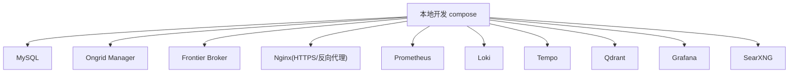
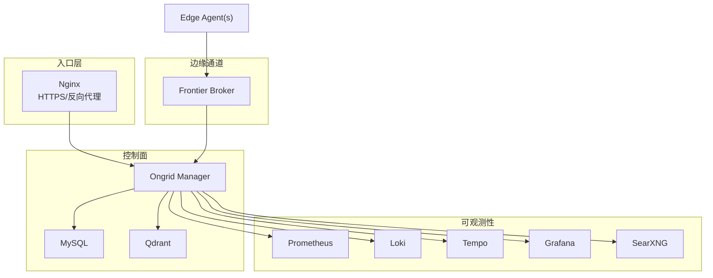
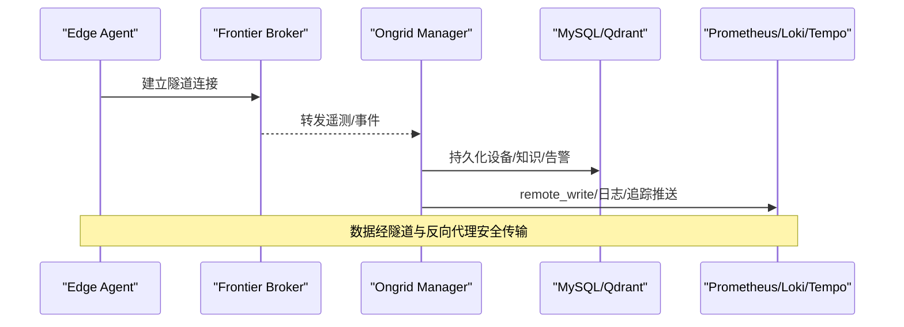

# 部署方式

<cite>
**本文引用的文件**   
- [deploy/docker-compose.yml](file://deploy/docker-compose.yml)
- [deploy/install/docker-compose.yml](file://deploy/install/docker-compose.yml)
- [deploy/install/.env.example](file://deploy/install/.env.example)
- [deploy/install/install.sh](file://deploy/install/install.sh)
- [deploy/README.md](file://deploy/README.md)
- [deploy/kubernetes/ongrid-edge/Chart.yaml](file://deploy/kubernetes/ongrid-edge/Chart.yaml)
- [deploy/kubernetes/ongrid-edge/values.yaml](file://deploy/kubernetes/ongrid-edge/values.yaml)
- [deploy/kubernetes/ongrid-edge/templates/daemonset.yaml](file://deploy/kubernetes/ongrid-edge/templates/daemonset.yaml)
- [deploy/kubernetes/ongrid-edge/templates/deployment.yaml](file://deploy/kubernetes/ongrid-edge/templates/deployment.yaml)
- [deploy/kubernetes/ongrid-edge/templates/configmap.yaml](file://deploy/kubernetes/ongrid-edge/templates/configmap.yaml)
- [docs/install/edge.md](file://docs/install/edge.md)
</cite>

## 目录
1. [简介](#简介)
2. [项目结构](#项目结构)
3. [核心组件](#核心组件)
4. [架构总览](#架构总览)
5. [详细组件分析](#详细组件分析)
6. [依赖关系分析](#依赖关系分析)
7. [性能与容量建议](#性能与容量建议)
8. [故障排查指南](#故障排查指南)
9. [结论](#结论)
10. [附录：配置清单与最佳实践](#附录配置清单与最佳实践)

## 简介
本指南面向不同场景的部署需求，覆盖以下四种部署方式：
- Docker Compose 本地开发环境搭建（服务编排、环境变量、数据卷）
- Kubernetes Helm Charts 生产环境部署（Chart 结构、Values 配置、集群适配）
- 传统服务器安装（依赖检查、脚本执行、服务配置）
- 边缘节点部署（Edge Agent 安装、配置、与云端连接建立）

每种方式均包含适用场景、前置条件、关键配置示例路径、以及常见问题定位方法。

## 项目结构
部署相关资源集中在 deploy 目录：
- docker-compose.yml：本地开发用，包含 MySQL、Manager、Frontier、Nginx、Prometheus、Loki、Tempo、Qdrant、Grafana、SearXNG 等
- install/：生产级一键安装包，含 install.sh、docker-compose.yml、.env.example、配置文件与 Edge 资产准备逻辑
- kubernetes/ongrid-edge：Kubernetes 边缘节点与控制器 Helm Chart，包含 DaemonSet、Deployment、ConfigMap、Secret、RBAC 等模板
- docs/install/edge.md：边缘节点安装与排错文档

图表来源
- [deploy/docker-compose.yml:13-368](file://deploy/docker-compose.yml#L13-L368)

章节来源
- [deploy/README.md:1-130](file://deploy/README.md#L1-L130)
- [deploy/docker-compose.yml:1-405](file://deploy/docker-compose.yml#L1-L405)

## 核心组件
- Ongrid Manager：业务主服务，负责设备管理、AIOps、告警、知识库、遥测接入等
- Frontier Broker：边缘隧道上游代理，Manager 通过容器网络访问其服务端口；边缘侧通过公网端口拨入
- Nginx：TLS 终止、前端 SPA、/api 反向代理、对外暴露 HTTPS/HTTP 重定向
- 存储与可观测性：MySQL、Prometheus、Loki、Tempo、Qdrant、Grafana、SearXNG
- Edge Agent：运行在目标主机或 Kubernetes 节点上，采集指标/日志/追踪并上报到云端

章节来源
- [deploy/docker-compose.yml:39-185](file://deploy/docker-compose.yml#L39-L185)
- [deploy/docker-compose.yml:214-368](file://deploy/docker-compose.yml#L214-L368)
- [deploy/install/docker-compose.yml:52-271](file://deploy/install/docker-compose.yml#L52-L271)

## 架构总览
下图展示本地开发与生产安装的统一拓扑：Nginx 作为入口，Manager 对接数据库与向量库，Frontier 提供边缘隧道，Prometheus/Loki/Tempo/Grafana 构成可观测性栈。

图表来源
- [deploy/docker-compose.yml:13-368](file://deploy/docker-compose.yml#L13-L368)
- [deploy/install/docker-compose.yml:21-528](file://deploy/install/docker-compose.yml#L21-L528)

## 详细组件分析

### Docker Compose 本地开发环境
- 适用场景：快速验证功能、联调、演示；非生产
- 前置条件：Docker + Compose v2；可选 host-gateway 支持
- 关键服务与端口：
  - MySQL：容器内健康检查后启动 Manager
  - Manager：默认 HTTP :8080（compose 不对外），Metrics :9100
  - Nginx：对外 443/80（可通过变量映射）
  - Frontier：对外 40012（边缘隧道）
  - Prometheus：对外 9090（仅本地）
  - Grafana：对外 3000（仅本地）
- 环境变量要点（节选）：
  - JWT、密钥、OpenAI/嵌入模型、Prometheus URL、Grafana 内部地址、通知渠道开关等
- 数据卷：
  - MySQL、Prometheus、Loki、Tempo、Qdrant、Grafana 使用命名卷或宿主目录挂载
  - Manager 工作区、技能包、工具链、PCAP 对象持久化到宿主目录
- 编排依赖：
  - Manager 等待 MySQL 健康检查通过后启动
  - Grafana 依赖 Prometheus/Loki/Tempo
- 注意事项：
  - 本地 compose 无 TLS、弱口令、无速率限制，仅供本地开发
  - 如需 SQLite 模式，可在 compose 中切换并注释掉 MySQL 服务

章节来源
- [deploy/docker-compose.yml:13-185](file://deploy/docker-compose.yml#L13-L185)
- [deploy/docker-compose.yml:187-368](file://deploy/docker-compose.yml#L187-L368)
- [deploy/docker-compose.yml:394-405](file://deploy/docker-compose.yml#L394-L405)
- [deploy/README.md:14-130](file://deploy/README.md#L14-L130)

### Kubernetes Helm Charts 生产环境部署
- 适用场景：在 Kubernetes 集群中部署边缘节点与控制器，实现集群级采集、遥测网关与自动扩缩容
- Chart 结构：
  - Chart.yaml：应用类型、版本信息
  - values.yaml：集中式配置项（mode、manager、enrollment、image、node/controller/kubeStateMetrics/telemetryGateway 等）
  - templates：DaemonSet（节点）、Deployment（控制器）、ConfigMap、Secret、RBAC、Telemetry Gateway Service/PodDisruptionBudget 等
- 关键 Values 说明（节选）：
  - mode：full-node（当前唯一受支持）
  - manager.publicURL/tunnelAddr：管理器公网地址与隧道地址
  - enrollment.clusterID/bootstrapToken：注册令牌
  - image.repository/tag/pullPolicy/architecture：镜像仓库与拉取策略
  - node.collectorMode/resources/tolerations：节点采集器模式与资源配额
  - controller.replicas：固定为 1（尚未实现 leader election）
  - kubeStateMetrics.enabled/image/port：是否启用及镜像端口
  - telemetryGateway.mode/reloadInterval/autoscaling：遥测网关模式与弹性伸缩
  - podSecurity.runAsNonRoot/runAsUser/fsGroup：安全上下文
- 模板要点：
  - DaemonSet 以 hostNetwork/hostPID 运行，chroot 进入宿主根文件系统，注入服务账户令牌与 CA
  - Deployment 为控制器，读取 ConfigMap/Secret 中的运行时配置，支持嵌入式或独立 Telemetry Gateway
  - ConfigMap 输出模式、管理器地址、指标采集间隔/超时/批大小等
- 集群适配建议：
  - 根据集群架构设置 image.architecture 与 nodeSelector
  - 若集群未提供 metrics-server，需关闭 autoscaling
  - 对敏感信息使用 Secret 管理，避免明文写入 Pod spec

章节来源
- [deploy/kubernetes/ongrid-edge/Chart.yaml:1-7](file://deploy/kubernetes/ongrid-edge/Chart.yaml#L1-L7)
- [deploy/kubernetes/ongrid-edge/values.yaml:1-188](file://deploy/kubernetes/ongrid-edge/values.yaml#L1-L188)
- [deploy/kubernetes/ongrid-edge/templates/daemonset.yaml:1-188](file://deploy/kubernetes/ongrid-edge/templates/daemonset.yaml#L1-L188)
- [deploy/kubernetes/ongrid-edge/templates/deployment.yaml:1-193](file://deploy/kubernetes/ongrid-edge/templates/deployment.yaml#L1-L193)
- [deploy/kubernetes/ongrid-edge/templates/configmap.yaml:1-47](file://deploy/kubernetes/ongrid-edge/templates/configmap.yaml#L1-L47)

### 传统服务器安装（单主机生产）
- 适用场景：将整套栈部署到一台 VPS/物理机，具备持久化数据、TLS 终止、统一入口
- 前置条件：
  - 系统支持 systemd（用于 Edge Agent 服务）
  - Docker + Compose v2（install.sh 会尝试自动安装）
  - 开放必要端口：HTTPS/HTTP 重定向、Tunnel 端口、Metrics 端口
- 安装流程概览：
  - 解压发布包后执行 sudo ./install.sh
  - 自动检测发行版并尝试安装 Docker（优先 get.docker.com，失败回退到发行版包管理器）
  - 准备 Edge 资产（预取或内置二进制，校验 checksum，构建 bundle）
  - 复制 compose、frontier、prometheus、loki/tempo/grafana/searxng 配置到安装目录
  - 创建数据目录并按各服务 uid chown（mysql/prometheus/loki/tempo/grafana/qdrant）
  - 生成自签证书（可替换为可信证书）
  - 生成 .env（随机密码、JWT、管理员账号、Grafana 管理员密码等）
  - 启动 compose 栈
- 环境变量与配置：
  - 参考 .env.example 设置端口、数据目录、数据库密码、JWT、公共 URL、嵌入模型、通知渠道等
  - 关键路径：install.sh 会写入 /opt/ongrid/.env 并据此拉起服务
- 升级与回滚：
  - 支持 apply-pending-upgrade.sh 进行远程升级（Edge Agent 侧）
  - 安装过程原子替换 edge 目录，失败时回滚备份
- 注意事项：
  - 旧版 named volumes 需要迁移到宿主目录（install.sh 会提示）
  - 确保防火墙放行所需端口，且公网可达

章节来源
- [deploy/install/install.sh:1-800](file://deploy/install/install.sh#L1-L800)
- [deploy/install/.env.example:1-217](file://deploy/install/.env.example#L1-L217)
- [deploy/install/docker-compose.yml:1-528](file://deploy/install/docker-compose.yml#L1-L528)

### 边缘节点部署（Edge Agent）
- 适用场景：将受管主机或 Kubernetes 节点接入云端，采集指标/日志/追踪并上报
- 两种部署形态：
  - 裸机/虚拟机：通过 install-edge.sh 安装为 systemd 服务
  - Kubernetes：通过 Helm Chart 部署 DaemonSet（节点）与 Deployment（控制器）
- 裸机安装要点：
  - 从云端 Devices 页面生成安装命令，传入 access-key/secret-key/server-edge-addr/server-http-addr
  - 脚本自动下载匹配 OS/Arch 的二进制，安装插件（otelcol-contrib、node_exporter、process_exporter、数据库导出器等）
  - 渲染 ongrid-edge.env（云地址、AccessKey、SecretKey），创建 systemd unit 并重启服务
  - 自检：插件二进制存在性、状态目录可写、journald 可读
- 连接建立与验证：
  - 日志中出现 tunnel: connected 表示成功
  - 设备在 Web UI Devices 页面可见
- Kubernetes 部署要点：
  - 通过 Helm values 配置 mode、manager.publicURL/tunnelAddr、enrollment tokens、镜像仓库与架构
  - DaemonSet 以 hostNetwork/hostPID 运行，chroot 进入宿主根文件系统，注入服务账户令牌与 CA
  - 控制器 Deployment 负责清单同步、指标采集、遥测网关集成
- 注意事项：
  - 同一主机同时运行控制面与边缘时，使用 127.0.0.1 避免 hairpin NAT 问题
  - Tunnel 端口默认 40012，使用明文 TCP；TLS 由入口 Nginx 处理

章节来源
- [docs/install/edge.md:1-119](file://docs/install/edge.md#L1-L119)
- [deploy/install/edge/install-edge.sh:1-369](file://deploy/install/edge/install-edge.sh#L1-L369)
- [deploy/kubernetes/ongrid-edge/templates/daemonset.yaml:1-188](file://deploy/kubernetes/ongrid-edge/templates/daemonset.yaml#L1-L188)
- [deploy/kubernetes/ongrid-edge/templates/deployment.yaml:1-193](file://deploy/kubernetes/ongrid-edge/templates/deployment.yaml#L1-L193)

## 依赖关系分析
- 服务间依赖：
  - Manager 依赖 MySQL（健康检查）、Qdrant（知识库）、Prometheus/Loki/Tempo（遥测）
  - Grafana 依赖 Prometheus/Loki/Tempo
  - Nginx 反向代理 Manager API 与前端 SPA
  - Frontier 作为边缘隧道上游，Manager 通过容器网络访问
- 数据流向：
  - Edge Agent → Frontier → Manager → 存储与可观测性后端
  - 管理者通过 Nginx 访问 Web UI 与 API
- 外部依赖：
  - OpenAI/第三方 LLM（可选）
  - 通知渠道（Webhook/Slack/飞书/钉钉，可选）
  - 嵌入模型（本地 ONNX 或远程 API）

图表来源
- [deploy/docker-compose.yml:13-368](file://deploy/docker-compose.yml#L13-L368)
- [deploy/install/docker-compose.yml:21-528](file://deploy/install/docker-compose.yml#L21-L528)

章节来源
- [deploy/docker-compose.yml:13-368](file://deploy/docker-compose.yml#L13-L368)
- [deploy/install/docker-compose.yml:21-528](file://deploy/install/docker-compose.yml#L21-L528)

## 性能与容量建议
- 存储：
  - 将 MySQL/Prometheus/Loki/Tempo/Grafana 数据目录指向高性能磁盘或外部存储（NFS/iSCSI/NVMe）
  - 合理设置 retention（Prometheus 默认 90d/20GB）
- 资源配额：
  - 为 Controller/Telemetry Gateway 设置 requests/limits，必要时启用 HPA
  - 控制器副本数固定为 1（尚未实现 leader election）
- 网络：
  - 确保 Tunnel 端口可达，避免 hairpin NAT 问题
  - 使用可信证书替代自签证书
- 可观测性：
  - 开启 Prometheus remote_write，便于 AIops 查询
  - 配置 Loki/Tempo 数据源至 Grafana，便于统一查看

[本节为通用指导，无需特定文件引用]

## 故障排查指南
- 安装阶段：
  - Docker 未安装或不可达：install.sh 会尝试自动安装，失败则提示手动安装
  - 缺少 Edge 资产：检查 edge/ 目录是否存在 fetch/build 脚本与二进制
  - 权限问题：install.sh 会为各服务数据目录 chown 对应 uid
- 启动阶段：
  - MySQL 健康检查失败：检查数据库初始化与凭据
  - Manager 无法连接 Qdrant/Prometheus/Loki/Tempo：检查网络与端口
  - Nginx 证书问题：确认 certs/ 目录存在有效证书
- 边缘连接：
  - 查看 journalctl -u ongrid-edge -f，寻找 tunnel: connected
  - 确认 server-edge-addr 与端口正确，同主机安装时使用 127.0.0.1
- Kubernetes：
  - 检查 ConfigMap/Secret 是否正确注入
  - 检查 Node 是否满足 tolerations/nodeSelector
  - 若 metrics-server 缺失，关闭 Telemetry Gateway autoscaling

章节来源
- [deploy/install/install.sh:307-389](file://deploy/install/install.sh#L307-L389)
- [deploy/install/install.sh:536-635](file://deploy/install/install.sh#L536-L635)
- [docs/install/edge.md:105-119](file://docs/install/edge.md#L105-L119)
- [deploy/kubernetes/ongrid-edge/values.yaml:125-188](file://deploy/kubernetes/ongrid-edge/values.yaml#L125-L188)

## 结论
本项目提供了从本地开发到生产部署的完整能力：
- 本地开发：使用 deploy/docker-compose.yml 快速拉起全栈
- 生产单机：使用 install.sh 一键安装，具备 TLS、持久化、可观测性
- Kubernetes：通过 Helm Chart 部署边缘节点与控制器，支持遥测网关与弹性伸缩
- 边缘节点：支持裸机与 K8s 两种形态，提供批量安装与自检

建议在生产环境中：
- 使用可信证书与强密码
- 将数据目录指向可靠存储
- 合理配置资源配额与保留策略
- 启用遥测与告警，完善监控体系

[本节为总结，无需特定文件引用]

## 附录：配置清单与最佳实践
- 环境变量关键项（生产 .env 示例路径）：
  - 端口：ONGRID_HTTP_PORT、ONGRID_HTTP_REDIRECT_PORT、ONGRID_TUNNEL_PORT、PROM_PORT
  - 数据库：MYSQL_ROOT_PASSWORD、MYSQL_PASSWORD
  - 认证：ONGRID_JWT_SECRET、GRAFANA_ADMIN_USER、GRAFANA_ADMIN_PASSWORD
  - 公开地址：ONGRID_PUBLIC_URL、ONGRID_TUNNEL_ADDR
  - 可观测性：ONGRID_PROM_ENABLED、ONGRID_PROM_URL、ONGRID_LOG_URL、ONGRID_TRACE_QUERY_URL
  - 通知渠道：各渠道 ENABLED/URL/SECRET
- 最佳实践：
  - 首次登录：设置管理员邮箱与密码，或在 .env 中预置
  - 数据迁移：旧 named volumes 需迁移到宿主目录
  - 升级：使用 apply-pending-upgrade.sh 进行远程升级
  - 安全：定期轮换密钥，使用可信证书，最小化端口暴露

章节来源
- [deploy/install/.env.example:1-217](file://deploy/install/.env.example#L1-L217)
- [deploy/install/install.sh:683-800](file://deploy/install/install.sh#L683-L800)
- [deploy/install/docker-compose.yml:21-528](file://deploy/install/docker-compose.yml#L21-L528)