# 动态配置更新

<cite>
**本文引用的文件**
- [internal/manager/biz/setting/service.go](file://internal/manager/biz/setting/service.go)
- [internal/manager/server/setting/http.go](file://internal/manager/server/setting/http.go)
- [internal/manager/biz/setting/llm_probe.go](file://internal/manager/biz/setting/llm_probe.go)
- [internal/manager/service/systemhealth/service.go](file://internal/manager/service/systemhealth/service.go)
- [internal/pkg/tenantctx/tenantctx.go](file://internal/pkg/tenantctx/tenantctx.go)
- [internal/manager/biz/aiops/tools/config_tools.go](file://internal/manager/biz/aiops/tools/config_tools.go)
- [internal/skill/builtin/probe_http.go](file://internal/skill/builtin/probe_http.go)
- [internal/skill/builtin/probe_ping.go](file://internal/skill/builtin/probe_ping.go)
- [internal/manager/model/audit/log.go](file://internal/manager/model/audit/log.go)
- [internal/manager/biz/audit/usecase.go](file://internal/manager/biz/audit/usecase.go)
- [deploy/install/apply-pending-upgrade.sh](file://deploy/install/apply-pending-upgrade.sh)
- [scripts/test-apply-pending-upgrade.sh](file://scripts/test-apply-pending-upgrade.sh)
</cite>

## 目录
1. [简介](#简介)
2. [项目结构](#项目结构)
3. [核心组件](#核心组件)
4. [架构总览](#架构总览)
5. [详细组件分析](#详细组件分析)
6. [依赖关系分析](#依赖关系分析)
7. [性能考量](#性能考量)
8. [故障排查指南](#故障排查指南)
9. [结论](#结论)
10. [附录](#附录)

## 简介
本技术文档面向“动态配置更新系统”，围绕运行时配置的热更新、配置探针（Probe）健康检查、版本管理与回滚、多租户隔离与权限控制、API 接口与使用示例、冲突检测与解决策略，以及变更审计日志等主题进行系统化说明。该系统基于管理器侧的键值型设置存储、LLM 配置探测、系统健康检查、可观测性探针与安装器回滚机制，提供安全、可观测、可回滚的动态配置能力。

## 项目结构
与动态配置相关的关键路径与职责：
- 设置服务与缓存：internal/manager/biz/setting/service.go
- 设置 API 路由与鉴权：internal/manager/server/setting/http.go
- LLM 配置探测与保存边界：internal/manager/biz/setting/llm_probe.go
- 系统健康检查（含 LLM/Prometheus/Grafana/Loki/Tempo 等）：internal/manager/service/systemhealth/service.go
- 请求上下文中的租户/用户信息：internal/pkg/tenantctx/tenantctx.go
- AI 工具驱动的“草案-确认-应用”配置变更流程：internal/manager/biz/aiops/tools/config_tools.go
- 通用网络探针技能（HTTP/Ping）：internal/skill/builtin/probe_http.go, internal/skill/builtin/probe_ping.go
- 审计日志模型与查询：internal/manager/model/audit/log.go, internal/manager/biz/audit/usecase.go
- 边缘端升级与回滚脚本：deploy/install/apply-pending-upgrade.sh, scripts/test-apply-pending-upgrade.sh

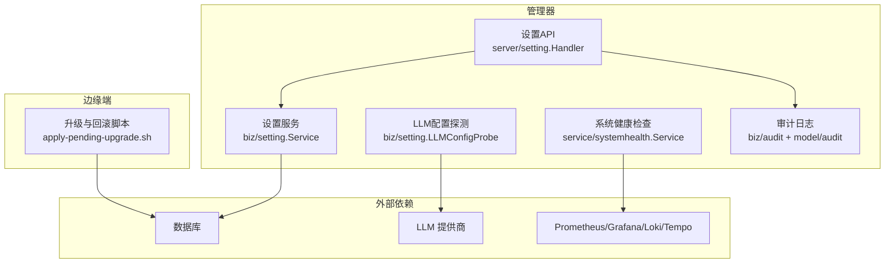

**图示来源**
- [internal/manager/biz/setting/service.go:1-259](file://internal/manager/biz/setting/service.go#L1-L259)
- [internal/manager/server/setting/http.go:35-234](file://internal/manager/server/setting/http.go#L35-L234)
- [internal/manager/biz/setting/llm_probe.go:1-493](file://internal/manager/biz/setting/llm_probe.go#L1-L493)
- [internal/manager/service/systemhealth/service.go:1-200](file://internal/manager/service/systemhealth/service.go#L1-L200)
- [internal/manager/model/audit/log.go:49-76](file://internal/manager/model/audit/log.go#L49-L76)
- [deploy/install/apply-pending-upgrade.sh:123-161](file://deploy/install/apply-pending-upgrade.sh#L123-L161)

**章节来源**
- [internal/manager/biz/setting/service.go:1-259](file://internal/manager/biz/setting/service.go#L1-L259)
- [internal/manager/server/setting/http.go:35-234](file://internal/manager/server/setting/http.go#L35-L234)
- [internal/manager/biz/setting/llm_probe.go:1-493](file://internal/manager/biz/setting/llm_probe.go#L1-L493)
- [internal/manager/service/systemhealth/service.go:1-200](file://internal/manager/service/systemhealth/service.go#L1-L200)
- [internal/manager/model/audit/log.go:49-76](file://internal/manager/model/audit/log.go#L49-L76)
- [deploy/install/apply-pending-upgrade.sh:123-161](file://deploy/install/apply-pending-upgrade.sh#L123-L161)

## 核心组件
- 设置服务（Setting Service）
  - 提供内存缓存（按 category|key 索引），读路径命中则直接返回；写路径写入后失效对应缓存项，保证并发安全。
  - 支持批量写入（SetBatch），在事务提交后再统一失效缓存，避免部分持久化导致的脏状态。
  - 列表返回时对敏感字段进行掩码处理，仅通过 reveal 接口由管理员读取明文。
- 设置 API（Setting HTTP Handler）
  - 暴露 /v1/system-settings 的 CRUD 与 reveal 接口；写操作需 admin 角色；读操作对已认证用户开放但敏感值始终掩码。
  - 写成功后记录审计事件（包含资源标识、敏感标记与值提示）。
- LLM 配置探测（LLM Config Probe）
  - 对未保存的配置草稿进行校验与连通性测试，覆盖 DNS/TLS/鉴权/配额/限流/超时/模型不存在等错误分类。
  - 保存时原子写入 provider 元数据（API Key/BaseURL/默认模型/模型列表），空 API Key 表示禁用。
- 系统健康检查（System Health）
  - 聚合数据库、Prometheus、Grafana、Loki、Tempo、Qdrant、Frontier、告警、边缘节点、LLM/Embedding 等健康探针。
  - 每个探针带超时保护与状态汇总（ok/degraded/failed/unknown）。
- 审计日志（Audit Log）
  - 统一的变更审计模型与查询能力，支持按时间范围、资源类型、动作过滤，用于 RCA 与合规审计。
- 边缘端升级与回滚
  - 通过 bundle apply 流程将新版本暂存并替换目标文件；健康标记确认后清理回滚副本；失败时自动恢复 previous 或移除新增目标。

**章节来源**
- [internal/manager/biz/setting/service.go:49-165](file://internal/manager/biz/setting/service.go#L49-L165)
- [internal/manager/server/setting/http.go:43-190](file://internal/manager/server/setting/http.go#L43-L190)
- [internal/manager/biz/setting/llm_probe.go:56-180](file://internal/manager/biz/setting/llm_probe.go#L56-L180)
- [internal/manager/service/systemhealth/service.go:132-200](file://internal/manager/service/systemhealth/service.go#L132-L200)
- [internal/manager/model/audit/log.go:49-76](file://internal/manager/model/audit/log.go#L49-L76)
- [deploy/install/apply-pending-upgrade.sh:123-161](file://deploy/install/apply-pending-upgrade.sh#L123-L161)

## 架构总览
下图展示了从 API 到服务层、存储层、外部依赖与健康检查的整体交互。

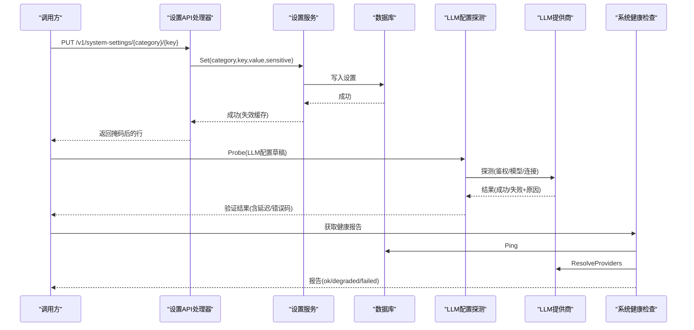

**图示来源**
- [internal/manager/server/setting/http.go:81-137](file://internal/manager/server/setting/http.go#L81-L137)
- [internal/manager/biz/setting/service.go:108-165](file://internal/manager/biz/setting/service.go#L108-L165)
- [internal/manager/biz/setting/llm_probe.go:128-180](file://internal/manager/biz/setting/llm_probe.go#L128-L180)
- [internal/manager/service/systemhealth/service.go:132-200](file://internal/manager/service/systemhealth/service.go#L132-L200)

## 详细组件分析

### 设置服务与缓存（Setting Service）
- 设计要点
  - 进程内缓存以 (category|key) 为键，读路径先查缓存再落库；写路径落库后删除对应缓存项，确保后续读命中最新值。
  - 批量写入 SetBatch 在事务提交后才失效缓存，避免部分写入导致的不一致。
  - 列表响应中敏感字段按策略掩码（保留首尾若干字符），防止密钥泄露。
- 复杂度与并发
  - 缓存 map + RWMutex，典型工作负载下优于 sync.Map；设置表规模较小，适合该方案。
- 扩展点
  - 未来多租户可在缓存键前缀加入 org_id，实现租户级隔离。

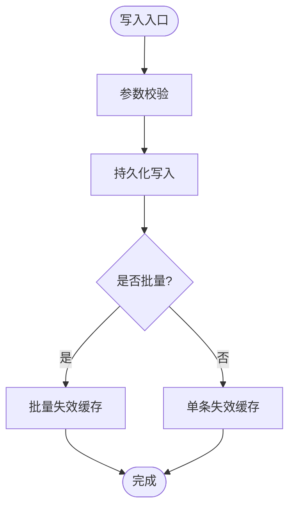

**图示来源**
- [internal/manager/biz/setting/service.go:108-165](file://internal/manager/biz/setting/service.go#L108-L165)

**章节来源**
- [internal/manager/biz/setting/service.go:49-165](file://internal/manager/biz/setting/service.go#L49-L165)

### 设置 API（Setting HTTP Handler）
- 路由
  - GET /v1/system-settings?category=... 列出设置（敏感值掩码）
  - PUT /v1/system-settings/{category}/{key} 更新设置（需 admin）
  - DELETE /v1/system-settings/{category}/{key} 删除设置（需 admin）
  - GET /v1/system-settings/{category}/{key}/reveal 读取明文（需 admin）
- 鉴权与审计
  - 写操作强制要求 admin 角色；所有写操作记录审计事件（包含资源标识、敏感标记与值提示）。
- 错误处理
  - 统一错误体 {error, code}，映射标准错误码（unauthorized/forbidden/not-found/invalid/internal）。

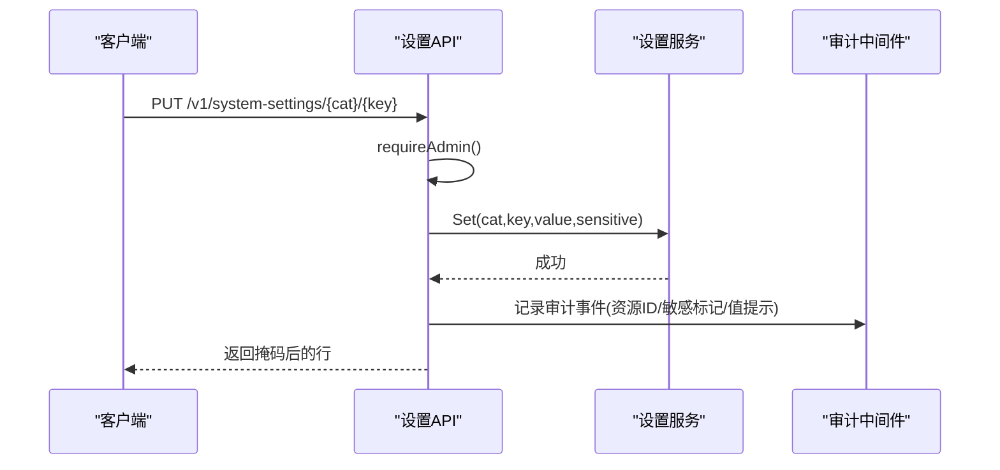

**图示来源**
- [internal/manager/server/setting/http.go:43-190](file://internal/manager/server/setting/http.go#L43-L190)

**章节来源**
- [internal/manager/server/setting/http.go:43-190](file://internal/manager/server/setting/http.go#L43-L190)

### LLM 配置探测（LLM Config Probe）
- 功能
  - 对未保存的 LLM 配置草稿进行输入校验（provider、BaseURL、模型列表、长度限制等）。
  - 执行端到端连通性测试（DNS/TLS/鉴权/配额/限流/超时/模型不存在/上游错误等），并给出稳定错误码。
  - Save 时原子写入 provider 元数据；空 API Key 视为禁用，跳过上游调用。
- 错误分类
  - 将网络、TLS、鉴权、配额、限流、超时、模型不存在、上游不可用等错误归类为稳定 code，便于前端本地化提示。
- 安全
  - 探测详情中对 API Key 进行脱敏；限制 detail 长度，避免过长输出。

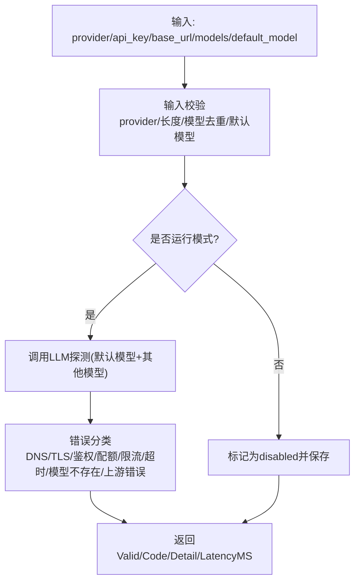

**图示来源**
- [internal/manager/biz/setting/llm_probe.go:205-331](file://internal/manager/biz/setting/llm_probe.go#L205-L331)
- [internal/manager/biz/setting/llm_probe.go:368-453](file://internal/manager/biz/setting/llm_probe.go#L368-L453)

**章节来源**
- [internal/manager/biz/setting/llm_probe.go:56-180](file://internal/manager/biz/setting/llm_probe.go#L56-L180)
- [internal/manager/biz/setting/llm_probe.go:205-331](file://internal/manager/biz/setting/llm_probe.go#L205-L331)
- [internal/manager/biz/setting/llm_probe.go:368-453](file://internal/manager/biz/setting/llm_probe.go#L368-L453)

### 系统健康检查（System Health）
- 探针集合
  - Manager API、Database、Prometheus、Grafana、Loki、Tempo、Qdrant、Frontier、Alerts、Edges、LLM、Embedding。
- 行为
  - 每个探针带超时保护；汇总统计 ok/degraded/failed/unknown，整体状态取最高严重级别。
- 与配置的关系
  - LLM/Embedding 探针依据配置是否启用与解析结果判断健康度；Prometheus 通过查询 up 指标验证连通性。

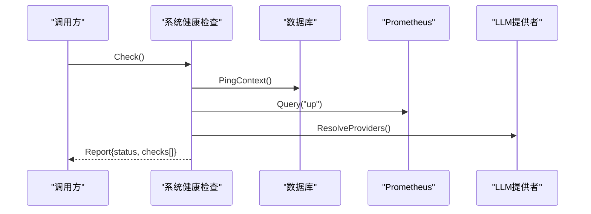

**图示来源**
- [internal/manager/service/systemhealth/service.go:132-200](file://internal/manager/service/systemhealth/service.go#L132-L200)
- [internal/manager/service/systemhealth/service.go:356-386](file://internal/manager/service/systemhealth/service.go#L356-L386)

**章节来源**
- [internal/manager/service/systemhealth/service.go:132-200](file://internal/manager/service/systemhealth/service.go#L132-L200)
- [internal/manager/service/systemhealth/service.go:356-386](file://internal/manager/service/systemhealth/service.go#L356-L386)

### 通用网络探针（Skill Probes）
- HTTP 探针
  - 支持 GET/HEAD，可配置超时；返回状态码、耗时、内容长度与错误信息。
- Ping 探针
  - 调用系统 ping 命令，封装退出码、耗时、stdout/stderr 与错误信息；限制 count 与 timeout 范围。

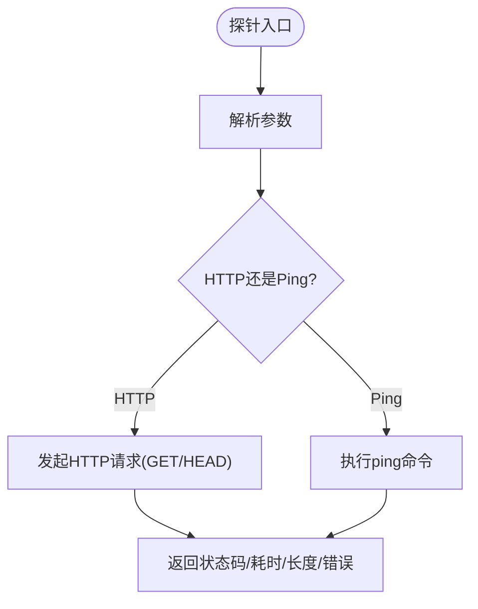

**图示来源**
- [internal/skill/builtin/probe_http.go:49-99](file://internal/skill/builtin/probe_http.go#L49-L99)
- [internal/skill/builtin/probe_ping.go:45-124](file://internal/skill/builtin/probe_ping.go#L45-L124)

**章节来源**
- [internal/skill/builtin/probe_http.go:49-99](file://internal/skill/builtin/probe_http.go#L49-L99)
- [internal/skill/builtin/probe_ping.go:45-124](file://internal/skill/builtin/probe_ping.go#L45-L124)

### 配置版本管理与回滚策略
- 边缘端升级与回滚
  - 将新版本打包至 incoming 目录，应用时按清单写入 .new 目标；健康标记匹配后提交并清理 previous；失败时恢复 previous 或移除新增目标。
  - 多次启动会清理陈旧 staging 目录，同时保留手动回滚备份。
- 适用场景
  - 适用于二进制与插件的滚动更新；与配置热更新配合，确保配置与运行时一致性。

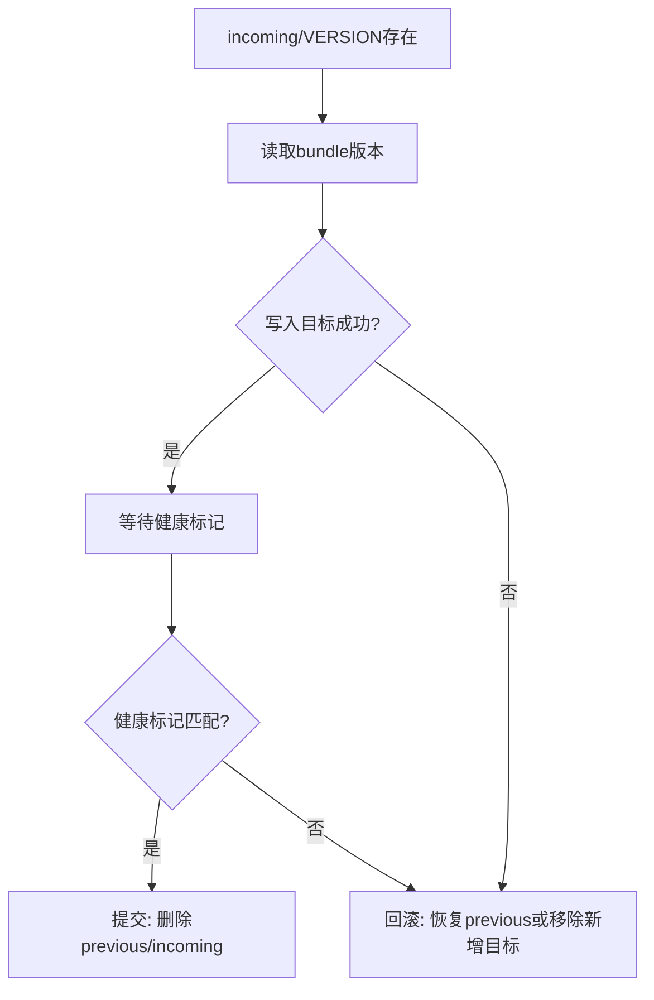

**图示来源**
- [deploy/install/apply-pending-upgrade.sh:123-161](file://deploy/install/apply-pending-upgrade.sh#L123-L161)
- [scripts/test-apply-pending-upgrade.sh:41-69](file://scripts/test-apply-pending-upgrade.sh#L41-L69)

**章节来源**
- [deploy/install/apply-pending-upgrade.sh:123-161](file://deploy/install/apply-pending-upgrade.sh#L123-L161)
- [scripts/test-apply-pending-upgrade.sh:41-69](file://scripts/test-apply-pending-upgrade.sh#L41-L69)

### 多租户环境下的配置隔离与权限控制
- 当前实现
  - 设置服务注释指出当前为扁平/单租户，缓存键为 (category|key)；未来可扩展为包含 org_id 的前缀以实现租户隔离。
  - 请求上下文 tenantctx 携带 UserID/Role/IsSuperuser，用于鉴权与审计。
- 权限控制
  - 写操作要求 admin 角色；列表读取对已认证用户开放但敏感值掩码；reveal 仅 admin 可读明文。
  - 授权中间件 authzmw 提供细粒度对象/动作控制（如 edge:*、alert:rule 等），可用于扩展配置资源的访问控制。

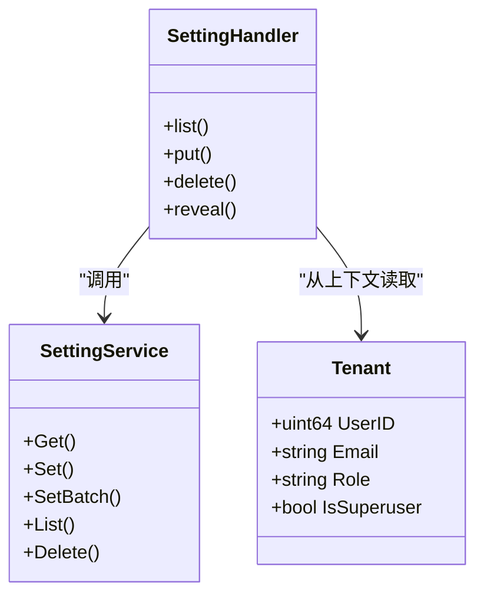

**图示来源**
- [internal/pkg/tenantctx/tenantctx.go:1-35](file://internal/pkg/tenantctx/tenantctx.go#L1-L35)
- [internal/manager/server/setting/http.go:216-234](file://internal/manager/server/setting/http.go#L216-L234)
- [internal/manager/biz/setting/service.go:1-259](file://internal/manager/biz/setting/service.go#L1-L259)

**章节来源**
- [internal/pkg/tenantctx/tenantctx.go:1-35](file://internal/pkg/tenantctx/tenantctx.go#L1-L35)
- [internal/manager/server/setting/http.go:216-234](file://internal/manager/server/setting/http.go#L216-L234)
- [internal/manager/biz/setting/service.go:1-259](file://internal/manager/biz/setting/service.go#L1-L259)

### 配置冲突检测与解决策略
- 冲突来源
  - 并发写同一 key 的场景；批量写入部分失败；LLM 配置草稿与实际保存不一致。
- 检测与解决
  - 设置服务 Set/SetBatch 在写后失效缓存，确保后续读命中最新值；SetBatch 在事务提交后才失效，避免部分持久化导致的脏状态。
  - LLM 配置保存采用原子写入 provider 元数据（API Key/BaseURL/默认模型/模型列表），空 API Key 作为禁用覆盖，避免残留无效凭据。
  - 建议结合版本号/生成号（如日志后端 generation）实现乐观锁式冲突检测与重试。

**章节来源**
- [internal/manager/biz/setting/service.go:108-165](file://internal/manager/biz/setting/service.go#L108-L165)
- [internal/manager/biz/setting/llm_probe.go:136-180](file://internal/manager/biz/setting/llm_probe.go#L136-L180)

### 配置变更的审计日志记录
- 审计模型
  - 统一 action 命名规范（动词_资源），具体差异通过 payload 承载；状态包括 success/failure/denied。
- 记录时机
  - 设置更新/删除均记录审计事件，包含资源标识、敏感标记与值提示（非明文）。
- 查询能力
  - 支持按时间范围、资源类型、动作过滤变更日志，辅助 RCA 与合规审计。

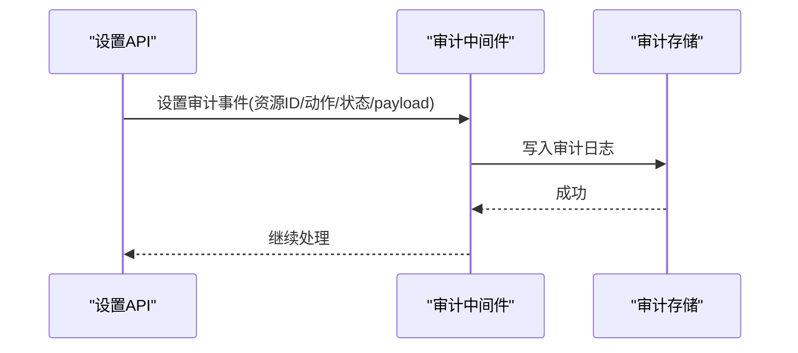

**图示来源**
- [internal/manager/server/setting/http.go:116-122](file://internal/manager/server/setting/http.go#L116-L122)
- [internal/manager/model/audit/log.go:49-76](file://internal/manager/model/audit/log.go#L49-L76)
- [internal/manager/biz/audit/usecase.go:118-147](file://internal/manager/biz/audit/usecase.go#L118-L147)

**章节来源**
- [internal/manager/server/setting/http.go:116-122](file://internal/manager/server/setting/http.go#L116-L122)
- [internal/manager/model/audit/log.go:49-76](file://internal/manager/model/audit/log.go#L49-L76)
- [internal/manager/biz/audit/usecase.go:118-147](file://internal/manager/biz/audit/usecase.go#L118-L147)

### AI 工具驱动的“草案-确认-应用”流程
- 工具
  - draft_change：生成配置变更提案（包含预览、差异、验证结果、回滚信息等）。
  - apply_change：在确认后进行实际变更，校验草案哈希与确认门控。
- 价值
  - 将高风险写操作拆分为“提案-确认-应用”三段式，降低误操作风险；结合审计日志与回滚机制提升安全性。

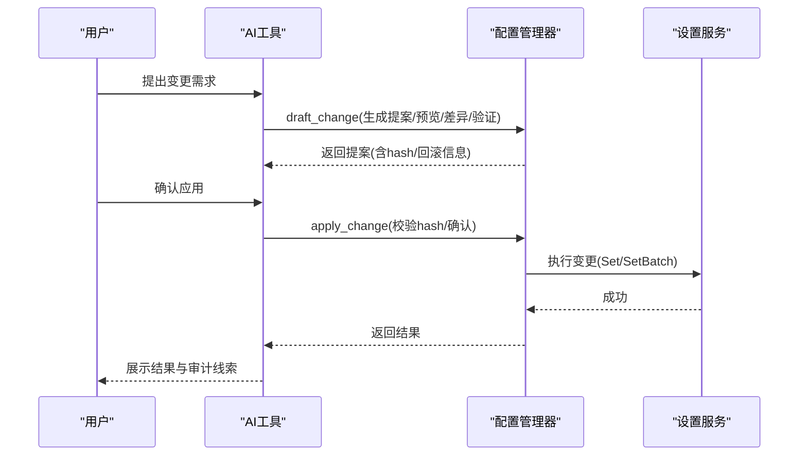

**图示来源**
- [internal/manager/biz/aiops/tools/config_tools.go:160-254](file://internal/manager/biz/aiops/tools/config_tools.go#L160-L254)

**章节来源**
- [internal/manager/biz/aiops/tools/config_tools.go:160-254](file://internal/manager/biz/aiops/tools/config_tools.go#L160-L254)

## 依赖关系分析
- 组件耦合
  - 设置 API 依赖设置服务；设置服务依赖存储仓库（未在本文展开）；LLM 配置探测依赖 llm 包；系统健康检查依赖多种外部能力（DB/Prom/Grafana/Loki/Tempo/LLM）。
- 外部依赖
  - LLM 提供商、Prometheus/Grafana/Loki/Tempo、数据库、边缘端升级脚本。
- 潜在循环依赖
  - 各组件通过接口解耦（如 PromQuerier、URLProbe、GrafanaTester），避免强耦合。

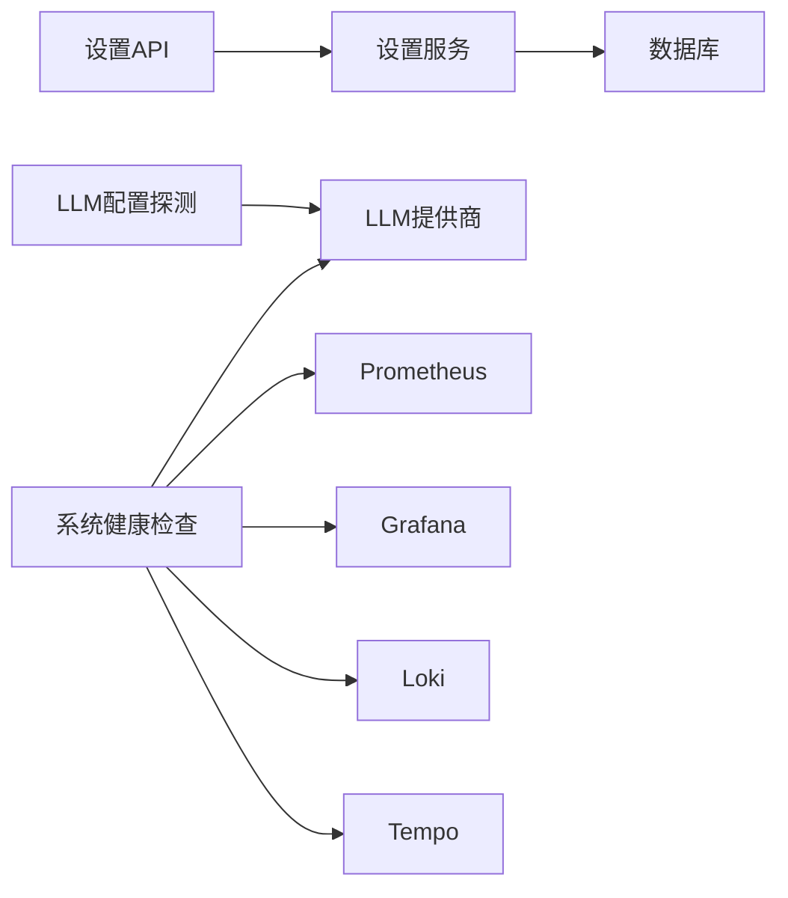

**图示来源**
- [internal/manager/server/setting/http.go:35-234](file://internal/manager/server/setting/http.go#L35-L234)
- [internal/manager/biz/setting/service.go:1-259](file://internal/manager/biz/setting/service.go#L1-L259)
- [internal/manager/biz/setting/llm_probe.go:1-493](file://internal/manager/biz/setting/llm_probe.go#L1-L493)
- [internal/manager/service/systemhealth/service.go:1-200](file://internal/manager/service/systemhealth/service.go#L1-L200)

**章节来源**
- [internal/manager/server/setting/http.go:35-234](file://internal/manager/server/setting/http.go#L35-L234)
- [internal/manager/biz/setting/service.go:1-259](file://internal/manager/biz/setting/service.go#L1-L259)
- [internal/manager/biz/setting/llm_probe.go:1-493](file://internal/manager/biz/setting/llm_probe.go#L1-L493)
- [internal/manager/service/systemhealth/service.go:1-200](file://internal/manager/service/systemhealth/service.go#L1-L200)

## 性能考量
- 设置服务缓存
  - 小表场景下 map+RWMutex 更高效；批量写入后统一失效缓存，减少重复计算。
- 探针超时
  - LLM 探测默认 20 秒超时；系统健康检查探针带全局超时配置，避免阻塞。
- 网络探针
  - HTTP/Ping 探针限制超时与计数，防止资源耗尽。
- 建议
  - 在高并发写场景下，优先使用 SetBatch；对热点 key 关注缓存命中率与失效策略。

[本节为通用指导，不直接分析具体文件]

## 故障排查指南
- 常见问题定位
  - LLM 配置失败：查看探测返回的 code 与 detail（鉴权/配额/限流/超时/模型不存在/上游错误）。
  - Prometheus 不可用：健康检查返回 failed，检查查询 up 指标是否成功。
  - 设置更新后未生效：确认缓存是否失效；必要时调用 InvalidateAll（谨慎使用）。
  - 边缘端升级失败：检查 incoming/VERSION 与健康标记；查看 previous 是否被恢复。
- 审计与回溯
  - 通过审计日志查询最近变更（时间范围、资源类型、动作），结合 payload 定位问题。
- 参考实现
  - 错误码映射与统一错误体；探针超时与状态汇总；回滚脚本逻辑。

**章节来源**
- [internal/manager/biz/setting/llm_probe.go:368-453](file://internal/manager/biz/setting/llm_probe.go#L368-L453)
- [internal/manager/service/systemhealth/service.go:388-442](file://internal/manager/service/systemhealth/service.go#L388-L442)
- [internal/manager/server/setting/http.go:237-280](file://internal/manager/server/setting/http.go#L237-L280)
- [deploy/install/apply-pending-upgrade.sh:123-161](file://deploy/install/apply-pending-upgrade.sh#L123-L161)
- [internal/manager/biz/audit/usecase.go:118-147](file://internal/manager/biz/audit/usecase.go#L118-L147)

## 结论
本系统通过“设置服务+缓存”、“LLM 配置探测”、“系统健康检查”、“审计日志”与“边缘端回滚脚本”的组合，实现了安全、可观测、可回滚的动态配置更新能力。建议在多租户落地时完善缓存键隔离与 RBAC 扩展，并结合“草案-确认-应用”流程与审计日志，进一步提升变更的安全性与可追溯性。

## 附录

### 配置更新 API 接口文档
- 列出设置
  - 方法：GET
  - 路径：/v1/system-settings
  - 查询参数：category（可选）
  - 响应：items[]（敏感值掩码）、total
  - 鉴权：已认证用户
- 更新设置
  - 方法：PUT
  - 路径：/v1/system-settings/{category}/{key}
  - 请求体：{value, sensitive?}
  - 响应：掩码后的行
  - 鉴权：admin
- 删除设置
  - 方法：DELETE
  - 路径：/v1/system-settings/{category}/{key}
  - 响应：204 No Content
  - 鉴权：admin
- 读取明文
  - 方法：GET
  - 路径：/v1/system-settings/{category}/{key}/reveal
  - 响应：{value}
  - 鉴权：admin

**章节来源**
- [internal/manager/server/setting/http.go:43-190](file://internal/manager/server/setting/http.go#L43-L190)

### 使用示例（概念性）
- 更新 LLM BaseURL
  - PUT /v1/system-settings/llm/base_url {"value":"https://api.example.com"}
  - 随后调用 LLM 配置探测验证连通性
- 禁用某 LLM Provider
  - PUT /v1/system-settings/llm/api_key {"value":"","sensitive":true}
  - 保存后返回 disabled 状态
- 查询健康报告
  - 调用系统健康检查接口，查看 LLM/Prometheus/Grafana 等探针状态

[本节为概念性示例，不直接分析具体文件]